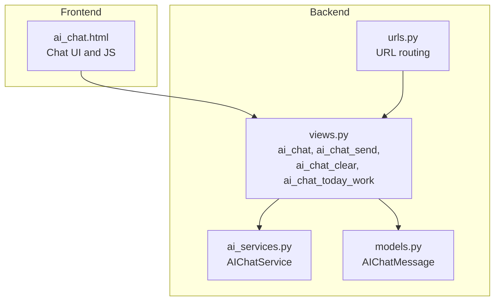
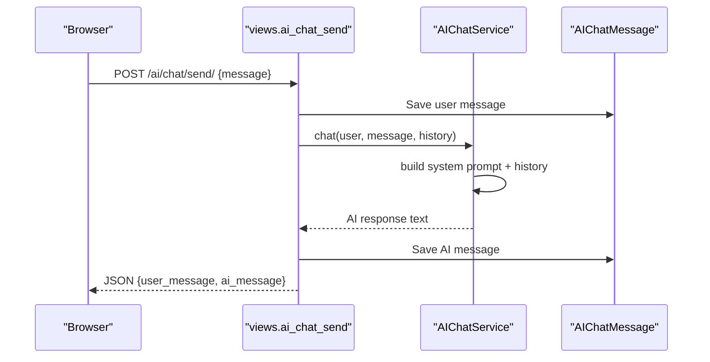
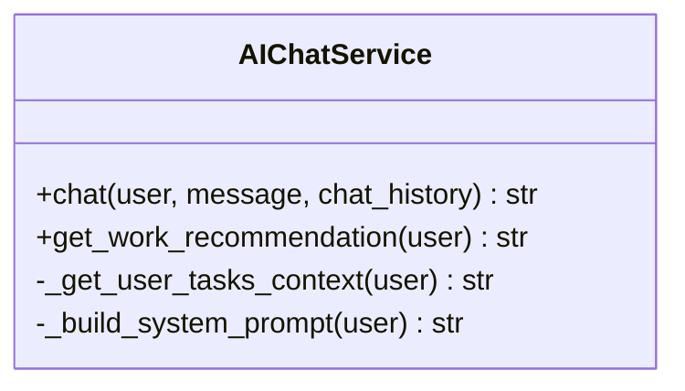
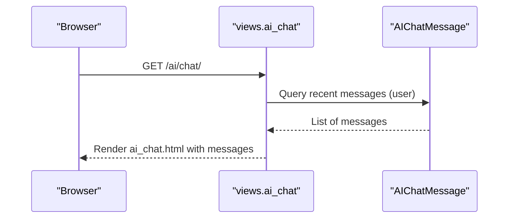
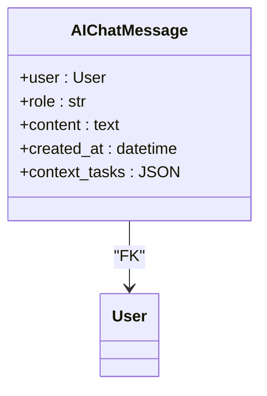
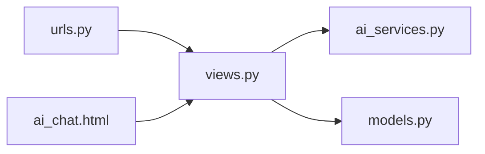

# AI Chat Assistant

<cite>
**Referenced Files in This Document**
- [ai_services.py](file://arva/ai_services.py)
- [views.py](file://arva/views.py)
- [models.py](file://arva/models.py)
- [urls.py](file://arva/urls.py)
- [ai_chat.html](file://arva/templates/arva/ai_chat.html)
- [0004_aichatmessage.py](file://arva/migrations/0004_aichatmessage.py)
</cite>

## Table of Contents
1. [Introduction](#introduction)
2. [Project Structure](#project-structure)
3. [Core Components](#core-components)
4. [Architecture Overview](#architecture-overview)
5. [Detailed Component Analysis](#detailed-component-analysis)
6. [Dependency Analysis](#dependency-analysis)
7. [Performance Considerations](#performance-considerations)
8. [Troubleshooting Guide](#troubleshooting-guide)
9. [Conclusion](#conclusion)

## Introduction
This document explains the AI chat assistant functionality integrated into the Kanban application. It covers how the system builds user task context, maintains conversation history, personalizes recommendations, and integrates with task data and user profiles. It also documents the system prompt construction, conversation flow management, response generation, formatting, and error handling. Guidance is included for extending chat capabilities and adding new conversation patterns.

## Project Structure
The AI chat assistant spans three layers:
- Backend services: AI chat logic and task context building
- Views: HTTP endpoints for chat UI, sending messages, clearing history, and getting daily recommendations
- Frontend: Chat UI with real-time messaging and typed indicators
- Data persistence: Per-user chat messages stored in the database

**Diagram sources**
- [ai_chat.html](file://arva/templates/arva/ai_chat.html#L630-L784)
- [views.py](file://arva/views.py#L2218-L2323)
- [ai_services.py](file://arva/ai_services.py#L196-L326)
- [models.py](file://arva/models.py#L430-L445)
- [urls.py](file://arva/urls.py#L92-L96)

**Section sources**
- [ai_services.py](file://arva/ai_services.py#L196-L326)
- [views.py](file://arva/views.py#L2218-L2323)
- [models.py](file://arva/models.py#L430-L445)
- [urls.py](file://arva/urls.py#L92-L96)
- [ai_chat.html](file://arva/templates/arva/ai_chat.html#L630-L784)

## Core Components
- AIChatService: Builds system prompts from user task context, manages conversation history, and generates AI responses using the configured model.
- Views: Provide endpoints to render the chat UI, send messages, clear history, and request daily work recommendations.
- AIChatMessage Model: Stores per-user chat messages and optional task context references.
- Frontend Template: Implements the chat UI, message rendering, typing indicator, and AJAX-driven interactions.

Key responsibilities:
- Context-awareness: Uses the user’s active tasks to personalize AI responses.
- Conversation history: Maintains up to a recent window of messages for context.
- Recommendations: Provides “today’s work” suggestions based on deadlines and progress.
- Persistence: Saves user messages and timestamps for private history.

**Section sources**
- [ai_services.py](file://arva/ai_services.py#L196-L326)
- [views.py](file://arva/views.py#L2218-L2323)
- [models.py](file://arva/models.py#L430-L445)
- [ai_chat.html](file://arva/templates/arva/ai_chat.html#L630-L784)

## Architecture Overview
The chat system follows a clean separation of concerns:
- The frontend sends user messages via AJAX to backend endpoints.
- The backend constructs a system prompt enriched with user task context and appends recent conversation history.
- The AI service calls the external model to generate a response.
- Responses are saved as AIChatMessage entries and returned to the frontend for display.

**Diagram sources**
- [views.py](file://arva/views.py#L2231-L2285)
- [ai_services.py](file://arva/ai_services.py#L284-L317)
- [models.py](file://arva/models.py#L430-L445)

## Detailed Component Analysis

### AIChatService
Responsibilities:
- Build user task context from the user’s active tasks.
- Construct a system prompt that defines the AI’s persona and rules.
- Append recent conversation history to the prompt.
- Call the external model to generate a response.
- Provide a convenience method to get daily work recommendations.

Implementation highlights:
- Task context: Retrieves up to a fixed number of active tasks, computes due-date urgency, and formats checklist progress.
- System prompt: Includes user identity, current tasks, role, and behavioral rules.
- History: Uses the most recent N messages to maintain context without exceeding model limits.
- Error handling: Returns a user-friendly message when AI service is not configured or when exceptions occur.

**Diagram sources**
- [ai_services.py](file://arva/ai_services.py#L196-L326)

**Section sources**
- [ai_services.py](file://arva/ai_services.py#L196-L326)

### Views: Chat Endpoints
Endpoints:
- GET /ai/chat/: Renders the chat UI with recent messages.
- POST /ai/chat/send/: Sends a user message, retrieves AI response, saves both, and returns JSON.
- POST /ai/chat/clear/: Clears the current user’s chat history.
- GET /ai/chat/today-work/: Requests a daily work recommendation and saves it as an AI message.

Behavior:
- ai_chat: Loads up to a small number of recent messages for the user.
- ai_chat_send: Persists user message, builds context-aware prompt with history, calls AI service, persists AI response, and returns JSON with timestamps.
- ai_chat_clear: Deletes all messages for the current user.
- ai_chat_today_work: Generates a recommendation prompt and persists the AI response.

**Diagram sources**
- [views.py](file://arva/views.py#L2218-L2228)
- [models.py](file://arva/models.py#L430-L445)

**Section sources**
- [views.py](file://arva/views.py#L2218-L2323)

### AIChatMessage Model
Fields:
- user: Foreign key to the user (private chat).
- role: Choice between user and AI assistant.
- content: Text of the message.
- created_at: Timestamp.
- context_tasks: JSON field storing referenced task IDs (optional).

Constraints:
- Ordering by creation time.
- Related name for reverse lookup from user.

**Diagram sources**
- [models.py](file://arva/models.py#L430-L445)
- [0004_aichatmessage.py](file://arva/migrations/0004_aichatmessage.py#L16-L29)

**Section sources**
- [models.py](file://arva/models.py#L430-L445)
- [0004_aichatmessage.py](file://arva/migrations/0004_aichatmessage.py#L16-L29)

### Frontend: Chat UI and Interactions
Features:
- Modern chat layout with message bubbles, typing indicator, and welcome screen.
- Real-time message insertion and auto-scroll.
- AJAX interactions for sending messages, requesting daily recommendations, and clearing chat.
- CSRF token handling for secure POST requests.

User interactions:
- Submitting a message triggers a POST to /ai/chat/send/.
- Clicking “Today’s Work” triggers a GET to /ai/chat/today-work/.
- Clearing chat triggers a POST to /ai/chat/clear/.

Response formatting:
- Messages are inserted as HTML with sender name and timestamp.
- Content preserves line breaks for readability.

**Section sources**
- [ai_chat.html](file://arva/templates/arva/ai_chat.html#L630-L784)
- [ai_chat.html](file://arva/templates/arva/ai_chat.html#L842-L912)

## Dependency Analysis
- Views depend on AIChatService for generating AI responses and on AIChatMessage for persistence.
- AIChatService depends on the external model client and Django settings for configuration.
- URLs route to the chat views.
- The model stores chat messages with a JSON field for optional task context references.

**Diagram sources**
- [urls.py](file://arva/urls.py#L92-L96)
- [views.py](file://arva/views.py#L2218-L2323)
- [ai_services.py](file://arva/ai_services.py#L196-L326)
- [models.py](file://arva/models.py#L430-L445)
- [ai_chat.html](file://arva/templates/arva/ai_chat.html#L630-L784)

**Section sources**
- [urls.py](file://arva/urls.py#L92-L96)
- [views.py](file://arva/views.py#L2218-L2323)
- [ai_services.py](file://arva/ai_services.py#L196-L326)
- [models.py](file://arva/models.py#L430-L445)
- [ai_chat.html](file://arva/templates/arva/ai_chat.html#L630-L784)

## Performance Considerations
- Limit context window: The service keeps a bounded number of recent messages and a capped number of tasks to control prompt length and latency.
- Efficient queries: Views fetch only recent messages and a small subset of tasks to minimize database overhead.
- Asynchronous UI: Frontend uses async/await to avoid blocking the UI during network requests.
- Caching: While not used for chat messages, the system demonstrates caching patterns elsewhere for AI task analysis, which can inspire similar strategies for chat responses if needed.

## Troubleshooting Guide
Common issues and resolutions:
- AI service not configured: If the API key is missing, endpoints return a clear error indicating configuration is required.
- Empty message: Sending an empty message is rejected early with an appropriate error.
- Network errors: Frontend displays a user-friendly message when fetch fails.
- Chat history clearing: Confirms deletion and reloads the page to reflect cleared history.

Operational checks:
- Verify GEMINI_API_KEY is present in settings.
- Confirm user is authenticated before accessing chat endpoints.
- Ensure the AIChatMessage table exists and is migrated.

**Section sources**
- [views.py](file://arva/views.py#L2278-L2284)
- [views.py](file://arva/views.py#L2287-L2291)
- [ai_chat.html](file://arva/templates/arva/ai_chat.html#L842-L912)

## Conclusion
The AI chat assistant provides a context-aware, personalized conversational interface that leverages the user’s active tasks and recent conversation history. It integrates seamlessly with the Kanban task system, offers daily work recommendations, and maintains a private, persistent chat history. The modular design allows straightforward extension with new conversation patterns, additional contextual data, and enhanced formatting or response strategies.