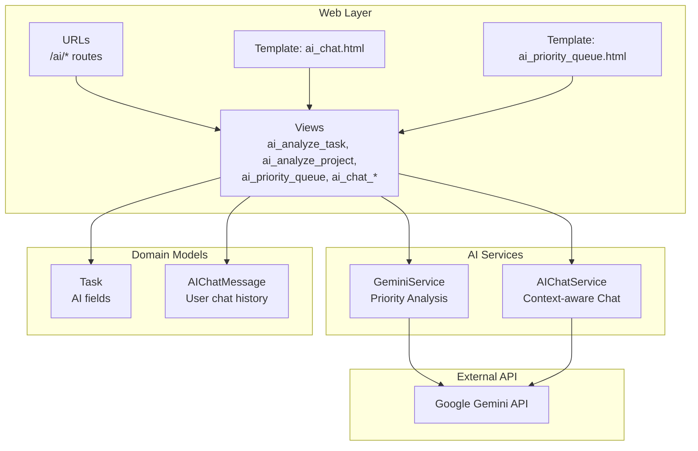
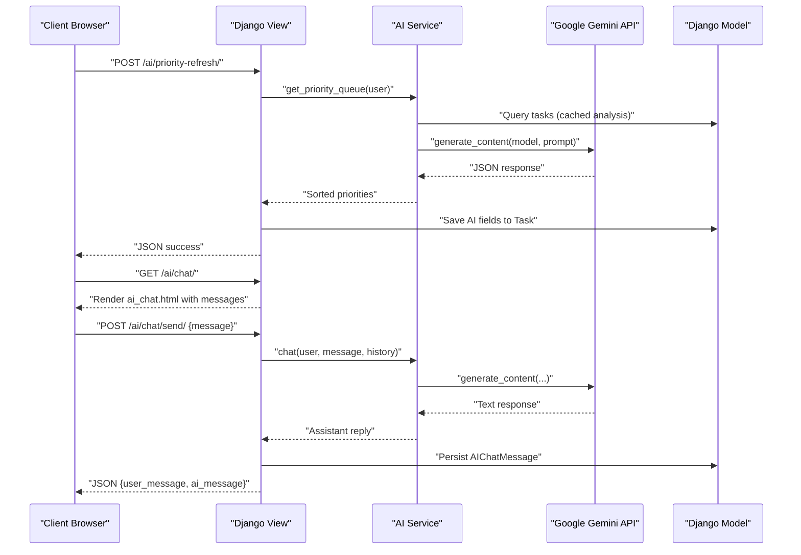
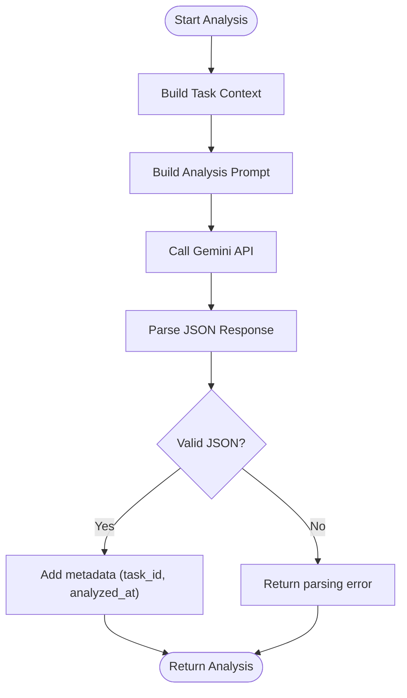
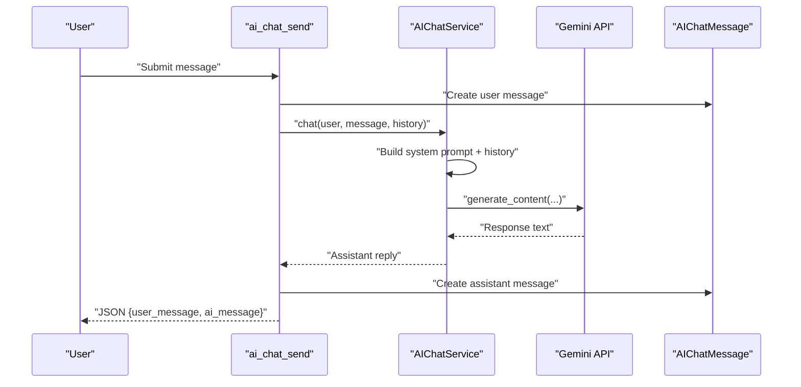
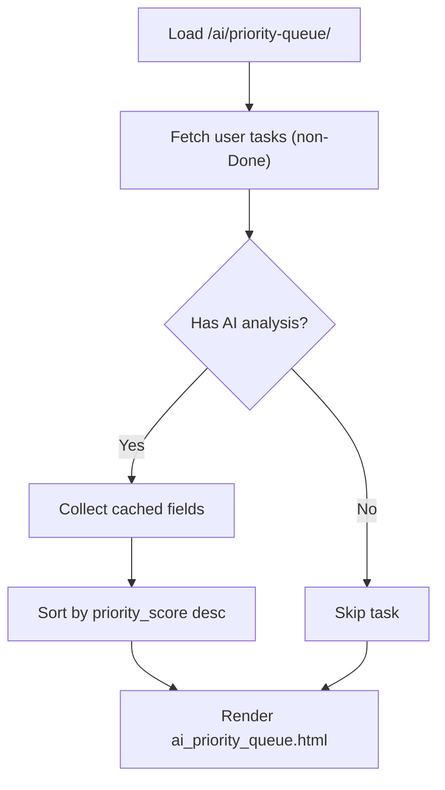
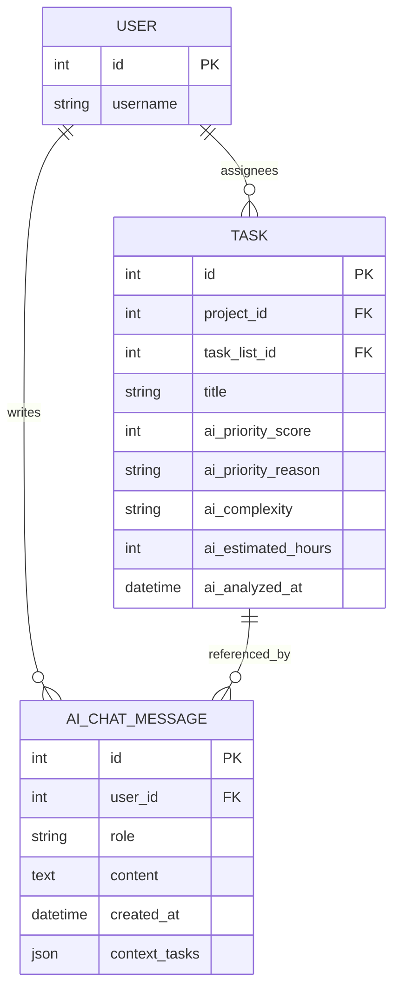
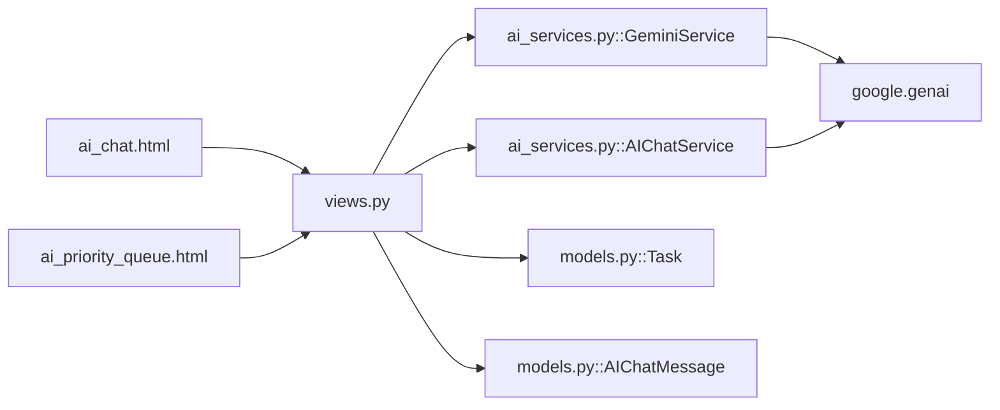

# AI Integration Services

<cite>
**Referenced Files in This Document**
- [ai_services.py](file://arva/ai_services.py)
- [views.py](file://arva/views.py)
- [urls.py](file://arva/urls.py)
- [models.py](file://arva/models.py)
- [ai_chat.html](file://arva/templates/arva/ai_chat.html)
- [ai_priority_queue.html](file://arva/templates/arva/ai_priority_queue.html)
- [0004_aichatmessage.py](file://arva/migrations/0004_aichatmessage.py)
- [arviga/settings.py](file://arviga/settings.py)
</cite>

## Table of Contents
1. [Introduction](#introduction)
2. [Project Structure](#project-structure)
3. [Core Components](#core-components)
4. [Architecture Overview](#architecture-overview)
5. [Detailed Component Analysis](#detailed-component-analysis)
6. [Dependency Analysis](#dependency-analysis)
7. [Performance Considerations](#performance-considerations)
8. [Troubleshooting Guide](#troubleshooting-guide)
9. [Conclusion](#conclusion)
10. [Appendices](#appendices)

## Introduction
This document explains the AI integration services in Arva Kanban, focusing on three pillars:
- Google Gemini-powered task priority analysis engine
- AI chat assistant with context-aware recommendations
- Daily work recommendations and context-aware task suggestions

It details how AI services process user requests, analyze task data to compute priority scores, and provide conversational assistance. It also covers configuration requirements, rate-limiting considerations, error handling, fallback mechanisms, and extension guidance.

## Project Structure
The AI features are implemented as modular services integrated with Django views and templates:
- AI services: [ai_services.py](file://arva/ai_services.py)
- Web endpoints: [views.py](file://arva/views.py), URL routing: [urls.py](file://arva/urls.py)
- Data models: [models.py](file://arva/models.py), migration: [0004_aichatmessage.py](file://arva/migrations/0004_aichatmessage.py)
- Frontend templates: [ai_chat.html](file://arva/templates/arva/ai_chat.html), [ai_priority_queue.html](file://arva/templates/arva/ai_priority_queue.html)
- Configuration: [arviga/settings.py](file://arviga/settings.py)

**Diagram sources**
- [views.py](file://arva/views.py#L2000-L2323)
- [urls.py](file://arva/urls.py#L86-L97)
- [ai_services.py](file://arva/ai_services.py#L11-L326)
- [models.py](file://arva/models.py#L252-L445)
- [ai_chat.html](file://arva/templates/arva/ai_chat.html#L1-L912)
- [ai_priority_queue.html](file://arva/templates/arva/ai_priority_queue.html#L1-L804)

**Section sources**
- [ai_services.py](file://arva/ai_services.py#L11-L326)
- [views.py](file://arva/views.py#L2000-L2323)
- [urls.py](file://arva/urls.py#L86-L97)
- [models.py](file://arva/models.py#L252-L445)

## Core Components
- GeminiService: Builds task context, constructs prompts, calls Google Gemini, parses JSON responses, and returns structured priority recommendations.
- AIChatService: Builds user-centric task context, maintains conversation history, and generates contextual chat responses.
- Task model enhancements: Stores AI-derived priority metrics and timestamps.
- AIChatMessage model: Persists private chat histories per user.
- Web endpoints: Expose priority analysis, queue rendering, and chat interactions.

Key implementation references:
- Priority analysis factory and service: [get_ai_service](file://arva/ai_services.py#L191-L193), [GeminiService](file://arva/ai_services.py#L11-L189)
- Chat service factory and service: [get_ai_chat_service](file://arva/ai_services.py#L324-L326), [AIChatService](file://arva/ai_services.py#L195-L322)
- Task AI fields: [Task model](file://arva/models.py#L303-L309)
- Chat message model: [AIChatMessage](file://arva/models.py#L430-L444)
- URL endpoints: [AI routes](file://arva/urls.py#L86-L97)

**Section sources**
- [ai_services.py](file://arva/ai_services.py#L11-L326)
- [models.py](file://arva/models.py#L303-L444)
- [urls.py](file://arva/urls.py#L86-L97)

## Architecture Overview
The AI integration follows a layered architecture:
- Presentation: Templates render chat and priority queue UIs.
- Application: Views orchestrate AI service calls, persist results, and manage conversations.
- Domain: Models store task analytics and chat history.
- External: Google Gemini API provides generative responses.

**Diagram sources**
- [views.py](file://arva/views.py#L2154-L2323)
- [ai_services.py](file://arva/ai_services.py#L115-L188)
- [models.py](file://arva/models.py#L252-L445)

## Detailed Component Analysis

### Google Gemini Priority Analysis Engine
The priority engine computes a numeric priority score and categorizes tasks into Critical/High/Medium/Low. It builds a comprehensive context from task attributes and applies weighted criteria.

Key behaviors:
- Context building includes due dates, checklist progress, assignees, labels, and project info.
- Weighted criteria: deadline urgency (40%), complexity/scope (25%), dependencies impact (20%), progress factor (15%).
- Sorting by priority score descending for batch analysis.

References:
- Context builder: [_build_task_context](file://arva/ai_services.py#L23-L65)
- Prompt builder: [_build_analysis_prompt](file://arva/ai_services.py#L67-L113)
- Single task analysis: [analyze_task](file://arva/ai_services.py#L115-L154)
- Batch analysis: [analyze_multiple_tasks](file://arva/ai_services.py#L155-L165)
- Priority queue retrieval: [get_priority_queue](file://arva/ai_services.py#L167-L188)

**Diagram sources**
- [ai_services.py](file://arva/ai_services.py#L23-L188)

**Section sources**
- [ai_services.py](file://arva/ai_services.py#L23-L188)
- [views.py](file://arva/views.py#L2000-L2040)

### AI Chat Assistant
The chat assistant provides contextual recommendations by:
- Building a recent task context for the user
- Maintaining conversation history (last 10 turns)
- Generating responses using a system prompt and user message

References:
- Chat view: [ai_chat_send](file://arva/views.py#L2230-L2284)
- Today’s work recommendation: [ai_chat_today_work](file://arva/views.py#L2293-L2322)
- Chat service: [AIChatService.chat](file://arva/ai_services.py#L284-L316)
- Chat template: [ai_chat.html](file://arva/templates/arva/ai_chat.html#L1-L912)

**Diagram sources**
- [views.py](file://arva/views.py#L2230-L2322)
- [ai_services.py](file://arva/ai_services.py#L284-L316)

**Section sources**
- [views.py](file://arva/views.py#L2217-L2322)
- [ai_services.py](file://arva/ai_services.py#L195-L322)
- [ai_chat.html](file://arva/templates/arva/ai_chat.html#L1-L912)

### Priority Queue Rendering
The priority queue page displays cached AI analyses to avoid repeated API calls during rendering.

References:
- Priority queue view: [ai_priority_queue](file://arva/views.py#L2098-L2150)
- Priority refresh endpoint: [ai_priority_refresh](file://arva/views.py#L2154-L2202)
- Template: [ai_priority_queue.html](file://arva/templates/arva/ai_priority_queue.html#L1-L804)

**Diagram sources**
- [views.py](file://arva/views.py#L2098-L2202)
- [ai_priority_queue.html](file://arva/templates/arva/ai_priority_queue.html#L1-L804)

**Section sources**
- [views.py](file://arva/views.py#L2098-L2202)
- [ai_priority_queue.html](file://arva/templates/arva/ai_priority_queue.html#L1-L804)

### Data Models for AI Features
- Task model enhancements store AI-derived priority metrics and timestamps.
- AIChatMessage persists user-specific chat histories.

**Diagram sources**
- [models.py](file://arva/models.py#L252-L445)

**Section sources**
- [models.py](file://arva/models.py#L252-L445)
- [0004_aichatmessage.py](file://arva/migrations/0004_aichatmessage.py#L16-L25)

## Dependency Analysis
- Views depend on AI services for external API calls and on models for persistence.
- AI services depend on the Google Gemini SDK and Django settings for credentials.
- Templates depend on views for data rendering and on frontend libraries for UX.

**Diagram sources**
- [views.py](file://arva/views.py#L17-L31)
- [ai_services.py](file://arva/ai_services.py#L11-L326)
- [models.py](file://arva/models.py#L252-L445)

**Section sources**
- [views.py](file://arva/views.py#L17-L31)
- [ai_services.py](file://arva/ai_services.py#L11-L326)
- [models.py](file://arva/models.py#L252-L445)

## Performance Considerations
- API call batching: The priority queue endpoint analyzes tasks in bulk and saves results to reduce repeated external calls.
- Caching strategy: The priority queue template renders only tasks with cached AI analysis to minimize latency.
- Pagination and limits: Queries cap results (e.g., 50 tasks) to control resource usage.
- Conversation history: Chat keeps last 10 messages to balance context and cost.

Recommendations:
- Implement server-side caching for frequent queries.
- Add rate limiting and exponential backoff for Gemini API calls.
- Consider async processing for long-running analyses.

[No sources needed since this section provides general guidance]

## Troubleshooting Guide
Common issues and resolutions:
- Missing credentials: Both services raise explicit errors if GEMINI_API_KEY is not configured. Ensure it is set in Django settings or environment variables.
- Parsing failures: Priority analysis extracts JSON from model responses; malformed responses return structured error payloads.
- Service unavailability: Views catch exceptions and return user-friendly JSON errors with appropriate HTTP status codes.

References:
- Credential checks: [GeminiService.__init__](file://arva/ai_services.py#L14-L21), [AIChatService.__init__](file://arva/ai_services.py#L199-L206)
- Error handling in views: [ai_analyze_task](file://arva/views.py#L2033-L2039), [ai_analyze_project](file://arva/views.py#L2090-L2096), [ai_priority_refresh](file://arva/views.py#L2193-L2202), [ai_chat_send](file://arva/views.py#L2278-L2284)

**Section sources**
- [ai_services.py](file://arva/ai_services.py#L14-L21)
- [views.py](file://arva/views.py#L2033-L2284)

## Conclusion
Arva Kanban’s AI integration leverages Google Gemini to deliver actionable insights:
- Priority scores and recommendations guide efficient task sequencing.
- Context-aware chat assists with daily planning and productivity.
- Robust error handling and caching ensure reliability and responsiveness.

The modular design allows straightforward extension to additional AI capabilities and improved user experiences.

[No sources needed since this section summarizes without analyzing specific files]

## Appendices

### Configuration Requirements
- Set GEMINI_API_KEY in Django settings or environment variables.
- Example configuration location: [arviga/settings.py](file://arviga/settings.py#L125)

**Section sources**
- [arviga/settings.py](file://arviga/settings.py#L125)

### Rate Limiting and Quota Management
- Use the latest available model with quotas as configured in the service.
- Implement retry with backoff and circuit breaker patterns around external API calls.
- Monitor response times and adopt pagination for large datasets.

[No sources needed since this section provides general guidance]

### Extending AI Functionality
- Add new AI prompts and scoring logic in GeminiService.
- Introduce new chat intents in AIChatService and wire endpoints in views.
- Persist additional analytics in Task or new models, and render in templates.

[No sources needed since this section provides general guidance]