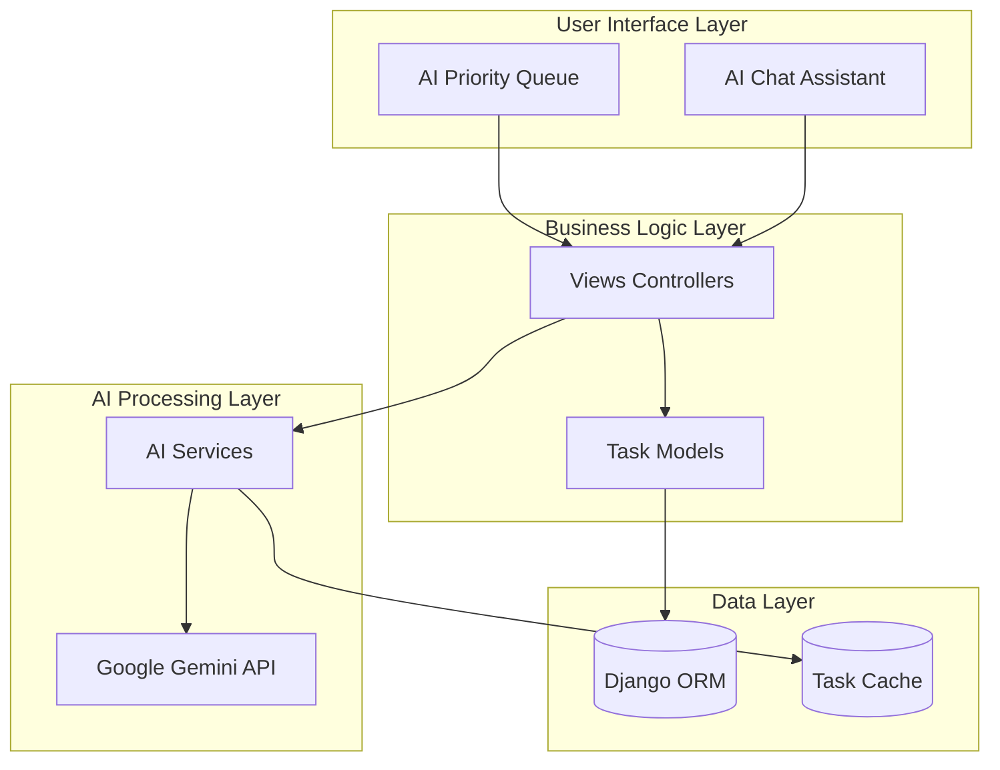
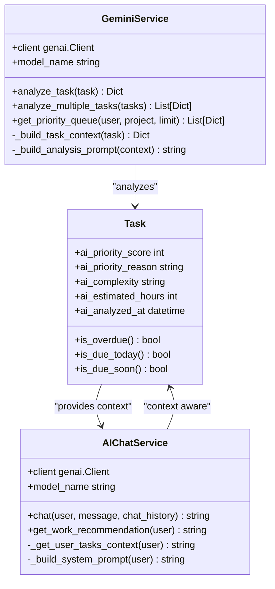
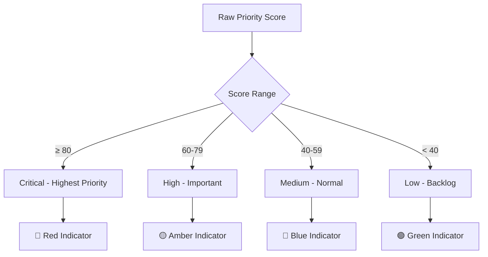
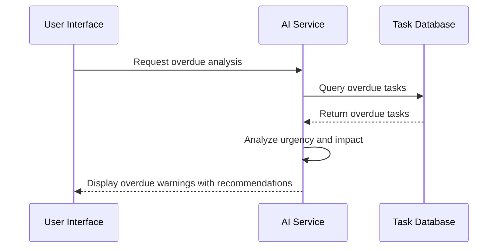
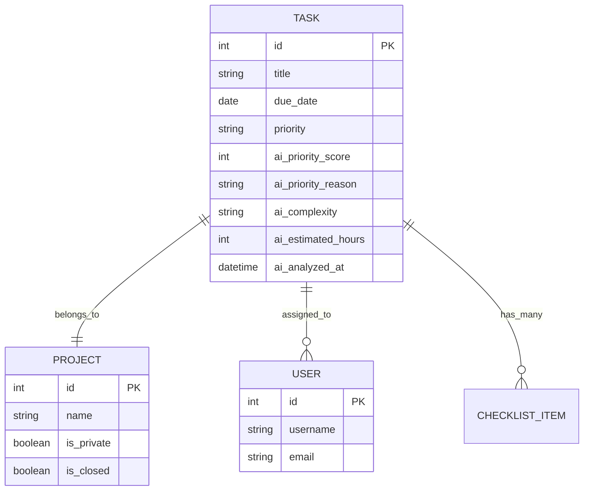
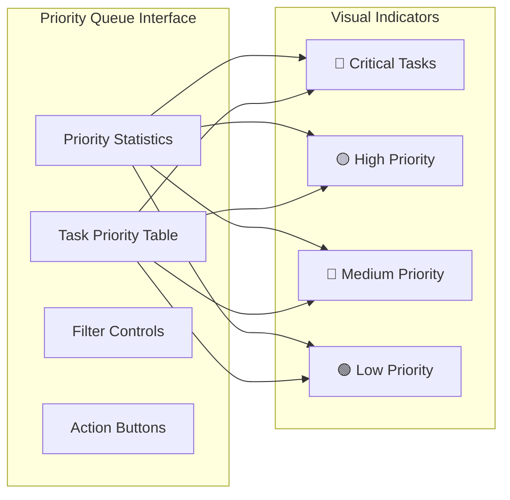

# Daily Work Recommendations

<cite>
**Referenced Files in This Document**
- [ai_services.py](file://arva/ai_services.py)
- [models.py](file://arva/models.py)
- [views.py](file://arva/views.py)
- [urls.py](file://arva/urls.py)
- [ai_priority_queue.html](file://arva/templates/arva/ai_priority_queue.html)
- [ai_chat.html](file://arva/templates/arva/ai_chat.html)
- [README.txt](file://README.txt)
- [SETUP_GUIDE.md](file://SETUP_GUIDE.md)
</cite>

## Table of Contents
1. [Introduction](#introduction)
2. [System Architecture](#system-architecture)
3. [Core Components](#core-components)
4. [Priority Analysis Algorithm](#priority-analysis-algorithm)
5. [Recommendation Scenarios](#recommendation-scenarios)
6. [Integration Points](#integration-points)
7. [Personalization and Context Awareness](#personalization-and-context-awareness)
8. [User Interface Implementation](#user-interface-implementation)
9. [Performance Considerations](#performance-considerations)
10. [Troubleshooting Guide](#troubleshooting-guide)
11. [Conclusion](#conclusion)

## Introduction

The Daily Work Recommendation system is an AI-powered productivity enhancement built into the Arviga Kanban project management platform. This system analyzes users' task portfolios to provide actionable insights and recommendations for optimal daily priorities, helping users focus on high-impact activities while balancing deadlines, complexity, and completion status.

The system leverages Google Gemini AI to process task data and deliver personalized recommendations through two primary interfaces: an AI Priority Queue dashboard and an AI Chat Assistant. Users receive intelligent suggestions for what to work on today, overdue task warnings, and time management recommendations based on their individual task portfolios.

## System Architecture

The recommendation system follows a modular architecture with clear separation between AI processing, data analysis, and user interface presentation.

**Diagram sources**
- [ai_services.py](file://arva/ai_services.py#L11-L326)
- [views.py](file://arva/views.py#L2099-L2323)
- [models.py](file://arva/models.py#L252-L352)

The architecture consists of four main layers:

- **User Interface Layer**: Provides two distinct interfaces for recommendations - the Priority Queue dashboard and the Chat Assistant
- **Business Logic Layer**: Handles request processing, data filtering, and response formatting
- **AI Processing Layer**: Manages AI model interactions and analysis calculations
- **Data Layer**: Stores task information, user preferences, and AI analysis results

## Core Components

### AI Services Module

The AI Services module serves as the central intelligence hub, containing two specialized services for different recommendation scenarios.

**Diagram sources**
- [ai_services.py](file://arva/ai_services.py#L11-L326)
- [models.py](file://arva/models.py#L252-L352)

### Priority Queue Dashboard

The Priority Queue provides a comprehensive view of all tasks with AI-generated priority scores and recommendations. The interface displays tasks in descending priority order with visual indicators for urgency levels.

### AI Chat Assistant

The Chat Assistant offers conversational recommendations and can provide specific guidance for daily work decisions. It maintains conversation history and provides context-aware responses based on the user's current task portfolio.

**Section sources**
- [ai_services.py](file://arva/ai_services.py#L11-L326)
- [views.py](file://arva/views.py#L2099-L2323)

## Priority Analysis Algorithm

The system employs a sophisticated scoring algorithm that evaluates tasks across four primary factors to determine optimal daily priorities.

### Scoring Factors

| Factor | Weight | Description | Calculation Method |
|--------|--------|-------------|-------------------|
| **Deadline Urgency** | 40% | Proximity to due date and overdue status | Days until due × urgency multiplier |
| **Complexity/Scope** | 25% | Task difficulty and estimated effort | Checklist completion ratio × complexity factor |
| **Dependencies Impact** | 20% | Tasks blocking others or critical path | Dependency count × impact multiplier |
| **Current Progress** | 15% | Near-completion tasks vs. new tasks | Completion percentage × progress factor |

### Priority Level Classification

The system converts raw scores into meaningful priority levels:

**Diagram sources**
- [views.py](file://arva/views.py#L2204-L2215)

### Analysis Process

The AI analysis process follows these steps:

1. **Context Building**: Extract comprehensive task information including deadlines, progress, assignments, and dependencies
2. **Prompt Engineering**: Construct detailed analysis prompts with weighted criteria
3. **AI Processing**: Send prompts to Google Gemini for intelligent analysis
4. **Result Parsing**: Extract and validate JSON responses
5. **Score Calculation**: Convert AI analysis into actionable priority scores
6. **Recommendation Generation**: Provide specific action recommendations

**Section sources**
- [ai_services.py](file://arva/ai_services.py#L23-L165)
- [ai_services.py](file://arva/ai_services.py#L67-L113)

## Recommendation Scenarios

### What to Work on Today

The system provides intelligent daily work recommendations by analyzing upcoming deadlines and current task status. The AI identifies the most urgent tasks that should be prioritized based on:

- **Overdue tasks** requiring immediate attention
- **Near-deadline tasks** within 2 days
- **Complex tasks** that benefit from early start
- **High-impact tasks** with significant dependencies

### Overdue Task Warnings

The system automatically flags overdue tasks and provides contextual warnings:

**Diagram sources**
- [ai_services.py](file://arva/ai_services.py#L34-L45)
- [models.py](file://arva/models.py#L333-L344)

### Time Management Suggestions

The AI provides personalized time management recommendations based on:

- **Estimated completion hours** for complex tasks
- **Task breakdown recommendations** for large projects
- **Focus timing suggestions** based on task complexity
- **Efficiency patterns** derived from user's historical data

**Section sources**
- [ai_services.py](file://arva/ai_services.py#L115-L165)
- [ai_services.py](file://arva/ai_services.py#L196-L326)

## Integration Points

### Task Data Integration

The system integrates seamlessly with the existing task management infrastructure:

**Diagram sources**
- [models.py](file://arva/models.py#L252-L352)

### API Endpoint Integration

The system exposes RESTful endpoints for programmatic access:

| Endpoint | Method | Purpose |
|----------|--------|---------|
| `/ai/priority-queue/` | GET | Load AI Priority Queue |
| `/ai/priority-refresh/` | POST | Refresh AI Analysis |
| `/ai/analyze-task/<int:task_id>/` | GET | Analyze Individual Task |
| `/ai/chat/` | GET | Load AI Chat Interface |
| `/ai/chat/send/` | POST | Send Chat Message |
| `/ai/chat/today-work/` | GET | Get Daily Work Recommendation |

**Section sources**
- [urls.py](file://arva/urls.py#L86-L97)
- [views.py](file://arva/views.py#L2099-L2323)

## Personalization and Context Awareness

### User-Specific Analysis

The system tailors recommendations to individual users by considering:

- **Assignment scope**: Tasks assigned directly to the user
- **Project ownership**: Tasks owned by the user as project managers
- **Historical patterns**: Previous task completion and priority preferences
- **Team context**: Collaborative dependencies and team member availability

### Context-Aware Recommendations

Recommendations adapt based on real-time context:

- **Current task status**: Active vs. completed tasks influence priority
- **Project phase**: Different project stages require different focus areas
- **Team availability**: Dependencies on other team members affect task prioritization
- **Resource constraints**: Available time and capacity considerations

### Preference Integration

The system respects user preferences through:

- **Theme and layout preferences** affecting interface presentation
- **Notification preferences** for overdue task alerts
- **Work pattern recognition** from historical task completion data

**Section sources**
- [ai_services.py](file://arva/ai_services.py#L167-L188)
- [ai_services.py](file://arva/ai_services.py#L208-L253)

## User Interface Implementation

### Priority Queue Dashboard

The Priority Queue provides a comprehensive view of task recommendations:

**Diagram sources**
- [ai_priority_queue.html](file://arva/templates/arva/ai_priority_queue.html#L504-L541)

### Chat Assistant Interface

The Chat Assistant provides conversational access to recommendations:

- **Real-time messaging** with AI assistant
- **Daily work suggestion** capability
- **Context-aware responses** based on current task portfolio
- **Privacy protection** with user-specific conversation storage

**Section sources**
- [ai_priority_queue.html](file://arva/templates/arva/ai_priority_queue.html#L496-L501)
- [ai_chat.html](file://arva/templates/arva/ai_chat.html#L630-L784)

## Performance Considerations

### Caching Strategy

The system implements intelligent caching to optimize performance:

- **Pre-cached analysis**: Priority queues load only tasks with existing AI analysis
- **API rate limiting**: Google Gemini API calls are controlled and batched
- **Database optimization**: Efficient queries with select_related and prefetch_related
- **Pagination**: Results limited to prevent performance degradation

### Scalability Features

- **Batch processing**: Multiple tasks can be analyzed in parallel batches
- **Lazy loading**: AI analysis results are loaded on-demand
- **Memory management**: Large task sets are processed in manageable chunks
- **Error isolation**: Individual task failures don't affect overall system performance

### Resource Management

- **API quota monitoring**: Automatic detection and handling of quota limitations
- **Fallback mechanisms**: Graceful degradation when AI services are unavailable
- **Progressive enhancement**: Basic functionality available even without AI analysis

## Troubleshooting Guide

### Common Issues and Solutions

| Issue | Symptoms | Solution |
|-------|----------|----------|
| **AI Service Not Configured** | Error messages about missing API key | Set GEMINI_API_KEY environment variable |
| **Priority Queue Empty** | No tasks displayed in Priority Queue | Run priority refresh to analyze tasks |
| **Chat Assistant Unavailable** | Chat interface shows error messages | Verify AI service configuration |
| **Slow Performance** | Delayed responses or timeouts | Check API quota limits and network connectivity |

### Configuration Requirements

The system requires proper configuration for optimal operation:

- **Google Gemini API Key**: Essential for AI analysis capabilities
- **Database Connectivity**: MySQL connection for task data storage
- **Static File Serving**: Proper configuration for UI assets
- **CSRF Protection**: Required for AJAX operations

### Monitoring and Debugging

Key diagnostic information includes:

- **API response validation**: JSON parsing and error handling
- **Task analysis timestamps**: Tracking when AI analysis was performed
- **User preference persistence**: Ensuring recommendations align with user settings
- **Error logging**: Comprehensive error reporting for troubleshooting

**Section sources**
- [SETUP_GUIDE.md](file://SETUP_GUIDE.md#L8-L13)
- [views.py](file://arva/views.py#L2193-L2202)

## Conclusion

The Daily Work Recommendation system represents a comprehensive AI-powered productivity enhancement for the Arviga Kanban platform. By intelligently analyzing task portfolios and providing personalized recommendations, the system helps users make informed decisions about their daily work priorities.

The system's strength lies in its balanced approach to productivity guidance, combining automated AI analysis with human judgment and flexibility. Users receive actionable insights while maintaining full control over their work decisions. The modular architecture ensures scalability and maintainability, while the dual interface approach accommodates different user preferences and work styles.

Key benefits include improved task prioritization accuracy, reduced decision fatigue, enhanced time management, and better collaboration through shared context awareness. The system's ability to adapt to individual user patterns and project dynamics makes it a valuable tool for both individual contributors and team environments.

Future enhancements could include machine learning-based preference adaptation, integration with calendar systems, and advanced analytics for productivity trends. The current foundation provides a robust platform for continued innovation in AI-powered productivity assistance.