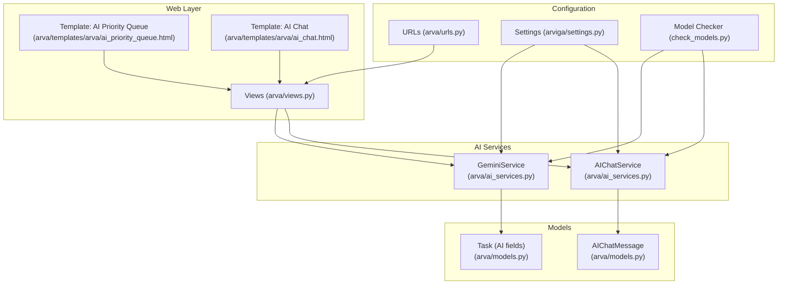
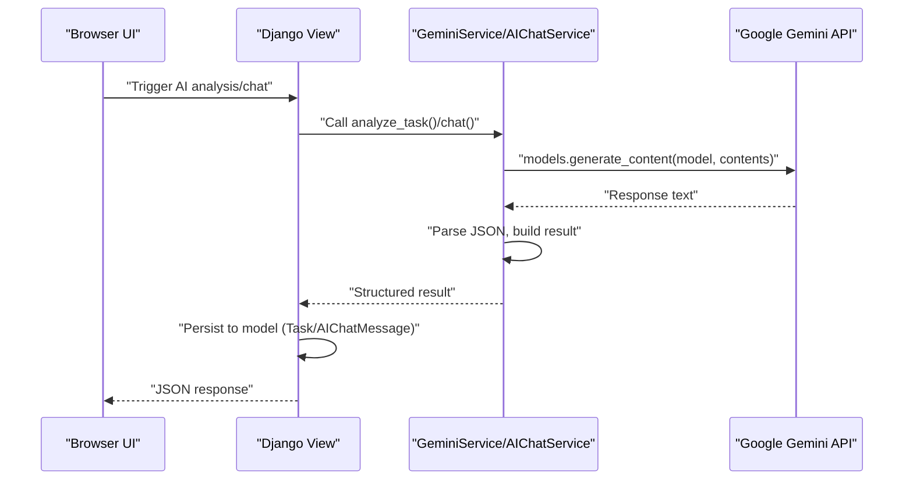
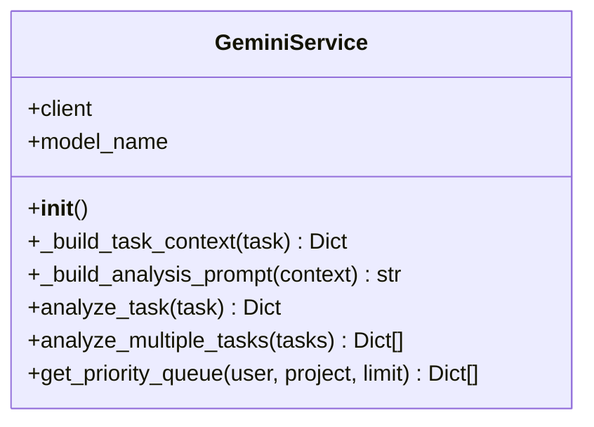
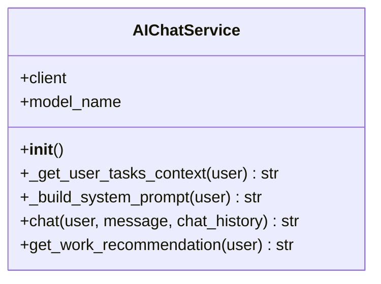
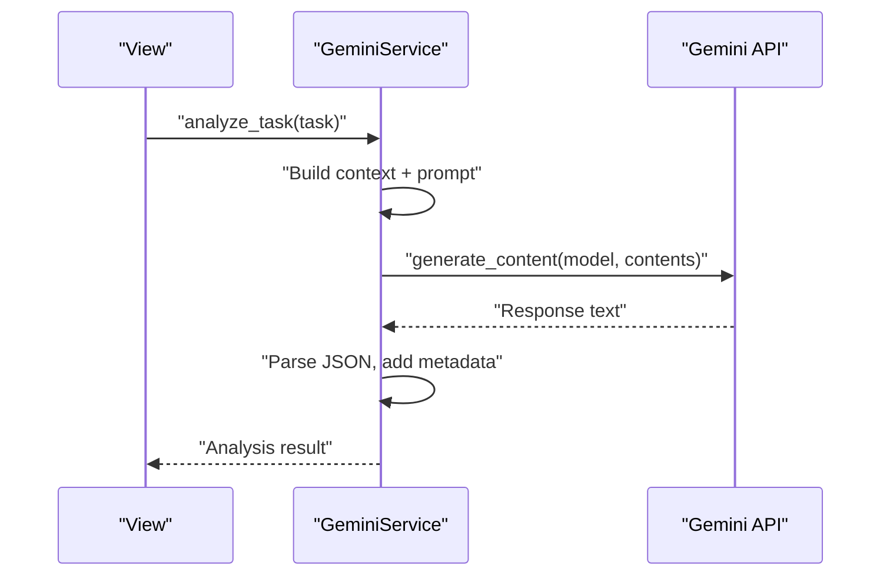
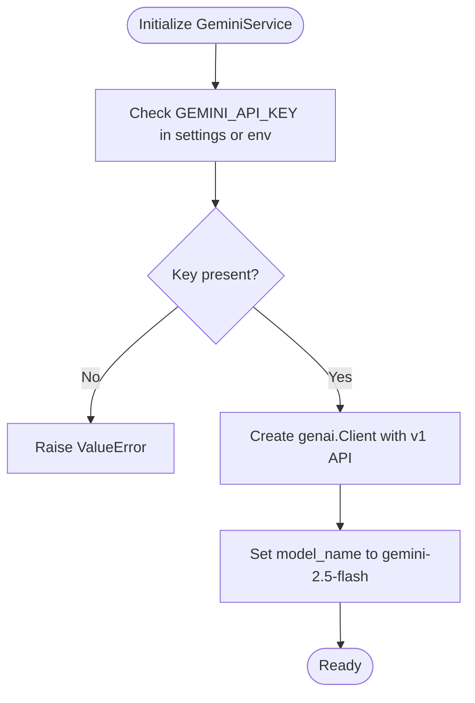
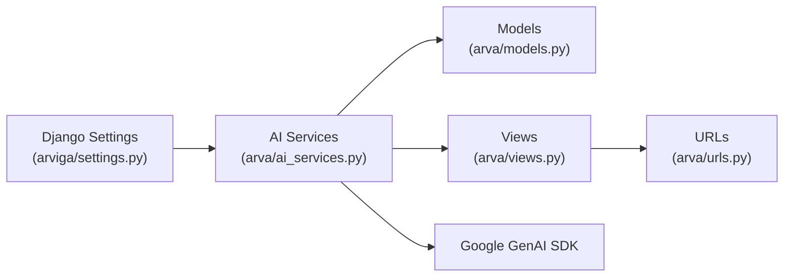

# Google Gemini API Integration

<cite>
**Referenced Files in This Document**
- [ai_services.py](file://arva/ai_services.py)
- [views.py](file://arva/views.py)
- [urls.py](file://arva/urls.py)
- [models.py](file://arva/models.py)
- [check_models.py](file://check_models.py)
- [SETUP_GUIDE.md](file://SETUP_GUIDE.md)
- [settings.py](file://arviga/settings.py)
- [ai_priority_queue.html](file://arva/templates/arva/ai_priority_queue.html)
- [ai_chat.html](file://arva/templates/arva/ai_chat.html)
</cite>

## Table of Contents
1. [Introduction](#introduction)
2. [Project Structure](#project-structure)
3. [Core Components](#core-components)
4. [Architecture Overview](#architecture-overview)
5. [Detailed Component Analysis](#detailed-component-analysis)
6. [Dependency Analysis](#dependency-analysis)
7. [Performance Considerations](#performance-considerations)
8. [Troubleshooting Guide](#troubleshooting-guide)
9. [Conclusion](#conclusion)

## Introduction
This document explains the Google Gemini API integration in Arva Kanban. It covers configuration setup, authentication, client initialization, API request/response patterns, error handling, rate limiting considerations, and practical examples for priority analysis and chat functionality. It also documents environment variable requirements, API key storage, fallback mechanisms, and troubleshooting steps for common issues.

## Project Structure
The Gemini integration spans several modules:
- AI services module: Implements the GeminiService and AIChatService classes for priority analysis and conversational assistance.
- Views module: Exposes endpoints for triggering AI analysis and chat interactions.
- URL routing: Defines routes for AI features.
- Models: Stores AI analysis results on tasks and chat messages per user.
- Utilities: Provides a script to discover available models and validate API configuration.
- Templates: Render AI features in the web interface.

**Diagram sources**
- [ai_services.py](file://arva/ai_services.py#L11-L22)
- [ai_services.py](file://arva/ai_services.py#L196-L210)
- [views.py](file://arva/views.py#L16-L17)
- [urls.py](file://arva/urls.py#L86-L97)
- [models.py](file://arva/models.py#L303-L308)
- [models.py](file://arva/models.py#L430-L444)
- [check_models.py](file://check_models.py#L1-L20)
- [settings.py](file://arviga/settings.py#L125-L125)
- [ai_priority_queue.html](file://arva/templates/arva/ai_priority_queue.html#L1-L200)
- [ai_chat.html](file://arva/templates/arva/ai_chat.html#L1-L200)

**Section sources**
- [ai_services.py](file://arva/ai_services.py#L11-L22)
- [views.py](file://arva/views.py#L16-L17)
- [urls.py](file://arva/urls.py#L86-L97)
- [models.py](file://arva/models.py#L303-L308)
- [models.py](file://arva/models.py#L430-L444)
- [check_models.py](file://check_models.py#L1-L20)
- [settings.py](file://arviga/settings.py#L125-L125)
- [ai_priority_queue.html](file://arva/templates/arva/ai_priority_queue.html#L1-L200)
- [ai_chat.html](file://arva/templates/arva/ai_chat.html#L1-L200)

## Core Components
- GeminiService: Handles task priority analysis using the Gemini API. It builds contextual prompts, calls the API, parses JSON responses, and stores results on tasks.
- AIChatService: Provides conversational assistance with context-aware prompts built from the user's tasks.
- Views: Expose endpoints for analyzing tasks, refreshing priorities, and interacting with the AI chat assistant.
- Models: Store AI analysis metadata on tasks and maintain chat histories per user.
- URL routing: Maps AI endpoints to views.
- Configuration: Requires GEMINI_API_KEY in Django settings or environment variables.

Key responsibilities:
- Authentication: Reads GEMINI_API_KEY from Django settings or environment variables.
- Client initialization: Creates a genai client with explicit API version v1.
- Model selection: Uses gemini-2.5-flash as the model identifier.
- Request/response: Calls generate_content on the selected model with constructed prompts.
- Error handling: Catches parsing and general exceptions, returning structured error responses.
- Rate limiting: Not explicitly handled in code; relies on external quota controls.

**Section sources**
- [ai_services.py](file://arva/ai_services.py#L11-L22)
- [ai_services.py](file://arva/ai_services.py#L115-L154)
- [ai_services.py](file://arva/ai_services.py#L196-L210)
- [ai_services.py](file://arva/ai_services.py#L284-L317)
- [views.py](file://arva/views.py#L2000-L2038)
- [views.py](file://arva/views.py#L2153-L2203)
- [models.py](file://arva/models.py#L303-L308)
- [models.py](file://arva/models.py#L430-L444)
- [urls.py](file://arva/urls.py#L86-L97)

## Architecture Overview
The AI integration follows a layered architecture:
- Presentation: Templates render AI features and capture user actions.
- Web layer: Views orchestrate AI service calls and persist results.
- AI services: Encapsulate Gemini client usage and prompt construction.
- Persistence: Models store AI analysis and chat data.

**Diagram sources**
- [ai_services.py](file://arva/ai_services.py#L115-L154)
- [ai_services.py](file://arva/ai_services.py#L284-L317)
- [views.py](file://arva/views.py#L2000-L2038)
- [views.py](file://arva/views.py#L2153-L2203)

## Detailed Component Analysis

### GeminiService: Priority Analysis
GeminiService encapsulates:
- Initialization: Validates presence of GEMINI_API_KEY and initializes a genai client with API version v1.
- Task context builder: Aggregates task metadata, checklist progress, due date urgency, assignees, labels, and project info.
- Prompt builder: Constructs a comprehensive prompt in Indonesian with scoring criteria and required JSON output format.
- Analysis execution: Calls generate_content on the configured model, extracts JSON from potential markdown code blocks, and enriches the result with metadata.
- Error handling: Returns structured error objects for JSON parsing failures and general exceptions.

**Diagram sources**
- [ai_services.py](file://arva/ai_services.py#L11-L22)
- [ai_services.py](file://arva/ai_services.py#L23-L65)
- [ai_services.py](file://arva/ai_services.py#L67-L113)
- [ai_services.py](file://arva/ai_services.py#L115-L154)
- [ai_services.py](file://arva/ai_services.py#L155-L188)

**Section sources**
- [ai_services.py](file://arva/ai_services.py#L11-L22)
- [ai_services.py](file://arva/ai_services.py#L23-L65)
- [ai_services.py](file://arva/ai_services.py#L67-L113)
- [ai_services.py](file://arva/ai_services.py#L115-L154)
- [ai_services.py](file://arva/ai_services.py#L155-L188)

### AIChatService: Conversational Assistant
AIChatService provides:
- Initialization: Similar authentication and client setup as GeminiService.
- User context builder: Retrieves recent tasks for the user, computes due dates, and formats a concise list.
- System prompt builder: Creates a contextual prompt that instructs the AI assistant on roles, rules, and user-specific task information.
- Chat execution: Builds a full conversation prompt (including optional chat history), calls generate_content, and returns plain text responses.
- Error handling: Returns a friendly error message for exceptions.

**Diagram sources**
- [ai_services.py](file://arva/ai_services.py#L196-L210)
- [ai_services.py](file://arva/ai_services.py#L208-L253)
- [ai_services.py](file://arva/ai_services.py#L255-L282)
- [ai_services.py](file://arva/ai_services.py#L284-L317)

**Section sources**
- [ai_services.py](file://arva/ai_services.py#L196-L210)
- [ai_services.py](file://arva/ai_services.py#L208-L253)
- [ai_services.py](file://arva/ai_services.py#L255-L282)
- [ai_services.py](file://arva/ai_services.py#L284-L317)

### API Request/Response Patterns
Priority Analysis:
- Input: Task object with related fields (project, assignees, labels, checklist items).
- Processing: Build context, construct prompt, call generate_content, extract JSON, and attach metadata.
- Output: Dictionary containing priority score, level, complexity, estimated hours, reasoning, recommended action, and factor scores.

Chat:
- Input: User, message string, optional chat history.
- Processing: Build system prompt and conversation content, call generate_content.
- Output: Plain text response from the AI assistant.

**Diagram sources**
- [ai_services.py](file://arva/ai_services.py#L115-L154)

**Section sources**
- [ai_services.py](file://arva/ai_services.py#L115-L154)
- [ai_services.py](file://arva/ai_services.py#L284-L317)

### Error Handling and Fallback Mechanisms
- Missing API key: Constructor raises a ValueError if GEMINI_API_KEY is not configured.
- JSON parsing failure: analyze_task returns an error dictionary with raw response details.
- General exceptions: analyze_task returns an error dictionary with the exception message.
- View-level handling: Views catch ValueError and return user-friendly JSON errors indicating missing configuration.
- Fallback behavior: When API is unavailable or quota is exceeded, the system returns error responses rather than retrying automatically.

**Section sources**
- [ai_services.py](file://arva/ai_services.py#L14-L17)
- [ai_services.py](file://arva/ai_services.py#L143-L153)
- [views.py](file://arva/views.py#L2033-L2037)
- [views.py](file://arva/views.py#L2193-L2197)

### Configuration Requirements
- Environment variable: GEMINI_API_KEY must be present in Django settings or environment variables.
- Client initialization: The genai client is created with explicit API version v1.
- Model selection: The code uses gemini-2.5-flash as the model identifier.
- Setup guide: The project documentation indicates the Google GenAI SDK version and model updates.

**Diagram sources**
- [ai_services.py](file://arva/ai_services.py#L14-L21)
- [SETUP_GUIDE.md](file://SETUP_GUIDE.md#L7-L13)
- [settings.py](file://arviga/settings.py#L125-L125)

**Section sources**
- [ai_services.py](file://arva/ai_services.py#L14-L21)
- [SETUP_GUIDE.md](file://SETUP_GUIDE.md#L7-L13)
- [settings.py](file://arviga/settings.py#L125-L125)

### Concrete Examples

Priority Analysis:
- Endpoint: Triggered via a view that calls the AI service and persists results to the Task model.
- Example flow: User initiates analysis → View invokes GeminiService → Service calls Gemini API → Results saved to task fields.

Chat:
- Endpoint: Users send messages to the AI assistant; the view calls AIChatService which constructs context and returns a response.
- Example flow: User sends message → View calls AIChatService → Service builds system prompt and conversation content → Gemini API returns response → View returns JSON to UI.

**Section sources**
- [views.py](file://arva/views.py#L2000-L2038)
- [views.py](file://arva/views.py#L2153-L2203)
- [urls.py](file://arva/urls.py#L86-L97)

## Dependency Analysis
The AI integration depends on:
- Django settings for API key retrieval.
- Google GenAI SDK for client creation and API calls.
- Task and AIChatMessage models for persistence.
- URL routing to expose AI endpoints.

**Diagram sources**
- [settings.py](file://arviga/settings.py#L125-L125)
- [ai_services.py](file://arva/ai_services.py#L11-L22)
- [models.py](file://arva/models.py#L303-L308)
- [views.py](file://arva/views.py#L16-L17)
- [urls.py](file://arva/urls.py#L86-L97)

**Section sources**
- [settings.py](file://arviga/settings.py#L125-L125)
- [ai_services.py](file://arva/ai_services.py#L11-L22)
- [models.py](file://arva/models.py#L303-L308)
- [views.py](file://arva/views.py#L16-L17)
- [urls.py](file://arva/urls.py#L86-L97)

## Performance Considerations
- Batch processing: analyze_multiple_tasks iterates through tasks sequentially; consider batching or async processing for large sets.
- Prompt construction: Building prompts involves database queries; ensure appropriate select_related and prefetch_related usage to minimize N+1 queries.
- Response parsing: JSON extraction handles markdown code blocks; ensure prompts consistently return JSON to avoid extra parsing overhead.
- Model choice: Using gemini-2.5-flash balances cost and capability; monitor latency and adjust if needed.

[No sources needed since this section provides general guidance]

## Troubleshooting Guide
Common issues and resolutions:
- Missing API key:
  - Symptom: ValueError during service initialization or JSON error from views indicating missing configuration.
  - Resolution: Set GEMINI_API_KEY in Django settings or environment variables.
- JSON parsing errors:
  - Symptom: Error response indicating failed to parse AI response.
  - Resolution: Verify prompt formatting and ensure the model responds with valid JSON.
- General API errors:
  - Symptom: Exceptions caught and returned as error responses.
  - Resolution: Check network connectivity, API key validity, and quota limits.
- Quota limitations:
  - Symptom: Model checker reports quota exceeded for candidate models.
  - Resolution: Monitor usage, upgrade plan, or reduce request frequency.
- Network connectivity:
  - Symptom: Failures when calling generate_content.
  - Resolution: Retry after ensuring stable internet connection; consider implementing retry logic with exponential backoff.

**Section sources**
- [ai_services.py](file://arva/ai_services.py#L14-L17)
- [ai_services.py](file://arva/ai_services.py#L143-L153)
- [views.py](file://arva/views.py#L2033-L2037)
- [views.py](file://arva/views.py#L2193-L2197)
- [check_models.py](file://check_models.py#L67-L74)

## Conclusion
The Google Gemini integration in Arva Kanban provides robust AI-powered task prioritization and conversational assistance. It is configured via GEMINI_API_KEY, initialized with explicit API version v1, and uses gemini-2.5-flash for model selection. The system handles errors gracefully and persists AI results to models for later retrieval. For production use, monitor quotas, optimize prompt construction, and consider adding retry logic and rate limiting at the application layer.