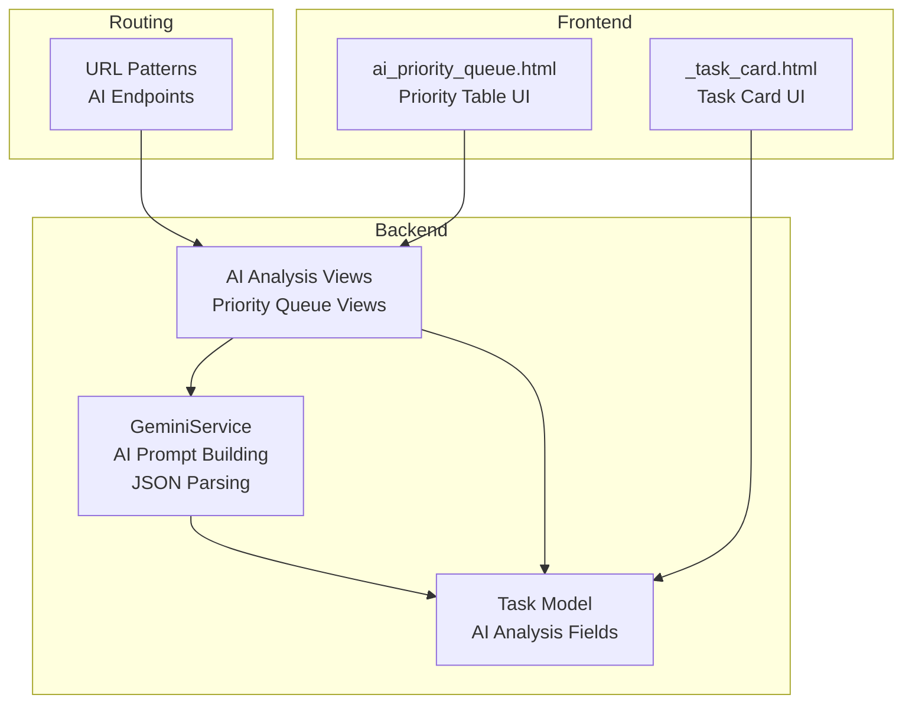
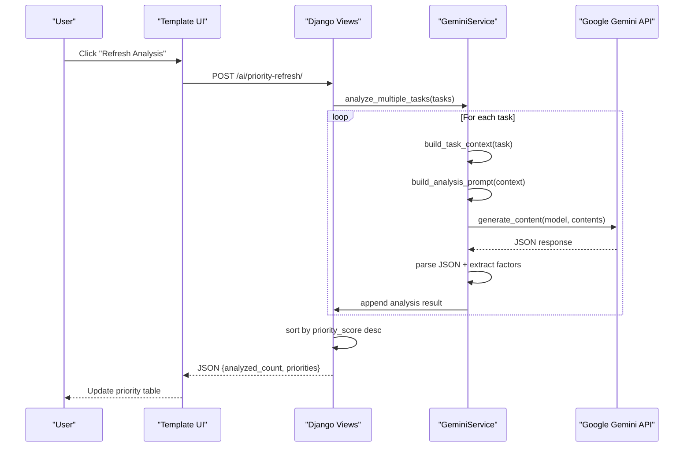
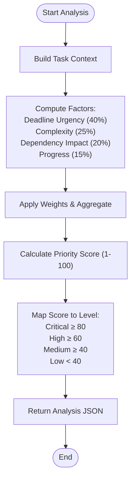
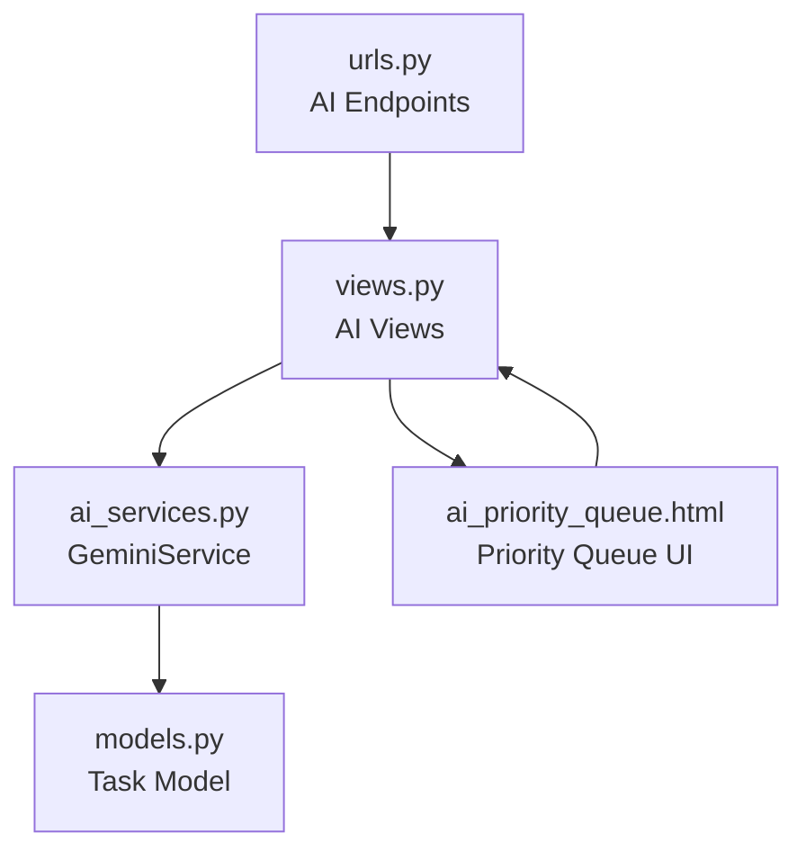

# Task Priority Analysis Engine

<cite>
**Referenced Files in This Document**
- [ai_services.py](file://arva/ai_services.py)
- [models.py](file://arva/models.py)
- [views.py](file://arva/views.py)
- [urls.py](file://arva/urls.py)
- [ai_priority_queue.html](file://arva/templates/arva/ai_priority_queue.html)
- [_task_card.html](file://arva/templates/arva/_task_card.html)
- [0003_task_ai_analyzed_at_task_ai_complexity_and_more.py](file://arva/migrations/0003_task_ai_analyzed_at_task_ai_complexity_and_more.py)
- [0005_project_etd_project_is_project_project_pm_assignee_and_more.py](file://arva/migrations/0005_project_etd_project_is_project_project_pm_assignee_and_more.py)
- [README.txt](file://README.txt)
- [SETUP_GUIDE.md](file://SETUP_GUIDE.md)
</cite>

## Table of Contents
1. [Introduction](#introduction)
2. [Project Structure](#project-structure)
3. [Core Components](#core-components)
4. [Architecture Overview](#architecture-overview)
5. [Detailed Component Analysis](#detailed-component-analysis)
6. [Dependency Analysis](#dependency-analysis)
7. [Performance Considerations](#performance-considerations)
8. [Troubleshooting Guide](#troubleshooting-guide)
9. [Conclusion](#conclusion)

## Introduction
This document explains the AI-powered task priority analysis engine that powers intelligent workload prioritization in the Kanban project management system. It covers the priority calculation algorithm, task context building, AI prompt construction, JSON response parsing, priority queue generation, filtering logic, and performance optimizations. It also addresses edge cases such as overdue tasks, unassigned tasks, and tasks without deadlines.

## Project Structure
The AI priority analysis engine spans backend services, models, views, templates, and migrations:
- Backend AI service encapsulated in a dedicated class
- Django models storing task metadata and AI analysis results
- Views implementing endpoints for single and bulk analysis, and priority queue rendering
- Templates for displaying AI-prioritized queues and task cards
- Migrations adding AI-related fields to the Task model



**Diagram sources**
- [ai_services.py](file://arva/ai_services.py#L11-L326)
- [models.py](file://arva/models.py#L252-L352)
- [views.py](file://arva/views.py#L2099-L2203)
- [ai_priority_queue.html](file://arva/templates/arva/ai_priority_queue.html#L1-L800)
- [_task_card.html](file://arva/templates/arva/_task_card.html#L1-L185)
- [urls.py](file://arva/urls.py#L86-L96)

**Section sources**
- [README.txt](file://README.txt#L1-L35)
- [SETUP_GUIDE.md](file://SETUP_GUIDE.md#L1-L95)

## Core Components
- GeminiService: Builds task context, constructs prompts, calls the AI model, parses JSON responses, and manages batch analysis and priority queues.
- Task model: Stores task metadata and AI analysis fields (scores, reasoning, complexity, estimated hours, timestamps).
- Views: Expose endpoints for single task analysis, project-wide analysis, and priority queue display/refresh.
- Templates: Render priority queues and integrate with frontend JavaScript for dynamic updates.
- Migrations: Define AI-related fields persisted on the Task model.

**Section sources**
- [ai_services.py](file://arva/ai_services.py#L11-L326)
- [models.py](file://arva/models.py#L252-L352)
- [views.py](file://arva/views.py#L2099-L2203)
- [ai_priority_queue.html](file://arva/templates/arva/ai_priority_queue.html#L1-L800)
- [0003_task_ai_analyzed_at_task_ai_complexity_and_more.py](file://arva/migrations/0003_task_ai_analyzed_at_task_ai_complexity_and_more.py#L1-L39)
- [0005_project_etd_project_is_project_project_pm_assignee_and_more.py](file://arva/migrations/0005_project_etd_project_is_project_project_pm_assignee_and_more.py#L1-L67)

## Architecture Overview
The engine follows a layered architecture:
- Presentation: Templates render priority queues and task cards.
- API: Views expose endpoints for AI analysis and queue refresh.
- Service: GeminiService orchestrates context building, prompt construction, AI inference, and response parsing.
- Persistence: Task model persists AI analysis results for reuse.



**Diagram sources**
- [views.py](file://arva/views.py#L2155-L2202)
- [ai_services.py](file://arva/ai_services.py#L115-L165)
- [ai_priority_queue.html](file://arva/templates/arva/ai_priority_queue.html#L699-L756)

## Detailed Component Analysis

### Priority Calculation Algorithm
The algorithm aggregates four weighted factors:
- Deadline urgency: 40%
- Complexity/scope: 25%
- Dependency impact: 20%
- Current progress: 15%

Implementation highlights:
- Context builder computes days until due and urgency indicator.
- Progress factor uses checklist completion percentage.
- Dependency impact is currently represented as a placeholder in the prompt; actual dependency computation is heuristic-based in the current implementation.
- The AI model returns a JSON object containing the overall priority score (1–100), priority level, complexity, estimated hours, reasoning, and factor scores.



**Diagram sources**
- [ai_services.py](file://arva/ai_services.py#L23-L65)
- [ai_services.py](file://arva/ai_services.py#L67-L113)
- [ai_services.py](file://arva/ai_services.py#L115-L165)
- [views.py](file://arva/views.py#L2204-L2216)

**Section sources**
- [ai_services.py](file://arva/ai_services.py#L67-L113)
- [ai_services.py](file://arva/ai_services.py#L115-L165)
- [views.py](file://arva/views.py#L2204-L2216)

### Task Context Building
The context builder extracts:
- Basic info: title, description, project, current list/status
- Deadline: due date, days until due, urgency indicator (overdue, due today, urgent)
- Work breakdown: checklist total/done items and first few items
- Assignment: assignees and labels
- Additional metadata: archived status, creation date, task list

Edge cases handled:
- No due date: days_until_due is None; urgency remains normal
- Overdue tasks: urgency indicator set accordingly
- Unassigned tasks: assignees list is empty
- Tasks without deadlines: excluded from deadline urgency factor in prompt

**Section sources**
- [ai_services.py](file://arva/ai_services.py#L23-L65)

### AI Prompt Construction (Indonesian)
The prompt instructs the AI to analyze tasks using the four-factor weighting scheme and respond with a strict JSON format. The prompt is constructed in Indonesian to ensure localized reasoning and recommendations.

Key prompt elements:
- Task information header
- Deadline analysis section with due date, days until due, and urgency
- Work breakdown with checklist progress and items
- Assignment and labels
- Explicit factor weights and requested JSON fields
- Instruction to respond with JSON only

**Section sources**
- [ai_services.py](file://arva/ai_services.py#L67-L113)

### JSON Response Parsing Mechanism
The service extracts JSON from AI responses robustly:
- Handles markdown code blocks (```json ... ```)
- Falls back to raw JSON blocks (``` ... ```)
- Parses standard JSON
- On failure, returns structured error with raw response and task ID

Parsed fields include:
- priority_score, priority_level, complexity, estimated_hours
- reasoning and recommended_action (Indonesian)
- factors: deadline_urgency, complexity_score, dependency_impact, progress_factor
- Metadata: task_id, analyzed_at

**Section sources**
- [ai_services.py](file://arva/ai_services.py#L115-L165)
- [ai_services.py](file://arva/ai_services.py#L143-L153)

### Priority Queue Generation and Filtering
Priority queue generation:
- Retrieves tasks assigned to the user or owned by the user, excluding archived and "Done" tasks
- Uses select_related and prefetch_related to minimize queries
- Limits to a reasonable number (e.g., 50) to optimize performance
- Sorts by priority_score descending

Filtering logic:
- Access control ensures only authorized users see tasks
- Excludes archived tasks and Done list tasks
- Supports optional project filtering

**Section sources**
- [views.py](file://arva/views.py#L2102-L2113)
- [views.py](file://arva/views.py#L2136-L2137)
- [views.py](file://arva/views.py#L2160-L2169)
- [views.py](file://arva/views.py#L2173-L2185)

### Frontend Integration and Examples
Priority queue UI:
- Displays top tasks with rank badges (#1, #2, #3)
- Shows priority score dots and levels
- Renders complexity tags, estimated hours, due dates, and task list
- Provides "Refresh Analysis" button triggering AJAX to /ai/priority-refresh/

Examples:
- Priority scoring: A task with tight deadline, high complexity, blocked dependencies, and low progress would receive a high score.
- Level classification: Scores ≥ 80 → Critical; ≥ 60 → High; ≥ 40 → Medium; < 40 → Low.
- Recommended actions: The AI provides actionable recommendations in Indonesian, tailored to the task’s context.

**Section sources**
- [ai_priority_queue.html](file://arva/templates/arva/ai_priority_queue.html#L544-L669)
- [ai_priority_queue.html](file://arva/templates/arva/ai_priority_queue.html#L699-L756)
- [views.py](file://arva/views.py#L2204-L2216)

### Edge Cases
- Overdue tasks: Urgency indicator reflects overdue status; the prompt emphasizes overdue tasks.
- Unassigned tasks: Assignees list is empty; the prompt handles this gracefully.
- Tasks without deadlines: Days until due is None; deadline urgency factor is omitted in prompt.
- API failures: JSON parsing errors and exceptions are caught and returned with error details.
- First-load behavior: The priority queue template only shows cached analyses to avoid API calls on initial load.

**Section sources**
- [ai_services.py](file://arva/ai_services.py#L34-L45)
- [ai_services.py](file://arva/ai_services.py#L143-L153)
- [views.py](file://arva/views.py#L2115-L2134)

## Dependency Analysis
The engine integrates tightly with Django models and views, and exposes endpoints via URL routing.



**Diagram sources**
- [urls.py](file://arva/urls.py#L86-L96)
- [views.py](file://arva/views.py#L2099-L2203)
- [ai_services.py](file://arva/ai_services.py#L11-L326)
- [models.py](file://arva/models.py#L252-L352)
- [ai_priority_queue.html](file://arva/templates/arva/ai_priority_queue.html#L1-L800)

**Section sources**
- [urls.py](file://arva/urls.py#L86-L96)
- [views.py](file://arva/views.py#L2099-L2203)
- [ai_services.py](file://arva/ai_services.py#L11-L326)
- [models.py](file://arva/models.py#L252-L352)

## Performance Considerations
- Batch processing: analyze_multiple_tasks iterates tasks and sorts results server-side, reducing repeated API calls.
- Select_related and prefetch_related: Minimizes N+1 queries when fetching tasks for analysis and queue rendering.
- Limiting scope: Queries limit to non-archived, non-Done tasks and cap results (e.g., 50) to control latency.
- First-load caching: Priority queue template only displays cached analyses to avoid cold-start AI calls on page load.
- Asynchronous UX: AJAX refresh triggers background analysis and updates the UI without full page reloads.

**Section sources**
- [ai_services.py](file://arva/ai_services.py#L155-L165)
- [views.py](file://arva/views.py#L2102-L2113)
- [views.py](file://arva/views.py#L2160-L2169)
- [ai_priority_queue.html](file://arva/templates/arva/ai_priority_queue.html#L699-L756)

## Troubleshooting Guide
Common issues and resolutions:
- AI service not configured: Missing GEMINI_API_KEY raises a configuration error. Ensure the environment variable is set.
- JSON parsing failures: If AI response is not valid JSON, the service returns an error with raw response for inspection.
- Permission errors: Endpoints enforce access control; unauthorized users receive forbidden responses.
- Network/API errors: Exceptions during AI inference are caught and returned as JSON errors.

Operational checks:
- Verify AI endpoints are reachable via /ai/priority-queue/, /ai/priority-refresh/, /ai/analyze-task/<id>/, /ai/analyze-project/<id>/
- Confirm Task model has AI analysis fields persisted after analysis.

**Section sources**
- [ai_services.py](file://arva/ai_services.py#L14-L21)
- [ai_services.py](file://arva/ai_services.py#L143-L153)
- [views.py](file://arva/views.py#L2000-L2040)
- [views.py](file://arva/views.py#L2042-L2096)
- [views.py](file://arva/views.py#L2155-L2202)

## Conclusion
The AI-powered task priority analysis engine provides intelligent workload prioritization by combining deadline urgency, complexity, dependency impact, and current progress into a single weighted score. Its modular design integrates cleanly with Django, supports batch processing and caching, and delivers actionable insights in Indonesian. The system is extensible for future enhancements such as refined dependency detection and richer factor modeling.