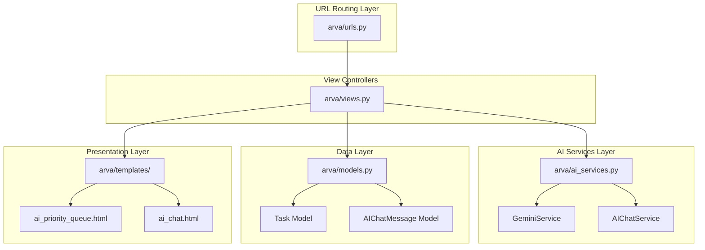
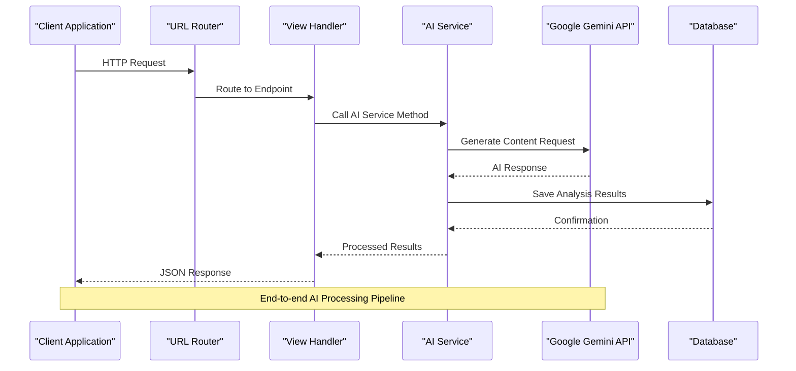
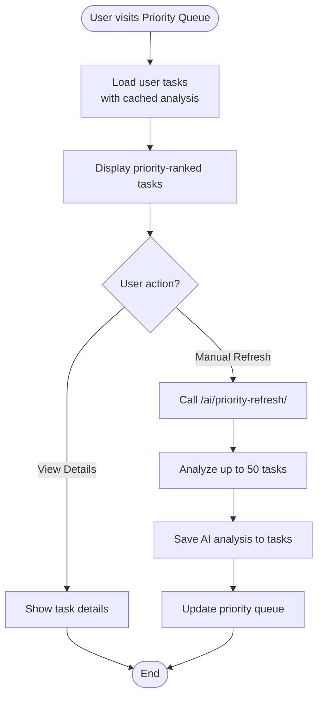
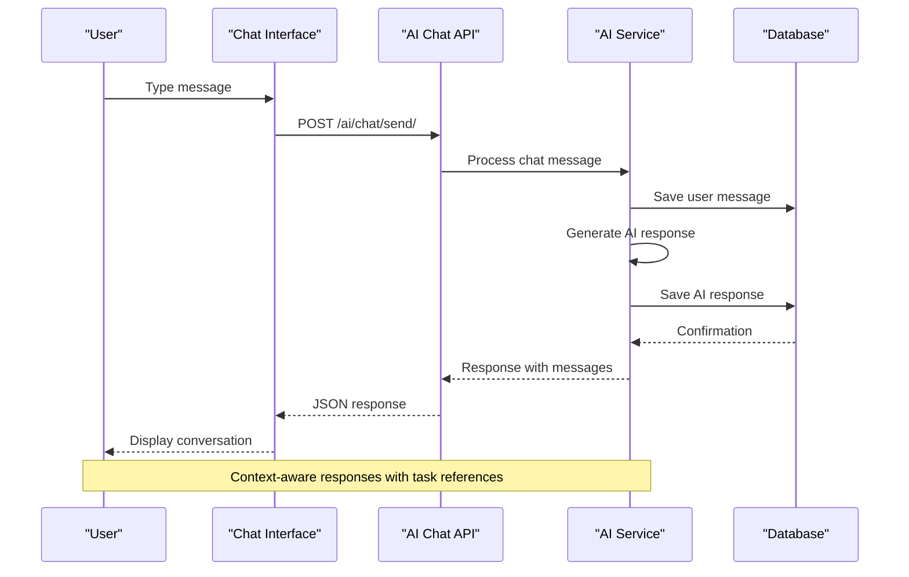

# AI Service Endpoints

<cite>
**Referenced Files in This Document**
- [arva/urls.py](file://arva/urls.py)
- [arva/views.py](file://arva/views.py)
- [arva/ai_services.py](file://arva/ai_services.py)
- [arva/models.py](file://arva/models.py)
- [arva/templates/arva/ai_priority_queue.html](file://arva/templates/arva/ai_priority_queue.html)
- [arva/templates/arva/ai_chat.html](file://arva/templates/arva/ai_chat.html)
</cite>

## Table of Contents
1. [Introduction](#introduction)
2. [Project Structure](#project-structure)
3. [Core Components](#core-components)
4. [Architecture Overview](#architecture-overview)
5. [Priority Queue Endpoints](#priority-queue-endpoints)
6. [Task Analysis Endpoints](#task-analysis-endpoints)
7. [AI Chat Assistant Endpoints](#ai-chat-assistant-endpoints)
8. [AI Service Configuration](#ai-service-configuration)
9. [Rate Limiting Considerations](#rate-limiting-considerations)
10. [Error Handling](#error-handling)
11. [Examples and Usage Patterns](#examples-and-usage-patterns)
12. [Troubleshooting Guide](#troubleshooting-guide)
13. [Conclusion](#conclusion)

## Introduction

This document provides comprehensive API documentation for the AI service endpoints in the Kanban project management system. The AI services include intelligent task prioritization, automated task analysis, and conversational AI assistance. These endpoints integrate with Google Gemini AI to provide smart insights and recommendations for task management.

The AI service endpoints are designed to enhance productivity by providing automated analysis of tasks, generating priority queues, and offering intelligent chat assistance for work planning and task management.

## Project Structure

The AI service implementation follows a layered architecture with clear separation of concerns:



**Diagram sources**
- [arva/urls.py](file://arva/urls.py#L86-L97)
- [arva/views.py](file://arva/views.py#L2100-L2323)
- [arva/ai_services.py](file://arva/ai_services.py#L11-L326)

**Section sources**
- [arva/urls.py](file://arva/urls.py#L86-L97)
- [arva/views.py](file://arva/views.py#L17-L31)
- [arva/ai_services.py](file://arva/ai_services.py#L1-L326)

## Core Components

### AI Service Architecture

The AI service architecture consists of two primary service classes:

1. **GeminiService**: Handles task priority analysis and project-wide analysis
2. **AIChatService**: Manages conversational AI interactions with context awareness

Both services utilize Google Gemini's v1 API and implement comprehensive error handling and response parsing.

### Key Data Models

The AI services integrate with several core models:

- **Task Model**: Enhanced with AI analysis fields (priority scores, complexity, estimated hours)
- **AIChatMessage Model**: Stores private chat conversations with users

**Section sources**
- [arva/ai_services.py](file://arva/ai_services.py#L11-L326)
- [arva/models.py](file://arva/models.py#L303-L308)
- [arva/models.py](file://arva/models.py#L430-L445)

## Architecture Overview

The AI service endpoints follow a RESTful architecture with JSON responses and proper HTTP status codes:



**Diagram sources**
- [arva/views.py](file://arva/views.py#L2155-L2202)
- [arva/ai_services.py](file://arva/ai_services.py#L115-L153)

## Priority Queue Endpoints

### GET /ai/priority-queue/

**Purpose**: Display the AI-prioritized task queue for the authenticated user.

**Request Parameters**: None (requires authentication)

**Response Format**:
```json
{
  "priorities": [
    {
      "task_id": 123,
      "task_title": "Project Analysis",
      "project_name": "Web Development",
      "priority_score": 85,
      "priority_level": "High",
      "complexity": "Medium",
      "estimated_hours": 8,
      "reasoning": "Complex project requires immediate attention due to tight deadline",
      "due_date": "15 Jan 2024",
      "task_list": "In Progress"
    }
  ],
  "total_tasks": 15
}
```

**Processing Logic**:
- Retrieves tasks assigned to or owned by the authenticated user
- Filters out archived and completed tasks
- Uses cached AI analysis results (no API calls on page load)
- Sorts tasks by priority score (highest first)

**Template Integration**: Renders the AI priority queue interface with real-time statistics and task ranking.

**Section sources**
- [arva/views.py](file://arva/views.py#L2100-L2151)
- [arva/templates/arva/ai_priority_queue.html](file://arva/templates/arva/ai_priority_queue.html#L552-L669)

### POST /ai/priority-refresh/

**Purpose**: Refresh AI analysis for all user tasks.

**Request Parameters**: None (requires authentication)

**Response Format**:
```json
{
  "success": true,
  "analyzed_count": 12,
  "message": "Successfully analyzed 12 tasks"
}
```

**Processing Logic**:
- Calls GeminiService.analyze_multiple_tasks() for up to 50 tasks
- Saves analysis results to Task model fields
- Updates AI analysis timestamps
- Returns success count and error information

**Error Handling**:
- Returns 400 status if AI service is not configured
- Returns 500 status for general exceptions

**Section sources**
- [arva/views.py](file://arva/views.py#L2153-L2202)
- [arva/ai_services.py](file://arva/ai_services.py#L155-L188)

## Task Analysis Endpoints

### POST /ai/analyze-task/<int:task_id>/

**Purpose**: Analyze a specific task using AI and return priority recommendations.

**Request Parameters**:
- `task_id`: Integer task identifier (URL parameter)

**Response Format**:
```json
{
  "success": true,
  "analysis": {
    "priority_score": 78,
    "priority_level": "High",
    "complexity": "Medium",
    "estimated_hours": 6,
    "reasoning": "Task involves multiple dependencies and requires coordination with team members",
    "recommended_action": "Start immediately as it blocks downstream tasks",
    "factors": {
      "deadline_urgency": 85,
      "complexity_score": 70,
      "dependency_impact": 90,
      "progress_factor": 45
    },
    "task_id": 123,
    "analyzed_at": "2024-01-15T10:30:00Z"
  }
}
```

**Processing Logic**:
- Validates user permissions for the task
- Calls GeminiService.analyze_task() for the specific task
- Saves analysis results to Task model
- Returns comprehensive analysis with scoring factors

**Access Control**: Requires either admin role or assignment to the task.

**Section sources**
- [arva/views.py](file://arva/views.py#L2004-L2040)
- [arva/ai_services.py](file://arva/ai_services.py#L115-L153)

### POST /ai/analyze-project/<int:pk>/

**Purpose**: Analyze all tasks within a project using AI.

**Request Parameters**:
- `pk`: Integer project identifier (URL parameter)

**Response Format**:
```json
{
  "success": true,
  "project_id": 456,
  "analysis_results": [
    {
      "task_id": 123,
      "priority_score": 85,
      "priority_level": "High",
      "complexity": "Medium",
      "estimated_hours": 8
    }
  ]
}
```

**Processing Logic**:
- Validates user permissions for the project
- Retrieves all non-archived, non-completed tasks in the project
- Analyzes each task individually
- Saves results to respective Task models
- Returns aggregated analysis results

**Access Control**: Requires admin or member role for the project.

**Section sources**
- [arva/views.py](file://arva/views.py#L2042-L2099)
- [arva/ai_services.py](file://arva/ai_services.py#L155-L165)

## AI Chat Assistant Endpoints

### GET /ai/chat/

**Purpose**: Display the AI chat interface with conversation history.

**Request Parameters**: None (requires authentication)

**Response Format**: HTML template rendering the chat interface with existing messages.

**Features**:
- Shows private chat history for the authenticated user
- Provides modern chat interface with typing indicators
- Includes quick action buttons for common requests

**Section sources**
- [arva/views.py](file://arva/views.py#L2218-L2228)
- [arva/templates/arva/ai_chat.html](file://arva/templates/arva/ai_chat.html#L684-L745)

### POST /ai/chat/send/

**Purpose**: Send a message to AI and receive a response.

**Request Parameters**:
- `message`: String containing the user's query

**Response Format**:
```json
{
  "success": true,
  "user_message": {
    "id": 1001,
    "content": "What should I work on today?",
    "created_at": "14:30"
  },
  "ai_message": {
    "id": 1002,
    "content": "Based on your tasks, I recommend starting with the 'API Integration' task as it has the highest priority and affects other team members.",
    "created_at": "14:31"
  }
}
```

**Processing Logic**:
- Validates non-empty message content
- Saves user message to AIChatMessage model
- Retrieves recent chat history (up to 10 messages)
- Calls AIChatService.chat() with user context
- Saves AI response to database
- Returns both user and AI messages

**Context Awareness**: Uses user's task context including deadlines, progress, and assignments.

**Section sources**
- [arva/views.py](file://arva/views.py#L2232-L2284)
- [arva/ai_services.py](file://arva/ai_services.py#L284-L316)

### POST /ai/chat/clear/

**Purpose**: Clear all chat history for the current user.

**Request Parameters**: None (requires authentication)

**Response Format**:
```json
{
  "success": true
}
```

**Processing Logic**:
- Deletes all AIChatMessage records for the authenticated user
- Returns success confirmation

**Section sources**
- [arva/views.py](file://arva/views.py#L2287-L2291)

### GET /ai/chat/today-work/

**Purpose**: Get AI recommendations for today's work prioritization.

**Request Parameters**: None (requires authentication)

**Response Format**:
```json
{
  "success": true,
  "message": {
    "id": 1003,
    "content": "For today, focus on completing the 'Database Migration' task (due tomorrow) as it has the highest urgency. Then move to 'Frontend Styling' which has moderate priority.",
    "created_at": "14:32"
  }
}
```

**Processing Logic**:
- Calls AIChatService.get_work_recommendation() with user context
- Saves AI recommendation as an assistant message
- Returns the recommendation with timestamp

**Section sources**
- [arva/views.py](file://arva/views.py#L2294-L2322)
- [arva/ai_services.py](file://arva/ai_services.py#L318-L321)

## AI Service Configuration

### Required Environment Variables

The AI services require the following configuration:

| Configuration | Type | Description | Example |
|---------------|------|-------------|---------|
| `GEMINI_API_KEY` | String | Google Gemini API authentication key | `AIzaSy...xyz` |
| `GOOGLE_API_VERSION` | String | API version specification | `v1` |

### Service Initialization

Both AI services initialize with the same configuration pattern:

```python
def __init__(self):
    api_key = getattr(settings, 'GEMINI_API_KEY', os.environ.get('GEMINI_API_KEY'))
    if not api_key:
        raise ValueError("GEMINI_API_KEY not configured")
    # Initialize client with v1 API
    self.client = genai.Client(api_key=api_key, http_options={'api_version': 'v1'})
    # Use gemini-2.5-flash (latest available model with quota)
    self.model_name = 'gemini-2.5-flash'
```

### Model Configuration

The AI services use the following model configurations:

- **Priority Analysis**: `gemini-2.5-flash` with JSON response parsing
- **Chat Assistant**: `gemini-2.5-flash` with conversational context

**Section sources**
- [arva/ai_services.py](file://arva/ai_services.py#L14-L21)
- [arva/ai_services.py](file://arva/ai_services.py#L199-L206)

## Rate Limiting Considerations

### API Quota Management

The AI services implement several mechanisms to handle rate limiting:

1. **Request Throttling**: 
   - Priority refresh limits to 50 tasks per request
   - Chat history limits to 10 messages for context
   - Task analysis limits to 20 tasks for priority queue

2. **Error Handling**:
   - Graceful degradation when API quotas are exceeded
   - User-friendly error messages for configuration issues
   - Fallback responses when AI services are unavailable

3. **Caching Strategy**:
   - Priority queue displays cached analysis results
   - Chat messages are stored locally for privacy and performance
   - Reduced API calls for page loads

### Error Response Patterns

Common error scenarios and their HTTP status codes:

| Error Type | HTTP Status | Response Format | Description |
|------------|-------------|-----------------|-------------|
| Configuration Error | 400 | `{success: false, error: "AI service not configured"}` | Missing API key or invalid configuration |
| Authentication Error | 403 | `{success: false, error: "Forbidden"}` | Insufficient permissions |
| General Error | 500 | `{success: false, error: "Error message"}` | Unexpected service failure |
| Quota Exceeded | 503 | `{success: false, error: "Service temporarily unavailable"}` | API quota limitations |

**Section sources**
- [arva/views.py](file://arva/views.py#L2193-L2202)
- [arva/views.py](file://arva/views.py#L2278-L2284)

## Error Handling

### Comprehensive Error Management

The AI service endpoints implement robust error handling:

1. **Configuration Validation**: Checks for GEMINI_API_KEY presence
2. **Permission Validation**: Verifies user access to requested resources
3. **API Response Parsing**: Handles JSON parsing errors gracefully
4. **Database Operations**: Manages transaction failures and data consistency

### Error Response Structure

All error responses follow a consistent JSON format:

```json
{
  "success": false,
  "error": "Descriptive error message"
}
```

### Recovery Strategies

- **Retry Logic**: Automatic retry for transient network errors
- **Fallback Content**: Display cached results when AI services fail
- **Graceful Degradation**: Continue operation with reduced functionality
- **User Feedback**: Clear error messages with actionable guidance

**Section sources**
- [arva/ai_services.py](file://arva/ai_services.py#L143-L153)
- [arva/ai_services.py](file://arva/ai_services.py#L315-L316)

## Examples and Usage Patterns

### Priority Queue Analysis Workflow



**Diagram sources**
- [arva/views.py](file://arva/views.py#L2100-L2151)
- [arva/views.py](file://arva/views.py#L2153-L2202)

### Chat Conversation Flow



**Diagram sources**
- [arva/views.py](file://arva/views.py#L2232-L2284)
- [arva/ai_services.py](file://arva/ai_services.py#L284-L316)

### AI Analysis Results

Example analysis structure returned by AI services:

| Field | Type | Description | Example |
|-------|------|-------------|---------|
| `priority_score` | Integer | Overall priority rating (1-100) | 85 |
| `priority_level` | String | Priority category | "High" |
| `complexity` | String | Task complexity level | "Medium" |
| `estimated_hours` | Integer | Estimated completion time | 6 |
| `reasoning` | String | AI justification for recommendation | "Task blocks downstream dependencies" |
| `factors.deadline_urgency` | Integer | Deadline importance (1-100) | 90 |
| `factors.dependency_impact` | Integer | Impact on other tasks (1-100) | 85 |

**Section sources**
- [arva/ai_services.py](file://arva/ai_services.py#L96-L113)
- [arva/ai_services.py](file://arva/ai_services.py#L143-L153)

## Troubleshooting Guide

### Common Issues and Solutions

#### AI Service Not Configured
**Symptoms**: Error messages indicating AI service not configured
**Solution**: Set `GEMINI_API_KEY` environment variable or Django setting

#### Permission Denied Errors
**Symptoms**: 403 Forbidden responses on task analysis
**Solution**: Verify user has appropriate project permissions or is assigned to the task

#### API Quota Exceeded
**Symptoms**: 503 Service Unavailable responses
**Solution**: Wait for quota reset or upgrade API plan

#### JSON Parsing Failures
**Symptoms**: "Failed to parse AI response" errors
**Solution**: Check AI service configuration and API key validity

### Debugging Steps

1. **Verify API Key**: Test Gemini API key with model availability check
2. **Check Permissions**: Ensure user has access to requested tasks/projects
3. **Monitor Quotas**: Track API usage and adjust request frequency
4. **Review Logs**: Check server logs for detailed error information

**Section sources**
- [arva/views.py](file://arva/views.py#L2193-L2202)
- [arva/ai_services.py](file://arva/ai_services.py#L16-L21)

## Conclusion

The AI service endpoints provide comprehensive intelligent task management capabilities through Google Gemini integration. The implementation offers:

- **Smart Task Prioritization**: Automated priority analysis with detailed reasoning
- **Conversational AI**: Context-aware chat assistance for work planning
- **Privacy-Focused Design**: Private chat storage with user-specific data
- **Robust Error Handling**: Graceful degradation and user-friendly error messages
- **Performance Optimization**: Caching strategies and efficient API usage

The endpoints are designed for production use with proper authentication, authorization, and error handling. The modular architecture allows for easy extension and customization of AI capabilities.

Future enhancements could include additional AI models, enhanced context awareness, and expanded analytical capabilities for project management insights.