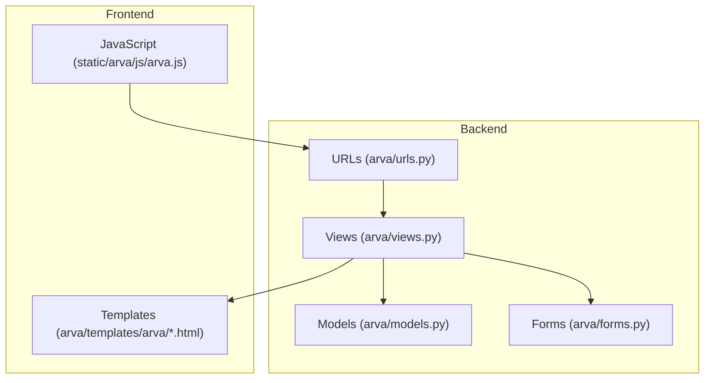
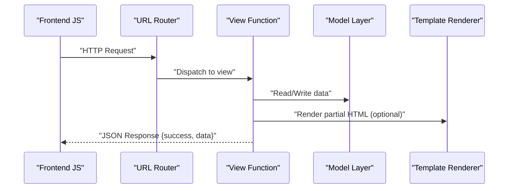
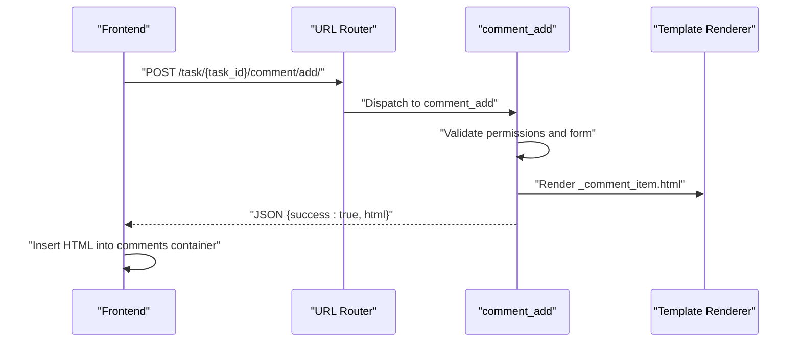
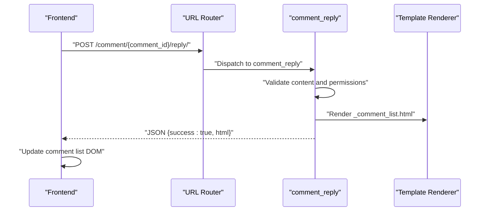
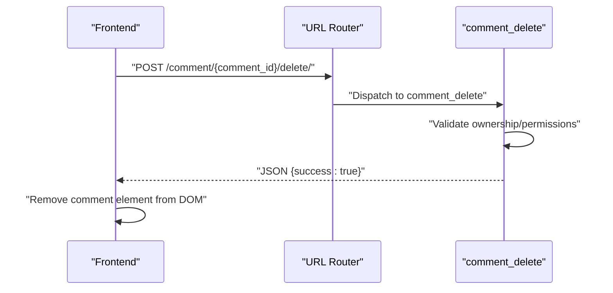
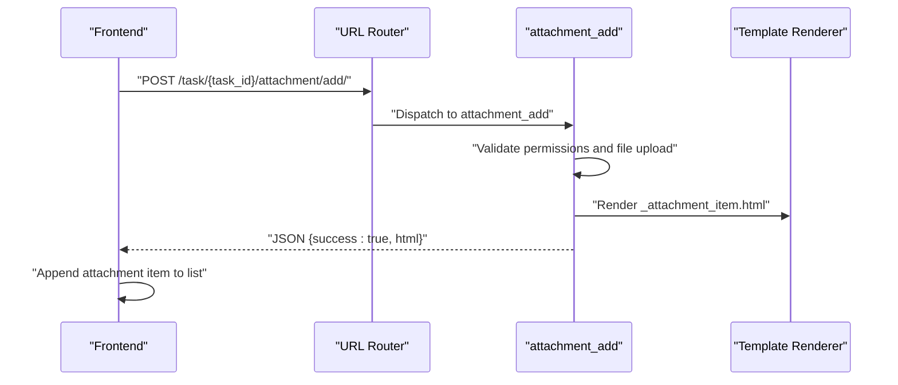
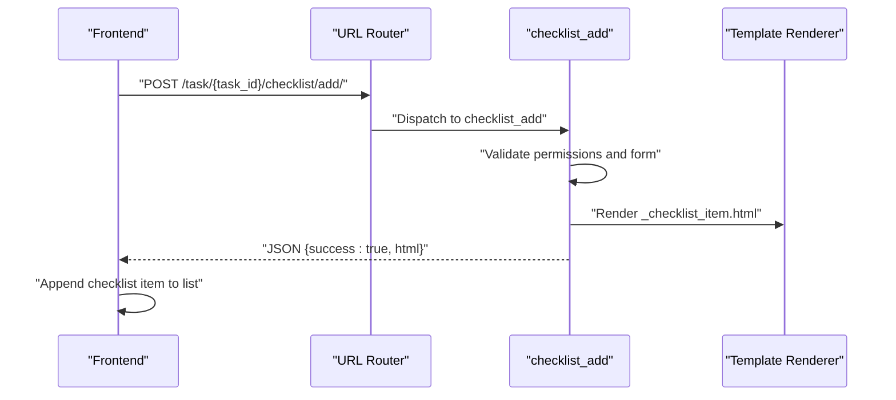
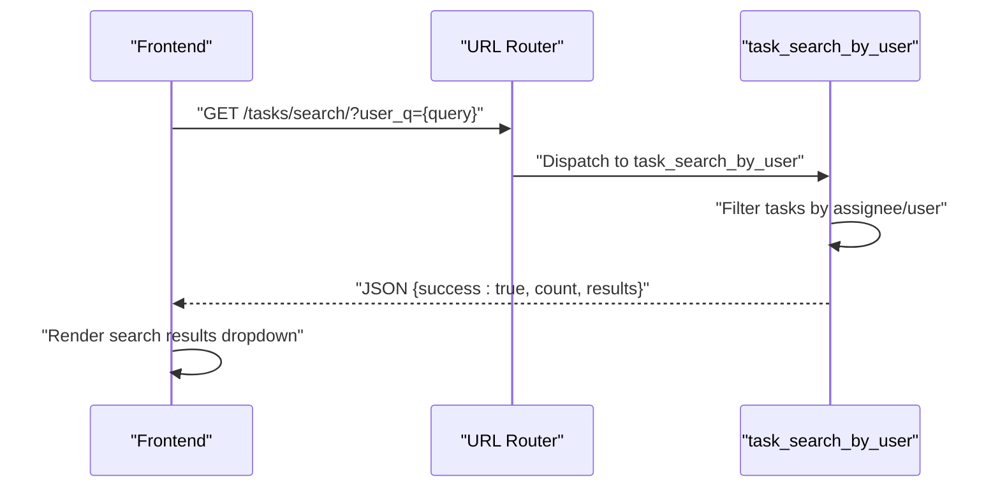
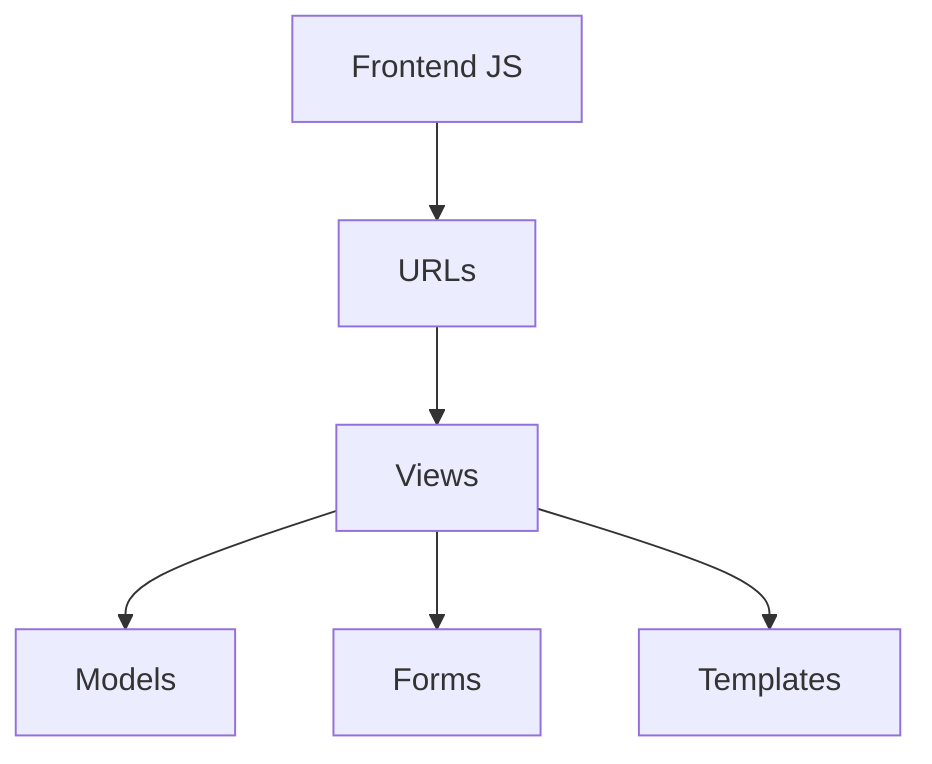

# AJAX Interaction Endpoints

<cite>
**Referenced Files in This Document**
- [arva/views.py](file://arva/views.py)
- [arva/urls.py](file://arva/urls.py)
- [arva/models.py](file://arva/models.py)
- [arva/forms.py](file://arva/forms.py)
- [arva/templates/arva/_comment_item.html](file://arva/templates/arva/_comment_item.html)
- [arva/templates/arva/_attachment_item.html](file://arva/templates/arva/_attachment_item.html)
- [arva/templates/arva/_checklist_item.html](file://arva/templates/arva/_checklist_item.html)
- [arva/templates/arva/_task_view.html](file://arva/templates/arva/_task_view.html)
- [static/arva/js/arva.js](file://static/arva/js/arva.js)
</cite>

## Table of Contents
1. [Introduction](#introduction)
2. [Project Structure](#project-structure)
3. [Core Components](#core-components)
4. [Architecture Overview](#architecture-overview)
5. [Detailed Component Analysis](#detailed-component-analysis)
6. [Dependency Analysis](#dependency-analysis)
7. [Performance Considerations](#performance-considerations)
8. [Troubleshooting Guide](#troubleshooting-guide)
9. [Conclusion](#conclusion)

## Introduction
This document provides comprehensive API documentation for AJAX interaction endpoints used in real-time frontend interactions. It covers comment management, attachment management, checklist management, and search functionality. For each endpoint, the specification includes request formats, response schemas, success/error indicators, and frontend integration patterns. Examples of AJAX request/response cycles and error handling strategies are included to guide developers implementing or extending these features.

## Project Structure
The AJAX endpoints are implemented as Django views with URL routing defined in the URL configuration. Templates are used to render partial HTML fragments returned by the endpoints. The frontend JavaScript handles AJAX requests and updates the DOM accordingly.

**Diagram sources**
- [arva/views.py](file://arva/views.py#L1791-L1872)
- [arva/urls.py](file://arva/urls.py#L58-L68)
- [arva/models.py](file://arva/models.py#L353-L385)
- [arva/forms.py](file://arva/forms.py#L293-L311)
- [static/arva/js/arva.js](file://static/arva/js/arva.js#L105-L230)

**Section sources**
- [arva/views.py](file://arva/views.py#L1-L50)
- [arva/urls.py](file://arva/urls.py#L1-L98)

## Core Components
This section outlines the AJAX endpoints for real-time interactions, including their HTTP methods, URL patterns, request parameters, response schemas, and frontend integration.

- Comment Management
  - Add comment: POST /task/{task_id}/comment/add/
  - Reply to comment: POST /comment/{comment_id}/reply/
  - Delete comment: POST /comment/{comment_id}/delete/

- Attachment Management
  - Add attachment: POST /task/{task_id}/attachment/add/

- Checklist Management
  - Add item: POST /task/{task_id}/checklist/add/
  - Edit item: POST /checklist/{item_id}/edit/
  - Delete item: POST /checklist/{item_id}/delete/
  - Toggle item: POST /checklist/{item_id}/toggle/

- Search Functionality
  - User-based task search: GET /tasks/search/

Each endpoint returns a JSON response with a success indicator and either data or error details. Frontend JavaScript handles AJAX requests and updates the DOM using rendered templates.

**Section sources**
- [arva/urls.py](file://arva/urls.py#L58-L68)
- [arva/views.py](file://arva/views.py#L1791-L1872)
- [arva/views.py](file://arva/views.py#L1874-L1897)
- [arva/views.py](file://arva/views.py#L1899-L1923)
- [arva/views.py](file://arva/views.py#L1925-L1997)
- [arva/views.py](file://arva/views.py#L1614-L1615)

## Architecture Overview
The AJAX endpoints follow a consistent pattern:
- URL routing maps endpoints to view functions.
- Views validate permissions, process requests, and return JSON responses.
- Successful responses often include rendered HTML fragments for quick DOM updates.
- Frontend JavaScript sends AJAX requests and handles responses.

**Diagram sources**
- [arva/urls.py](file://arva/urls.py#L58-L68)
- [arva/views.py](file://arva/views.py#L1791-L1812)
- [arva/views.py](file://arva/views.py#L1874-L1897)
- [arva/views.py](file://arva/views.py#L1899-L1923)
- [arva/views.py](file://arva/views.py#L1925-L1997)

## Detailed Component Analysis

### Comment Management Endpoints

#### Add Comment
- Method: POST
- URL: /task/{task_id}/comment/add/
- Request Parameters:
  - content: string (required)
- Response Schema:
  - success: boolean
  - html: string (rendered comment item)
- Error Indicators:
  - 400 Bad Request: Form validation errors
  - 403 Forbidden: Insufficient permissions
  - 400 Project Closed: Project locked
- Frontend Integration:
  - Triggered by clicking "Add Comment" in task view.
  - On success, appends rendered HTML fragment to comments container.
  - On error, displays validation messages.

**Diagram sources**
- [arva/views.py](file://arva/views.py#L1791-L1812)
- [arva/templates/arva/_comment_item.html](file://arva/templates/arva/_comment_item.html#L1-L9)

**Section sources**
- [arva/urls.py](file://arva/urls.py#L58-L60)
- [arva/views.py](file://arva/views.py#L1791-L1812)
- [arva/templates/arva/_comment_item.html](file://arva/templates/arva/_comment_item.html#L1-L9)

#### Reply to Comment
- Method: POST
- URL: /comment/{comment_id}/reply/
- Request Parameters:
  - content: string (required)
- Response Schema:
  - success: boolean
  - html: string (rendered comment list fragment)
- Error Indicators:
  - 400 Bad Request: Empty content
  - 403 Forbidden: Insufficient permissions
  - 400 Project Closed: Project locked
- Frontend Integration:
  - Triggered by replying to an existing comment.
  - Renders a partial comment list and inserts it into the DOM.

**Diagram sources**
- [arva/views.py](file://arva/views.py#L1816-L1851)
- [arva/templates/arva/_comment_item.html](file://arva/templates/arva/_comment_item.html#L1-L9)

**Section sources**
- [arva/urls.py](file://arva/urls.py#L60-L60)
- [arva/views.py](file://arva/views.py#L1816-L1851)

#### Delete Comment
- Method: POST
- URL: /comment/{comment_id}/delete/
- Request Parameters: none
- Response Schema:
  - success: boolean
- Error Indicators:
  - 403 Forbidden: Not author or project owner
  - 400 Project Closed: Project locked
- Frontend Integration:
  - Triggered by clicking delete on owned comments.
  - Removes the comment element from the DOM on success.

**Diagram sources**
- [arva/views.py](file://arva/views.py#L1855-L1872)

**Section sources**
- [arva/urls.py](file://arva/urls.py#L60-L60)
- [arva/views.py](file://arva/views.py#L1855-L1872)

### Attachment Management Endpoints

#### Add Attachment
- Method: POST
- URL: /task/{task_id}/attachment/add/
- Request Parameters:
  - file: file upload (required)
- Response Schema:
  - success: boolean
  - html: string (rendered attachment item)
- Error Indicators:
  - 400 Bad Request: Form validation errors
  - 403 Forbidden: Insufficient permissions
  - 400 Project Closed: Project locked
- Frontend Integration:
  - Triggered by selecting a file in task view.
  - Appends rendered attachment item to the attachments list.

**Diagram sources**
- [arva/views.py](file://arva/views.py#L1874-L1897)
- [arva/templates/arva/_attachment_item.html](file://arva/templates/arva/_attachment_item.html#L1-L7)

**Section sources**
- [arva/urls.py](file://arva/urls.py#L61-L62)
- [arva/views.py](file://arva/views.py#L1874-L1897)
- [arva/templates/arva/_attachment_item.html](file://arva/templates/arva/_attachment_item.html#L1-L7)

### Checklist Management Endpoints

#### Add Checklist Item
- Method: POST
- URL: /task/{task_id}/checklist/add/
- Request Parameters:
  - content: string (required)
- Response Schema:
  - success: boolean
  - html: string (rendered checklist item)
- Error Indicators:
  - 400 Bad Request: Form validation errors
  - 403 Forbidden: Insufficient permissions
  - 400 Project Closed: Project locked
  - 400 Checklist Disabled: Project tasks do not support checklists
- Frontend Integration:
  - Triggered by clicking "Add Item" in checklist section.
  - Appends rendered checklist item to the checklist list.

**Diagram sources**
- [arva/views.py](file://arva/views.py#L1899-L1923)
- [arva/templates/arva/_checklist_item.html](file://arva/templates/arva/_checklist_item.html#L1-L9)

**Section sources**
- [arva/urls.py](file://arva/urls.py#L64-L68)
- [arva/views.py](file://arva/views.py#L1899-L1923)
- [arva/templates/arva/_checklist_item.html](file://arva/templates/arva/_checklist_item.html#L1-L9)

#### Edit Checklist Item
- Method: POST
- URL: /checklist/{item_id}/edit/
- Request Parameters:
  - content: string (required)
- Response Schema:
  - success: boolean
- Error Indicators:
  - 400 Bad Request: Empty content
  - 403 Forbidden: Insufficient permissions
  - 400 Project Closed: Project locked
  - 400 Checklist Disabled: Project tasks do not support checklists
- Frontend Integration:
  - Triggered by editing checklist item content inline.
  - Updates the item content on success.

**Section sources**
- [arva/urls.py](file://arva/urls.py#L65-L65)
- [arva/views.py](file://arva/views.py#L1925-L1953)

#### Delete Checklist Item
- Method: POST
- URL: /checklist/{item_id}/delete/
- Request Parameters: none
- Response Schema:
  - success: boolean
- Error Indicators:
  - 403 Forbidden: Insufficient permissions
  - 400 Project Closed: Project locked
  - 400 Checklist Disabled: Project tasks do not support checklists
- Frontend Integration:
  - Triggered by clicking delete on checklist items.
  - Removes the item from the DOM on success.

**Section sources**
- [arva/urls.py](file://arva/urls.py#L66-L66)
- [arva/views.py](file://arva/views.py#L1976-L1997)

#### Toggle Checklist Item
- Method: POST
- URL: /checklist/{item_id}/toggle/
- Request Parameters: none
- Response Schema:
  - success: boolean
  - is_done: boolean (new state)
- Error Indicators:
  - 403 Forbidden: Insufficient permissions
  - 400 Project Closed: Project locked
  - 400 Checklist Disabled: Project tasks do not support checklists
- Frontend Integration:
  - Triggered by checking/unchecking checklist items.
  - Updates the checkbox state and applies strikethrough styling.

**Section sources**
- [arva/urls.py](file://arva/urls.py#L67-L68)
- [arva/views.py](file://arva/views.py#L1955-L1974)

### Search Functionality

#### User-Based Task Search
- Method: GET
- URL: /tasks/search/
- Query Parameters:
  - user_q: string (required)
- Response Schema:
  - success: boolean
  - count: number
  - results: array of objects
    - id: number
    - title: string
    - project_id: number
    - project_name: string
    - status: string
    - due_date: string (ISO date)
    - due_date_display: string
    - assignees: array of strings
    - assignees_display: string
    - url: string
- Error Indicators:
  - 400 Bad Request: Validation errors (if any)
- Frontend Integration:
  - Triggered by typing in the task user search widget.
  - Debounced with a 220ms delay.
  - Renders a dropdown with matching tasks.

**Diagram sources**
- [arva/views.py](file://arva/views.py#L417-L464)
- [static/arva/js/arva.js](file://static/arva/js/arva.js#L190-L216)

**Section sources**
- [arva/urls.py](file://arva/urls.py#L14-L14)
- [arva/views.py](file://arva/views.py#L417-L464)
- [static/arva/js/arva.js](file://static/arva/js/arva.js#L190-L216)

## Dependency Analysis
The AJAX endpoints depend on Django models, forms, and templates. The frontend JavaScript depends on CSRF token handling and jQuery/Swagger utilities for UI feedback.

**Diagram sources**
- [arva/urls.py](file://arva/urls.py#L1-L98)
- [arva/views.py](file://arva/views.py#L19-L31)
- [arva/models.py](file://arva/models.py#L353-L385)
- [arva/forms.py](file://arva/forms.py#L293-L311)
- [static/arva/js/arva.js](file://static/arva/js/arva.js#L1-L20)

**Section sources**
- [arva/models.py](file://arva/models.py#L353-L385)
- [arva/forms.py](file://arva/forms.py#L293-L311)
- [static/arva/js/arva.js](file://static/arva/js/arva.js#L1-L20)

## Performance Considerations
- Use partial HTML rendering to minimize payload sizes.
- Apply client-side debouncing for search endpoints to reduce server load.
- Limit result sets (e.g., top 200 tasks) to maintain responsiveness.
- Avoid unnecessary re-renders by updating only affected DOM nodes.

## Troubleshooting Guide
Common issues and resolutions:
- CSRF Token Errors: Ensure the frontend sets the X-CSRFToken header for POST requests.
- Permission Denied: Verify user role and assignment to the task or project ownership.
- Project Locked: Check project closure status before performing write operations.
- Validation Errors: Display form errors returned in the errors field of the JSON response.
- Network Failures: Implement retry logic and user-friendly error messages using the frontend alert utilities.

**Section sources**
- [static/arva/js/arva.js](file://static/arva/js/arva.js#L1-L20)
- [arva/views.py](file://arva/views.py#L111-L115)
- [arva/views.py](file://arva/views.py#L1791-L1812)
- [arva/views.py](file://arva/views.py#L1874-L1897)
- [arva/views.py](file://arva/views.py#L1899-L1923)
- [arva/views.py](file://arva/views.py#L1925-L1997)

## Conclusion
The AJAX endpoints provide a robust foundation for real-time interactions in the Kanban application. By following the documented request/response patterns and integrating with the provided frontend utilities, developers can implement seamless user experiences for comments, attachments, checklists, and search functionality.