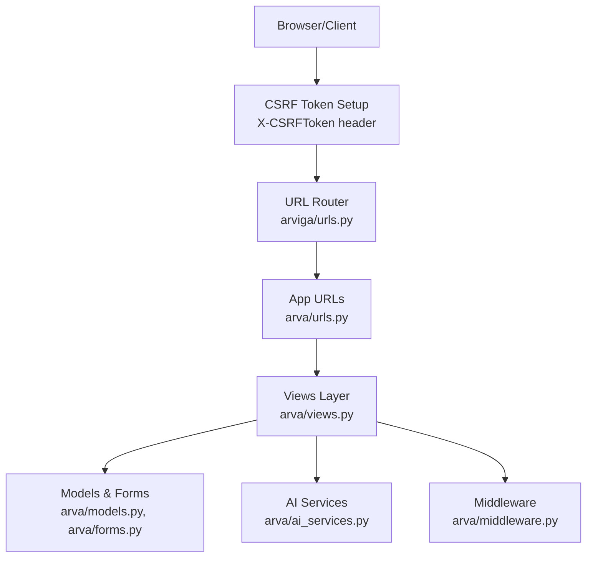
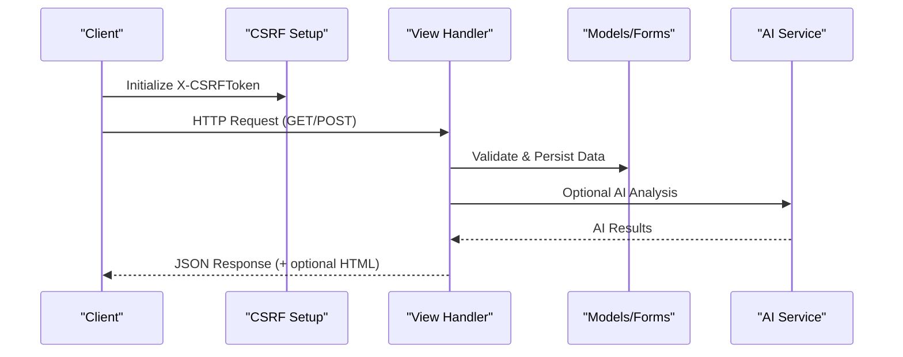
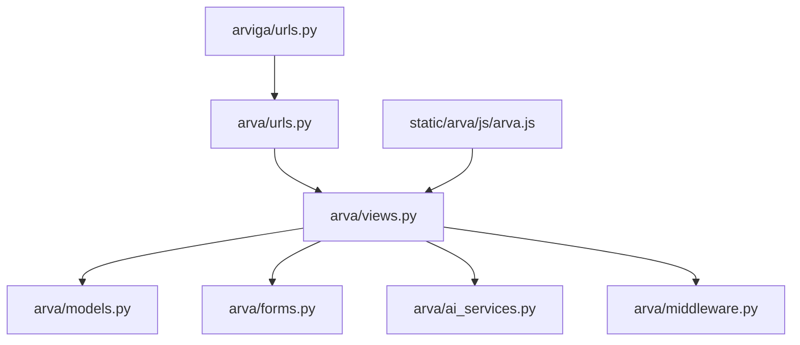

# API Endpoints Reference

<cite>
**Referenced Files in This Document**
- [arva/urls.py](file://arva/urls.py)
- [arva/views.py](file://arva/views.py)
- [arva/models.py](file://arva/models.py)
- [arva/forms.py](file://arva/forms.py)
- [arva/ai_services.py](file://arva/ai_services.py)
- [arva/middleware.py](file://arva/middleware.py)
- [arviga/urls.py](file://arviga/urls.py)
- [static/arva/js/arva.js](file://static/arva/js/arva.js)
</cite>

## Table of Contents
1. [Introduction](#introduction)
2. [Project Structure](#project-structure)
3. [Core Components](#core-components)
4. [Architecture Overview](#architecture-overview)
5. [Detailed Component Analysis](#detailed-component-analysis)
6. [Dependency Analysis](#dependency-analysis)
7. [Performance Considerations](#performance-considerations)
8. [Troubleshooting Guide](#troubleshooting-guide)
9. [Conclusion](#conclusion)
10. [Appendices](#appendices)

## Introduction
This document provides a comprehensive API reference for Arva Kanban’s RESTful endpoints and AJAX handlers. It covers:
- Authentication and authorization requirements
- Endpoint categories: project management, task management, user management, and AI services
- Request/response schemas, status codes, and error handling
- Real-time AJAX interactions (drag-and-drop updates, comments, task status changes)
- Practical client implementation guidelines and integration patterns
- Versioning, backwards compatibility, and deprecation policies

## Project Structure
Arva Kanban follows a standard Django project layout with a dedicated app named arva. URLs are routed through arva/urls.py and included by arviga/urls.py. AJAX interactions are handled client-side in static/arva/js/arva.js.

**Diagram sources**
- [arviga/urls.py](file://arviga/urls.py#L6-L10)
- [arva/urls.py](file://arva/urls.py#L1-L98)
- [arva/views.py](file://arva/views.py#L1-L50)
- [arva/models.py](file://arva/models.py#L1-L120)
- [arva/ai_services.py](file://arva/ai_services.py#L1-L50)
- [arva/middleware.py](file://arva/middleware.py#L1-L39)

**Section sources**
- [arviga/urls.py](file://arviga/urls.py#L1-L15)
- [arva/urls.py](file://arva/urls.py#L1-L98)

## Core Components
- Authentication: Login/logout endpoints and session-based authentication via Django. AJAX requests include CSRF protection.
- Authorization: Role checks are simplified to “project access” with owner-only controls for sensitive operations.
- Data models: Projects, Tasks, TaskLists, Comments, Attachments, Checklists, and AI chat messages.
- AI services: Priority analysis and chat assistant powered by Google Gemini.

**Section sources**
- [arva/views.py](file://arva/views.py#L70-L82)
- [arva/views.py](file://arva/views.py#L91-L104)
- [arva/models.py](file://arva/models.py#L101-L345)
- [arva/ai_services.py](file://arva/ai_services.py#L11-L326)

## Architecture Overview
The backend exposes REST-like endpoints mapped to Django views. AJAX handlers in the frontend communicate with these endpoints using jQuery and fetch APIs, including CSRF headers and XMLHTTPRequest detection for partial HTML updates.

**Diagram sources**
- [static/arva/js/arva.js](file://static/arva/js/arva.js#L1-L20)
- [arva/views.py](file://arva/views.py#L1394-L1538)
- [arva/ai_services.py](file://arva/ai_services.py#L115-L165)

## Detailed Component Analysis

### Authentication and Authorization
- Login: GET /login/
- Logout: POST /logout/ (also accepts GET)
- CSRF: All AJAX requests include X-CSRFToken header.
- Session-based auth: @login_required decorator protects most endpoints.
- Authorization rules:
  - Owner-only operations: project edit/delete/close/reopen, member role updates.
  - General access: project view and basic operations for users with project access.
  - Locked project: Certain operations return a 400 error indicating the project is closed.

**Section sources**
- [arva/urls.py](file://arva/urls.py#L7-L8)
- [arva/views.py](file://arva/views.py#L70-L82)
- [arva/views.py](file://arva/views.py#L91-L104)
- [arva/views.py](file://arva/views.py#L111-L115)

### Project Management Endpoints
- GET /
  - Purpose: Project list page
  - Auth: Required
  - Response: HTML partial or full page depending on X-Requested-With
- GET /my/cards/
  - Purpose: My cards view
  - Auth: Required
- GET /tasks/search/
  - Purpose: Search tasks by assignee/user query
  - Auth: Required
  - Query params: user_q, status, due, label, project
  - Response: JSON with results array
- POST /project/create/
  - Purpose: Create a new project
  - Auth: Required
  - Body: Form fields from ProjectForm
  - Response: JSON with success flag, project id/name, and rendered HTML fragment
- GET /project/{pk}/
  - Purpose: Project detail view
  - Auth: Required
  - Query params: q, assignee, assignee_q, status, priority, label, due, page, per_page, scope, sub
  - Response: HTML partial or full page
- POST /project/{pk}/update/
  - Purpose: Update project metadata
  - Auth: Required (owner-only)
  - Body: Form fields from ProjectForm
  - Response: JSON success with updated fields
- POST /project/{pk}/delete/
  - Purpose: Delete project (must be empty)
  - Auth: Required (owner-only)
  - Response: JSON success or error
- POST /project/{pk}/close/
  - Purpose: Close a structured project
  - Auth: Required (owner-only)
  - Response: JSON success with is_closed flag
- POST /project/{pk}/reopen/
  - Purpose: Reopen a structured project
  - Auth: Required (owner-only)
  - Response: JSON success with is_closed flag
- POST /project/{pk}/convert-subproject/
  - Purpose: Convert project to subproject
  - Auth: Required (owner-only)
  - Body: target_project_id
  - Response: JSON success with new subproject id and target project id
- GET /project/{pk}/activity/
  - Purpose: Project activity log
  - Auth: Required (owner-only)
  - Query params: q, action, user, date_from, date_to
  - Response: HTML partial
- GET /project/{pk}/archive/
  - Purpose: Archived lists/tasks
  - Auth: Required (owner-only)
  - Response: HTML partial
- GET /project/{pk}/subprojects/list/
  - Purpose: Subprojects list
  - Auth: Required
  - Response: JSON with subprojects array
- GET /project/{pk}/lists/
  - Purpose: Available task lists for a project
  - Auth: Required
  - Query params: sub_project_id
  - Response: JSON with lists array

**Section sources**
- [arva/urls.py](file://arva/urls.py#L12-L25)
- [arva/views.py](file://arva/views.py#L394-L464)
- [arva/views.py](file://arva/views.py#L476-L526)
- [arva/views.py](file://arva/views.py#L991-L1009)
- [arva/views.py](file://arva/views.py#L1103-L1125)
- [arva/views.py](file://arva/views.py#L1014-L1031)
- [arva/views.py](file://arva/views.py#L1036-L1053)
- [arva/views.py](file://arva/views.py#L1057-L1100)
- [arva/views.py](file://arva/views.py#L905-L971)
- [arva/views.py](file://arva/views.py#L887-L902)
- [arva/views.py](file://arva/views.py#L707-L710)
- [arva/views.py](file://arva/views.py#L1377-L1390)

### Project Members Endpoints
- GET /project/{pk}/members/
  - Purpose: Project members page
  - Auth: Required (owner-only)
  - Response: HTML partial
- POST /project/{pk}/members/add/
  - Purpose: Add member to project
  - Auth: Required (owner-only)
  - Body: user (user id)
  - Response: Redirect or JSON success
- POST /project/member/{member_id}/update/
  - Purpose: Update member role (deprecated; role normalization)
  - Auth: Required (owner-only)
  - Response: JSON success
- POST /project/member/{member_id}/delete/
  - Purpose: Remove member from project
  - Auth: Required (owner-only)
  - Response: Redirect or JSON success
- POST /project-member/{pm_id}/update-role/
  - Purpose: Normalize role (deprecated)
  - Auth: Required (owner-only)
  - Response: JSON success
- POST /project-member/{pm_id}/remove/
  - Purpose: Remove membership
  - Auth: Required (owner-only)
  - Response: JSON success

**Section sources**
- [arva/urls.py](file://arva/urls.py#L28-L31)
- [arva/views.py](file://arva/views.py#L1128-L1142)
- [arva/views.py](file://arva/views.py#L1146-L1174)
- [arva/views.py](file://arva/views.py#L1177-L1199)
- [arva/views.py](file://arva/views.py#L1203-L1209)
- [arva/views.py](file://arva/views.py#L370-L379)
- [arva/views.py](file://arva/views.py#L383-L391)

### Task Lists Endpoints
- POST /project/{pk}/list/create/
  - Purpose: Create a task list
  - Auth: Required (admin/member)
  - Body: name, sub_project_id (optional)
  - Response: JSON success with rendered HTML fragment
- POST /project/{pk}/list/reorder/
  - Purpose: Reorder task lists
  - Auth: Required (admin)
  - Body: ordered_ids[] (array), sub_project_id (optional)
  - Response: JSON success
- POST /list/{list_id}/delete/
  - Purpose: Delete a task list
  - Auth: Required (admin)
  - Response: JSON success
- POST /list/{list_id}/archive/
  - Purpose: Archive a task list
  - Auth: Required (admin)
  - Response: JSON success
- POST /list/{list_id}/unarchive/
  - Purpose: Unarchive a task list
  - Auth: Required (admin)
  - Response: JSON success

**Section sources**
- [arva/urls.py](file://arva/urls.py#L34-L39)
- [arva/views.py](file://arva/views.py#L1213-L1247)
- [arva/views.py](file://arva/views.py#L1251-L1270)
- [arva/views.py](file://arva/views.py#L1274-L1287)
- [arva/views.py](file://arva/views.py#L1291-L1305)
- [arva/views.py](file://arva/views.py#L1309-L1322)

### Tasks Endpoints
- POST /project/{pk}/task/create/
  - Purpose: Create a task
  - Auth: Required (admin/member)
  - Body: task_list_id, title, description, priority, status, start_date, due_date, assignees[], labels[], sub_project_id (optional)
  - Response: JSON success with rendered HTML fragments for card and list row
- GET /task/{task_id}/view/
  - Purpose: Task detail view
  - Auth: Required (assignee/admin or project access)
  - Response: JSON success with rendered HTML fragment
- POST /task/{task_id}/update/
  - Purpose: Update task (general form)
  - Auth: Required (assignee/admin or project access)
  - Body: Form fields from TaskForm
  - Response: JSON success with rendered HTML fragment
- POST /task/{task_id}/delete/
  - Purpose: Delete a task
  - Auth: Required (admin)
  - Response: JSON success
- POST /task/{task_id}/move/
  - Purpose: Move task within a project
  - Auth: Required (admin/member or assignee)
  - Body: task_list_id, ordered_ids[] (optional)
  - Response: JSON success
- POST /task/{task_id}/transfer/
  - Purpose: Transfer task to another project
  - Auth: Required (admin/member or assignee)
  - Body: project_id, task_list_id (optional), sub_project_id (optional)
  - Response: JSON success
- POST /task/{task_id}/archive/
  - Purpose: Archive a task
  - Auth: Required (admin)
  - Response: JSON success
- POST /task/{task_id}/unarchive/
  - Purpose: Unarchive a task
  - Auth: Required (admin)
  - Response: JSON success
- POST /task/{task_id}/inline-update/
  - Purpose: Inline updates (title, description, status, dates, priority, assignees, labels, cover_color)
  - Auth: Required (assignee/admin or project access)
  - Body: field, value
  - Response: JSON success with rendered HTML fragments

**Section sources**
- [arva/urls.py](file://arva/urls.py#L48-L56)
- [arva/views.py](file://arva/views.py#L1542-L1606)
- [arva/views.py](file://arva/views.py#L1325-L1374)
- [arva/views.py](file://arva/views.py#L1610-L1637)
- [arva/views.py](file://arva/views.py#L1641-L1654)
- [arva/views.py](file://arva/views.py#L1659-L1689)
- [arva/views.py](file://arva/views.py#L1694-L1753)
- [arva/views.py](file://arva/views.py#L1757-L1787)
- [arva/views.py](file://arva/views.py#L1790-L1872)
- [arva/views.py](file://arva/views.py#L1875-L1897)
- [arva/views.py](file://arva/views.py#L1899-L1997)
- [arva/views.py](file://arva/views.py#L1394-L1538)

### Comments and Attachments Endpoints
- POST /task/{task_id}/comment/add/
  - Purpose: Add a top-level comment
  - Auth: Required (assignee/admin or project access)
  - Body: content
  - Response: JSON success with rendered HTML fragment
- POST /comment/{comment_id}/reply/
  - Purpose: Reply to a comment
  - Auth: Required (assignee/admin or project access)
  - Body: content
  - Response: JSON success with rendered HTML fragment
- POST /comment/{comment_id}/delete/
  - Purpose: Delete a comment (author or project owner)
  - Auth: Required
  - Response: JSON success
- POST /task/{task_id}/attachment/add/
  - Purpose: Add an attachment
  - Auth: Required (assignee/admin or project access)
  - Body: file (multipart)
  - Response: JSON success with rendered HTML fragment

**Section sources**
- [arva/urls.py](file://arva/urls.py#L59-L62)
- [arva/views.py](file://arva/views.py#L1791-L1812)
- [arva/views.py](file://arva/views.py#L1816-L1851)
- [arva/views.py](file://arva/views.py#L1855-L1872)
- [arva/views.py](file://arva/views.py#L1876-L1897)

### Checklist Endpoints
- POST /task/{task_id}/checklist/add/
  - Purpose: Add checklist item (disabled for project tasks)
  - Auth: Required (assignee/admin or project access)
  - Body: content
  - Response: JSON success with rendered HTML fragment
- POST /checklist/{item_id}/edit/
  - Purpose: Edit checklist item content
  - Auth: Required (assignee/admin or project access)
  - Body: content
  - Response: JSON success
- POST /checklist/{item_id}/delete/
  - Purpose: Delete checklist item
  - Auth: Required (assignee/admin or project access)
  - Response: JSON success
- POST /checklist/{item_id}/toggle/
  - Purpose: Toggle checklist item completion
  - Auth: Required (assignee/admin or project access)
  - Response: JSON success with is_done flag

**Section sources**
- [arva/urls.py](file://arva/urls.py#L65-L68)
- [arva/views.py](file://arva/views.py#L1901-L1923)
- [arva/views.py](file://arva/views.py#L1927-L1953)
- [arva/views.py](file://arva/views.py#L1957-L1974)
- [arva/views.py](file://arva/views.py#L1978-L1997)

### User Management Endpoints
- GET /users/
  - Purpose: User list (superuser only)
  - Auth: Required (superuser)
  - Query params: q
  - Response: HTML partial
- POST /users/create/
  - Purpose: Create user (superuser only)
  - Auth: Required (superuser)
  - Body: username, email, password
  - Response: JSON success with user info
- GET /users/{user_id}/edit/
  - Purpose: Edit user (superuser only)
  - Auth: Required (superuser)
  - Response: HTML partial
- POST /users/{user_id}/toggle-active/
  - Purpose: Toggle user active status (superuser only)
  - Auth: Required (superuser)
  - Response: JSON success with is_active flag
- POST /users/{user_id}/reset-password/
  - Purpose: Reset user password (superuser only)
  - Auth: Required (superuser)
  - Body: password, password_confirm
  - Response: JSON success
- POST /users/{user_id}/delete/
  - Purpose: Hard delete user (superuser only)
  - Auth: Required (superuser)
  - Response: JSON success
- POST /profile/theme/update/
  - Purpose: Update user theme preference
  - Auth: Required
  - Body: theme
  - Response: JSON success
- POST /profile/layout/update/
  - Purpose: Update user layout preference
  - Auth: Required
  - Body: layout
  - Response: JSON success

**Section sources**
- [arva/urls.py](file://arva/urls.py#L71-L84)
- [arva/views.py](file://arva/views.py#L219-L245)
- [arva/views.py](file://arva/views.py#L248-L268)
- [arva/views.py](file://arva/views.py#L271-L316)
- [arva/views.py](file://arva/views.py#L319-L331)
- [arva/views.py](file://arva/views.py#L334-L348)
- [arva/views.py](file://arva/views.py#L351-L366)
- [arva/views.py](file://arva/views.py#L191-L216)

### AI Services Endpoints
- GET /ai/priority-queue/
  - Purpose: AI-prioritized task queue for user (renders template)
  - Auth: Required
  - Response: HTML partial
- POST /ai/priority-refresh/
  - Purpose: Refresh AI analysis for user tasks
  - Auth: Required
  - Response: JSON success with analyzed_count
- GET /ai/analyze-task/{task_id}/
  - Purpose: Analyze a single task
  - Auth: Required (assignee/admin or project access)
  - Response: JSON success with analysis and saved fields on task
- GET /ai/analyze-project/{pk}/
  - Purpose: Analyze all tasks in a project
  - Auth: Required (admin/member)
  - Response: JSON success with analyzed_count and priorities array
- GET /ai/chat/
  - Purpose: AI Chat interface
  - Auth: Required
  - Response: HTML partial
- POST /ai/chat/send/
  - Purpose: Send message to AI and get response
  - Auth: Required
  - Body: message
  - Response: JSON success with user and AI messages
- POST /ai/chat/clear/
  - Purpose: Clear chat history
  - Auth: Required
  - Response: JSON success
- GET /ai/chat/today-work/
  - Purpose: AI recommendation for today’s work
  - Auth: Required
  - Response: JSON success with AI message

**Section sources**
- [arva/urls.py](file://arva/urls.py#L87-L96)
- [arva/views.py](file://arva/views.py#L2099-L2150)
- [arva/views.py](file://arva/views.py#L2155-L2202)
- [arva/views.py](file://arva/views.py#L2001-L2039)
- [arva/views.py](file://arva/views.py#L2042-L2096)
- [arva/views.py](file://arva/views.py#L2218-L2228)
- [arva/views.py](file://arva/views.py#L2232-L2284)
- [arva/views.py](file://arva/views.py#L2288-L2291)
- [arva/views.py](file://arva/views.py#L2294-L2322)

### AJAX Handlers (Real-time Interactions)
- Inline updates: POST /task/{id}/inline-update/ with field/value
- Drag-and-drop reordering: POST /project/{id}/list/reorder/ with ordered_ids[]
- Task movement: POST /task/{id}/transfer/ with project_id, task_list_id, sub_project_id
- Load subprojects and lists dynamically: GET /project/{id}/subprojects/list/, GET /project/{id}/lists/
- Task search widget: GET /tasks/search/ with user_q

These handlers are implemented in static/arva/js/arva.js and use X-CSRFToken headers and XMLHTTPRequest detection for partial updates.

**Section sources**
- [static/arva/js/arva.js](file://static/arva/js/arva.js#L1493-L1519)
- [static/arva/js/arva.js](file://static/arva/js/arva.js#L2623-L2641)
- [static/arva/js/arva.js](file://static/arva/js/arva.js#L1735-L1754)
- [static/arva/js/arva.js](file://static/arva/js/arva.js#L1665-L1692)
- [static/arva/js/arva.js](file://static/arva/js/arva.js#L191-L202)

## Dependency Analysis

**Diagram sources**
- [arviga/urls.py](file://arviga/urls.py#L6-L10)
- [arva/urls.py](file://arva/urls.py#L1-L98)
- [arva/views.py](file://arva/views.py#L1-L50)
- [arva/models.py](file://arva/models.py#L1-L120)
- [arva/ai_services.py](file://arva/ai_services.py#L1-L50)
- [arva/middleware.py](file://arva/middleware.py#L1-L39)
- [static/arva/js/arva.js](file://static/arva/js/arva.js#L1-L20)

**Section sources**
- [arva/urls.py](file://arva/urls.py#L1-L98)
- [arva/views.py](file://arva/views.py#L1-L50)
- [arva/models.py](file://arva/models.py#L1-L120)
- [arva/ai_services.py](file://arva/ai_services.py#L1-L50)
- [arva/middleware.py](file://arva/middleware.py#L1-L39)
- [arviga/urls.py](file://arviga/urls.py#L1-L15)
- [static/arva/js/arva.js](file://static/arva/js/arva.js#L1-L20)

## Performance Considerations
- Pagination: Many list endpoints accept per_page and page parameters to limit payload sizes.
- Partial HTML updates: Endpoints return JSON with HTML fragments for efficient DOM updates without full page reloads.
- Background operations: Email notifications are sent asynchronously via a dedicated thread.
- AI analysis: Priority queue loads cached results; refresh endpoint triggers batch analysis.

[No sources needed since this section provides general guidance]

## Troubleshooting Guide
Common error scenarios and handling:
- Authentication failures: 403 Forbidden for unauthorized access attempts.
- Validation errors: 400 Bad Request with errors object containing field-specific messages.
- Locked project operations: 400 Bad Request with project closed message.
- AI service misconfiguration: 503 Service Unavailable when GEMINI_API_KEY is missing.

Client-side error handling patterns:
- Inline update errors display user-friendly messages based on xhr.status and responseJSON.error.
- AJAX handlers show error modals and prevent invalid operations.

**Section sources**
- [arva/views.py](file://arva/views.py#L111-L115)
- [arva/views.py](file://arva/views.py#L1394-L1538)
- [arva/views.py](file://arva/views.py#L2033-L2039)
- [arva/views.py](file://arva/views.py#L2193-L2197)
- [arva/views.py](file://arva/views.py#L2278-L2282)
- [static/arva/js/arva.js](file://static/arva/js/arva.js#L1493-L1519)

## Conclusion
Arva Kanban provides a cohesive set of REST-like endpoints and AJAX handlers for managing projects, tasks, comments, attachments, checklists, and AI-powered insights. Authentication is enforced via Django sessions and CSRF protection, while authorization is simplified to project access with owner-only controls for sensitive operations. The frontend efficiently integrates with these endpoints to enable real-time interactions such as drag-and-drop reordering and inline editing.

[No sources needed since this section summarizes without analyzing specific files]

## Appendices

### Authentication Methods
- Session-based authentication via Django
- CSRF protection via X-CSRFToken header
- Social account integration via allauth (included routes)

**Section sources**
- [arviga/urls.py](file://arviga/urls.py#L9)
- [static/arva/js/arva.js](file://static/arva/js/arva.js#L1-L20)

### Rate Limiting and Security Measures
- No explicit rate limiting endpoints observed in the codebase.
- CSRF enforcement via X-CSRFToken header for all POST requests.
- Maintenance mode middleware restricts non-superusers during maintenance.

**Section sources**
- [arva/middleware.py](file://arva/middleware.py#L24-L38)

### Endpoint Versioning and Backwards Compatibility
- No explicit version prefix observed in URL patterns.
- Backwards compatibility appears maintained through normalized role handling and gradual deprecation of role-based access.

**Section sources**
- [arva/views.py](file://arva/views.py#L91-L104)

### Request/Response Schemas and Status Codes
- Standard JSON responses with success flag and optional errors/messages.
- HTML partials returned for AJAX requests when applicable.
- Typical status codes: 200 OK, 400 Bad Request, 403 Forbidden, 500 Internal Server Error, 503 Service Unavailable.

**Section sources**
- [arva/views.py](file://arva/views.py#L111-L115)
- [arva/views.py](file://arva/views.py#L2033-L2039)
- [arva/views.py](file://arva/views.py#L2193-L2197)
- [arva/views.py](file://arva/views.py#L2278-L2282)