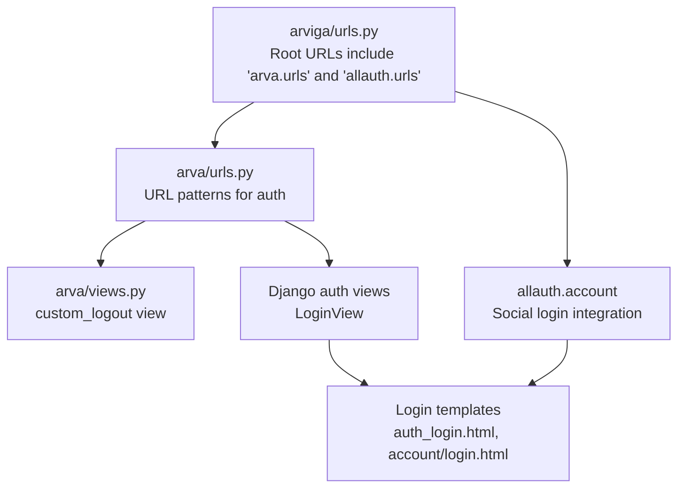
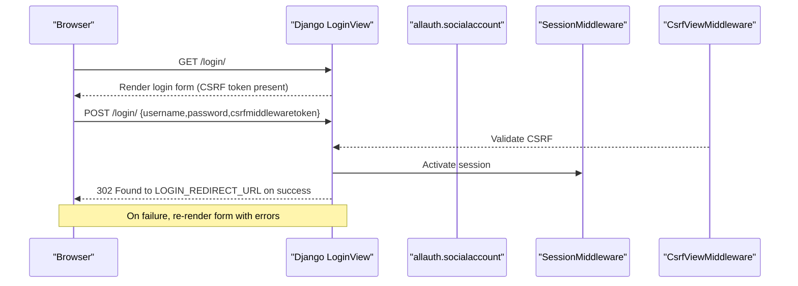
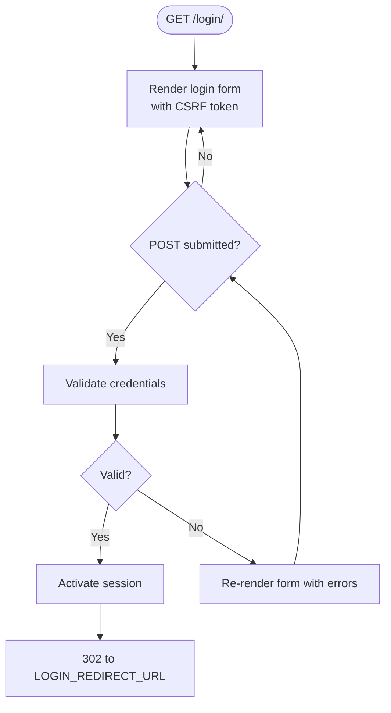
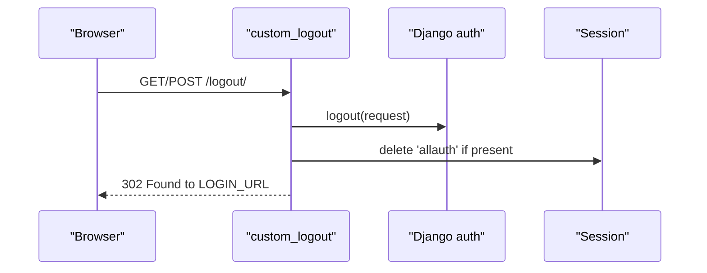
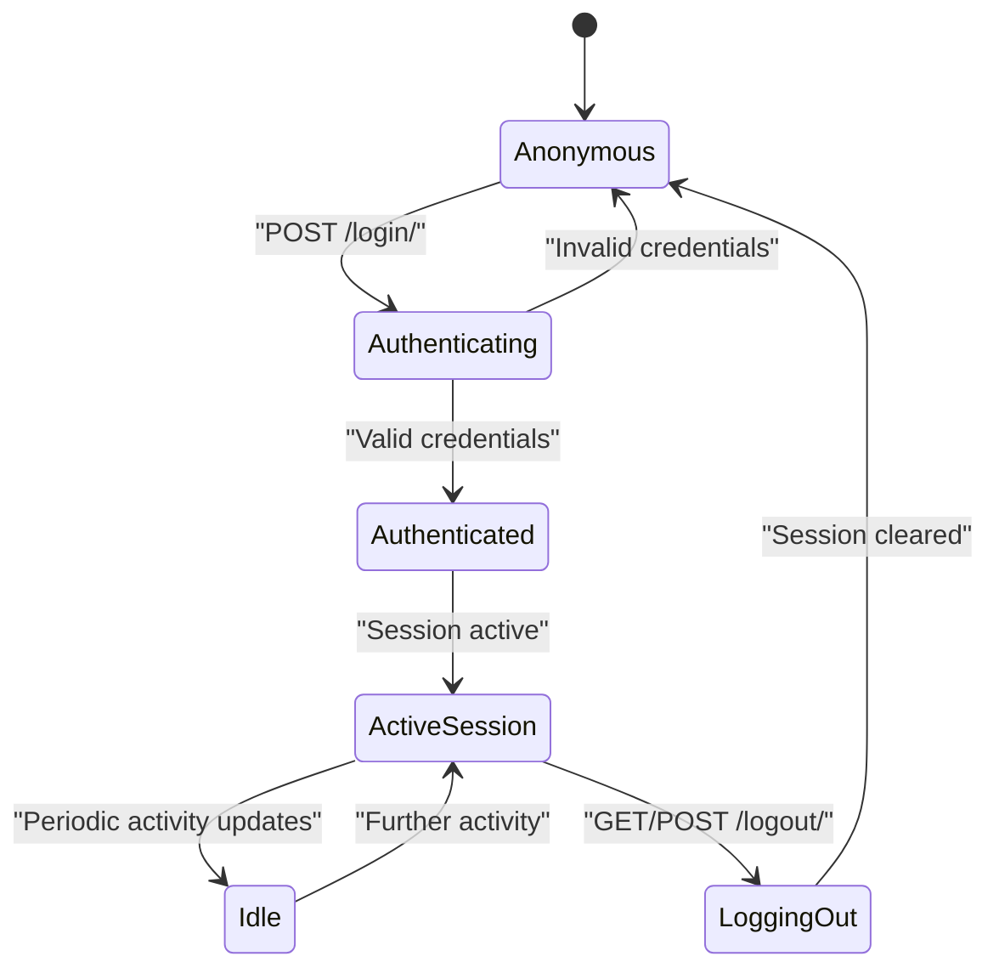
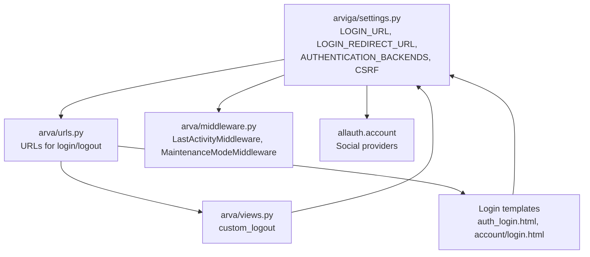

# Authentication Endpoints

<cite>
**Referenced Files in This Document**
- [arviga/urls.py](file://arviga/urls.py)
- [arva/urls.py](file://arva/urls.py)
- [arva/views.py](file://arva/views.py)
- [arva/templates/arva/auth_login.html](file://arva/templates/arva/auth_login.html)
- [arva/templates/account/login.html](file://arva/templates/account/login.html)
- [arviga/settings.py](file://arviga/settings.py)
- [arva/middleware.py](file://arva/middleware.py)
- [arva/models.py](file://arva/models.py)
</cite>

## Table of Contents
1. [Introduction](#introduction)
2. [Project Structure](#project-structure)
3. [Core Components](#core-components)
4. [Architecture Overview](#architecture-overview)
5. [Detailed Component Analysis](#detailed-component-analysis)
6. [Dependency Analysis](#dependency-analysis)
7. [Performance Considerations](#performance-considerations)
8. [Troubleshooting Guide](#troubleshooting-guide)
9. [Conclusion](#conclusion)

## Introduction
This document describes the authentication endpoints and flow in Arva Kanban. It focuses on the login and logout endpoints, URL patterns, request/response characteristics, session-based authentication, CSRF protection, and integration with Django’s built-in authentication views and allauth. It also provides client-side guidance for handling authentication state and redirects.

## Project Structure
Authentication endpoints are defined in the application URL configuration and backed by Django’s authentication views and a custom logout view. Templates render the login UI and handle CSRF tokens and optional redirect parameters.

**Diagram sources**
- [arviga/urls.py](file://arviga/urls.py#L6-L10)
- [arva/urls.py](file://arva/urls.py#L5-L10)
- [arva/views.py](file://arva/views.py#L70-L82)
- [arva/templates/arva/auth_login.html](file://arva/templates/arva/auth_login.html#L39-L43)
- [arva/templates/account/login.html](file://arva/templates/account/login.html#L14-L21)

**Section sources**
- [arviga/urls.py](file://arviga/urls.py#L6-L10)
- [arva/urls.py](file://arva/urls.py#L5-L10)

## Core Components
- Login endpoint
  - URL pattern: /login/
  - View: Django’s LoginView with a custom template
  - Method: GET (render form), POST (submit credentials)
  - CSRF: Required via 
  - Redirects: LOGIN_REDIRECT_URL after success; LOGIN_URL on failure
- Logout endpoint
  - URL pattern: /logout/
  - View: arva.views.custom_logout
  - Method: GET/POST supported
  - Behavior: Django logout + cleanup of allauth session data + redirect to LOGIN_URL

Key settings influencing authentication:
- LOGIN_URL, LOGIN_REDIRECT_URL, LOGOUT_REDIRECT_URL
- AUTHENTICATION_BACKENDS enabling ModelBackend and allauth
- CSRF middleware enabled

**Section sources**
- [arva/urls.py](file://arva/urls.py#L7-L8)
- [arva/views.py](file://arva/views.py#L70-L82)
- [arviga/settings.py](file://arviga/settings.py#L112-L114)
- [arviga/settings.py](file://arviga/settings.py#L79-L82)
- [arviga/settings.py](file://arviga/settings.py#L28)

## Architecture Overview
The authentication flow integrates Django’s built-in authentication with allauth for social login. The login page renders both email/password and Google OAuth options, posts credentials to Django’s LoginView, and upon success, redirects to the configured LOGIN_REDIRECT_URL. The logout view performs Django logout and clears allauth-specific session data before redirecting.

**Diagram sources**
- [arva/urls.py](file://arva/urls.py#L7)
- [arviga/settings.py](file://arviga/settings.py#L28)
- [arviga/settings.py](file://arviga/settings.py#L112-L114)
- [arva/templates/arva/auth_login.html](file://arva/templates/arva/auth_login.html#L39-L43)

## Detailed Component Analysis

### Login Endpoint
- URL: /login/
- View: Django.contrib.auth.views.LoginView
- Template: arva/templates/arva/auth_login.html
- Request methods:
  - GET: Renders the login form with CSRF token and optional redirect field
  - POST: Submits credentials to authenticate
- Response behavior:
  - On success: Redirect to LOGIN_REDIRECT_URL
  - On failure: Re-render form with non-field errors
- CSRF protection:
  - Form includes 
  - CSRF middleware enabled globally
- Optional redirect:
  - Hidden redirect field is supported in templates
- Social login:
  - Google OAuth link included in the template; handled by allauth

**Diagram sources**
- [arva/urls.py](file://arva/urls.py#L7)
- [arva/templates/arva/auth_login.html](file://arva/templates/arva/auth_login.html#L39-L43)
- [arviga/settings.py](file://arviga/settings.py#L112-L114)

**Section sources**
- [arva/urls.py](file://arva/urls.py#L7)
- [arva/templates/arva/auth_login.html](file://arva/templates/arva/auth_login.html#L39-L43)
- [arva/templates/account/login.html](file://arva/templates/account/login.html#L14-L21)
- [arviga/settings.py](file://arviga/settings.py#L112-L114)

### Logout Endpoint
- URL: /logout/
- View: arva.views.custom_logout
- Methods: GET/POST
- Behavior:
  - Calls Django logout(request)
  - Clears any allauth-specific session data
  - Redirects to LOGIN_URL
- Notes:
  - Works for both GET and POST requests
  - Ensures clean state for allauth sessions

**Diagram sources**
- [arva/urls.py](file://arva/urls.py#L8)
- [arva/views.py](file://arva/views.py#L70-L82)
- [arviga/settings.py](file://arviga/settings.py#L114)

**Section sources**
- [arva/urls.py](file://arva/urls.py#L8)
- [arva/views.py](file://arva/views.py#L70-L82)
- [arviga/settings.py](file://arviga/settings.py#L114)

### CSRF Protection Mechanisms
- CSRF middleware is enabled in MIDDLEWARE
- Login templates include  in forms
- Social login templates also include CSRF tokens
- Django’s CsrfViewMiddleware validates incoming POST requests

**Section sources**
- [arviga/settings.py](file://arviga/settings.py#L28)
- [arva/templates/arva/auth_login.html](file://arva/templates/arva/auth_login.html#L40)
- [arva/templates/account/login.html](file://arva/templates/account/login.html#L15)
- [templates/socialaccount/login.html](file://templates/socialaccount/login.html#L204)

### Session-Based Authentication Flow
- Session activation occurs during successful login
- SessionMiddleware manages session lifecycle
- AuthenticationMiddleware binds user to request
- LastActivityMiddleware periodically updates user activity timestamps for authenticated users

**Diagram sources**
- [arviga/settings.py](file://arviga/settings.py#L26-L34)
- [arva/middleware.py](file://arva/middleware.py#L7-L22)

**Section sources**
- [arviga/settings.py](file://arviga/settings.py#L26-L34)
- [arva/middleware.py](file://arva/middleware.py#L7-L22)

### Security Considerations
- CSRF protection via middleware and tokens
- Password validators configured
- Social login via allauth with Google provider
- Redirect field handling in login templates supports safe redirection
- Maintenance mode middleware does not affect authenticated users’ ability to log out

**Section sources**
- [arviga/settings.py](file://arviga/settings.py#L70-L76)
- [arviga/settings.py](file://arviga/settings.py#L84-L96)
- [arva/templates/arva/auth_login.html](file://arva/templates/arva/auth_login.html#L41-L42)
- [arva/middleware.py](file://arva/middleware.py#L24-L38)

### Integration with Django and allauth
- Django LoginView handles email/password authentication
- AUTHENTICATION_BACKENDS includes ModelBackend and allauth backend
- allauth providers configured for Google
- Social login templates integrate with allauth’s provider URLs

**Section sources**
- [arva/urls.py](file://arva/urls.py#L7)
- [arviga/settings.py](file://arviga/settings.py#L79-L82)
- [arviga/settings.py](file://arviga/settings.py#L84-L96)
- [arva/templates/account/login.html](file://arva/templates/account/login.html#L8-L10)

### Client Implementation Guidelines
- Use the login form rendered by the server to ensure CSRF tokens and redirect fields are included
- For programmatic login, submit a POST request to /login/ with username, password, and CSRF token
- After successful login, the server responds with a redirect to LOGIN_REDIRECT_URL
- For logout, perform a GET or POST request to /logout/ and follow the redirect to LOGIN_URL
- Handle CSRF tokens on any custom login forms
- Respect the redirect field behavior to preserve intended destination after login

**Section sources**
- [arva/templates/arva/auth_login.html](file://arva/templates/arva/auth_login.html#L39-L43)
- [arva/templates/account/login.html](file://arva/templates/account/login.html#L14-L21)
- [arviga/settings.py](file://arviga/settings.py#L112-L114)

## Dependency Analysis
Authentication depends on Django’s auth views, session middleware, CSRF middleware, and allauth for social login. The logout view depends on Django’s logout and optionally cleans allauth session data.

**Diagram sources**
- [arviga/settings.py](file://arviga/settings.py#L24-L35)
- [arviga/settings.py](file://arviga/settings.py#L79-L82)
- [arviga/settings.py](file://arviga/settings.py#L112-L114)
- [arva/urls.py](file://arva/urls.py#L5-L10)
- [arva/views.py](file://arva/views.py#L70-L82)
- [arva/templates/arva/auth_login.html](file://arva/templates/arva/auth_login.html#L39-L43)
- [arva/middleware.py](file://arva/middleware.py#L7-L22)

**Section sources**
- [arviga/settings.py](file://arviga/settings.py#L24-L35)
- [arviga/settings.py](file://arviga/settings.py#L79-L82)
- [arviga/settings.py](file://arviga/settings.py#L112-L114)
- [arva/urls.py](file://arva/urls.py#L5-L10)
- [arva/views.py](file://arva/views.py#L70-L82)
- [arva/templates/arva/auth_login.html](file://arva/templates/arva/auth_login.html#L39-L43)
- [arva/middleware.py](file://arva/middleware.py#L7-L22)

## Performance Considerations
- Session activity updates occur at most once per minute for authenticated users, minimizing database writes
- Maintenance mode middleware caches website settings to reduce repeated queries

**Section sources**
- [arva/middleware.py](file://arva/middleware.py#L12-L20)
- [arva/middleware.py](file://arva/middleware.py#L28-L36)

## Troubleshooting Guide
- Invalid credentials
  - Symptom: Form re-renders with non-field errors
  - Cause: Incorrect username/password or account disabled
  - Resolution: Verify credentials and ensure account is active
- CSRF token errors
  - Symptom: 403 CSRF failure
  - Cause: Missing or invalid CSRF token
  - Resolution: Ensure forms include  and are posted from the rendered page
- Redirect loops
  - Symptom: Unexpected redirect after login
  - Cause: redirect field value mismatch or misconfiguration
  - Resolution: Confirm redirect field handling and LOGIN_REDIRECT_URL
- Social login issues
  - Symptom: Failure to authenticate via Google
  - Cause: Provider misconfiguration or network issues
  - Resolution: Verify SOCIALACCOUNT_PROVIDERS settings and provider credentials

**Section sources**
- [arva/templates/arva/auth_login.html](file://arva/templates/arva/auth_login.html#L35-L37)
- [arviga/settings.py](file://arviga/settings.py#L84-L96)
- [arva/templates/arva/auth_login.html](file://arva/templates/arva/auth_login.html#L41-L42)

## Conclusion
Arva Kanban uses Django’s built-in authentication views for email/password login and integrates allauth for Google social login. The login endpoint is protected by CSRF, and the logout endpoint clears both Django and allauth session data. Settings control redirect behavior and authentication backends. Clients should rely on server-rendered forms to ensure CSRF and redirect handling are correct.