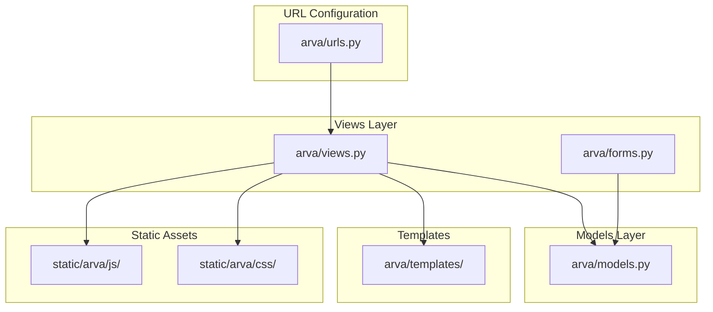
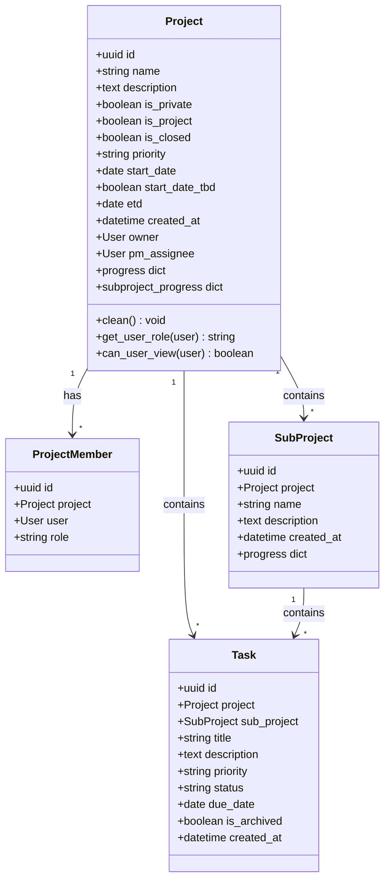
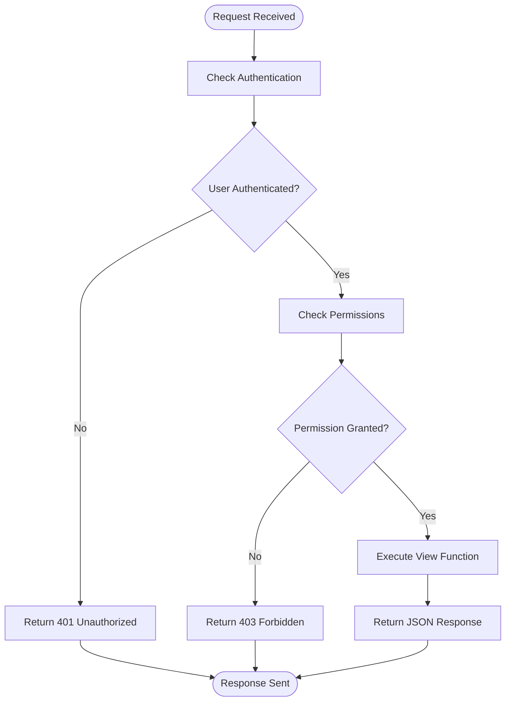
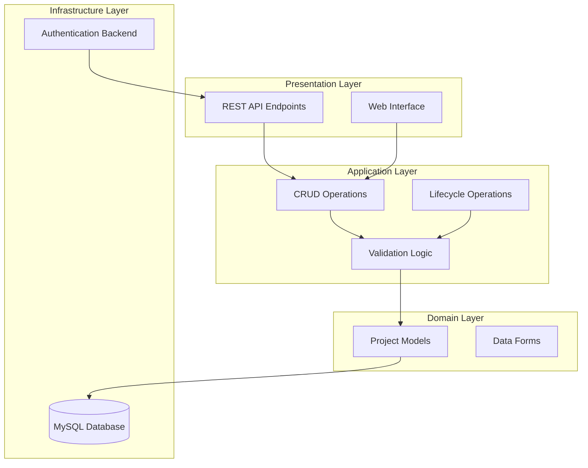
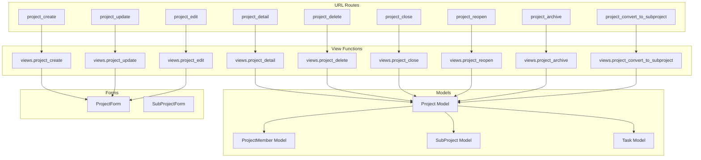

# Core Project Operations

<cite>
**Referenced Files in This Document**
- [arva/views.py](file://arva/views.py)
- [arva/urls.py](file://arva/urls.py)
- [arva/models.py](file://arva/models.py)
- [arva/forms.py](file://arva/forms.py)
- [settings-hosting.py](file://settings-hosting.py)
</cite>

## Table of Contents
1. [Introduction](#introduction)
2. [Project Structure](#project-structure)
3. [Core Components](#core-components)
4. [Architecture Overview](#architecture-overview)
5. [Detailed Component Analysis](#detailed-component-analysis)
6. [Dependency Analysis](#dependency-analysis)
7. [Performance Considerations](#performance-considerations)
8. [Troubleshooting Guide](#troubleshooting-guide)
9. [Conclusion](#conclusion)

## Introduction

This document provides comprehensive API documentation for the core project operations in the Kanban project management system. The documentation covers CRUD operations for projects, lifecycle operations, request/response schemas, authentication requirements, permission validation, and error handling for all project-related endpoints.

The system follows Django's REST-like patterns with JSON responses and uses Django's built-in authentication and authorization mechanisms. All endpoints are designed to be consumed by both web clients and potential external APIs.

## Project Structure

The project follows Django's standard MVC architecture with clear separation of concerns:



**Diagram sources**
- [arva/urls.py](file://arva/urls.py#L1-L98)
- [arva/views.py](file://arva/views.py#L1-L50)
- [arva/models.py](file://arva/models.py#L101-L188)

**Section sources**
- [arva/urls.py](file://arva/urls.py#L1-L98)
- [arva/views.py](file://arva/views.py#L1-L50)

## Core Components

### Project Model Architecture

The Project model serves as the central entity for all project operations:



**Diagram sources**
- [arva/models.py](file://arva/models.py#L101-L188)
- [arva/models.py](file://arva/models.py#L189-L209)
- [arva/models.py](file://arva/models.py#L211-L229)

### Authentication and Authorization

The system uses Django's built-in authentication with custom middleware and social authentication:



**Section sources**
- [arva/views.py](file://arva/views.py#L1-L32)
- [settings-hosting.py](file://settings-hosting.py#L81-L84)

## Architecture Overview

The project operations follow a layered architecture pattern:



**Diagram sources**
- [arva/views.py](file://arva/views.py#L477-L526)
- [arva/views.py](file://arva/views.py#L990-L1053)
- [arva/models.py](file://arva/models.py#L101-L188)

## Detailed Component Analysis

### Project CRUD Operations

#### Project Creation (`/project/create/`)

**Endpoint**: `POST /project/create/`

**Authentication**: Required (login_required decorator)

**Permissions**: Must be authenticated user

**Request Schema**:
```json
{
  "name": "string",
  "description": "string",
  "is_private": "boolean",
  "is_project": "boolean",
  "priority": "string",
  "pm_assignee": "integer",
  "start_date": "date",
  "start_date_tbd": "boolean",
  "etd": "date"
}
```

**Response Schema**:
```json
{
  "success": "boolean",
  "html": "string",
  "project_id": "integer",
  "project_name": "string"
}
```

**Success Response**: `200 OK` with success payload

**Error Responses**:
- `400 Bad Request`: Form validation errors
- `403 Forbidden`: Authentication required

**Business Logic Constraints**:
- For structured projects (`is_project = true`): requires start_date or start_date_tbd, requires etd
- Start date and ETD validation: ETD cannot be earlier than start date
- Private projects: only owner and explicitly shared users have access

**Section sources**
- [arva/views.py](file://arva/views.py#L477-L500)
- [arva/forms.py](file://arva/forms.py#L135-L195)
- [arva/models.py](file://arva/models.py#L131-L144)

#### Project Detail Viewing (`/project/<int:pk>/`)

**Endpoint**: `GET /project/<int:pk>/`

**Authentication**: Required

**Permissions**: Must have access to project (owner, member, or public access)

**Request Parameters**:
- `pk`: Project ID (required)
- `scope`: Filter scope (optional)
- `sub`: Subproject filter (optional)
- `q`: Search query (optional)
- `assignee`: Assignee filter (optional)
- `status`: Status filter (optional)
- `priority`: Priority filter (optional)
- `label`: Label filter (optional)
- `due`: Due date filter (optional)
- `page`: Page number (optional)
- `per_page`: Items per page (10, 25, 50, 100)

**Response Schema**:
```json
{
  "project": {
    "id": "integer",
    "name": "string",
    "description": "string",
    "is_private": "boolean",
    "is_project": "boolean",
    "is_closed": "boolean",
    "priority": "string",
    "pm_assignee": "integer",
    "start_date": "date",
    "start_date_tbd": "boolean",
    "etd": "date",
    "created_at": "datetime",
    "progress": {
      "total": "integer",
      "done": "integer",
      "percent": "integer"
    }
  },
  "task_lists": "array",
  "subprojects": "array",
  "user_role": "string",
  "project_is_locked": "boolean"
}
```

**Success Response**: `200 OK` with project data

**Error Responses**:
- `404 Not Found`: Project not accessible
- `403 Forbidden`: Insufficient permissions

**Section sources**
- [arva/views.py](file://arva/views.py#L713-L884)

#### Project Updates (`/project/<int:pk>/update/`)

**Endpoint**: `POST /project/<int:pk>/update/`

**Authentication**: Required

**Permissions**: Project owner/admin only

**Request Schema**:
```json
{
  "name": "string",
  "description": "string",
  "is_private": "boolean",
  "is_project": "boolean",
  "priority": "string",
  "pm_assignee": "integer",
  "start_date": "date",
  "start_date_tbd": "boolean",
  "etd": "date"
}
```

**Response Schema**:
```json
{
  "success": "boolean"
}
```

**Success Response**: `200 OK` with success indicator

**Error Responses**:
- `400 Bad Request`: Validation errors or locked project
- `403 Forbidden`: Not project owner/admin

**Business Logic Constraints**:
- Only project owners can update
- Locked projects (closed) cannot be updated
- Structured projects require ETD validation

**Section sources**
- [arva/views.py](file://arva/views.py#L990-L1009)
- [arva/views.py](file://arva/views.py#L1014-L1031)

#### Project Deletion (`/project/<int:pk>/delete/`)

**Endpoint**: `POST /project/<int:pk>/delete/`

**Authentication**: Required

**Permissions**: Project owner/admin only

**Request Schema**: No body required

**Response Schema**:
```json
{
  "success": "boolean"
}
```

**Success Response**: `200 OK` with success indicator

**Error Responses**:
- `400 Bad Request`: Project has tasks or not project owner/admin
- `403 Forbidden`: Insufficient permissions

**Business Logic Constraints**:
- Cannot delete project if it contains tasks
- Only project owners can delete
- Creates activity log entry

**Section sources**
- [arva/views.py](file://arva/views.py#L1102-L1125)

### Project Lifecycle Operations

#### Project Closing (`/project/<int:pk>/close/`)

**Endpoint**: `POST /project/<int:pk>/close/`

**Authentication**: Required

**Permissions**: Project owner/admin only

**Request Schema**: No body required

**Response Schema**:
```json
{
  "success": "boolean",
  "is_closed": "boolean"
}
```

**Success Response**: `200 OK` with closed status

**Error Responses**:
- `400 Bad Request`: Not a structured project or already closed
- `403 Forbidden`: Not project owner/admin

**Business Logic Constraints**:
- Only structured projects (is_project = true) can be closed
- Creates activity log entry
- Prevents further modifications

**Section sources**
- [arva/views.py](file://arva/views.py#L1014-L1031)

#### Project Reopening (`/project/<int:pk>/reopen/`)

**Endpoint**: `POST /project/<int:pk>/reopen/`

**Authentication**: Required

**Permissions**: Project owner/admin only

**Request Schema**: No body required

**Response Schema**:
```json
{
  "success": "boolean",
  "is_closed": "boolean"
}
```

**Success Response**: `200 OK` with open status

**Error Responses**:
- `400 Bad Request`: Not a structured project or already open
- `403 Forbidden`: Not project owner/admin

**Business Logic Constraints**:
- Only structured projects can be reopened
- Creates activity log entry
- Allows modifications again

**Section sources**
- [arva/views.py](file://arva/views.py#L1035-L1053)

#### Project Archiving (`/project/<int:pk>/archive/`)

**Endpoint**: `GET /project/<int:pk>/archive/`

**Authentication**: Required

**Permissions**: Project owner/admin only

**Request Schema**: No body required

**Response Schema**:
```json
{
  "project": "object",
  "archived_lists": "array",
  "archived_tasks": "array",
  "user_role": "string"
}
```

**Success Response**: `200 OK` with archived content

**Error Responses**:
- `403 Forbidden`: Not project owner/admin

**Business Logic Constraints**:
- Only accessible to project owners/admins
- Shows archived lists and tasks separately

**Section sources**
- [arva/views.py](file://arva/views.py#L887-L902)

### Additional Project Operations

#### Project Edit Endpoint

**Endpoint**: `GET /project/<int:pk>/edit/`

**Authentication**: Required

**Permissions**: Project owner only

**Response Schema**:
```json
{
  "success": "boolean",
  "name": "string",
  "description": "string",
  "is_private": "boolean",
  "is_project": "boolean",
  "priority": "string",
  "pm_assignee_id": "integer",
  "start_date": "date",
  "start_date_tbd": "boolean",
  "etd": "date"
}
```

**Section sources**
- [arva/views.py](file://arva/views.py#L504-L526)

#### Project Convert to Subproject (`/project/<int:pk>/convert-subproject/`)

**Endpoint**: `POST /project/<int:pk>/convert-subproject/`

**Authentication**: Required

**Permissions**: Project owner/admin only

**Request Schema**:
```json
{
  "target_project_id": "integer"
}
```

**Response Schema**:
```json
{
  "success": "boolean",
  "subproject_id": "integer",
  "target_project_id": "integer"
}
```

**Section sources**
- [arva/views.py](file://arva/views.py#L1057-L1100)

## Dependency Analysis

The project operations have the following dependency relationships:



**Diagram sources**
- [arva/urls.py](file://arva/urls.py#L15-L23)
- [arva/views.py](file://arva/views.py#L477-L1100)
- [arva/models.py](file://arva/models.py#L101-L209)

**Section sources**
- [arva/urls.py](file://arva/urls.py#L1-L98)
- [arva/views.py](file://arva/views.py#L477-L1100)

## Performance Considerations

### Query Optimization

The system implements several performance optimizations:

1. **Prefetch Related Objects**: Uses `Prefetch()` to reduce database queries
2. **Select Related**: Minimizes N+1 query problems
3. **Pagination**: Implements pagination for large datasets
4. **Conditional Queries**: Only loads necessary data based on filters

### Caching Strategies

- **Progress Calculations**: Cached calculations for project progress
- **Membership Queries**: Efficient membership checking
- **Activity Logs**: Optimized activity log queries

### Scalability Considerations

- **Database Indexes**: Proper indexing on frequently queried fields
- **Query Limiting**: Limits on search results and pagination
- **Template Rendering**: Efficient template rendering with minimal database hits

## Troubleshooting Guide

### Common Authentication Issues

**Issue**: `401 Unauthorized` when accessing project endpoints
**Solution**: Ensure user is logged in and CSRF token is included in requests

**Issue**: `403 Forbidden` when trying to modify projects
**Solution**: Verify user has appropriate permissions (owner/admin) and project is not closed

### Validation Errors

**Issue**: `400 Bad Request` with validation errors
**Common Causes**:
- Missing required fields for structured projects
- Invalid date combinations (ETD before start date)
- Conflicting date selections (both start date and TBD selected)

**Solution**: Review form validation messages and correct input data

### Permission Denied Issues

**Issue**: Access denied to project operations
**Solution**: Check project membership status and ensure user has appropriate role

**Section sources**
- [arva/views.py](file://arva/views.py#L111-L115)
- [arva/views.py](file://arva/views.py#L993-L997)

### Error Response Patterns

All endpoints follow consistent error response patterns:

```json
{
  "success": false,
  "error": "Error message"
}
```

Or for form validation errors:

```json
{
  "success": false,
  "errors": {
    "field": ["error messages"]
  }
}
```

**Section sources**
- [arva/views.py](file://arva/views.py#L500)
- [arva/views.py](file://arva/views.py#L526)

## Conclusion

The core project operations API provides a comprehensive set of endpoints for managing projects with robust validation, authentication, and authorization mechanisms. The system follows Django best practices and provides clear, consistent responses for all operations.

Key strengths of the implementation include:
- Comprehensive validation rules for project data integrity
- Clear permission boundaries between different user roles
- Consistent error handling and response patterns
- Support for both structured and non-structured projects
- Lifecycle management for project states (open, closed, archived)

The API is designed to be extensible and can accommodate future enhancements while maintaining backward compatibility and clear error reporting.