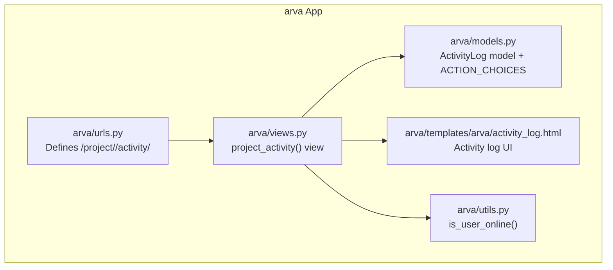
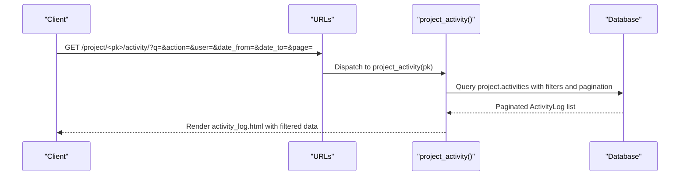
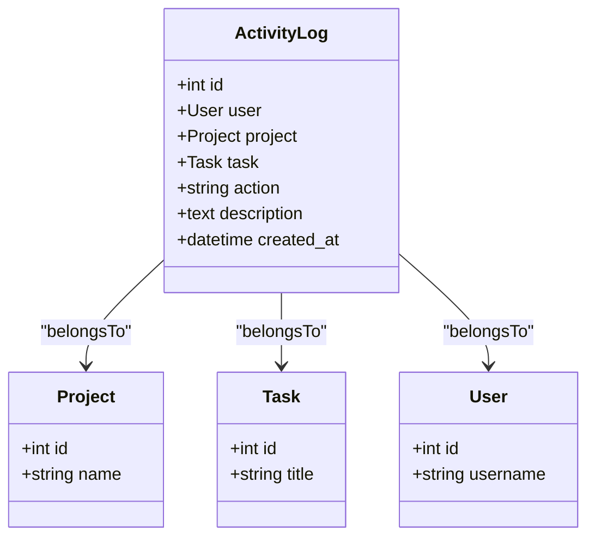
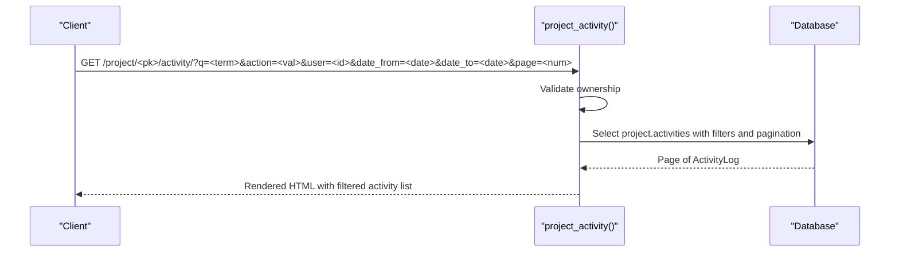
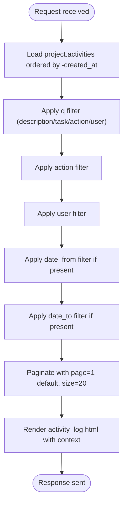
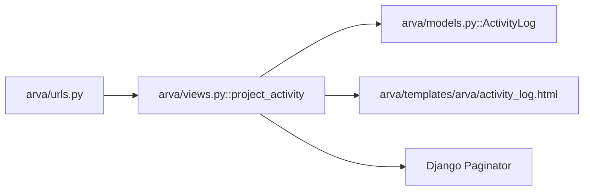

# Project Activity and Audit

<cite>
**Referenced Files in This Document**
- [README.txt](file://README.txt)
- [SETUP_GUIDE.md](file://SETUP_GUIDE.md)
- [arva/models.py](file://arva/models.py)
- [arva/views.py](file://arva/views.py)
- [arva/urls.py](file://arva/urls.py)
- [arva/templates/arva/activity_log.html](file://arva/templates/arva/activity_log.html)
- [arva/utils.py](file://arva/utils.py)
</cite>

## Table of Contents
1. [Introduction](#introduction)
2. [Project Structure](#project-structure)
3. [Core Components](#core-components)
4. [Architecture Overview](#architecture-overview)
5. [Detailed Component Analysis](#detailed-component-analysis)
6. [Dependency Analysis](#dependency-analysis)
7. [Performance Considerations](#performance-considerations)
8. [Troubleshooting Guide](#troubleshooting-guide)
9. [Conclusion](#conclusion)

## Introduction
This document describes the project activity tracking and audit capabilities implemented in the application. It focuses on:
- Retrieving activity logs for a project via the endpoint /project/<int:pk>/activity/
- Filtering, pagination, and sorting of activity entries
- Activity data structures and event types
- Audit trail generation and storage
- Performance considerations and caching strategies for large activity datasets

The application records user actions against projects and tasks as ActivityLog entries, enabling administrators to review who did what, when, and optionally drill down by task or user.

## Project Structure
The activity and audit features are implemented within the arva app:
- URL routing defines the activity endpoint
- View logic handles filtering, pagination, and rendering
- Template renders the activity log UI with filters
- Models define the ActivityLog entity and supported action types
- Utilities provide helpers for user presence checks

**Diagram sources**
- [arva/urls.py](file://arva/urls.py#L20-L20)
- [arva/views.py](file://arva/views.py#L904-L971)
- [arva/templates/arva/activity_log.html](file://arva/templates/arva/activity_log.html#L1-L131)
- [arva/models.py](file://arva/models.py#L387-L422)
- [arva/utils.py](file://arva/utils.py#L6-L9)

**Section sources**
- [arva/urls.py](file://arva/urls.py#L20-L20)
- [arva/views.py](file://arva/views.py#L904-L971)
- [arva/templates/arva/activity_log.html](file://arva/templates/arva/activity_log.html#L1-L131)
- [arva/models.py](file://arva/models.py#L387-L422)
- [arva/utils.py](file://arva/utils.py#L6-L9)

## Core Components
- ActivityLog model
  - Stores user, project, task, action, description, and created_at
  - Action choices enumerate supported events (e.g., project/task lifecycle, comments, attachments, checklists)
  - Ordered by most recent first
- project_activity view
  - Enforces owner-only access
  - Applies filters: free-text search, action type, user, date range
  - Paginates results
  - Renders template with filtered dataset and available users/actions for selection
- Template activity_log.html
  - Provides UI for filters: search term, action dropdown, user dropdown, date range
  - Displays activity rows with action, optional task link, description, timestamp, and actor
  - Includes pagination controls

Key request parameters for filtering:
- q: Free-text search across description, task title, action, and user username
- action: Filter by a specific action value from ActivityLog.ACTION_CHOICES
- user: Filter by user ID
- date_from: Filter by created_at >= date (YYYY-MM-DD)
- date_to: Filter by created_at <= date (YYYY-MM-DD)
- page: Page number for pagination (default 1)
- Pagination size is fixed at 20 items per page

Sorting is implicit by created_at descending in the view.

**Section sources**
- [arva/models.py](file://arva/models.py#L387-L422)
- [arva/views.py](file://arva/views.py#L904-L971)
- [arva/templates/arva/activity_log.html](file://arva/templates/arva/activity_log.html#L31-L59)

## Architecture Overview
The activity audit pipeline follows a standard MVC flow:
- URL routes to the view
- View fetches and filters ActivityLog entries for the project
- View prepares context (filters, users, actions) and renders the template
- Template displays the filtered activity list with pagination

**Diagram sources**
- [arva/urls.py](file://arva/urls.py#L20-L20)
- [arva/views.py](file://arva/views.py#L904-L971)
- [arva/templates/arva/activity_log.html](file://arva/templates/arva/activity_log.html#L1-L131)

## Detailed Component Analysis

### ActivityLog Model
The ActivityLog entity captures auditable events with the following characteristics:
- user: Optional foreign key to User (nullable for system actions)
- project: Foreign key to Project (required for project-scoped activities)
- task: Optional foreign key to Task (present when action relates to a task)
- action: Char field constrained to predefined choices
- description: Human-readable description of the event
- created_at: Auto-generated timestamp

Supported action types include:
- Project lifecycle: created, updated, deleted
- List lifecycle: created, renamed, deleted, archived, unarchived, moved
- Task lifecycle: created, updated, deleted, archived, unarchived, moved
- Content additions: comment added, attachment added, checklist added, checklist toggled

**Diagram sources**
- [arva/models.py](file://arva/models.py#L387-L422)

**Section sources**
- [arva/models.py](file://arva/models.py#L387-L422)

### Activity Endpoint: /project/<int:pk>/activity/
Endpoint definition and access control:
- Route: /project/<int:pk>/activity/
- Access: Only the project owner can view activity
- Sorting: Activities are ordered by created_at descending
- Pagination: Fixed page size of 20 items

Filtering parameters:
- q: Text search across description, task title, action, user username
- action: Exact match on action value
- user: Exact match on user ID
- date_from: Filter by created_at >= date (YYYY-MM-DD)
- date_to: Filter by created_at <= date (YYYY-MM-DD)

Response format:
- HTML rendered by activity_log.html
- Context includes:
  - project: Project object
  - activities: Paginated page of ActivityLog
  - user_role: Role derived for the current user
  - actions: Full list of ActivityLog.ACTION_CHOICES for the dropdown
  - users: Users who have been associated with the project (owner or member)
  - filters: Current filter values for UI state
  - querystring: Query string excluding page for pagination links

**Diagram sources**
- [arva/views.py](file://arva/views.py#L904-L971)
- [arva/templates/arva/activity_log.html](file://arva/templates/arva/activity_log.html#L31-L59)

**Section sources**
- [arva/urls.py](file://arva/urls.py#L20-L20)
- [arva/views.py](file://arva/views.py#L904-L971)
- [arva/templates/arva/activity_log.html](file://arva/templates/arva/activity_log.html#L31-L59)

### Activity Data Structures and Audit Trail
Audit trail structure:
- Each ActivityLog record includes:
  - Actor: user (may be null for system actions)
  - Scope: project and optionally task
  - Event: action (one of ACTION_CHOICES)
  - Description: contextual summary of the change
  - Timestamp: created_at

Example event types (non-exhaustive):
- project_created, project_updated, project_deleted
- list_created, list_renamed, list_deleted, list_archived, list_unarchived, list_moved
- task_created, task_updated, task_deleted, task_archived, task_unarchived, task_moved
- comment_added, attachment_added, checklist_added, checklist_toggled

Audit trail generation:
- Many write operations create ActivityLog entries automatically (e.g., project edits, task creation/move/archive/unarchive, subproject operations).
- The activity endpoint aggregates these records for viewing.

**Section sources**
- [arva/models.py](file://arva/models.py#L387-L422)
- [arva/views.py](file://arva/views.py#L904-L971)

### Filtering and Sorting Mechanisms
Filtering logic in the view:
- Free-text search: description, task title, action, user username
- Action filter: exact match on action
- User filter: exact match on user ID
- Date range filters: created_at date boundaries with safe parsing

Sorting:
- Default ordering is by created_at descending

Pagination:
- Fixed page size of 20 items
- Page number taken from query parameter page (default 1)
- Pagination controls generated in the template

**Diagram sources**
- [arva/views.py](file://arva/views.py#L911-L952)
- [arva/templates/arva/activity_log.html](file://arva/templates/arva/activity_log.html#L31-L59)

**Section sources**
- [arva/views.py](file://arva/views.py#L911-L952)
- [arva/templates/arva/activity_log.html](file://arva/templates/arva/activity_log.html#L31-L59)

### Project Statistics and Metrics Endpoints
- The repository does not expose dedicated JSON endpoints for project statistics or metrics.
- Progress metrics (project and subproject) are computed in models and surfaced in templates for UI rendering.
- There is no separate API endpoint for exporting statistics; activity logs are the primary audit interface.

**Section sources**
- [arva/models.py](file://arva/models.py#L170-L187)
- [arva/models.py](file://arva/models.py#L199-L209)
- [arva/templates/arva/project_list.html](file://arva/templates/arva/project_list.html#L138-L166)
- [arva/templates/arva/subproject_list.html](file://arva/templates/arva/subproject_list.html#L160-L206)

## Dependency Analysis
- URL routing depends on the view function
- The view depends on:
  - Project existence and access validation
  - ActivityLog model for queries and choices
  - Paginator for pagination
  - Template rendering for UI
- Template depends on:
  - Filters passed by the view
  - ActivityLog.ACTION_CHOICES for action dropdown
  - Project users for user dropdown

**Diagram sources**
- [arva/urls.py](file://arva/urls.py#L20-L20)
- [arva/views.py](file://arva/views.py#L904-L971)
- [arva/models.py](file://arva/models.py#L387-L422)
- [arva/templates/arva/activity_log.html](file://arva/templates/arva/activity_log.html#L1-L131)

**Section sources**
- [arva/urls.py](file://arva/urls.py#L20-L20)
- [arva/views.py](file://arva/views.py#L904-L971)
- [arva/models.py](file://arva/models.py#L387-L422)
- [arva/templates/arva/activity_log.html](file://arva/templates/arva/activity_log.html#L1-L131)

## Performance Considerations
- Query efficiency
  - The view selects related user and task fields to avoid N+1 queries
  - Filtering is applied at the database level using Q objects and date comparisons
- Pagination
  - Fixed page size reduces memory footprint and improves response times
  - Pagination is handled server-side; no client-side infinite scroll is implemented
- Indexing recommendations
  - created_at is auto-indexed by Django; consider adding composite indexes for frequent filter combinations (e.g., project_id + created_at, project_id + user_id + created_at) if activity volume grows significantly
- Caching strategies
  - Consider caching recent activity windows (e.g., last 7 days) for read-heavy dashboards
  - Cache the ACTION_CHOICES and user lists for the dropdowns to reduce repeated queries
  - For high-volume environments, consider materialized summaries of recent activity counts per project
- Frontend pagination
  - The template supports pagination; ensure client-side navigation respects querystring parameters to avoid re-querying the server unnecessarily

[No sources needed since this section provides general guidance]

## Troubleshooting Guide
Common issues and resolutions:
- Permission denied
  - Only project owners can view activity logs; non-owners receive a forbidden response
- Invalid date formats
  - date_from and date_to are parsed safely; invalid dates are ignored
- Empty results
  - Narrow filters may yield no results; remove or relax filters to inspect activity
- Large datasets
  - Use pagination and date-range filters to limit result sets
- Presence indicators
  - The project list uses a user presence helper; similar logic can inform whether users are currently active

**Section sources**
- [arva/views.py](file://arva/views.py#L904-L971)
- [arva/utils.py](file://arva/utils.py#L6-L9)

## Conclusion
The project’s activity tracking and audit system centers on a dedicated endpoint that exposes filtered, paginated activity logs for project owners. The ActivityLog model captures auditable events with structured action types, while the view applies robust filtering and sorting. Although there are no dedicated statistics endpoints, progress metrics are available in models and templates. For large datasets, pagination and targeted filtering provide practical performance controls, with recommended caching and indexing strategies to further optimize read-heavy workloads.