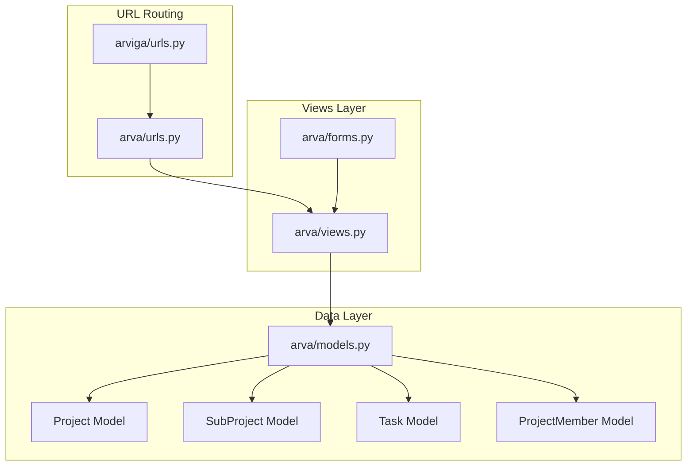
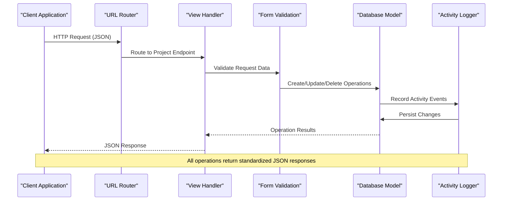
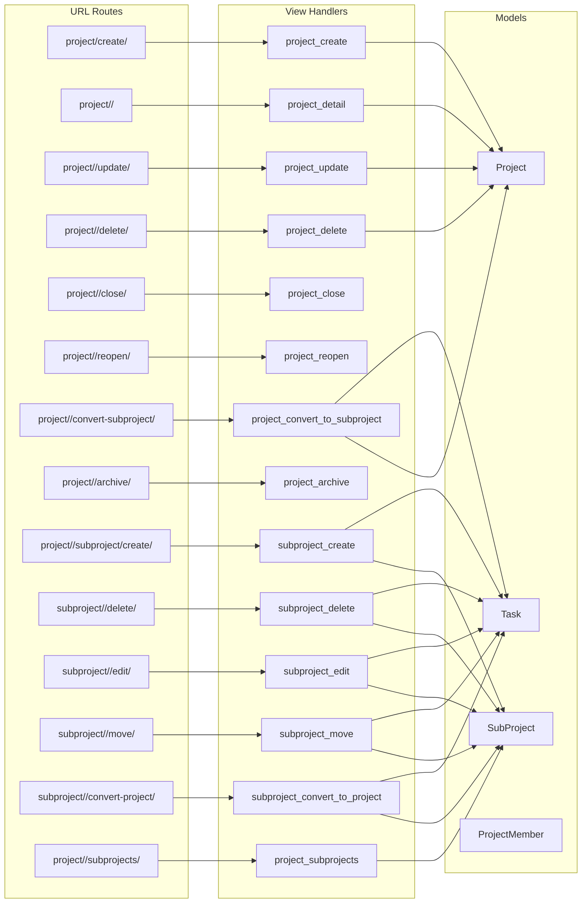

# Project Management Endpoints

<cite>
**Referenced Files in This Document**
- [arva/views.py](file://arva/views.py)
- [arva/urls.py](file://arva/urls.py)
- [arva/models.py](file://arva/models.py)
- [arva/forms.py](file://arva/forms.py)
- [arviga/urls.py](file://arviga/urls.py)
</cite>

## Table of Contents
1. [Introduction](#introduction)
2. [Project Structure](#project-structure)
3. [Core Components](#core-components)
4. [Architecture Overview](#architecture-overview)
5. [Detailed Component Analysis](#detailed-component-analysis)
6. [Dependency Analysis](#dependency-analysis)
7. [Performance Considerations](#performance-considerations)
8. [Troubleshooting Guide](#troubleshooting-guide)
9. [Conclusion](#conclusion)

## Introduction
This document provides comprehensive API documentation for project management endpoints in the Kanban project management system. It covers all project-related operations including creation, viewing, updates, deletion, archiving, closing, reopening, and subproject management. The documentation includes request parameters, response schemas, permission requirements, error handling, and practical usage examples.

## Project Structure
The project follows a Django-based architecture with clear separation between URL routing, view handlers, models, and forms:



**Diagram sources**
- [arva/urls.py](file://arva/urls.py#L1-L98)
- [arviga/urls.py](file://arviga/urls.py#L1-L15)
- [arva/views.py](file://arva/views.py#L1-L50)
- [arva/models.py](file://arva/models.py#L101-L230)

**Section sources**
- [arva/urls.py](file://arva/urls.py#L1-L98)
- [arviga/urls.py](file://arviga/urls.py#L1-L15)

## Core Components
The project management system consists of several key components:

### Project Model
The central Project model handles project metadata, access control, and lifecycle management:
- **Primary fields**: name, description, is_private, is_project, is_closed, priority, pm_assignee
- **Timeline fields**: start_date, start_date_tbd, etd (Estimated Time of Departure)
- **Access control**: owner-based permissions with shared user memberships
- **Lifecycle**: creation, updates, closure, reopening, deletion

### SubProject Model
Supports hierarchical project organization:
- **Relationship**: ForeignKey to Project with cascading operations
- **Progress tracking**: Automatic calculation of completion percentages
- **Task association**: Seamless migration of tasks during conversions

### ProjectMember Model
Manages project access and permissions:
- **Role system**: Admin, Member, Viewer roles (currently unified)
- **Membership tracking**: Many-to-many relationship with Users
- **Permission delegation**: Owner privileges and shared access

**Section sources**
- [arva/models.py](file://arva/models.py#L101-L230)

## Architecture Overview
The system implements a REST-like API through Django views with JSON responses:



**Diagram sources**
- [arva/views.py](file://arva/views.py#L477-L526)
- [arva/forms.py](file://arva/forms.py#L135-L195)
- [arva/models.py](file://arva/models.py#L387-L421)

## Detailed Component Analysis

### Project Creation Endpoint
**Endpoint**: `POST /project/create/`

#### Request Parameters
- **Required fields**: name, description
- **Optional fields**: is_private, is_project, priority, pm_assignee, start_date, start_date_tbd, etd
- **Shared users**: Multiple user assignments for private projects

#### Response Schema
```json
{
  "success": true,
  "project_id": 123,
  "project_name": "Sample Project",
  "html": "<rendered HTML fragment>"
}
```

#### Permission Requirements
- Must be authenticated
- No special role required for creation

#### Error Handling
- Validation errors return `{"success": false, "errors": {...}}`
- Forbidden operations return HTTP 403

**Section sources**
- [arva/views.py](file://arva/views.py#L477-L500)
- [arva/forms.py](file://arva/forms.py#L135-L195)

### Project Detail Viewing Endpoint
**Endpoint**: `GET /project/<int:pk>/`

#### Request Parameters
- **Path parameter**: pk (project ID)
- **Query parameters**: 
  - scope=all|sub (filter by subprojects)
  - sub=subproject_id|all (specific subproject selection)
  - q=search term (task title filter)
  - assignee=user_id (assignee filter)
  - status=status_code (task status filter)
  - priority=priority_code (task priority filter)
  - label=label_id (label filter)
  - due=date (due date filter)
  - page=pageNumber (pagination)
  - per_page=10|25|50|100 (items per page)

#### Response Schema
```json
{
  "project": {
    "id": 123,
    "name": "Project Name",
    "description": "Project description",
    "is_private": false,
    "is_project": true,
    "is_closed": false,
    "priority": "p2",
    "pm_assignee_id": 456,
    "start_date": "2024-01-01",
    "start_date_tbd": false,
    "etd": "2024-12-31"
  },
  "task_lists": [
    {
      "id": 1,
      "name": "To Do",
      "position": 0,
      "tasks": [
        {
          "id": 101,
          "title": "Task Title",
          "status": "in_progress",
          "priority": "p1",
          "due_date": "2024-06-30",
          "assignees": ["john", "jane"]
        }
      ]
    }
  ],
  "subprojects": [
    {"id": 1, "name": "Subproject 1"}
  ]
}
```

#### Permission Requirements
- Must have access to the project (public or shared)
- No special role required for viewing

#### Error Handling
- Project not found returns HTTP 404
- Access denied returns HTTP 403

**Section sources**
- [arva/views.py](file://arva/views.py#L713-L884)

### Project Update Endpoint
**Endpoint**: `POST /project/<int:pk>/update/`

#### Request Parameters
Same as creation endpoint with additional validation rules for existing projects.

#### Response Schema
```json
{
  "success": true,
  "name": "Updated Name",
  "description": "Updated Description",
  "is_private": true,
  "is_project": false,
  "priority": "p2",
  "pm_assignee_id": 456,
  "start_date": "2024-01-01",
  "start_date_tbd": false,
  "etd": "2024-12-31"
}
```

#### Permission Requirements
- Must be project owner/administrator
- Project must not be locked (closed)

#### Error Handling
- Non-admin access returns error with HTTP 400
- Locked project operations return specific error

**Section sources**
- [arva/views.py](file://arva/views.py#L991-L1009)

### Project Deletion Endpoint
**Endpoint**: `POST /project/<int:pk>/delete/`

#### Request Parameters
- **Path parameter**: pk (project ID)

#### Response Schema
```json
{
  "success": true
}
```

#### Permission Requirements
- Must be project owner/administrator
- Project must not contain tasks

#### Error Handling
- Tasks present returns error with HTTP 400
- Non-owner access returns error with HTTP 400

**Section sources**
- [arva/views.py](file://arva/views.py#L1103-L1125)

### Project Archiving Endpoint
**Endpoint**: `GET /project/<int:pk>/archive/`

#### Request Parameters
- **Path parameter**: pk (project ID)

#### Response Schema
Standard project archive template rendering with archived lists and tasks.

#### Permission Requirements
- Must be project owner/administrator

**Section sources**
- [arva/views.py](file://arva/views.py#L887-L902)

### Project Closing Endpoint
**Endpoint**: `POST /project/<int:pk>/close/`

#### Request Parameters
- **Path parameter**: pk (project ID)

#### Response Schema
```json
{
  "success": true,
  "is_closed": true
}
```

#### Permission Requirements
- Must be project owner/administrator
- Only structured projects (is_project=true) can be closed

#### Error Handling
- Non-structured projects return error with HTTP 400
- Already closed projects return success with current state

**Section sources**
- [arva/views.py](file://arva/views.py#L1014-L1031)

### Project Reopening Endpoint
**Endpoint**: `POST /project/<int:pk>/reopen/`

#### Request Parameters
- **Path parameter**: pk (project ID)

#### Response Schema
```json
{
  "success": true,
  "is_closed": false
}
```

#### Permission Requirements
- Must be project owner/administrator
- Only structured projects (is_project=true) can be reopened

#### Error Handling
- Non-structured projects return error with HTTP 400
- Already open projects return success with current state

**Section sources**
- [arva/views.py](file://arva/views.py#L1036-L1053)

### Project to Subproject Conversion Endpoint
**Endpoint**: `POST /project/<int:pk>/convert-subproject/`

#### Request Parameters
- **Path parameter**: pk (project ID)
- **Required POST data**: target_project_id (destination project ID)

#### Response Schema
```json
{
  "success": true,
  "subproject_id": 789,
  "target_project_id": 456
}
```

#### Permission Requirements
- Must be project owner/administrator
- Target project must be different from source project
- Source project must not have subprojects

#### Error Handling
- Source project has subprojects returns error with HTTP 400
- Missing target project returns error with HTTP 400

**Section sources**
- [arva/views.py](file://arva/views.py#L1057-L1100)

### Subproject Management Endpoints

#### Subproject Creation Endpoint
**Endpoint**: `POST /project/<int:pk>/subproject/create/`

#### Subproject Deletion Endpoint
**Endpoint**: `POST /subproject/<int:subproject_id>/delete/`

#### Subproject Update Endpoint
**Endpoint**: `POST /subproject/<int:subproject_id>/edit/`

#### Subproject Movement Endpoint
**Endpoint**: `POST /subproject/<int:subproject_id>/move/`

#### Subproject to Project Conversion Endpoint
**Endpoint**: `POST /subproject/<int:subproject_id>/convert-project/`

#### Subproject List Endpoint
**Endpoint**: `GET /project/<int:pk>/subprojects/`

**Section sources**
- [arva/views.py](file://arva/views.py#L530-L710)

## Dependency Analysis



**Diagram sources**
- [arva/urls.py](file://arva/urls.py#L15-L45)
- [arva/views.py](file://arva/views.py#L477-L1100)
- [arva/models.py](file://arva/models.py#L101-L230)

**Section sources**
- [arva/urls.py](file://arva/urls.py#L1-L98)

## Performance Considerations
The system implements several performance optimizations:

### Query Optimization
- **Prefetch Related**: Strategic use of `prefetch_related()` and `select_related()` to minimize database queries
- **Pagination**: Built-in pagination support for large datasets
- **Filtering**: Efficient filtering with Q-object queries and database-level conditions

### Caching Strategies
- **Progress Calculation**: Pre-computed progress metrics stored as properties
- **Membership Queries**: Optimized membership lookups with distinct queries
- **Task Aggregation**: Database-level aggregation for statistics

### Memory Management
- **Streaming Responses**: Template rendering to string for AJAX responses
- **Selective Loading**: Lazy loading of related objects when not needed
- **Query Limiting**: Maximum result limits for search operations

## Troubleshooting Guide

### Common Authentication Issues
- **401 Unauthorized**: User not logged in
- **403 Forbidden**: Insufficient permissions for operation
- **404 Not Found**: Project or resource does not exist

### Validation Errors
- **Field Validation**: Returns `{"success": false, "errors": {field: [messages]}}`
- **Business Logic**: Returns `{"success": false, "error": "message"}` with HTTP 400

### Data Integrity Issues
- **Locked Projects**: Closed projects prevent modifications
- **Task Dependencies**: Projects with tasks cannot be deleted
- **Subproject Constraints**: Projects with subprojects cannot be converted

### Error Response Patterns
```json
{
  "success": false,
  "error": "Specific error message",
  "errors": {
    "field_name": ["Error message 1", "Error message 2"]
  }
}
```

**Section sources**
- [arva/views.py](file://arva/views.py#L111-L115)
- [arva/views.py](file://arva/views.py#L1103-L1125)

## Conclusion
The project management system provides a comprehensive API for managing projects and subprojects with robust validation, clear permission controls, and efficient data handling. The endpoints follow consistent patterns for request/response handling, error reporting, and access control. The system supports both simple project management and complex hierarchical project structures while maintaining performance through optimized database queries and caching strategies.