# Project Membership Operations

<cite>
**Referenced Files in This Document**
- [README.txt](file://README.txt)
- [SETUP_GUIDE.md](file://SETUP_GUIDE.md)
- [arva/models.py](file://arva/models.py)
- [arva/views.py](file://arva/views.py)
- [arva/urls.py](file://arva/urls.py)
- [arva/forms.py](file://arva/forms.py)
- [arva/templates/arva/project_members.html](file://arva/templates/arva/project_members.html)
- [arva/admin.py](file://arva/admin.py)
</cite>

## Table of Contents
1. [Introduction](#introduction)
2. [Project Structure](#project-structure)
3. [Core Components](#core-components)
4. [Architecture Overview](#architecture-overview)
5. [Detailed Component Analysis](#detailed-component-analysis)
6. [Dependency Analysis](#dependency-analysis)
7. [Performance Considerations](#performance-considerations)
8. [Troubleshooting Guide](#troubleshooting-guide)
9. [Conclusion](#conclusion)

## Introduction
This document describes the project membership management API endpoints for adding, listing, updating, and removing members from projects. It also documents role management and removal operations for project memberships. The system supports role-based permissions with three roles: Admin, Member, and Viewer. Access control validation ensures only authorized users can modify membership data.

## Project Structure
The membership management functionality is implemented in the `arva` app with the following key components:
- URL routing defines endpoint paths for membership operations
- Views implement request handling, validation, and response generation
- Models define the ProjectMember entity and roles
- Forms provide validation for member addition
- Templates render the membership UI and role descriptions

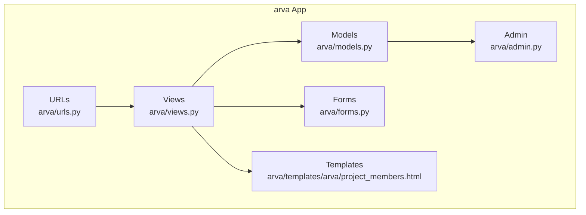

**Diagram sources**
- [arva/urls.py](file://arva/urls.py#L27-L31)
- [arva/views.py](file://arva/views.py#L1128-L1209)
- [arva/models.py](file://arva/models.py#L211-L229)
- [arva/forms.py](file://arva/forms.py#L313-L326)
- [arva/templates/arva/project_members.html](file://arva/templates/arva/project_members.html#L1-L184)
- [arva/admin.py](file://arva/admin.py#L14-L18)

**Section sources**
- [arva/urls.py](file://arva/urls.py#L27-L31)
- [arva/views.py](file://arva/views.py#L1128-L1209)
- [arva/models.py](file://arva/models.py#L211-L229)
- [arva/forms.py](file://arva/forms.py#L313-L326)
- [arva/templates/arva/project_members.html](file://arva/templates/arva/project_members.html#L1-L184)
- [arva/admin.py](file://arva/admin.py#L14-L18)

## Core Components
- ProjectMember model defines membership records with role enumeration
- Membership endpoints:
  - List members for a project
  - Add a member to a project
  - Update a member's role
  - Remove a member from a project
  - Update role via project-member endpoint
  - Remove membership via project-member endpoint

Access control:
- Owner-only operations: member listing, member addition, member update, member removal
- Superuser-only operations: role updates and membership removal via project-member endpoints

Response format:
- JSON responses with success flag and optional error messages
- HTML fragments returned for AJAX requests in some contexts

**Section sources**
- [arva/models.py](file://arva/models.py#L211-L229)
- [arva/views.py](file://arva/views.py#L1128-L1209)
- [arva/views.py](file://arva/views.py#L369-L391)

## Architecture Overview
The membership management flow integrates URL routing, view handlers, and model interactions. The following sequence diagrams illustrate typical workflows.

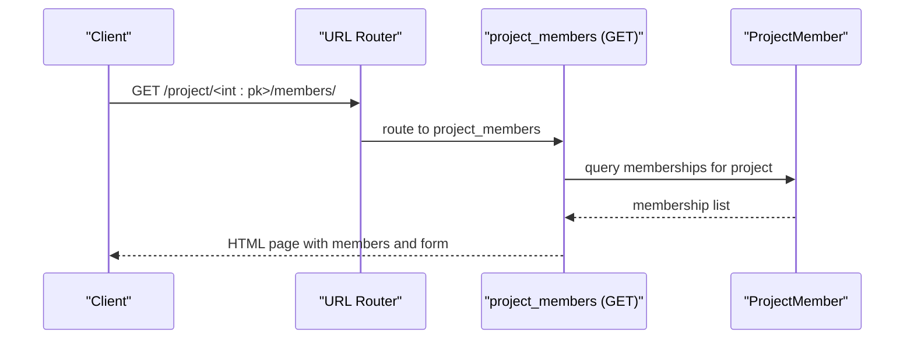

**Diagram sources**
- [arva/urls.py](file://arva/urls.py#L28-L28)
- [arva/views.py](file://arva/views.py#L1128-L1142)

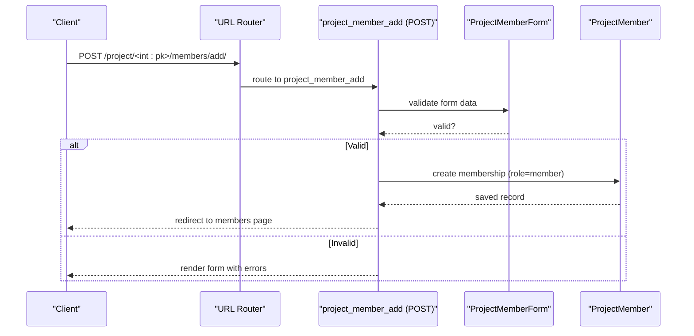

**Diagram sources**
- [arva/urls.py](file://arva/urls.py#L29-L29)
- [arva/views.py](file://arva/views.py#L1146-L1174)
- [arva/forms.py](file://arva/forms.py#L313-L326)

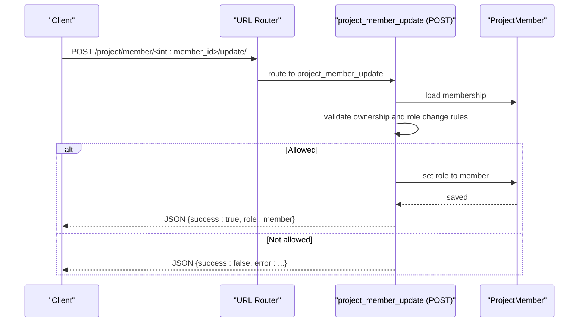

**Diagram sources**
- [arva/urls.py](file://arva/urls.py#L30-L30)
- [arva/views.py](file://arva/views.py#L1178-L1199)

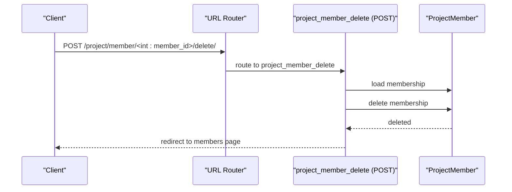

**Diagram sources**
- [arva/urls.py](file://arva/urls.py#L31-L31)
- [arva/views.py](file://arva/views.py#L1203-L1209)

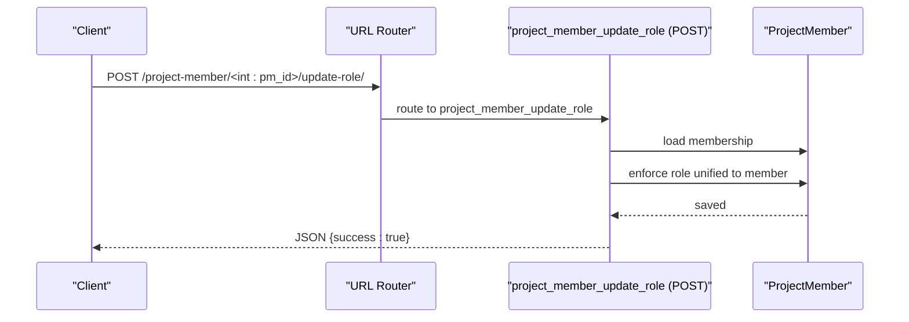

**Diagram sources**
- [arva/urls.py](file://arva/urls.py#L77-L77)
- [arva/views.py](file://arva/views.py#L369-L379)

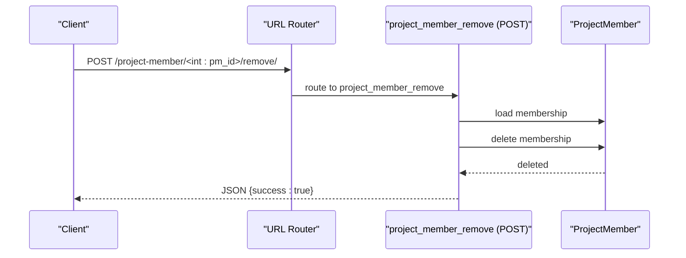

**Diagram sources**
- [arva/urls.py](file://arva/urls.py#L78-L78)
- [arva/views.py](file://arva/views.py#L383-L391)

## Detailed Component Analysis

### Endpoint Definitions and Behavior

#### Member Listing
- Path: `/project/<int:pk>/members/`
- Method: GET
- Purpose: Render the team and roles page for a project
- Access control: Owner-only
- Response: HTML page containing owner info, member list, and add member form

**Section sources**
- [arva/urls.py](file://arva/urls.py#L28-L28)
- [arva/views.py](file://arva/views.py#L1128-L1142)

#### Member Addition
- Path: `/project/<int:pk>/members/add/`
- Method: POST
- Purpose: Add a user as a member to a project
- Access control: Owner-only
- Validation:
  - Cannot add self as member
  - Cannot add user who is already a member
  - Role is set to Member
- Response: Redirect to members page or render form with validation errors

**Section sources**
- [arva/urls.py](file://arva/urls.py#L29-L29)
- [arva/views.py](file://arva/views.py#L1146-L1174)
- [arva/forms.py](file://arva/forms.py#L313-L326)

#### Member Update (Role)
- Path: `/project/member/<int:member_id>/update/`
- Method: POST
- Purpose: Update a member's role
- Access control: Owner-only
- Constraints:
  - Cannot change owner's role
  - Role enforcement: All memberships are unified to Member
- Response: JSON success or error

**Section sources**
- [arva/urls.py](file://arva/urls.py#L30-L30)
- [arva/views.py](file://arva/views.py#L1178-L1199)

#### Member Removal
- Path: `/project/member/<int:member_id>/delete/`
- Method: POST
- Purpose: Remove a member from a project
- Access control: Owner-only
- Response: Redirect to members page

**Section sources**
- [arva/urls.py](file://arva/urls.py#L31-L31)
- [arva/views.py](file://arva/views.py#L1203-L1209)

#### Role Management (Project-Member)
- Path: `/project-member/<int:pm_id>/update-role/`
- Method: POST
- Purpose: Update role via project-member endpoint
- Access control: Superuser-only
- Behavior: Enforces unified membership role to Member
- Response: JSON success

**Section sources**
- [arva/urls.py](file://arva/urls.py#L77-L77)
- [arva/views.py](file://arva/views.py#L369-L379)

#### Member Removal (Project-Member)
- Path: `/project-member/<int:pm_id>/remove/`
- Method: POST
- Purpose: Remove membership via project-member endpoint
- Access control: Superuser-only
- Response: JSON success

**Section sources**
- [arva/urls.py](file://arva/urls.py#L78-L78)
- [arva/views.py](file://arva/views.py#L383-L391)

### Request and Response Schemas

#### Member Addition Request
- Body fields:
  - user: integer (user ID)
  - role: string (ignored; always set to Member)
- Validation errors:
  - Cannot add self
  - Duplicate membership

**Section sources**
- [arva/views.py](file://arva/views.py#L1146-L1174)
- [arva/forms.py](file://arva/forms.py#L313-L326)

#### Member Update Request
- Body fields:
  - role: string (ignored; enforced to Member)
- Validation errors:
  - Cannot change owner's role

**Section sources**
- [arva/views.py](file://arva/views.py#L1178-L1199)

#### Role Management and Removal Requests
- Body fields: none
- Validation:
  - Superuser-only access for project-member endpoints

**Section sources**
- [arva/views.py](file://arva/views.py#L369-L391)

#### Responses
- Success response:
  - JSON: `{ "success": true }`
- Error response:
  - JSON: `{ "success": false, "error": "<message>" }`
  - Validation errors: `{ "success": false, "errors": { ... } }`

**Section sources**
- [arva/views.py](file://arva/views.py#L1146-L1174)
- [arva/views.py](file://arva/views.py#L1178-L1199)
- [arva/views.py](file://arva/views.py#L369-L391)

### Role Definitions and Permissions
- Admin: Full access to project management; owner role is Admin
- Member: Can contribute to tasks; cannot manage members or delete project
- Viewer: Read-only access
- Unified membership: All memberships are maintained as Member for project sharing

Note: The system maintains a legacy admin token for UI compatibility but treats all project-access users uniformly for access control.

**Section sources**
- [arva/models.py](file://arva/models.py#L211-L229)
- [arva/views.py](file://arva/views.py#L91-L104)
- [arva/templates/arva/project_members.html](file://arva/templates/arva/project_members.html#L35-L59)

### Access Control Validation
- Owner-only operations:
  - project_members
  - project_member_add
  - project_member_update
  - project_member_delete
- Superuser-only operations:
  - project_member_update_role
  - project_member_remove

Validation logic checks:
- Project ownership for owner-only endpoints
- Superuser status for project-member endpoints
- Additional constraints (e.g., owner role protection)

**Section sources**
- [arva/views.py](file://arva/views.py#L1128-L1142)
- [arva/views.py](file://arva/views.py#L1146-L1174)
- [arva/views.py](file://arva/views.py#L1178-L1199)
- [arva/views.py](file://arva/views.py#L1203-L1209)
- [arva/views.py](file://arva/views.py#L369-L391)

### Typical Workflows

#### Adding a Member
1. Navigate to project members page
2. Select user from dropdown
3. Submit add form
4. System validates and creates membership

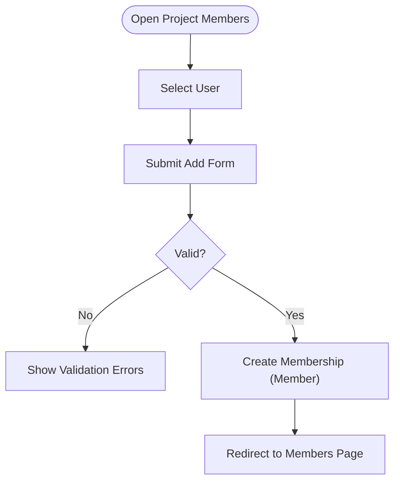

**Diagram sources**
- [arva/views.py](file://arva/views.py#L1146-L1174)
- [arva/forms.py](file://arva/forms.py#L313-L326)

#### Updating a Member's Role
1. Open project members page
2. Click edit button for a member
3. Choose role (enforced to Member)
4. Submit update

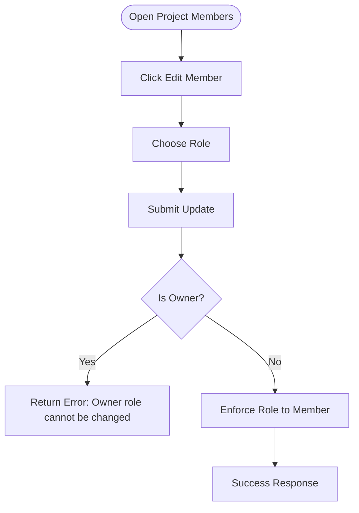

**Diagram sources**
- [arva/views.py](file://arva/views.py#L1178-L1199)

#### Removing a Member
1. Open project members page
2. Click remove button for a member
3. Confirm deletion

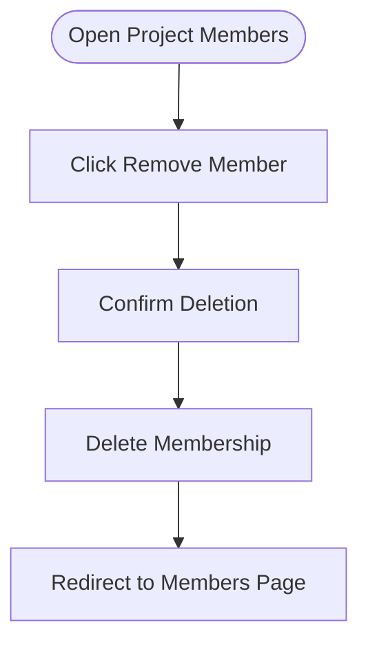

**Diagram sources**
- [arva/views.py](file://arva/views.py#L1203-L1209)

## Dependency Analysis
The membership endpoints depend on:
- URL routing configuration
- View handlers implementing access control
- Model definitions for ProjectMember
- Form validation for member addition
- Template rendering for member listing

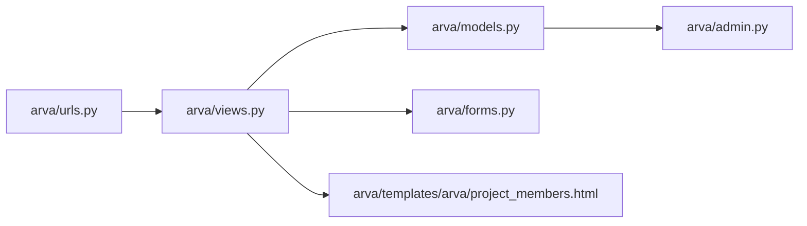

**Diagram sources**
- [arva/urls.py](file://arva/urls.py#L27-L31)
- [arva/views.py](file://arva/views.py#L1128-L1209)
- [arva/models.py](file://arva/models.py#L211-L229)
- [arva/forms.py](file://arva/forms.py#L313-L326)
- [arva/templates/arva/project_members.html](file://arva/templates/arva/project_members.html#L1-L184)
- [arva/admin.py](file://arva/admin.py#L14-L18)

**Section sources**
- [arva/urls.py](file://arva/urls.py#L27-L31)
- [arva/views.py](file://arva/views.py#L1128-L1209)
- [arva/models.py](file://arva/models.py#L211-L229)
- [arva/forms.py](file://arva/forms.py#L313-L326)
- [arva/templates/arva/project_members.html](file://arva/templates/arva/project_members.html#L1-L184)
- [arva/admin.py](file://arva/admin.py#L14-L18)

## Performance Considerations
- Membership queries use select_related to minimize database hits
- Unique constraint on (project, user) prevents duplicate memberships
- Role enforcement is performed in-memory to avoid unnecessary writes
- Template rendering leverages preloaded user profiles

## Troubleshooting Guide
Common issues and resolutions:
- Forbidden errors:
  - Ensure user has appropriate access level (owner or superuser)
  - Verify project membership for owner-only endpoints
- Validation errors:
  - Cannot add self as member
  - Duplicate membership exists
  - Owner role cannot be changed
- Role enforcement:
  - All memberships are unified to Member; role updates are ignored

**Section sources**
- [arva/views.py](file://arva/views.py#L1146-L1174)
- [arva/views.py](file://arva/views.py#L1178-L1199)
- [arva/views.py](file://arva/views.py#L369-L391)

## Conclusion
The project membership management system provides a streamlined interface for managing project collaborators. All memberships are unified to Member for project sharing, while owner-only controls ensure proper governance. The endpoints offer clear request/response schemas, robust validation, and consistent access control enforcement.