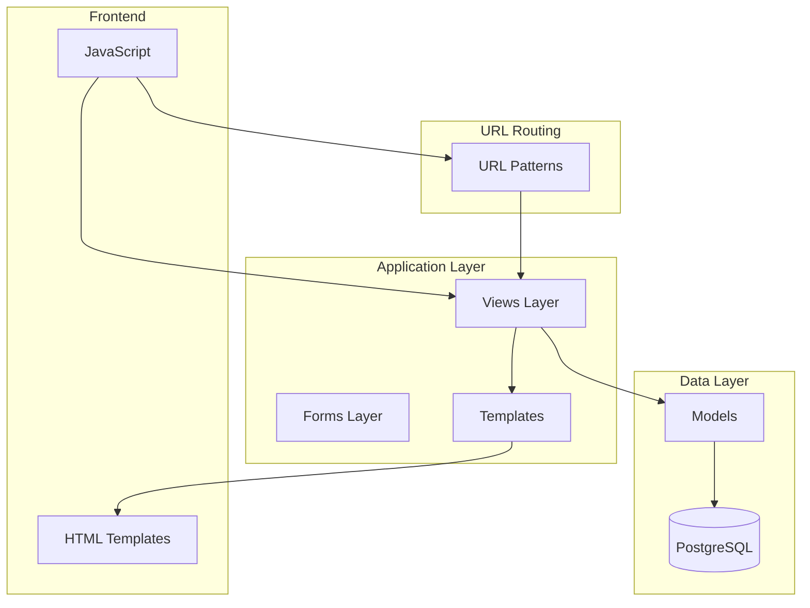
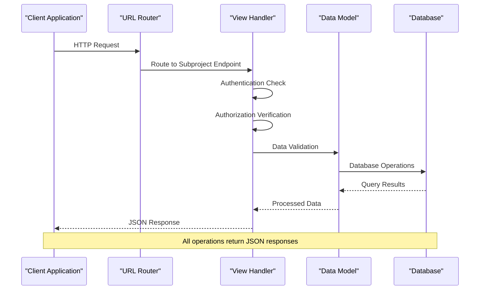
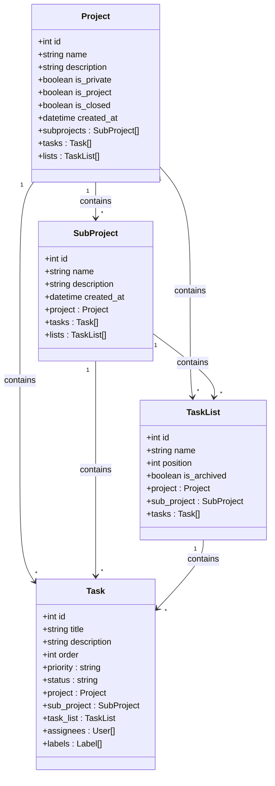
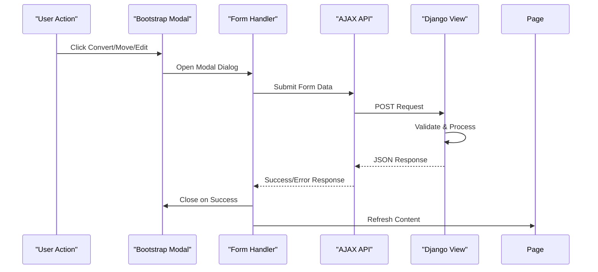

# Subproject Management

<cite>
**Referenced Files in This Document**
- [arva/views.py](file://arva/views.py)
- [arva/urls.py](file://arva/urls.py)
- [arva/models.py](file://arva/models.py)
- [arva/forms.py](file://arva/forms.py)
- [arva/templates/arva/subproject_list.html](file://arva/templates/arva/subproject_list.html)
- [static/arva/js/arva.js](file://static/arva/js/arva.js)
</cite>

## Table of Contents
1. [Introduction](#introduction)
2. [Project Structure](#project-structure)
3. [Core Components](#core-components)
4. [Architecture Overview](#architecture-overview)
5. [Detailed Component Analysis](#detailed-component-analysis)
6. [Dependency Analysis](#dependency-analysis)
7. [Performance Considerations](#performance-considerations)
8. [Troubleshooting Guide](#troubleshooting-guide)
9. [Conclusion](#conclusion)

## Introduction
This document provides comprehensive API documentation for subproject management endpoints in the Kanban project management system. It covers subproject conversion operations, listing endpoints, and CRUD operations for managing subprojects within project hierarchies. The documentation includes request parameters, response schemas, hierarchical relationships, permission requirements, and practical usage scenarios.

## Project Structure
The subproject management functionality is implemented within the Arva application, which provides project and task management capabilities. The system uses Django as the backend framework with a PostgreSQL database for data persistence.



**Diagram sources**
- [arva/views.py](file://arva/views.py#L1-L800)
- [arva/urls.py](file://arva/urls.py#L1-L98)
- [arva/models.py](file://arva/models.py#L101-L210)

**Section sources**
- [arva/views.py](file://arva/views.py#L1-L800)
- [arva/urls.py](file://arva/urls.py#L1-L98)

## Core Components
The subproject management system consists of several key components that work together to provide comprehensive subproject functionality:

### Data Models
The system uses a hierarchical relationship structure defined by the following models:
- **Project**: Top-level container for subprojects and tasks
- **SubProject**: Child entity that belongs to a parent Project
- **Task**: Individual work items that can belong to either a Project or SubProject
- **TaskList**: Collections of tasks organized by status or workflow stage

### Permission System
The permission model is simplified for this application:
- **Admin Role**: Full access to create, edit, delete, and move subprojects
- **Member Role**: Can view subprojects but cannot modify them
- **Viewer Role**: Read-only access to subproject data

### Request Validation
All endpoints implement comprehensive validation including:
- Authentication checks using Django's login_required decorator
- Authorization verification through require_role function
- Project locking validation for closed projects
- Cross-project validation for move operations

**Section sources**
- [arva/models.py](file://arva/models.py#L101-L210)
- [arva/views.py](file://arva/views.py#L84-L105)

## Architecture Overview
The subproject management architecture follows a standard MVC pattern with clear separation of concerns:



**Diagram sources**
- [arva/views.py](file://arva/views.py#L530-L705)
- [arva/urls.py](file://arva/urls.py#L40-L45)

## Detailed Component Analysis

### Subproject Creation Endpoint
The subproject creation endpoint handles the creation of new subprojects within existing projects.

**Endpoint**: `POST /project/<int:pk>/subproject/create/`

**Request Parameters**:
- `name` (string): Required - Subproject name (1-255 characters)
- `description` (string): Optional - Subproject description
- CSRF token for Django protection

**Response Schema**:
```json
{
  "success": true,
  "subproject_id": 123
}
```

**Permission Requirements**:
- Must be authenticated
- Must have admin role on the target project
- Project must not be locked (closed)

**Behavior Details**:
- Creates a new SubProject record linked to the specified project
- Automatically sets up default task lists (To Do, In Progress, Done) for the new subproject
- Initializes task assignment if the project has existing tasks
- Logs activity in the activity log system

**Section sources**
- [arva/views.py](file://arva/views.py#L530-L562)
- [arva/urls.py](file://arva/urls.py#L40-L40)

### Subproject Listing Endpoint
The subproject listing endpoint provides a simple JSON interface for retrieving subproject information.

**Endpoint**: `GET /project/<int:pk>/subprojects/`

**Response Schema**:
```json
{
  "success": true,
  "subprojects": [
    {
      "id": 1,
      "name": "Development Team"
    },
    {
      "id": 2,
      "name": "Marketing Department"
    }
  ]
}
```

**Permission Requirements**:
- Must be authenticated
- Must have at least member role on the target project

**Section sources**
- [arva/views.py](file://arva/views.py#L707-L710)
- [arva/urls.py](file://arva/urls.py#L45-L45)

### Subproject Edit Endpoint
The subproject edit endpoint allows updating existing subproject metadata.

**Endpoint**: `POST /subproject/<int:subproject_id>/edit/`

**Request Parameters**:
- `name` (string): Required - Updated subproject name
- `description` (string): Optional - Updated description

**Response Schema**:
```json
{
  "success": true,
  "name": "Updated Name",
  "description": "Updated Description"
}
```

**Permission Requirements**:
- Must be authenticated
- Must have admin role on the parent project
- Project must not be locked

**Section sources**
- [arva/views.py](file://arva/views.py#L593-L612)
- [arva/urls.py](file://arva/urls.py#L42-L42)

### Subproject Delete Endpoint
The subproject delete endpoint removes subprojects and validates dependencies.

**Endpoint**: `POST /subproject/<int:subproject_id>/delete/`

**Response Schema**:
```json
{
  "success": true,
  "redirect_sub": 456
}
```

**Permission Requirements**:
- Must be authenticated
- Must have admin role on the parent project
- Project must not be locked

**Validation Rules**:
- Cannot delete subprojects that contain tasks
- Returns error if subproject has associated tasks
- Automatically redirects to remaining subproject after deletion

**Section sources**
- [arva/views.py](file://arva/views.py#L566-L589)
- [arva/urls.py](file://arva/urls.py#L41-L41)

### Subproject Move Endpoint
The subproject move endpoint transfers subprojects between projects.

**Endpoint**: `POST /subproject/<int:subproject_id>/move/`

**Request Parameters**:
- `project_id` (integer): Required - Target project ID

**Response Schema**:
```json
{
  "success": true,
  "target_project_id": 789
}
```

**Permission Requirements**:
- Must be authenticated
- Must have admin role on both source and target projects
- Projects must not be locked

**Behavior Details**:
- Moves the subproject from source to target project
- Transfers all associated tasks and task lists
- Updates all task assignments and list configurations
- Creates activity logs for both source and target projects

**Section sources**
- [arva/views.py](file://arva/views.py#L616-L656)
- [arva/urls.py](file://arva/urls.py#L43-L43)

### Subproject to Project Conversion
The subproject-to-project conversion endpoint transforms a subproject into a standalone project.

**Endpoint**: `POST /subproject/<int:subproject_id>/convert-project/`

**Response Schema**:
```json
{
  "success": true,
  "project_id": 101
}
```

**Permission Requirements**:
- Must be authenticated
- Must have admin role on the parent project

**Behavior Details**:
- Creates a new Project with the subproject's name and description
- Copies all project memberships from the source project
- Transfers all tasks and task lists to the new project
- Deletes the original subproject
- Maintains all user permissions and access controls

**Section sources**
- [arva/views.py](file://arva/views.py#L660-L704)
- [arva/urls.py](file://arva/urls.py#L44-L44)

### Project to Subproject Conversion
The project-to-subproject conversion endpoint transforms a project into a subproject.

**Endpoint**: `POST /project/<int:pk>/convert-subproject/`

**Request Parameters**:
- `target_project_id` (integer): Required - Target project ID for conversion

**Response Schema**:
```json
{
  "success": true,
  "subproject_id": 112,
  "target_project_id": 789
}
```

**Permission Requirements**:
- Must be authenticated
- Must have admin role on both source and target projects
- Source project must not have existing subprojects

**Behavior Details**:
- Validates that source project has no subprojects
- Creates a new SubProject under the target project
- Transfers all tasks and task lists to the new subproject
- Deletes the original project
- Maintains all task assignments and project memberships

**Section sources**
- [arva/views.py](file://arva/views.py#L1057-L1100)
- [arva/urls.py](file://arva/urls.py#L19-L19)

## Dependency Analysis

### Data Model Relationships
The subproject system relies on a clear hierarchical relationship structure:



**Diagram sources**
- [arva/models.py](file://arva/models.py#L101-L352)

### Frontend Integration
The frontend JavaScript handles user interactions with subprojects:



**Diagram sources**
- [static/arva/js/arva.js](file://static/arva/js/arva.js#L2549-L2575)
- [arva/templates/arva/subproject_list.html](file://arva/templates/arva/subproject_list.html#L250-L330)

**Section sources**
- [arva/models.py](file://arva/models.py#L101-L352)
- [static/arva/js/arva.js](file://static/arva/js/arva.js#L2500-L2603)

## Performance Considerations
The subproject management system is designed for optimal performance through several mechanisms:

### Database Optimization
- **Indexing**: Foreign key relationships are properly indexed for fast lookups
- **Batch Operations**: Bulk updates are used for moving tasks between projects
- **Query Optimization**: Prefetch relationships minimize N+1 query problems

### Caching Strategies
- **Prefetch Related Objects**: Views use prefetch_related to reduce database queries
- **Pagination**: Large subproject lists are paginated for better performance
- **Conditional Queries**: Only necessary data is fetched based on user permissions

### Memory Management
- **Streaming Responses**: Large JSON responses are generated efficiently
- **Lazy Loading**: Template rendering uses lazy evaluation where possible
- **Resource Cleanup**: Proper cleanup of temporary objects after operations

## Troubleshooting Guide

### Common Error Scenarios

**Permission Denied Errors**:
- Error: "Forbidden" - Occurs when user lacks admin privileges
- Solution: Ensure user has admin role on the target project

**Project Locked Errors**:
- Error: "Project is closed. Re-open the project to make changes."
- Solution: Reopen the project before attempting modifications

**Validation Errors**:
- Error: "Sub-project cannot be deleted because it still has tasks."
- Solution: Delete or transfer all tasks before deletion

**Cross-Project Validation**:
- Error: "Target project must be different."
- Solution: Select a different target project for moves

### Debug Information
The system provides detailed error information through JSON responses:
- `success`: Boolean indicating operation status
- `error`: Human-readable error message
- `errors`: Detailed validation errors for form submissions

### Logging and Monitoring
All subproject operations are logged in the activity log system:
- Creation events with subproject names
- Modification events with change descriptions
- Deletion events with original names
- Movement events with source/target project information

**Section sources**
- [arva/views.py](file://arva/views.py#L111-L116)
- [arva/views.py](file://arva/views.py#L566-L589)

## Conclusion
The subproject management system provides comprehensive functionality for organizing work within hierarchical project structures. The API endpoints offer consistent behavior with robust validation, clear permission requirements, and detailed error reporting. The system supports complex operations like cross-project transfers while maintaining data integrity and user permissions.

Key strengths of the implementation include:
- Clear hierarchical data modeling
- Comprehensive permission system
- Robust validation and error handling
- Efficient database operations
- User-friendly frontend integration
- Complete audit logging

The system is well-suited for organizations that need flexible project organization with the ability to restructure hierarchies as business needs evolve.