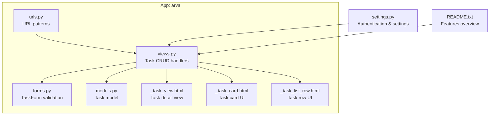
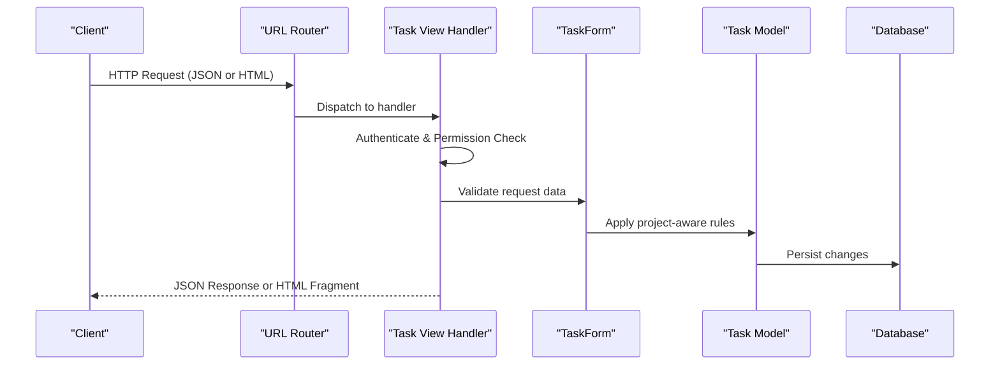
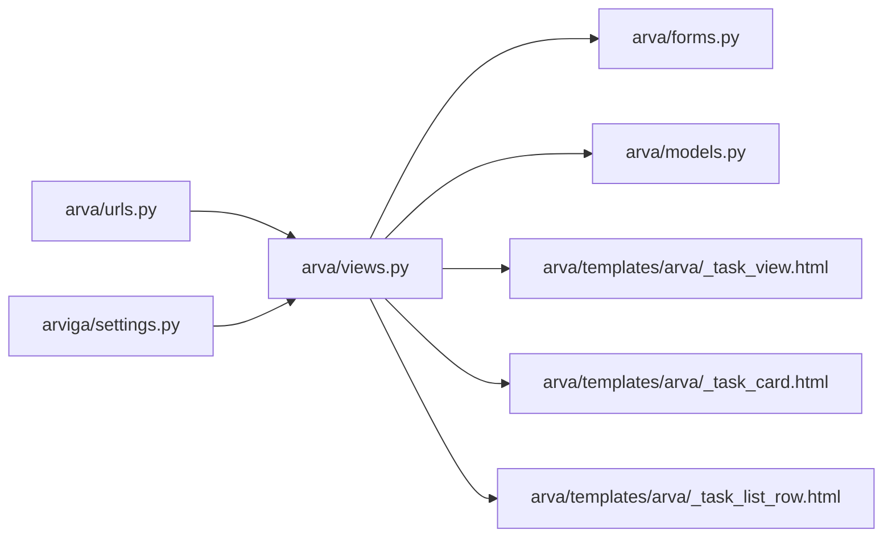

# Task CRUD Operations

<cite>
**Referenced Files in This Document**
- [README.txt](file://README.txt)
- [SETUP_GUIDE.md](file://SETUP_GUIDE.md)
- [arviga/settings.py](file://arviga/settings.py)
- [arva/models.py](file://arva/models.py)
- [arva/forms.py](file://arva/forms.py)
- [arva/urls.py](file://arva/urls.py)
- [arva/views.py](file://arva/views.py)
- [arva/templates/arva/_task_view.html](file://arva/templates/arva/_task_view.html)
- [arva/templates/arva/_task_card.html](file://arva/templates/arva/_task_card.html)
- [arva/templates/arva/_task_list_row.html](file://arva/templates/arva/_task_list_row.html)
</cite>

## Table of Contents
1. [Introduction](#introduction)
2. [Project Structure](#project-structure)
3. [Core Components](#core-components)
4. [Architecture Overview](#architecture-overview)
5. [Detailed Component Analysis](#detailed-component-analysis)
6. [Dependency Analysis](#dependency-analysis)
7. [Performance Considerations](#performance-considerations)
8. [Troubleshooting Guide](#troubleshooting-guide)
9. [Conclusion](#conclusion)

## Introduction
This document provides comprehensive API documentation for task CRUD operations in the Kanban application. It covers:
- Task creation under a project
- Task viewing with detailed information display
- Task update with field validation and partial updates
- Task deletion with permission checks and cascade effects

It also documents request/response schemas, authentication requirements, permission checks, and error handling for each operation, along with practical examples and validation scenarios.

## Project Structure
The task CRUD endpoints are implemented in the `arva` app and exposed via URL patterns. The backend uses Django with MySQL, and the frontend templates render task details and UI elements.

**Diagram sources**
- [arva/urls.py](file://arva/urls.py#L47-L56)
- [arva/views.py](file://arva/views.py#L1325-L1654)
- [arva/forms.py](file://arva/forms.py#L206-L291)
- [arva/models.py](file://arva/models.py#L252-L314)
- [arva/templates/arva/_task_view.html](file://arva/templates/arva/_task_view.html#L1-L314)
- [arva/templates/arva/_task_card.html](file://arva/templates/arva/_task_card.html#L1-L185)
- [arva/templates/arva/_task_list_row.html](file://arva/templates/arva/_task_list_row.html#L1-L126)
- [arviga/settings.py](file://arviga/settings.py#L79-L82)

**Section sources**
- [arva/urls.py](file://arva/urls.py#L47-L56)
- [arva/views.py](file://arva/views.py#L1325-L1654)
- [arva/forms.py](file://arva/forms.py#L206-L291)
- [arva/models.py](file://arva/models.py#L252-L314)
- [arva/templates/arva/_task_view.html](file://arva/templates/arva/_task_view.html#L1-L314)
- [arva/templates/arva/_task_card.html](file://arva/templates/arva/_task_card.html#L1-L185)
- [arva/templates/arva/_task_list_row.html](file://arva/templates/arva/_task_list_row.html#L1-L126)
- [arviga/settings.py](file://arviga/settings.py#L79-L82)
- [README.txt](file://README.txt#L1-L35)

## Core Components
- Task model: Defines fields, choices, and computed properties for tasks.
- TaskForm: Validates task creation/update with project-aware rules.
- Task CRUD views: Implement endpoints for create, view, update, delete with permission and project lock checks.
- Templates: Render task details and UI for task cards and list rows.

Key validations and constraints:
- Structured vs non-structured projects apply different validation rules.
- Project lock prevents modifications to closed projects.
- Assignee restrictions differ for structured projects.
- Date range and ETD constraints enforced during validation.

**Section sources**
- [arva/models.py](file://arva/models.py#L252-L314)
- [arva/forms.py](file://arva/forms.py#L206-L291)
- [arva/views.py](file://arva/views.py#L1542-L1654)

## Architecture Overview
The task CRUD flow follows a standard MVC pattern:
- URL routing maps endpoints to view handlers.
- Views enforce authentication and permissions, validate requests via forms, and render JSON responses or HTML fragments.
- Templates provide UI rendering for task details and cards.

**Diagram sources**
- [arva/urls.py](file://arva/urls.py#L47-L56)
- [arva/views.py](file://arva/views.py#L1542-L1654)
- [arva/forms.py](file://arva/forms.py#L206-L291)
- [arva/models.py](file://arva/models.py#L252-L314)

## Detailed Component Analysis

### Task Creation Endpoint
- Endpoint: POST /project/<int:pk>/task/create/
- Authentication: Required (login_required decorator)
- Permissions: Project access; admin or member allowed
- Project lock: Prevents creation if project is closed
- Request parameters (POST):
  - task_list_id: Target list ID
  - sub_project_id: Optional sub-project ID
  - title, description, priority, status, start_date, start_date_tbd, due_date, assignees (multiple), labels (multiple), cover_color
  - For non-structured projects, initial_comment and files can be included
- Validation rules:
  - Structured projects: title required, assignee required (single), start/end dates required, priority/status required, ETD constraints
  - Non-structured projects: labels and cover_color disabled; optional initial comment and attachments
- Response format:
  - Success: JSON with success flag, task_id, task_list_id, and rendered HTML fragments (task card and list row)
  - Error: JSON with success flag false and errors collection

Practical examples:
- Creating a structured task with required metadata and a single assignee.
- Creating a non-structured task with optional labels and attachments.

Validation scenarios:
- Missing required fields for structured tasks.
- Invalid date range or ETD violation.
- Assignee count exceeding allowed limit for structured tasks.

**Section sources**
- [arva/urls.py](file://arva/urls.py#L48)
- [arva/views.py](file://arva/views.py#L1542-L1606)
- [arva/forms.py](file://arva/forms.py#L206-L291)
- [arva/models.py](file://arva/models.py#L252-L314)

### Task Viewing Endpoint
- Endpoint: GET /task/<int:task_id>/view/
- Authentication: Required
- Permissions: Task assignee or project owner/admin
- Project lock: View-only mode if project is closed
- Response format:
  - Success: JSON with success flag true and rendered HTML fragment for task detail view
  - Error: JSON with success flag false and error message (Forbidden)

Practical examples:
- Assignee opens task detail view with inline-editable fields.
- Owner/admin views task regardless of assignment.

Validation scenarios:
- Non-assignee user attempts to view task.

**Section sources**
- [arva/urls.py](file://arva/urls.py#L49)
- [arva/views.py](file://arva/views.py#L1325-L1374)
- [arva/templates/arva/_task_view.html](file://arva/templates/arva/_task_view.html#L1-L314)

### Task Update Endpoint
- Endpoint: POST /task/<int:task_id>/update/
- Authentication: Required
- Permissions: Task assignee or project owner/admin
- Project lock: Prevents updates if project is closed
- Request parameters (POST):
  - Same as creation with optional subset of fields
  - For structured projects: labels and cover_color disabled
- Validation rules:
  - Same as creation but applied to existing task instance
- Response format:
  - Success: JSON with success flag true and rendered HTML fragment (task card)
  - Error: JSON with success flag false and errors collection

Partial updates:
- Only provided fields are updated; others retain current values.

**Section sources**
- [arva/urls.py](file://arva/urls.py#L50)
- [arva/views.py](file://arva/views.py#L1610-L1637)
- [arva/forms.py](file://arva/forms.py#L206-L291)

### Task Deletion Endpoint
- Endpoint: POST /task/<int:task_id>/delete/
- Authentication: Required
- Permissions: Project owner/admin only
- Project lock: Prevents deletion if project is closed
- Response format:
  - Success: JSON with success flag true
  - Error: JSON with success flag false and error message (Forbidden)

Cascade effects:
- Task deletion removes associated comments, attachments, checklist items, and activity logs.

**Section sources**
- [arva/urls.py](file://arva/urls.py#L51)
- [arva/views.py](file://arva/views.py#L1641-L1654)

### Additional Related Endpoints
- Inline update: POST /task/<int:task_id>/inline-update/ supports updating specific fields (title, description, status, dates, priority, assignees, labels, cover_color) with granular validation per field.
- Move task: POST /task/<int:task_id>/move/ reorders tasks within a list or moves across lists.
- Transfer task: POST /task/<int:task_id>/transfer/ moves tasks between projects and sub-projects.

**Section sources**
- [arva/urls.py](file://arva/urls.py#L56)
- [arva/views.py](file://arva/views.py#L1394-L1753)

## Dependency Analysis
Task CRUD operations depend on:
- URL routing to dispatch requests to appropriate views
- Forms for validation and normalization
- Models for data representation and constraints
- Templates for rendering task UI
- Authentication and session middleware for user context

**Diagram sources**
- [arva/urls.py](file://arva/urls.py#L47-L56)
- [arva/views.py](file://arva/views.py#L1325-L1654)
- [arva/forms.py](file://arva/forms.py#L206-L291)
- [arva/models.py](file://arva/models.py#L252-L314)
- [arva/templates/arva/_task_view.html](file://arva/templates/arva/_task_view.html#L1-L314)
- [arva/templates/arva/_task_card.html](file://arva/templates/arva/_task_card.html#L1-L185)
- [arva/templates/arva/_task_list_row.html](file://arva/templates/arva/_task_list_row.html#L1-L126)
- [arviga/settings.py](file://arviga/settings.py#L79-L82)

**Section sources**
- [arva/urls.py](file://arva/urls.py#L47-L56)
- [arva/views.py](file://arva/views.py#L1325-L1654)
- [arva/forms.py](file://arva/forms.py#L206-L291)
- [arva/models.py](file://arva/models.py#L252-L314)
- [arva/templates/arva/_task_view.html](file://arva/templates/arva/_task_view.html#L1-L314)
- [arva/templates/arva/_task_card.html](file://arva/templates/arva/_task_card.html#L1-L185)
- [arva/templates/arva/_task_list_row.html](file://arva/templates/arva/_task_list_row.html#L1-L126)
- [arviga/settings.py](file://arviga/settings.py#L79-L82)

## Performance Considerations
- Use select_related and prefetch_related to minimize database queries when rendering task lists and views.
- Avoid unnecessary AJAX calls; batch UI updates where possible.
- Limit concurrent inline updates to prevent race conditions.

[No sources needed since this section provides general guidance]

## Troubleshooting Guide
Common issues and resolutions:
- Forbidden errors: Ensure user has project access or is owner/admin.
- Project locked: Reopen project before performing modifications.
- Validation errors: Review required fields and constraints for structured vs non-structured tasks.
- Date constraints: Verify start_date, due_date, and ETD relationships.

**Section sources**
- [arva/views.py](file://arva/views.py#L1542-L1654)
- [arva/forms.py](file://arva/forms.py#L206-L291)

## Conclusion
The task CRUD API provides robust endpoints for managing tasks with strong validation, permission enforcement, and project-aware behavior. Structured and non-structured projects follow distinct validation rules, ensuring data integrity and consistent user experiences across different project types.