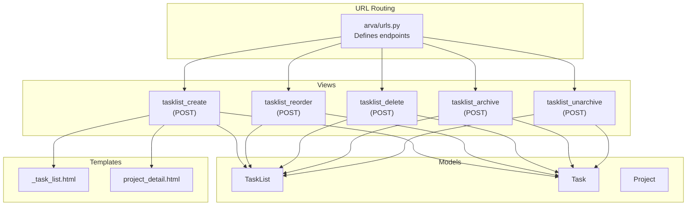
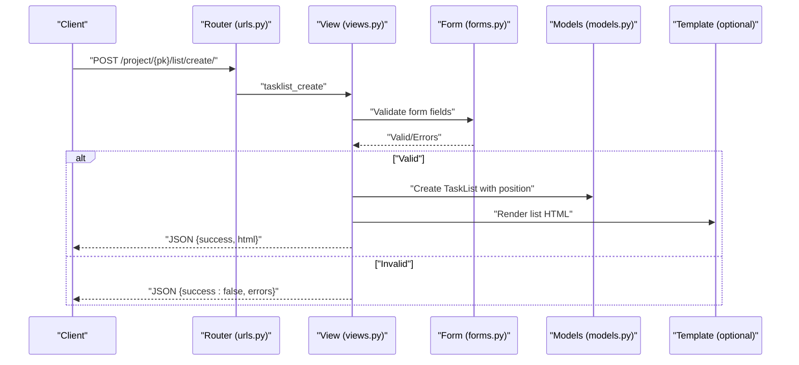
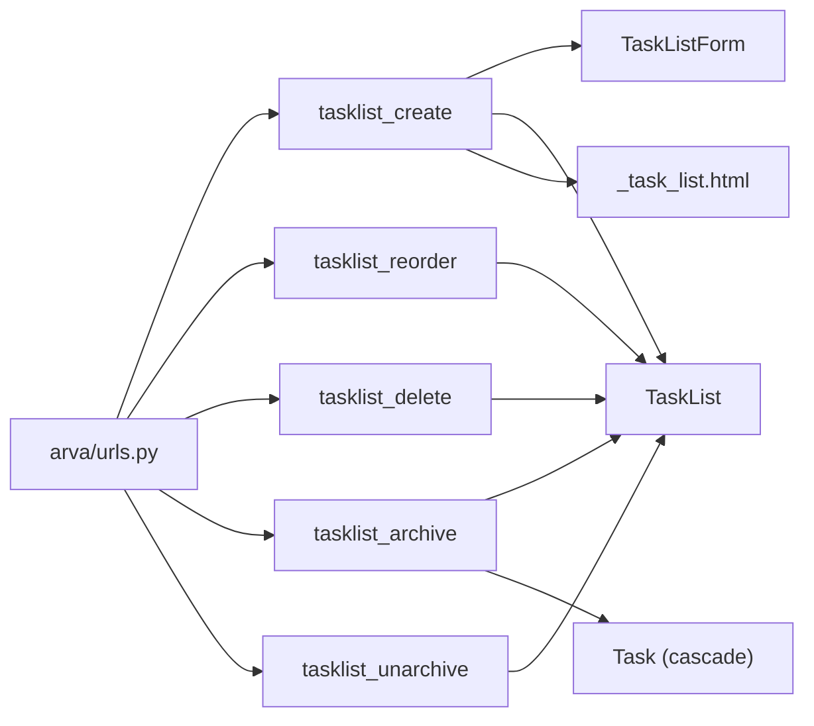

# Task List Management

<cite>
**Referenced Files in This Document**
- [urls.py](file://arva/urls.py)
- [views.py](file://arva/views.py)
- [models.py](file://arva/models.py)
- [_task_list.html](file://arva/templates/arva/_task_list.html)
- [project_detail.html](file://arva/templates/arva/project_detail.html)
- [forms.py](file://arva/forms.py)
</cite>

## Table of Contents
1. [Introduction](#introduction)
2. [Project Structure](#project-structure)
3. [Core Components](#core-components)
4. [Architecture Overview](#architecture-overview)
5. [Detailed Component Analysis](#detailed-component-analysis)
6. [Dependency Analysis](#dependency-analysis)
7. [Performance Considerations](#performance-considerations)
8. [Troubleshooting Guide](#troubleshooting-guide)
9. [Conclusion](#conclusion)

## Introduction
This document describes the task list management APIs exposed by the backend. It covers list creation, reordering, deletion, archiving, and unarchiving. For each endpoint, we specify request/response schemas, validation rules, permissions, and error handling behavior. We also clarify how default task settings are applied during list creation and how list visibility is controlled via archiving.

## Project Structure
The task list management endpoints are defined in the URL router and implemented in the views module. The data model for lists is defined in the models module. Templates render list UI elements and integrate with the frontend.

**Diagram sources**
- [urls.py](file://arva/urls.py#L33-L41)
- [views.py](file://arva/views.py#L1213-L1247)
- [views.py](file://arva/views.py#L1249-L1270)
- [views.py](file://arva/views.py#L1274-L1287)
- [views.py](file://arva/views.py#L1289-L1305)
- [views.py](file://arva/views.py#L1309-L1322)
- [models.py](file://arva/models.py#L238-L250)
- [models.py](file://arva/models.py#L252-L302)
- [_task_list.html](file://arva/templates/arva/_task_list.html#L1-L52)
- [project_detail.html](file://arva/templates/arva/project_detail.html#L508-L510)

**Section sources**
- [urls.py](file://arva/urls.py#L33-L41)
- [views.py](file://arva/views.py#L1213-L1322)
- [models.py](file://arva/models.py#L238-L302)
- [_task_list.html](file://arva/templates/arva/_task_list.html#L1-L52)
- [project_detail.html](file://arva/templates/arva/project_detail.html#L508-L510)

## Core Components
- TaskList model: Represents a column/status in a project or subproject, with position and archive flag.
- Task model: Tasks belong to a TaskList; archiving a list also archives all tasks within it.
- Views: Implementers of list management endpoints with permission checks and validation.
- Forms: Validation for list creation (name field).
- Templates: Render list UI and integrate with frontend actions.

**Section sources**
- [models.py](file://arva/models.py#L238-L250)
- [models.py](file://arva/models.py#L252-L302)
- [views.py](file://arva/views.py#L1213-L1322)
- [forms.py](file://arva/forms.py#L303-L306)
- [_task_list.html](file://arva/templates/arva/_task_list.html#L1-L52)

## Architecture Overview
The list management endpoints follow a consistent pattern:
- Authentication: All endpoints require login.
- Permissions: Owner-only control for admin-restricted operations (create, reorder, delete, archive/unarchive).
- Validation: Form validation for creation; subproject requirement when subprojects exist.
- Persistence: Updates to TaskList and cascading updates to Task when archiving.
- Logging: Activity log entries for each operation.

**Diagram sources**
- [urls.py](file://arva/urls.py#L34)
- [views.py](file://arva/views.py#L1213-L1247)
- [forms.py](file://arva/forms.py#L303-L306)
- [models.py](file://arva/models.py#L238-L250)
- [_task_list.html](file://arva/templates/arva/_task_list.html#L1-L52)

## Detailed Component Analysis

### Endpoint: List Creation
- Path: /project/{int:pk}/list/create/
- Method: POST
- Purpose: Create a new task list under a project or subproject.

Request
- Headers: Content-Type appropriate for form submission
- Body fields:
  - name (required): String; validated by TaskListForm
  - sub_project_id (conditional): Integer; required when project has subprojects
- Authentication: Required
- Permissions: Project owner only

Validation and Behavior
- If project has subprojects and sub_project_id is missing, returns error with HTTP 400
- On success, creates TaskList with position set to last+1 within the same project/subproject scope
- Returns rendered HTML fragment for the new list

Response
- Success: JSON with keys
  - success: Boolean true
  - html: String containing rendered list HTML
- Failure: JSON with keys
  - success: Boolean false
  - errors: Object with field-level validation messages

Notes
- Default task settings are not configured per list in the backend; default values for tasks are handled elsewhere in the system (e.g., priority, status, dates) when creating tasks, not during list creation.

**Section sources**
- [urls.py](file://arva/urls.py#L34)
- [views.py](file://arva/views.py#L1213-L1247)
- [forms.py](file://arva/forms.py#L303-L306)
- [models.py](file://arva/models.py#L238-L250)
- [_task_list.html](file://arva/templates/arva/_task_list.html#L1-L52)

### Endpoint: List Reordering
- Path: /project/{int:pk}/list/reorder/
- Method: POST
- Purpose: Update positions of task lists.

Request
- Headers: Content-Type appropriate for form submission
- Body fields:
  - sub_project_id (conditional): Integer; required when project has subprojects
  - ordered_ids[]: Array of integers; list IDs in desired order
- Authentication: Required
- Permissions: Project owner only

Validation and Behavior
- If project has subprojects and sub_project_id is missing, returns error with HTTP 400
- Updates each TaskList’s position to match its index in ordered_ids
- Logs activity

Response
- Success: JSON with keys
  - success: Boolean true
- Failure: JSON with keys
  - success: Boolean false
  - error: String describing the issue

Positioning Details
- Positions are sequential integers starting at 0
- The order corresponds to the order of IDs provided

**Section sources**
- [urls.py](file://arva/urls.py#L36)
- [views.py](file://arva/views.py#L1249-L1270)
- [models.py](file://arva/models.py#L246-L247)

### Endpoint: List Deletion
- Path: /list/{int:list_id}/delete/
- Method: POST
- Purpose: Delete a task list.

Request
- Headers: Content-Type appropriate for form submission
- Body: Empty
- Authentication: Required
- Permissions: Project owner only

Validation and Behavior
- Retrieves TaskList by ID and ensures requester has access to its project
- Deletes the list
- Logs activity

Response
- Success: JSON with keys
  - success: Boolean true
- Failure: HTTP 403 or 400 depending on permissions/lock status

Notes
- Deleting a list does not migrate tasks to another list; tasks remain attached to the deleted list. If you need to move tasks, perform a separate operation before deleting the list.

**Section sources**
- [urls.py](file://arva/urls.py#L37)
- [views.py](file://arva/views.py#L1274-L1287)
- [models.py](file://arva/models.py#L238-L250)

### Endpoint: List Archiving
- Path: /list/{int:list_id}/archive/
- Method: POST
- Purpose: Archive a task list and all tasks within it.

Request
- Headers: Content-Type appropriate for form submission
- Body: Empty
- Authentication: Required
- Permissions: Project owner only

Validation and Behavior
- Retrieves TaskList by ID and ensures requester has access to its project
- Sets TaskList.is_archived = true
- Cascades is_archived = true to all Task records in that list
- Logs activity

Response
- Success: JSON with keys
  - success: Boolean true
- Failure: JSON with keys
  - success: Boolean false
  - error: String describing the issue

Visibility Controls
- Archived lists and their tasks are excluded from normal list retrieval and UI rendering.

**Section sources**
- [urls.py](file://arva/urls.py#L38)
- [views.py](file://arva/views.py#L1289-L1305)
- [models.py](file://arva/models.py#L238-L250)
- [models.py](file://arva/models.py#L252-L302)

### Endpoint: List Unarchiving
- Path: /list/{int:list_id}/unarchive/
- Method: POST
- Purpose: Unarchive a task list and restore visibility.

Request
- Headers: Content-Type appropriate for form submission
- Body: Empty
- Authentication: Required
- Permissions: Project owner only

Validation and Behavior
- Retrieves TaskList by ID and ensures requester has access to its project
- Sets TaskList.is_archived = false
- Logs activity

Response
- Success: JSON with keys
  - success: Boolean true
- Failure: JSON with keys
  - success: Boolean false
  - error: String describing the issue

**Section sources**
- [urls.py](file://arva/urls.py#L39)
- [views.py](file://arva/views.py#L1309-L1322)
- [models.py](file://arva/models.py#L238-L250)

### Request/Response Schemas

- Common request headers
  - Content-Type: application/x-www-form-urlencoded or multipart/form-data
- Common response envelope
  - success: Boolean indicating operation outcome
  - Additional fields depend on endpoint

- List creation
  - Request body:
    - name: String
    - sub_project_id: Integer (when applicable)
  - Response body:
    - success: Boolean
    - html: String (rendered list HTML)

- List reorder
  - Request body:
    - sub_project_id: Integer (when applicable)
    - ordered_ids[]: Array of integers (list IDs)
  - Response body:
    - success: Boolean

- List delete
  - Request body: none
  - Response body:
    - success: Boolean

- List archive
  - Request body: none
  - Response body:
    - success: Boolean

- List unarchive
  - Request body: none
  - Response body:
    - success: Boolean

Validation rules
- Name is required for list creation and validated by TaskListForm.
- When a project has subprojects, sub_project_id is mandatory for list operations.
- Project lock status prevents modifications on closed projects.

Permission requirements
- Owner-only control for create, reorder, delete, archive/unarchive endpoints.

Error handling
- HTTP 400 for invalid requests (e.g., missing sub_project_id, closed project).
- HTTP 403 for insufficient permissions.
- Validation errors return JSON with errors object for list creation.

Examples
- Create a list
  - POST /project/123/list/create/
  - Body: name=Backlog&sub_project_id=5
  - Response: {"success":true,"html":"..."}
- Reorder lists
  - POST /project/123/list/reorder/
  - Body: sub_project_id=5&ordered_ids[]=10&ordered_ids[]=9&ordered_ids[]=11
  - Response: {"success":true}
- Delete a list
  - POST /list/456/delete/
  - Response: {"success":true}
- Archive a list
  - POST /list/456/archive/
  - Response: {"success":true}
- Unarchive a list
  - POST /list/456/unarchive/
  - Response: {"success":true}

Bulk operations
- Reorder supports bulk updates by passing multiple ordered_ids[].
- Archive cascades to all tasks in the list.

**Section sources**
- [views.py](file://arva/views.py#L1213-L1247)
- [views.py](file://arva/views.py#L1249-L1270)
- [views.py](file://arva/views.py#L1274-L1287)
- [views.py](file://arva/views.py#L1289-L1305)
- [views.py](file://arva/views.py#L1309-L1322)
- [forms.py](file://arva/forms.py#L303-L306)

## Dependency Analysis
The list management endpoints depend on:
- URL routing to dispatch requests to views
- Views to enforce authentication, permissions, and validation
- Forms to validate list creation
- Models to persist list state and relationships
- Templates to render list UI after creation

**Diagram sources**
- [urls.py](file://arva/urls.py#L33-L41)
- [views.py](file://arva/views.py#L1213-L1322)
- [forms.py](file://arva/forms.py#L303-L306)
- [models.py](file://arva/models.py#L238-L302)
- [_task_list.html](file://arva/templates/arva/_task_list.html#L1-L52)

**Section sources**
- [urls.py](file://arva/urls.py#L33-L41)
- [views.py](file://arva/views.py#L1213-L1322)
- [forms.py](file://arva/forms.py#L303-L306)
- [models.py](file://arva/models.py#L238-L302)
- [_task_list.html](file://arva/templates/arva/_task_list.html#L1-L52)

## Performance Considerations
- Reordering performs O(n) updates for n lists; acceptable for typical list counts.
- Archiving triggers a bulk update on tasks; ensure indexes exist on task_list foreign keys for efficiency.
- Rendering HTML on creation avoids extra round trips by returning pre-rendered fragments.

## Troubleshooting Guide
Common issues and resolutions
- Missing sub_project_id when project has subprojects
  - Symptom: HTTP 400 with error message
  - Resolution: Include sub_project_id in request body
- Closed project prevents modifications
  - Symptom: HTTP 400 with project-closed error
  - Resolution: Reopen the project before modifying lists
- Insufficient permissions
  - Symptom: HTTP 403
  - Resolution: Only project owners can modify lists
- List creation validation failures
  - Symptom: HTTP 400 with errors object
  - Resolution: Ensure name is provided and meets form requirements

**Section sources**
- [views.py](file://arva/views.py#L1213-L1247)
- [views.py](file://arva/views.py#L1249-L1270)
- [views.py](file://arva/views.py#L1274-L1287)
- [views.py](file://arva/views.py#L1289-L1305)
- [views.py](file://arva/views.py#L1309-L1322)
- [views.py](file://arva/views.py#L111-L115)

## Conclusion
The task list management API provides robust operations for creating, reordering, deleting, archiving, and unarchiving lists. It enforces strict permissions and validation, integrates with the project/subproject hierarchy, and maintains audit trails via activity logs. Default task settings are not configured per list; they are managed elsewhere in the system when tasks are created.