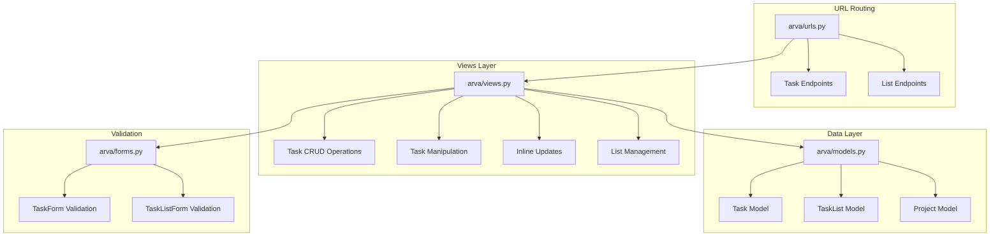
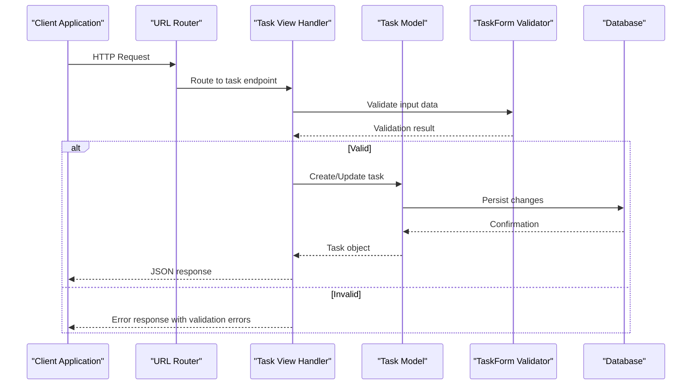
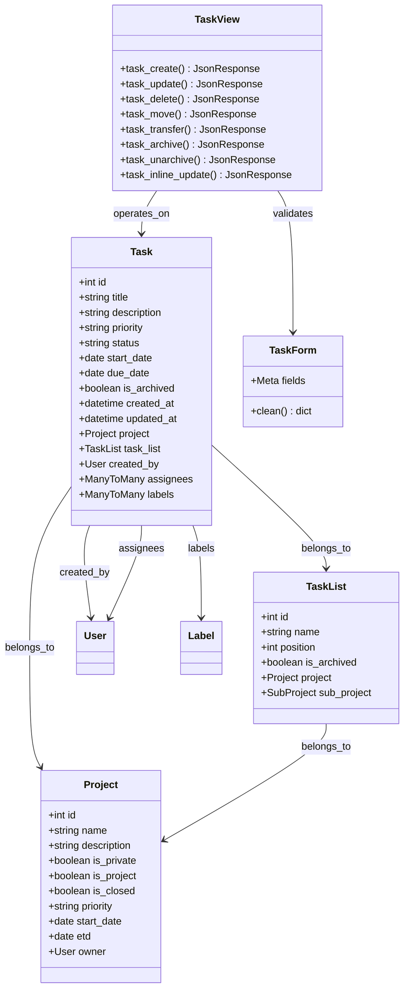

# Task Management Endpoints

<cite>
**Referenced Files in This Document**
- [arva/urls.py](file://arva/urls.py)
- [arva/views.py](file://arva/views.py)
- [arva/models.py](file://arva/models.py)
- [arva/forms.py](file://arva/forms.py)
- [arviga/urls.py](file://arviga/urls.py)
</cite>

## Table of Contents
1. [Introduction](#introduction)
2. [Project Structure](#project-structure)
3. [Core Components](#core-components)
4. [Architecture Overview](#architecture-overview)
5. [Detailed Component Analysis](#detailed-component-analysis)
6. [Dependency Analysis](#dependency-analysis)
7. [Performance Considerations](#performance-considerations)
8. [Troubleshooting Guide](#troubleshooting-guide)
9. [Conclusion](#conclusion)

## Introduction
This document provides comprehensive API documentation for task management endpoints in the Kanban project. It covers CRUD operations for tasks, list management, task manipulation operations, and inline updates. The documentation includes request/response schemas, validation rules, and usage examples for each endpoint.

## Project Structure
The task management functionality is implemented within the `arva` Django application, with URL routing defined in `arva/urls.py` and business logic in `arva/views.py`. The data models are defined in `arva/models.py`, and form validation logic is handled in `arva/forms.py`.



**Diagram sources**
- [arva/urls.py](file://arva/urls.py#L47-L57)
- [arva/views.py](file://arva/views.py#L1325-L1538)
- [arva/models.py](file://arva/models.py#L252-L352)
- [arva/forms.py](file://arva/forms.py#L206-L292)

**Section sources**
- [arva/urls.py](file://arva/urls.py#L1-L98)
- [arviga/urls.py](file://arviga/urls.py#L1-L15)

## Core Components
The task management system consists of several key components:

### Task Model
The Task model defines the core task entity with fields for title, description, priority, status, dates, assignees, labels, and archival status. It includes AI analysis fields for priority scoring and complexity assessment.

### TaskList Model  
The TaskList model represents task lanes/lists within projects, supporting ordering and archival functionality.

### Project Model
The Project model defines project containers that can be either regular projects or structured projects with specific constraints for task management.

### Forms and Validation
The TaskForm and TaskListForm provide comprehensive validation rules for task creation and list management, including project-specific constraints for structured projects.

**Section sources**
- [arva/models.py](file://arva/models.py#L252-L352)
- [arva/forms.py](file://arva/forms.py#L206-L292)

## Architecture Overview
The task management architecture follows Django's MVC pattern with clear separation of concerns:



**Diagram sources**
- [arva/views.py](file://arva/views.py#L1542-L1637)
- [arva/forms.py](file://arva/forms.py#L206-L292)

## Detailed Component Analysis

### Task CRUD Operations

#### Task Creation Endpoint
**Endpoint:** `POST /project/<int:pk>/task/create/`

**Purpose:** Creates a new task within a specified project and list.

**Request Parameters:**
- `task_list_id`: Required integer - ID of the target task list
- `sub_project_id`: Optional integer - ID of sub-project (if applicable)
- TaskForm fields (validated by TaskForm):
  - `title`: Required string (255 chars max)
  - `description`: Optional text
  - `priority`: Optional priority code (defaults to P2)
  - `status`: Optional status code
  - `start_date`: Optional date (YYYY-MM-DD)
  - `start_date_tbd`: Optional boolean flag
  - `due_date`: Optional date (YYYY-MM-DD)
  - `assignees`: Optional comma-separated user IDs
  - `labels`: Optional comma-separated label IDs
  - `cover_color`: Optional color code

**Response Schema:**
```json
{
  "success": true,
  "task": {
    "id": 123,
    "title": "Task Title",
    "description": "Task Description",
    "priority": "p2",
    "status": "-",
    "start_date": "2024-01-01",
    "due_date": "2024-01-31",
    "assignees": [1, 2, 3],
    "labels": [1, 2],
    "cover_color": "blue",
    "is_archived": false,
    "created_at": "2024-01-01T12:00:00Z",
    "updated_at": "2024-01-01T12:00:00Z"
  },
  "html": "<rendered HTML>",
  "list_row_html": "<rendered HTML>"
}
```

**Validation Rules:**
- Project access validation (owner/admin/member)
- List assignment validation
- Structured project constraints (single assignee, required dates)
- Date validation (start date ≤ due date, due date ≤ project ETD)

**Usage Example:**
```javascript
fetch('/project/1/task/create/', {
  method: 'POST',
  headers: {'Content-Type': 'application/x-www-form-urlencoded'},
  body: 'task_list_id=1&title=Test+Task&assignees=1,2'
})
.then(response => response.json())
.then(data => console.log(data));
```

**Section sources**
- [arva/views.py](file://arva/views.py#L1542-L1637)
- [arva/forms.py](file://arva/forms.py#L206-L292)

#### Task View Endpoint
**Endpoint:** `GET /task/<int:task_id>/view/`

**Purpose:** Retrieves detailed task information for display in a modal or view.

**Request Parameters:**
- `task_id`: Required integer - Task identifier

**Response Schema:**
```json
{
  "success": true,
  "html": "<rendered task view HTML>",
  "task": {
    "id": 123,
    "title": "Task Title",
    "description": "Task Description",
    "priority": "p2",
    "status": "-",
    "start_date": "2024-01-01",
    "due_date": "2024-01-31",
    "assignees": ["user1", "user2"],
    "labels": ["label1", "label2"],
    "checklist_total": 5,
    "checklist_done": 3,
    "checklist_percent": 60
  }
}
```

**Access Control:** Requires project access or assignment to the task.

**Section sources**
- [arva/views.py](file://arva/views.py#L1325-L1374)

#### Task Update Endpoint
**Endpoint:** `POST /task/<int:task_id>/update/`

**Purpose:** Updates an existing task's properties.

**Request Parameters:**
- `task_id`: Required integer - Task identifier
- Same as task creation with additional support for existing task validation

**Response Schema:**
```json
{
  "success": true,
  "html": "<rendered task card HTML>"
}
```

**Validation Rules:**
- Same as task creation plus existing task validation
- Project lock validation (prevents updates on closed projects)

**Section sources**
- [arva/views.py](file://arva/views.py#L1610-L1637)

#### Task Delete Endpoint
**Endpoint:** `POST /task/<int:task_id>/delete/`

**Purpose:** Permanently deletes a task.

**Request Parameters:**
- `task_id`: Required integer - Task identifier

**Response Schema:**
```json
{
  "success": true
}
```

**Access Control:** Requires admin role for the project.

**Section sources**
- [arva/views.py](file://arva/views.py#L1640-L1654)

### Task Manipulation Endpoints

#### Task Move Endpoint
**Endpoint:** `POST /task/<int:task_id>/move/`

**Purpose:** Moves a task between lists and reorders tasks within a list.

**Request Parameters:**
- `task_list_id`: Required integer - Target list ID
- `ordered_ids[]`: Optional array - New order of task IDs for reordering

**Response Schema:**
```json
{
  "success": true
}
```

**Access Control:** Requires admin or member role, or assignment to the task.

**Section sources**
- [arva/views.py](file://arva/views.py#L1659-L1689)

#### Task Transfer Endpoint
**Endpoint:** `POST /task/<int:task_id>/transfer/`

**Purpose:** Transfers a task between projects and sub-projects.

**Request Parameters:**
- `project_id`: Required integer - Target project ID
- `task_list_id`: Optional integer - Target list ID (auto-selects first available if not provided)
- `sub_project_id`: Optional integer - Target sub-project ID (required if target project has sub-projects)

**Response Schema:**
```json
{
  "success": true
}
```

**Access Control:** Requires admin or member role in source project, admin role in target project.

**Section sources**
- [arva/views.py](file://arva/views.py#L1694-L1753)

#### Task Archive Endpoint
**Endpoint:** `POST /task/<int:task_id>/archive/`

**Purpose:** Archives a task (moves to archived state).

**Request Parameters:**
- `task_id`: Required integer - Task identifier

**Response Schema:**
```json
{
  "success": true
}
```

**Access Control:** Requires admin role for the project.

**Section sources**
- [arva/views.py](file://arva/views.py#L1757-L1770)

#### Task Unarchive Endpoint
**Endpoint:** `POST /task/<int:task_id>/unarchive/`

**Purpose:** Unarchives a task (restores from archived state).

**Request Parameters:**
- `task_id`: Required integer - Task identifier

**Response Schema:**
```json
{
  "success": true
}
```

**Access Control:** Requires admin role for the project.

**Section sources**
- [arva/views.py](file://arva/views.py#L1774-L1787)

### Inline Update Endpoint

#### Task Inline Update Endpoint
**Endpoint:** `POST /task/<int:task_id>/inline-update/`

**Purpose:** Performs real-time inline updates to task properties.

**Request Parameters:**
- `task_id`: Required integer - Task identifier
- `field`: Required string - Field to update (title, description, status, start_date, start_date_tbd, due_date, priority, assignees, labels, cover_color)
- `value`: Required string - New value for the field

**Supported Fields:**
- `title`: Text up to 255 characters
- `description`: Text
- `status`: One of '-', 'in_progress', 'done', 'infeasible' (structured projects only)
- `start_date`: Date in YYYY-MM-DD format or empty
- `start_date_tbd`: Boolean flag (1/0, true/false)
- `due_date`: Date in YYYY-MM-DD format (structured projects only)
- `priority`: One of 'p0'-'p4' (structured projects only)
- `assignees`: Comma-separated user IDs (structured projects: max 1 assignee)
- `labels`: Comma-separated label IDs (disabled for structured projects)
- `cover_color`: Color code or empty

**Response Schema:**
```json
{
  "success": true,
  "html": "<rendered task card HTML>",
  "list_row_html": "<rendered list row HTML>"
}
```

**Validation Rules:**
- Field-specific validation based on task type (project vs regular)
- Date constraint validation (start_date ≤ due_date)
- Assignee count validation (structured projects: exactly 1)
- Priority/status validation (structured projects only)

**Section sources**
- [arva/views.py](file://arva/views.py#L1394-L1538)

### Task List Management Endpoints

#### List Creation Endpoint
**Endpoint:** `POST /project/<int:pk>/list/create/`

**Purpose:** Creates a new task list within a project.

**Request Parameters:**
- `name`: Required string - List name
- `sub_project_id`: Optional integer - Sub-project ID (required if project has sub-projects)

**Response Schema:**
```json
{
  "success": true,
  "html": "<rendered list HTML>"
}
```

**Access Control:** Requires admin role for the project.

**Section sources**
- [arva/views.py](file://arva/views.py#L1213-L1247)

#### List Reorder Endpoint
**Endpoint:** `POST /project/<int:pk>/list/reorder/`

**Purpose:** Reorders task lists within a project.

**Request Parameters:**
- `ordered_ids[]`: Required array - List of list IDs in new order
- `sub_project_id`: Optional integer - Sub-project ID (required if project has sub-projects)

**Response Schema:**
```json
{
  "success": true
}
```

**Access Control:** Requires admin role for the project.

**Section sources**
- [arva/views.py](file://arva/views.py#L1251-L1270)

#### List Deletion Endpoint
**Endpoint:** `POST /list/<int:list_id>/delete/`

**Purpose:** Deletes a task list.

**Request Parameters:**
- `list_id`: Required integer - List identifier

**Response Schema:**
```json
{
  "success": true
}
```

**Access Control:** Requires admin role for the project.

**Section sources**
- [arva/views.py](file://arva/views.py#L1274-L1287)

#### List Archive Endpoint
**Endpoint:** `POST /list/<int:list_id>/archive/`

**Purpose:** Archives a task list and all tasks within it.

**Request Parameters:**
- `list_id`: Required integer - List identifier

**Response Schema:**
```json
{
  "success": true
}
```

**Access Control:** Requires admin role for the project.

**Section sources**
- [arva/views.py](file://arva/views.py#L1291-L1305)

#### List Unarchive Endpoint
**Endpoint:** `POST /list/<int:list_id>/unarchive/`

**Purpose:** Unarchives a task list and restores archived tasks.

**Request Parameters:**
- `list_id`: Required integer - List identifier

**Response Schema:**
```json
{
  "success": true
}
```

**Access Control:** Requires admin role for the project.

**Section sources**
- [arva/views.py](file://arva/views.py#L1309-L1322)

## Dependency Analysis



**Diagram sources**
- [arva/models.py](file://arva/models.py#L252-L352)
- [arva/forms.py](file://arva/forms.py#L206-L292)
- [arva/views.py](file://arva/views.py#L1542-L1787)

**Section sources**
- [arva/models.py](file://arva/models.py#L252-L352)
- [arva/forms.py](file://arva/forms.py#L206-L292)

## Performance Considerations
- **Database Queries:** Task operations use efficient filtering and select_related/prefetch_related to minimize database hits
- **Batch Operations:** List reordering uses bulk update operations for optimal performance
- **Caching:** Task checklist statistics are calculated efficiently using aggregation functions
- **Pagination:** Large task lists support pagination for better client performance
- **AJAX Updates:** Inline updates provide real-time feedback without full page reloads

## Troubleshooting Guide

### Common Error Scenarios

**Authentication Issues:**
- HTTP 403 Forbidden: User not authenticated or lacks sufficient permissions
- Verify user is logged in and has appropriate project access level

**Authorization Issues:**
- HTTP 403 Forbidden: Insufficient role (must be admin/member/assignee)
- Project locked: Cannot modify tasks in closed projects
- Access denied: Not assigned to task for certain operations

**Validation Errors:**
- HTTP 400 Bad Request: Form validation failures
- Common validation failures include missing required fields, invalid dates, and constraint violations
- Check response `errors` field for specific validation messages

**Resource Not Found:**
- HTTP 404 Not Found: Task, list, or project does not exist
- Verify ID parameters are correct and resource still exists

**Section sources**
- [arva/views.py](file://arva/views.py#L1394-L1538)
- [arva/views.py](file://arva/views.py#L1610-L1654)

## Conclusion
The task management API provides comprehensive functionality for Kanban-style task management with robust validation, access control, and real-time update capabilities. The endpoints support both traditional CRUD operations and modern inline editing, making it suitable for dynamic web applications. The architecture ensures scalability through efficient database operations and proper separation of concerns between models, views, and forms.