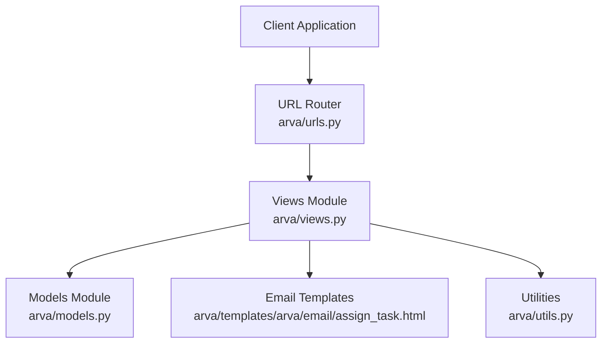
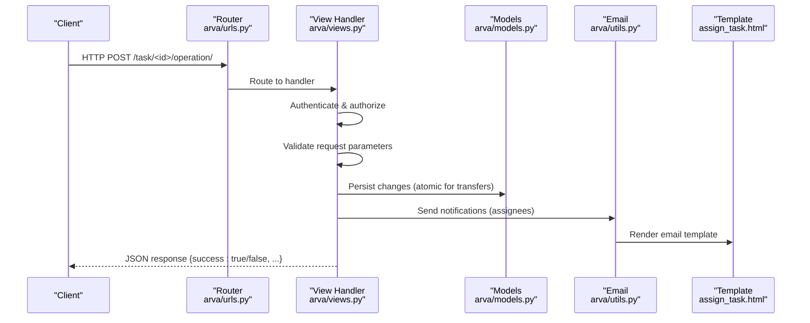
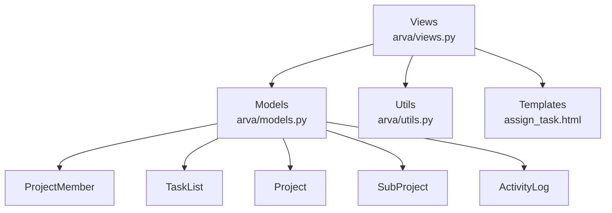

# Task Manipulation Operations

<cite>
**Referenced Files in This Document**
- [arva/views.py](file://arva/views.py)
- [arva/models.py](file://arva/models.py)
- [arva/urls.py](file://arva/urls.py)
- [arva/templates/arva/email/assign_task.html](file://arva/templates/arva/email/assign_task.html)
- [arva/utils.py](file://arva/utils.py)
</cite>

## Table of Contents
1. [Introduction](#introduction)
2. [Project Structure](#project-structure)
3. [Core Components](#core-components)
4. [Architecture Overview](#architecture-overview)
5. [Detailed Component Analysis](#detailed-component-analysis)
6. [Dependency Analysis](#dependency-analysis)
7. [Performance Considerations](#performance-considerations)
8. [Troubleshooting Guide](#troubleshooting-guide)
9. [Conclusion](#conclusion)

## Introduction
This document provides comprehensive API documentation for task manipulation operations in the Kanban system. It covers the following operations:
- Task movement: moving a task within the same project to a different list and reordering tasks
- Task transfer: moving a task across projects (including subprojects)
- Task archiving and unarchiving: changing task visibility and status
- Inline updates: real-time editing of task fields with field-specific validation

Each operation includes endpoint definitions, request schemas, validation rules, permission requirements, and examples. Edge cases such as cross-project transfers and archived task modifications are addressed.

## Project Structure
The task manipulation endpoints are implemented in the backend views module and routed via URL patterns. The data model defines the Task entity and related constraints.

**Diagram sources**
- [arva/urls.py](file://arva/urls.py#L47-L56)
- [arva/views.py](file://arva/views.py#L1659-L1787)
- [arva/models.py](file://arva/models.py#L252-L314)
- [arva/templates/arva/email/assign_task.html](file://arva/templates/arva/email/assign_task.html)

**Section sources**
- [arva/urls.py](file://arva/urls.py#L47-L56)
- [arva/views.py](file://arva/views.py#L1659-L1787)
- [arva/models.py](file://arva/models.py#L252-L314)

## Core Components
- Task model: Defines task attributes, statuses, priorities, and relationships to projects, subprojects, and lists.
- Permission utilities: Role-based checks and project access validation.
- Email utilities: Notification delivery for task assignments.

Key constants and model fields relevant to task manipulation:
- Statuses: None, In Progress, Done, Infeasible
- Priorities: P0-P4 and legacy values
- Archival flag: is_archived

**Section sources**
- [arva/models.py](file://arva/models.py#L252-L314)
- [arva/views.py](file://arva/views.py#L35-L47)

## Architecture Overview
The task manipulation APIs follow a consistent pattern:
- Authentication: Login required decorator
- Authorization: Role checks and project membership validation
- Validation: Request parameter validation and business rule enforcement
- Persistence: Atomic transactions for cross-project operations
- Logging: Activity logs for audit trails

**Diagram sources**
- [arva/urls.py](file://arva/urls.py#L52-L56)
- [arva/views.py](file://arva/views.py#L1659-L1787)
- [arva/utils.py](file://arva/utils.py)

## Detailed Component Analysis

### Task Movement (/task/<int:task_id>/move/)
Moves a task within the same project to a different list and optionally reorders tasks.

- Endpoint: POST /task/<task_id>/move/
- Authentication: Required
- Authorization:
  - Must be project-accessible
  - Admin or Member role, or assignee of the task
- Request Parameters:
  - task_list_id: integer (required)
  - ordered_ids[]: array of integers (optional)
- Validation Rules:
  - task_list_id must reference a list in the same project
  - If moving across subprojects, subproject association updates automatically
  - ordered_ids must correspond to tasks in the same project
- Behavior:
  - Updates task_list and sub_project if crossing subprojects
  - Reorders tasks using provided ordered_ids
  - Logs activity

Response:
- Success: {success: true}
- Errors: {success: false, error: "<message>"} with 400/403 status

Edge Cases:
- Cross-subproject movement updates sub_project automatically
- Reordering requires ordered_ids to be present and valid

**Section sources**
- [arva/views.py](file://arva/views.py#L1659-L1689)

### Task Transfer (/task/<int:task_id>/transfer/)
Transfers a task across projects, including subprojects. Requires permissions in both source and target projects.

- Endpoint: POST /task/<task_id>/transfer/
- Authentication: Required
- Authorization:
  - Source: Admin or Member role, or assignee of the task
  - Target: Admin or Member role
- Request Parameters:
  - project_id: integer (required)
  - task_list_id: integer (optional)
  - sub_project_id: integer (optional)
- Validation Rules:
  - project_id must be accessible to the user
  - sub_project_id required if target project has subprojects
  - task_list_id must belong to target project and match subproject
  - If no task_list_id provided, selects first non-archived list in target project/subproject
- Behavior:
  - Moves task to target project/subproject/list
  - Sets order to next available position
  - Creates activity logs for both source and target projects
  - Atomic transaction ensures consistency

Response:
- Success: {success: true}
- Errors: {success: false, error: "<message>"} with 400/403 status

Edge Cases:
- Cross-project transfers update project, sub_project, and task_list
- Target list selection handles archived lists and subproject constraints

**Section sources**
- [arva/views.py](file://arva/views.py#L1694-L1753)

### Task Archiving (/task/<int:task_id>/archive/) and Unarchiving (/task/<int:task_id>/unarchive/)
Changes task visibility by toggling the archival flag.

- Endpoint: POST /task/<task_id>/archive/ or /task/<task_id>/unarchive/
- Authentication: Required
- Authorization:
  - Admin role required for both operations
- Request Parameters: None
- Validation Rules:
  - Operation blocked if project is closed (locked)
- Behavior:
  - Sets is_archived = true (archive) or false (unarchive)
  - Logs activity

Response:
- Success: {success: true}
- Errors: {success: false, error: "<message>"} with 400/403 status

Edge Cases:
- Archived tasks remain accessible but hidden from normal views
- Project closure prevents any modifications

**Section sources**
- [arva/views.py](file://arva/views.py#L1757-L1787)

### Inline Updates (/task/<int:task_id>/inline-update/)
Real-time editing of task fields with field-specific validation.

- Endpoint: POST /task/<task_id>/inline-update/
- Authentication: Required
- Authorization:
  - Admin or assignee of the task
- Request Parameters:
  - field: string (required)
  - value: string (required)
- Supported Fields and Validation:
  - title: free text
  - description: free text
  - status: one of -, in_progress, done, infeasible (project tasks only)
  - start_date: YYYY-MM-DD or empty; required for project tasks unless start_date_tbd is set
  - start_date_tbd: boolean-like values; mutually enforces start_date requirement
  - due_date: YYYY-MM-DD; must be >= start_date; must not exceed project ETD for project tasks
  - priority: one of P0-P4 or legacy values (project tasks only)
  - assignees: comma-separated user IDs; project tasks allow only one assignee
  - labels: comma-separated label IDs; disabled for project tasks
  - cover_color: hex color or empty
- Behavior:
  - Validates field and value against rules
  - Updates task and persists changes
  - Logs activity
  - Returns rendered HTML fragments for UI updates

Response:
- Success: {success: true, html: "...", list_row_html: "..."}
- Errors: {success: false, error: "<message>"} with 400/403 status

Notification Requirements:
- Assigning users triggers email notifications to newly added assignees
- Owner is excluded from automatic membership creation and emails

**Section sources**
- [arva/views.py](file://arva/views.py#L1394-L1538)

## Dependency Analysis
The task manipulation handlers depend on:
- Models: Task, TaskList, Project, SubProject, ProjectMember, ActivityLog
- Utilities: EmailThread for notifications
- Templates: Email template for assign_task notifications

**Diagram sources**
- [arva/views.py](file://arva/views.py#L1659-L1787)
- [arva/models.py](file://arva/models.py#L252-L314)
- [arva/utils.py](file://arva/utils.py)

**Section sources**
- [arva/views.py](file://arva/views.py#L1659-L1787)
- [arva/models.py](file://arva/models.py#L252-L314)

## Performance Considerations
- Batch ordering updates: Uses CASE/WHEN to update multiple tasks efficiently in a single query
- Atomic transfers: Ensures consistency across project boundaries
- Minimal database roundtrips: Single save per operation with selective field updates
- Email delivery: Asynchronous threading for assignee notifications

## Troubleshooting Guide
Common issues and resolutions:
- Permission Denied (403):
  - Verify user has access to the project and meets role requirements
  - For transfers, ensure target project allows the user to modify tasks
- Bad Request (400):
  - Check required parameters (e.g., missing project_id, invalid list_id)
  - Validate field values against constraints (dates, priorities, statuses)
- Project Closed:
  - Reopen the project to enable modifications
- Cross-project Transfer Failures:
  - Ensure target list belongs to the target project and matches subproject
  - Provide sub_project_id when target project has subprojects

**Section sources**
- [arva/views.py](file://arva/views.py#L1659-L1787)

## Conclusion
The task manipulation APIs provide robust operations for moving, transferring, archiving, and updating tasks with comprehensive validation and permission checks. The inline update endpoint enables real-time editing with immediate UI feedback and targeted notifications for assignees.