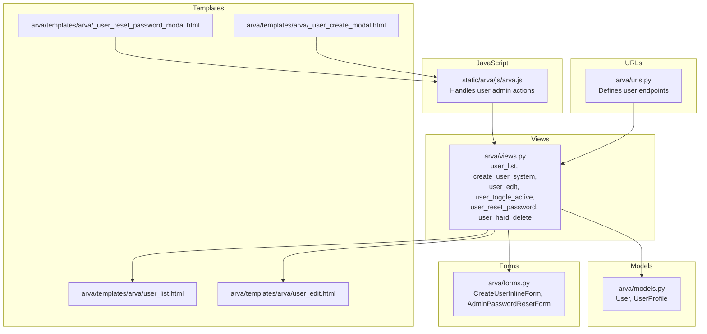
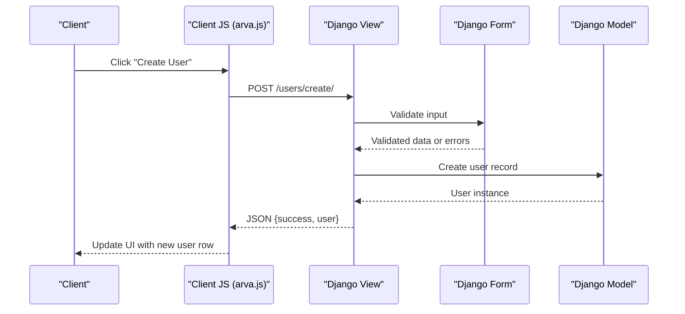
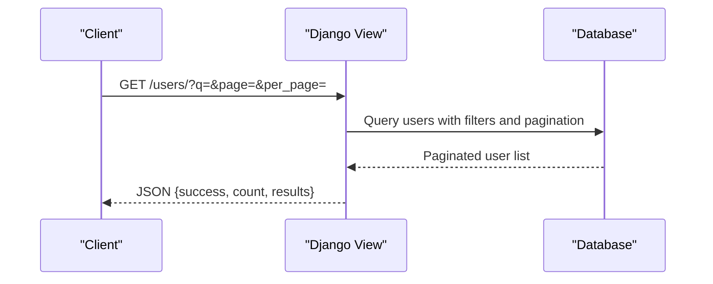
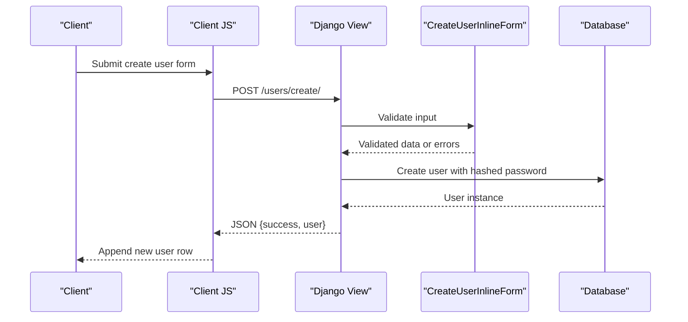
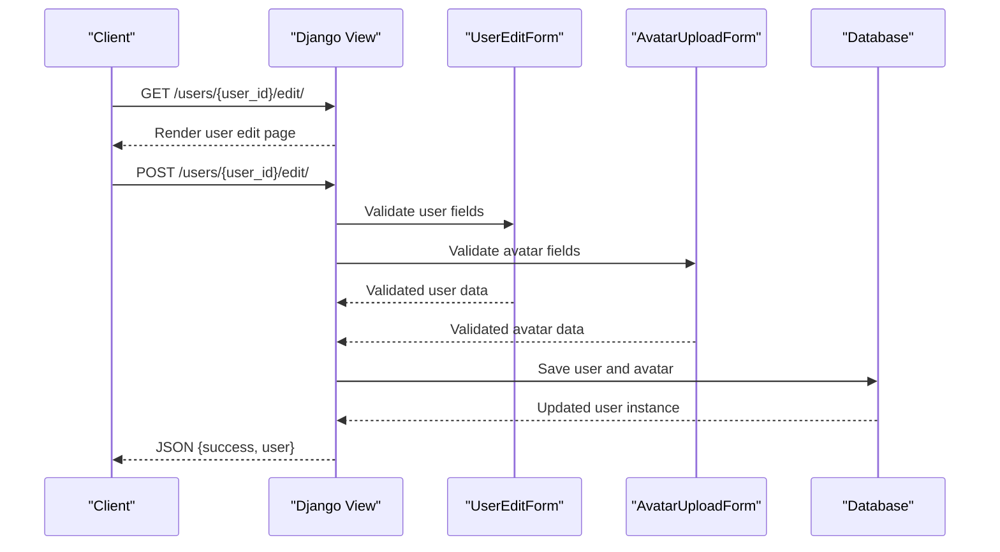
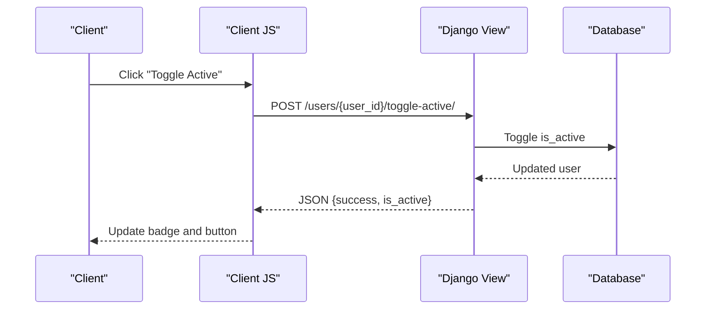
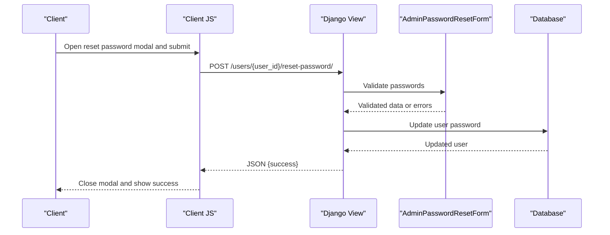
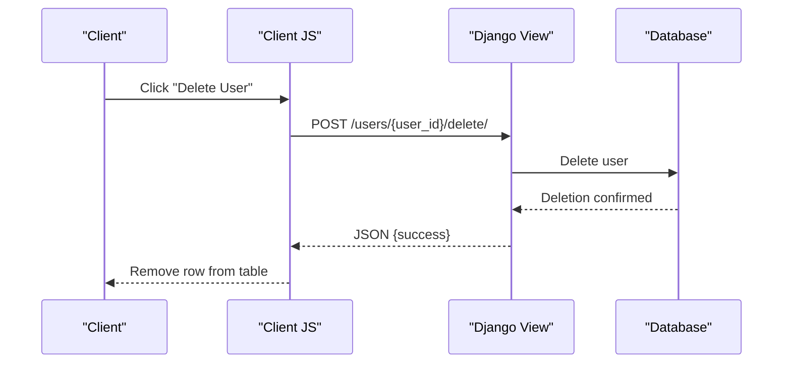
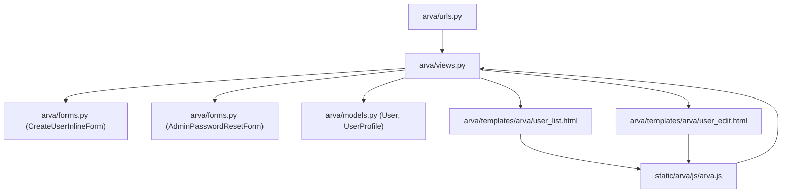

# General User Administration

<cite>
**Referenced Files in This Document**
- [arva/views.py](file://arva/views.py)
- [arva/urls.py](file://arva/urls.py)
- [arva/forms.py](file://arva/forms.py)
- [arva/models.py](file://arva/models.py)
- [arva/templates/arva/user_list.html](file://arva/templates/arva/user_list.html)
- [arva/templates/arva/user_edit.html](file://arva/templates/arva/user_edit.html)
- [arva/templates/arva/_user_create_modal.html](file://arva/templates/arva/_user_create_modal.html)
- [arva/templates/arva/_user_reset_password_modal.html](file://arva/templates/arva/_user_reset_password_modal.html)
- [static/arva/js/arva.js](file://static/arva/js/arva.js)
</cite>

## Table of Contents
1. [Introduction](#introduction)
2. [Project Structure](#project-structure)
3. [Core Components](#core-components)
4. [Architecture Overview](#architecture-overview)
5. [Detailed Component Analysis](#detailed-component-analysis)
6. [Dependency Analysis](#dependency-analysis)
7. [Performance Considerations](#performance-considerations)
8. [Troubleshooting Guide](#troubleshooting-guide)
9. [Conclusion](#conclusion)

## Introduction
This document describes the general user administration API endpoints for managing users within the system. It covers user listing with filtering and pagination, user creation with form validation and email notifications, user editing with profile updates, user activation toggling with permission checks, password reset with security measures, and user deletion with hard delete options. The documentation includes request/response schemas, authentication requirements, permission levels, and administrative access patterns, along with examples of successful responses and common error scenarios.

## Project Structure
The user administration functionality spans Django views, URL routing, forms, models, templates, and client-side JavaScript. The relevant components are organized as follows:
- URLs define endpoint routes for user administration actions.
- Views implement the business logic for each endpoint, enforcing permissions and returning JSON responses.
- Forms validate input data for user creation and password reset.
- Templates render the user list and edit pages, and provide modals for creation and password reset.
- JavaScript handles client-side interactions for user administration actions.

**Diagram sources**
- [arva/urls.py](file://arva/urls.py#L70-L79)
- [arva/views.py](file://arva/views.py#L218-L366)
- [arva/forms.py](file://arva/forms.py#L67-L127)
- [arva/models.py](file://arva/models.py#L56-L100)
- [arva/templates/arva/user_list.html](file://arva/templates/arva/user_list.html#L1-L265)
- [arva/templates/arva/user_edit.html](file://arva/templates/arva/user_edit.html#L1-L155)
- [arva/templates/arva/_user_create_modal.html](file://arva/templates/arva/_user_create_modal.html#L1-L33)
- [arva/templates/arva/_user_reset_password_modal.html](file://arva/templates/arva/_user_reset_password_modal.html#L1-L29)
- [static/arva/js/arva.js](file://static/arva/js/arva.js#L2201-L2353)

**Section sources**
- [arva/urls.py](file://arva/urls.py#L70-L79)
- [arva/views.py](file://arva/views.py#L218-L366)
- [arva/forms.py](file://arva/forms.py#L67-L127)
- [arva/models.py](file://arva/models.py#L56-L100)
- [arva/templates/arva/user_list.html](file://arva/templates/arva/user_list.html#L1-L265)
- [arva/templates/arva/user_edit.html](file://arva/templates/arva/user_edit.html#L1-L155)
- [arva/templates/arva/_user_create_modal.html](file://arva/templates/arva/_user_create_modal.html#L1-L33)
- [arva/templates/arva/_user_reset_password_modal.html](file://arva/templates/arva/_user_reset_password_modal.html#L1-L29)
- [static/arva/js/arva.js](file://static/arva/js/arva.js#L2201-L2353)

## Core Components
- Authentication and Authorization
  - All user administration endpoints require the user to be authenticated.
  - Administrative actions require the requesting user to be a superuser.
- Request/Response Patterns
  - Endpoints return JSON responses with a success flag and, when applicable, a user object or status field.
  - Validation errors return a 400 status with an errors object containing field-specific messages.
  - Permission violations return a 403 status with an error message.
- Data Models
  - User and UserProfile are used to represent user accounts and profiles.

**Section sources**
- [arva/views.py](file://arva/views.py#L218-L366)
- [arva/models.py](file://arva/models.py#L56-L100)

## Architecture Overview
The user administration endpoints follow a standard MVC pattern:
- URLs route requests to specific view functions.
- Views enforce authentication and authorization, validate input via forms, and return JSON responses.
- Templates render the user list and edit pages, and modals support creation and password reset actions.
- JavaScript handles client-side interactions and AJAX calls to the backend.

**Diagram sources**
- [arva/urls.py](file://arva/urls.py#L72)
- [arva/views.py](file://arva/views.py#L247-L268)
- [arva/forms.py](file://arva/forms.py#L67-L85)
- [arva/models.py](file://arva/models.py#L56-L100)
- [static/arva/js/arva.js](file://static/arva/js/arva.js#L2209-L2267)

## Detailed Component Analysis

### Endpoint: User Listing (/users/)
- Method: GET
- Authentication: Required
- Permissions: Superuser required
- Purpose: Retrieve a paginated and filterable list of users.
- Query Parameters:
  - q: Text search across username and email.
  - page: Page number (default 1).
  - per_page: Items per page (10, 25, 50, 100).
- Response Schema:
  - success: Boolean indicating operation outcome.
  - count: Number of users matching filters.
  - results: Array of user objects with fields:
    - id: Integer user identifier.
    - username: String username.
    - email: String email address.
    - is_active: Boolean active status.
    - is_staff: Boolean staff status.
    - last_login: ISO timestamp or empty string.
    - last_activity: ISO timestamp or empty string.
    - joined: ISO date string.
- Notes:
  - The endpoint returns a JSON response suitable for AJAX pagination and filtering.
  - Filtering is performed server-side on username and email.

**Diagram sources**
- [arva/views.py](file://arva/views.py#L218-L245)

**Section sources**
- [arva/views.py](file://arva/views.py#L218-L245)

### Endpoint: User Creation (/users/create/)
- Method: POST
- Authentication: Required
- Permissions: Superuser required
- Purpose: Create a new user with provided credentials.
- Request Body:
  - username: String (required)
  - email: String (required)
  - password: String (required)
- Response Schema:
  - success: Boolean indicating operation outcome.
  - user: Object containing:
    - id: Integer user identifier.
    - username: String username.
    - email: String email address.
- Validation:
  - Username must be unique.
  - Email must be unique.
  - Password is hashed before storage.
- Error Responses:
  - 400: Validation errors with field-specific messages.
  - 403: Forbidden when not a superuser.

**Diagram sources**
- [arva/urls.py](file://arva/urls.py#L72)
- [arva/views.py](file://arva/views.py#L247-L268)
- [arva/forms.py](file://arva/forms.py#L67-L85)
- [arva/templates/arva/_user_create_modal.html](file://arva/templates/arva/_user_create_modal.html#L1-L33)
- [static/arva/js/arva.js](file://static/arva/js/arva.js#L2209-L2267)

**Section sources**
- [arva/views.py](file://arva/views.py#L247-L268)
- [arva/forms.py](file://arva/forms.py#L67-L85)
- [arva/templates/arva/_user_create_modal.html](file://arva/templates/arva/_user_create_modal.html#L1-L33)
- [static/arva/js/arva.js](file://static/arva/js/arva.js#L2209-L2267)

### Endpoint: User Editing (/users/<int:user_id>/edit/)
- Method: GET/POST
- Authentication: Required
- Permissions: Superuser required
- Purpose: Update user profile information and avatar.
- Path Parameters:
  - user_id: Integer identifier of the user to edit.
- Request Body (POST):
  - username: String (required)
  - email: String (required)
  - is_active: Boolean (optional)
  - is_staff: Boolean (optional)
  - avatar: File (optional)
  - avatar_icon: String (optional)
- Response Schema:
  - success: Boolean indicating operation outcome.
  - user: Object containing updated user fields.
- Notes:
  - The endpoint supports both HTML rendering (GET) and JSON updates (POST).
  - Avatar can be uploaded or selected from predefined icons.

**Diagram sources**
- [arva/urls.py](file://arva/urls.py#L73)
- [arva/views.py](file://arva/views.py#L271-L316)
- [arva/forms.py](file://arva/forms.py#L86-L109)
- [arva/forms.py](file://arva/forms.py#L51-L66)
- [arva/templates/arva/user_edit.html](file://arva/templates/arva/user_edit.html#L1-L155)

**Section sources**
- [arva/views.py](file://arva/views.py#L271-L316)
- [arva/forms.py](file://arva/forms.py#L86-L109)
- [arva/forms.py](file://arva/forms.py#L51-L66)
- [arva/templates/arva/user_edit.html](file://arva/templates/arva/user_edit.html#L1-L155)

### Endpoint: User Activation Toggle (/users/<int:user_id>/toggle-active/)
- Method: POST
- Authentication: Required
- Permissions: Superuser required
- Purpose: Toggle a user’s active status.
- Path Parameters:
  - user_id: Integer identifier of the user whose status to toggle.
- Response Schema:
  - success: Boolean indicating operation outcome.
  - is_active: Boolean representing the new active status.
- Error Responses:
  - 403: Forbidden when not a superuser.

**Diagram sources**
- [arva/urls.py](file://arva/urls.py#L74)
- [arva/views.py](file://arva/views.py#L320-L331)
- [static/arva/js/arva.js](file://static/arva/js/arva.js#L2269-L2289)

**Section sources**
- [arva/views.py](file://arva/views.py#L320-L331)
- [static/arva/js/arva.js](file://static/arva/js/arva.js#L2269-L2289)

### Endpoint: Password Reset (/users/<int:user_id>/reset-password/)
- Method: POST
- Authentication: Required
- Permissions: Superuser required
- Purpose: Reset a user’s password to a new value.
- Path Parameters:
  - user_id: Integer identifier of the user whose password to reset.
- Request Body:
  - password: String (required)
  - password_confirm: String (required)
- Response Schema:
  - success: Boolean indicating operation outcome.
- Validation:
  - Passwords must match.
  - Password is hashed before storage.
- Error Responses:
  - 400: Validation errors with field-specific messages.
  - 403: Forbidden when not a superuser.

**Diagram sources**
- [arva/urls.py](file://arva/urls.py#L75)
- [arva/views.py](file://arva/views.py#L335-L348)
- [arva/forms.py](file://arva/forms.py#L110-L127)
- [arva/templates/arva/_user_reset_password_modal.html](file://arva/templates/arva/_user_reset_password_modal.html#L1-L29)
- [static/arva/js/arva.js](file://static/arva/js/arva.js#L2324-L2353)

**Section sources**
- [arva/views.py](file://arva/views.py#L335-L348)
- [arva/forms.py](file://arva/forms.py#L110-L127)
- [arva/templates/arva/_user_reset_password_modal.html](file://arva/templates/arva/_user_reset_password_modal.html#L1-L29)
- [static/arva/js/arva.js](file://static/arva/js/arva.js#L2324-L2353)

### Endpoint: User Deletion (/users/<int:user_id>/delete/)
- Method: POST
- Authentication: Required
- Permissions: Superuser required
- Purpose: Permanently delete a user account.
- Path Parameters:
  - user_id: Integer identifier of the user to delete.
- Constraints:
  - Cannot delete the currently logged-in user.
  - Cannot delete another superuser.
- Response Schema:
  - success: Boolean indicating operation outcome.
- Error Responses:
  - 400: Validation errors for self-deletion or superuser deletion.
  - 403: Forbidden when not a superuser.

**Diagram sources**
- [arva/urls.py](file://arva/urls.py#L76)
- [arva/views.py](file://arva/views.py#L352-L366)
- [static/arva/js/arva.js](file://static/arva/js/arva.js#L2291-L2310)

**Section sources**
- [arva/views.py](file://arva/views.py#L352-L366)
- [static/arva/js/arva.js](file://static/arva/js/arva.js#L2291-L2310)

## Dependency Analysis
The user administration endpoints depend on:
- URL routing to map endpoints to views.
- Forms to validate input data.
- Models to persist user data.
- Templates to render user list and edit pages.
- JavaScript to handle client-side interactions and AJAX calls.

**Diagram sources**
- [arva/urls.py](file://arva/urls.py#L70-L79)
- [arva/views.py](file://arva/views.py#L218-L366)
- [arva/forms.py](file://arva/forms.py#L67-L127)
- [arva/models.py](file://arva/models.py#L56-L100)
- [arva/templates/arva/user_list.html](file://arva/templates/arva/user_list.html#L1-L265)
- [arva/templates/arva/user_edit.html](file://arva/templates/arva/user_edit.html#L1-L155)
- [static/arva/js/arva.js](file://static/arva/js/arva.js#L2201-L2353)

**Section sources**
- [arva/urls.py](file://arva/urls.py#L70-L79)
- [arva/views.py](file://arva/views.py#L218-L366)
- [arva/forms.py](file://arva/forms.py#L67-L127)
- [arva/models.py](file://arva/models.py#L56-L100)
- [arva/templates/arva/user_list.html](file://arva/templates/arva/user_list.html#L1-L265)
- [arva/templates/arva/user_edit.html](file://arva/templates/arva/user_edit.html#L1-L155)
- [static/arva/js/arva.js](file://static/arva/js/arva.js#L2201-L2353)

## Performance Considerations
- Pagination: The user listing endpoint supports configurable per_page values to balance responsiveness and payload size.
- Filtering: Server-side filtering reduces client-side processing overhead.
- Hashing: Passwords are hashed on the server to ensure secure storage.
- Template Rendering: The user list and edit templates render server-side, minimizing client-side computation.

## Troubleshooting Guide
Common issues and resolutions:
- Authentication Required
  - Symptom: 401 Unauthorized when accessing endpoints.
  - Resolution: Ensure the user is authenticated before calling any user administration endpoint.
- Permission Denied
  - Symptom: 403 Forbidden when performing administrative actions.
  - Resolution: Verify the user has superuser privileges.
- Validation Errors
  - Symptom: 400 Bad Request with errors object.
  - Resolution: Correct invalid fields (username uniqueness, email uniqueness, password confirmation).
- Self-Deletion Attempt
  - Symptom: 400 Bad Request when trying to delete the current user.
  - Resolution: Do not attempt to delete the currently logged-in user.
- Superuser Deletion Attempt
  - Symptom: 400 Bad Request when trying to delete another superuser.
  - Resolution: Do not attempt to delete another superuser.

**Section sources**
- [arva/views.py](file://arva/views.py#L247-L268)
- [arva/views.py](file://arva/views.py#L335-L348)
- [arva/views.py](file://arva/views.py#L352-L366)

## Conclusion
The general user administration endpoints provide a comprehensive set of operations for managing users, including listing with filtering and pagination, creation with validation, editing with profile updates, activation toggling with permission checks, password reset with security measures, and deletion with constraints. The implementation enforces authentication and authorization, validates input, and returns structured JSON responses suitable for AJAX-driven interfaces.