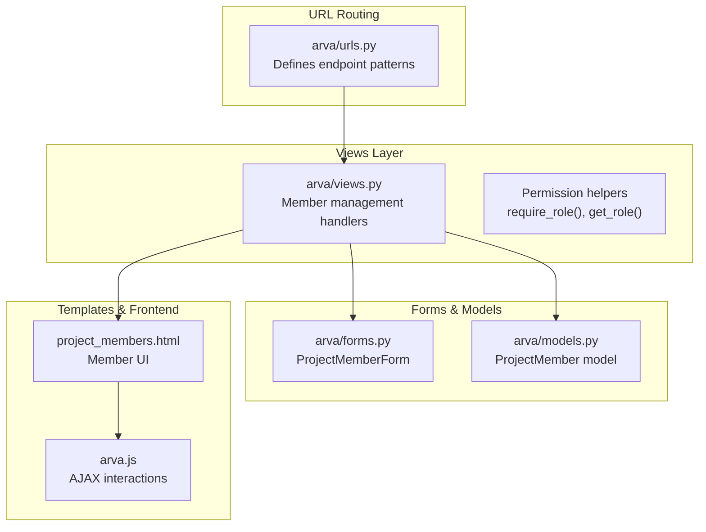
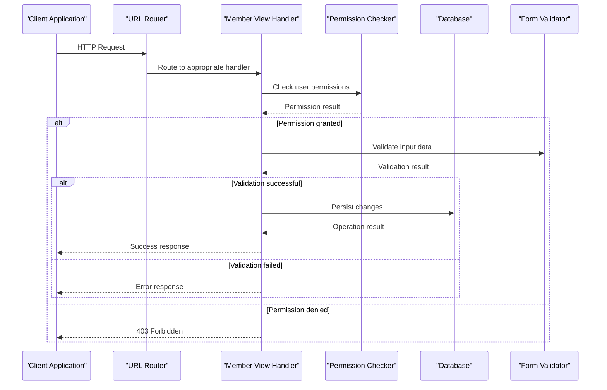
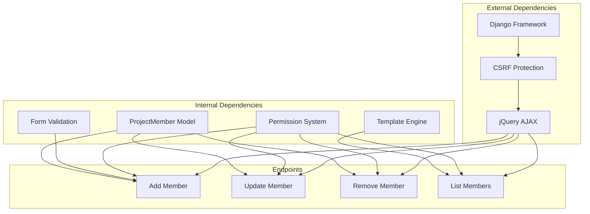

# Project Member Management

<cite>
**Referenced Files in This Document**
- [arva/views.py](file://arva/views.py)
- [arva/urls.py](file://arva/urls.py)
- [arva/models.py](file://arva/models.py)
- [arva/forms.py](file://arva/forms.py)
- [arva/templates/arva/project_members.html](file://arva/templates/arva/project_members.html)
- [arva/static/arva/js/arva.js](file://arva/static/arva/js/arva.js)
</cite>

## Table of Contents
1. [Introduction](#introduction)
2. [Project Structure](#project-structure)
3. [Core Components](#core-components)
4. [Architecture Overview](#architecture-overview)
5. [Detailed Component Analysis](#detailed-component-analysis)
6. [Dependency Analysis](#dependency-analysis)
7. [Performance Considerations](#performance-considerations)
8. [Troubleshooting Guide](#troubleshooting-guide)
9. [Conclusion](#conclusion)

## Introduction
This document provides comprehensive API documentation for project member management endpoints in the Kanban project. It covers adding members with user selection, updating member roles, removing members with confirmation prompts, and listing project members with role-based filtering. The documentation includes endpoint specifications, request/response formats, permission requirements, and member status management.

## Project Structure
The member management functionality spans several components:
- URL routing defines endpoint patterns
- Views handle business logic and permission checks
- Forms validate input data
- Templates render member management UI
- JavaScript handles client-side interactions and AJAX requests
- Models define the ProjectMember relationship



**Diagram sources**
- [arva/urls.py](file://arva/urls.py#L27-L32)
- [arva/views.py](file://arva/views.py#L1128-L1210)
- [arva/forms.py](file://arva/forms.py#L313-L326)
- [arva/models.py](file://arva/models.py#L211-L230)
- [arva/templates/arva/project_members.html](file://arva/templates/arva/project_members.html#L1-L184)
- [arva/static/arva/js/arva.js](file://arva/static/arva/js/arva.js#L2355-L2430)

**Section sources**
- [arva/urls.py](file://arva/urls.py#L27-L32)
- [arva/views.py](file://arva/views.py#L1128-L1210)
- [arva/forms.py](file://arva/forms.py#L313-L326)
- [arva/models.py](file://arva/models.py#L211-L230)
- [arva/templates/arva/project_members.html](file://arva/templates/arva/project_members.html#L1-L184)
- [arva/static/arva/js/arva.js](file://arva/static/arva/js/arva.js#L2355-L2430)

## Core Components
The member management system consists of four primary endpoints:

### Permission Model
The system uses a simplified permission model where:
- Project owners have full administrative rights
- Project members have limited access
- Role-based access control is deprecated in favor of project ownership

### Data Model
ProjectMember relationships are managed through the ProjectMember model with role enumeration supporting admin, member, and viewer roles.

**Section sources**
- [arva/views.py](file://arva/views.py#L91-L105)
- [arva/models.py](file://arva/models.py#L211-L230)

## Architecture Overview
The member management architecture follows a layered approach with clear separation of concerns:



**Diagram sources**
- [arva/urls.py](file://arva/urls.py#L27-L32)
- [arva/views.py](file://arva/views.py#L1145-L1174)
- [arva/views.py](file://arva/views.py#L1177-L1200)
- [arva/views.py](file://arva/views.py#L1202-L1210)

## Detailed Component Analysis

### Adding Members Endpoint
**Endpoint:** `POST /project/<int:pk>/members/add/`

#### Request Format
- **Method:** POST
- **Authentication:** Required (login required decorator)
- **Content-Type:** application/x-www-form-urlencoded or multipart/form-data
- **CSRF Token:** Required for form submissions

#### Request Parameters
| Parameter | Type | Description | Required |
|-----------|------|-------------|----------|
| `user` | integer | User ID to add as member | Yes |
| `role` | string | Member role (admin/member/viewer) | No (defaults to member) |

#### Response Format
- **Success:** Redirects to project members page
- **Validation Error:** Returns form with error details
- **Permission Error:** Returns 403 Forbidden

#### Business Logic
The endpoint validates:
1. User has admin privileges for the project
2. Target user is not the current user
3. User is not already a member
4. Form data is valid

#### Client-Side Integration
The frontend uses a modal form that submits via AJAX and handles CSRF tokens automatically.

**Section sources**
- [arva/views.py](file://arva/views.py#L1145-L1174)
- [arva/urls.py](file://arva/urls.py#L29)
- [arva/forms.py](file://arva/forms.py#L313-L326)
- [arva/templates/arva/project_members.html](file://arva/templates/arva/project_members.html#L123-L141)
- [arva/static/arva/js/arva.js](file://arva/static/arva/js/arva.js#L2355-L2374)

### Member Update Endpoint
**Endpoint:** `POST /project/member/<int:member_id>/update/`

#### Request Format
- **Method:** POST
- **Authentication:** Required
- **Content-Type:** application/x-www-form-urlencoded
- **CSRF Token:** Required

#### Request Parameters
| Parameter | Type | Description | Required |
|-----------|------|-------------|----------|
| `role` | string | New role value (admin/member/viewer) | Yes |

#### Response Format
```json
{
  "success": true,
  "role": "member"
}
```

#### Business Logic
The endpoint enforces:
1. Project owner/admin privileges
2. Prevents changing owner's role
3. Validates role transitions
4. Maintains minimum admin requirements

#### Client-Side Integration
Uses modal dialog with dropdown selection and AJAX submission.

**Section sources**
- [arva/views.py](file://arva/views.py#L1177-L1200)
- [arva/urls.py](file://arva/urls.py#L30)
- [arva/templates/arva/project_members.html](file://arva/templates/arva/project_members.html#L89-L108)
- [arva/static/arva/js/arva.js](file://arva/static/arva/js/arva.js#L2389-L2411)

### Member Removal Endpoint
**Endpoint:** `POST /project/member/<int:member_id>/delete/`

#### Request Format
- **Method:** POST
- **Authentication:** Required
- **Content-Type:** application/x-www-form-urlencoded
- **CSRF Token:** Required

#### Request Parameters
No parameters required (uses member_id from URL)

#### Response Format
```json
{
  "success": true
}
```

#### Business Logic
The endpoint:
1. Requires admin privileges
2. Allows member removal with confirmation
3. Updates project membership immediately

#### Client-Side Integration
Uses SweetAlert confirmation dialog before submission.

**Section sources**
- [arva/views.py](file://arva/views.py#L1202-L1210)
- [arva/urls.py](file://arva/urls.py#L31)
- [arva/templates/arva/project_members.html](file://arva/templates/arva/project_members.html#L99-L104)
- [arva/static/arva/js/arva.js](file://arva/static/arva/js/arva.js#L2414-L2430)

### Role Update Endpoint
**Endpoint:** `POST /project-member/<int:pm_id>/update-role/`

#### Request Format
- **Method:** POST
- **Authentication:** Required (superuser only)
- **Content-Type:** application/x-www-form-urlencoded

#### Request Parameters
| Parameter | Type | Description | Required |
|-----------|------|-------------|----------|
| `role` | string | New role value | Yes |

#### Response Format
```json
{
  "success": true
}
```

#### Business Logic
Deprecated role management system:
1. Superuser-only access
2. Role updates are deprecated
3. All memberships reset to member role

#### Client-Side Integration
Direct AJAX call from member management interface.

**Section sources**
- [arva/views.py](file://arva/views.py#L370-L379)
- [arva/urls.py](file://arva/urls.py#L77)
- [arva/static/arva/js/arva.js](file://arva/static/arva/js/arva.js#L2360-L2374)

### Member Removal Endpoint (Alternative)
**Endpoint:** `POST /project-member/<int:pm_id>/remove/`

#### Request Format
- **Method:** POST
- **Authentication:** Required (superuser only)
- **Content-Type:** application/x-www-form-urlencoded

#### Request Parameters
No parameters required (uses pm_id from URL)

#### Response Format
```json
{
  "success": true
}
```

#### Business Logic
Direct membership deletion without confirmation.

#### Client-Side Integration
Used in bulk operations and confirmation dialogs.

**Section sources**
- [arva/views.py](file://arva/views.py#L383-L391)
- [arva/urls.py](file://arva/urls.py#L78)
- [arva/static/arva/js/arva.js](file://arva/static/arva/js/arva.js#L2420-L2430)

### Project Member Listing
**Endpoint:** `GET /project/<int:pk>/members/`

#### Request Format
- **Method:** GET
- **Authentication:** Required
- **Content-Type:** text/html (default) or application/json (XHR)

#### Response Format
**HTML Response:**
Renders the member management page with:
- Owner information
- Member table with roles
- Add member form
- Role permission guide

**JSON Response (XHR):**
```json
{
  "success": true,
  "html": "<rendered HTML content>"
}
```

#### Filtering and Display
The interface supports:
- Role-based filtering
- User search capabilities
- Pagination for large member lists
- Real-time updates via AJAX

**Section sources**
- [arva/views.py](file://arva/views.py#L1128-L1142)
- [arva/urls.py](file://arva/urls.py#L28)
- [arva/templates/arva/project_members.html](file://arva/templates/arva/project_members.html#L75-L120)

## Dependency Analysis
The member management system has the following dependencies:



**Diagram sources**
- [arva/views.py](file://arva/views.py#L1145-L1210)
- [arva/forms.py](file://arva/forms.py#L313-L326)
- [arva/models.py](file://arva/models.py#L211-L230)
- [arva/templates/arva/project_members.html](file://arva/templates/arva/project_members.html#L1-L184)

**Section sources**
- [arva/views.py](file://arva/views.py#L1128-L1210)
- [arva/forms.py](file://arva/forms.py#L313-L326)
- [arva/models.py](file://arva/models.py#L211-L230)

## Performance Considerations
- **Database Queries:** Member operations use efficient queries with select_related and prefetch_related
- **Pagination:** Large member lists are paginated to prevent performance issues
- **AJAX Updates:** Frontend updates occur without full page reloads
- **Caching:** Minimal caching is used as member data changes frequently

## Troubleshooting Guide

### Common Issues and Solutions

#### Permission Denied Errors
**Symptoms:** 403 Forbidden responses when managing members
**Causes:**
- User is not project owner/admin
- Attempting to modify owner's role
- Using deprecated role management endpoints

**Solutions:**
- Verify user has admin privileges for the project
- Check project ownership status
- Use appropriate endpoints for member management

#### Validation Errors
**Symptoms:** Form validation failures when adding members
**Common Causes:**
- Duplicate member entries
- Self-addition attempts
- Invalid user IDs

**Solutions:**
- Ensure target user is not already a member
- Verify user exists and is active
- Check form field requirements

#### AJAX Request Failures
**Symptoms:** Frontend operations fail silently
**Causes:**
- Missing CSRF tokens
- Network connectivity issues
- JavaScript errors

**Solutions:**
- Verify CSRF token inclusion
- Check browser console for JavaScript errors
- Ensure jQuery and CSRF setup are working

**Section sources**
- [arva/views.py](file://arva/views.py#L1145-L1210)
- [arva/static/arva/js/arva.js](file://arva/static/arva/js/arva.js#L2355-L2430)

## Conclusion
The project member management system provides a comprehensive solution for team collaboration with clear permission boundaries and intuitive user interfaces. The API endpoints offer consistent behavior across different client contexts, while the frontend provides responsive interactions with proper validation and error handling. The system's design prioritizes simplicity through the deprecation of complex role-based access control in favor of straightforward project ownership models.