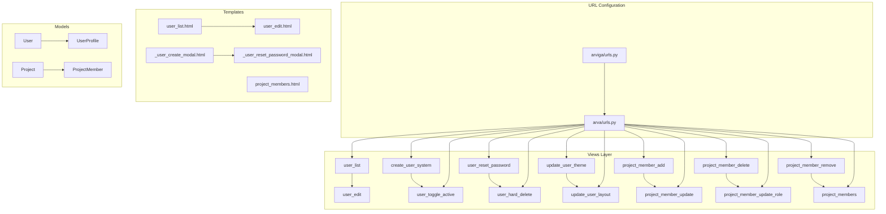
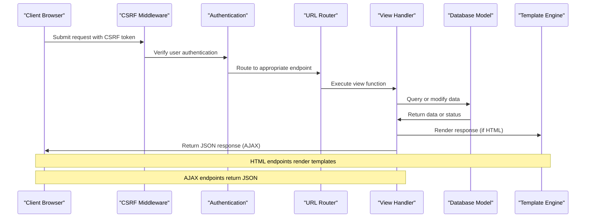
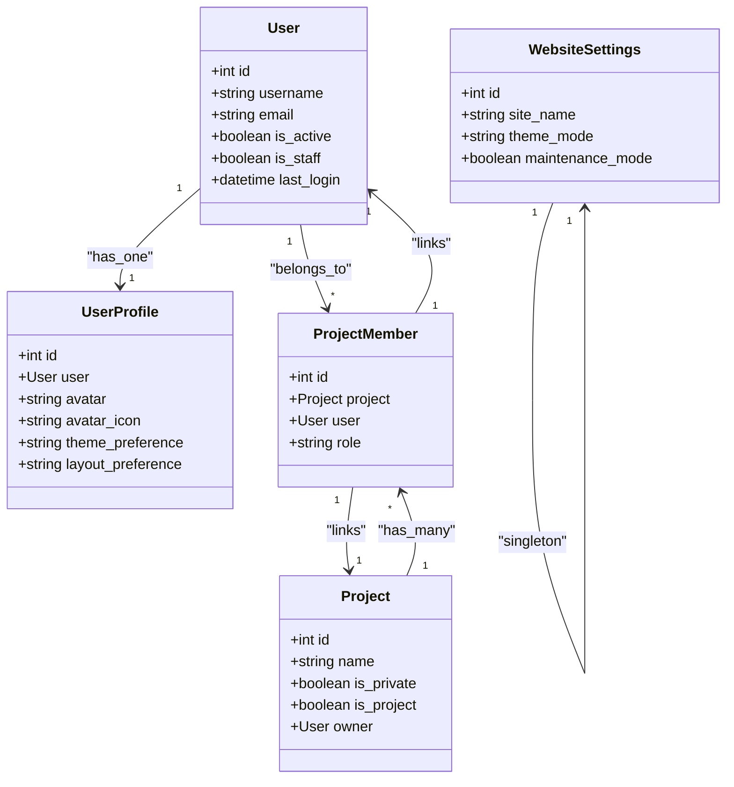

# User Management Endpoints

<cite>
**Referenced Files in This Document**
- [arva/urls.py](file://arva/urls.py)
- [arva/views.py](file://arva/views.py)
- [arva/models.py](file://arva/models.py)
- [arva/forms.py](file://arva/forms.py)
- [arva/templates/arva/user_list.html](file://arva/templates/arva/user_list.html)
- [arva/templates/arva/user_edit.html](file://arva/templates/arva/user_edit.html)
- [arva/templates/arva/user_settings.html](file://arva/templates/arva/user_settings.html)
- [arva/templates/arva/project_members.html](file://arva/templates/arva/project_members.html)
- [arva/templates/arva/_user_create_modal.html](file://arva/templates/arva/_user_create_modal.html)
- [arva/templates/arva/_user_reset_password_modal.html](file://arva/templates/arva/_user_reset_password_modal.html)
- [arviga/urls.py](file://arviga/urls.py)
- [static/arva/js/arva.js](file://static/arva/js/arva.js)
</cite>

## Table of Contents
1. [Introduction](#introduction)
2. [Project Structure](#project-structure)
3. [Core Components](#core-components)
4. [Architecture Overview](#architecture-overview)
5. [Detailed Component Analysis](#detailed-component-analysis)
6. [Dependency Analysis](#dependency-analysis)
7. [Performance Considerations](#performance-considerations)
8. [Troubleshooting Guide](#troubleshooting-guide)
9. [Conclusion](#conclusion)

## Introduction
This document provides comprehensive API documentation for user management endpoints in the Kanban project. It covers administrative user operations, project member management, and user settings endpoints. The documentation includes endpoint definitions, request/response formats, permission requirements, and administrative access patterns. All endpoints are implemented as Django views with CSRF protection and authentication decorators.

## Project Structure
The user management functionality is organized within the `arva` Django application, with URL routing defined in `arva/urls.py` and view implementations in `arva/views.py`. Frontend templates and JavaScript handlers coordinate user interactions and AJAX requests.



**Diagram sources**
- [arviga/urls.py](file://arviga/urls.py#L6-L10)
- [arva/urls.py](file://arva/urls.py#L5-L98)

**Section sources**
- [arviga/urls.py](file://arviga/urls.py#L1-L15)
- [arva/urls.py](file://arva/urls.py#L1-L98)

## Core Components
The user management system consists of several key components:

### Authentication and Authorization
- All endpoints require user authentication via `@login_required` decorator
- Administrative operations require superuser privileges (`request.user.is_superuser`)
- CSRF protection is enforced through Django's CSRF middleware and AJAX headers

### Data Models
The system uses Django's built-in User model with associated UserProfile for preferences:
- User model handles authentication and basic user information
- UserProfile stores theme and layout preferences
- ProjectMember manages user-project relationships

### Request/Response Patterns
- HTML forms for server-rendered pages
- JSON responses for AJAX endpoints
- Form validation with error reporting
- CSRF token handling for AJAX requests

**Section sources**
- [arva/views.py](file://arva/views.py#L1-L50)
- [arva/models.py](file://arva/models.py#L56-L100)

## Architecture Overview
The user management architecture follows Django's MVC pattern with clear separation of concerns:



**Diagram sources**
- [arva/views.py](file://arva/views.py#L1-L33)
- [arva/urls.py](file://arva/urls.py#L5-L98)

## Detailed Component Analysis

### User Administration Endpoints

#### User Listing Endpoint
**Endpoint:** `GET /users/`
**Purpose:** Retrieve and display all users with filtering capabilities

**Request Parameters:**
- `q` (optional): Search query for username or email

**Response Format:**
```json
{
  "users": [
    {
      "id": 1,
      "username": "john_doe",
      "email": "john@example.com",
      "is_active": true,
      "is_staff": false,
      "last_login": "2024-01-15T10:30:00Z",
      "date_joined": "2024-01-01",
      "last_activity_at": "2024-01-15T14:20:00Z"
    }
  ],
  "query": ""
}
```

**Permission Requirements:**
- Must be authenticated
- Must have superuser privileges

**Implementation Details:**
- Uses `@login_required` decorator
- Filters users by username or email using `icontains`
- Calculates last activity from multiple sources (comments, activities, logins)

**Section sources**
- [arva/urls.py](file://arva/urls.py#L71-L71)
- [arva/views.py](file://arva/views.py#L219-L245)
- [arva/templates/arva/user_list.html](file://arva/templates/arva/user_list.html#L1-L265)

#### User Creation Endpoint
**Endpoint:** `POST /users/create/`
**Purpose:** Create new users through administrative interface

**Request Format:**
```json
{
  "username": "string",
  "email": "string",
  "password": "string"
}
```

**Response Format:**
```json
{
  "success": true,
  "user": {
    "id": 1,
    "username": "john_doe",
    "email": "john@example.com"
  }
}
```

**Permission Requirements:**
- Must be authenticated
- Must have superuser privileges

**Validation Rules:**
- Username must be unique
- Email must be unique
- Password must meet Django's validation requirements

**Section sources**
- [arva/urls.py](file://arva/urls.py#L72-L72)
- [arva/views.py](file://arva/views.py#L247-L268)
- [arva/forms.py](file://arva/forms.py#L67-L85)

#### User Editing Endpoint
**Endpoint:** `GET /users/<int:user_id>/edit/`
**Purpose:** Display user edit form with profile and membership information

**Response Format:**
```json
{
  "user_obj": {
    "id": 1,
    "username": "john_doe",
    "email": "john@example.com",
    "is_active": true,
    "is_staff": false
  },
  "user_form": {
    "username": "string",
    "email": "string",
    "is_active": boolean,
    "is_staff": boolean
  },
  "avatar_form": {
    "avatar": "file",
    "avatar_icon": "string"
  },
  "memberships": [
    {
      "id": 1,
      "project": {
        "id": 1,
        "name": "Project Alpha"
      },
      "role": "member"
    }
  ],
  "last_seen": "2024-01-15T14:20:00Z"
}
```

**Permission Requirements:**
- Must be authenticated
- Must have superuser privileges

**Section sources**
- [arva/urls.py](file://arva/urls.py#L73-L73)
- [arva/views.py](file://arva/views.py#L270-L316)
- [arva/templates/arva/user_edit.html](file://arva/templates/arva/user_edit.html#L1-L155)

#### User Activation Toggle Endpoint
**Endpoint:** `POST /users/<int:user_id>/toggle-active/`
**Purpose:** Toggle user active/inactive status

**Request Format:**
```
Empty body (POST request)
```

**Response Format:**
```json
{
  "success": true,
  "is_active": true
}
```

**Permission Requirements:**
- Must be authenticated
- Must have superuser privileges

**Behavior:**
- Toggles the `is_active` field of the specified user
- Returns the new active status

**Section sources**
- [arva/urls.py](file://arva/urls.py#L74-L74)
- [arva/views.py](file://arva/views.py#L318-L331)

#### Password Reset Endpoint
**Endpoint:** `POST /users/<int:user_id>/reset-password/`
**Purpose:** Reset user password through administrative interface

**Request Format:**
```json
{
  "password": "string",
  "password_confirm": "string"
}
```

**Response Format:**
```json
{
  "success": true
}
```

**Permission Requirements:**
- Must be authenticated
- Must have superuser privileges

**Validation Rules:**
- Passwords must match
- Passwords must meet Django's validation requirements

**Section sources**
- [arva/urls.py](file://arva/urls.py#L75-L75)
- [arva/views.py](file://arva/views.py#L333-L348)
- [arva/forms.py](file://arva/forms.py#L110-L126)

#### User Deletion Endpoint
**Endpoint:** `POST /users/<int:user_id>/delete/`
**Purpose:** Permanently delete user accounts

**Request Format:**
```
Empty body (POST request)
```

**Response Format:**
```json
{
  "success": true
}
```

**Permission Requirements:**
- Must be authenticated
- Must have superuser privileges

**Security Restrictions:**
- Cannot delete own account
- Cannot delete other superusers

**Section sources**
- [arva/urls.py](file://arva/urls.py#L76-L76)
- [arva/views.py](file://arva/views.py#L350-L366)

### Project Member Management Endpoints

#### Add Project Member Endpoint
**Endpoint:** `POST /project/<int:pk>/members/add/`
**Purpose:** Add users to project membership

**Request Format:**
```json
{
  "user_id": 1,
  "role": "member"
}
```

**Response Format:**
```json
{
  "success": true,
  "member": {
    "id": 1,
    "user": {
      "id": 1,
      "username": "john_doe"
    },
    "role": "member"
  }
}
```

**Permission Requirements:**
- Must be authenticated
- Must have superuser privileges

**Section sources**
- [arva/urls.py](file://arva/urls.py#L29-L29)
- [arva/views.py](file://arva/views.py#L368-L391)

#### Update Project Member Endpoint
**Endpoint:** `POST /project/member/<int:member_id>/update/`
**Purpose:** Update project member role

**Request Format:**
```json
{
  "role": "member"
}
```

**Response Format:**
```json
{
  "success": true,
  "member": {
    "id": 1,
    "user": {
      "id": 1,
      "username": "john_doe"
    },
    "role": "member"
  }
}
```

**Permission Requirements:**
- Must be authenticated
- Must have superuser privileges

**Section sources**
- [arva/urls.py](file://arva/urls.py#L30-L30)
- [arva/views.py](file://arva/views.py#L368-L391)

#### Remove Project Member Endpoint
**Endpoint:** `POST /project/member/<int:member_id>/delete/`
**Purpose:** Remove user from project membership

**Request Format:**
```
Empty body (POST request)
```

**Response Format:**
```json
{
  "success": true
}
```

**Permission Requirements:**
- Must be authenticated
- Must have superuser privileges

**Section sources**
- [arva/urls.py](file://arva/urls.py#L31-L31)
- [arva/views.py](file://arva/views.py#L368-L391)

#### Update Project Member Role Endpoint
**Endpoint:** `POST /project-member/<int:pm_id>/update-role/`
**Purpose:** Update project member role (deprecated role system)

**Request Format:**
```json
{
  "role": "member"
}
```

**Response Format:**
```json
{
  "success": true
}
```

**Permission Requirements:**
- Must be authenticated
- Must have superuser privileges

**Note:** Role updates are deprecated; memberships are maintained as simple project sharing.

**Section sources**
- [arva/urls.py](file://arva/urls.py#L77-L77)
- [arva/views.py](file://arva/views.py#L368-L391)

#### Remove Project Member Endpoint (Alternative)
**Endpoint:** `POST /project-member/<int:pm_id>/remove/`
**Purpose:** Remove project member using project-member URL pattern

**Request Format:**
```
Empty body (POST request)
```

**Response Format:**
```json
{
  "success": true
}
```

**Permission Requirements:**
- Must be authenticated
- Must have superuser privileges

**Section sources**
- [arva/urls.py](file://arva/urls.py#L78-L78)
- [arva/views.py](file://arva/views.py#L381-L391)

### User Settings Endpoints

#### Update Theme Preference Endpoint
**Endpoint:** `POST /profile/theme/update/`
**Purpose:** Update user theme preference

**Request Format:**
```json
{
  "theme": "inherit|light|dark|auto"
}
```

**Response Format:**
```json
{
  "success": true
}
```

**Permission Requirements:**
- Must be authenticated

**Validation Rules:**
- Theme must be one of: inherit, light, dark, auto

**Section sources**
- [arva/urls.py](file://arva/urls.py#L83-L83)
- [arva/views.py](file://arva/views.py#L190-L202)
- [arva/models.py](file://arva/models.py#L57-L88)

#### Update Layout Preference Endpoint
**Endpoint:** `POST /profile/layout/update/`
**Purpose:** Update user layout preference

**Request Format:**
```json
{
  "layout": "sidebar|classic"
}
```

**Response Format:**
```json
{
  "success": true,
  "layout": "sidebar|classic"
}
```

**Permission Requirements:**
- Must be authenticated

**Validation Rules:**
- Layout must be one of: sidebar, classic

**Section sources**
- [arva/urls.py](file://arva/urls.py#L84-L84)
- [arva/views.py](file://arva/views.py#L204-L216)
- [arva/models.py](file://arva/models.py#L68-L88)

## Dependency Analysis



**Diagram sources**
- [arva/models.py](file://arva/models.py#L56-L230)

**Section sources**
- [arva/models.py](file://arva/models.py#L1-L445)

## Performance Considerations
- User queries use `select_related` and `prefetch_related` to minimize database queries
- Pagination is implemented for user listings
- Last activity calculations aggregate multiple data sources efficiently
- Template rendering uses optimized querysets with annotations

## Troubleshooting Guide

### Common Error Scenarios

**Authentication Issues:**
- Non-authenticated users receive redirect to login page
- Superuser privileges required for administrative endpoints

**Validation Errors:**
- Username/email uniqueness violations
- Password confirmation mismatches
- Invalid theme/layout values

**Permission Denied:**
- Non-superusers cannot access administrative endpoints
- Cannot delete own account or other superusers

### Error Response Formats
```json
{
  "success": false,
  "error": "string",
  "errors": {
    "field": ["error messages"]
  }
}
```

**Section sources**
- [arva/views.py](file://arva/views.py#L247-L268)
- [arva/views.py](file://arva/views.py#L318-L366)
- [arva/views.py](file://arva/views.py#L381-L391)

## Conclusion
The user management system provides comprehensive administrative capabilities with clear permission boundaries and robust validation. The architecture supports both traditional HTML forms and modern AJAX interactions, ensuring flexibility for different client needs. All endpoints follow Django's security best practices with proper authentication, authorization, and CSRF protection.