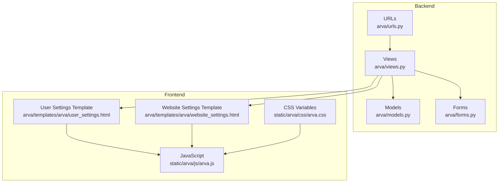
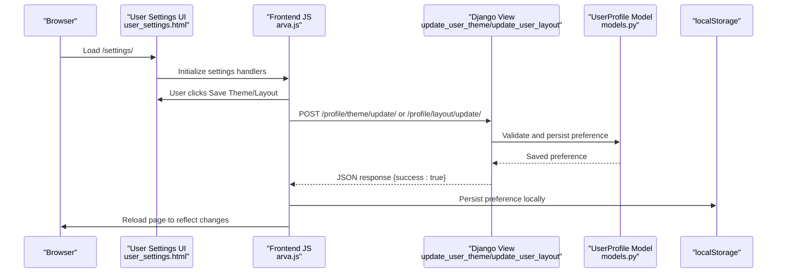
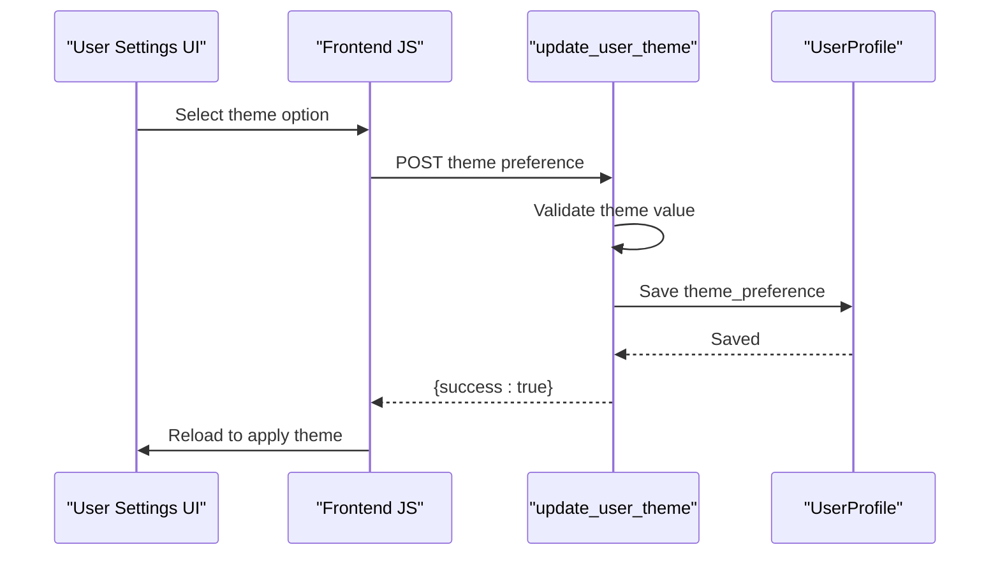
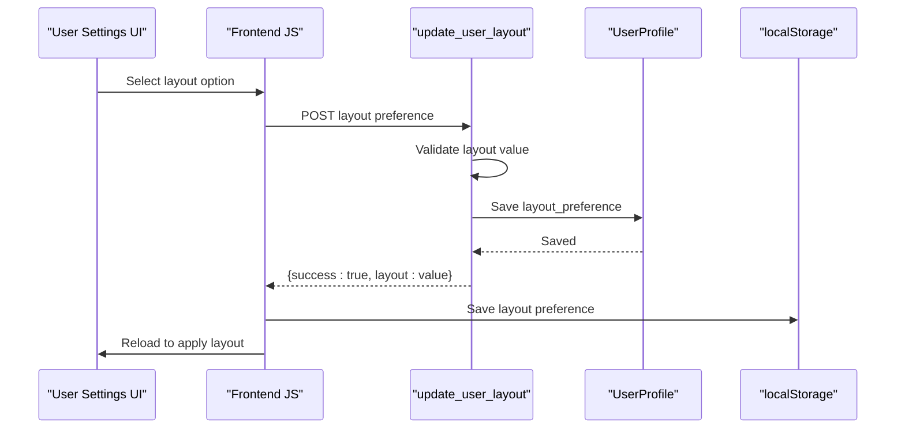
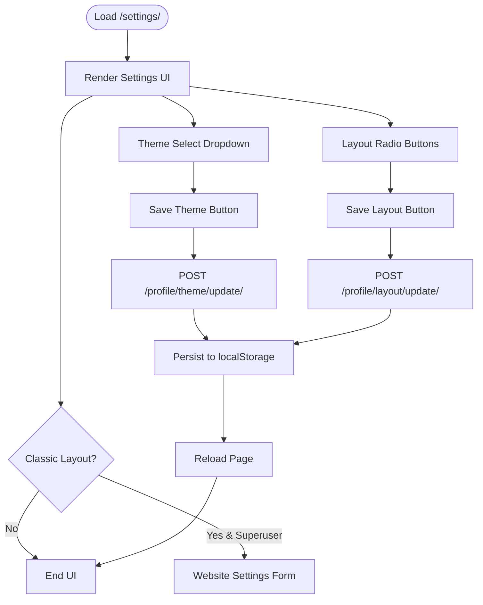
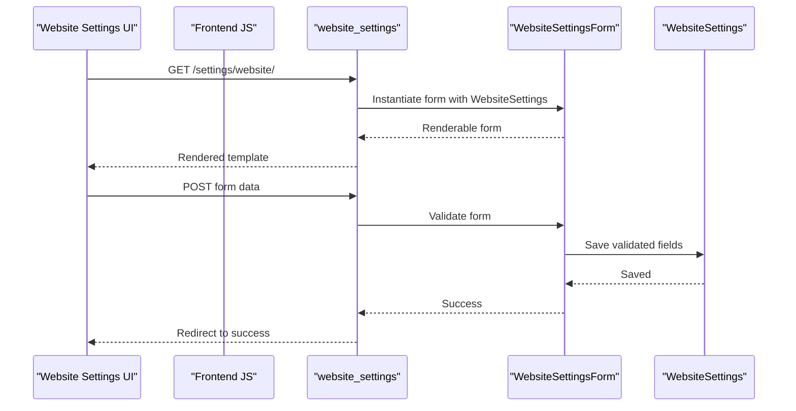
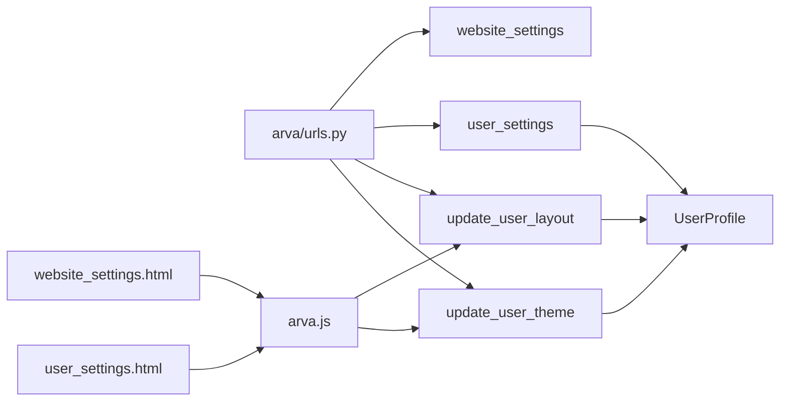

# User Settings Endpoints

<cite>
**Referenced Files in This Document**
- [arva/views.py](file://arva/views.py)
- [arva/urls.py](file://arva/urls.py)
- [arva/models.py](file://arva/models.py)
- [arva/templates/arva/user_settings.html](file://arva/templates/arva/user_settings.html)
- [arva/templates/arva/website_settings.html](file://arva/templates/arva/website_settings.html)
- [arva/forms.py](file://arva/forms.py)
- [static/arva/js/arva.js](file://static/arva/js/arva.js)
- [static/arva/css/arva.css](file://static/arva/css/arva.css)
</cite>

## Table of Contents
1. [Introduction](#introduction)
2. [Project Structure](#project-structure)
3. [Core Components](#core-components)
4. [Architecture Overview](#architecture-overview)
5. [Detailed Component Analysis](#detailed-component-analysis)
6. [Dependency Analysis](#dependency-analysis)
7. [Performance Considerations](#performance-considerations)
8. [Troubleshooting Guide](#troubleshooting-guide)
9. [Conclusion](#conclusion)

## Introduction
This document provides comprehensive API documentation for user settings management endpoints. It covers:
- Theme update endpoint for light/dark/auto mode switching and persistence
- Layout update endpoint for sidebar/classic layout options
- User preferences management within the unified settings page
- Request/response schemas, validation rules, and session-based preference storage
- Default value handling, preference inheritance, and user interface synchronization

## Project Structure
The user settings functionality spans backend Django views, URL routing, models, templates, and frontend JavaScript/CSS. The key components are organized as follows:
- Backend: Views handle theme and layout updates, user settings rendering, and website settings
- Frontend: Templates render the settings UI; JavaScript handles AJAX requests and UI synchronization
- Models: User profile stores theme and layout preferences
- Forms: Website settings form for administrative configuration

**Diagram sources**
- [arva/views.py](file://arva/views.py#L136-L216)
- [arva/urls.py](file://arva/urls.py#L80-L84)
- [arva/models.py](file://arva/models.py#L56-L100)
- [arva/forms.py](file://arva/forms.py#L21-L48)
- [arva/templates/arva/user_settings.html](file://arva/templates/arva/user_settings.html#L10-L59)
- [arva/templates/arva/website_settings.html](file://arva/templates/arva/website_settings.html#L87-L149)
- [static/arva/js/arva.js](file://static/arva/js/arva.js#L694-L778)
- [static/arva/css/arva.css](file://static/arva/css/arva.css#L1-L200)

**Section sources**
- [arva/views.py](file://arva/views.py#L136-L216)
- [arva/urls.py](file://arva/urls.py#L80-L84)
- [arva/models.py](file://arva/models.py#L56-L100)
- [arva/forms.py](file://arva/forms.py#L21-L48)
- [arva/templates/arva/user_settings.html](file://arva/templates/arva/user_settings.html#L10-L59)
- [arva/templates/arva/website_settings.html](file://arva/templates/arva/website_settings.html#L87-L149)
- [static/arva/js/arva.js](file://static/arva/js/arva.js#L694-L778)
- [static/arva/css/arva.css](file://static/arva/css/arva.css#L1-L200)

## Core Components
- Theme update endpoint: POST `/profile/theme/update/` updates user theme preference
- Layout update endpoint: POST `/profile/layout/update/` updates user layout preference
- Unified settings page: GET `/settings/` renders user preferences UI
- Website settings page: GET `/settings/website/` renders website-wide configuration (Classic Layout)

Validation rules:
- Theme values: "inherit", "light", "dark", "auto"
- Layout values: "sidebar", "classic"
- CSRF protection enforced via hidden token and X-CSRFToken header

Persistence:
- User preferences stored in UserProfile model
- Session-based UI synchronization via localStorage

**Section sources**
- [arva/views.py](file://arva/views.py#L190-L216)
- [arva/urls.py](file://arva/urls.py#L83-L84)
- [arva/models.py](file://arva/models.py#L75-L88)
- [arva/templates/arva/user_settings.html](file://arva/templates/arva/user_settings.html#L24-L56)
- [static/arva/js/arva.js](file://static/arva/js/arva.js#L694-L748)

## Architecture Overview
The user settings architecture integrates frontend and backend components to provide seamless preference management.

**Diagram sources**
- [arva/templates/arva/user_settings.html](file://arva/templates/arva/user_settings.html#L10-L59)
- [static/arva/js/arva.js](file://static/arva/js/arva.js#L694-L748)
- [arva/views.py](file://arva/views.py#L190-L216)
- [arva/models.py](file://arva/models.py#L75-L88)

## Detailed Component Analysis

### Theme Update Endpoint
- Endpoint: POST `/profile/theme/update/`
- Purpose: Update user theme preference (inherit/light/dark/auto)
- Request payload:
  - theme: string (one of "inherit", "light", "dark", "auto")
- Response:
  - Success: 200 OK with JSON {success: true}
  - Validation error: 400 Bad Request with JSON {"success": false, "error": "Invalid theme"}

Validation and persistence:
- Backend validates theme against allowed values
- Persists to UserProfile.theme_preference
- Frontend reloads to apply changes

**Diagram sources**
- [arva/views.py](file://arva/views.py#L190-L202)
- [arva/models.py](file://arva/models.py#L79-L83)
- [static/arva/js/arva.js](file://static/arva/js/arva.js#L729-L747)

**Section sources**
- [arva/views.py](file://arva/views.py#L190-L202)
- [arva/urls.py](file://arva/urls.py#L83-L83)
- [arva/models.py](file://arva/models.py#L79-L83)
- [arva/templates/arva/user_settings.html](file://arva/templates/arva/user_settings.html#L48-L56)
- [static/arva/js/arva.js](file://static/arva/js/arva.js#L729-L747)

### Layout Update Endpoint
- Endpoint: POST `/profile/layout/update/`
- Purpose: Update user layout preference (sidebar/classic)
- Request payload:
  - layout: string (one of "sidebar", "classic")
- Response:
  - Success: 200 OK with JSON {"success": true, "layout": "<value>"}
  - Validation error: 400 Bad Request with JSON {"success": false, "error": "Invalid layout"}

Validation and persistence:
- Backend validates layout against allowed values
- Persists to UserProfile.layout_preference
- Frontend saves to localStorage and reloads

**Diagram sources**
- [arva/views.py](file://arva/views.py#L204-L216)
- [arva/models.py](file://arva/models.py#L84-L88)
- [static/arva/js/arva.js](file://static/arva/js/arva.js#L707-L727)

**Section sources**
- [arva/views.py](file://arva/views.py#L204-L216)
- [arva/urls.py](file://arva/urls.py#L84-L84)
- [arva/models.py](file://arva/models.py#L84-L88)
- [arva/templates/arva/user_settings.html](file://arva/templates/arva/user_settings.html#L26-L41)
- [static/arva/js/arva.js](file://static/arva/js/arva.js#L707-L727)

### User Preferences Management
- Unified settings page: GET `/settings/`
- Renders:
  - Layout preferences with radio buttons for "sidebar" and "classic"
  - Theme preferences with select for "inherit", "light", "dark", "auto"
  - Website settings section for Classic Layout (superuser only)
- CSRF protection: Hidden input field and X-CSRFToken header
- UI synchronization: Frontend persists preferences to localStorage and reloads

**Diagram sources**
- [arva/views.py](file://arva/views.py#L136-L160)
- [arva/templates/arva/user_settings.html](file://arva/templates/arva/user_settings.html#L10-L157)
- [static/arva/js/arva.js](file://static/arva/js/arva.js#L694-L748)

**Section sources**
- [arva/views.py](file://arva/views.py#L136-L160)
- [arva/urls.py](file://arva/urls.py#L82-L82)
- [arva/templates/arva/user_settings.html](file://arva/templates/arva/user_settings.html#L10-L157)
- [static/arva/js/arva.js](file://static/arva/js/arva.js#L694-L748)

### Website Settings (Classic Layout)
- Endpoint: GET `/settings/website/`
- Purpose: Administrative configuration of website-wide settings
- Available fields (via WebsiteSettingsForm):
  - Site name, support email, footer text
  - Logo, favicon
  - Theme mode (light/dark/auto), primary color, text color, navbar/body backgrounds
  - Maintenance mode toggle
  - Custom CSS
- Access control: Requires superuser privileges

**Diagram sources**
- [arva/views.py](file://arva/views.py#L162-L188)
- [arva/forms.py](file://arva/forms.py#L21-L48)
- [arva/templates/arva/website_settings.html](file://arva/templates/arva/website_settings.html#L87-L149)
- [static/arva/js/arva.js](file://static/arva/js/arva.js#L750-L778)

**Section sources**
- [arva/views.py](file://arva/views.py#L162-L188)
- [arva/urls.py](file://arva/urls.py#L83-L83)
- [arva/forms.py](file://arva/forms.py#L21-L48)
- [arva/templates/arva/website_settings.html](file://arva/templates/arva/website_settings.html#L87-L149)
- [static/arva/js/arva.js](file://static/arva/js/arva.js#L750-L778)

## Dependency Analysis
The user settings endpoints depend on:
- URL routing for endpoint exposure
- Authentication decorators for session-based access
- CSRF enforcement for secure requests
- Model persistence for user preferences
- Frontend JavaScript for AJAX and UI synchronization

**Diagram sources**
- [arva/urls.py](file://arva/urls.py#L80-L84)
- [arva/views.py](file://arva/views.py#L136-L216)
- [arva/models.py](file://arva/models.py#L75-L88)
- [arva/templates/arva/user_settings.html](file://arva/templates/arva/user_settings.html#L10-L59)
- [arva/templates/arva/website_settings.html](file://arva/templates/arva/website_settings.html#L87-L149)
- [static/arva/js/arva.js](file://static/arva/js/arva.js#L694-L748)

**Section sources**
- [arva/urls.py](file://arva/urls.py#L80-L84)
- [arva/views.py](file://arva/views.py#L136-L216)
- [arva/models.py](file://arva/models.py#L75-L88)
- [arva/templates/arva/user_settings.html](file://arva/templates/arva/user_settings.html#L10-L59)
- [arva/templates/arva/website_settings.html](file://arva/templates/arva/website_settings.html#L87-L149)
- [static/arva/js/arva.js](file://static/arva/js/arva.js#L694-L748)

## Performance Considerations
- Minimal database writes: Theme and layout updates are single-field saves
- Lightweight JSON responses: No heavy payloads for preference updates
- Frontend caching: localStorage reduces repeated server requests
- CSS variable-based theming: Efficient client-side theme switching without full page reloads

## Troubleshooting Guide
Common issues and resolutions:
- Invalid theme/layout values: Ensure values match allowed options ("inherit"/"light"/"dark"/"auto" for theme; "sidebar"/"classic" for layout)
- CSRF failures: Verify hidden CSRF token and X-CSRFToken header are present
- Permission errors: Website settings require superuser privileges
- Frontend not applying changes: Confirm localStorage keys and page reload behavior

**Section sources**
- [arva/views.py](file://arva/views.py#L190-L216)
- [arva/templates/arva/user_settings.html](file://arva/templates/arva/user_settings.html#L24-L56)
- [static/arva/js/arva.js](file://static/arva/js/arva.js#L694-L748)

## Conclusion
The user settings endpoints provide a robust, secure, and efficient mechanism for managing user preferences. They integrate seamlessly with Django's authentication and CSRF protection while offering responsive frontend behavior through AJAX and localStorage. The design supports both individual user preferences and website-wide configuration, with clear validation and persistence patterns.