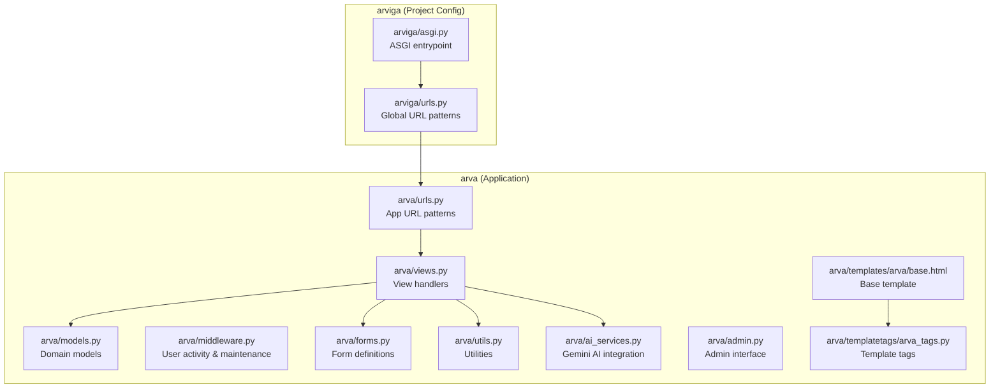
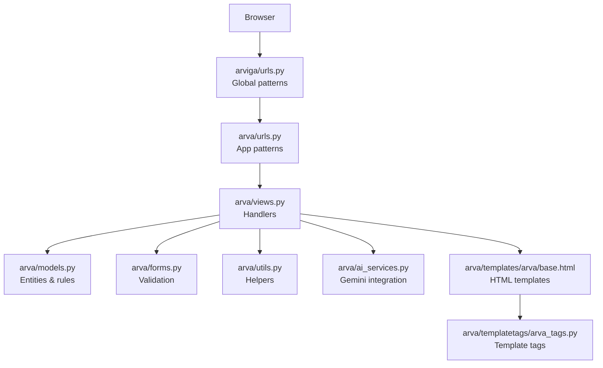
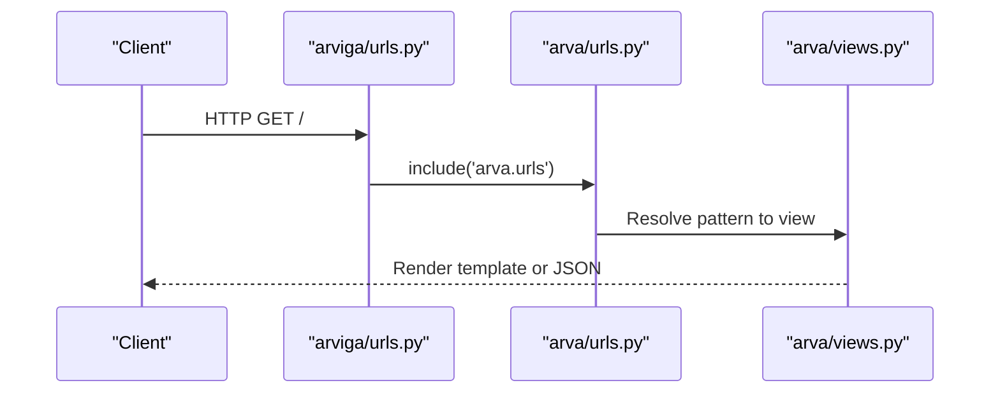
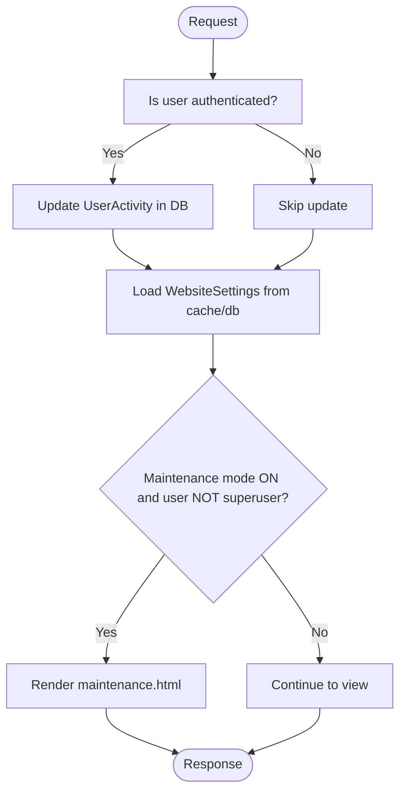
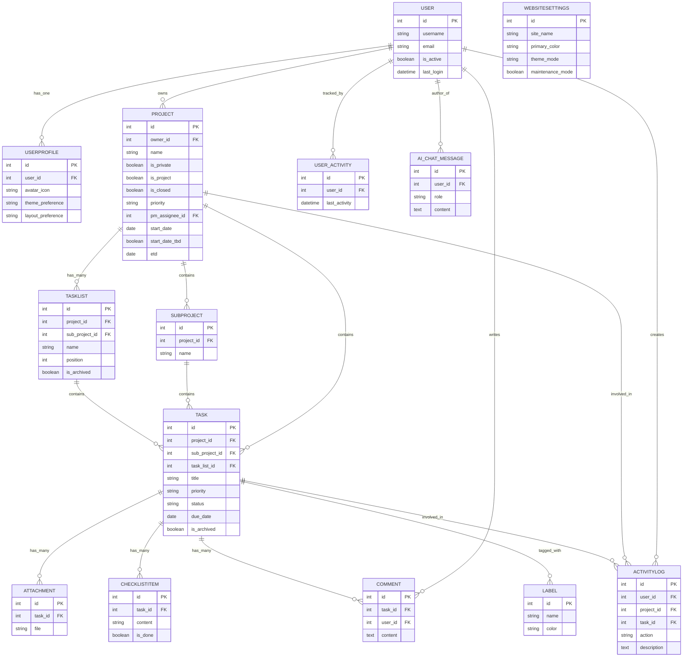
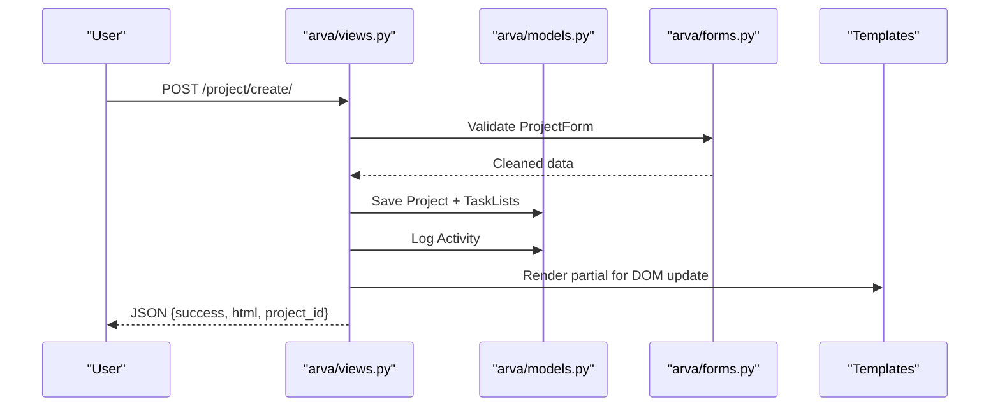
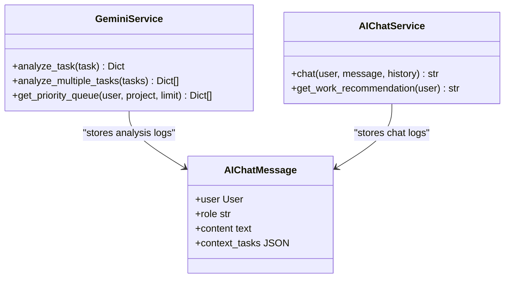
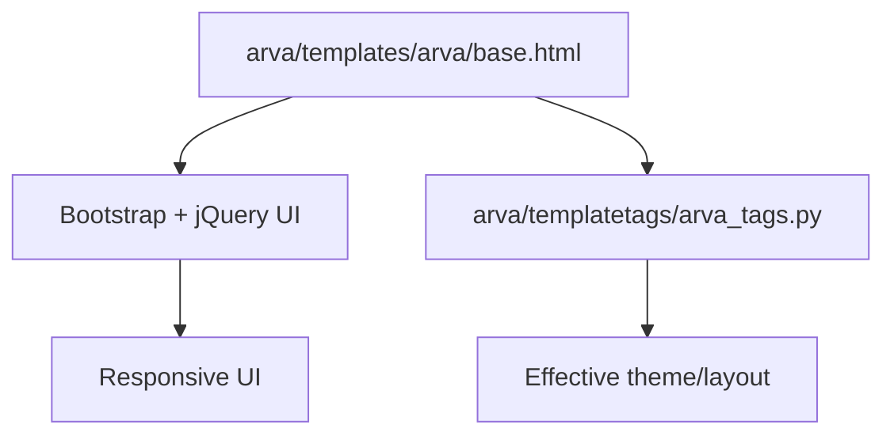
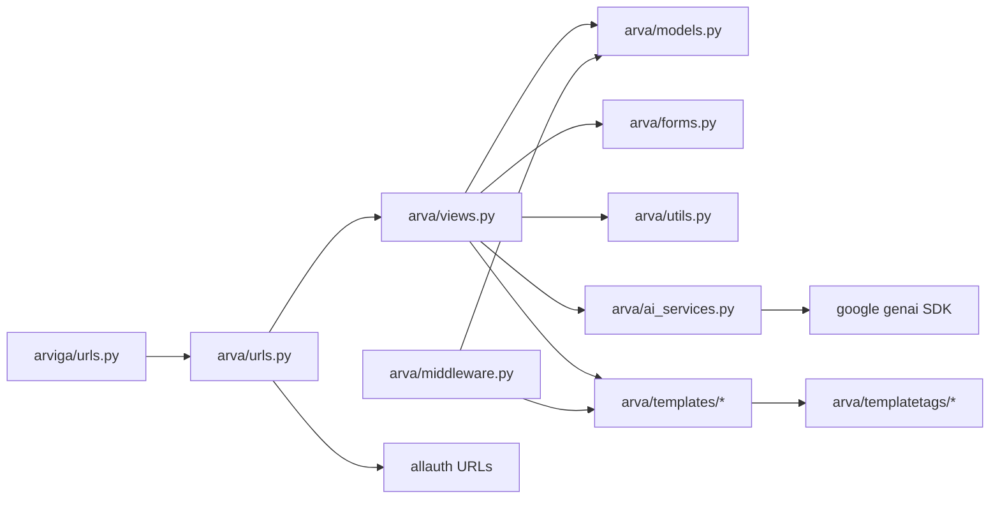

# Architecture Overview

<cite>
**Referenced Files in This Document**
- [arviga/urls.py](file://arviga/urls.py)
- [arva/urls.py](file://arva/urls.py)
- [arva/views.py](file://arva/views.py)
- [arva/models.py](file://arva/models.py)
- [arva/middleware.py](file://arva/middleware.py)
- [arva/apps.py](file://arva/apps.py)
- [arva/forms.py](file://arva/forms.py)
- [arva/utils.py](file://arva/utils.py)
- [arva/ai_services.py](file://arva/ai_services.py)
- [arva/admin.py](file://arva/admin.py)
- [arva/templates/arva/base.html](file://arva/templates/arva/base.html)
- [arva/templatetags/arva_tags.py](file://arva/templatetags/arva_tags.py)
- [arviga/asgi.py](file://arviga/asgi.py)
</cite>

## Table of Contents
1. [Introduction](#introduction)
2. [Project Structure](#project-structure)
3. [Core Components](#core-components)
4. [Architecture Overview](#architecture-overview)
5. [Detailed Component Analysis](#detailed-component-analysis)
6. [Dependency Analysis](#dependency-analysis)
7. [Performance Considerations](#performance-considerations)
8. [Troubleshooting Guide](#troubleshooting-guide)
9. [Conclusion](#conclusion)
10. [Appendices](#appendices)

## Introduction
This document describes the Arva Kanban system architecture built on Django. It explains how the system implements the Model-View-Controller (MVC) pattern, how URLs route requests to views, how middleware enforces policies, and how templates separate presentation from backend logic. It also documents integrations with external services (Google OAuth via allauth and Gemini AI), separation of concerns between frontend templates and backend logic, and infrastructure and scalability considerations.

## Project Structure
The project is organized into two primary packages:
- arviga: Django project configuration and ASGI entrypoint
- arva: The main application module containing models, views, URLs, templates, forms, middleware, and AI services

Key structural elements:
- URL routing is split between arviga (global) and arva (application routes)
- Templates are organized under arva/templates/arva with reusable partials
- Static assets (CSS/JS) are served via Django’s staticfiles mechanism
- Middleware enforces user activity tracking and maintenance mode
- AI services integrate with Google Gemini for priority analysis and chat assistance

**Diagram sources**
- [arviga/urls.py](file://arviga/urls.py#L1-L15)
- [arva/urls.py](file://arva/urls.py#L1-L98)
- [arva/views.py](file://arva/views.py#L1-L200)
- [arva/models.py](file://arva/models.py#L1-L120)
- [arva/middleware.py](file://arva/middleware.py#L1-L39)
- [arva/forms.py](file://arva/forms.py#L1-L120)
- [arva/utils.py](file://arva/utils.py#L1-L29)
- [arva/ai_services.py](file://arva/ai_services.py#L1-L120)
- [arva/admin.py](file://arva/admin.py#L1-L50)
- [arva/templates/arva/base.html](file://arva/templates/arva/base.html#L1-L60)
- [arva/templatetags/arva_tags.py](file://arva/templatetags/arva_tags.py#L1-L34)
- [arviga/asgi.py](file://arviga/asgi.py#L1-L6)

**Section sources**
- [arviga/urls.py](file://arviga/urls.py#L1-L15)
- [arva/urls.py](file://arva/urls.py#L1-L98)
- [arva/templates/arva/base.html](file://arva/templates/arva/base.html#L1-L60)

## Core Components
- Models: Define the domain entities (Project, Task, User, ActivityLog, etc.) and relationships. They encapsulate business rules and computed properties.
- Views: Handle HTTP requests, enforce permissions, orchestrate model operations, and render templates or JSON responses.
- Forms: Encapsulate validation and presentation logic for model-backed forms.
- Templates: Provide HTML rendering with Bootstrap and jQuery UI for responsive UI and drag-and-drop.
- Middleware: Enforce user activity tracking and maintenance mode.
- AI Services: Integrate with Google Gemini for priority analysis and chat assistance.
- Admin: Expose CRUD interfaces for models in Django admin.

**Section sources**
- [arva/models.py](file://arva/models.py#L100-L220)
- [arva/views.py](file://arva/views.py#L390-L470)
- [arva/forms.py](file://arva/forms.py#L135-L195)
- [arva/templates/arva/base.html](file://arva/templates/arva/base.html#L13-L25)
- [arva/middleware.py](file://arva/middleware.py#L7-L39)
- [arva/ai_services.py](file://arva/ai_services.py#L11-L22)
- [arva/admin.py](file://arva/admin.py#L8-L50)

## Architecture Overview
The system follows a layered MVC architecture:
- Model: Domain entities and business logic
- View: Request handlers that delegate to models and render templates or JSON
- Controller: Not a separate layer; views act as controllers by handling routing and orchestrating responses
- Template: Presentation layer with Bootstrap and jQuery UI
- Middleware: Cross-cutting concerns like user activity and maintenance mode
- External Integrations: Google OAuth (allauth) and Gemini AI

**Diagram sources**
- [arviga/urls.py](file://arviga/urls.py#L6-L10)
- [arva/urls.py](file://arva/urls.py#L5-L97)
- [arva/views.py](file://arva/views.py#L1-L120)
- [arva/models.py](file://arva/models.py#L100-L220)
- [arva/forms.py](file://arva/forms.py#L135-L195)
- [arva/utils.py](file://arva/utils.py#L1-L29)
- [arva/ai_services.py](file://arva/ai_services.py#L11-L22)
- [arva/templates/arva/base.html](file://arva/templates/arva/base.html#L1-L60)
- [arva/templatetags/arva_tags.py](file://arva/templatetags/arva_tags.py#L1-L34)

## Detailed Component Analysis

### URL Routing System
- Global routing (arviga/urls.py) defines admin, app inclusion, and social accounts.
- Application routing (arva/urls.py) defines all Kanban endpoints including projects, tasks, comments, attachments, checklists, users, settings, and AI features.

**Diagram sources**
- [arviga/urls.py](file://arviga/urls.py#L6-L10)
- [arva/urls.py](file://arva/urls.py#L5-L97)

**Section sources**
- [arviga/urls.py](file://arviga/urls.py#L1-L15)
- [arva/urls.py](file://arva/urls.py#L1-L98)

### Middleware Configuration
- LastActivityMiddleware updates user activity timestamps periodically and persists them.
- MaintenanceModeMiddleware checks WebsiteSettings and renders maintenance.html for non-superusers.

**Diagram sources**
- [arva/middleware.py](file://arva/middleware.py#L7-L39)

**Section sources**
- [arva/middleware.py](file://arva/middleware.py#L1-L39)

### Data Models and Relationships
The models define the core domain:
- Project, SubProject, TaskList, Task, Label, Comment, Attachment, ChecklistItem, ActivityLog, UserProfile, UserActivity, WebsiteSettings, AIChatMessage
- Relationships and constraints are enforced via foreign keys and model-level validation.

**Diagram sources**
- [arva/models.py](file://arva/models.py#L15-L445)

**Section sources**
- [arva/models.py](file://arva/models.py#L15-L445)

### Views and Controllers
Views handle:
- Authentication and authorization helpers
- Project and task CRUD operations
- Member management
- Comments, attachments, and checklists
- User settings and preferences
- AI priority queue and chat assistant
- JSON APIs for AJAX interactions

**Diagram sources**
- [arva/views.py](file://arva/views.py#L477-L500)
- [arva/forms.py](file://arva/forms.py#L135-L195)
- [arva/models.py](file://arva/models.py#L101-L127)

**Section sources**
- [arva/views.py](file://arva/views.py#L394-L526)
- [arva/forms.py](file://arva/forms.py#L135-L195)
- [arva/models.py](file://arva/models.py#L101-L127)

### AI Integration (Gemini)
The AI services module integrates with Google Gemini:
- Priority analysis: Builds task context, constructs prompts, and parses JSON responses
- Chat assistant: Provides contextual recommendations and maintains conversation history
- Factory functions return configured service instances

**Diagram sources**
- [arva/ai_services.py](file://arva/ai_services.py#L11-L22)
- [arva/ai_services.py](file://arva/ai_services.py#L196-L207)
- [arva/models.py](file://arva/models.py#L430-L445)

**Section sources**
- [arva/ai_services.py](file://arva/ai_services.py#L11-L22)
- [arva/ai_services.py](file://arva/ai_services.py#L196-L207)
- [arva/models.py](file://arva/models.py#L430-L445)

### Frontend Separation and Responsive Design
- Base template loads Bootstrap and jQuery UI for responsive layout and drag-and-drop.
- Template tags compute effective theme and layout preferences.
- Static assets are served via Django’s staticfiles.

**Diagram sources**
- [arva/templates/arva/base.html](file://arva/templates/arva/base.html#L13-L25)
- [arva/templatetags/arva_tags.py](file://arva/templatetags/arva_tags.py#L6-L27)

**Section sources**
- [arva/templates/arva/base.html](file://arva/templates/arva/base.html#L1-L60)
- [arva/templatetags/arva_tags.py](file://arva/templatetags/arva_tags.py#L1-L34)

## Dependency Analysis
- arviga/urls.py depends on arva/urls.py and allauth URLs for authentication.
- arva/views.py depends on models, forms, utils, and ai_services.
- arva/middleware.py depends on models and cache.
- arva/templates depend on templatetags and static assets.
- External dependencies: allauth for OAuth, google genai SDK for Gemini.

**Diagram sources**
- [arviga/urls.py](file://arviga/urls.py#L6-L10)
- [arva/urls.py](file://arva/urls.py#L1-L10)
- [arva/views.py](file://arva/views.py#L1-L32)
- [arva/middleware.py](file://arva/middleware.py#L1-L6)
- [arva/ai_services.py](file://arva/ai_services.py#L6-L8)

**Section sources**
- [arviga/urls.py](file://arviga/urls.py#L1-L15)
- [arva/urls.py](file://arva/urls.py#L1-L10)
- [arva/views.py](file://arva/views.py#L1-L32)
- [arva/middleware.py](file://arva/middleware.py#L1-L6)
- [arva/ai_services.py](file://arva/ai_services.py#L6-L8)

## Performance Considerations
- Database queries: Views use select_related and prefetch_related to minimize N+1 queries.
- Pagination: Views implement pagination for large datasets.
- Middleware caching: WebsiteSettings cached to reduce DB hits.
- Asynchronous email: EmailThread runs in background to avoid blocking requests.
- Static assets: Bootstrap and jQuery UI loaded from CDN/static bundles.

[No sources needed since this section provides general guidance]

## Troubleshooting Guide
Common areas to inspect:
- Authentication failures: Verify allauth URLs and login/logout views.
- Permission errors: Review require_role and get_role helpers in views.
- Maintenance mode: Confirm WebsiteSettings maintenance flag and user permissions.
- AI integration: Ensure GEMINI_API_KEY is configured and GeminiService initialization succeeds.
- Email delivery: Check EmailThread usage and mail server configuration.

**Section sources**
- [arva/views.py](file://arva/views.py#L98-L104)
- [arva/middleware.py](file://arva/middleware.py#L24-L39)
- [arva/ai_services.py](file://arva/ai_services.py#L14-L21)
- [arva/utils.py](file://arva/utils.py#L11-L28)

## Conclusion
Arva Kanban implements a clean Django MVC architecture with clear separation of concerns. URL routing is centralized in arviga and delegated to arva for application-specific endpoints. Middleware enforces cross-cutting policies, while templates and template tags handle presentation. Integrations with Google OAuth and Gemini AI enhance functionality without compromising modularity. The system balances rapid development with maintainable structure and offers scalable patterns for future growth.

[No sources needed since this section summarizes without analyzing specific files]

## Appendices

### Deployment Topology
- ASGI entrypoint configured in arviga/asgi.py
- Static files served during DEBUG; production should serve via web server or CDN
- Environment variables required: GEMINI_API_KEY for AI features

**Section sources**
- [arviga/asgi.py](file://arviga/asgi.py#L1-L6)
- [arva/ai_services.py](file://arva/ai_services.py#L14-L21)