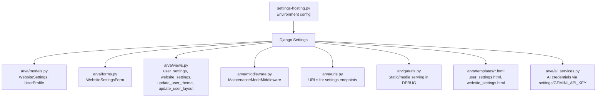
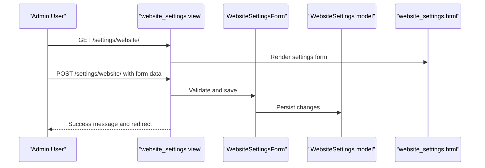
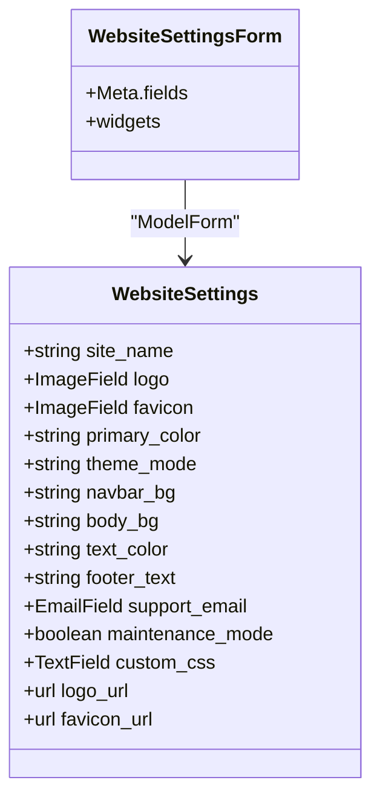
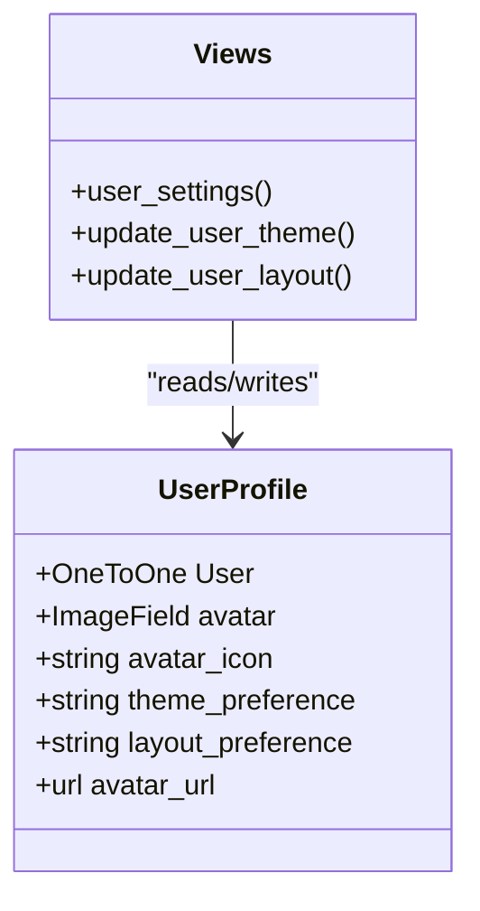
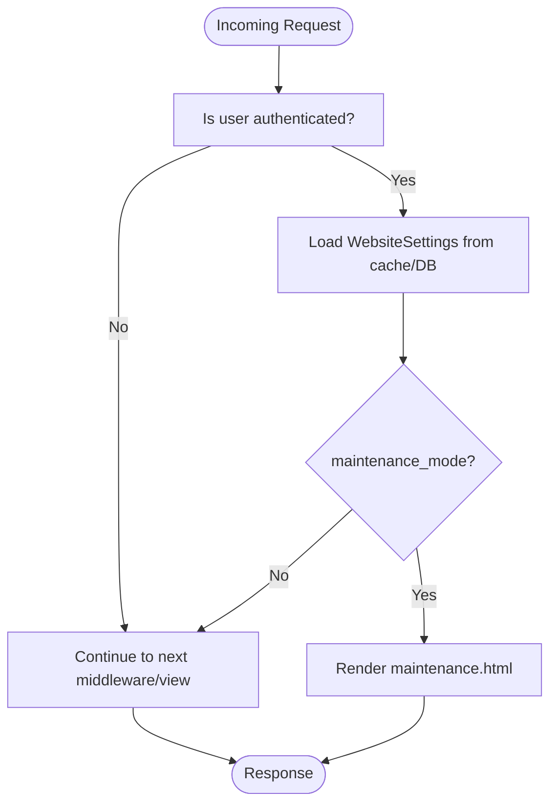

# Configuration and Settings

<cite>
**Referenced Files in This Document**
- [settings-hosting.py](file://settings-hosting.py)
- [arva/models.py](file://arva/models.py)
- [arva/forms.py](file://arva/forms.py)
- [arva/views.py](file://arva/views.py)
- [arva/admin.py](file://arva/admin.py)
- [arva/middleware.py](file://arva/middleware.py)
- [arva/urls.py](file://arva/urls.py)
- [arviga/urls.py](file://arviga/urls.py)
- [arva/templates/arva/user_settings.html](file://arva/templates/arva/user_settings.html)
- [arva/templates/arva/website_settings.html](file://arva/templates/arva/website_settings.html)
- [arva/ai_services.py](file://arva/ai_services.py)
</cite>

## Table of Contents
1. [Introduction](#introduction)
2. [Project Structure](#project-structure)
3. [Core Components](#core-components)
4. [Architecture Overview](#architecture-overview)
5. [Detailed Component Analysis](#detailed-component-analysis)
6. [Dependency Analysis](#dependency-analysis)
7. [Performance Considerations](#performance-considerations)
8. [Troubleshooting Guide](#troubleshooting-guide)
9. [Conclusion](#conclusion)
10. [Appendices](#appendices)

## Introduction
This document explains the configuration and settings management system in Arva Kanban. It covers:
- Website-wide branding and theme settings
- User preferences for layout and theme
- Environment configuration for production
- Database, static/media, email, and AI service credentials
- How administrators can change settings via the admin interface and templates
- Security, backup/restore, migration, performance tuning, and troubleshooting

## Project Structure
The settings system spans configuration files, models, forms, views, templates, middleware, and URL routing. The hosting configuration defines environment-specific settings, while models and forms persist and present settings to users. Middleware applies global settings like maintenance mode.



**Diagram sources**
- [settings-hosting.py](file://settings-hosting.py#L1-L133)
- [arva/models.py](file://arva/models.py#L15-L55)
- [arva/forms.py](file://arva/forms.py#L21-L48)
- [arva/views.py](file://arva/views.py#L136-L188)
- [arva/middleware.py](file://arva/middleware.py#L24-L38)
- [arva/urls.py](file://arva/urls.py#L80-L84)
- [arviga/urls.py](file://arviga/urls.py#L12-L14)
- [arva/templates/arva/user_settings.html](file://arva/templates/arva/user_settings.html#L1-L171)
- [arva/templates/arva/website_settings.html](file://arva/templates/arva/website_settings.html#L1-L154)
- [arva/ai_services.py](file://arva/ai_services.py#L14-L19)

**Section sources**
- [settings-hosting.py](file://settings-hosting.py#L1-L133)
- [arva/models.py](file://arva/models.py#L15-L55)
- [arva/forms.py](file://arva/forms.py#L21-L48)
- [arva/views.py](file://arva/views.py#L136-L188)
- [arva/middleware.py](file://arva/middleware.py#L24-L38)
- [arva/urls.py](file://arva/urls.py#L80-L84)
- [arviga/urls.py](file://arviga/urls.py#L12-L14)
- [arva/templates/arva/user_settings.html](file://arva/templates/arva/user_settings.html#L1-L171)
- [arva/templates/arva/website_settings.html](file://arva/templates/arva/website_settings.html#L1-L154)
- [arva/ai_services.py](file://arva/ai_services.py#L14-L19)

## Core Components
- WebsiteSettings model: Stores site-wide branding, theme, and maintenance mode.
- UserProfile model: Stores per-user layout and theme preferences.
- WebsiteSettingsForm: Model form for editing WebsiteSettings.
- Views for settings: Unified user settings page and dedicated website settings page; AJAX endpoints to update user preferences.
- Middleware: Applies maintenance mode based on WebsiteSettings.
- Templates: Provide admin-like editing surfaces for website settings.
- AI Services: Read credentials from Django settings/environment.

**Section sources**
- [arva/models.py](file://arva/models.py#L15-L55)
- [arva/models.py](file://arva/models.py#L56-L100)
- [arva/forms.py](file://arva/forms.py#L21-L48)
- [arva/views.py](file://arva/views.py#L136-L188)
- [arva/views.py](file://arva/views.py#L190-L217)
- [arva/middleware.py](file://arva/middleware.py#L24-L38)
- [arva/templates/arva/user_settings.html](file://arva/templates/arva/user_settings.html#L1-L171)
- [arva/templates/arva/website_settings.html](file://arva/templates/arva/website_settings.html#L1-L154)
- [arva/ai_services.py](file://arva/ai_services.py#L14-L19)

## Architecture Overview
The settings system integrates Django’s configuration with application models and presentation layers. Administrators can update branding and theme via templates, while users can personalize layout and theme. Middleware enforces maintenance mode globally.



**Diagram sources**
- [arva/views.py](file://arva/views.py#L162-L188)
- [arva/forms.py](file://arva/forms.py#L21-L48)
- [arva/models.py](file://arva/models.py#L15-L55)
- [arva/templates/arva/website_settings.html](file://arva/templates/arva/website_settings.html#L1-L154)

## Detailed Component Analysis

### Website Settings Management
- Data model: WebsiteSettings stores branding (site name, logo, favicon), theme colors, footer text, support email, maintenance mode toggle, and optional custom CSS.
- Presentation: website_settings.html renders a comprehensive form for administrators.
- Persistence: WebsiteSettingsForm binds to WebsiteSettings; saving updates the singleton record.



**Diagram sources**
- [arva/models.py](file://arva/models.py#L15-L55)
- [arva/forms.py](file://arva/forms.py#L21-L48)

**Section sources**
- [arva/models.py](file://arva/models.py#L15-L55)
- [arva/forms.py](file://arva/forms.py#L21-L48)
- [arva/templates/arva/website_settings.html](file://arva/templates/arva/website_settings.html#L1-L154)
- [arva/views.py](file://arva/views.py#L162-L188)

### User Preferences Storage
- Data model: UserProfile stores per-user theme preference and layout preference.
- Behavior: user_settings.html presents layout and theme controls; AJAX endpoints update preferences server-side.
- Inheritance: theme preference supports “follow website” mode.



**Diagram sources**
- [arva/models.py](file://arva/models.py#L56-L100)
- [arva/views.py](file://arva/views.py#L136-L188)
- [arva/views.py](file://arva/views.py#L190-L217)

**Section sources**
- [arva/models.py](file://arva/models.py#L56-L100)
- [arva/templates/arva/user_settings.html](file://arva/templates/arva/user_settings.html#L1-L171)
- [arva/views.py](file://arva/views.py#L136-L188)
- [arva/views.py](file://arva/views.py#L190-L217)

### Theme and Layout Configuration Options
- Website theme modes: light, dark, auto.
- User theme modes: inherit (follow website), light, dark, auto.
- Layout modes: sidebar (default), classic.
- Theme and layout are applied in templates and controlled via AJAX endpoints.

**Section sources**
- [arva/models.py](file://arva/models.py#L16-L24)
- [arva/models.py](file://arva/models.py#L57-L73)
- [arva/templates/arva/user_settings.html](file://arva/templates/arva/user_settings.html#L22-L59)
- [arva/views.py](file://arva/views.py#L190-L217)

### Environment Variable Configuration
- Secret key, debug, allowed hosts, database credentials, email settings, and static/media roots are defined in the hosting configuration file.
- AI credentials are read from Django settings or environment variables.

**Section sources**
- [settings-hosting.py](file://settings-hosting.py#L6-L133)
- [arva/ai_services.py](file://arva/ai_services.py#L14-L19)

### Database Configuration for Production
- MySQL backend is configured with charset and connection parameters.
- Recommended production steps:
  - Set DEBUG to False.
  - Restrict ALLOWED_HOSTS to your domain(s).
  - Use strong SECRET_KEY from environment.
  - Configure secure database credentials and network access.

**Section sources**
- [settings-hosting.py](file://settings-hosting.py#L60-L70)
- [settings-hosting.py](file://settings-hosting.py#L7-L9)

### Static File Management
- Static and media roots are defined; development URLs are served conditionally in DEBUG.
- For production, serve static/media via web server and keep DEBUG off.

**Section sources**
- [settings-hosting.py](file://settings-hosting.py#L105-L117)
- [arviga/urls.py](file://arviga/urls.py#L12-L14)

### Email Settings for Notifications
- SMTP backend is configured with host, port, TLS, credentials, and default sender.
- Ensure credentials match your mail provider.

**Section sources**
- [settings-hosting.py](file://settings-hosting.py#L125-L133)

### AI Service Credentials
- Gemini API key is read from Django settings or environment variable.
- If missing, AI services raise a configuration error.

**Section sources**
- [arva/ai_services.py](file://arva/ai_services.py#L14-L19)
- [arva/ai_services.py](file://arva/ai_services.py#L191-L193)
- [arva/ai_services.py](file://arva/ai_services.py#L200-L202)
- [arva/ai_services.py](file://arva/ai_services.py#L324-L326)

### Maintenance Mode Enforcement
- MaintenanceModeMiddleware reads WebsiteSettings from cache or DB and renders maintenance page for non-superusers.



**Diagram sources**
- [arva/middleware.py](file://arva/middleware.py#L24-L38)
- [arva/models.py](file://arva/models.py#L37-L37)

**Section sources**
- [arva/middleware.py](file://arva/middleware.py#L24-L38)

### Admin Interface Integration
- WebsiteSettings is registered in Django admin for centralized management.
- Admins can edit branding, theme, and maintenance mode.

**Section sources**
- [arva/admin.py](file://arva/admin.py#L49-L49)

### Settings Endpoints and Routing
- URLs expose settings routes for user settings, website settings, and AJAX endpoints to update theme/layout.

**Section sources**
- [arva/urls.py](file://arva/urls.py#L80-L84)

## Dependency Analysis
- Views depend on models and forms to render and persist settings.
- Templates depend on views and models to display and submit settings.
- Middleware depends on WebsiteSettings to enforce maintenance mode.
- AI services depend on Django settings/environment for credentials.

```mermaid
graph LR
Models["arva/models.py"] <- --> Forms["arva/forms.py"]
Forms --> Views["arva/views.py"]
Models --> Views
Views --> Templates["arva/templates/*.html"]
Models --> Middleware["arva/middleware.py"]
Settings["settings-hosting.py"] --> Views
Settings --> Middleware
Settings --> AIServices["arva/ai_services.py"]
```

**Diagram sources**
- [arva/models.py](file://arva/models.py#L15-L55)
- [arva/forms.py](file://arva/forms.py#L21-L48)
- [arva/views.py](file://arva/views.py#L136-L188)
- [arva/templates/arva/user_settings.html](file://arva/templates/arva/user_settings.html#L1-L171)
- [arva/templates/arva/website_settings.html](file://arva/templates/arva/website_settings.html#L1-L154)
- [arva/middleware.py](file://arva/middleware.py#L24-L38)
- [settings-hosting.py](file://settings-hosting.py#L1-L133)
- [arva/ai_services.py](file://arva/ai_services.py#L14-L19)

**Section sources**
- [arva/models.py](file://arva/models.py#L15-L55)
- [arva/forms.py](file://arva/forms.py#L21-L48)
- [arva/views.py](file://arva/views.py#L136-L188)
- [arva/templates/arva/user_settings.html](file://arva/templates/arva/user_settings.html#L1-L171)
- [arva/templates/arva/website_settings.html](file://arva/templates/arva/website_settings.html#L1-L154)
- [arva/middleware.py](file://arva/middleware.py#L24-L38)
- [settings-hosting.py](file://settings-hosting.py#L1-L133)
- [arva/ai_services.py](file://arva/ai_services.py#L14-L19)

## Performance Considerations
- Cache WebsiteSettings in middleware to avoid repeated DB queries.
- Keep maintenance mode cache TTL reasonable (currently 30 seconds).
- Minimize custom CSS to reduce rendering overhead.
- Serve static/media efficiently in production to reduce latency.

[No sources needed since this section provides general guidance]

## Troubleshooting Guide
- Maintenance mode prevents non-admin access:
  - Verify WebsiteSettings maintenance_mode flag.
  - Confirm cache availability and TTL.
- AI services fail with credential errors:
  - Ensure GEMINI_API_KEY is set in Django settings or environment.
- Website settings not saving:
  - Confirm superuser permissions and CSRF handling in templates.
  - Check form validation errors in the template.
- Static/media not loading:
  - Verify STATIC_ROOT/MEDIA_ROOT and URL mappings.
  - Confirm DEBUG behavior and production web server configuration.

**Section sources**
- [arva/middleware.py](file://arva/middleware.py#L24-L38)
- [arva/ai_services.py](file://arva/ai_services.py#L14-L19)
- [arva/templates/arva/website_settings.html](file://arva/templates/arva/website_settings.html#L67-L74)
- [settings-hosting.py](file://settings-hosting.py#L105-L117)
- [arviga/urls.py](file://arviga/urls.py#L12-L14)

## Conclusion
Arva Kanban’s settings system combines Django configuration, models, forms, views, templates, and middleware to provide a flexible, admin-controlled configuration surface. Administrators can tailor branding and theme, while users can personalize layout and theme. Production readiness requires careful environment configuration, secure credentials, and efficient static/media delivery.

[No sources needed since this section summarizes without analyzing specific files]

## Appendices

### A. Environment Variables and Settings Reference
- Database: ENGINE, NAME, USER, PASSWORD, HOST, PORT, OPTIONS
- Email: EMAIL_BACKEND, EMAIL_HOST, EMAIL_HOST_USER, EMAIL_HOST_PASSWORD, EMAIL_PORT, EMAIL_USE_TLS, EMAIL_USE_SSL, DEFAULT_FROM_EMAIL
- Static/Media: STATIC_URL, STATIC_ROOT, STATICFILES_DIRS, MEDIA_URL, MEDIA_ROOT
- Security: SECRET_KEY, DEBUG, ALLOWED_HOSTS
- AI: GEMINI_API_KEY (Django settings or environment)

**Section sources**
- [settings-hosting.py](file://settings-hosting.py#L60-L70)
- [settings-hosting.py](file://settings-hosting.py#L125-L133)
- [settings-hosting.py](file://settings-hosting.py#L105-L117)
- [settings-hosting.py](file://settings-hosting.py#L6-L9)
- [arva/ai_services.py](file://arva/ai_services.py#L14-L19)

### B. Admin Interface Access
- WebsiteSettings is registered in Django admin for centralized editing.

**Section sources**
- [arva/admin.py](file://arva/admin.py#L49-L49)

### C. Example Workflows

#### Modify Website Settings via Admin Interface
- Navigate to Django admin and open WebsiteSettings.
- Update branding, theme, and maintenance mode.
- Save and confirm changes take effect immediately.

**Section sources**
- [arva/admin.py](file://arva/admin.py#L49-L49)

#### Configure Environment-Specific Settings
- Set DEBUG, SECRET_KEY, ALLOWED_HOSTS, database credentials, and email settings per environment.
- For production, disable DEBUG and restrict ALLOWED_HOSTS.

**Section sources**
- [settings-hosting.py](file://settings-hosting.py#L6-L133)

#### Customize Application Appearance
- Use website_settings.html to change site name, logo, favicon, theme colors, footer text, and enable maintenance mode.
- Users can switch layout (sidebar/classic) and theme (inherit/light/dark/auto) via user_settings.html.

**Section sources**
- [arva/templates/arva/website_settings.html](file://arva/templates/arva/website_settings.html#L1-L154)
- [arva/templates/arva/user_settings.html](file://arva/templates/arva/user_settings.html#L1-L171)
- [arva/views.py](file://arva/views.py#L136-L188)
- [arva/views.py](file://arva/views.py#L190-L217)

### D. Security Considerations
- Store secrets (database passwords, email credentials, API keys) in environment variables or secure secret managers.
- Never commit secrets to version control.
- Use HTTPS and secure cookies in production.
- Limit access to admin and settings endpoints.

[No sources needed since this section provides general guidance]

### E. Backup and Restore Procedures
- Back up WebsiteSettings and UserProfile records via Django ORM or database exports.
- For migrations, serialize settings before applying schema changes and rehydrate after.

[No sources needed since this section provides general guidance]

### F. Migration Strategies
- When adding new WebsiteSettings fields, provide defaults and handle missing values gracefully.
- For theme/layout changes, maintain backward compatibility in templates and views.

[No sources needed since this section provides general guidance]