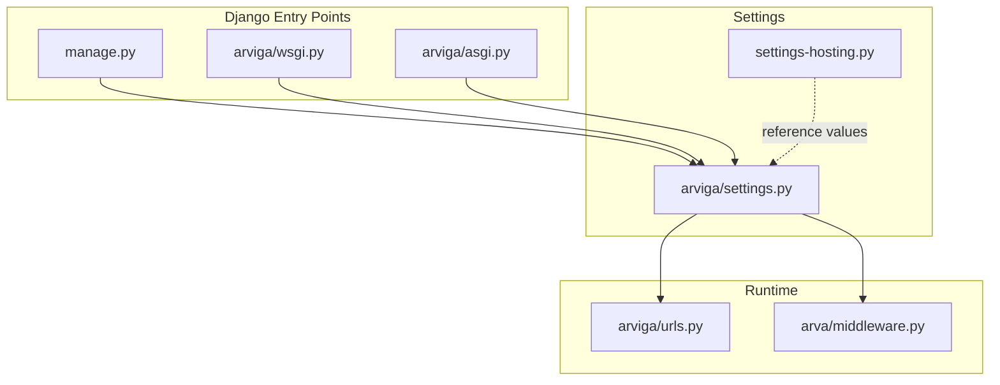
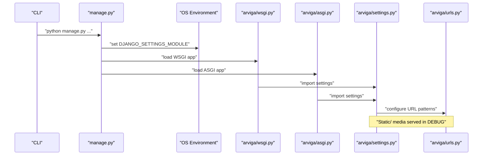
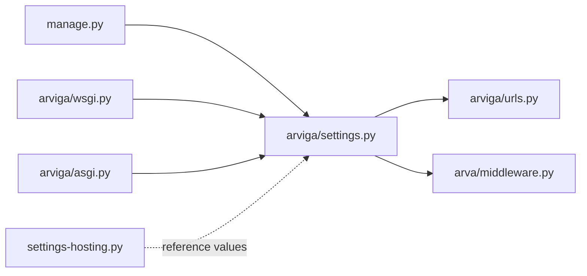

# Environment and Database Configuration

<cite>
**Referenced Files in This Document**
- [arviga/settings.py](file://arviga/settings.py)
- [settings-hosting.py](file://settings-hosting.py)
- [manage.py](file://manage.py)
- [arviga/urls.py](file://arviga/urls.py)
- [arviga/wsgi.py](file://arviga/wsgi.py)
- [arviga/asgi.py](file://arviga/asgi.py)
- [arva/middleware.py](file://arva/middleware.py)
- [README.txt](file://README.txt)
- [SETUP_GUIDE.md](file://SETUP_GUIDE.md)
- [arva/models.py](file://arva/models.py)
</cite>

## Table of Contents
1. [Introduction](#introduction)
2. [Project Structure](#project-structure)
3. [Core Components](#core-components)
4. [Architecture Overview](#architecture-overview)
5. [Detailed Component Analysis](#detailed-component-analysis)
6. [Dependency Analysis](#dependency-analysis)
7. [Performance Considerations](#performance-considerations)
8. [Troubleshooting Guide](#troubleshooting-guide)
9. [Conclusion](#conclusion)
10. [Appendices](#appendices)

## Introduction
This document explains how Arva Kanban manages environment and database configuration across development and production contexts. It covers Django’s settings system, environment variable management, secret key handling, MySQL 8+ configuration with utf8mb4, static and media file handling, and practical guidance for migrations, backups, scaling, security, containerized deployment, and production monitoring.

## Project Structure
The project uses a layered Django configuration:
- A base settings module defines development defaults and optional local overrides.
- A hosting settings module provides production-like defaults and example values.
- WSGI/ASGI entry points select the appropriate settings module.
- URL routing enables static/media serving in development.
- Middleware integrates maintenance mode and activity tracking.

**Diagram sources**
- [manage.py](file://manage.py#L1-L12)
- [arviga/wsgi.py](file://arviga/wsgi.py#L1-L6)
- [arviga/asgi.py](file://arviga/asgi.py#L1-L6)
- [arviga/settings.py](file://arviga/settings.py#L1-L133)
- [settings-hosting.py](file://settings-hosting.py#L1-L133)
- [arviga/urls.py](file://arviga/urls.py#L1-L15)
- [arva/middleware.py](file://arva/middleware.py#L1-L39)

**Section sources**
- [arviga/settings.py](file://arviga/settings.py#L1-L133)
- [settings-hosting.py](file://settings-hosting.py#L1-L133)
- [manage.py](file://manage.py#L1-L12)
- [arviga/urls.py](file://arviga/urls.py#L1-L15)
- [arva/middleware.py](file://arva/middleware.py#L1-L39)

## Core Components
- Django settings module for development with optional local overrides.
- Hosting settings module with production-like defaults and example values.
- WSGI/ASGI entry points selecting the settings module.
- Static and media configuration for development and production.
- Middleware for maintenance mode and user activity tracking.

Key configuration areas:
- Secret key and debug flags
- Allowed hosts and security middleware
- Database backend and charset
- Static and media roots/dirs
- Email backend and TLS
- Local overrides via a separate local settings file

**Section sources**
- [arviga/settings.py](file://arviga/settings.py#L1-L133)
- [settings-hosting.py](file://settings-hosting.py#L1-L133)
- [arviga/wsgi.py](file://arviga/wsgi.py#L1-L6)
- [arviga/asgi.py](file://arviga/asgi.py#L1-L6)
- [arviga/urls.py](file://arviga/urls.py#L1-L15)

## Architecture Overview
The runtime configuration flow selects the settings module and applies middleware and URL routing.

**Diagram sources**
- [manage.py](file://manage.py#L1-L12)
- [arviga/wsgi.py](file://arviga/wsgi.py#L1-L6)
- [arviga/asgi.py](file://arviga/asgi.py#L1-L6)
- [arviga/settings.py](file://arviga/settings.py#L1-L133)
- [arviga/urls.py](file://arviga/urls.py#L1-L15)

## Detailed Component Analysis

### Django Settings System: Development vs Production
- Development defaults are defined in the main settings module, including debug mode, empty allowed hosts, and local static/media roots.
- Optional local overrides are imported from a dedicated local settings file, enabling environment-specific customization without committing secrets.
- A separate hosting settings module provides production-like defaults and example values for reference.

Practical guidance:
- Keep SECRET_KEY and sensitive credentials in environment variables or local settings.
- Set ALLOWED_HOSTS appropriately per environment.
- Enable/disable DEBUG per environment.
- Use local settings for development overrides and avoid committing secrets.

**Section sources**
- [arviga/settings.py](file://arviga/settings.py#L1-L133)
- [settings-hosting.py](file://settings-hosting.py#L1-L133)
- [manage.py](file://manage.py#L1-L12)

### Environment Variable Management and Secret Key Handling
- The settings module defines a development SECRET_KEY and DEBUG flag.
- Import of local settings allows overriding these values in development.
- For production, externalize SECRET_KEY and other secrets via environment variables or a secure secrets manager.

Best practices:
- Never commit SECRET_KEY or database passwords.
- Use local settings for development and CI/CD secrets for production.
- Rotate keys regularly and invalidate compromised ones.

**Section sources**
- [arviga/settings.py](file://arviga/settings.py#L1-L133)

### Database Configuration: MySQL 8+, Character Sets, and Options
- Default engine uses a MySQL connector backend with explicit charset configuration for utf8mb4.
- Example hosting settings demonstrate MySQL 8+ connectivity with utf8mb4 charset.
- Recommended database creation includes utf8mb4 character set and collation.

Performance and compatibility:
- utf8mb4 supports full Unicode including emojis.
- Ensure MySQL server and client libraries align with utf8mb4.
- Consider connection pooling and timeouts at the application or proxy level.

**Section sources**
- [arviga/settings.py](file://arviga/settings.py#L58-L68)
- [settings-hosting.py](file://settings-hosting.py#L60-L70)
- [README.txt](file://README.txt#L20-L22)

### Static Files and Media Handling
- Development:
  - Static files served via URL patterns when debug is enabled.
  - Static files directory and collected root configured separately.
  - Media files served under a dedicated URL with document root mapping.
- Production:
  - Collect static assets to the static root directory.
  - Serve static/media via web server or CDN for performance.
  - Configure CDN domain and secure asset URLs at the application or reverse proxy level.

**Section sources**
- [arviga/urls.py](file://arviga/urls.py#L12-L14)
- [arviga/settings.py](file://arviga/settings.py#L103-L108)
- [settings-hosting.py](file://settings-hosting.py#L105-L110)

### Security Configurations
- Allowed hosts:
  - Development: empty list.
  - Hosting example: wildcard and specific hostnames.
- Security middleware:
  - Standard Django security middleware is included.
- CORS:
  - Not configured in the provided settings; configure CORS headers at the web server or middleware layer if needed.
- SSL/TLS:
  - Email uses TLS; enable HTTPS at the web server/proxy for production.
- Database connection security:
  - Store credentials in environment variables or local settings.
  - Restrict network access to the database host.

**Section sources**
- [arviga/settings.py](file://arviga/settings.py#L5-L7)
- [settings-hosting.py](file://settings-hosting.py#L9)
- [arviga/settings.py](file://arviga/settings.py#L116-L123)
- [settings-hosting.py](file://settings-hosting.py#L125-L132)

### Maintenance Mode and User Activity Middleware
- Maintenance mode middleware reads website settings and renders a maintenance template for non-superusers.
- Last activity middleware updates user activity timestamps periodically.

Operational notes:
- Use website settings to toggle maintenance mode.
- Monitor user activity via stored timestamps.

**Section sources**
- [arva/middleware.py](file://arva/middleware.py#L1-L39)
- [arva/models.py](file://arva/models.py#L15-L55)

## Dependency Analysis
The configuration depends on Django’s settings resolution and entry points. The URL router conditionally serves static/media during development.

**Diagram sources**
- [arviga/settings.py](file://arviga/settings.py#L1-L133)
- [arviga/urls.py](file://arviga/urls.py#L1-L15)
- [arva/middleware.py](file://arva/middleware.py#L1-L39)
- [manage.py](file://manage.py#L1-L12)
- [arviga/wsgi.py](file://arviga/wsgi.py#L1-L6)
- [arviga/asgi.py](file://arviga/asgi.py#L1-L6)
- [settings-hosting.py](file://settings-hosting.py#L1-L133)

**Section sources**
- [arviga/settings.py](file://arviga/settings.py#L1-L133)
- [arviga/urls.py](file://arviga/urls.py#L1-L15)
- [arva/middleware.py](file://arva/middleware.py#L1-L39)
- [manage.py](file://manage.py#L1-L12)
- [arviga/wsgi.py](file://arviga/wsgi.py#L1-L6)
- [arviga/asgi.py](file://arviga/asgi.py#L1-L6)
- [settings-hosting.py](file://settings-hosting.py#L1-L133)

## Performance Considerations
- Database:
  - utf8mb4 is supported; ensure proper index sizing and query optimization.
  - Consider connection pooling at the application or reverse proxy layer.
- Static/media:
  - Serve static assets via CDN in production for reduced latency.
  - Compress assets and enable caching headers.
- Middleware:
  - Cache website settings to minimize database queries.

[No sources needed since this section provides general guidance]

## Troubleshooting Guide
- Database connectivity:
  - Verify MySQL service and port accessibility.
  - Use the provided troubleshooting steps to test connectivity and resolve duplicate column errors.
- Switching to SQLite for development:
  - Create a local settings override to use sqlite3 for rapid development.
- Migration issues:
  - Apply migrations and handle specific migration states as documented.

**Section sources**
- [SETUP_GUIDE.md](file://SETUP_GUIDE.md#L42-L67)
- [README.txt](file://README.txt#L20-L32)

## Conclusion
Arva Kanban’s configuration separates development and production concerns through layered settings, optional local overrides, and explicit static/media handling. By externalizing secrets, enforcing secure defaults, and leveraging CDN-backed static delivery, teams can operate reliably across environments while maintaining strong security and performance characteristics.

[No sources needed since this section summarizes without analyzing specific files]

## Appendices

### Practical Examples: Environment-Specific Settings
- Development:
  - Enable debug and use local settings for overrides.
  - Keep SECRET_KEY and database credentials in environment variables or local settings.
- Production:
  - Set ALLOWED_HOSTS to your domain(s).
  - Disable debug and enforce HTTPS.
  - Externalize secrets and configure CDN for static assets.

**Section sources**
- [arviga/settings.py](file://arviga/settings.py#L1-L133)
- [settings-hosting.py](file://settings-hosting.py#L1-L133)

### Database Migration Strategies
- Apply migrations using the management command.
- For development, a local settings override can switch to SQLite if needed.
- Use the provided troubleshooting steps to resolve migration conflicts.

**Section sources**
- [README.txt](file://README.txt#L25-L26)
- [SETUP_GUIDE.md](file://SETUP_GUIDE.md#L69-L83)
- [SETUP_GUIDE.md](file://SETUP_GUIDE.md#L57-L67)

### Backup and Restore Procedures
- Back up the MySQL database using standard MySQL utilities.
- Restore by importing the dump into the target environment’s database.
- Validate after restore and re-run migrations if schema changed.

[No sources needed since this section provides general guidance]

### Scaling Considerations
- Horizontal scaling:
  - Use a load balancer and multiple application instances behind a shared database.
  - Ensure session storage and caches are centralized (e.g., Redis).
- Database:
  - Consider read replicas and connection pooling.
- Static assets:
  - Serve via CDN and cache aggressively.

[No sources needed since this section provides general guidance]

### Containerized Deployment and Cloud Platforms
- Containerization:
  - Build a container image with environment variables for secrets.
  - Mount persistent volumes for media and logs.
- Cloud platforms:
  - Use managed databases and CDN services.
  - Configure health checks and auto-scaling policies.

[No sources needed since this section provides general guidance]

### Monitoring Setup for Production
- Application:
  - Enable structured logging and integrate with log aggregation systems.
- Database:
  - Monitor slow queries, connections, and replication lag.
- Infrastructure:
  - Track uptime, response times, and error rates via platform monitoring.

[No sources needed since this section provides general guidance]