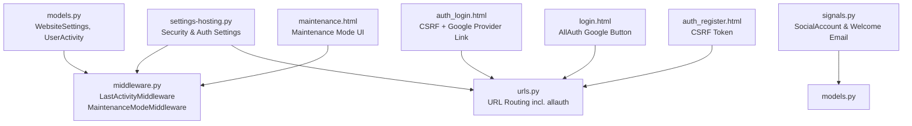
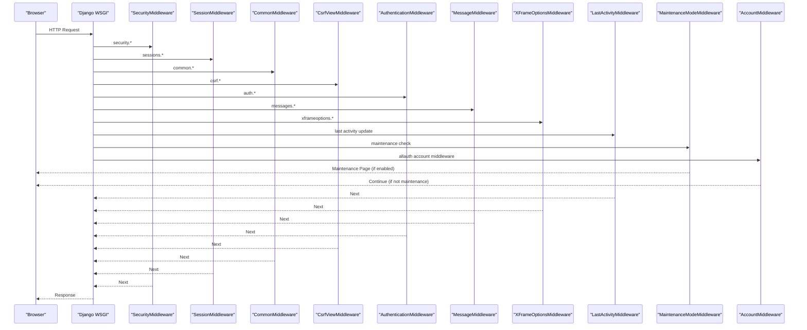
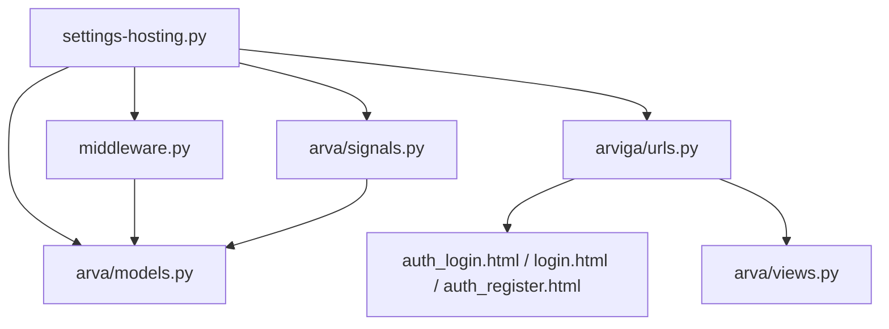

# Security and Authentication Configuration

<cite>
**Referenced Files in This Document**
- [settings-hosting.py](file://settings-hosting.py)
- [middleware.py](file://arva/middleware.py)
- [urls.py](file://arviga/urls.py)
- [models.py](file://arva/models.py)
- [signals.py](file://arva/signals.py)
- [forms.py](file://arva/forms.py)
- [views.py](file://arva/views.py)
- [auth_login.html](file://arva/templates/arva/auth_login.html)
- [login.html](file://arva/templates/account/login.html)
- [auth_register.html](file://arva/templates/arva/auth_register.html)
- [maintenance.html](file://arva/templates/arva/maintenance.html)
</cite>

## Table of Contents
1. [Introduction](#introduction)
2. [Project Structure](#project-structure)
3. [Core Components](#core-components)
4. [Architecture Overview](#architecture-overview)
5. [Detailed Component Analysis](#detailed-component-analysis)
6. [Dependency Analysis](#dependency-analysis)
7. [Performance Considerations](#performance-considerations)
8. [Troubleshooting Guide](#troubleshooting-guide)
9. [Conclusion](#conclusion)
10. [Appendices](#appendices)

## Introduction
This document explains the security and authentication configuration for Arva Kanban. It covers Django’s built-in protections (CSRF, XSS, clickjacking), session management, authentication backends (ModelBackend and Django AllAuth), password validation policies, account security measures, maintenance mode, and practical guidance for securing API endpoints, protecting against common web vulnerabilities, SSL/TLS configuration, and setting up audit trails for security events.

## Project Structure
Security and authentication are configured primarily in the Django settings module and enforced by middleware and templates. Key areas:
- Global security and authentication settings
- Middleware stack for request lifecycle controls
- URL routing for authentication and third-party providers
- Models and signals for user and website settings
- Templates for login, registration, and maintenance modes

**Diagram sources**
- [settings-hosting.py](file://settings-hosting.py#L26-L37)
- [middleware.py](file://arva/middleware.py#L7-L38)
- [urls.py](file://arviga/urls.py#L6-L10)
- [models.py](file://arva/models.py#L15-L43)
- [signals.py](file://arva/signals.py#L19-L61)
- [auth_login.html](file://arva/templates/arva/auth_login.html#L39-L81)
- [login.html](file://arva/templates/account/login.html#L8-L22)
- [auth_register.html](file://arva/templates/arva/auth_register.html#L9-L13)
- [maintenance.html](file://arva/templates/arva/maintenance.html#L1-L359)

**Section sources**
- [settings-hosting.py](file://settings-hosting.py#L11-L37)
- [middleware.py](file://arva/middleware.py#L7-L38)
- [urls.py](file://arviga/urls.py#L6-L10)

## Core Components
- Security middleware stack includes Django’s built-in protections and custom middlewares for activity tracking and maintenance mode.
- Authentication backends enable both local username/password and Google OAuth via Django AllAuth.
- Password validators enforce minimum length and discourage common or similar passwords.
- Email backend configuration supports SMTP for sending notifications and welcome emails.
- Maintenance mode is controlled by a WebsiteSettings flag and enforced by a dedicated middleware.

**Section sources**
- [settings-hosting.py](file://settings-hosting.py#L26-L37)
- [settings-hosting.py](file://settings-hosting.py#L72-L78)
- [settings-hosting.py](file://settings-hosting.py#L81-L84)
- [settings-hosting.py](file://settings-hosting.py#L125-L132)
- [middleware.py](file://arva/middleware.py#L24-L38)
- [models.py](file://arva/models.py#L15-L43)

## Architecture Overview
The authentication and security architecture integrates Django’s built-in protections with custom middlewares and AllAuth for social login. The flow below shows how requests traverse the middleware stack and how authentication backends are resolved.

**Diagram sources**
- [settings-hosting.py](file://settings-hosting.py#L26-L37)
- [middleware.py](file://arva/middleware.py#L7-L38)

## Detailed Component Analysis

### Django Built-in Security Settings
- CSRF protection: Enabled via CsrfViewMiddleware. All authenticated POST forms include a CSRF token.
- XSS prevention: Django’s template auto-escaping and Content-Type headers mitigate XSS risks.
- Clickjacking protection: XFrameOptionsMiddleware prevents frames embedding.
- Secure session management: SessionMiddleware manages sessions; combined with HTTPS in production, cookies can be secured further.

Evidence in settings and templates:
- Middleware stack includes SecurityMiddleware, SessionMiddleware, CommonMiddleware, CsrfViewMiddleware, AuthenticationMiddleware, MessageMiddleware, and XFrameOptionsMiddleware.
- Login templates include CSRF tokens and Google provider links.

**Section sources**
- [settings-hosting.py](file://settings-hosting.py#L26-L37)
- [auth_login.html](file://arva/templates/arva/auth_login.html#L39-L43)
- [login.html](file://arva/templates/account/login.html#L14-L21)

### Authentication Backend Configuration
- Backends: ModelBackend (local users) and allauth.account.auth_backends.AuthenticationBackend (social providers).
- Provider: Google OAuth is configured with client credentials and scopes.

Practical implications:
- Users can log in with username/password or Google.
- After Google sign-up, avatars can be fetched and a welcome email is sent asynchronously.

**Section sources**
- [settings-hosting.py](file://settings-hosting.py#L81-L84)
- [settings-hosting.py](file://settings-hosting.py#L86-L98)
- [signals.py](file://arva/signals.py#L19-L61)

### Password Validation Policies
- Validators include similarity checks, minimum length (configured), common password checks, and numeric-only restrictions.
- Minimum length is set to 8.

**Section sources**
- [settings-hosting.py](file://settings-hosting.py#L72-L78)

### Account Security Measures
- Email backend configured for SMTP with TLS enabled.
- Registration and user edit forms validate uniqueness and confirm passwords.
- Superuser-only administrative actions (e.g., reset password, toggle active, hard delete) are gated in views.

**Section sources**
- [settings-hosting.py](file://settings-hosting.py#L125-L132)
- [forms.py](file://arva/forms.py#L110-L127)
- [views.py](file://arva/views.py#L335-L348)
- [views.py](file://arva/views.py#L320-L331)
- [views.py](file://arva/views.py#L352-L366)

### Session Timeout Configuration
- No explicit session timeout is configured in the provided settings.
- A LastActivityMiddleware periodically updates a UserActivity record for authenticated users, enabling idle detection and potential timeout logic at the application level.

Recommendation:
- Configure SESSION_COOKIE_AGE and SESSION_EXPIRE_AT_BROWSER_CLOSE in production settings to enforce timeouts.

**Section sources**
- [middleware.py](file://arva/middleware.py#L7-L22)
- [models.py](file://arva/models.py#L423-L429)

### Maintenance Mode
- Controlled by WebsiteSettings.maintenance_mode.
- MaintenanceModeMiddleware checks this flag and renders maintenance.html for non-superusers.
- WebsiteSettings are cached for 30 seconds to reduce database queries.

**Section sources**
- [models.py](file://arva/models.py#L15-L43)
- [middleware.py](file://arva/middleware.py#L24-L38)
- [maintenance.html](file://arva/templates/arva/maintenance.html#L1-L359)

### Rate Limiting and IP Whitelisting
- No built-in rate limiting or IP whitelisting is configured in the provided settings.
- Recommendation: Integrate a rate-limiting library and/or WAF rules for production deployments.

[No sources needed since this section provides general guidance]

### Securing API Endpoints
- Use Django’s built-in CSRF protections for AJAX forms (CSRF token present in templates).
- For custom API views, apply decorators and middleware appropriate to your needs.
- Restrict sensitive endpoints behind login_required and explicit permission checks.

**Section sources**
- [auth_login.html](file://arva/templates/arva/auth_login.html#L39-L43)
- [auth_register.html](file://arva/templates/arva/auth_register.html#L9-L13)

### Protecting Against Common Web Vulnerabilities
- CSRF: Ensure all POST forms include .
- XSS: Rely on Django’s auto-escaping; sanitize user-generated content when rendering.
- Clickjacking: XFrameOptionsMiddleware is enabled.
- Sensitive data exposure: Avoid logging secrets; restrict DEBUG in production.

**Section sources**
- [settings-hosting.py](file://settings-hosting.py#L26-L37)
- [auth_login.html](file://arva/templates/arva/auth_login.html#L39-L43)

### SSL Certificate Configuration
- Configure SSL/TLS at the reverse proxy/load balancer level.
- Set SECURE_SSL_REDIRECT, SECURE_HSTS_SECONDS, SECURE_CONTENT_TYPE_NOSNIFF, SECURE_BROWSER_XSS_FILTER in production settings as applicable.

[No sources needed since this section provides general guidance]

### Audit Trail Setup for Security Events
- ActivityLog model records significant actions performed by users.
- Use signals or view handlers to log events consistently.

**Section sources**
- [models.py](file://arva/models.py#L387-L422)
- [views.py](file://arva/views.py#L489-L494)
- [views.py](file://arva/views.py#L555-L560)
- [views.py](file://arva/views.py#L580-L586)
- [views.py](file://arva/views.py#L643-L654)

### Practical Examples

#### Google OAuth Integration
- Provider configuration includes client ID, secret, and scopes.
- Templates link to provider login URLs for Google.

Implementation pointers:
- Provider settings and login buttons are defined in settings and templates.

**Section sources**
- [settings-hosting.py](file://settings-hosting.py#L86-L98)
- [auth_login.html](file://arva/templates/arva/auth_login.html#L68-L80)
- [login.html](file://arva/templates/account/login.html#L8-L10)

#### Email-Based Authentication
- Local login uses username/password with CSRF-protected forms.
- Registration form includes CSRF token.

**Section sources**
- [auth_login.html](file://arva/templates/arva/auth_login.html#L39-L64)
- [auth_register.html](file://arva/templates/arva/auth_register.html#L9-L13)

#### Multi-Factor Authentication (MFA)
- Not configured in the provided settings.
- Recommendation: Integrate a Django MFA package and configure it alongside existing backends.

[No sources needed since this section provides general guidance]

## Dependency Analysis
The following diagram maps key dependencies among security-related components.

**Diagram sources**
- [settings-hosting.py](file://settings-hosting.py#L26-L37)
- [middleware.py](file://arva/middleware.py#L7-L38)
- [urls.py](file://arviga/urls.py#L6-L10)
- [models.py](file://arva/models.py#L15-L43)
- [signals.py](file://arva/signals.py#L19-L61)
- [auth_login.html](file://arva/templates/arva/auth_login.html#L39-L81)
- [login.html](file://arva/templates/account/login.html#L8-L22)
- [auth_register.html](file://arva/templates/arva/auth_register.html#L9-L13)
- [views.py](file://arva/views.py#L335-L348)

**Section sources**
- [settings-hosting.py](file://settings-hosting.py#L26-L37)
- [middleware.py](file://arva/middleware.py#L7-L38)
- [urls.py](file://arviga/urls.py#L6-L10)
- [models.py](file://arva/models.py#L15-L43)
- [signals.py](file://arva/signals.py#L19-L61)
- [auth_login.html](file://arva/templates/arva/auth_login.html#L39-L81)
- [login.html](file://arva/templates/account/login.html#L8-L22)
- [auth_register.html](file://arva/templates/arva/auth_register.html#L9-L13)
- [views.py](file://arva/views.py#L335-L348)

## Performance Considerations
- Cache WebsiteSettings in middleware to avoid repeated database hits.
- Minimize template rendering overhead by leveraging caching and efficient queries.
- Use asynchronous email delivery to prevent blocking request threads.

**Section sources**
- [middleware.py](file://arva/middleware.py#L28-L35)
- [signals.py](file://arva/signals.py#L52-L61)

## Troubleshooting Guide
Common issues and resolutions:
- CSRF failures on POST: Ensure  is present in forms.
- Google login redirects incorrectly: Verify provider client credentials and redirect URIs.
- Maintenance mode blocks legitimate users: Confirm superuser status or disable maintenance_mode.
- Email not sent: Check SMTP settings and network connectivity.

**Section sources**
- [auth_login.html](file://arva/templates/arva/auth_login.html#L39-L43)
- [login.html](file://arva/templates/account/login.html#L8-L22)
- [settings-hosting.py](file://settings-hosting.py#L86-L98)
- [middleware.py](file://arva/middleware.py#L24-L38)
- [settings-hosting.py](file://settings-hosting.py#L125-L132)

## Conclusion
Arva Kanban leverages Django’s built-in security middleware and AllAuth for robust authentication. The configuration includes CSRF, XSS, and clickjacking protections, password validators, and maintenance mode enforcement. For production, add session timeout, rate limiting, IP whitelisting, SSL/TLS hardening, and comprehensive audit logging to strengthen defenses.

## Appendices

### Security Settings Reference
- Installed apps include Django contrib apps, sites, and allauth packages.
- Middleware stack includes security, session, CSRF, authentication, messages, X-Frame-Options, and custom middlewares.
- Authentication backends include ModelBackend and allauth’s backend.
- Password validators enforce minimum length and discourage weak patterns.
- Email backend configured for SMTP with TLS.

**Section sources**
- [settings-hosting.py](file://settings-hosting.py#L11-L24)
- [settings-hosting.py](file://settings-hosting.py#L26-L37)
- [settings-hosting.py](file://settings-hosting.py#L81-L84)
- [settings-hosting.py](file://settings-hosting.py#L72-L78)
- [settings-hosting.py](file://settings-hosting.py#L125-L132)