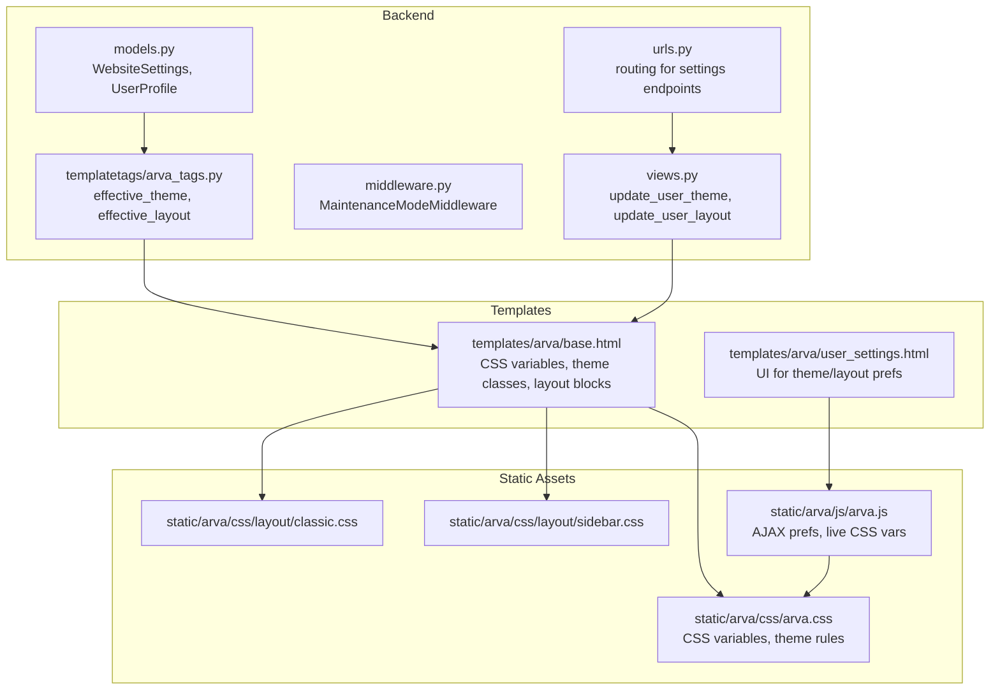
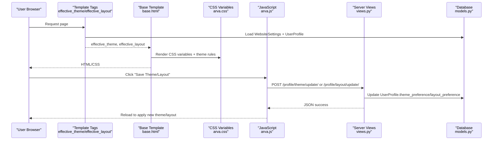
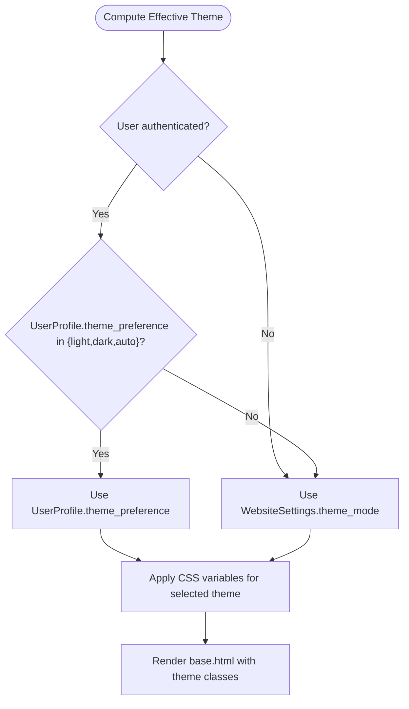
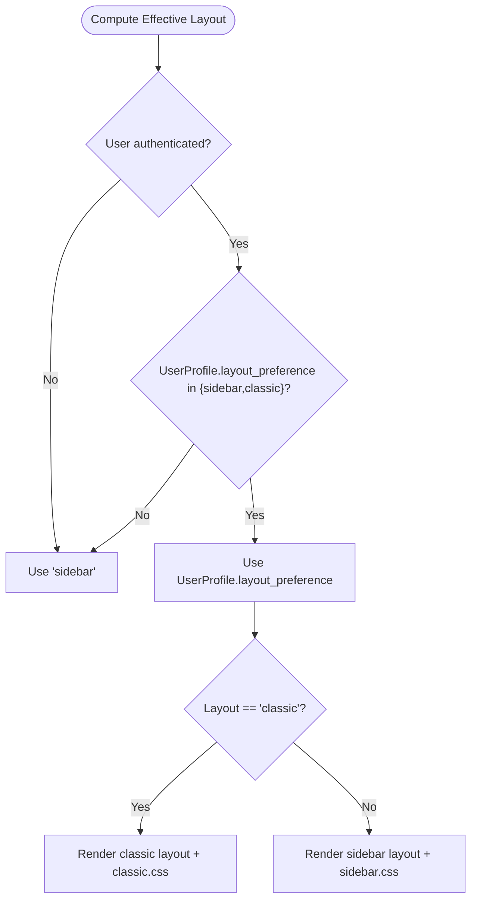
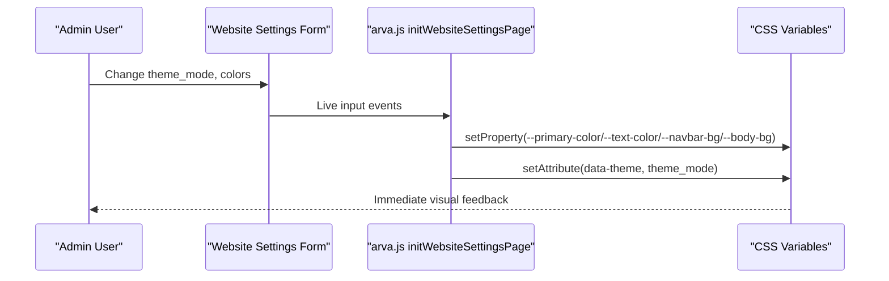
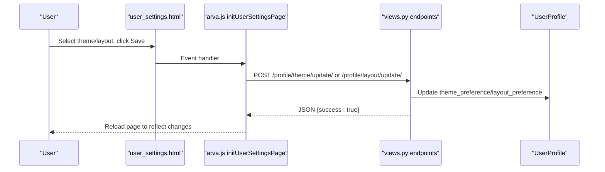
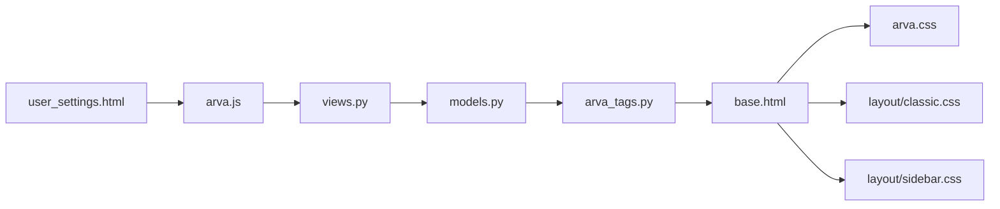

# Theme and Layout Configuration

<cite>
**Referenced Files in This Document**
- [models.py](file://arva/models.py)
- [views.py](file://arva/views.py)
- [middleware.py](file://arva/middleware.py)
- [arva_tags.py](file://arva/templatetags/arva_tags.py)
- [base.html](file://arva/templates/arva/base.html)
- [user_settings.html](file://arva/templates/arva/user_settings.html)
- [arva.css](file://static/arva/css/arva.css)
- [classic.css](file://static/arva/css/layout/classic.css)
- [sidebar.css](file://static/arva/css/layout/sidebar.css)
- [arva.js](file://static/arva/js/arva.js)
- [urls.py](file://arva/urls.py)
</cite>

## Table of Contents
1. [Introduction](#introduction)
2. [Project Structure](#project-structure)
3. [Core Components](#core-components)
4. [Architecture Overview](#architecture-overview)
5. [Detailed Component Analysis](#detailed-component-analysis)
6. [Dependency Analysis](#dependency-analysis)
7. [Performance Considerations](#performance-considerations)
8. [Troubleshooting Guide](#troubleshooting-guide)
9. [Conclusion](#conclusion)

## Introduction
This document explains the theme and layout configuration system in Arva Kanban. It covers how users select themes (light, dark, auto) and layouts (sidebar vs classic), how CSS variables are managed, how dynamic switching works, and how preferences are persisted. It also documents responsive design and mobile optimization, browser compatibility considerations, performance implications, accessibility compliance, customization guidelines, and troubleshooting steps.

## Project Structure
The theme and layout system spans backend models and views, template tags for computing effective preferences, Django templates for rendering, CSS variables for styling, and JavaScript for dynamic updates.

**Diagram sources**
- [models.py](file://arva/models.py#L15-L100)
- [views.py](file://arva/views.py#L190-L216)
- [middleware.py](file://arva/middleware.py#L24-L38)
- [arva_tags.py](file://arva/templatetags/arva_tags.py#L6-L27)
- [base.html](file://arva/templates/arva/base.html#L1-L180)
- [user_settings.html](file://arva/templates/arva/user_settings.html#L10-L59)
- [arva.css](file://static/arva/css/arva.css#L1-L120)
- [classic.css](file://static/arva/css/layout/classic.css#L1-L24)
- [sidebar.css](file://static/arva/css/layout/sidebar.css#L1-L15)
- [arva.js](file://static/arva/js/arva.js#L694-L778)
- [urls.py](file://arva/urls.py#L80-L84)

**Section sources**
- [models.py](file://arva/models.py#L15-L100)
- [views.py](file://arva/views.py#L190-L216)
- [middleware.py](file://arva/middleware.py#L24-L38)
- [arva_tags.py](file://arva/templatetags/arva_tags.py#L6-L27)
- [base.html](file://arva/templates/arva/base.html#L1-L180)
- [user_settings.html](file://arva/templates/arva/user_settings.html#L10-L59)
- [arva.css](file://static/arva/css/arva.css#L1-L120)
- [classic.css](file://static/arva/css/layout/classic.css#L1-L24)
- [sidebar.css](file://static/arva/css/layout/sidebar.css#L1-L15)
- [arva.js](file://static/arva/js/arva.js#L694-L778)
- [urls.py](file://arva/urls.py#L80-L84)

## Core Components
- Theme and layout preferences are stored per user in the database via the UserProfile model and globally via WebsiteSettings.
- Effective theme and layout are computed server-side using template tags and applied in the base template.
- CSS variables define theme colors and are overridden for light/dark/auto modes.
- JavaScript handles AJAX updates for theme/layout preferences and live preview of website-wide theme settings.

**Section sources**
- [models.py](file://arva/models.py#L56-L100)
- [arva_tags.py](file://arva/templatetags/arva_tags.py#L10-L27)
- [base.html](file://arva/templates/arva/base.html#L26-L180)
- [arva.css](file://static/arva/css/arva.css#L1-L120)
- [arva.js](file://static/arva/js/arva.js#L694-L778)

## Architecture Overview
The system computes effective theme and layout, injects CSS variables, applies layout-specific stylesheets, and supports runtime updates via AJAX.

**Diagram sources**
- [arva_tags.py](file://arva/templatetags/arva_tags.py#L10-L27)
- [base.html](file://arva/templates/arva/base.html#L1-L180)
- [arva.css](file://static/arva/css/arva.css#L1-L120)
- [arva.js](file://static/arva/js/arva.js#L694-L778)
- [views.py](file://arva/views.py#L190-L216)
- [models.py](file://arva/models.py#L56-L100)

## Detailed Component Analysis

### Theme Selection Mechanism
- Effective theme computation:
  - If user is authenticated and has a non-"inherit" theme preference, use that.
  - Otherwise, use WebsiteSettings.theme_mode.
- CSS variable management:
  - Root variables define primary colors, backgrounds, and shadows.
  - Light/dark/auto overrides adjust variables for each mode.
  - Media query prefers-color-scheme: dark for automatic dark mode.
- Dynamic theme switching:
  - User selects theme in Settings; JavaScript sends AJAX to update user preference.
  - Server persists preference; page reload applies new CSS variables and theme rules.

**Diagram sources**
- [arva_tags.py](file://arva/templatetags/arva_tags.py#L10-L19)
- [base.html](file://arva/templates/arva/base.html#L26-L180)
- [arva.css](file://static/arva/css/arva.css#L41-L72)

**Section sources**
- [arva_tags.py](file://arva/templatetags/arva_tags.py#L10-L19)
- [base.html](file://arva/templates/arva/base.html#L26-L180)
- [arva.css](file://static/arva/css/arva.css#L41-L72)
- [arva.js](file://static/arva/js/arva.js#L729-L747)

### Layout Options: Sidebar vs Classic
- Effective layout computed similarly to theme; defaults to "sidebar" if not authenticated.
- Base template conditionally loads layout-specific CSS and renders either:
  - Classic layout: top navigation bar and main content area.
  - Sidebar layout: app shell with sidebar, topbar, and content area.
- Mobile optimization:
  - Sidebar layout uses Bootstrap offcanvas for mobile sidebar.
  - Responsive breakpoints adjust padding and spacing.

**Diagram sources**
- [arva_tags.py](file://arva/templatetags/arva_tags.py#L21-L27)
- [base.html](file://arva/templates/arva/base.html#L185-L352)
- [classic.css](file://static/arva/css/layout/classic.css#L1-L24)
- [sidebar.css](file://static/arva/css/layout/sidebar.css#L1-L15)

**Section sources**
- [arva_tags.py](file://arva/templatetags/arva_tags.py#L21-L27)
- [base.html](file://arva/templates/arva/base.html#L185-L352)
- [classic.css](file://static/arva/css/layout/classic.css#L1-L24)
- [sidebar.css](file://static/arva/css/layout/sidebar.css#L1-L15)

### CSS Variable Management and Dynamic Switching
- CSS variables defined in base template root and theme rules override them for each mode.
- JavaScript binds live updates for website settings (when editing WebsiteSettings) by setting CSS variables on the document element.
- Theme switching sets data-theme attribute on the document element to trigger media-query-based auto mode.

**Diagram sources**
- [arva.js](file://static/arva/js/arva.js#L750-L778)
- [base.html](file://arva/templates/arva/base.html#L26-L180)
- [arva.css](file://static/arva/css/arva.css#L41-L72)

**Section sources**
- [arva.js](file://static/arva/js/arva.js#L750-L778)
- [base.html](file://arva/templates/arva/base.html#L26-L180)
- [arva.css](file://static/arva/css/arva.css#L41-L72)

### JavaScript-Based Theme Switching Functionality
- User settings page provides Save buttons for theme and layout.
- JavaScript sends POST requests to backend endpoints and reloads to apply changes.
- CSRF token is included in AJAX headers.

**Diagram sources**
- [user_settings.html](file://arva/templates/arva/user_settings.html#L10-L59)
- [arva.js](file://static/arva/js/arva.js#L694-L747)
- [views.py](file://arva/views.py#L190-L216)
- [urls.py](file://arva/urls.py#L80-L84)

**Section sources**
- [user_settings.html](file://arva/templates/arva/user_settings.html#L10-L59)
- [arva.js](file://static/arva/js/arva.js#L694-L747)
- [views.py](file://arva/views.py#L190-L216)
- [urls.py](file://arva/urls.py#L80-L84)

### Persistence and Cookies
- User preferences are stored in the database:
  - UserProfile.theme_preference and layout_preference.
  - WebsiteSettings holds global theme_mode and branding colors.
- Session persistence:
  - LastActivityMiddleware updates user activity periodically; not directly related to theme persistence.
- Cookie management:
  - JavaScript reads CSRF cookie for AJAX requests; no dedicated theme preference cookie is used.

**Section sources**
- [models.py](file://arva/models.py#L56-L100)
- [middleware.py](file://arva/middleware.py#L7-L22)
- [arva.js](file://static/arva/js/arva.js#L1-L20)

### Responsive Design and Mobile Optimization
- Sidebar layout:
  - Uses Bootstrap offcanvas for mobile sidebar.
  - Media queries adjust sidebar collapse, padding, and spacing.
- Classic layout:
  - Top navbar adapts to smaller screens with toggler controls.
- General responsive adjustments in arva.css for content paddings and card sizes.

**Section sources**
- [base.html](file://arva/templates/arva/base.html#L232-L352)
- [arva.css](file://static/arva/css/arva.css#L266-L351)

## Dependency Analysis
The theme and layout system depends on:
- Backend models for storing preferences and website settings.
- Template tags to compute effective theme and layout.
- Base template to render CSS variables and choose layout stylesheets.
- Static CSS for theme rules and layout variants.
- JavaScript for AJAX updates and live CSS variable binding.

**Diagram sources**
- [models.py](file://arva/models.py#L15-L100)
- [arva_tags.py](file://arva/templatetags/arva_tags.py#L6-L27)
- [base.html](file://arva/templates/arva/base.html#L1-L180)
- [arva.css](file://static/arva/css/arva.css#L1-L120)
- [classic.css](file://static/arva/css/layout/classic.css#L1-L24)
- [sidebar.css](file://static/arva/css/layout/sidebar.css#L1-L15)
- [user_settings.html](file://arva/templates/arva/user_settings.html#L10-L59)
- [arva.js](file://static/arva/js/arva.js#L694-L778)
- [views.py](file://arva/views.py#L190-L216)

**Section sources**
- [models.py](file://arva/models.py#L15-L100)
- [arva_tags.py](file://arva/templatetags/arva_tags.py#L6-L27)
- [base.html](file://arva/templates/arva/base.html#L1-L180)
- [arva.css](file://static/arva/css/arva.css#L1-L120)
- [classic.css](file://static/arva/css/layout/classic.css#L1-L24)
- [sidebar.css](file://static/arva/css/layout/sidebar.css#L1-L15)
- [user_settings.html](file://arva/templates/arva/user_settings.html#L10-L59)
- [arva.js](file://static/arva/js/arva.js#L694-L778)
- [views.py](file://arva/views.py#L190-L216)

## Performance Considerations
- CSS variables minimize repaint costs compared to recalculating derived styles.
- Theme switching triggers a page reload to ensure consistency; this is efficient for UX but causes a brief flicker.
- Live CSS variable updates in website settings avoid full reloads and provide immediate feedback.
- Media query-based auto theme leverages native browser capabilities.

[No sources needed since this section provides general guidance]

## Troubleshooting Guide
- Theme does not change after saving:
  - Verify the AJAX POST to /profile/theme/update/ succeeds and returns success.
  - Ensure the page reloads after saving.
  - Confirm effective_theme resolves to the intended value (user preference vs website setting).
- Layout not applying:
  - Check effective_layout computation and that the correct stylesheet is loaded.
  - Verify the body class layout-<mode> is present.
- Auto theme not working:
  - Ensure prefers-color-scheme is supported by the browser.
  - Confirm CSS media query for auto mode is present.
- Website settings live preview not updating:
  - Check that initWebsiteSettingsPage binds input events and sets CSS variables.
  - Ensure data-theme attribute is set on the document element.

**Section sources**
- [views.py](file://arva/views.py#L190-L216)
- [arva_tags.py](file://arva/templatetags/arva_tags.py#L10-L27)
- [base.html](file://arva/templates/arva/base.html#L185-L180)
- [arva.js](file://static/arva/js/arva.js#L694-L778)

## Conclusion
Arva Kanban’s theme and layout system combines server-side preference resolution with client-side CSS variables and JavaScript-driven updates. Users can choose between light, dark, and auto themes and between sidebar and classic layouts. Preferences are persisted in the database, and the system provides responsive behavior across devices. The modular design allows straightforward customization and extension.