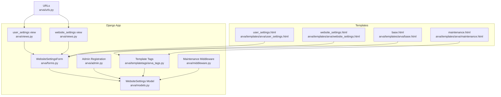
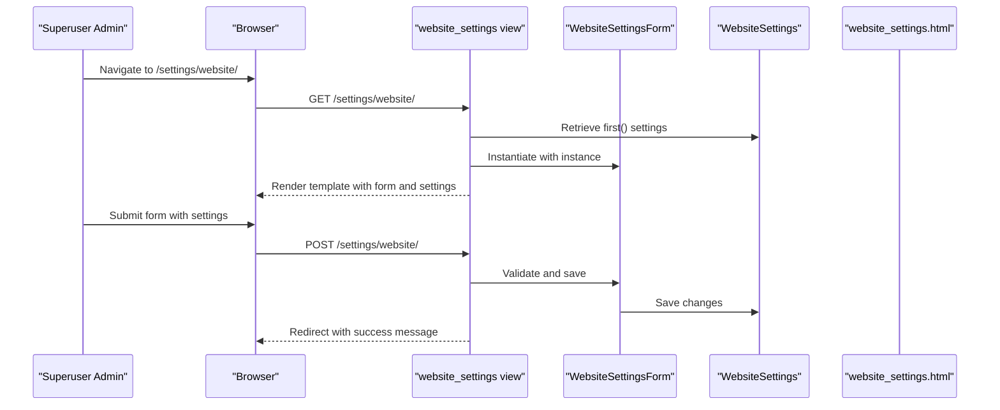
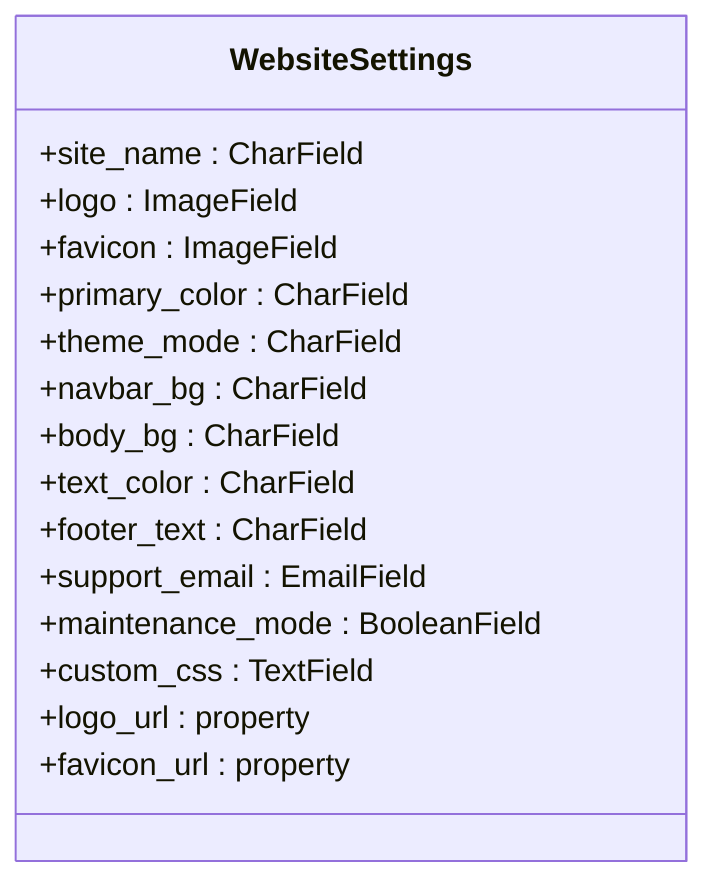
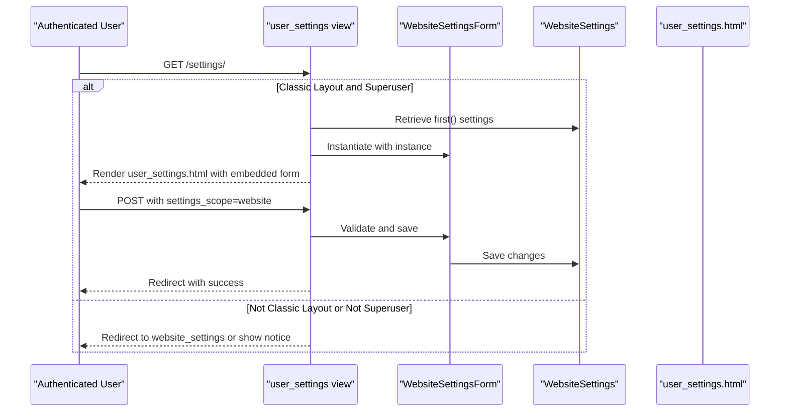
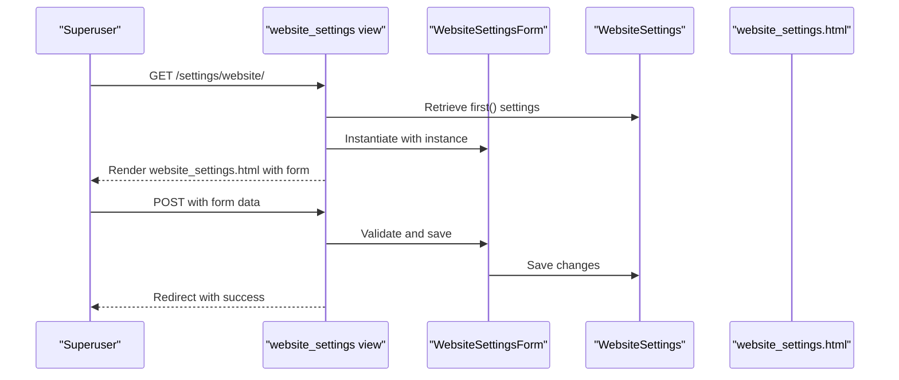
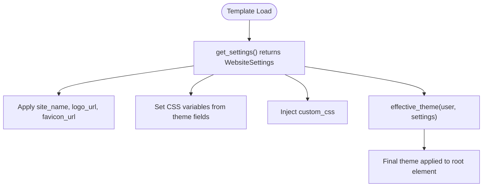
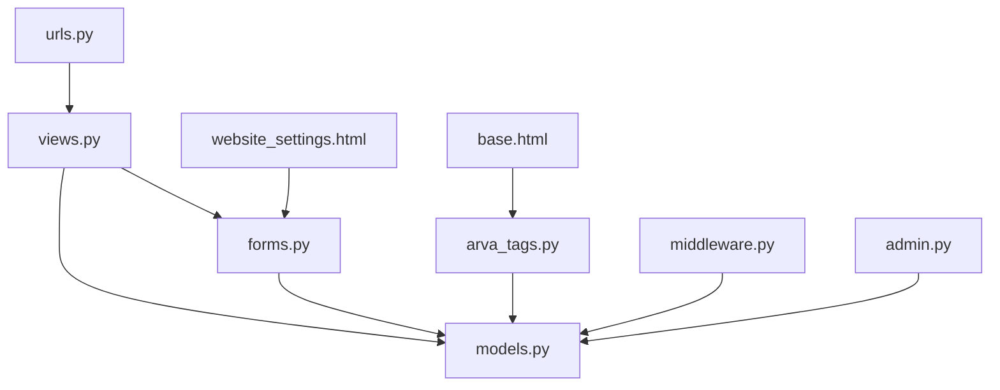

# Website Settings Management

<cite>
**Referenced Files in This Document**
- [models.py](file://arva/models.py)
- [admin.py](file://arva/admin.py)
- [forms.py](file://arva/forms.py)
- [views.py](file://arva/views.py)
- [website_settings.html](file://arva/templates/arva/website_settings.html)
- [user_settings.html](file://arva/templates/arva/user_settings.html)
- [base.html](file://arva/templates/arva/base.html)
- [arva_tags.py](file://arva/templatetags/arva_tags.py)
- [middleware.py](file://arva/middleware.py)
- [urls.py](file://arva/urls.py)
- [maintenance.html](file://arva/templates/arva/maintenance.html)
</cite>

## Table of Contents
1. [Introduction](#introduction)
2. [Project Structure](#project-structure)
3. [Core Components](#core-components)
4. [Architecture Overview](#architecture-overview)
5. [Detailed Component Analysis](#detailed-component-analysis)
6. [Dependency Analysis](#dependency-analysis)
7. [Performance Considerations](#performance-considerations)
8. [Troubleshooting Guide](#troubleshooting-guide)
9. [Conclusion](#conclusion)
10. [Appendices](#appendices)

## Introduction
This document explains the Website Settings management system in Arva Kanban. It covers the WebsiteSettings model that stores global application configuration (branding, theme, and system preferences), the Django admin interface for administrators, the settings page implementation and form validation, retrieval mechanisms in views and templates, caching strategies, default value fallbacks, and practical examples for accessing settings in templates and views. It also includes guidance for adding new settings fields, migration strategies, backup and restore procedures, and security considerations for sensitive configuration values.

## Project Structure
Website settings are implemented as a singleton-like model with a dedicated admin interface and two user-facing pages:
- A unified settings page for Classic Layout users (superusers)
- A dedicated Website Settings page for Sidebar Layout users (superusers)
- Global retrieval via a template tag and middleware for maintenance mode
- Base templates integrate settings into branding, theming, and layout

**Diagram sources**
- [models.py](file://arva/models.py#L15-L54)
- [forms.py](file://arva/forms.py#L21-L48)
- [views.py](file://arva/views.py#L136-L188)
- [admin.py](file://arva/admin.py#L49-L49)
- [arva_tags.py](file://arva/templatetags/arva_tags.py#L6-L8)
- [middleware.py](file://arva/middleware.py#L24-L38)
- [website_settings.html](file://arva/templates/arva/website_settings.html#L1-L154)
- [user_settings.html](file://arva/templates/arva/user_settings.html#L61-L156)
- [base.html](file://arva/templates/arva/base.html#L1-L362)
- [maintenance.html](file://arva/templates/arva/maintenance.html#L1-L359)
- [urls.py](file://arva/urls.py#L80-L84)

**Section sources**
- [models.py](file://arva/models.py#L15-L54)
- [admin.py](file://arva/admin.py#L49-L49)
- [forms.py](file://arva/forms.py#L21-L48)
- [views.py](file://arva/views.py#L136-L188)
- [website_settings.html](file://arva/templates/arva/website_settings.html#L1-L154)
- [user_settings.html](file://arva/templates/arva/user_settings.html#L61-L156)
- [base.html](file://arva/templates/arva/base.html#L1-L362)
- [arva_tags.py](file://arva/templatetags/arva_tags.py#L6-L8)
- [middleware.py](file://arva/middleware.py#L24-L38)
- [urls.py](file://arva/urls.py#L80-L84)

## Core Components
- WebsiteSettings model: Stores site-wide branding and theme preferences, with sensible defaults and property helpers for URLs.
- WebsiteSettingsForm: ModelForm for editing WebsiteSettings with appropriate widgets and field selection.
- Views: Two entry points for settings management, one unified page for Classic Layout and a dedicated page for Sidebar Layout.
- Templates: Dedicated settings pages and a unified settings page; base template integrates settings into branding and theming.
- Template tags: Provide global access to WebsiteSettings and effective theme/layout computation.
- Middleware: Enforces maintenance mode using cached WebsiteSettings.
- Admin: Registers WebsiteSettings for administration.

Key model fields include site_name, logo, favicon, primary_color, theme_mode, navbar_bg, body_bg, text_color, footer_text, support_email, maintenance_mode, and custom_css. Property helpers provide default fallbacks for image URLs.

**Section sources**
- [models.py](file://arva/models.py#L15-L54)
- [forms.py](file://arva/forms.py#L21-L48)
- [views.py](file://arva/views.py#L136-L188)
- [website_settings.html](file://arva/templates/arva/website_settings.html#L24-L148)
- [user_settings.html](file://arva/templates/arva/user_settings.html#L61-L156)
- [base.html](file://arva/templates/arva/base.html#L10-L12)
- [arva_tags.py](file://arva/templatetags/arva_tags.py#L6-L8)
- [middleware.py](file://arva/middleware.py#L24-L38)
- [admin.py](file://arva/admin.py#L49-L49)

## Architecture Overview
The settings system follows a layered pattern:
- Data layer: WebsiteSettings model persists configuration.
- Presentation layer: Forms and templates render and collect settings.
- Control layer: Views handle requests and enforce permissions.
- Integration layer: Template tags and base templates expose settings globally; middleware applies maintenance mode.

**Diagram sources**
- [views.py](file://arva/views.py#L162-L188)
- [forms.py](file://arva/forms.py#L21-L48)
- [models.py](file://arva/models.py#L15-L54)
- [website_settings.html](file://arva/templates/arva/website_settings.html#L24-L148)
- [urls.py](file://arva/urls.py#L82-L82)

## Detailed Component Analysis

### WebsiteSettings Model
The WebsiteSettings model defines global application configuration with defaults and helper properties for branding assets.

- Defaults: Many fields have sensible defaults (e.g., site_name, primary_color, theme_mode, footer_text, support_email, maintenance_mode).
- Assets: logo and favicon are optional images with upload paths; properties provide fallback URLs when absent.
- Theme: theme_mode supports light, dark, auto modes; custom CSS allows runtime styling overrides.

**Diagram sources**
- [models.py](file://arva/models.py#L15-L54)

**Section sources**
- [models.py](file://arva/models.py#L15-L54)

### Django Admin Interface
WebsiteSettings is registered in the Django admin, allowing administrators to edit settings via the admin UI.

- Registration: admin.site.register(WebsiteSettings) registers the model in the admin.
- Access: Administrators can navigate to the Website Settings section in the admin panel to modify fields.

**Section sources**
- [admin.py](file://arva/admin.py#L49-L49)

### Settings Page Implementation
There are two settings pages depending on the user’s layout preference:
- Unified Settings (Classic Layout): Superusers can edit WebsiteSettings directly from the user settings page.
- Dedicated Website Settings (Sidebar Layout): A separate page for editing WebsiteSettings.

Both pages use WebsiteSettingsForm and render the same set of fields.

**Diagram sources**
- [views.py](file://arva/views.py#L136-L160)
- [user_settings.html](file://arva/templates/arva/user_settings.html#L61-L156)

**Diagram sources**
- [views.py](file://arva/views.py#L162-L188)
- [website_settings.html](file://arva/templates/arva/website_settings.html#L24-L148)

**Section sources**
- [views.py](file://arva/views.py#L136-L188)
- [website_settings.html](file://arva/templates/arva/website_settings.html#L24-L148)
- [user_settings.html](file://arva/templates/arva/user_settings.html#L61-L156)

### Form Validation and Field Selection
WebsiteSettingsForm is a ModelForm that selects and renders the relevant fields with appropriate widgets:
- Fields: site_name, logo, favicon, primary_color, theme_mode, navbar_bg, body_bg, text_color, footer_text, support_email, maintenance_mode, custom_css.
- Widgets: TextInput for text fields, EmailInput for emails, Select for theme_mode, Textarea for custom_css, and color pickers for themed colors.

Validation occurs automatically via Django’s ModelForm validation; additional server-side validation is handled in views (e.g., permission checks).

**Section sources**
- [forms.py](file://arva/forms.py#L21-L48)

### Settings Retrieval Mechanisms
- Template Tag: get_settings returns the WebsiteSettings instance for global use in templates.
- Base Template Integration: The base template loads settings and applies branding, favicon, theme variables, and custom CSS.
- Effective Theme: effective_theme computes the effective theme considering user profile preferences and global settings.
- Middleware: MaintenanceModeMiddleware retrieves WebsiteSettings from cache or database and enforces maintenance mode for non-superusers.

**Diagram sources**
- [arva_tags.py](file://arva/templatetags/arva_tags.py#L6-L19)
- [base.html](file://arva/templates/arva/base.html#L10-L179)

**Section sources**
- [arva_tags.py](file://arva/templatetags/arva_tags.py#L6-L19)
- [base.html](file://arva/templates/arva/base.html#L10-L179)
- [middleware.py](file://arva/middleware.py#L24-L38)

### Default Value Fallbacks
- Image URLs: logo_url and favicon_url fall back to default static images when no asset is uploaded.
- Theme Variables: CSS variables in base.html use defaults if settings are missing.
- Maintenance Mode: If WebsiteSettings does not exist, maintenance mode is not enforced.

**Section sources**
- [models.py](file://arva/models.py#L44-L54)
- [base.html](file://arva/templates/arva/base.html#L26-L40)

### Practical Examples

- Accessing settings in templates:
  - Use the get_settings template tag to retrieve the WebsiteSettings instance.
  - Reference site_name, logo_url, favicon_url, and theme variables in the base template.
  - Example snippet path: [base.html](file://arva/templates/arva/base.html#L3-L12)

- Modifying settings programmatically:
  - Retrieve the WebsiteSettings instance and update fields; save to persist changes.
  - Example snippet path: [models.py](file://arva/models.py#L15-L54)

- Implementing custom settings fields:
  - Add a new field to WebsiteSettings with a default value.
  - Include the field in WebsiteSettingsForm.Meta.fields.
  - Update templates to display and use the new field.
  - Example snippet path: [models.py](file://arva/models.py#L26-L40), [forms.py](file://arva/forms.py#L24-L37)

- Permissions and routing:
  - website_settings requires superuser; redirects others appropriately.
  - user_settings embeds WebsiteSettings editing for Classic Layout superusers.
  - Example snippet path: [views.py](file://arva/views.py#L162-L188), [urls.py](file://arva/urls.py#L80-L84)

**Section sources**
- [base.html](file://arva/templates/arva/base.html#L3-L12)
- [models.py](file://arva/models.py#L15-L54)
- [forms.py](file://arva/forms.py#L21-L48)
- [views.py](file://arva/views.py#L162-L188)
- [urls.py](file://arva/urls.py#L80-L84)

## Dependency Analysis
The settings system has clear boundaries and minimal coupling:
- Views depend on WebsiteSettingsForm and WebsiteSettings.
- Templates depend on WebsiteSettings via template tags and base template integration.
- Middleware depends on WebsiteSettings for maintenance enforcement.
- Admin depends on WebsiteSettings for management.

**Diagram sources**
- [views.py](file://arva/views.py#L19-L30)
- [forms.py](file://arva/forms.py#L5-L9)
- [models.py](file://arva/models.py#L15-L54)
- [website_settings.html](file://arva/templates/arva/website_settings.html#L24-L148)
- [urls.py](file://arva/urls.py#L80-L84)
- [arva_tags.py](file://arva/templatetags/arva_tags.py#L6-L8)
- [base.html](file://arva/templates/arva/base.html#L3-L5)
- [middleware.py](file://arva/middleware.py#L24-L38)
- [admin.py](file://arva/admin.py#L49-L49)

**Section sources**
- [views.py](file://arva/views.py#L19-L30)
- [forms.py](file://arva/forms.py#L5-L9)
- [models.py](file://arva/models.py#L15-L54)
- [website_settings.html](file://arva/templates/arva/website_settings.html#L24-L148)
- [urls.py](file://arva/urls.py#L80-L84)
- [arva_tags.py](file://arva/templatetags/arva_tags.py#L6-L8)
- [base.html](file://arva/templates/arva/base.html#L3-L5)
- [middleware.py](file://arva/middleware.py#L24-L38)
- [admin.py](file://arva/admin.py#L49-L49)

## Performance Considerations
- Caching: MaintenanceModeMiddleware caches WebsiteSettings in Django cache for 30 seconds to reduce database queries during maintenance checks.
- Template rendering: get_settings is called once per template load; repeated access reuses the same instance.
- Asset delivery: Static fallbacks prevent unnecessary database lookups for missing images.

Recommendations:
- Keep cache timeout reasonable for maintenance mode while avoiding excessive reloads.
- Consider caching WebsiteSettings in views where frequently accessed across multiple requests.
- Use CDN for static fallback images if scaling.

**Section sources**
- [middleware.py](file://arva/middleware.py#L24-L38)
- [arva_tags.py](file://arva/templatetags/arva_tags.py#L6-L8)

## Troubleshooting Guide
Common issues and resolutions:
- Maintenance mode blocking non-superusers:
  - Verify WebsiteSettings.maintenance_mode is enabled and user is not superuser.
  - Check cache key "website_settings" and TTL.
  - Example snippet path: [middleware.py](file://arva/middleware.py#L24-L38), [maintenance.html](file://arva/templates/arva/maintenance.html#L1-L359)

- Settings not updating:
  - Confirm superuser permissions and correct URL (/settings/website/ or embedded in /settings/).
  - Ensure CSRF token is present in forms.
  - Example snippet path: [views.py](file://arva/views.py#L162-L188), [website_settings.html](file://arva/templates/arva/website_settings.html#L24-L148)

- Branding not applying:
  - Check get_settings template tag and base.html integration.
  - Verify favicon_url and logo_url fallbacks.
  - Example snippet path: [base.html](file://arva/templates/arva/base.html#L10-L12), [models.py](file://arva/models.py#L44-L54)

- Permission denied:
  - website_settings enforces superuser; redirect to user_settings or show message.
  - Example snippet path: [views.py](file://arva/views.py#L162-L166)

**Section sources**
- [middleware.py](file://arva/middleware.py#L24-L38)
- [maintenance.html](file://arva/templates/arva/maintenance.html#L1-L359)
- [views.py](file://arva/views.py#L162-L166)
- [website_settings.html](file://arva/templates/arva/website_settings.html#L24-L148)
- [base.html](file://arva/templates/arva/base.html#L10-L12)
- [models.py](file://arva/models.py#L44-L54)

## Conclusion
Arva Kanban’s Website Settings system provides a robust, maintainable way to manage global application configuration. The WebsiteSettings model centralizes branding and theme settings, WebsiteSettingsForm ensures validated edits, and both user-facing pages enable administrators to configure settings efficiently. Integration via template tags and base templates ensures consistent presentation, while middleware and caching optimize performance and enforce maintenance mode. The system is extensible for future settings additions and supports secure, scalable deployment.

## Appendices

### Adding New Settings Fields
Steps:
1. Extend WebsiteSettings with a new field and default value.
2. Add the field to WebsiteSettingsForm.Meta.fields.
3. Update templates to render and use the new field.
4. Run migrations to persist schema changes.

Example snippet paths:
- [models.py](file://arva/models.py#L26-L40)
- [forms.py](file://arva/forms.py#L24-L37)
- [website_settings.html](file://arva/templates/arva/website_settings.html#L24-L148)
- [user_settings.html](file://arva/templates/arva/user_settings.html#L61-L156)

**Section sources**
- [models.py](file://arva/models.py#L26-L40)
- [forms.py](file://arva/forms.py#L24-L37)
- [website_settings.html](file://arva/templates/arva/website_settings.html#L24-L148)
- [user_settings.html](file://arva/templates/arva/user_settings.html#L61-L156)

### Backup and Restore Procedures
- Database-level backup: Back up the WebsiteSettings row(s) via database dump/backup tools.
- Export/import: Use Django fixtures or raw SQL to export/import the WebsiteSettings record.
- Version control: Track WebsiteSettings defaults in code comments or documentation for reproducibility.

[No sources needed since this section provides general guidance]

### Security Considerations
- Sensitive values: Avoid storing secrets in WebsiteSettings; use environment variables or Django settings for sensitive configuration.
- File uploads: Validate and sanitize uploaded logo and favicon files; restrict MIME types and sizes.
- Permissions: Restrict WebsiteSettings editing to superusers only.
- Maintenance mode: Ensure maintenance mode is only enabled by trusted administrators.

[No sources needed since this section provides general guidance]