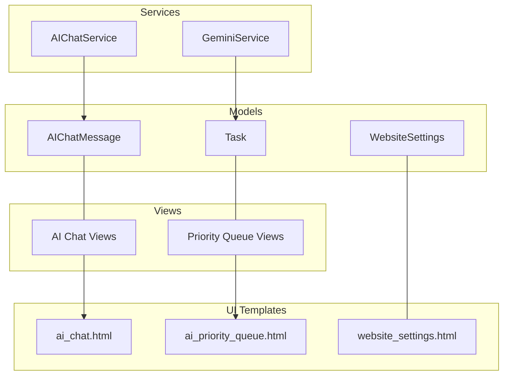
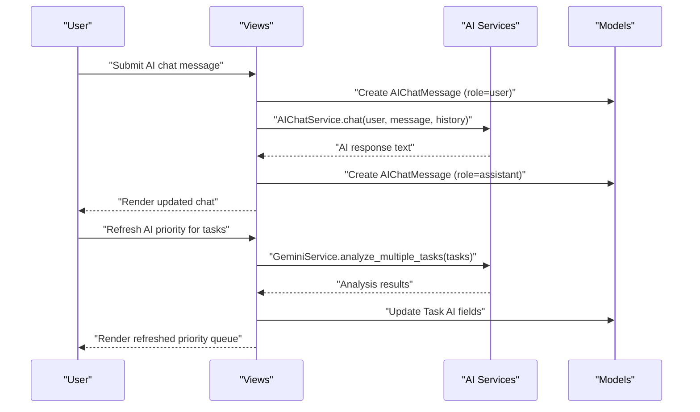
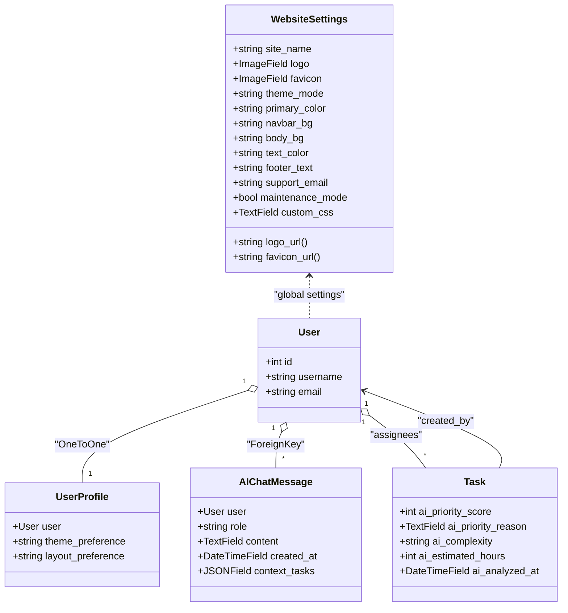
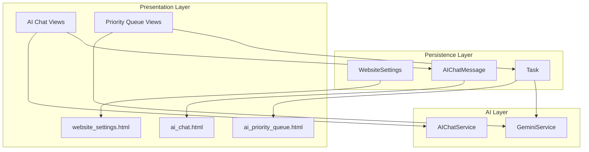
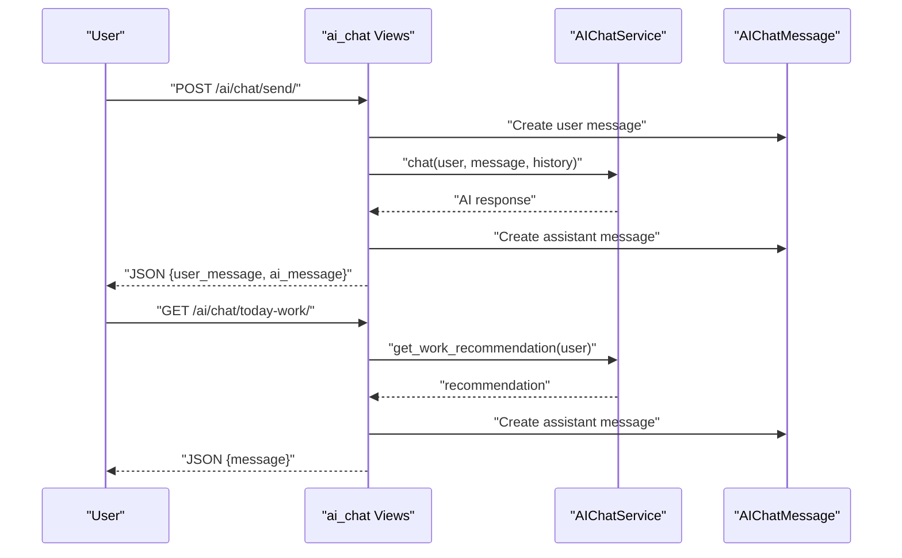
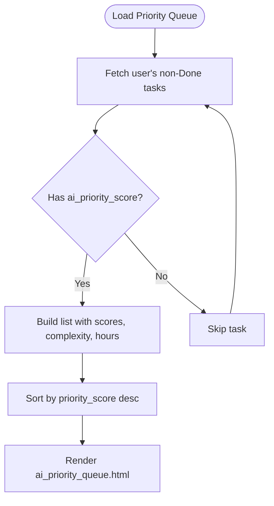

# AI System Models

<cite>
**Referenced Files in This Document**
- [models.py](file://arva/models.py)
- [ai_services.py](file://arva/ai_services.py)
- [views.py](file://arva/views.py)
- [forms.py](file://arva/forms.py)
- [website_settings.html](file://arva/templates/arva/website_settings.html)
- [ai_chat.html](file://arva/templates/arva/ai_chat.html)
- [ai_priority_queue.html](file://arva/templates/arva/ai_priority_queue.html)
</cite>

## Table of Contents
1. [Introduction](#introduction)
2. [Project Structure](#project-structure)
3. [Core Components](#core-components)
4. [Architecture Overview](#architecture-overview)
5. [Detailed Component Analysis](#detailed-component-analysis)
6. [Dependency Analysis](#dependency-analysis)
7. [Performance Considerations](#performance-considerations)
8. [Troubleshooting Guide](#troubleshooting-guide)
9. [Conclusion](#conclusion)

## Introduction
This document provides detailed data model documentation for AI-related entities in the system, focusing on WebsiteSettings and AIChatMessage models. It also explains the AI priority analysis fields integrated into the Task model and demonstrates how these models support AI features such as chat history persistence and website-wide theme management. The integration between AI models and the main task management system is covered, including how AI-generated insights are stored and surfaced in the user interface.

## Project Structure
The AI system spans several modules:
- Data models: WebsiteSettings, AIChatMessage, and Task (with AI priority fields)
- AI services: GeminiService for task priority analysis and AIChatService for conversational assistance
- Views: Endpoints for AI chat, priority queue, and refreshing AI analysis
- Forms and templates: Website settings form and UI templates for chat and priority queue

**Diagram sources**
- [models.py](file://arva/models.py#L15-L54)
- [models.py](file://arva/models.py#L430-L444)
- [models.py](file://arva/models.py#L252-L314)
- [ai_services.py](file://arva/ai_services.py#L11-L326)
- [views.py](file://arva/views.py#L2218-L2323)
- [views.py](file://arva/views.py#L2111-L2206)
- [website_settings.html](file://arva/templates/arva/website_settings.html#L1-L154)
- [ai_chat.html](file://arva/templates/arva/ai_chat.html#L1-L912)
- [ai_priority_queue.html](file://arva/templates/arva/ai_priority_queue.html#L1-L200)

**Section sources**
- [models.py](file://arva/models.py#L15-L54)
- [models.py](file://arva/models.py#L430-L444)
- [models.py](file://arva/models.py#L252-L314)
- [ai_services.py](file://arva/ai_services.py#L11-L326)
- [views.py](file://arva/views.py#L2218-L2323)
- [views.py](file://arva/views.py#L2111-L2206)
- [website_settings.html](file://arva/templates/arva/website_settings.html#L1-L154)
- [ai_chat.html](file://arva/templates/arva/ai_chat.html#L1-L912)
- [ai_priority_queue.html](file://arva/templates/arva/ai_priority_queue.html#L1-L200)

## Core Components
- WebsiteSettings: Centralizes global application settings including theme configuration, branding assets, and maintenance mode. Provides computed URLs for logo and favicon and supports custom CSS.
- AIChatMessage: Stores user-AI conversations with role-based messaging and context preservation. Maintains a JSON field for referenced task IDs to anchor context.
- Task (AI fields): Extends Task with AI priority analysis fields: ai_priority_score, ai_priority_reason, ai_complexity, ai_estimated_hours, and ai_analyzed_at.

Validation and relationships:
- WebsiteSettings enforces no explicit model-level validators; validation occurs via WebsiteSettingsForm.
- AIChatMessage enforces role choices and stores content and timestamps; context_tasks is a JSON array of task IDs.
- Task AI fields are optional integers/text fields with nullable support; ai_analyzed_at tracks freshness.

**Section sources**
- [models.py](file://arva/models.py#L15-L54)
- [models.py](file://arva/models.py#L430-L444)
- [models.py](file://arva/models.py#L252-L314)
- [forms.py](file://arva/forms.py#L21-L48)

## Architecture Overview
The AI system integrates three pillars:
- Data models persist AI insights and chat history.
- AI services encapsulate external API calls to Gemini for analysis and chat.
- Views orchestrate user interactions, persisting chat messages and refreshing AI analysis for tasks.

**Diagram sources**
- [views.py](file://arva/views.py#L2232-L2291)
- [views.py](file://arva/views.py#L2155-L2202)
- [ai_services.py](file://arva/ai_services.py#L196-L322)
- [ai_services.py](file://arva/ai_services.py#L115-L166)
- [models.py](file://arva/models.py#L430-L444)
- [models.py](file://arva/models.py#L252-L314)

## Detailed Component Analysis

### WebsiteSettings Model
WebsiteSettings centralizes global application configuration:
- Theme configuration: theme_mode with choices light/dark/auto; primary_color, navbar_bg, body_bg, text_color.
- Branding: logo and favicon ImageFields with upload paths; footer_text and support_email.
- Maintenance: maintenance_mode flag.
- Custom CSS: custom_css text area for advanced theming.
- Computed properties: logo_url and favicon_url with fallbacks.

Field definitions and validation:
- site_name: CharField with default.
- logo/favicon: ImageField with custom upload_to paths.
- theme_mode: CharField with predefined choices.
- Colors: CharField with default hex values.
- footer_text/support_email: CharField and EmailField with defaults.
- maintenance_mode: BooleanField default False.
- custom_css: TextField allowing null/blank.

Usage in UI:
- website_settings.html renders a comprehensive form to edit all fields.
- WebsiteSettingsForm maps model fields to form widgets and validation.

Integration with theme management:
- User profile theme_preference influences per-user theme overrides.
- WebsiteSettings controls global theme defaults and branding.

**Section sources**
- [models.py](file://arva/models.py#L15-L54)
- [forms.py](file://arva/forms.py#L21-L48)
- [website_settings.html](file://arva/templates/arva/website_settings.html#L1-L154)

### AIChatMessage Model
AIChatMessage persists user-AI conversations with:
- user: ForeignKey to User (private per user).
- role: CharField with choices user/assistant.
- content: TextField for message text.
- created_at: DateTimeField auto-added.
- context_tasks: JSONField storing referenced task IDs as a list.

Behavior:
- Ordering by created_at ensures chronological display.
- context_tasks enables context-aware chat by anchoring to specific tasks.

UI integration:
- ai_chat.html displays chat history and provides actions to ask today’s work and clear chat.
- Views handle creation of user and assistant messages and maintain recent chat history for context.

**Section sources**
- [models.py](file://arva/models.py#L430-L444)
- [ai_chat.html](file://arva/templates/arva/ai_chat.html#L1-L912)
- [views.py](file://arva/views.py#L2218-L2323)

### Task AI Priority Analysis Fields
The Task model includes AI-driven fields for priority analysis:
- ai_priority_score: IntegerField nullable, range 1–100.
- ai_priority_reason: TextField blank for AI reasoning.
- ai_complexity: CharField blank for estimated complexity level.
- ai_estimated_hours: IntegerField nullable for time estimate.
- ai_analyzed_at: DateTimeField nullable for freshness tracking.

Processing pipeline:
- GeminiService builds a comprehensive task context including checklist progress, due date urgency, assignees, labels, and project context.
- AI prompt weights deadline urgency, complexity/scope, dependencies impact, and current progress.
- Results parsed as JSON and mapped to Task fields; analyzed_at captures timestamp.

Views integration:
- ai_priority_refresh endpoint triggers batch analysis and saves results to tasks.
- ai_chat_today_work leverages AIChatService to generate daily work recommendations and persists them as AIChatMessage entries.

**Section sources**
- [models.py](file://arva/models.py#L252-L314)
- [ai_services.py](file://arva/ai_services.py#L23-L166)
- [ai_services.py](file://arva/ai_services.py#L196-L322)
- [views.py](file://arva/views.py#L2155-L2206)
- [views.py](file://arva/views.py#L2294-L2322)

### Data Model Relationships

**Diagram sources**
- [models.py](file://arva/models.py#L15-L54)
- [models.py](file://arva/models.py#L430-L444)
- [models.py](file://arva/models.py#L252-L314)

## Architecture Overview
The AI system architecture connects models, services, views, and templates:
- Models store persistent state for website settings, chat history, and task AI insights.
- AI services encapsulate external Gemini API interactions and build prompts/context.
- Views coordinate user actions, persist data, and render AI-enhanced UI.

**Diagram sources**
- [models.py](file://arva/models.py#L15-L54)
- [models.py](file://arva/models.py#L430-L444)
- [models.py](file://arva/models.py#L252-L314)
- [ai_services.py](file://arva/ai_services.py#L11-L326)
- [views.py](file://arva/views.py#L2218-L2323)
- [views.py](file://arva/views.py#L2111-L2206)
- [ai_chat.html](file://arva/templates/arva/ai_chat.html#L1-L912)
- [ai_priority_queue.html](file://arva/templates/arva/ai_priority_queue.html#L1-L200)
- [website_settings.html](file://arva/templates/arva/website_settings.html#L1-L154)

## Detailed Component Analysis

### WebsiteSettings Field Reference
- site_name: CharField, default value applied.
- logo: ImageField, upload_to branding/logo/.
- favicon: ImageField, upload_to branding/favicon/.
- primary_color: CharField, default hex color.
- theme_mode: CharField with choices light/dark/auto.
- navbar_bg: CharField, default hex color.
- body_bg: CharField, default hex color.
- text_color: CharField, default hex color.
- footer_text: CharField, default footer text.
- support_email: EmailField, default support email.
- maintenance_mode: BooleanField, default False.
- custom_css: TextField, allows null/blank.

Computed properties:
- logo_url: Returns uploaded URL or default static image.
- favicon_url: Returns uploaded URL or default static image.

Validation:
- WebsiteSettingsForm defines field widgets and validation for all editable fields.

**Section sources**
- [models.py](file://arva/models.py#L15-L54)
- [forms.py](file://arva/forms.py#L21-L48)
- [website_settings.html](file://arva/templates/arva/website_settings.html#L1-L154)

### AIChatMessage Field Reference
- user: ForeignKey(User, related_name='ai_chat_messages').
- role: CharField with choices ('user', 'assistant').
- content: TextField for message text.
- created_at: DateTimeField auto_now_add=True.
- context_tasks: JSONField default=[], blank=True, stores referenced task IDs.

Ordering:
- Meta ordering by created_at ascending.

**Section sources**
- [models.py](file://arva/models.py#L430-L444)
- [ai_chat.html](file://arva/templates/arva/ai_chat.html#L1-L912)

### Task AI Priority Analysis Fields Reference
- ai_priority_score: IntegerField, nullable, 1–100 scale.
- ai_priority_reason: TextField, blank=True.
- ai_complexity: CharField, blank=True.
- ai_estimated_hours: IntegerField, nullable.
- ai_analyzed_at: DateTimeField, nullable.

Processing logic:
- GeminiService constructs task context including checklist progress, due date urgency, assignees, labels, and project info.
- Prompt weights four factors: deadline urgency, complexity/scope, dependencies impact, current progress.
- Results parsed and saved to Task fields; analyzed_at captures timestamp.

**Section sources**
- [models.py](file://arva/models.py#L252-L314)
- [ai_services.py](file://arva/ai_services.py#L23-L166)
- [ai_services.py](file://arva/ai_services.py#L196-L322)

### AI Chat Workflow

**Diagram sources**
- [views.py](file://arva/views.py#L2232-L2291)
- [views.py](file://arva/views.py#L2294-L2322)
- [ai_services.py](file://arva/ai_services.py#L196-L322)
- [models.py](file://arva/models.py#L430-L444)

### AI Priority Queue Workflow

**Diagram sources**
- [views.py](file://arva/views.py#L2111-L2151)
- [ai_priority_queue.html](file://arva/templates/arva/ai_priority_queue.html#L1-L200)

## Dependency Analysis
- Models:
  - WebsiteSettings: standalone global settings entity.
  - AIChatMessage: depends on User; private per user; JSON context field.
  - Task: extended with AI fields; integrates with GeminiService for analysis.
- Services:
  - GeminiService: requires GEMINI_API_KEY; builds prompts and parses JSON responses.
  - AIChatService: builds user task context and system prompt; maintains chat history.
- Views:
  - ai_chat views: create/delete messages, integrate with AIChatService.
  - priority queue views: analyze tasks via GeminiService and update Task AI fields.
- Templates:
  - ai_chat.html: renders chat UI and handles user actions.
  - ai_priority_queue.html: displays AI-ranked tasks and refresh controls.
  - website_settings.html: edits WebsiteSettings via WebsiteSettingsForm.

Potential circular dependencies:
- None observed among models/services/views; separation of concerns is clear.

External dependencies:
- Google Gemini API via genai client; requires GEMINI_API_KEY in settings.

**Section sources**
- [models.py](file://arva/models.py#L15-L54)
- [models.py](file://arva/models.py#L430-L444)
- [models.py](file://arva/models.py#L252-L314)
- [ai_services.py](file://arva/ai_services.py#L11-L326)
- [views.py](file://arva/views.py#L2218-L2323)
- [views.py](file://arva/views.py#L2111-L2206)
- [website_settings.html](file://arva/templates/arva/website_settings.html#L1-L154)
- [ai_chat.html](file://arva/templates/arva/ai_chat.html#L1-L912)
- [ai_priority_queue.html](file://arva/templates/arva/ai_priority_queue.html#L1-L200)

## Performance Considerations
- AI analysis batching: Views limit tasks processed (e.g., 50) to avoid long-running requests.
- Select_related/prefetch_related: Services and views optimize queries to reduce N+1 issues.
- JSON context storage: context_tasks keeps referenced task IDs compact; consider indexing if used heavily in future filters.
- Freshness tracking: ai_analyzed_at prevents redundant API calls by enabling “only show cached analysis” behavior.

## Troubleshooting Guide
Common issues and resolutions:
- Missing GEMINI_API_KEY:
  - Symptom: AI service raises ValueError or responses indicate configuration error.
  - Resolution: Set GEMINI_API_KEY in Django settings or environment; ensure service factory retrieves it.
- Empty chat message:
  - Symptom: POST to /ai/chat/send/ returns error for empty message.
  - Resolution: Validate non-empty message server-side before processing.
- Maintenance mode:
  - Symptom: Website redirects to maintenance page when maintenance_mode is enabled.
  - Resolution: Disable maintenance_mode in WebsiteSettings to restore normal operation.
- Priority queue refresh failures:
  - Symptom: /ai/priority-refresh/ returns error indicating AI service not configured.
  - Resolution: Confirm GEMINI_API_KEY availability and retry; check service initialization.

**Section sources**
- [ai_services.py](file://arva/ai_services.py#L14-L21)
- [views.py](file://arva/views.py#L2236-L2237)
- [views.py](file://arva/views.py#L2193-L2197)
- [models.py](file://arva/models.py#L37-L37)

## Conclusion
The AI system models provide robust foundations for AI-assisted task management and user interaction:
- WebsiteSettings offers centralized theme and branding control with computed asset URLs.
- AIChatMessage enables private, context-aware chat with role-based persistence.
- Task AI fields integrate seamlessly with GeminiService to deliver actionable insights.
- Views and templates present AI features in an intuitive interface, supporting chat history persistence and priority queue refresh.

These components collectively enhance productivity by combining intelligent analysis with a cohesive user experience.