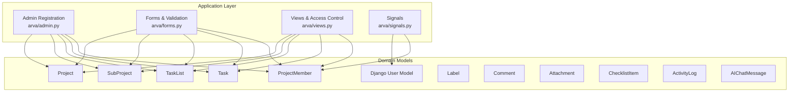
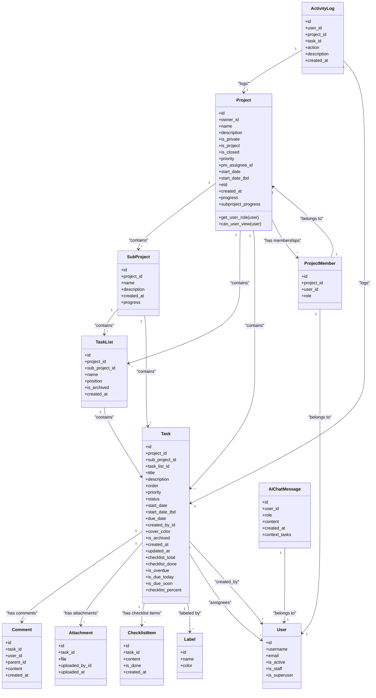
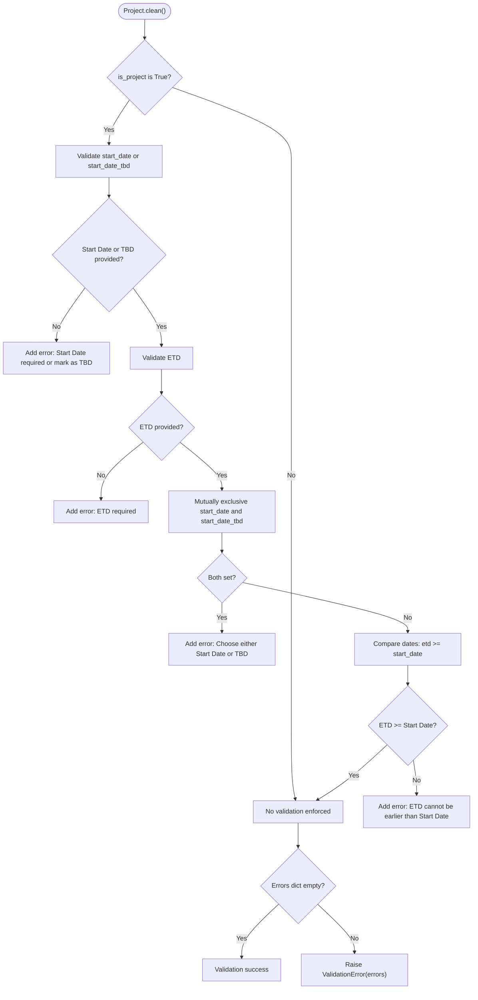
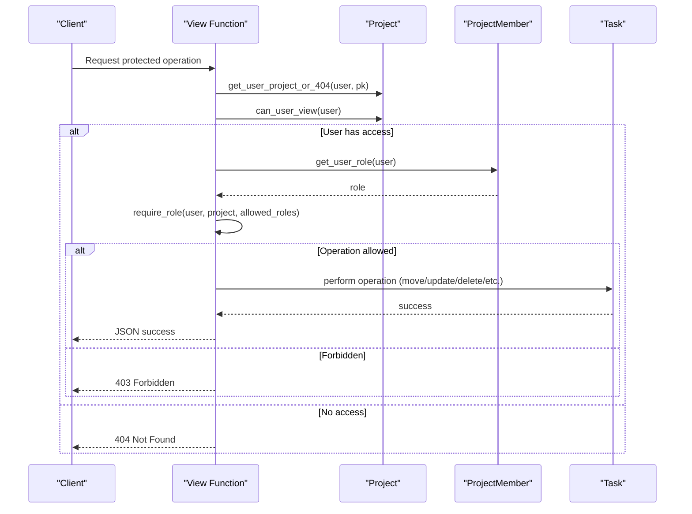
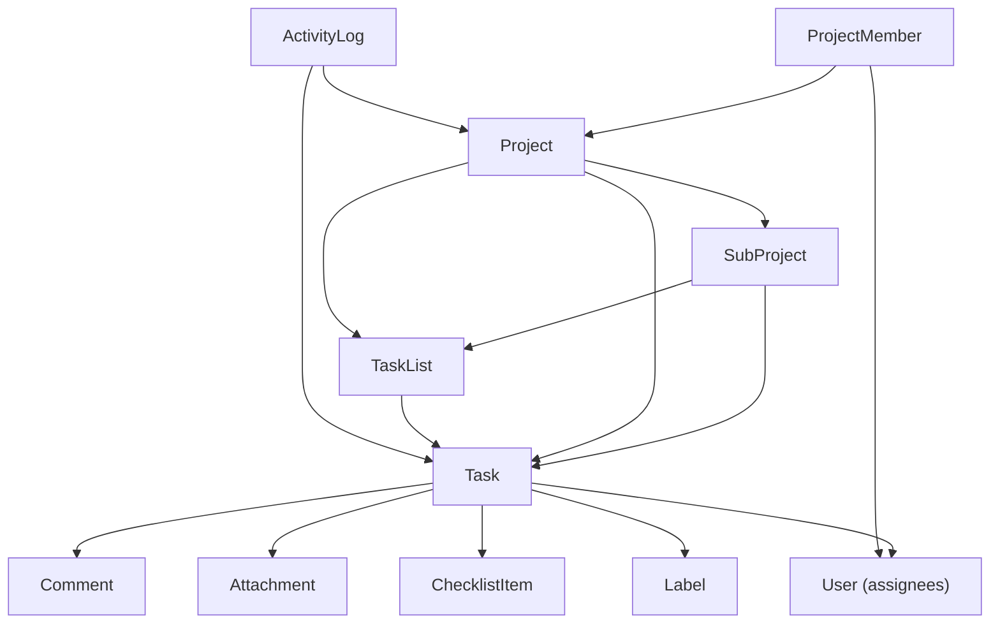

# Core Domain Models

<cite>
**Referenced Files in This Document**
- [arva/models.py](file://arva/models.py)
- [arva/admin.py](file://arva/admin.py)
- [arva/forms.py](file://arva/forms.py)
- [arva/views.py](file://arva/views.py)
- [arva/signals.py](file://arva/signals.py)
</cite>

## Table of Contents
1. [Introduction](#introduction)
2. [Project Structure](#project-structure)
3. [Core Components](#core-components)
4. [Architecture Overview](#architecture-overview)
5. [Detailed Component Analysis](#detailed-component-analysis)
6. [Dependency Analysis](#dependency-analysis)
7. [Performance Considerations](#performance-considerations)
8. [Troubleshooting Guide](#troubleshooting-guide)
9. [Conclusion](#conclusion)

## Introduction
This document provides comprehensive data model documentation for the core domain entities in the Arva Kanban application. It focuses on the fundamental models that represent the project hierarchy and task management system: Project, SubProject, TaskList, Task, and the access control mechanism through ProjectMember. The documentation covers field definitions, data types, primary/foreign key relationships, model-level validation logic, business constraints, ordering mechanisms, and performance considerations. It also explains how these models integrate with Django's User model and how role-based access control is implemented.

## Project Structure
The core domain models are defined in the application's models module and are registered in the Django admin for management. Forms encapsulate validation logic for user input, while views orchestrate the business logic and enforce access controls. Signals handle automatic profile creation upon user registration.

**Diagram sources**
- [arva/admin.py](file://arva/admin.py#L1-L50)
- [arva/forms.py](file://arva/forms.py#L1-L326)
- [arva/views.py](file://arva/views.py#L1-L2323)
- [arva/signals.py](file://arva/signals.py#L1-L86)
- [arva/models.py](file://arva/models.py#L1-L445)

**Section sources**
- [arva/admin.py](file://arva/admin.py#L1-L50)
- [arva/forms.py](file://arva/forms.py#L1-L326)
- [arva/views.py](file://arva/views.py#L1-L2323)
- [arva/signals.py](file://arva/signals.py#L1-L86)
- [arva/models.py](file://arva/models.py#L1-L445)

## Core Components
This section documents the core domain entities and their relationships, focusing on the hierarchical structure: Projects contain SubProjects, which contain TaskLists, which contain Tasks. It also covers the access control model through ProjectMember and its integration with Django's User model.

- Project
  - Purpose: Top-level container for work items, with project-level metadata and lifecycle controls.
  - Key fields: owner, name, description, is_private, is_project, is_closed, priority, pm_assignee, start_date, start_date_tbd, etd, created_at.
  - Relationships: One-to-many with SubProject (subprojects), Task (tasks), TaskList (lists), ProjectMember (memberships).
  - Validation: Model-level clean() enforces constraints for project tasks (start_date vs start_date_tbd, etd vs start_date).
  - Access control: get_user_role() determines access based on is_private, owner, and membership.
  - Properties: progress, subproject_progress, access_scope_label, shared_user_count.

- SubProject
  - Purpose: Logical subdivision within a Project, grouping related TaskLists and Tasks.
  - Key fields: project (FK), name, description, created_at.
  - Ordering: Meta ordering by created_at.
  - Properties: progress.

- TaskList
  - Purpose: Column-like containers for tasks within a project or subproject.
  - Key fields: project (FK), sub_project (FK), name, position, is_archived, created_at.
  - Ordering: Meta ordering by position.
  - Relationships: One-to-many with Task (tasks).

- Task
  - Purpose: Individual work items with lifecycle, priority, status, assignees, labels, and attachments.
  - Key fields: project (FK), sub_project (FK), task_list (FK), title, description, order, priority, status, start_date, start_date_tbd, due_date, created_by (FK), cover_color, is_archived, created_at, updated_at.
  - Many-to-many: labels (Label), assignees (User).
  - AI fields: ai_priority_score, ai_priority_reason, ai_complexity, ai_estimated_hours, ai_analyzed_at.
  - Ordering: Meta ordering by order, then -created_at.
  - Properties: checklist_total, checklist_done, is_overdue, is_due_today, is_due_soon, checklist_percent.

- ProjectMember
  - Purpose: Defines sharing and access for Users within a Project.
  - Key fields: project (FK), user (FK), role.
  - Unique constraint: unique_together (project, user).
  - Roles: admin, member, viewer (legacy; enforced as member in current implementation).
  - Integration: Used by Project.get_user_role() and views.require_role().

- Label
  - Purpose: Categorization tags for Tasks.
  - Key fields: name, color.

- Comment
  - Purpose: Threaded comments on Tasks.
  - Key fields: task (FK), user (FK), parent (self-FK), content, created_at.
  - Ordering: Meta ordering by created_at.

- Attachment
  - Purpose: File attachments linked to Tasks.
  - Key fields: task (FK), file, uploaded_by (FK), uploaded_at.

- ChecklistItem
  - Purpose: Items within a Task's checklist.
  - Key fields: task (FK), content, is_done, created_at.
  - Ordering: Meta ordering by id.

- ActivityLog
  - Purpose: Audit trail for actions performed on Projects and Tasks.
  - Key fields: user (FK), project (FK), task (FK), action, description, created_at.
  - Ordering: Meta ordering by -created_at.

- AIChatMessage
  - Purpose: Private chat history per User for AI assistant.
  - Key fields: user (FK), role, content, created_at, context_tasks.
  - Ordering: Meta ordering by created_at.

**Section sources**
- [arva/models.py](file://arva/models.py#L101-L188)
- [arva/models.py](file://arva/models.py#L189-L209)
- [arva/models.py](file://arva/models.py#L238-L248)
- [arva/models.py](file://arva/models.py#L252-L352)
- [arva/models.py](file://arva/models.py#L211-L229)
- [arva/models.py](file://arva/models.py#L231-L237)
- [arva/models.py](file://arva/models.py#L353-L365)
- [arva/models.py](file://arva/models.py#L366-L374)
- [arva/models.py](file://arva/models.py#L375-L385)
- [arva/models.py](file://arva/models.py#L387-L422)
- [arva/models.py](file://arva/models.py#L430-L445)

## Architecture Overview
The domain models form a hierarchical structure centered around Project. SubProject groups related work within a Project. TaskList organizes Tasks by workflow stages. Task represents individual work items with rich metadata and relationships. ProjectMember governs access and sharing. Forms and Views enforce business rules and access controls.

**Diagram sources**
- [arva/models.py](file://arva/models.py#L101-L188)
- [arva/models.py](file://arva/models.py#L189-L209)
- [arva/models.py](file://arva/models.py#L238-L248)
- [arva/models.py](file://arva/models.py#L252-L352)
- [arva/models.py](file://arva/models.py#L211-L229)
- [arva/models.py](file://arva/models.py#L231-L237)
- [arva/models.py](file://arva/models.py#L353-L365)
- [arva/models.py](file://arva/models.py#L366-L374)
- [arva/models.py](file://arva/models.py#L375-L385)
- [arva/models.py](file://arva/models.py#L387-L422)
- [arva/models.py](file://arva/models.py#L430-L445)

## Detailed Component Analysis

### Project Model
- Purpose: Root entity representing a project with lifecycle and access controls.
- Field definitions and types:
  - owner: ForeignKey(User, CASCADE, related_name='owned_projects')
  - name: CharField(max_length=255)
  - description: TextField(blank=True)
  - is_private: BooleanField(default=False)
  - is_project: BooleanField(default=False)
  - is_closed: BooleanField(default=False)
  - priority: CharField(choices=PRIORITY_CHOICES, default=PRIORITY_P2)
  - pm_assignee: ForeignKey(User, SET_NULL, null=True, blank=True, related_name='managed_projects')
  - start_date: DateField(null=True, blank=True)
  - start_date_tbd: BooleanField(default=False)
  - etd: DateField(null=True, blank=True)
  - created_at: DateTimeField(auto_now_add=True)
- Model-level validation (clean):
  - Enforces that when is_project=True, start_date or start_date_tbd must be set, and etd is required.
  - Ensures start_date and start_date_tbd are mutually exclusive.
  - Validates that etd >= start_date when both are present.
- Access control:
  - get_user_role(): Grants admin role if project is not private and user is owner or member; otherwise None.
  - can_user_view(): Returns whether user has access.
- Properties:
  - progress: Computes total, done, and percentage of tasks not archived.
  - subproject_progress: Aggregates progress across SubProjects.
  - access_scope_label: Human-readable access scope.
  - shared_user_count: Count of memberships.

**Diagram sources**
- [arva/models.py](file://arva/models.py#L131-L144)

**Section sources**
- [arva/models.py](file://arva/models.py#L101-L188)

### SubProject Model
- Purpose: Logical subdivision within a Project.
- Field definitions and types:
  - project: ForeignKey(Project, CASCADE, related_name='subprojects')
  - name: CharField(max_length=255)
  - description: TextField(blank=True)
  - created_at: DateTimeField(auto_now_add=True)
- Ordering: Meta ordering by created_at.
- Properties:
  - progress: Computes total, done, and percentage of tasks not archived.

**Section sources**
- [arva/models.py](file://arva/models.py#L189-L209)

### TaskList Model
- Purpose: Container for tasks organized by workflow stage.
- Field definitions and types:
  - project: ForeignKey(Project, CASCADE, related_name='lists')
  - sub_project: ForeignKey(SubProject, CASCADE, related_name='lists', null=True, blank=True)
  - name: CharField(max_length=255)
  - position: PositiveIntegerField(default=0)
  - is_archived: BooleanField(default=False)
  - created_at: DateTimeField(auto_now_add=True)
- Ordering: Meta ordering by position.

**Section sources**
- [arva/models.py](file://arva/models.py#L238-L248)

### Task Model
- Purpose: Individual work item with lifecycle, priority, status, assignees, labels, and attachments.
- Field definitions and types:
  - project: ForeignKey(Project, CASCADE, related_name='tasks')
  - sub_project: ForeignKey(SubProject, CASCADE, related_name='tasks', null=True, blank=True)
  - task_list: ForeignKey(TaskList, CASCADE, related_name='tasks')
  - title: CharField(max_length=255)
  - description: TextField(blank=True)
  - order: PositiveIntegerField(default=0)
  - priority: CharField(choices=PRIORITY_CHOICES, default=PRIORITY_P2)
  - status: CharField(choices=STATUS_CHOICES, default=STATUS_NONE)
  - start_date: DateField(null=True, blank=True)
  - start_date_tbd: BooleanField(default=False)
  - due_date: DateField(null=True, blank=True)
  - created_by: ForeignKey(User, SET_NULL, null=True, related_name='created_tasks')
  - labels: ManyToManyField(Label, blank=True, related_name='tasks')
  - assignees: ManyToManyField(User, blank=True, related_name='assigned_tasks')
  - cover_color: CharField(max_length=20, blank=True)
  - is_archived: BooleanField(default=False)
  - created_at: DateTimeField(auto_now_add=True)
  - updated_at: DateTimeField(auto_now=True)
  - AI fields: ai_priority_score, ai_priority_reason, ai_complexity, ai_estimated_hours, ai_analyzed_at.
- Ordering: Meta ordering by order, then -created_at.
- Properties:
  - checklist_total, checklist_done, is_overdue, is_due_today, is_due_soon, checklist_percent.

**Section sources**
- [arva/models.py](file://arva/models.py#L252-L352)

### ProjectMember Model
- Purpose: Manages sharing and access for Users within a Project.
- Field definitions and types:
  - project: ForeignKey(Project, CASCADE, related_name='memberships')
  - user: ForeignKey(User, CASCADE, related_name='project_memberships')
  - role: CharField(choices=ROLE_CHOICES, default=ROLE_MEMBER)
- Unique constraint: unique_together (project, user).
- Roles: admin, member, viewer (legacy; enforced as member in current implementation).
- Integration:
  - Project.get_user_role() uses membership to determine access.
  - Views enforce access via require_role() and get_role().

**Section sources**
- [arva/models.py](file://arva/models.py#L211-L229)
- [arva/views.py](file://arva/views.py#L91-L105)

### Validation Logic in Forms
- ProjectForm.clean():
  - Mirrors Project.clean() constraints for project tasks.
  - Adds errors to form fields for UI feedback.
- TaskForm.clean():
  - Enforces constraints for project tasks: title, assignees (single), start_date vs start_date_tbd, due_date, priority, status.
  - Validates due_date against project etd when applicable.

**Section sources**
- [arva/forms.py](file://arva/forms.py#L177-L195)
- [arva/forms.py](file://arva/forms.py#L251-L291)

### Access Control and Business Logic in Views
- get_accessible_projects_queryset(): Filters projects accessible to a user (public, owner, or member).
- get_role(): Returns admin role for users with access; legacy compatibility.
- require_role(): Owner-only control for admin-required endpoints; project-access users otherwise.
- is_project_locked(): Checks project.is_project and project.is_closed.
- sync_project_shares(): Synchronizes private project memberships based on form selection.
- Task operations: Move, transfer, archive/unarchive, update, delete enforce role checks and project locks.

**Diagram sources**
- [arva/views.py](file://arva/views.py#L84-L105)
- [arva/views.py](file://arva/views.py#L1610-L1637)
- [arva/views.py](file://arva/views.py#L1658-L1689)

**Section sources**
- [arva/views.py](file://arva/views.py#L50-L105)
- [arva/views.py](file://arva/views.py#L117-L134)
- [arva/views.py](file://arva/views.py#L1610-L1637)
- [arva/views.py](file://arva/views.py#L1658-L1689)

## Dependency Analysis
This section analyzes dependencies among core models and how they influence data integrity and performance.

- Foreign Key Dependencies
  - Project -> SubProject: CASCADE deletion of project deletes subprojects.
  - SubProject -> TaskList: CASCADE deletion of subproject deletes lists.
  - SubProject -> Task: CASCADE deletion of subproject deletes tasks.
  - TaskList -> Task: CASCADE deletion of list deletes tasks.
  - Project -> Task: CASCADE deletion of project deletes tasks.
  - Project -> TaskList: CASCADE deletion of project deletes lists.
  - ProjectMember -> Project: CASCADE deletion of project removes memberships.
  - ProjectMember -> User: CASCADE deletion of user removes memberships.
  - Task -> Label: Many-to-many via intermediate table.
  - Task -> User (assignees): Many-to-many via intermediate table.
  - Task -> Comment: CASCADE deletion of task deletes comments.
  - Task -> Attachment: CASCADE deletion of task deletes attachments.
  - Task -> ChecklistItem: CASCADE deletion of task deletes checklist items.
  - ActivityLog -> Project/Task: RESTRICT deletion of project/task requires manual cleanup.

- Cohesion and Coupling
  - Cohesion: Models encapsulate related fields and behaviors (e.g., Task encapsulates lifecycle and properties).
  - Coupling: Views depend on models for validation and access control; forms depend on models for validation; signals depend on User model.

- Potential Circular Dependencies
  - None observed among core models; relationships are acyclic.

- External Dependencies
  - Django User model integration via ForeignKey and ManyToMany.
  - Django admin integration via ModelAdmin registrations.

**Diagram sources**
- [arva/models.py](file://arva/models.py#L101-L188)
- [arva/models.py](file://arva/models.py#L189-L209)
- [arva/models.py](file://arva/models.py#L238-L248)
- [arva/models.py](file://arva/models.py#L252-L352)
- [arva/models.py](file://arva/models.py#L211-L229)
- [arva/models.py](file://arva/models.py#L353-L365)
- [arva/models.py](file://arva/models.py#L366-L374)
- [arva/models.py](file://arva/models.py#L375-L385)
- [arva/models.py](file://arva/models.py#L387-L422)

**Section sources**
- [arva/models.py](file://arva/models.py#L101-L188)
- [arva/models.py](file://arva/models.py#L189-L209)
- [arva/models.py](file://arva/models.py#L238-L248)
- [arva/models.py](file://arva/models.py#L252-L352)
- [arva/models.py](file://arva/models.py#L211-L229)
- [arva/models.py](file://arva/models.py#L353-L365)
- [arva/models.py](file://arva/models.py#L366-L374)
- [arva/models.py](file://arva/models.py#L375-L385)
- [arva/models.py](file://arva/models.py#L387-L422)

## Performance Considerations
- Ordering Mechanisms
  - Project, SubProject, TaskList, Task, Comment, ChecklistItem, ActivityLog, AIChatMessage define ordering Meta options to optimize display and queries.
- Select Related and Prefetch Related
  - Views use select_related() and prefetch_related() to reduce database hits when rendering project detail, task lists, and related entities.
- Aggregation and Annotations
  - Views annotate projects with last_task_activity and compute progress metrics efficiently.
- Indexing Recommendations
  - Consider adding database indexes on frequently filtered fields:
    - Project: is_private, owner, created_at
    - SubProject: project, created_at
    - TaskList: project, sub_project, position, is_archived
    - Task: project, sub_project, task_list, is_archived, created_at, updated_at
    - ProjectMember: project, user
    - Comment: task, created_at
    - Attachment: task, uploaded_at
    - ChecklistItem: task, created_at
    - ActivityLog: project, task, created_at
    - AIChatMessage: user, created_at
  - Composite indexes for common filters (e.g., Task(project, is_archived), TaskList(project, sub_project, is_archived)) can improve query performance.
- Pagination
  - Views implement pagination for task lists to limit result sets and improve responsiveness.

**Section sources**
- [arva/models.py](file://arva/models.py#L195-L196)
- [arva/models.py](file://arva/models.py#L246-L247)
- [arva/models.py](file://arva/models.py#L310-L311)
- [arva/models.py](file://arva/models.py#L360-L361)
- [arva/models.py](file://arva/models.py#L381-L382)
- [arva/models.py](file://arva/models.py#L417-L418)
- [arva/models.py](file://arva/models.py#L440-L441)
- [arva/views.py](file://arva/views.py#L396-L399)
- [arva/views.py](file://arva/views.py#L747-L783)
- [arva/views.py](file://arva/views.py#L426-L447)

## Troubleshooting Guide
- Project Creation/Editing Validation Errors
  - Symptoms: Form submission fails with validation errors for start_date, start_date_tbd, etd.
  - Causes: Project.clean() or ProjectForm.clean() constraints not met.
  - Resolution: Ensure either start_date or start_date_tbd is set, etd is provided when is_project is True, and etd >= start_date.
- Task Creation/Editing Validation Errors
  - Symptoms: TaskForm.clean() adds errors for title, assignees, start_date, due_date, priority, status.
  - Causes: Missing required fields or invalid combinations for project tasks.
  - Resolution: Provide a single assignee for project tasks, ensure due_date does not exceed project etd, and set required fields.
- Access Denied Errors
  - Symptoms: 403 Forbidden when performing operations.
  - Causes: require_role() denies access; user lacks project membership or is not owner.
  - Resolution: Verify user has access via Project.get_user_role() and ensure project is not locked.
- Deletion Constraints
  - Symptoms: Cannot delete project/subproject due to existing tasks.
  - Causes: RESTRICT constraints on Task deletion.
  - Resolution: Archive or delete tasks before deleting parent entities.
- Membership Role Updates
  - Symptoms: Attempted role change fails or is reverted.
  - Causes: Role updates are deprecated; memberships are kept as plain sharing.
  - Resolution: Use sync_project_shares() to manage sharing; role remains member.

**Section sources**
- [arva/models.py](file://arva/models.py#L131-L144)
- [arva/forms.py](file://arva/forms.py#L177-L195)
- [arva/forms.py](file://arva/forms.py#L251-L291)
- [arva/views.py](file://arva/views.py#L98-L104)
- [arva/views.py](file://arva/views.py#L1103-L1116)
- [arva/views.py](file://arva/views.py#L566-L576)
- [arva/views.py](file://arva/views.py#L370-L379)

## Conclusion
The Arva Kanban application’s core domain models establish a clear hierarchy: Projects contain SubProjects, which contain TaskLists, which contain Tasks. Access control is managed through ProjectMember, integrating with Django’s User model. Model-level and form-level validation ensures data integrity, while views enforce business rules and access controls. Proper use of ordering, select_related/prefetch_related, and pagination contributes to performance. The documented relationships, validation logic, and access patterns provide a solid foundation for extending and maintaining the system.