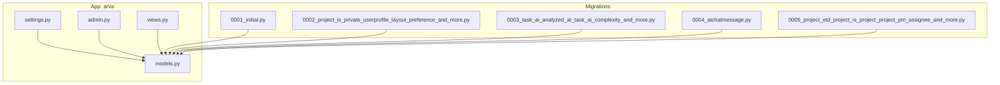
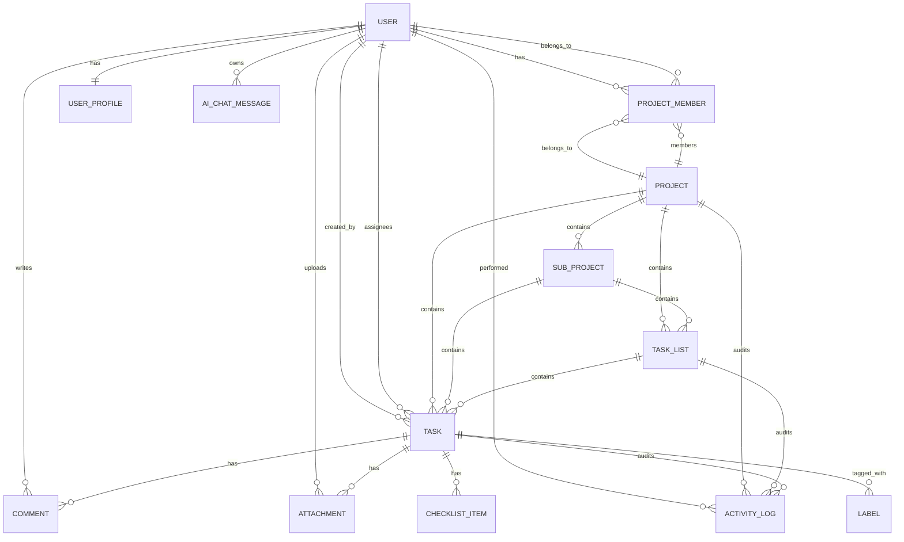
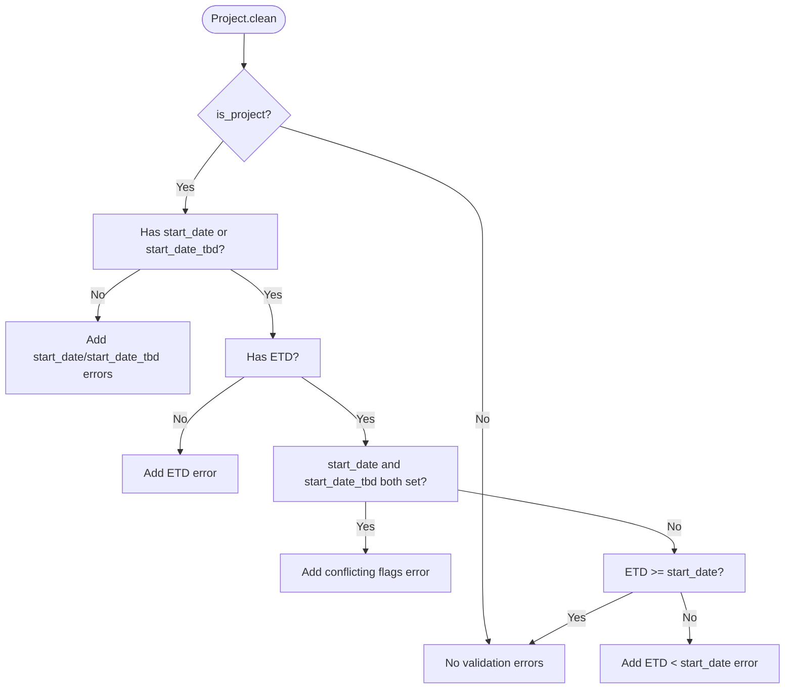
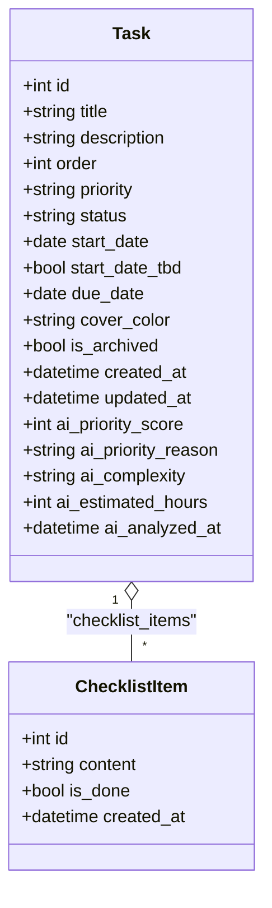
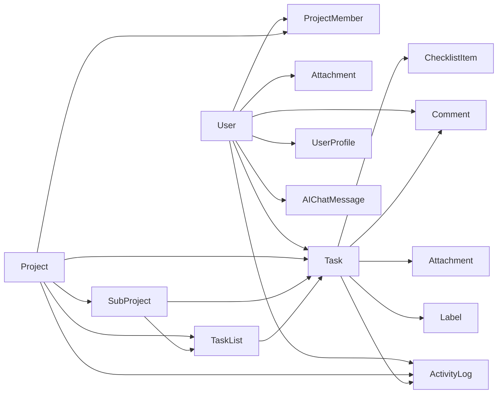

# Data Models and Database Schema

<cite>
**Referenced Files in This Document**
- [arva/models.py](file://arva/models.py)
- [arva/migrations/0001_initial.py](file://arva/migrations/0001_initial.py)
- [arva/migrations/0002_project_is_private_userprofile_layout_preference_and_more.py](file://arva/migrations/0002_project_is_private_userprofile_layout_preference_and_more.py)
- [arva/migrations/0003_task_ai_analyzed_at_task_ai_complexity_and_more.py](file://arva/migrations/0003_task_ai_analyzed_at_task_ai_complexity_and_more.py)
- [arva/migrations/0004_aichatmessage.py](file://arva/migrations/0004_aichatmessage.py)
- [arva/migrations/0005_project_etd_project_is_project_project_pm_assignee_and_more.py](file://arva/migrations/0005_project_etd_project_is_project_project_pm_assignee_and_more.py)
- [arviga/settings.py](file://arviga/settings.py)
- [arva/admin.py](file://arva/admin.py)
- [arva/views.py](file://arva/views.py)
</cite>

## Table of Contents
1. [Introduction](#introduction)
2. [Project Structure](#project-structure)
3. [Core Components](#core-components)
4. [Architecture Overview](#architecture-overview)
5. [Detailed Component Analysis](#detailed-component-analysis)
6. [Dependency Analysis](#dependency-analysis)
7. [Performance Considerations](#performance-considerations)
8. [Troubleshooting Guide](#troubleshooting-guide)
9. [Conclusion](#conclusion)
10. [Appendices](#appendices)

## Introduction
This document provides comprehensive data model documentation for the Arva Kanban application. It covers entity definitions, relationships, constraints, indexes, and business logic. The application organizes work into Projects and SubProjects, each containing TaskLists and Tasks. Users can be members of multiple projects with roles. Supporting models include Comments, Attachments, ChecklistItems, and ActivityLogs. The document also outlines data access patterns, referential integrity, cascading operations, and security considerations.

## Project Structure
The data models are defined in the application’s models module and are persisted via Django migrations. The database is configured to use MySQL with utf8mb4 charset. The admin interface registers models for management, and views enforce access control and data lifecycle rules.

**Diagram sources**
- [arva/models.py](file://arva/models.py#L1-L445)
- [arva/migrations/0001_initial.py](file://arva/migrations/0001_initial.py#L1-L175)
- [arva/migrations/0002_project_is_private_userprofile_layout_preference_and_more.py](file://arva/migrations/0002_project_is_private_userprofile_layout_preference_and_more.py#L1-L48)
- [arva/migrations/0003_task_ai_analyzed_at_task_ai_complexity_and_more.py](file://arva/migrations/0003_task_ai_analyzed_at_task_ai_complexity_and_more.py#L1-L39)
- [arva/migrations/0004_aichatmessage.py](file://arva/migrations/0004_aichatmessage.py#L1-L31)
- [arva/migrations/0005_project_etd_project_is_project_project_pm_assignee_and_more.py](file://arva/migrations/0005_project_etd_project_is_project_project_pm_assignee_and_more.py#L1-L67)
- [arviga/settings.py](file://arviga/settings.py#L58-L68)

**Section sources**
- [arviga/settings.py](file://arviga/settings.py#L58-L68)
- [arva/admin.py](file://arva/admin.py#L1-L50)

## Core Components
This section documents the primary entities and their attributes, constraints, and relationships.

- Project
  - Purpose: Top-level container for work. Can be private or shared. Supports project metadata and lifecycle.
  - Key fields: owner, name, description, is_private, is_project, is_closed, priority, pm_assignee, start_date, start_date_tbd, etd, created_at.
  - Constraints: Validation ensures ETD and start date/TBD rules when is_project is true.
  - Access control: Legacy role-based access is deprecated; access determined by is_private and membership.
  - Related models: lists (TaskLists), tasks (Tasks), memberships (ProjectMembers), activities (ActivityLogs), subprojects (SubProjects).

- SubProject
  - Purpose: Hierarchical subdivision under a Project.
  - Key fields: project (FK), name, description, created_at.
  - Ordering: created_at ascending.

- ProjectMember
  - Purpose: Defines user membership and role within a project.
  - Key fields: project (FK), user (FK), role.
  - Unique constraint: (project, user).
  - Roles: admin, member, viewer.

- TaskList
  - Purpose: Column-like containers inside a Project/SubProject.
  - Key fields: project (FK), sub_project (FK), name, position, is_archived, created_at.
  - Ordering: position ascending.

- Task
  - Purpose: Work items within a TaskList/SubProject.
  - Key fields: project (FK), sub_project (FK), task_list (FK), title, description, order, priority, status, start_date, start_date_tbd, due_date, created_by (FK), labels (M2M), assignees (M2M), cover_color, is_archived, created_at, updated_at.
  - AI fields: ai_priority_score, ai_priority_reason, ai_complexity, ai_estimated_hours, ai_analyzed_at.
  - Ordering: order, then created_at descending.

- Label
  - Purpose: Tagging for Tasks.
  - Key fields: name, color.

- Comment
  - Purpose: Threaded comments on Tasks.
  - Key fields: task (FK), user (FK), parent (self-FK), content, created_at.
  - Ordering: created_at ascending.

- Attachment
  - Purpose: File attachments to Tasks.
  - Key fields: task (FK), file, uploaded_by (FK), uploaded_at.

- ChecklistItem
  - Purpose: Items within Task checklists.
  - Key fields: task (FK), content, is_done, created_at.
  - Ordering: id ascending.

- ActivityLog
  - Purpose: Audit trail for actions across Projects, Lists, and Tasks.
  - Key fields: user (FK), project (FK), task (FK), action, description, created_at.
  - Ordering: created_at descending.

- UserProfile
  - Purpose: Per-user preferences and avatar.
  - Key fields: user (O2O), avatar, avatar_icon, google_id, theme_preference, layout_preference.

- WebsiteSettings
  - Purpose: Global branding and theme settings.
  - Key fields: site_name, logo, favicon, primary_color, theme_mode, navbar_bg, body_bg, text_color, footer_text, support_email, maintenance_mode, custom_css.

- UserActivity
  - Purpose: Track last activity timestamps.
  - Key fields: user (O2O), last_activity.

- AIChatMessage
  - Purpose: Private chat history per user with context.
  - Key fields: user (FK), role, content, created_at, context_tasks (JSON).

**Section sources**
- [arva/models.py](file://arva/models.py#L101-L188)
- [arva/models.py](file://arva/models.py#L189-L209)
- [arva/models.py](file://arva/models.py#L211-L229)
- [arva/models.py](file://arva/models.py#L238-L251)
- [arva/models.py](file://arva/models.py#L252-L352)
- [arva/models.py](file://arva/models.py#L231-L237)
- [arva/models.py](file://arva/models.py#L353-L365)
- [arva/models.py](file://arva/models.py#L366-L374)
- [arva/models.py](file://arva/models.py#L375-L386)
- [arva/models.py](file://arva/models.py#L387-L422)
- [arva/models.py](file://arva/models.py#L56-L99)
- [arva/models.py](file://arva/models.py#L15-L55)
- [arva/models.py](file://arva/models.py#L423-L445)

## Architecture Overview
The data model follows a hierarchical structure:
- Project > TaskList > Task
- Project > SubProject > TaskList/SubProject > Task
- Users participate via ProjectMember entries and are linked to Tasks via M2M fields (assignees) and comments.

**Diagram sources**
- [arva/models.py](file://arva/models.py#L101-L188)
- [arva/models.py](file://arva/models.py#L189-L209)
- [arva/models.py](file://arva/models.py#L211-L229)
- [arva/models.py](file://arva/models.py#L238-L251)
- [arva/models.py](file://arva/models.py#L252-L352)
- [arva/models.py](file://arva/models.py#L231-L237)
- [arva/models.py](file://arva/models.py#L353-L365)
- [arva/models.py](file://arva/models.py#L366-L374)
- [arva/models.py](file://arva/models.py#L375-L386)
- [arva/models.py](file://arva/models.py#L387-L422)
- [arva/models.py](file://arva/models.py#L56-L99)
- [arva/models.py](file://arva/models.py#L15-L55)
- [arva/models.py](file://arva/models.py#L423-L445)

## Detailed Component Analysis

### Project Model
- Purpose: Root container for work items and metadata.
- Validation rules:
  - When is_project is true, start_date or start_date_tbd must be set; ETD is required.
  - start_date and start_date_tbd cannot both be set.
  - ETD must not precede start_date.
- Access control:
  - Legacy role-based access is deprecated; access granted if not private or if owner/member.
- Properties:
  - progress: computes total/done counts and percentage across tasks not archived.
  - subproject_progress: aggregates subproject completion percentages.

**Diagram sources**
- [arva/models.py](file://arva/models.py#L131-L144)

**Section sources**
- [arva/models.py](file://arva/models.py#L101-L188)

### Task Model
- Purpose: Work item with lifecycle, priority, status, due dates, and AI-assisted insights.
- Statuses: none, in_progress, done, infeasible.
- Priority: structured P0–P4 plus legacy low/medium/high/critical.
- AI fields: ai_priority_score, ai_priority_reason, ai_complexity, ai_estimated_hours, ai_analyzed_at.
- Properties:
  - checklist_total/checklist_done: computed from checklist_items.
  - is_overdue/is_due_today/is_due_soon: due date helpers.
  - checklist_percent: derived percentage.

**Diagram sources**
- [arva/models.py](file://arva/models.py#L252-L352)
- [arva/models.py](file://arva/models.py#L375-L386)

**Section sources**
- [arva/models.py](file://arva/models.py#L252-L352)

### TaskList Model
- Purpose: Column container for tasks.
- Ordering: position ascending.
- Archive flag: allows hiding inactive lists.

**Section sources**
- [arva/models.py](file://arva/models.py#L238-L251)

### Comment Model
- Purpose: Threaded comments on tasks.
- Self-referencing parent enables replies.
- Ordering: chronological.

**Section sources**
- [arva/models.py](file://arva/models.py#L353-L365)

### Attachment Model
- Purpose: Files attached to tasks.
- Tracks uploader and timestamp.

**Section sources**
- [arva/models.py](file://arva/models.py#L366-L374)

### ChecklistItem Model
- Purpose: Task checklist entries.
- Ordering: insertion order.

**Section sources**
- [arva/models.py](file://arva/models.py#L375-L386)

### ActivityLog Model
- Purpose: Audit log for project/task/list operations.
- Actions include creation, updates, archiving, moving, comments, attachments, and checklist toggles.
- Ordering: newest first.

**Section sources**
- [arva/models.py](file://arva/models.py#L387-L422)

### ProjectMember Model
- Purpose: Membership and role linkage.
- Unique constraint: (project, user).
- Roles: admin, member, viewer.

**Section sources**
- [arva/models.py](file://arva/models.py#L211-L229)

### SubProject Model
- Purpose: Hierarchical subdivision under a Project.
- Ordering: created_at ascending.

**Section sources**
- [arva/models.py](file://arva/models.py#L189-L209)

### Supporting Models
- UserProfile: per-user preferences and avatar.
- WebsiteSettings: global branding and theme.
- UserActivity: last activity timestamp.
- AIChatMessage: per-user chat history with JSON context.

**Section sources**
- [arva/models.py](file://arva/models.py#L56-L99)
- [arva/models.py](file://arva/models.py#L15-L55)
- [arva/models.py](file://arva/models.py#L423-L445)

## Dependency Analysis
- Foreign Keys:
  - Project.owner -> User
  - Project.pm_assignee -> User
  - ProjectMember.project -> Project
  - ProjectMember.user -> User
  - SubProject.project -> Project
  - TaskList.project -> Project
  - TaskList.sub_project -> SubProject
  - Task.project -> Project
  - Task.sub_project -> SubProject
  - Task.task_list -> TaskList
  - Task.created_by -> User
  - Task.assignees -> User (M2M)
  - Task.labels -> Label (M2M)
  - Comment.task -> Task
  - Comment.user -> User
  - Comment.parent -> Comment (self-FK)
  - Attachment.task -> Task
  - Attachment.uploaded_by -> User
  - ChecklistItem.task -> Task
  - ActivityLog.user -> User
  - ActivityLog.project -> Project
  - ActivityLog.task -> Task
  - UserProfile.user -> User
  - UserActivity.user -> User
  - AIChatMessage.user -> User
- Migrations:
  - Initial creation of core models and relations.
  - Addition of is_private, layout_preference, SubProject, and AI fields.
  - Project metadata additions (etd, is_project, pm_assignee, priority, start_date, start_date_tbd) and Task status/priority expansion.

**Diagram sources**
- [arva/migrations/0001_initial.py](file://arva/migrations/0001_initial.py#L17-L175)
- [arva/migrations/0002_project_is_private_userprofile_layout_preference_and_more.py](file://arva/migrations/0002_project_is_private_userprofile_layout_preference_and_more.py#L13-L47)
- [arva/migrations/0003_task_ai_analyzed_at_task_ai_complexity_and_more.py](file://arva/migrations/0003_task_ai_analyzed_at_task_ai_complexity_and_more.py#L12-L38)
- [arva/migrations/0004_aichatmessage.py](file://arva/migrations/0004_aichatmessage.py#L15-L30)
- [arva/migrations/0005_project_etd_project_is_project_project_pm_assignee_and_more.py](file://arva/migrations/0005_project_etd_project_is_project_project_pm_assignee_and_more.py#L15-L66)

**Section sources**
- [arva/migrations/0001_initial.py](file://arva/migrations/0001_initial.py#L17-L175)
- [arva/migrations/0002_project_is_private_userprofile_layout_preference_and_more.py](file://arva/migrations/0002_project_is_private_userprofile_layout_preference_and_more.py#L13-L47)
- [arva/migrations/0003_task_ai_analyzed_at_task_ai_complexity_and_more.py](file://arva/migrations/0003_task_ai_analyzed_at_task_ai_complexity_and_more.py#L12-L38)
- [arva/migrations/0004_aichatmessage.py](file://arva/migrations/0004_aichatmessage.py#L15-L30)
- [arva/migrations/0005_project_etd_project_is_project_project_pm_assignee_and_more.py](file://arva/migrations/0005_project_etd_project_is_project_project_pm_assignee_and_more.py#L15-L66)

## Performance Considerations
- Indexing recommendations:
  - Project: owner, is_private, is_project, created_at.
  - TaskList: project, sub_project, position, is_archived.
  - Task: project, sub_project, task_list, priority, status, due_date, created_by, is_archived, created_at, updated_at.
  - Comment: task, user, parent, created_at.
  - Attachment: task, uploaded_by, uploaded_at.
  - ChecklistItem: task, is_done, created_at.
  - ActivityLog: user, project, task, created_at.
  - ProjectMember: project, user, role.
  - SubProject: project, created_at.
  - Label: name.
  - UserProfile: user.
  - WebsiteSettings: site_name.
  - UserActivity: user.
  - AIChatMessage: user, created_at.
- Ordering:
  - Task ordering by order, then created_at desc.
  - TaskList ordering by position asc.
  - Comment ordering by created_at asc.
  - ActivityLog ordering by created_at desc.
  - SubProject ordering by created_at asc.
- Query patterns:
  - Prefetch related checklist_items to reduce N+1 queries for task checklist_percent.
  - Use select_related for foreign keys frequently accessed (e.g., project, task_list, created_by).
  - Filter by is_archived=False for active items where applicable.
- Soft deletion:
  - is_archived flags are used to hide items without physical deletion.
  - No dedicated deleted_at or is_deleted fields were identified in the models.
- Caching:
  - Properties like checklist_total/checklist_done leverage prefetched objects cache to avoid extra queries.

[No sources needed since this section provides general guidance]

## Troubleshooting Guide
- Access control:
  - Views enforce access via get_accessible_projects_queryset and require_role. Ensure project.is_private and membership checks align with UI expectations.
- Validation failures:
  - Project.clean raises validation errors for conflicting start_date and start_date_tbd, missing ETD for projects, and invalid date orderings.
- Cascading behavior:
  - on_delete=CASCADE for most FKs; SET_NULL for nullable fields (e.g., pm_assignee, created_by).
  - Unique_together on ProjectMember prevents duplicate memberships.
- Data lifecycle:
  - Use is_archived to hide items rather than deleting.
  - Project.is_closed gates modifications for project-type projects.
- Security:
  - Authentication enforced via login_required decorators.
  - Access control functions require_role and get_role gate endpoints.

**Section sources**
- [arva/views.py](file://arva/views.py#L50-L105)
- [arva/models.py](file://arva/models.py#L131-L144)

## Conclusion
The Arva Kanban data model establishes a clear hierarchy of Projects, SubProjects, TaskLists, and Tasks, with robust user participation via memberships and rich auxiliary models for collaboration and audit. Validation rules and access control ensure data integrity and appropriate sharing. The schema supports performance through ordering and indexing recommendations and maintains data lifecycle via archive flags. Administrators can manage models via the Django admin, while views enforce security and business rules.

## Appendices

### Database Schema Summary
- Database engine: MySQL with utf8mb4 charset.
- Default auto field: BigAutoField.
- AUTH_USER_MODEL is used for all user-related FKs.

**Section sources**
- [arviga/settings.py](file://arviga/settings.py#L58-L68)
- [arviga/settings.py](file://arviga/settings.py#L110)

### Admin Registration
- Registered models include Project, ProjectMember, TaskList, Task, SubProject, Label, Comment, Attachment, ActivityLog, ChecklistItem, UserProfile, UserActivity, WebsiteSettings.

**Section sources**
- [arva/admin.py](file://arva/admin.py#L1-L50)