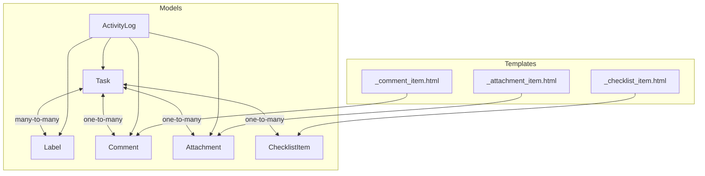
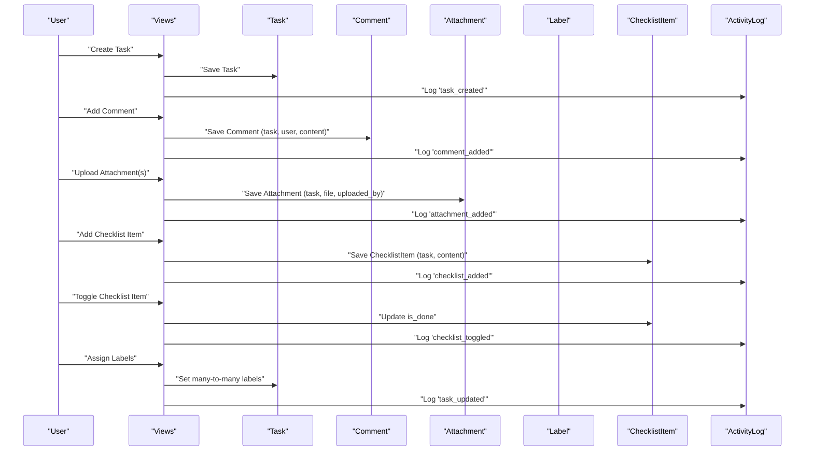
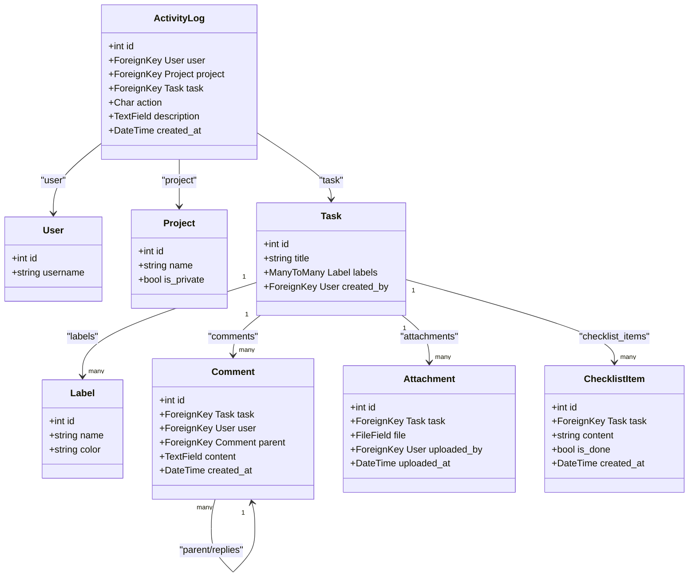
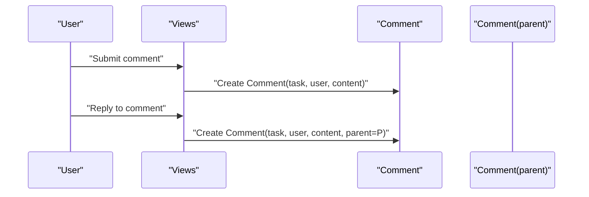
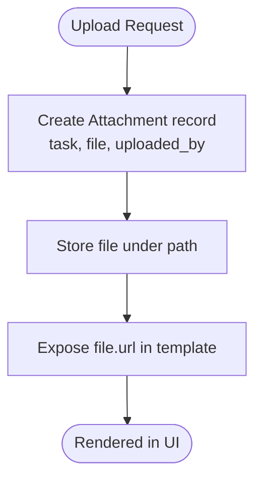
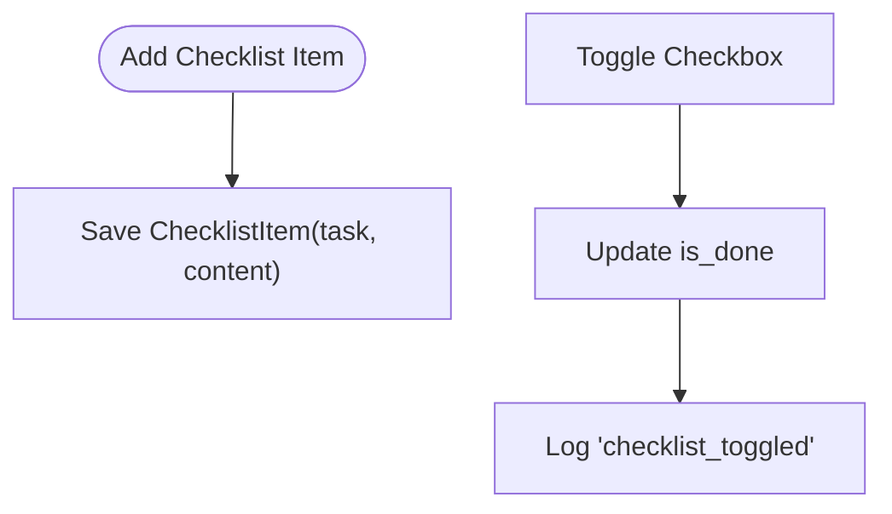
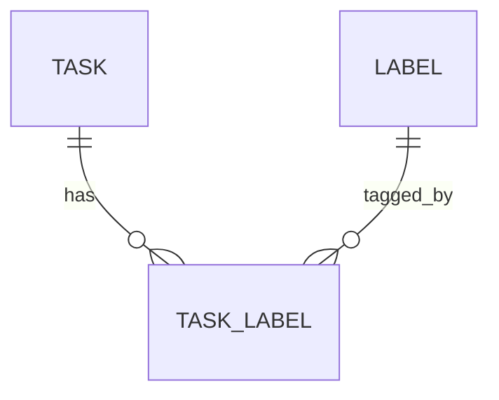
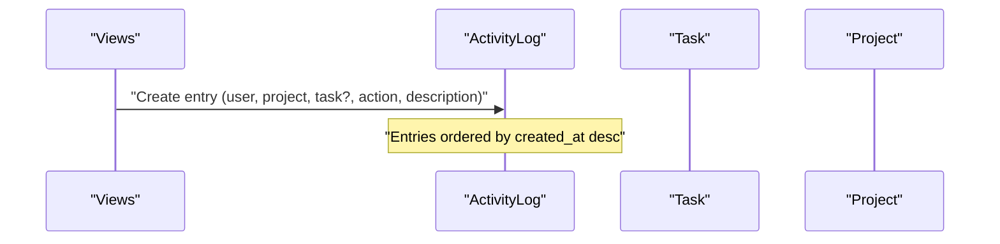
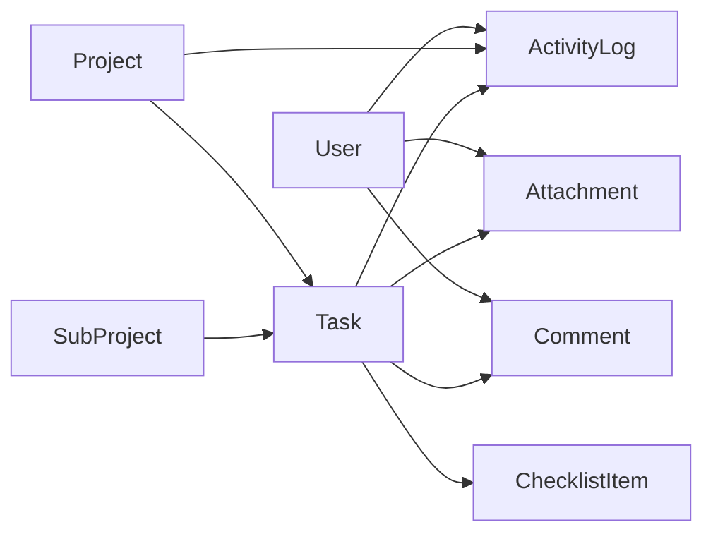

# Task Enhancement Models

<cite>
**Referenced Files in This Document**
- [models.py](file://arva/models.py)
- [0001_initial.py](file://arva/migrations/0001_initial.py)
- [_comment_item.html](file://arva/templates/arva/_comment_item.html)
- [_attachment_item.html](file://arva/templates/arva/_attachment_item.html)
- [_checklist_item.html](file://arva/templates/arva/_checklist_item.html)
- [views.py](file://arva/views.py)
</cite>

## Table of Contents
1. [Introduction](#introduction)
2. [Project Structure](#project-structure)
3. [Core Components](#core-components)
4. [Architecture Overview](#architecture-overview)
5. [Detailed Component Analysis](#detailed-component-analysis)
6. [Dependency Analysis](#dependency-analysis)
7. [Performance Considerations](#performance-considerations)
8. [Troubleshooting Guide](#troubleshooting-guide)
9. [Conclusion](#conclusion)

## Introduction
This document provides comprehensive data model documentation for task enhancement entities in the Kanban application. It focuses on Comment, Attachment, ChecklistItem, Label, and ActivityLog models. It explains:
- Field definitions and relationships
- Hierarchical threaded comments using self-referencing foreign keys
- File upload storage and attribution
- Task completion tracking via checklist items
- Task categorization via labels
- Audit trail via activity logs with predefined action types
- Validation rules, many-to-many relationships, and security considerations

## Project Structure
The task enhancement models are defined in the application’s models module and initialized via Django migrations. Templates demonstrate how these models are rendered in the UI.

**Diagram sources**
- [models.py](file://arva/models.py#L231-L422)
- [_comment_item.html](file://arva/templates/arva/_comment_item.html#L1-L9)
- [_attachment_item.html](file://arva/templates/arva/_attachment_item.html#L1-L7)
- [_checklist_item.html](file://arva/templates/arva/_checklist_item.html#L1-L9)

**Section sources**
- [models.py](file://arva/models.py#L231-L422)
- [0001_initial.py](file://arva/migrations/0001_initial.py#L110-L161)
- [_comment_item.html](file://arva/templates/arva/_comment_item.html#L1-L9)
- [_attachment_item.html](file://arva/templates/arva/_attachment_item.html#L1-L7)
- [_checklist_item.html](file://arva/templates/arva/_checklist_item.html#L1-L9)

## Core Components
- Label: Defines task categories with a name and color.
- Task: Core entity with many-to-many relationship to Label.
- Comment: Threaded comments with self-referencing parent field for replies.
- Attachment: File uploads linked to a Task with uploader attribution.
- ChecklistItem: Per-task items for completion tracking.
- ActivityLog: Audit trail capturing user actions and system events.

Key relationships:
- Task has many ChecklistItem, Comment, and Attachment entries.
- Task belongs to many Label instances.
- Comment supports hierarchical replies via a self-FK to itself.
- ActivityLog links to User, Project, and Task (optional) and records predefined actions.

Validation highlights:
- Task enforces priority/status constraints and due-date rules.
- Label provides minimal constraints (name, color).
- Attachment stores arbitrary files under a generated path.
- ActivityLog restricts actions to a predefined enumeration.

Security and audit:
- ActivityLog captures who performed actions and when.
- Comment rendering uses user avatars and timestamps.
- Attachment links files to uploading users.

**Section sources**
- [models.py](file://arva/models.py#L231-L422)
- [0001_initial.py](file://arva/migrations/0001_initial.py#L110-L161)

## Architecture Overview
The enhancement models integrate with the Task board and UI templates. Views orchestrate creation and retrieval of comments, attachments, and checklist items, while ActivityLog records significant lifecycle events.

**Diagram sources**
- [views.py](file://arva/views.py#L1540-L1599)
- [models.py](file://arva/models.py#L252-L302)
- [models.py](file://arva/models.py#L353-L385)
- [models.py](file://arva/models.py#L366-L374)
- [models.py](file://arva/models.py#L375-L385)
- [models.py](file://arva/models.py#L387-L422)

## Detailed Component Analysis

### Label Model
Purpose:
- Provide categorization for tasks via a simple name and color scheme.

Fields:
- name: String up to 50 characters.
- color: String up to 20 characters (used for UI theming).

Relationships:
- Many-to-many with Task via Task.labels.

Constraints and behavior:
- No explicit validation in the model; color is free-form.

UI usage:
- Labels are selectable during task creation/editing and displayed on cards.

**Section sources**
- [models.py](file://arva/models.py#L231-L237)
- [0001_initial.py](file://arva/migrations/0001_initial.py#L18-L25)

### Task Model (Label Relationship)
Purpose:
- Central entity representing work items with optional subprojects and lists.

Label relationship:
- Many-to-many with Label (Task.labels).

Behavior:
- Provides computed properties for checklist totals and completion percentage.
- Enforces priority/status constraints depending on project type.

**Section sources**
- [models.py](file://arva/models.py#L252-L302)
- [0001_initial.py](file://arva/migrations/0001_initial.py#L87-L109)

### Comment Model (Threaded Comments)
Purpose:
- Store user-generated commentary on tasks with hierarchical replies.

Fields:
- task: ForeignKey to Task (reverse: comments).
- user: ForeignKey to User.
- parent: Self-referencing ForeignKey to support replies (reverse: replies).
- content: Text of the comment.
- created_at: Timestamp.

Ordering:
- Ordered chronologically ascending by created_at.

Hierarchical structure:
- Replies are accessed via Comment.replies on a parent comment.
- UI templates iterate top-level comments (parent is null) and render nested replies.

Template usage:
- Renders author avatar, username, timestamp, and content.

**Section sources**
- [models.py](file://arva/models.py#L353-L365)
- [0001_initial.py](file://arva/migrations/0001_initial.py#L110-L123)
- [_comment_item.html](file://arva/templates/arva/_comment_item.html#L1-L9)

### Attachment Model (File Uploads)
Purpose:
- Attach files to tasks with automatic attribution to the uploader.

Fields:
- task: ForeignKey to Task (reverse: attachments).
- file: FileField stored under a generated path.
- uploaded_by: Optional ForeignKey to User (SET_NULL on user deletion).
- uploaded_at: Timestamp.

Storage and attribution:
- Files are stored under a path prefix; uploader identity is recorded.
- Template renders a link to the file URL with upload timestamp.

Security considerations:
- No built-in file type validation in the model.
- Access control relies on task visibility and project membership enforced elsewhere in the application.

**Section sources**
- [models.py](file://arva/models.py#L366-L374)
- [0001_initial.py](file://arva/migrations/0001_initial.py#L137-L146)
- [_attachment_item.html](file://arva/templates/arva/_attachment_item.html#L1-L7)

### ChecklistItem Model (Task Completion Tracking)
Purpose:
- Track granular completion steps within a task.

Fields:
- task: ForeignKey to Task (reverse: checklist_items).
- content: Short description of the item.
- is_done: Boolean flag for completion.
- created_at: Timestamp.

Ordering:
- Ordered by creation ID.

UI behavior:
- Toggle checkbox updates is_done.
- Task view computes completion percentage based on checklist items.

**Section sources**
- [models.py](file://arva/models.py#L375-L385)
- [0001_initial.py](file://arva/migrations/0001_initial.py#L124-L136)
- [_checklist_item.html](file://arva/templates/arva/_checklist_item.html#L1-L9)

### ActivityLog Model (Audit Trail)
Purpose:
- Record user actions and system events for auditing and reporting.

Fields:
- user: Optional ForeignKey to User (SET_NULL on user deletion).
- project: ForeignKey to Project (reverse: activities).
- task: Optional ForeignKey to Task (reverse: activities).
- action: CharField constrained to a predefined enumeration.
- description: Optional text describing the event.
- created_at: Timestamp.

Action types:
- Predefined actions include project/task/list/comment/attachment/checklist operations and toggles.

Usage:
- Views create ActivityLog entries for major lifecycle events (creation, updates, deletions, moves, archivals).
- Activity feed supports filtering by action, user, and date range.

**Section sources**
- [models.py](file://arva/models.py#L387-L422)
- [0001_initial.py](file://arva/migrations/0001_initial.py#L147-L161)
- [views.py](file://arva/views.py#L904-L971)

## Architecture Overview

**Diagram sources**
- [models.py](file://arva/models.py#L231-L422)

## Detailed Component Analysis

### Comment Model Details
- Self-referencing foreign key enables threaded replies.
- Ordering ensures chronological display.
- Template integration renders author avatar, username, timestamp, and content.

**Diagram sources**
- [models.py](file://arva/models.py#L353-L365)
- [views.py](file://arva/views.py#L1540-L1599)

**Section sources**
- [models.py](file://arva/models.py#L353-L365)
- [_comment_item.html](file://arva/templates/arva/_comment_item.html#L1-L9)

### Attachment Model Details
- Stores files under a generated path and attributes uploads to users.
- Optional uploader allows persistence even if user is deleted.
- Template displays file name and upload timestamp.

**Diagram sources**
- [models.py](file://arva/models.py#L366-L374)
- [_attachment_item.html](file://arva/templates/arva/_attachment_item.html#L1-L7)

**Section sources**
- [models.py](file://arva/models.py#L366-L374)
- [_attachment_item.html](file://arva/templates/arva/_attachment_item.html#L1-L7)

### ChecklistItem Model Details
- Tracks completion per item.
- UI toggles is_done and recalculates task completion percentage.

**Diagram sources**
- [models.py](file://arva/models.py#L375-L385)
- [views.py](file://arva/views.py#L1540-L1599)

**Section sources**
- [models.py](file://arva/models.py#L375-L385)
- [_checklist_item.html](file://arva/templates/arva/_checklist_item.html#L1-L9)

### Label Model Details
- Provides categorization for tasks.
- Used in task creation/editing and filtering.

**Diagram sources**
- [models.py](file://arva/models.py#L252-L302)
- [models.py](file://arva/models.py#L231-L237)

**Section sources**
- [models.py](file://arva/models.py#L231-L237)
- [models.py](file://arva/models.py#L252-L302)

### ActivityLog Model Details
- Captures who did what, when, and to which entity.
- Supports filtering and pagination in the activity feed.

**Diagram sources**
- [models.py](file://arva/models.py#L387-L422)
- [views.py](file://arva/views.py#L904-L971)

**Section sources**
- [models.py](file://arva/models.py#L387-L422)
- [views.py](file://arva/views.py#L904-L971)

## Dependency Analysis
- Task depends on Project, SubProject, and User (created_by).
- Comment depends on Task and User; supports hierarchical replies.
- Attachment depends on Task and optionally User (uploader).
- ChecklistItem depends on Task.
- ActivityLog depends on User, Project, and optionally Task.

**Diagram sources**
- [models.py](file://arva/models.py#L252-L422)

**Section sources**
- [models.py](file://arva/models.py#L252-L422)

## Performance Considerations
- Use select_related and prefetch_related in views to minimize N+1 queries when rendering tasks, comments, attachments, and checklist items.
- Order queries appropriately (e.g., comments by created_at, checklist by id) to avoid extra sorting in templates.
- Limit paginated activity feeds to reduce memory footprint.
- Consider indexing frequently filtered fields (e.g., task_id, user_id) if query volume grows.

## Troubleshooting Guide
Common issues and resolutions:
- Missing parent in reply: Ensure Comment.parent is set correctly when replying.
- Orphaned attachments after user deletion: uploaded_by may become NULL; verify cleanup policies if needed.
- Excessive activity log growth: Implement retention policies or archival strategies.
- Label assignment on project tasks: Project tasks disable labels; ensure UI respects this constraint.

**Section sources**
- [views.py](file://arva/views.py#L1518-L1524)
- [models.py](file://arva/models.py#L353-L365)
- [models.py](file://arva/models.py#L366-L374)
- [models.py](file://arva/models.py#L387-L422)

## Conclusion
The task enhancement models provide a robust foundation for collaboration and auditability:
- Threaded comments enable contextual discussions.
- Attachments support evidence and documentation.
- Checklist items offer granular progress tracking.
- Labels categorize tasks for improved organization.
- ActivityLog delivers a comprehensive audit trail.

Adhering to the documented relationships, validations, and security considerations ensures reliable operation and maintainable code.