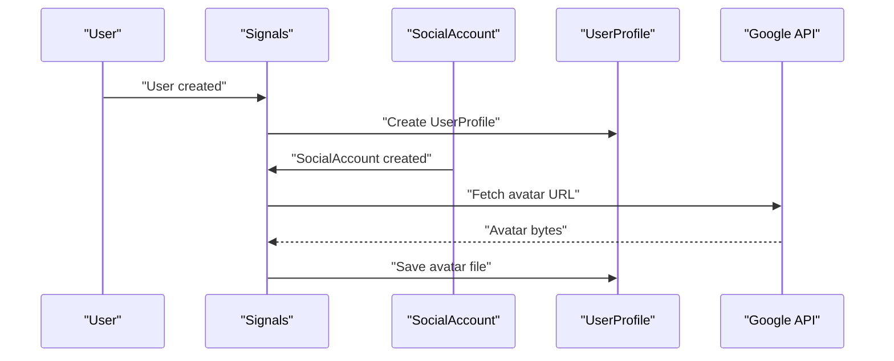
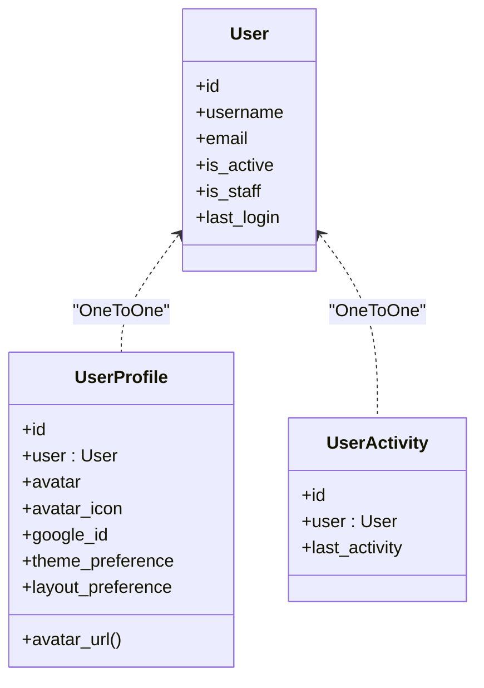
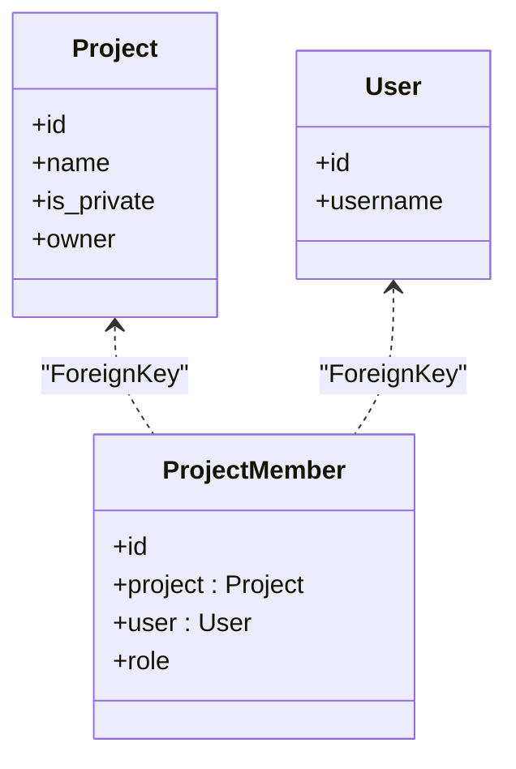
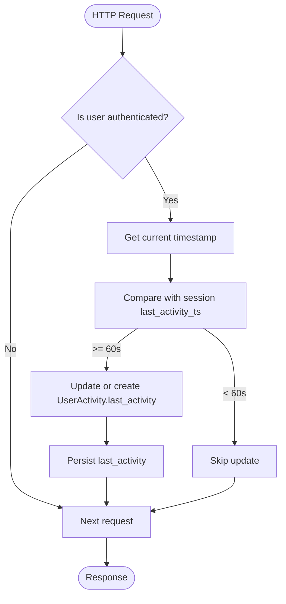
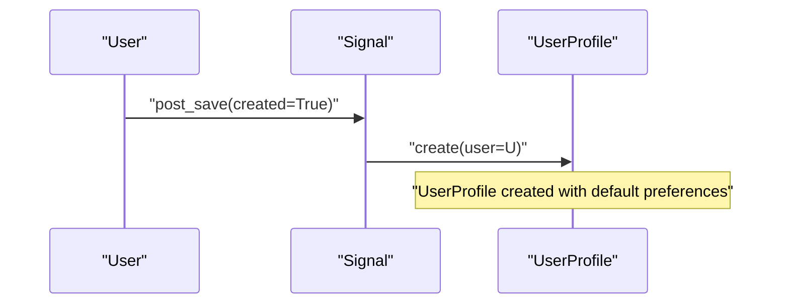
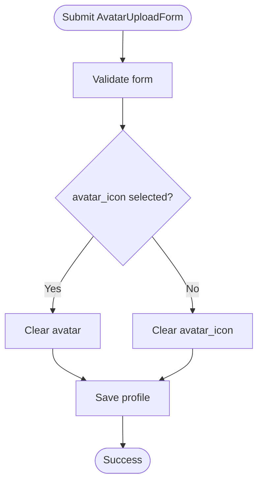
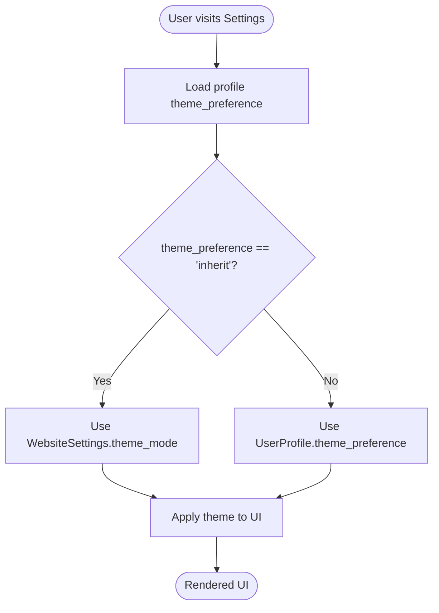
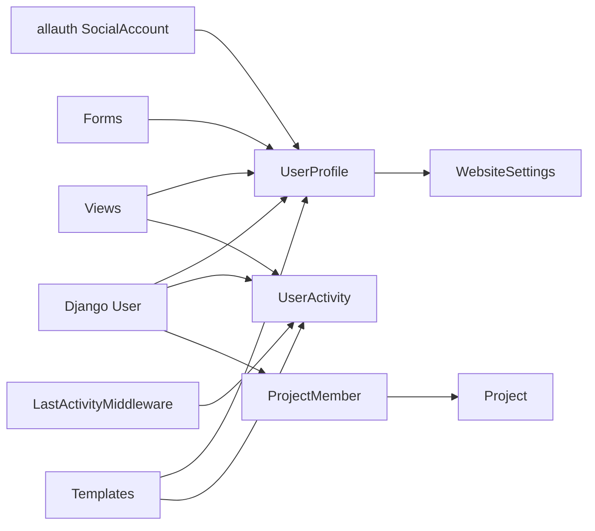

# User Management Models

<cite>
**Referenced Files in This Document**
- [models.py](file://arva/models.py)
- [admin.py](file://arva/admin.py)
- [forms.py](file://arva/forms.py)
- [signals.py](file://arva/signals.py)
- [middleware.py](file://arva/middleware.py)
- [views.py](file://arva/views.py)
- [user_settings.html](file://arva/templates/arva/user_settings.html)
- [user_list.html](file://arva/templates/arva/user_list.html)
- [0001_initial.py](file://arva/migrations/0001_initial.py)
- [0002_project_is_private_userprofile_layout_preference_and_more.py](file://arva/migrations/0002_project_is_private_userprofile_layout_preference_and_more.py)
</cite>

## Table of Contents
1. [Introduction](#introduction)
2. [Project Structure](#project-structure)
3. [Core Components](#core-components)
4. [Architecture Overview](#architecture-overview)
5. [Detailed Component Analysis](#detailed-component-analysis)
6. [Dependency Analysis](#dependency-analysis)
7. [Performance Considerations](#performance-considerations)
8. [Troubleshooting Guide](#troubleshooting-guide)
9. [Conclusion](#conclusion)

## Introduction
This document provides comprehensive data model documentation for user-related entities in the Kanban application. It focuses on the Django User model and its related models: UserProfile, ProjectMember, and UserActivity. It explains the OneToOne relationship between Django’s User and UserProfile, how avatars are managed, how theme preferences and layout settings are stored and inherited, and how role-based access control is handled. It also documents the UserActivity model for tracking user engagement and last activity timestamps, along with validation rules and data relationships.

## Project Structure
The user management models are defined in the application’s models module and integrated with Django’s admin interface, signals, middleware, and views. Forms handle user profile editing and avatar uploads. Templates present user settings and user lists with online presence indicators.

```mermaid
graph TB
subgraph "Models"
User["Django User Model"]
UserProfile["UserProfile"]
ProjectMember["ProjectMember"]
UserActivity["UserActivity"]
end
subgraph "Integration"
Signals["Signals"]
Middleware["LastActivityMiddleware"]
Views["Views"]
Admin["Admin"]
Forms["Forms"]
Templates["Templates"]
end
User < --> UserProfile
User < --> UserActivity
User < --> ProjectMember
ProjectMember --> User
ProjectMember --> Project["Project"]
Signals --> UserProfile
Middleware --> UserActivity
Views --> UserProfile
Views --> UserActivity
Admin --> UserProfile
Admin --> UserActivity
Forms --> UserProfile
Templates --> UserProfile
```

**Diagram sources**
- [models.py](file://arva/models.py#L56-L100)
- [models.py](file://arva/models.py#L211-L230)
- [models.py](file://arva/models.py#L423-L429)
- [signals.py](file://arva/signals.py#L14-L17)
- [middleware.py](file://arva/middleware.py#L7-L22)
- [views.py](file://arva/views.py#L136-L160)
- [admin.py](file://arva/admin.py#L47-L49)
- [forms.py](file://arva/forms.py#L51-L66)
- [user_settings.html](file://arva/templates/arva/user_settings.html#L10-L59)

**Section sources**
- [models.py](file://arva/models.py#L56-L100)
- [models.py](file://arva/models.py#L211-L230)
- [models.py](file://arva/models.py#L423-L429)
- [admin.py](file://arva/admin.py#L47-L49)
- [signals.py](file://arva/signals.py#L14-L17)
- [middleware.py](file://arva/middleware.py#L7-L22)
- [views.py](file://arva/views.py#L136-L160)
- [forms.py](file://arva/forms.py#L51-L66)
- [user_settings.html](file://arva/templates/arva/user_settings.html#L10-L59)

## Core Components
- UserProfile: Extends Django’s User with avatar, theme preference, and layout preference. Provides avatar resolution logic and stores user-specific UI preferences.
- ProjectMember: Handles project membership with role tokens (admin, member, viewer). Enforces uniqueness per user-project pair and integrates with project visibility logic.
- UserActivity: Tracks last activity timestamps for authenticated users, enabling presence indicators and analytics.
- WebsiteSettings: Stores global branding and theme settings; used for theme inheritance when UserProfile prefers “inherit”.

Validation rules and relationships:
- UserProfile enforces OneToOne with User and stores optional avatar or avatar_icon.
- ProjectMember enforces unique_together constraint on (project, user) and defines role constants.
- UserActivity enforces OneToOne with User and stores last_activity timestamp.
- WebsiteSettings defines theme_mode and branding fields.

**Section sources**
- [models.py](file://arva/models.py#L56-L100)
- [models.py](file://arva/models.py#L211-L230)
- [models.py](file://arva/models.py#L423-L429)
- [models.py](file://arva/models.py#L15-L55)

## Architecture Overview
The user management architecture integrates Django’s built-in User model with custom models and third-party integrations:

- OneToOne extension: UserProfile and UserActivity extend User with additional attributes.
- Signals: Automatically create UserProfile on User creation and fetch Google avatar on social signup.
- Middleware: Periodically updates UserActivity last_activity for authenticated users.
- Views and Forms: Provide user settings pages and avatar upload/editing capabilities.
- Templates: Render user settings, layout/theme controls, and user presence indicators.



**Diagram sources**
- [signals.py](file://arva/signals.py#L14-L17)
- [signals.py](file://arva/signals.py#L19-L37)

**Section sources**
- [signals.py](file://arva/signals.py#L14-L17)
- [signals.py](file://arva/signals.py#L19-L37)

## Detailed Component Analysis

### UserProfile Model
UserProfile extends Django’s User with:
- Avatar management: Supports direct file upload or predefined avatar icons.
- Theme preference: Inherits website theme or overrides with light/dark/auto.
- Layout preference: Sidebar or classic layout selection.

Key fields and behaviors:
- OneToOne to User with CASCADE deletion.
- Avatar upload path generator ensures per-user avatar directories.
- avatar_url property resolves to uploaded avatar, icon, or default.
- theme_preference and layout_preference choices define allowed values.



**Diagram sources**
- [models.py](file://arva/models.py#L56-L100)
- [models.py](file://arva/models.py#L423-L429)

Field definitions and validation:
- avatar: ImageField with dynamic upload_to path.
- avatar_icon: CharField referencing static icons under profile directory.
- theme_preference: CharField with choices including inherit/light/dark/auto.
- layout_preference: CharField with choices sidebar/classic.

Theme inheritance mechanism:
- When theme_preference is “inherit”, the website theme mode is used.
- WebsiteSettings provides theme_mode and branding colors.

Avatar upload system:
- AvatarUploadForm allows choosing a predefined icon or uploading a file.
- On save, if icon is chosen, avatar is cleared and avatar_icon is set; otherwise avatar is saved and icon is cleared.

**Section sources**
- [models.py](file://arva/models.py#L56-L100)
- [models.py](file://arva/models.py#L6-L13)
- [models.py](file://arva/models.py#L15-L55)
- [forms.py](file://arva/forms.py#L51-L66)
- [views.py](file://arva/views.py#L279-L301)

### ProjectMember Model
ProjectMember manages project membership and role tokens:
- Unique membership per user-project enforced by unique_together.
- Role constants: admin, member, viewer.
- Legacy role-based access control is deprecated; UI branches on “admin” while endpoint gating remains owner-only for sensitive actions.



**Diagram sources**
- [models.py](file://arva/models.py#L211-L230)

Role-based access control:
- get_user_role and can_user_view determine access based on project visibility and ownership.
- require_role preserves owner-only gating for endpoints that previously required admin.

**Section sources**
- [models.py](file://arva/models.py#L211-L230)
- [views.py](file://arva/views.py#L91-L104)

### UserActivity Model
UserActivity tracks user presence:
- OneToOne to User.
- last_activity DateTimeField updated via middleware on periodic checks.
- Used in user_list template to compute online/offline/never status.



**Diagram sources**
- [middleware.py](file://arva/middleware.py#L7-L22)

Presence computation:
- user_list aggregates last comment, last action, and last presence timestamps to determine last_activity_at.
- is_user_online utility considers a user online if last_activity is within the last minute.

**Section sources**
- [middleware.py](file://arva/middleware.py#L7-L22)
- [utils.py](file://arva/utils.py#L6-L9)
- [views.py](file://arva/views.py#L225-L245)
- [user_list.html](file://arva/templates/arva/user_list.html#L145-L157)

### WebsiteSettings Model
WebsiteSettings provides global branding and theme settings:
- theme_mode choices: light, dark, auto.
- Branding fields: logo, favicon, site_name, support_email, footer_text.
- Dynamic URLs for logo and favicon fallbacks.

Theme inheritance:
- UserProfile.theme_preference supports “inherit” to follow WebsiteSettings.theme_mode.

**Section sources**
- [models.py](file://arva/models.py#L15-L55)
- [models.py](file://arva/models.py#L56-L100)

## Architecture Overview
The user management system integrates Django’s authentication with custom models and third-party services:

- Authentication: Django User model with allauth social accounts.
- Preferences: UserProfile stores per-user theme and layout preferences.
- Presence: UserActivity records last activity timestamps.
- Access control: ProjectMember defines membership and role tokens.
- UI: Templates render settings and user lists with presence indicators.

```mermaid
graph TB
subgraph "Django Auth"
DUser["Django User"]
Social["allauth SocialAccount"]
end
subgraph "Custom Models"
Profile["UserProfile"]
Member["ProjectMember"]
Activity["UserActivity"]
Site["WebsiteSettings"]
end
subgraph "Integration"
Sig["Signals"]
Mid["Middleware"]
View["Views"]
Form["Forms"]
Tpl["Templates"]
end
DUser < --> Profile
DUser < --> Activity
DUser < --> Member
Profile --> Site
Social --> Profile
Sig --> Profile
Mid --> Activity
View --> Profile
View --> Activity
Form --> Profile
Tpl --> Profile
Tpl --> Activity
```

**Diagram sources**
- [models.py](file://arva/models.py#L56-L100)
- [models.py](file://arva/models.py#L211-L230)
- [models.py](file://arva/models.py#L423-L429)
- [models.py](file://arva/models.py#L15-L55)
- [signals.py](file://arva/signals.py#L14-L37)
- [middleware.py](file://arva/middleware.py#L7-L22)
- [views.py](file://arva/views.py#L136-L160)
- [forms.py](file://arva/forms.py#L51-L66)
- [user_settings.html](file://arva/templates/arva/user_settings.html#L10-L59)

## Detailed Component Analysis

### OneToOne Relationship Between User and UserProfile
- UserProfile.user is a OneToOneField to Django’s User with CASCADE deletion.
- Signals automatically create a UserProfile when a User is created.
- Avatar management supports two modes:
  - Uploaded file: stored under user-specific path.
  - Icon selection: stored as avatar_icon referencing static icons.
- Theme preference supports “inherit” to follow WebsiteSettings.theme_mode.



**Diagram sources**
- [signals.py](file://arva/signals.py#L14-L17)
- [models.py](file://arva/models.py#L56-L100)

**Section sources**
- [models.py](file://arva/models.py#L56-L100)
- [signals.py](file://arva/signals.py#L14-L17)

### Avatar Upload System
- AvatarUploadForm provides:
  - avatar: ImageField for file upload.
  - avatar_icon: ChoiceField populated from static icons.
- On save:
  - If avatar_icon is selected, avatar is cleared and avatar_icon is set.
  - Otherwise, avatar is saved and avatar_icon is cleared.



**Diagram sources**
- [forms.py](file://arva/forms.py#L51-L66)
- [views.py](file://arva/views.py#L279-L301)

**Section sources**
- [forms.py](file://arva/forms.py#L51-L66)
- [views.py](file://arva/views.py#L279-L301)

### Theme Inheritance Mechanism
- UserProfile.theme_preference supports:
  - inherit: Follow WebsiteSettings.theme_mode.
  - light/dark/auto: Override website theme.
- WebsiteSettings.theme_mode defines allowed values.
- user_settings template renders theme options and persists user preference via AJAX.



**Diagram sources**
- [models.py](file://arva/models.py#L56-L100)
- [models.py](file://arva/models.py#L15-L55)
- [views.py](file://arva/views.py#L136-L160)
- [user_settings.html](file://arva/templates/arva/user_settings.html#L44-L57)

**Section sources**
- [models.py](file://arva/models.py#L56-L100)
- [models.py](file://arva/models.py#L15-L55)
- [views.py](file://arva/views.py#L136-L160)
- [user_settings.html](file://arva/templates/arva/user_settings.html#L44-L57)

### Layout Preference Storage
- UserProfile.layout_preference supports:
  - sidebar: Default layout.
  - classic: Original top navigation layout.
- user_settings template presents layout options and saves via AJAX.
- website_settings availability depends on layout preference and superuser permissions.

**Section sources**
- [models.py](file://arva/models.py#L56-L100)
- [views.py](file://arva/views.py#L136-L160)
- [views.py](file://arva/views.py#L190-L216)
- [user_settings.html](file://arva/templates/arva/user_settings.html#L20-L41)

### Role-Based Access Control
- ProjectMember defines role tokens: admin, member, viewer.
- Unique membership enforced per user-project.
- Access logic:
  - Public projects: anyone with access to the project.
  - Private projects: owner plus explicitly shared users.
- Endpoint gating:
  - Owner-only gating preserved for endpoints that previously required admin.
  - General access gated by project.can_user_view.

**Section sources**
- [models.py](file://arva/models.py#L211-L230)
- [views.py](file://arva/views.py#L91-L104)
- [views.py](file://arva/views.py#L117-L134)

### UserActivity Tracking
- Middleware periodically updates UserActivity.last_activity for authenticated users.
- Update occurs if 60 seconds have elapsed since last update.
- user_list aggregates last comment, last action, and last presence to compute user status.

**Section sources**
- [middleware.py](file://arva/middleware.py#L7-L22)
- [views.py](file://arva/views.py#L225-L245)
- [utils.py](file://arva/utils.py#L6-L9)
- [user_list.html](file://arva/templates/arva/user_list.html#L145-L157)

## Dependency Analysis
- UserProfile depends on Django User and WebsiteSettings for theme inheritance.
- ProjectMember depends on Project and User for membership management.
- UserActivity depends on Django User for presence tracking.
- Signals depend on allauth SocialAccount for Google avatar fetching.
- Views depend on models, forms, and templates for rendering and persistence.



**Diagram sources**
- [models.py](file://arva/models.py#L56-L100)
- [models.py](file://arva/models.py#L211-L230)
- [models.py](file://arva/models.py#L423-L429)
- [models.py](file://arva/models.py#L15-L55)
- [signals.py](file://arva/signals.py#L19-L37)
- [middleware.py](file://arva/middleware.py#L7-L22)
- [views.py](file://arva/views.py#L136-L160)
- [forms.py](file://arva/forms.py#L51-L66)
- [user_settings.html](file://arva/templates/arva/user_settings.html#L10-L59)

**Section sources**
- [models.py](file://arva/models.py#L56-L100)
- [models.py](file://arva/models.py#L211-L230)
- [models.py](file://arva/models.py#L423-L429)
- [models.py](file://arva/models.py#L15-L55)
- [signals.py](file://arva/signals.py#L19-L37)
- [middleware.py](file://arva/middleware.py#L7-L22)
- [views.py](file://arva/views.py#L136-L160)
- [forms.py](file://arva/forms.py#L51-L66)
- [user_settings.html](file://arva/templates/arva/user_settings.html#L10-L59)

## Performance Considerations
- Middleware update interval: last_activity is updated only if 60 seconds have passed, reducing database writes.
- Aggregation in user_list: Uses Max aggregation on related fields to compute last_activity_at efficiently.
- Static avatar icons: Using predefined icons reduces storage overhead compared to arbitrary uploads.
- Theme inheritance: Resolving theme preference avoids repeated computations by leveraging WebsiteSettings caching.

[No sources needed since this section provides general guidance]

## Troubleshooting Guide
Common issues and resolutions:
- Avatar upload fails:
  - Verify static icons directory exists and is readable.
  - Check file permissions for avatar upload path.
  - Ensure avatar_icon or avatar is set consistently in form save logic.
- Theme preference not applied:
  - Confirm theme_preference is one of the allowed values.
  - For “inherit,” ensure WebsiteSettings.theme_mode is configured.
- Layout preference not saved:
  - Verify AJAX endpoints receive valid layout values.
  - Check CSRF token handling in frontend.
- User presence not updating:
  - Ensure middleware is installed and active.
  - Confirm session keys are being set and updated.
- Role-based access confusion:
  - Review project visibility and membership logic.
  - Remember that role tokens are deprecated; owner-only gating is preserved for sensitive endpoints.

**Section sources**
- [forms.py](file://arva/forms.py#L51-L66)
- [views.py](file://arva/views.py#L190-L216)
- [middleware.py](file://arva/middleware.py#L7-L22)
- [models.py](file://arva/models.py#L56-L100)
- [models.py](file://arva/models.py#L211-L230)

## Conclusion
The user management models provide a robust foundation for personalization, access control, and presence tracking. UserProfile extends Django’s User with avatar, theme, and layout preferences, integrating seamlessly with WebsiteSettings for theme inheritance. ProjectMember maintains project membership with deprecation of granular roles, while UserActivity enables presence indicators through middleware-driven updates. Together, these components deliver a cohesive user experience with clear data relationships and validation rules.