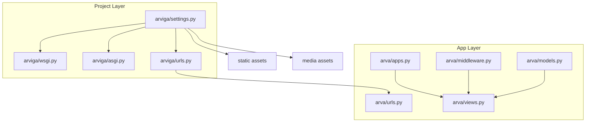
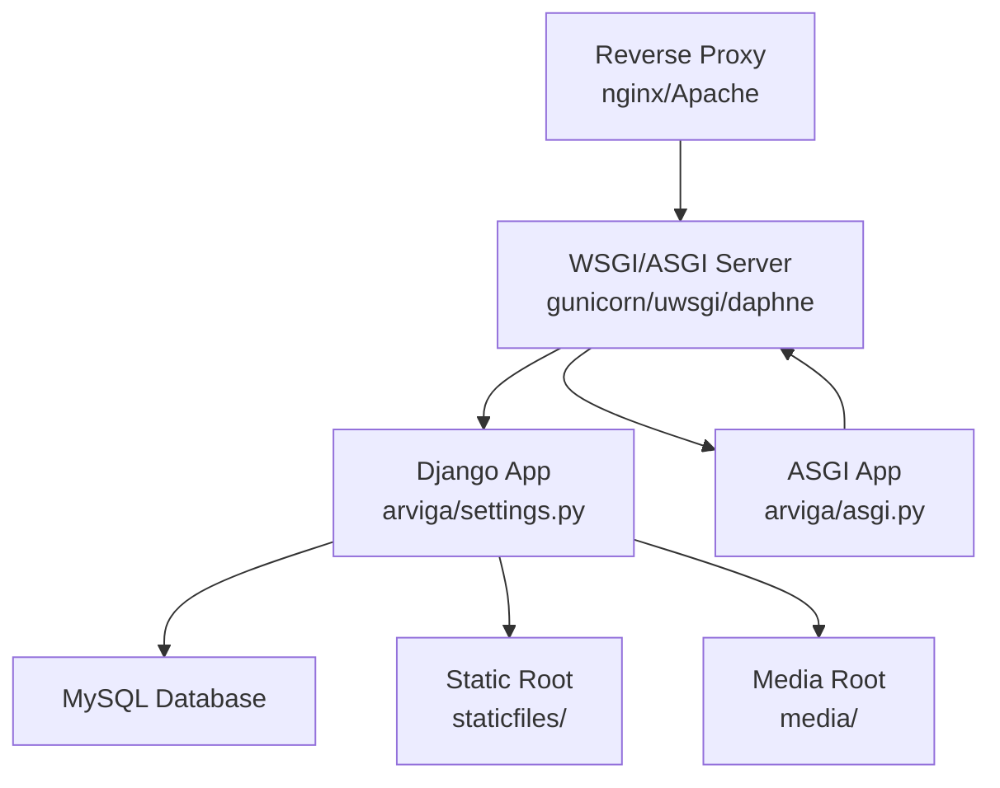
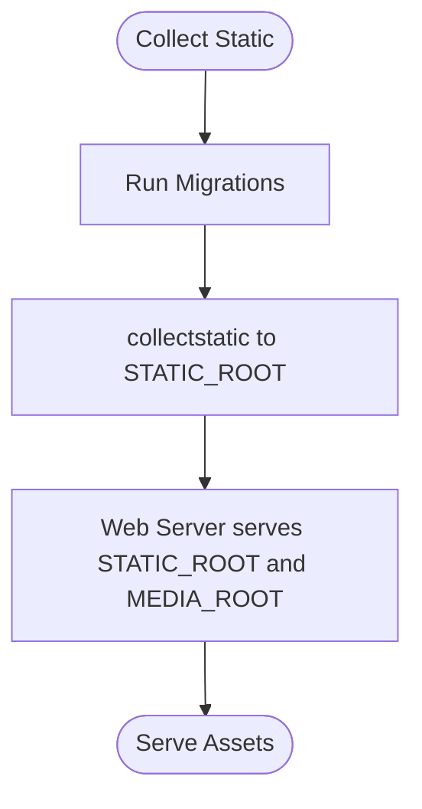
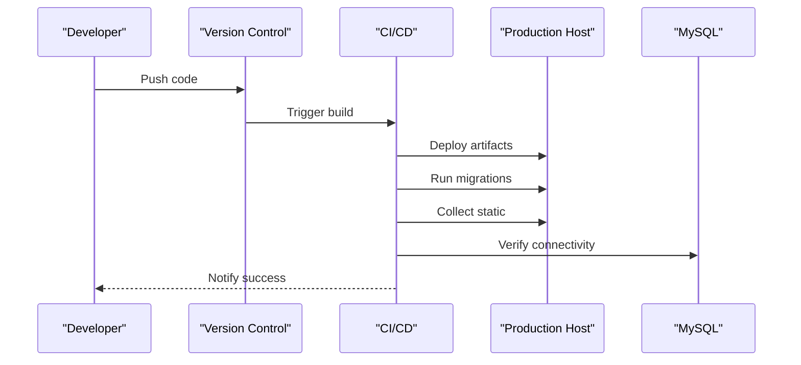
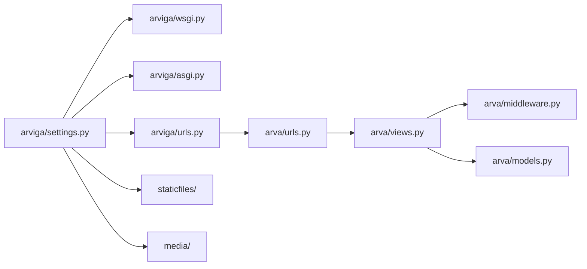

# Deployment and Production

<cite>
**Referenced Files in This Document**
- [settings.py](file://arviga/settings.py)
- [settings-hosting.py](file://settings-hosting.py)
- [wsgi.py](file://arviga/wsgi.py)
- [asgi.py](file://arviga/asgi.py)
- [urls.py](file://arviga/urls.py)
- [urls.py](file://arva/urls.py)
- [models.py](file://arva/models.py)
- [middleware.py](file://arva/middleware.py)
- [views.py](file://arva/views.py)
- [manage.py](file://manage.py)
- [README.txt](file://README.txt)
</cite>

## Table of Contents
1. [Introduction](#introduction)
2. [Project Structure](#project-structure)
3. [Core Components](#core-components)
4. [Architecture Overview](#architecture-overview)
5. [Detailed Component Analysis](#detailed-component-analysis)
6. [Dependency Analysis](#dependency-analysis)
7. [Performance Considerations](#performance-considerations)
8. [Troubleshooting Guide](#troubleshooting-guide)
9. [Conclusion](#conclusion)
10. [Appendices](#appendices)

## Introduction
This document provides a comprehensive guide to deploying Arva Kanban in production environments. It covers production configuration requirements, database setup and optimization, static files management and serving, environment variables configuration, and performance optimization strategies. It also explains WSGI and ASGI deployment options, reverse proxy configuration, SSL/TLS setup, load balancing considerations, and the complete deployment pipeline from development to production, including database migrations, static asset collection, and application server configuration. Concrete examples of production server setup, monitoring configuration, backup procedures, and disaster recovery planning are included, along with scaling considerations, caching strategies, CDN integration, performance monitoring, troubleshooting guidance, security hardening procedures, and maintenance practices.

## Project Structure
Arva Kanban is a Django project organized around a main application package and a separate project-level configuration. The key elements for production deployment include:
- Project-level settings and WSGI/ASGI entry points
- Application-level URL routing and views
- Middleware stack for security and maintenance modes
- Models defining core domain entities and caching-sensitive settings
- Static and media assets configuration for production serving

**Diagram sources**
- [settings.py](file://arviga/settings.py#L1-L133)
- [wsgi.py](file://arviga/wsgi.py#L1-L6)
- [asgi.py](file://arviga/asgi.py#L1-L6)
- [urls.py](file://arviga/urls.py#L1-L15)
- [urls.py](file://arva/urls.py#L1-L98)
- [middleware.py](file://arva/middleware.py#L1-L39)
- [models.py](file://arva/models.py#L1-L445)

**Section sources**
- [settings.py](file://arviga/settings.py#L1-L133)
- [urls.py](file://arviga/urls.py#L1-L15)
- [urls.py](file://arva/urls.py#L1-L98)

## Core Components
This section outlines the core components relevant to production deployment and their roles:
- Settings module defines databases, static/media roots, internationalization, authentication backends, and optional local overrides.
- WSGI and ASGI entry points configure the application for production servers.
- URL configuration wires admin, app routes, and allauth.
- Middleware enforces security, tracks user activity, and supports maintenance mode.
- Models include WebsiteSettings that can be cached and influence UI behavior.

Key production-relevant settings and configurations:
- Database backend selection and connection parameters
- Static and media root configuration for collectstatic and web server serving
- Internationalization and time zone settings
- Authentication backends and social providers
- Optional local settings override mechanism

**Section sources**
- [settings.py](file://arviga/settings.py#L58-L68)
- [settings.py](file://arviga/settings.py#L103-L108)
- [settings.py](file://arviga/settings.py#L128-L132)
- [wsgi.py](file://arviga/wsgi.py#L1-L6)
- [asgi.py](file://arviga/asgi.py#L1-L6)
- [urls.py](file://arviga/urls.py#L6-L10)
- [middleware.py](file://arva/middleware.py#L7-L38)
- [models.py](file://arva/models.py#L15-L54)

## Architecture Overview
The production runtime architecture supports both WSGI and ASGI deployments. Requests flow through a reverse proxy to the application server, which serves static and media assets via configured roots. Middleware enforces security and maintenance mode checks, while the application routes handle authentication, project/task management, and AI features.

**Diagram sources**
- [settings.py](file://arviga/settings.py#L55-L56)
- [wsgi.py](file://arviga/wsgi.py#L1-L6)
- [asgi.py](file://arviga/asgi.py#L1-L6)
- [settings.py](file://arviga/settings.py#L103-L108)

## Detailed Component Analysis

### Database Setup and Optimization
Production-grade database configuration requires:
- Correct engine selection and connection parameters
- Proper charset and collation for storage
- Connection pooling and timeouts appropriate for production workloads
- Backups and replication for high availability

Recommended steps:
- Confirm the database engine matches your production backend
- Set NAME, USER, PASSWORD, HOST, PORT according to your environment
- Configure OPTIONS for charset and any driver-specific tuning
- Use a dedicated production user with minimal required privileges
- Enable connection pooling at the application or server level
- Schedule regular logical backups and test restore procedures

Operational commands:
- Apply migrations using the management command
- Verify connectivity and permissions prior to launch

**Section sources**
- [settings.py](file://arviga/settings.py#L58-L68)
- [README.txt](file://README.txt#L20-L26)

### Static Files Management and Serving
Static and media assets must be collected and served efficiently in production:
- Collect static files to the configured STATIC_ROOT
- Serve staticfiles via the web server using STATIC_ROOT
- Serve media files via the web server using MEDIA_ROOT
- Ensure proper permissions for staticfiles and media directories

Production configuration highlights:
- STATIC_URL, STATIC_ROOT, STATICFILES_DIRS define collection and serving locations
- MEDIA_URL and MEDIA_ROOT define media serving
- DEBUG toggles development-time static serving in URLs

**Diagram sources**
- [settings.py](file://arviga/settings.py#L103-L108)
- [urls.py](file://arviga/urls.py#L12-L14)

**Section sources**
- [settings.py](file://arviga/settings.py#L103-L108)
- [urls.py](file://arviga/urls.py#L12-L14)

### Environment Variables Configuration
Environment variables are essential for production security and flexibility:
- SECRET_KEY must be strong and kept secret
- ALLOWED_HOSTS must match production domains
- Database credentials and hostnames
- Email backend credentials
- Optional local overrides via local settings import

Best practices:
- Store secrets outside version control
- Rotate keys and passwords regularly
- Use distinct keys per environment
- Restrict ALLOWED_HOSTS to production domains only

**Section sources**
- [settings.py](file://arviga/settings.py#L5-L7)
- [settings.py](file://arviga/settings.py#L78-L82)
- [settings.py](file://arviga/settings.py#L128-L132)

### WSGI and ASGI Deployment Options
The project supports both WSGI and ASGI:
- WSGI entry point configures the Django WSGI application
- ASGI entry point configures the Django ASGI application for async features

Production guidance:
- Choose WSGI for synchronous request handling
- Choose ASGI when using channels or async-compatible components
- Configure process/thread workers according to CPU and memory capacity
- Use process managers (e.g., systemd) to supervise application instances

**Section sources**
- [settings.py](file://arviga/settings.py#L55-L56)
- [wsgi.py](file://arviga/wsgi.py#L1-L6)
- [asgi.py](file://arviga/asgi.py#L1-L6)

### Reverse Proxy Configuration
Reverse proxy configuration is critical for performance and security:
- Terminate TLS at the proxy (recommended)
- Forward requests to the application server
- Serve static and media files directly from the proxy or CDN
- Enforce security headers and rate limiting

Common proxy features:
- SSL/TLS termination
- HTTP/2 or HTTP/3
- Compression and caching
- Health checks and failover

[No sources needed since this section provides general guidance]

### Load Balancing Considerations
Load balancing improves availability and scalability:
- Use sticky sessions if session-based authentication is used
- Implement health checks and auto-healing
- Scale horizontally by adding application instances
- Place a load balancer in front of multiple application servers

[No sources needed since this section provides general guidance]

### Complete Deployment Pipeline
End-to-end deployment from development to production:
1. Prepare environment variables and secrets
2. Install dependencies and apply migrations
3. Collect static files to STATIC_ROOT
4. Configure reverse proxy and application server
5. Start application instances behind the proxy
6. Monitor and validate service health

**Diagram sources**
- [README.txt](file://README.txt#L25-L26)
- [settings.py](file://arviga/settings.py#L103-L108)

**Section sources**
- [README.txt](file://README.txt#L16-L32)
- [manage.py](file://manage.py#L5-L8)

### Monitoring Configuration
Monitoring ensures operational visibility:
- Application logs from the process manager and web server
- Database performance metrics and slow query logs
- Health endpoints and uptime checks
- Alerting on errors and latency spikes

[No sources needed since this section provides general guidance]

### Backup Procedures
Backup and recovery are essential for business continuity:
- Database dumps (logical and physical)
- Archive staticfiles and media directories
- Test restoration procedures regularly
- Automate backups with retention policies

[No sources needed since this section provides general guidance]

### Disaster Recovery Planning
Disaster recovery ensures rapid recovery:
- Document recovery steps and contact trees
- Maintain offsite backups
- Practice failover drills
- Define RTO/RPO targets

[No sources needed since this section provides general guidance]

### Scaling Considerations
Scaling strategies for production:
- Horizontal scaling by adding application instances
- Vertical scaling by increasing CPU/memory
- Database read replicas for reporting
- CDN for static assets and media

[No sources needed since this section provides general guidance]

### Caching Strategies
Caching improves performance:
- Use middleware-level caching for repeated queries
- Cache frequently accessed settings (e.g., WebsiteSettings)
- Leverage browser caching for static assets
- Use CDN caching for global distribution

**Section sources**
- [middleware.py](file://arva/middleware.py#L31-L34)

### CDN Integration
CDN integration reduces latency:
- Serve staticfiles and media via CDN
- Configure cache headers and invalidation policies
- Ensure HTTPS and proper origin pull configuration

[No sources needed since this section provides general guidance]

### Performance Monitoring
Performance monitoring includes:
- Latency and throughput metrics
- Error rates and saturation points
- Database query performance
- Frontend performance (TTI, TBT)

[No sources needed since this section provides general guidance]

## Dependency Analysis
This section maps the dependencies among core components involved in production deployment.

**Diagram sources**
- [settings.py](file://arviga/settings.py#L1-L133)
- [wsgi.py](file://arviga/wsgi.py#L1-L6)
- [asgi.py](file://arviga/asgi.py#L1-L6)
- [urls.py](file://arviga/urls.py#L1-L15)
- [urls.py](file://arva/urls.py#L1-L98)
- [views.py](file://arva/views.py#L1-L800)
- [middleware.py](file://arva/middleware.py#L1-L39)
- [models.py](file://arva/models.py#L1-L445)

**Section sources**
- [settings.py](file://arviga/settings.py#L1-L133)
- [urls.py](file://arva/urls.py#L1-L98)

## Performance Considerations
- Optimize database queries and use indexing for frequently filtered fields
- Minimize template rendering overhead and leverage caching
- Compress and cache static assets; enable long-lived caching headers
- Use asynchronous features (ASGI) when applicable
- Monitor and tune application worker processes

[No sources needed since this section provides general guidance]

## Troubleshooting Guide
Common deployment issues and resolutions:
- Permission denied on static/media directories: fix ownership and permissions
- Database connection failures: verify credentials, host reachability, and firewall rules
- Misconfigured ALLOWED_HOSTS: ensure production domains are included
- collectstatic failures: confirm write permissions and disk space
- Reverse proxy errors: validate TLS certificates and upstream configuration

**Section sources**
- [settings.py](file://arviga/settings.py#L7-L7)
- [settings.py](file://arviga/settings.py#L103-L108)
- [README.txt](file://README.txt#L20-L26)

## Conclusion
Deploying Arva Kanban in production involves careful attention to configuration, database setup, static/media serving, reverse proxy and TLS, load balancing, and monitoring. By following the outlined steps and best practices—securing environment variables, optimizing database and caching, leveraging CDNs, and establishing robust monitoring and backup procedures—you can achieve a reliable, scalable, and secure production environment.

[No sources needed since this section summarizes without analyzing specific files]

## Appendices

### Production Checklist
- Confirm SECRET_KEY and ALLOWED_HOSTS
- Validate database connectivity and credentials
- Run migrations and collect static
- Configure reverse proxy and TLS
- Set up monitoring and alerting
- Document backup and DR procedures
- Plan horizontal scaling and load balancing

[No sources needed since this section provides general guidance]