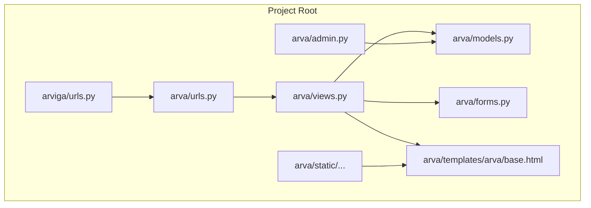
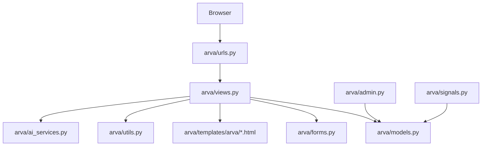
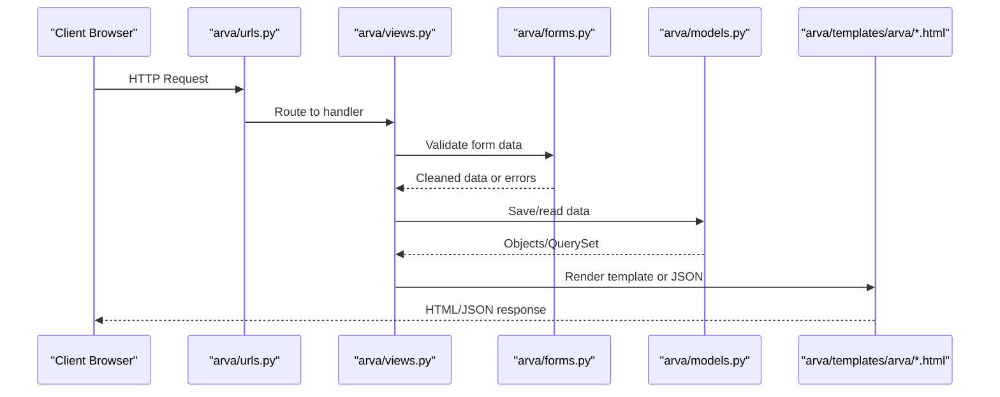
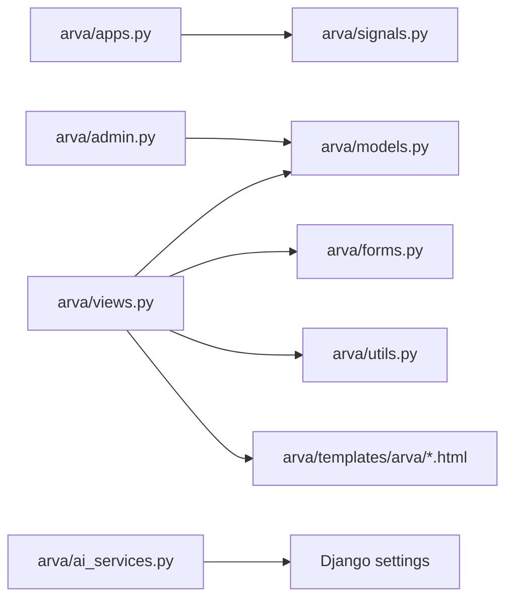

# Development Guidelines

<cite>
**Referenced Files in This Document**
- [README.txt](file://README.txt)
- [SETUP_GUIDE.md](file://SETUP_GUIDE.md)
- [arva/apps.py](file://arva/apps.py)
- [arva/models.py](file://arva/models.py)
- [arva/forms.py](file://arva/forms.py)
- [arva/views.py](file://arva/views.py)
- [arva/urls.py](file://arva/urls.py)
- [arviga/urls.py](file://arviga/urls.py)
- [arva/admin.py](file://arva/admin.py)
- [arva/utils.py](file://arva/utils.py)
- [arva/signals.py](file://arva/signals.py)
- [arva/ai_services.py](file://arva/ai_services.py)
- [arva/templatetags/arva_tags.py](file://arva/templatetags/arva_tags.py)
- [arva/templates/arva/base.html](file://arva/templates/arva/base.html)
- [arva/templates/arva/_task_board.html](file://arva/templates/arva/_task_board.html)
- [arva/templates/arva/_task_card.html](file://arva/templates/arva/_task_card.html)
</cite>

## Table of Contents
1. [Introduction](#introduction)
2. [Project Structure](#project-structure)
3. [Core Components](#core-components)
4. [Architecture Overview](#architecture-overview)
5. [Detailed Component Analysis](#detailed-component-analysis)
6. [Dependency Analysis](#dependency-analysis)
7. [Performance Considerations](#performance-considerations)
8. [Testing Strategies](#testing-strategies)
9. [Contributing Guidelines](#contributing-guidelines)
10. [Troubleshooting Guide](#troubleshooting-guide)
11. [Conclusion](#conclusion)
12. [Appendices](#appendices)

## Introduction
This document defines comprehensive development guidelines for contributing to Arva Kanban. It consolidates code organization standards aligned with Django conventions, template structure guidelines, JavaScript best practices, testing strategies, and contribution workflows. It also explains coding standards, naming conventions, documentation requirements, review processes, extension patterns, backward compatibility, development environment setup, debugging techniques, performance profiling, and community collaboration norms.

## Project Structure
The project follows a standard Django layout with a primary application module named arva containing models, views, forms, templates, and utilities. URL routing is split between the project-level arviga/urls.py and the app-level arva/urls.py. Templates are organized under arva/templates/arva with reusable partials and a base layout. Static assets are served via Django’s static pipeline and media files for uploads.

**Diagram sources**
- [arviga/urls.py](file://arviga/urls.py#L6-L10)
- [arva/urls.py](file://arva/urls.py#L1-L98)
- [arva/views.py](file://arva/views.py#L1-L100)
- [arva/models.py](file://arva/models.py#L1-L120)
- [arva/forms.py](file://arva/forms.py#L1-L120)
- [arva/admin.py](file://arva/admin.py#L1-L50)
- [arva/templates/arva/base.html](file://arva/templates/arva/base.html#L1-L60)

**Section sources**
- [arviga/urls.py](file://arviga/urls.py#L1-L15)
- [arva/urls.py](file://arva/urls.py#L1-L98)
- [arva/templates/arva/base.html](file://arva/templates/arva/base.html#L1-L60)

## Core Components
- Models: Define domain entities (Project, SubProject, Task, TaskList, Comment, Attachment, ChecklistItem, Label, ActivityLog, UserProfile, UserActivity, WebsiteSettings, AIChatMessage) with validation, computed properties, and relationships.
- Forms: Encapsulate validation and presentation logic for user input, including specialized forms for tasks, comments, attachments, and settings.
- Views: Handle HTTP requests, enforce permissions, orchestrate model queries, render templates, and return JSON for AJAX endpoints.
- URLs: Route endpoints to views with clear naming and grouping by feature area.
- Templates: Use a base.html with template tags for theme/layout selection and partials for modular UI components.
- Admin: Register models for Django admin with list displays and filters.
- Signals: Automate profile creation, avatar fetching from social accounts, and asynchronous welcome emails.
- Utilities: Provide helpers like email threading and user presence checks.
- AI Services: Integrate Google Gemini for AI-powered task priority analysis and chat assistant.

**Section sources**
- [arva/models.py](file://arva/models.py#L1-L445)
- [arva/forms.py](file://arva/forms.py#L1-L326)
- [arva/views.py](file://arva/views.py#L1-L200)
- [arva/urls.py](file://arva/urls.py#L1-L98)
- [arva/templates/arva/base.html](file://arva/templates/arva/base.html#L1-L120)
- [arva/admin.py](file://arva/admin.py#L1-L50)
- [arva/signals.py](file://arva/signals.py#L1-L86)
- [arva/utils.py](file://arva/utils.py#L1-L29)
- [arva/ai_services.py](file://arva/ai_services.py#L1-L326)

## Architecture Overview
The application uses Django’s MTV pattern with a layered approach:
- URL routing directs to views.
- Views coordinate models and forms, handle permissions, and render templates or JSON.
- Templates leverage a base layout and partials for modularity.
- Admin integrates with models for CRUD operations.
- Signals automate auxiliary behaviors.
- AI services encapsulate external integrations.

**Diagram sources**
- [arva/urls.py](file://arva/urls.py#L1-L98)
- [arva/views.py](file://arva/views.py#L1-L120)
- [arva/forms.py](file://arva/forms.py#L1-L120)
- [arva/models.py](file://arva/models.py#L1-L120)
- [arva/templates/arva/base.html](file://arva/templates/arva/base.html#L1-L60)
- [arva/admin.py](file://arva/admin.py#L1-L50)
- [arva/signals.py](file://arva/signals.py#L1-L40)
- [arva/utils.py](file://arva/utils.py#L1-L29)
- [arva/ai_services.py](file://arva/ai_services.py#L1-L60)

## Detailed Component Analysis

### Django Conventions and Code Organization
- App registration and readiness: arva/apps.py registers the app and imports signals upon startup.
- URL namespace and grouping: arva/urls.py groups endpoints by feature (auth, projects, lists, tasks, comments, checklist, users, settings, AI).
- Views: arva/views.py centralizes request handling, permission checks, and JSON responses for AJAX.
- Forms: arva/forms.py encapsulates validation and widget rendering for consistent UX.
- Admin: arva/admin.py registers models with list displays and filters for efficient management.
- Templates: arva/templates/arva/base.html provides a responsive layout with theme and layout selection via template tags.

Best practices derived from the codebase:
- Use class-based views or function-based views consistently; decorate AJAX endpoints with require_POST where appropriate.
- Centralize permissions in helper functions (e.g., require_role) and reuse them across views.
- Keep templates modular with partials and avoid duplicating logic in views.
- Use Django’s built-in validators and ModelForm.clean methods for robust input validation.

**Section sources**
- [arva/apps.py](file://arva/apps.py#L1-L8)
- [arva/urls.py](file://arva/urls.py#L1-L98)
- [arva/views.py](file://arva/views.py#L90-L120)
- [arva/forms.py](file://arva/forms.py#L128-L196)
- [arva/admin.py](file://arva/admin.py#L1-L50)
- [arva/templates/arva/base.html](file://arva/templates/arva/base.html#L1-L120)

### Template Structure Guidelines
- Base layout: arva/templates/arva/base.html sets up theme variables, layout selection, navigation, and includes static assets.
- Partial components: Modular partials like arva/_task_board.html and arva/_task_card.html enable reuse across views.
- Template tags: arva/templatetags/arva_tags.py exposes helpers for theme, layout, and dictionary access.

Guidelines:
- Extend base.html in feature templates and override blocks for content and extra CSS/JS.
- Use partials for UI segments (e.g., task cards, lists, modals) to promote consistency.
- Keep template logic minimal; compute data in views and pass context cleanly.

**Section sources**
- [arva/templates/arva/base.html](file://arva/templates/arva/base.html#L1-L120)
- [arva/templates/arva/_task_board.html](file://arva/templates/arva/_task_board.html#L1-L176)
- [arva/templates/arva/_task_card.html](file://arva/templates/arva/_task_card.html#L1-L185)
- [arva/templatetags/arva_tags.py](file://arva/templatetags/arva_tags.py#L1-L34)

### JavaScript Best Practices
- Asset loading: base.html loads jQuery, Bootstrap, jQuery UI, SweetAlert2, and the main JS bundle arva.js.
- Event-driven UI: The board and list views rely on AJAX endpoints and DOM manipulation; ensure event delegation and idempotent handlers.
- Modularity: Keep JavaScript modular and avoid global state where possible; initialize components after DOM ready.

Recommendations:
- Use unobtrusive JavaScript with delegated events.
- Encapsulate board interactions (drag-and-drop, inline edits) in cohesive modules.
- Prefer data-* attributes for passing context to JavaScript (as seen in board templates).

**Section sources**
- [arva/templates/arva/base.html](file://arva/templates/arva/base.html#L354-L362)
- [arva/templates/arva/_task_board.html](file://arva/templates/arva/_task_board.html#L1-L176)

### AI Services Integration
- GeminiService: Provides task priority analysis and generates a priority queue.
- AIChatService: Offers contextual chat assistance with user task context.
- Integration points: Views expose endpoints for AI features (priority queue, refresh, analyze task/project, chat).

Patterns:
- Use factory functions to obtain service instances.
- Handle parsing and validation of AI responses defensively.
- Store AI-related metadata on tasks and chat messages.

**Section sources**
- [arva/ai_services.py](file://arva/ai_services.py#L11-L189)
- [arva/ai_services.py](file://arva/ai_services.py#L196-L326)
- [arva/views.py](file://arva/views.py#L86-L97)

### Permission and Access Control
- Project visibility and role gating are handled centrally with helper functions and decorators.
- Legacy role semantics are preserved for UI compatibility while access is simplified to project membership.

Recommendations:
- Centralize permission checks in require_role and similar helpers.
- Avoid branching on legacy role tokens in new logic; rely on project membership.

**Section sources**
- [arva/views.py](file://arva/views.py#L90-L120)
- [arva/views.py](file://arva/views.py#L106-L116)

### Data Flow and AJAX Endpoints

**Diagram sources**
- [arva/urls.py](file://arva/urls.py#L1-L98)
- [arva/views.py](file://arva/views.py#L1-L120)
- [arva/forms.py](file://arva/forms.py#L128-L196)
- [arva/models.py](file://arva/models.py#L1-L120)
- [arva/templates/arva/base.html](file://arva/templates/arva/base.html#L1-L60)

## Dependency Analysis
- App initialization: arva/apps.py imports signals to wire automatic behaviors.
- Admin depends on models for display and filtering.
- Views depend on models, forms, and utilities; templates depend on models and template tags.
- AI services depend on settings and external APIs.

**Diagram sources**
- [arva/apps.py](file://arva/apps.py#L1-L8)
- [arva/admin.py](file://arva/admin.py#L1-L50)
- [arva/views.py](file://arva/views.py#L1-L120)
- [arva/forms.py](file://arva/forms.py#L1-L120)
- [arva/utils.py](file://arva/utils.py#L1-L29)
- [arva/ai_services.py](file://arva/ai_services.py#L1-L60)

**Section sources**
- [arva/apps.py](file://arva/apps.py#L7-L8)
- [arva/admin.py](file://arva/admin.py#L1-L50)
- [arva/views.py](file://arva/views.py#L1-L120)
- [arva/ai_services.py](file://arva/ai_services.py#L1-L60)

## Performance Considerations
- Efficient queries: Use select_related and prefetch_related to minimize N+1 queries (e.g., views that render boards and lists).
- Pagination: Views supporting list views use Paginator to limit result sets.
- Minimize template logic: Computation-heavy logic should be in views or utilities.
- Static assets: Serve CSS/JS via CDN/static files; avoid unnecessary reloads by leveraging AJAX endpoints.
- Background tasks: Email sending uses a threaded approach to prevent blocking.

Recommendations:
- Profile slow endpoints with Django Debug Toolbar.
- Optimize template rendering by reducing context and avoiding repeated queries.
- Cache frequently accessed computed properties (e.g., progress metrics) when appropriate.

**Section sources**
- [arva/views.py](file://arva/views.py#L747-L787)
- [arva/utils.py](file://arva/utils.py#L1-L29)

## Testing Strategies
Recommended testing approaches aligned with the codebase:
- Models
  - Unit tests for model validation and computed properties.
  - Example path: [arva/models.py](file://arva/models.py#L131-L144)
- Forms
  - Validate form.clean methods and field-level validators.
  - Example path: [arva/forms.py](file://arva/forms.py#L177-L195)
- Views
  - Test permission gating and JSON responses for AJAX endpoints.
  - Example path: [arva/views.py](file://arva/views.py#L190-L216)
- Templates
  - Verify context rendering and partial inclusion.
  - Example path: [arva/templates/arva/_task_board.html](file://arva/templates/arva/_task_board.html#L1-L176)
- Signals
  - Test automatic profile creation and email dispatch.
  - Example path: [arva/signals.py](file://arva/signals.py#L14-L18)
- AI Services
  - Mock external API calls and test parsing/validation.
  - Example path: [arva/ai_services.py](file://arva/ai_services.py#L115-L165)

Testing methodology:
- Use Django’s TestCase and RequestFactory for unit tests.
- For AJAX endpoints, assert JSON responses and HTTP status codes.
- For templates, assert rendered content and context variables.
- For signals, assert side effects (e.g., email thread started).

**Section sources**
- [arva/models.py](file://arva/models.py#L131-L144)
- [arva/forms.py](file://arva/forms.py#L177-L195)
- [arva/views.py](file://arva/views.py#L190-L216)
- [arva/templates/arva/_task_board.html](file://arva/templates/arva/_task_board.html#L1-L176)
- [arva/signals.py](file://arva/signals.py#L14-L18)
- [arva/ai_services.py](file://arva/ai_services.py#L115-L165)

## Contributing Guidelines
Workflow:
- Fork and branch from develop/main.
- Follow Django conventions: models, forms, views, templates, admin, signals, utilities.
- Add or update tests for new features.
- Keep commits focused and documented; reference issues in commit messages.
- Open a pull request with a clear description, rationale, and screenshots if UI changes.

Review process:
- At least one maintainer approval required.
- Ensure tests pass and code adheres to style and performance expectations.

Documentation requirements:
- Update README.txt or SETUP_GUIDE.md for major changes.
- Document new endpoints in arva/urls.py and their usage in views.py.
- Add template documentation for new partials.

Backward compatibility:
- Avoid removing or renaming fields/methods without deprecation notices.
- Maintain stable JSON responses for AJAX endpoints.

Community guidelines:
- Be respectful and constructive.
- Provide reproduction steps for bug reports.
- Use GitHub Discussions for design questions.

**Section sources**
- [README.txt](file://README.txt#L1-L35)
- [SETUP_GUIDE.md](file://SETUP_GUIDE.md#L1-L95)
- [arva/urls.py](file://arva/urls.py#L1-L98)

## Troubleshooting Guide
Common issues and resolutions:
- Database connectivity (MySQL):
  - Verify service status and port binding; test connection manually.
  - Example path: [SETUP_GUIDE.md](file://SETUP_GUIDE.md#L42-L51)
- Duplicate column errors during migrations:
  - Use fake migration rollback if needed.
  - Example path: [SETUP_GUIDE.md](file://SETUP_GUIDE.md#L52-L56)
- Switching to SQLite for local development:
  - Create arviga/local_settings.py with sqlite3 backend configuration.
  - Example path: [SETUP_GUIDE.md](file://SETUP_GUIDE.md#L57-L67)
- Development server commands:
  - Migrate, create superuser, runserver, install dependencies.
  - Example path: [SETUP_GUIDE.md](file://SETUP_GUIDE.md#L69-L83)

Debugging techniques:
- Enable DEBUG mode locally and use Django Debug Toolbar.
- Inspect AJAX responses and network tab for endpoint failures.
- Use logging for signals and AI service calls.

**Section sources**
- [SETUP_GUIDE.md](file://SETUP_GUIDE.md#L42-L83)

## Conclusion
These guidelines consolidate how to contribute effectively to Arva Kanban by following Django conventions, structuring templates and JavaScript thoughtfully, writing robust tests, and maintaining backward compatibility. By adhering to the patterns demonstrated in the codebase and using the recommended workflows, contributors can extend functionality safely and efficiently.

## Appendices

### Naming Conventions
- Models: PascalCase (e.g., Project, Task, TaskList).
- Forms: ModelName + Form (e.g., ProjectForm, TaskForm).
- Views: Descriptive verbs or nouns (e.g., project_detail, task_create).
- Templates: Underscore-separated partials (e.g., _task_card.html, _task_board.html).
- URL names: hyphenated and descriptive (e.g., project-detail, task-create).

**Section sources**
- [arva/models.py](file://arva/models.py#L101-L120)
- [arva/forms.py](file://arva/forms.py#L135-L166)
- [arva/urls.py](file://arva/urls.py#L1-L98)

### Extending Functionality
- Add a new model in arva/models.py with appropriate fields and validation.
- Create a form in arva/forms.py for input handling.
- Add a URL route in arva/urls.py and a view in arva/views.py.
- Render templates or return JSON for AJAX endpoints.
- Register the model in arva/admin.py if needed.
- Write tests for models, forms, and views.
- Update templates and partials as needed.

**Section sources**
- [arva/models.py](file://arva/models.py#L1-L120)
- [arva/forms.py](file://arva/forms.py#L1-L120)
- [arva/urls.py](file://arva/urls.py#L1-L98)
- [arva/views.py](file://arva/views.py#L1-L120)
- [arva/admin.py](file://arva/admin.py#L1-L50)

### Development Environment Setup
- Install dependencies and configure MySQL as described in SETUP_GUIDE.md.
- Create database, apply migrations, and create a superuser.
- Run the development server and access the application.

**Section sources**
- [SETUP_GUIDE.md](file://SETUP_GUIDE.md#L15-L41)

### Performance Profiling
- Use Django Debug Toolbar to inspect queries and timing.
- Profile template rendering and asset loading.
- Monitor AI service latency and rate limits.

**Section sources**
- [arva/ai_services.py](file://arva/ai_services.py#L11-L60)