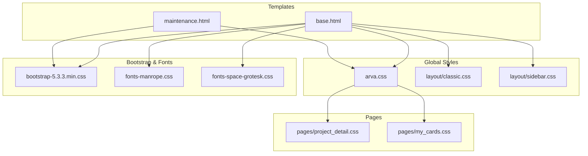
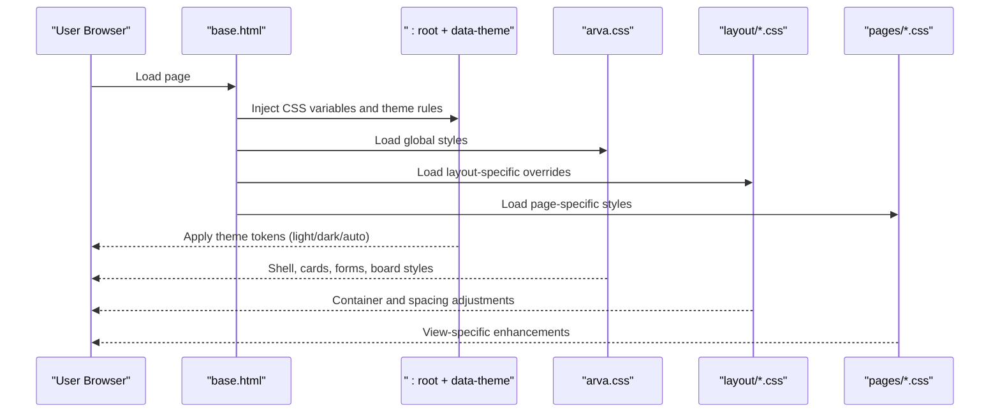
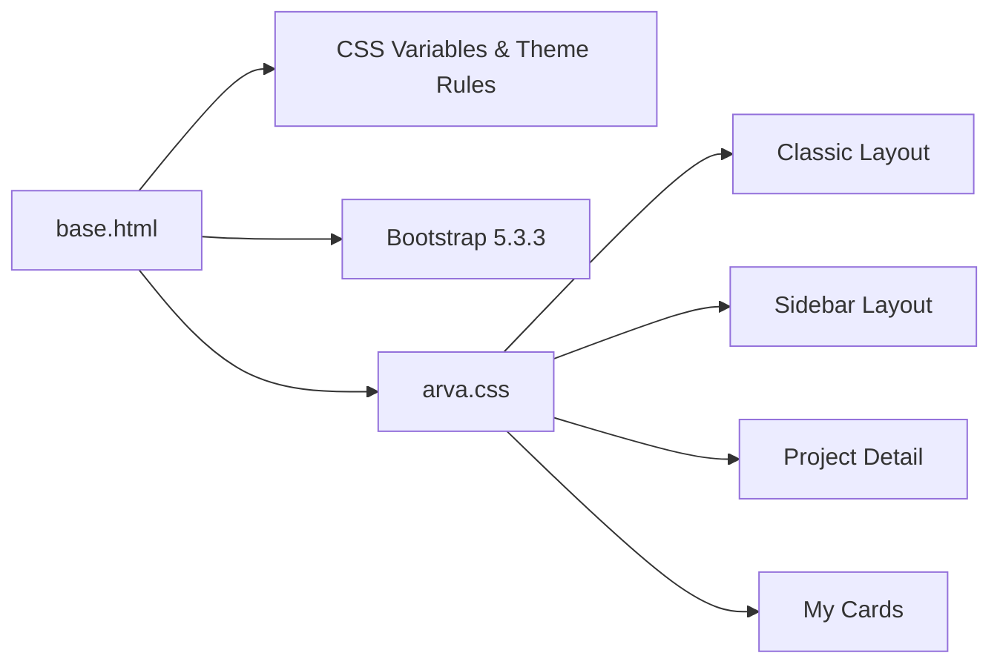

# CSS Architecture and Styling

<cite>
**Referenced Files in This Document**
- [base.html](file://arva/templates/arva/base.html)
- [maintenance.html](file://arva/templates/arva/maintenance.html)
- [arva.css](file://static/arva/css/arva.css)
- [classic.css](file://static/arva/css/layout/classic.css)
- [sidebar.css](file://static/arva/css/layout/sidebar.css)
- [project_detail.css](file://static/arva/css/pages/project_detail.css)
- [my_cards.css](file://static/arva/css/pages/my_cards.css)
- [bootstrap-5.3.3.min.css](file://static/css/bootstrap-5.3.3.min.css)
- [fonts-manrope.css](file://static/css/fonts-manrope.css)
- [fonts-space-grotesk.css](file://static/css/fonts-space-grotesk.css)
</cite>

## Table of Contents
1. [Introduction](#introduction)
2. [Project Structure](#project-structure)
3. [Core Components](#core-components)
4. [Architecture Overview](#architecture-overview)
5. [Detailed Component Analysis](#detailed-component-analysis)
6. [Dependency Analysis](#dependency-analysis)
7. [Performance Considerations](#performance-considerations)
8. [Troubleshooting Guide](#troubleshooting-guide)
9. [Conclusion](#conclusion)

## Introduction
This document explains the CSS architecture and styling system in Arva Kanban, focusing on the custom framework built on Bootstrap 5.3.3. It covers the CSS custom properties system for theme management (light, dark, auto modes), layout-specific styles for classic and sidebar layouts, responsive design breakpoints, component styling patterns, color scheme, typography, and spacing conventions. It also documents the modular CSS structure, integration with Bootstrap utilities, and best practices for maintaining consistent styling.

## Project Structure
The styling system is organized into:
- Base template injecting global CSS custom properties and theme logic
- Global Arva styles for shell, navigation, cards, forms, and board components
- Layout-specific overrides for classic and sidebar modes
- Page-specific styles for specialized views
- Bootstrap 5.3.3 for foundational utilities and component defaults
- Web fonts for typography

**Diagram sources**
- [base.html](file://arva/templates/arva/base.html#L1-L200)
- [maintenance.html](file://arva/templates/arva/maintenance.html#L29-L173)
- [arva.css](file://static/arva/css/arva.css#L1-L1150)
- [classic.css](file://static/arva/css/layout/classic.css#L1-L24)
- [sidebar.css](file://static/arva/css/layout/sidebar.css#L1-L15)
- [project_detail.css](file://static/arva/css/pages/project_detail.css#L1-L482)
- [my_cards.css](file://static/arva/css/pages/my_cards.css#L1-L297)
- [bootstrap-5.3.3.min.css](file://static/css/bootstrap-5.3.3.min.css#L1-L6)
- [fonts-manrope.css](file://static/css/fonts-manrope.css#L1-L36)
- [fonts-space-grotesk.css](file://static/css/fonts-space-grotesk.css#L1-L29)

**Section sources**
- [base.html](file://arva/templates/arva/base.html#L1-L200)
- [arva.css](file://static/arva/css/arva.css#L1-L1150)

## Core Components
- CSS custom properties system: Defines theme tokens (colors, backgrounds, shadows, radii, blur) and applies them via :root and data-theme attributes.
- Theme modes: light, dark, auto, with runtime overrides and prefers-color-scheme support.
- Layout modes: classic (top navbar) and sidebar (left navigation).
- Component library: Cards, forms, dropdowns, modals, tables, badges, chips, and task board elements.
- Typography: Manrope for body text, Space Grotesk for headings.
- Spacing and density: Consistent padding, margins, and compact variants for dense lists.

**Section sources**
- [base.html](file://arva/templates/arva/base.html#L26-L180)
- [maintenance.html](file://arva/templates/arva/maintenance.html#L29-L173)
- [arva.css](file://static/arva/css/arva.css#L1-L1150)
- [fonts-manrope.css](file://static/css/fonts-manrope.css#L1-L36)
- [fonts-space-grotesk.css](file://static/css/fonts-space-grotesk.css#L1-L29)

## Architecture Overview
The styling architecture centers on a CSS custom properties-driven theme engine integrated with Django template logic. The base template injects theme variables and layout classes, while arva.css defines the shell and component styles. Layout-specific files override container and spacing rules. Pages add targeted styles for complex views.

**Diagram sources**
- [base.html](file://arva/templates/arva/base.html#L18-L25)
- [arva.css](file://static/arva/css/arva.css#L1-L1150)
- [classic.css](file://static/arva/css/layout/classic.css#L1-L24)
- [sidebar.css](file://static/arva/css/layout/sidebar.css#L1-L15)
- [project_detail.css](file://static/arva/css/pages/project_detail.css#L1-L482)
- [my_cards.css](file://static/arva/css/pages/my_cards.css#L1-L297)

## Detailed Component Analysis

### Theme System and CSS Custom Properties
- Global tokens: primary color, navbar background, body/background, text color, card/background, sidebar/background, borders, muted text, input background, radius, shadow, blur.
- Modes:
  - light: explicit light values
  - dark: explicit dark values
  - auto: prefers-color-scheme fallback
- Runtime overrides: server-side effective_theme can force dark or auto mode.
- Bootstrap integration: Uses Bootstrap’s :root variables and data-bs-theme for dark mode compatibility.

Examples of CSS custom property usage:
- Body and text colors applied via var(--body-bg), var(--text-color)
- Card and modal backgrounds via var(--card-bg)
- Navbar background and blur via var(--navbar-bg), var(--blur)
- Borders and muted text via var(--border-color), var(--muted-text)
- Inputs via var(--input-bg)

Responsive theme behavior:
- Media queries apply dark mode when user prefers dark scheme
- Conditional blocks in templates adjust tokens for effective_theme

**Section sources**
- [base.html](file://arva/templates/arva/base.html#L26-L180)
- [maintenance.html](file://arva/templates/arva/maintenance.html#L29-L173)
- [bootstrap-5.3.3.min.css](file://static/css/bootstrap-5.3.3.min.css#L1-L6)

### Layout System: Classic vs Sidebar
- Classic layout: Top modern navbar with links styled using theme tokens.
- Sidebar layout: Left navigation with collapsible behavior and adjusted container paddings.

Key layout selectors:
- Classic: .layout-classic .navbar-modern and nav-link hover/active states
- Sidebar: .layout-sidebar .app-content container and fluid container paddings

Responsive sidebar behavior:
- Collapsible sidebar at 992px breakpoint with logo/icon switching and link text hiding
- Mobile offcanvas with custom width and background

**Section sources**
- [classic.css](file://static/arva/css/layout/classic.css#L1-L24)
- [sidebar.css](file://static/arva/css/layout/sidebar.css#L1-L15)
- [arva.css](file://static/arva/css/arva.css#L274-L351)

### Component Styling Patterns
- Cards: Rounded corners, themed backgrounds, subtle shadows, consistent padding
- Forms: Height, padding, font sizing, themed backgrounds and borders
- Dropdowns and menus: Rounded items, themed backgrounds, consistent spacing
- Modals: Header/body/footer padding, rounded corners
- Tables: Density variants, striped rows, hover effects
- Badges and chips: Rounded shapes, consistent padding, color variants
- Task board: Lists with scrollbars, draggable card states, placeholder indicators

Density patterns:
- Compact variants for cards and tables reduce spacing and font sizes

**Section sources**
- [arva.css](file://static/arva/css/arva.css#L353-L800)
- [my_cards.css](file://static/arva/css/pages/my_cards.css#L1-L297)

### Typography and Font System
- Body text: Manrope (weights 400–800)
- Headings and UI: Space Grotesk (weights 400–700)
- Font loading: Swap strategy for fast rendering

**Section sources**
- [fonts-manrope.css](file://static/css/fonts-manrope.css#L1-L36)
- [fonts-space-grotesk.css](file://static/css/fonts-space-grotesk.css#L1-L29)
- [base.html](file://arva/templates/arva/base.html#L76-L77)

### Spacing Conventions
- Consistent padding and margin scales across components
- Grid-based layouts using Bootstrap utilities
- Compact density variants for dense lists and tables
- Responsive adjustments for mobile containers

**Section sources**
- [arva.css](file://static/arva/css/arva.css#L342-L351)
- [my_cards.css](file://static/arva/css/pages/my_cards.css#L98-L117)

### Page-Specific Styles
- Project detail: Structured task lists, metadata grids, progress bars, skeleton loaders, modal tweaks
- My cards: Hero sections, card grids, density controls, filters, sorting

**Section sources**
- [project_detail.css](file://static/arva/css/pages/project_detail.css#L1-L482)
- [my_cards.css](file://static/arva/css/pages/my_cards.css#L1-L297)

## Dependency Analysis
The styling stack depends on:
- Bootstrap 5.3.3 for base utilities, components, and dark mode variables
- Template-driven theme injection for dynamic tokens
- Layout-specific overrides for container and spacing
- Page-specific styles for complex views

**Diagram sources**
- [base.html](file://arva/templates/arva/base.html#L18-L25)
- [bootstrap-5.3.3.min.css](file://static/css/bootstrap-5.3.3.min.css#L1-L6)
- [arva.css](file://static/arva/css/arva.css#L1-L1150)
- [classic.css](file://static/arva/css/layout/classic.css#L1-L24)
- [sidebar.css](file://static/arva/css/layout/sidebar.css#L1-L15)
- [project_detail.css](file://static/arva/css/pages/project_detail.css#L1-L482)
- [my_cards.css](file://static/arva/css/pages/my_cards.css#L1-L297)

**Section sources**
- [base.html](file://arva/templates/arva/base.html#L18-L25)
- [bootstrap-5.3.3.min.css](file://static/css/bootstrap-5.3.3.min.css#L1-L6)
- [arva.css](file://static/arva/css/arva.css#L1-L1150)

## Performance Considerations
- Prefer CSS custom properties for theming to avoid duplicating styles across modes.
- Keep layout overrides minimal and scoped to layout classes.
- Use compact density variants judiciously to balance readability and performance.
- Minimize heavy shadows and blur effects on low-powered devices.
- Ensure fonts are optimized and loaded efficiently.

## Troubleshooting Guide
Common issues and resolutions:
- Theme not applying: Verify :root and data-theme attributes are present and effective_theme matches expected mode.
- Dark mode mismatch: Confirm prefers-color-scheme media query and server-side effective_theme logic.
- Layout spacing anomalies: Check layout-specific overrides for containers and paddings.
- Component color mismatches: Ensure var(--card-bg), var(--text-color), and var(--border-color) are set consistently.

**Section sources**
- [base.html](file://arva/templates/arva/base.html#L26-L180)
- [maintenance.html](file://arva/templates/arva/maintenance.html#L29-L173)
- [sidebar.css](file://static/arva/css/layout/sidebar.css#L1-L15)
- [arva.css](file://static/arva/css/arva.css#L342-L351)

## Conclusion
Arva Kanban’s CSS architecture leverages a robust CSS custom properties system integrated with Bootstrap 5.3.3 and Django templates to deliver a flexible, theme-aware, and modular styling solution. The system supports classic and sidebar layouts, responsive behavior, and page-specific enhancements while maintaining consistent spacing, typography, and component patterns. Following the documented best practices ensures maintainability and scalability across future updates.