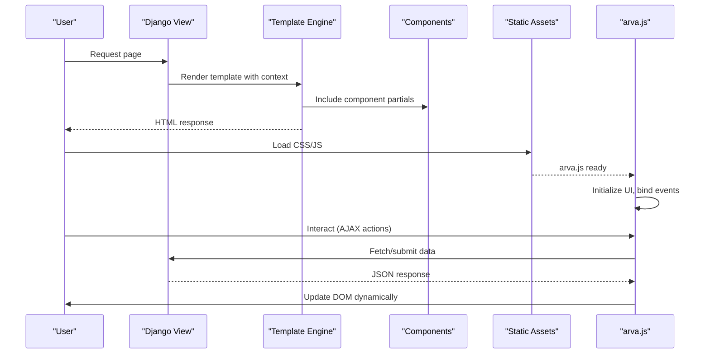
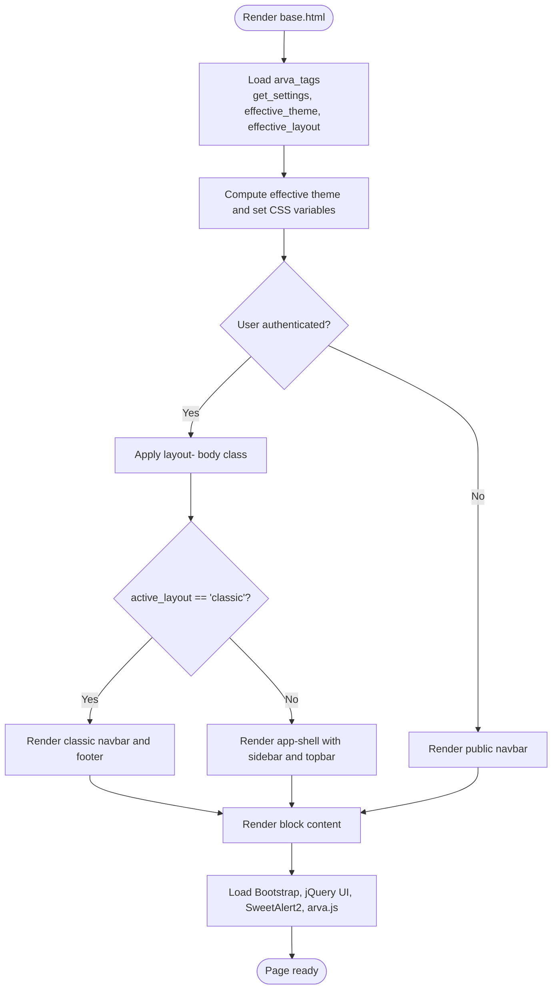
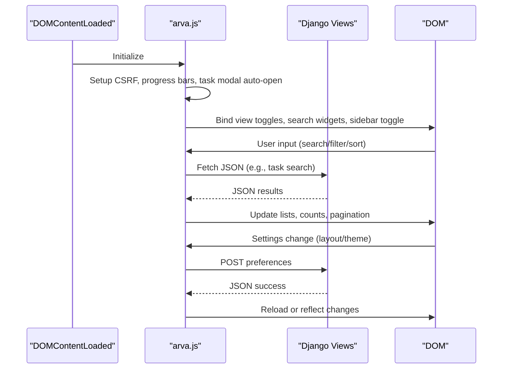
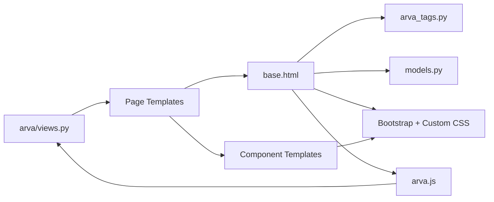

# Frontend Architecture and Templates

<cite>
**Referenced Files in This Document**
- [arva/templates/arva/base.html](file://arva/templates/arva/base.html)
- [arva/templatetags/arva_tags.py](file://arva/templatetags/arva_tags.py)
- [arva/views.py](file://arva/views.py)
- [arva/models.py](file://arva/models.py)
- [arva/templates/arva/_app_sidebar.html](file://arva/templates/arva/_app_sidebar.html)
- [arva/templates/arva/_task_card.html](file://arva/templates/arva/_task_card.html)
- [arva/templates/arva/_task_view.html](file://arva/templates/arva/_task_view.html)
- [arva/templates/arva/project_list.html](file://arva/templates/arva/project_list.html)
- [arva/templates/arva/user_settings.html](file://arva/templates/arva/user_settings.html)
- [arva/templates/arva/_task_user_search_widget.html](file://arva/templates/arva/_task_user_search_widget.html)
- [arva/templates/arva/_view_toggle_tabs.html](file://arva/templates/arva/_view_toggle_tabs.html)
- [arva/templates/arva/_project_item.html](file://arva/templates/arva/_project_item.html)
- [arva/templates/arva/_comment_list.html](file://arva/templates/arva/_comment_list.html)
- [static/arva/js/arva.js](file://static/arva/js/arva.js)
- [static/arva/css/layout/sidebar.css](file://static/arva/css/layout/sidebar.css)
- [static/arva/css/layout/classic.css](file://static/arva/css/layout/classic.css)
- [static/arva/css/pages/project_list.css](file://static/arva/css/pages/project_list.css)
</cite>

## Table of Contents
1. [Introduction](#introduction)
2. [Project Structure](#project-structure)
3. [Core Components](#core-components)
4. [Architecture Overview](#architecture-overview)
5. [Detailed Component Analysis](#detailed-component-analysis)
6. [Dependency Analysis](#dependency-analysis)
7. [Performance Considerations](#performance-considerations)
8. [Troubleshooting Guide](#troubleshooting-guide)
9. [Conclusion](#conclusion)
10. [Appendices](#appendices)

## Introduction
This document explains the frontend architecture and template system in Arva Kanban. It covers Django template inheritance, Bootstrap 5.3.3 integration, custom CSS architecture, and JavaScript components centered around the main arva.js file. It documents the template tag system, component-based templating approach, and how the base template coordinates all page layouts. It also details responsive design, theme switching, layout customization, server-side rendering combined with client-side interactivity, AJAX handling, and dynamic content updates. Accessibility and cross-browser compatibility considerations are addressed alongside performance optimization techniques.

## Project Structure
The frontend is organized around a reusable base template and a set of component templates. Pages extend the base template and include smaller components to compose complex UIs. Static assets (CSS/JS) are served via Django’s static pipeline and loaded in the base template. The JavaScript module initializes UI behaviors, handles AJAX requests, and persists user preferences.

```mermaid
graph TB
subgraph "Templates"
Base["arva/base.html"]
PagePL["arva/project_list.html"]
PageUS["arva/user_settings.html"]
CompSidebar["_app_sidebar.html"]
CompTaskCard["_task_card.html"]
CompTaskView["_task_view.html"]
CompSearch["_task_user_search_widget.html"]
CompToggle["_view_toggle_tabs.html"]
CompProjItem["_project_item.html"]
CompComment["_comment_list.html"]
end
subgraph "Templating Tags"
Tags["arva_tags.py"]
end
subgraph "Views"
Views["arva/views.py"]
end
subgraph "Models"
Models["arva/models.py"]
end
subgraph "Static Assets"
JS["static/arva/js/arva.js"]
CSSBase["static/arva/css/arva.css"]
CSSLayoutSidebar["static/arva/css/layout/sidebar.css"]
CSSLayoutClassic["static/arva/css/layout/classic.css"]
CSSPagePL["static/arva/css/pages/project_list.css"]
end
PagePL --> Base
PageUS --> Base
Base --> CompSidebar
PagePL --> CompProjItem
PagePL --> CompToggle
PagePL --> CSSPagePL
PageUS --> CSSBase
Base --> Tags
Base --> Views
Base --> Models
Base --> JS
Base --> CSSLayoutSidebar
Base --> CSSLayoutClassic
```

**Diagram sources**
- [arva/templates/arva/base.html](file://arva/templates/arva/base.html#L1-L362)
- [arva/templates/arva/project_list.html](file://arva/templates/arva/project_list.html#L1-L381)
- [arva/templates/arva/user_settings.html](file://arva/templates/arva/user_settings.html#L1-L171)
- [arva/templates/arva/_app_sidebar.html](file://arva/templates/arva/_app_sidebar.html#L1-L61)
- [arva/templates/arva/_task_card.html](file://arva/templates/arva/_task_card.html#L1-L185)
- [arva/templates/arva/_task_view.html](file://arva/templates/arva/_task_view.html#L1-L314)
- [arva/templates/arva/_task_user_search_widget.html](file://arva/templates/arva/_task_user_search_widget.html#L1-L14)
- [arva/templates/arva/_view_toggle_tabs.html](file://arva/templates/arva/_view_toggle_tabs.html#L1-L32)
- [arva/templates/arva/_project_item.html](file://arva/templates/arva/_project_item.html#L1-L141)
- [arva/templates/arva/_comment_list.html](file://arva/templates/arva/_comment_list.html#L1-L41)
- [arva/templatetags/arva_tags.py](file://arva/templatetags/arva_tags.py#L1-L34)
- [arva/views.py](file://arva/views.py#L1-L800)
- [arva/models.py](file://arva/models.py#L1-L445)
- [static/arva/js/arva.js](file://static/arva/js/arva.js#L1-L800)
- [static/arva/css/layout/sidebar.css](file://static/arva/css/layout/sidebar.css#L1-L15)
- [static/arva/css/layout/classic.css](file://static/arva/css/layout/classic.css#L1-L24)
- [static/arva/css/pages/project_list.css](file://static/arva/css/pages/project_list.css#L1-L316)

**Section sources**
- [arva/templates/arva/base.html](file://arva/templates/arva/base.html#L1-L362)
- [arva/templatetags/arva_tags.py](file://arva/templatetags/arva_tags.py#L1-L34)
- [arva/views.py](file://arva/views.py#L1-L800)
- [arva/models.py](file://arva/models.py#L1-L445)
- [static/arva/js/arva.js](file://static/arva/js/arva.js#L1-L800)
- [static/arva/css/layout/sidebar.css](file://static/arva/css/layout/sidebar.css#L1-L15)
- [static/arva/css/layout/classic.css](file://static/arva/css/layout/classic.css#L1-L24)
- [static/arva/css/pages/project_list.css](file://static/arva/css/pages/project_list.css#L1-L316)

## Core Components
- Base template: Provides the HTML shell, loads Bootstrap and custom CSS, injects theme variables, selects layout-specific styles, and renders authenticated vs public navigation. It defines blocks for title, extra_css, content, and extra_js.
- Template tags: Provide computed settings, effective theme, and effective layout for the current user. They also expose a mapping filter for templates.
- Component templates: Reusable partials such as sidebar, task cards, task view panels, project items, comment lists, and view toggles.
- Page templates: Extend the base and assemble components into coherent pages (e.g., project list, user settings).
- JavaScript module: Centralizes AJAX CSRF handling, UI initialization, local persistence, dual-view collections, and interactive behaviors.
- CSS architecture: Bootstrap 5.3.3 base, custom variables and theme modes, layout-specific overrides, and page-specific styles.

**Section sources**
- [arva/templates/arva/base.html](file://arva/templates/arva/base.html#L1-L362)
- [arva/templatetags/arva_tags.py](file://arva/templatetags/arva_tags.py#L1-L34)
- [arva/templates/arva/_app_sidebar.html](file://arva/templates/arva/_app_sidebar.html#L1-L61)
- [arva/templates/arva/_task_card.html](file://arva/templates/arva/_task_card.html#L1-L185)
- [arva/templates/arva/_task_view.html](file://arva/templates/arva/_task_view.html#L1-L314)
- [arva/templates/arva/_project_item.html](file://arva/templates/arva/_project_item.html#L1-L141)
- [arva/templates/arva/_comment_list.html](file://arva/templates/arva/_comment_list.html#L1-L41)
- [arva/templates/arva/_view_toggle_tabs.html](file://arva/templates/arva/_view_toggle_tabs.html#L1-L32)
- [arva/templates/arva/project_list.html](file://arva/templates/arva/project_list.html#L1-L381)
- [arva/templates/arva/user_settings.html](file://arva/templates/arva/user_settings.html#L1-L171)
- [static/arva/js/arva.js](file://static/arva/js/arva.js#L1-L800)
- [static/arva/css/layout/sidebar.css](file://static/arva/css/layout/sidebar.css#L1-L15)
- [static/arva/css/layout/classic.css](file://static/arva/css/layout/classic.css#L1-L24)
- [static/arva/css/pages/project_list.css](file://static/arva/css/pages/project_list.css#L1-L316)

## Architecture Overview
The frontend follows a layered pattern:
- Server-side rendering: Views prepare data and render templates with components.
- Template composition: Base template coordinates navigation, layout, and theme; page templates include components.
- Client-side enhancement: arva.js initializes UI, manages AJAX, and persists user preferences.



**Diagram sources**
- [arva/views.py](file://arva/views.py#L1-L800)
- [arva/templates/arva/base.html](file://arva/templates/arva/base.html#L1-L362)
- [arva/templates/arva/project_list.html](file://arva/templates/arva/project_list.html#L1-L381)
- [arva/templates/arva/user_settings.html](file://arva/templates/arva/user_settings.html#L1-L171)
- [static/arva/js/arva.js](file://static/arva/js/arva.js#L1-L800)

## Detailed Component Analysis

### Base Template and Layout Coordination
The base template sets up:
- Bootstrap and custom CSS loading
- Dynamic theme variables and prefers-color-scheme handling
- Layout selection (sidebar vs classic) and associated styles
- Authentication-aware navigation and mobile sidebar
- Global script loading and extra blocks for pages



**Diagram sources**
- [arva/templates/arva/base.html](file://arva/templates/arva/base.html#L1-L362)
- [arva/templatetags/arva_tags.py](file://arva/templatetags/arva_tags.py#L1-L34)

**Section sources**
- [arva/templates/arva/base.html](file://arva/templates/arva/base.html#L1-L362)
- [arva/templatetags/arva_tags.py](file://arva/templatetags/arva_tags.py#L1-L34)

### Template Tag System and Computed Preferences
The arva_tags module exposes:
- get_settings: Singleton WebsiteSettings for branding and theme defaults
- effective_theme: Respects user profile preference or falls back to site settings
- effective_layout: Respects user profile preference or defaults to sidebar
- get_item: Safe mapping lookup for templates

These tags are used in the base template to compute theme variables and layout classes.

**Section sources**
- [arva/templatetags/arva_tags.py](file://arva/templatetags/arva_tags.py#L1-L34)
- [arva/models.py](file://arva/models.py#L15-L54)

### Component-Based Templating Approach
Components are small, focused templates included by pages:
- Sidebar navigation: [_app_sidebar.html](file://arva/templates/arva/_app_sidebar.html#L1-L61)
- Task cards: [_task_card.html](file://arva/templates/arva/_task_card.html#L1-L185)
- Task view panel: [_task_view.html](file://arva/templates/arva/_task_view.html#L1-L314)
- Project item cards: [_project_item.html](file://arva/templates/arva/_project_item.html#L1-L141)
- Comments: [_comment_list.html](file://arva/templates/arva/_comment_list.html#L1-L41)
- Search widget: [_task_user_search_widget.html](file://arva/templates/arva/_task_user_search_widget.html#L1-L14)
- View toggles: [_view_toggle_tabs.html](file://arva/templates/arva/_view_toggle_tabs.html#L1-L32)

Pages assemble these components:
- Project list page composes view toggles, cards/table, and modals: [project_list.html](file://arva/templates/arva/project_list.html#L1-L381)
- User settings page composes layout/theme preferences and optional website settings: [user_settings.html](file://arva/templates/arva/user_settings.html#L1-L171)

**Section sources**
- [arva/templates/arva/_app_sidebar.html](file://arva/templates/arva/_app_sidebar.html#L1-L61)
- [arva/templates/arva/_task_card.html](file://arva/templates/arva/_task_card.html#L1-L185)
- [arva/templates/arva/_task_view.html](file://arva/templates/arva/_task_view.html#L1-L314)
- [arva/templates/arva/_project_item.html](file://arva/templates/arva/_project_item.html#L1-L141)
- [arva/templates/arva/_comment_list.html](file://arva/templates/arva/_comment_list.html#L1-L41)
- [arva/templates/arva/_task_user_search_widget.html](file://arva/templates/arva/_task_user_search_widget.html#L1-L14)
- [arva/templates/arva/_view_toggle_tabs.html](file://arva/templates/arva/_view_toggle_tabs.html#L1-L32)
- [arva/templates/arva/project_list.html](file://arva/templates/arva/project_list.html#L1-L381)
- [arva/templates/arva/user_settings.html](file://arva/templates/arva/user_settings.html#L1-L171)

### Responsive Design and Layout Customization
Responsive behavior is achieved through:
- Bootstrap 5.3.3 utilities and grid classes
- Custom CSS for modern cards, shadows, and typography
- Layout-specific overrides:
  - Sidebar layout: [sidebar.css](file://static/arva/css/layout/sidebar.css#L1-L15)
  - Classic layout: [classic.css](file://static/arva/css/layout/classic.css#L1-L24)
- Page-specific styles:
  - Project list density and spacing: [project_list.css](file://static/arva/css/pages/project_list.css#L1-L316)

The base template conditionally loads layout-specific styles and applies body classes to scope styles.

**Section sources**
- [arva/templates/arva/base.html](file://arva/templates/arva/base.html#L1-L362)
- [static/arva/css/layout/sidebar.css](file://static/arva/css/layout/sidebar.css#L1-L15)
- [static/arva/css/layout/classic.css](file://static/arva/css/layout/classic.css#L1-L24)
- [static/arva/css/pages/project_list.css](file://static/arva/css/pages/project_list.css#L1-L316)

### Theme Switching and CSS Variables
Theme switching is driven by:
- Effective theme computation in base template
- CSS custom properties for colors, backgrounds, and radii
- Dark mode and prefers-color-scheme media queries
- Optional override via WebsiteSettings

The JavaScript settings page binds live updates to CSS variables and persists user preferences.

**Section sources**
- [arva/templates/arva/base.html](file://arva/templates/arva/base.html#L26-L180)
- [arva/templates/arva/user_settings.html](file://arva/templates/arva/user_settings.html#L1-L171)
- [arva/views.py](file://arva/views.py#L190-L217)

### JavaScript Enhancements and AJAX Handling
The central JavaScript module (arva.js) performs:
- CSRF token extraction and global AJAX setup
- Local persistence for view modes and sidebar state
- Dual-view collection initialization for filtering/sorting/pagination
- Task search widget with debounced fetch
- Sidebar collapse toggle with viewport awareness
- Settings page handlers for layout/theme updates
- Task view modal automation and URL parameter handling



**Diagram sources**
- [static/arva/js/arva.js](file://static/arva/js/arva.js#L1-L800)
- [arva/views.py](file://arva/views.py#L190-L217)
- [arva/views.py](file://arva/views.py#L418-L464)

**Section sources**
- [static/arva/js/arva.js](file://static/arva/js/arva.js#L1-L800)
- [arva/views.py](file://arva/views.py#L190-L217)
- [arva/views.py](file://arva/views.py#L418-L464)

### Template Inheritance Patterns
Common patterns:
- Extending base: [project_list.html](file://arva/templates/arva/project_list.html#L1-L10) and [user_settings.html](file://arva/templates/arva/user_settings.html#L1-L9)
- Including components: [project_list.html](file://arva/templates/arva/project_list.html#L62-L113) and [user_settings.html](file://arva/templates/arva/user_settings.html#L10-L18)
- Passing context: Components receive scoped variables (e.g., project, task, comments)

**Section sources**
- [arva/templates/arva/project_list.html](file://arva/templates/arva/project_list.html#L1-L381)
- [arva/templates/arva/user_settings.html](file://arva/templates/arva/user_settings.html#L1-L171)

### Dynamic Content Updates and Pagination
The dual-view collection pattern supports:
- Filtering by text and extra controls
- Sorting by column keys
- Pagination with per-page selection
- Local storage persistence
- Count summaries and empty states

Examples:
- Project list: [initDualViewCollection](file://static/arva/js/arva.js#L279-L432) and [initProjectListPage](file://static/arva/js/arva.js#L434-L504)
- My cards: [initMyCardsPage](file://static/arva/js/arva.js#L536-L579)
- User list: [initUserListPage](file://static/arva/js/arva.js#L599-L692)

**Section sources**
- [static/arva/js/arva.js](file://static/arva/js/arva.js#L279-L692)

### Cross-Browser Compatibility and Accessibility
- Bootstrap 5.3.3 ensures broad browser support for layout and components.
- CSS variables and media queries are widely supported; fallbacks are minimal due to modern browser targeting.
- Accessibility:
  - Semantic HTML and proper labels in components
  - ARIA attributes in tabs and modals
  - Focusable elements and keyboard navigable controls
  - Sufficient color contrast via theme variables

[No sources needed since this section provides general guidance]

## Dependency Analysis
The frontend depends on:
- Django template engine and context
- Bootstrap 5.3.3 and supporting libraries
- Custom CSS variables and layout-specific sheets
- arva.js for runtime behaviors
- WebsiteSettings and UserProfile models for theme/layout preferences



**Diagram sources**
- [arva/views.py](file://arva/views.py#L1-L800)
- [arva/templates/arva/base.html](file://arva/templates/arva/base.html#L1-L362)
- [arva/templatetags/arva_tags.py](file://arva/templatetags/arva_tags.py#L1-L34)
- [arva/models.py](file://arva/models.py#L1-L445)
- [static/arva/js/arva.js](file://static/arva/js/arva.js#L1-L800)

**Section sources**
- [arva/views.py](file://arva/views.py#L1-L800)
- [arva/templates/arva/base.html](file://arva/templates/arva/base.html#L1-L362)
- [arva/templatetags/arva_tags.py](file://arva/templatetags/arva_tags.py#L1-L34)
- [arva/models.py](file://arva/models.py#L1-L445)
- [static/arva/js/arva.js](file://static/arva/js/arva.js#L1-L800)

## Performance Considerations
- Minimize DOM reflows by batching updates in dual-view collections.
- Debounce search inputs to reduce network requests.
- Persist UI state in localStorage to avoid re-computation on reload.
- Lazy-load heavy components where appropriate.
- Use efficient CSS selectors and avoid deep nesting in templates.
- Serve compressed static assets and leverage browser caching.

[No sources needed since this section provides general guidance]

## Troubleshooting Guide
Common issues and remedies:
- Theme not applying: Verify effective_theme tag and CSS variable injection in base template.
- Layout mismatch: Confirm user profile layout preference and body class application.
- AJAX failures: Ensure CSRF token is present and arva.js global setup is executed.
- Sidebar not collapsing: Check localStorage key and viewport media query listeners.
- Pagination not persisting: Confirm storage keys and initialization order.

**Section sources**
- [arva/templates/arva/base.html](file://arva/templates/arva/base.html#L1-L362)
- [arva/templatetags/arva_tags.py](file://arva/templatetags/arva_tags.py#L1-L34)
- [static/arva/js/arva.js](file://static/arva/js/arva.js#L1-L800)

## Conclusion
Arva Kanban’s frontend combines Django’s powerful template inheritance with Bootstrap 5.3.3 and a cohesive CSS architecture. The base template centralizes layout and theme logic, while component templates enable modular composition. The arva.js module bridges server-side rendering with client-side interactivity, offering robust AJAX handling, persistent UI behaviors, and dynamic content updates. Together, these pieces deliver a responsive, customizable, and accessible user experience.

## Appendices
- Example paths for quick reference:
  - Base template: [arva/templates/arva/base.html](file://arva/templates/arva/base.html#L1-L362)
  - Project list page: [arva/templates/arva/project_list.html](file://arva/templates/arva/project_list.html#L1-L381)
  - User settings page: [arva/templates/arva/user_settings.html](file://arva/templates/arva/user_settings.html#L1-L171)
  - Sidebar component: [arva/templates/arva/_app_sidebar.html](file://arva/templates/arva/_app_sidebar.html#L1-L61)
  - Task card component: [arva/templates/arva/_task_card.html](file://arva/templates/arva/_task_card.html#L1-L185)
  - Task view component: [arva/templates/arva/_task_view.html](file://arva/templates/arva/_task_view.html#L1-L314)
  - JavaScript module: [static/arva/js/arva.js](file://static/arva/js/arva.js#L1-L800)
  - Sidebar layout CSS: [static/arva/css/layout/sidebar.css](file://static/arva/css/layout/sidebar.css#L1-L15)
  - Classic layout CSS: [static/arva/css/layout/classic.css](file://static/arva/css/layout/classic.css#L1-L24)
  - Project list page CSS: [static/arva/css/pages/project_list.css](file://static/arva/css/pages/project_list.css#L1-L316)