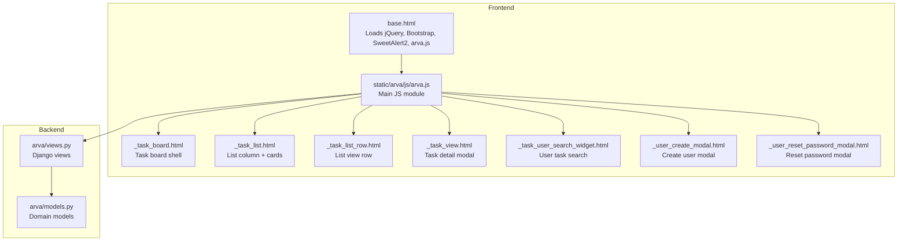
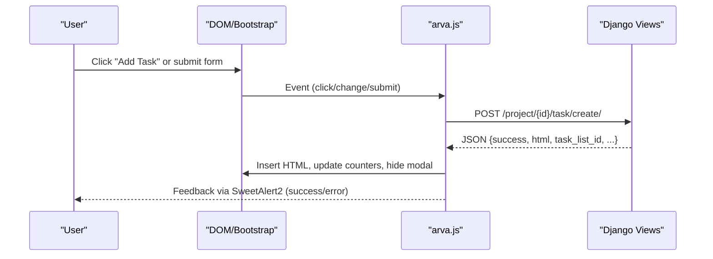
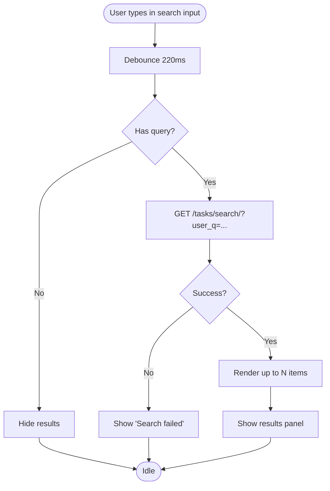
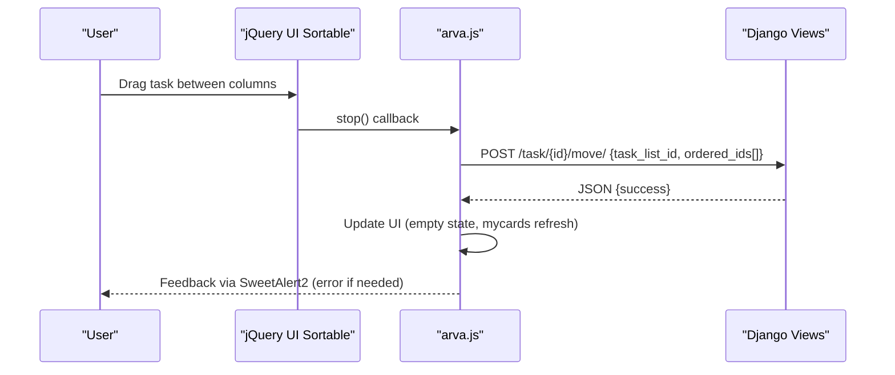
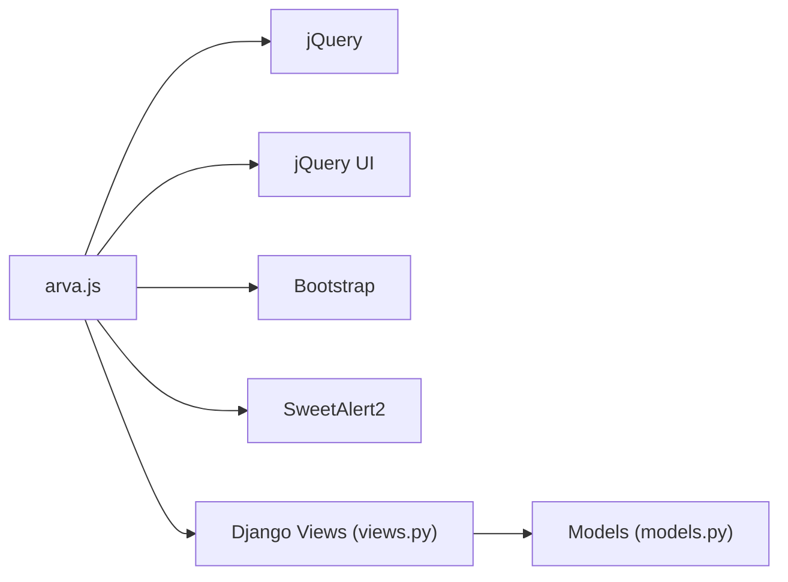

# JavaScript Components and Interactions

<cite>
**Referenced Files in This Document**
- [arva.js](file://static/arva/js/arva.js)
- [base.html](file://arva/templates/arva/base.html)
- [_task_board.html](file://arva/templates/arva/_task_board.html)
- [_task_list.html](file://arva/templates/arva/_task_list.html)
- [_task_list_row.html](file://arva/templates/arva/_task_list_row.html)
- [_task_view.html](file://arva/templates/arva/_task_view.html)
- [_task_user_search_widget.html](file://arva/templates/arva/_task_user_search_widget.html)
- [_user_create_modal.html](file://arva/templates/arva/_user_create_modal.html)
- [_user_reset_password_modal.html](file://arva/templates/arva/_user_reset_password_modal.html)
- [views.py](file://arva/views.py)
- [models.py](file://arva/models.py)
</cite>

## Table of Contents
1. [Introduction](#introduction)
2. [Project Structure](#project-structure)
3. [Core Components](#core-components)
4. [Architecture Overview](#architecture-overview)
5. [Detailed Component Analysis](#detailed-component-analysis)
6. [Dependency Analysis](#dependency-analysis)
7. [Performance Considerations](#performance-considerations)
8. [Troubleshooting Guide](#troubleshooting-guide)
9. [Conclusion](#conclusion)

## Introduction
This document explains the JavaScript architecture and client-side interactions in Arva Kanban, focusing on the main arva.js module, DOM manipulation patterns, event handling, AJAX workflows, form submissions, drag-and-drop, and integration with Django backend views. It also covers interactive components (task boards, search widgets, modals, notifications), error handling via SweetAlert2, and performance optimizations.

## Project Structure
The frontend JavaScript is centralized in a single bundle loaded by the base template. It initializes UI behaviors across pages, manages AJAX requests, and integrates with Django endpoints that return JSON or HTML fragments.

**Diagram sources**
- [base.html](file://arva/templates/arva/base.html#L354-L359)
- [arva.js](file://static/arva/js/arva.js#L1-L2725)
- [_task_board.html](file://arva/templates/arva/_task_board.html#L1-L176)
- [_task_list.html](file://arva/templates/arva/_task_list.html#L1-L52)
- [_task_list_row.html](file://arva/templates/arva/_task_list_row.html#L1-L126)
- [_task_view.html](file://arva/templates/arva/_task_view.html#L1-L314)
- [_task_user_search_widget.html](file://arva/templates/arva/_task_user_search_widget.html#L1-L14)
- [_user_create_modal.html](file://arva/templates/arva/_user_create_modal.html#L1-L33)
- [_user_reset_password_modal.html](file://arva/templates/arva/_user_reset_password_modal.html#L1-L29)
- [views.py](file://arva/views.py#L1-L2323)
- [models.py](file://arva/models.py#L1-L445)

**Section sources**
- [base.html](file://arva/templates/arva/base.html#L354-L359)
- [arva.js](file://static/arva/js/arva.js#L1-L2725)

## Core Components
- Global CSRF setup and helpers
  - Extracts CSRF cookie and sets default AJAX headers.
  - Provides helper functions for user feedback (error, confirm, prompt) using SweetAlert2.
- Initialization routines
  - Runs on DOMContentLoaded and jQuery ready to initialize persistent view toggles, search widgets, sidebar toggle, dual-view collections, and page-specific behaviors.
- AJAX and form handling
  - Uses fetch and jQuery.post for CRUD operations against Django endpoints.
  - Handles JSON responses and updates DOM safely (HTML injection, replace, prepend).
- Drag-and-drop
  - Integrates jQuery UI Sortable to move tasks between columns and reorder within a column.
- Interactive components
  - Task board with card/list views, filtering/pagination, inline editing, comments, attachments, checklist, and task movement.
  - User search widget with debounced remote search.
  - Modals for user creation/reset and task operations.

**Section sources**
- [arva.js](file://static/arva/js/arva.js#L1-L110)
- [arva.js](file://static/arva/js/arva.js#L105-L138)
- [arva.js](file://static/arva/js/arva.js#L139-L231)
- [arva.js](file://static/arva/js/arva.js#L279-L432)
- [arva.js](file://static/arva/js/arva.js#L1087-L1098)
- [arva.js](file://static/arva/js/arva.js#L1694-L1710)
- [arva.js](file://static/arva/js/arva.js#L2654-L2724)

## Architecture Overview
The frontend follows a modular initialization pattern:
- Global setup: CSRF, SweetAlert2 helpers, DOM ready.
- Feature initialization: view toggles, search, sidebar, dual-view collections, page-specific handlers.
- Event delegation: central event handlers for dynamic content and modals.
- AJAX integration: fetch/jQuery.post to Django endpoints, parsing JSON and updating DOM.

**Diagram sources**
- [arva.js](file://static/arva/js/arva.js#L1028-L1086)
- [views.py](file://arva/views.py#L476-L501)

**Section sources**
- [arva.js](file://static/arva/js/arva.js#L1028-L1086)
- [views.py](file://arva/views.py#L476-L501)

## Detailed Component Analysis

### Global CSRF and User Feedback
- CSRF extraction and default AJAX headers ensure all XHR requests are authenticated.
- SweetAlert2 wrappers provide consistent error, confirmation, and prompt dialogs.

**Section sources**
- [arva.js](file://static/arva/js/arva.js#L1-L20)
- [arva.js](file://static/arva/js/arva.js#L59-L88)

### Persistent View Toggles and Local Storage
- Stores active tab state per page using localStorage keyed by a storage key attribute.
- Applies Bootstrap Tab instance to reflect persisted selection.

**Section sources**
- [arva.js](file://static/arva/js/arva.js#L105-L138)

### Task User Search Widget
- Debounced remote search with a 220ms timer.
- Renders results as clickable items and supports focus-triggered fetch.
- Uses XMLHttpRequest header for AJAX detection on server side.

**Diagram sources**
- [arva.js](file://static/arva/js/arva.js#L139-L231)
- [views.py](file://arva/views.py#L418-L465)

**Section sources**
- [arva.js](file://static/arva/js/arva.js#L139-L231)
- [views.py](file://arva/views.py#L418-L465)
- [_task_user_search_widget.html](file://arva/templates/arva/_task_user_search_widget.html#L1-L14)

### Sidebar Toggle (Desktop)
- Persists collapsed state in localStorage and reacts to viewport changes.
- Updates aria attributes and icon classes for accessibility and UX.

**Section sources**
- [arva.js](file://static/arva/js/arva.js#L232-L278)
- [base.html](file://arva/templates/arva/base.html#L240-L247)

### Dual-View Collection (Generic Page Filter/Pagination)
- Generic initializer that applies filters, sorts, paginates, and toggles empty states.
- Supports both card and table views, with per-page and page controls.
- Saves state to localStorage and restores on load.

**Section sources**
- [arva.js](file://static/arva/js/arva.js#L279-L432)

### Project List Page
- Initializes dual-view collection for projects with custom filters and sorting.
- Syncs UI fields (sharing visibility, advanced fields) based on checkbox states.
- Validates dates and shows errors via SweetAlert2.

**Section sources**
- [arva.js](file://static/arva/js/arva.js#L434-L504)
- [views.py](file://arva/views.py#L394-L414)

### Subproject List Page
- Initializes dual-view collection for subprojects with similar mechanics.

**Section sources**
- [arva.js](file://static/arva/js/arva.js#L506-L534)
- [views.py](file://arva/views.py#L707-L711)

### My Cards Page
- Initializes dual-view collection with priority and due filters.
- Sorts by priority rank and due date.

**Section sources**
- [arva.js](file://static/arva/js/arva.js#L536-L579)
- [views.py](file://arva/views.py#L467-L474)

### Project Archive Page
- Filters archived tasks by user input.

**Section sources**
- [arva.js](file://static/arva/js/arva.js#L581-L597)

### User List Page
- Filters and sorts users by multiple criteria.
- Applies counts and toggles visibility for cards and table rows.

**Section sources**
- [arva.js](file://static/arva/js/arva.js#L599-L692)
- [views.py](file://arva/views.py#L219-L245)

### User Settings Page
- Updates theme and layout preferences via POST and reloads on success.

**Section sources**
- [arva.js](file://static/arva/js/arva.js#L694-L748)
- [views.py](file://arva/views.py#L190-L217)

### Website Settings Page
- Live preview of theme and color variables via CSS custom properties.

**Section sources**
- [arva.js](file://static/arva/js/arva.js#L750-L778)
- [base.html](file://arva/templates/arva/base.html#L26-L180)

### Project Detail Board (Card/List Views)
- Manages view mode persistence (card/list) and empty states.
- Collects visible lists for task creation modal and enforces structured project constraints.
- Sorts list rows and handles keyboard navigation.

**Section sources**
- [arva.js](file://static/arva/js/arva.js#L780-L1008)
- [_task_board.html](file://arva/templates/arva/_task_board.html#L1-L176)

### Inline Editing and Task Detail Modal
- Loads task detail via GET and replaces modal body.
- Auto-resizes textareas after content load.
- Provides skeleton loader during fetch.

**Section sources**
- [arva.js](file://static/arva/js/arva.js#L1629-L1644)
- [_task_view.html](file://arva/templates/arva/_task_view.html#L1-L314)

### Task Creation (List View)
- Validates structured project constraints (assignee, dates, ETD).
- Submits FormData via fetch and injects rendered HTML into appropriate column or list body.

**Section sources**
- [arva.js](file://static/arva/js/arva.js#L1028-L1086)
- [_task_board.html](file://arva/templates/arva/_task_board.html#L93-L113)

### Drag-and-Drop (jQuery UI Sortable)
- Enables cross-column dragging and intra-column reordering.
- On drop, sends move/reorder requests and updates UI state.

**Diagram sources**
- [arva.js](file://static/arva/js/arva.js#L2676-L2718)
- [views.py](file://arva/views.py#L1-L2323)

**Section sources**
- [arva.js](file://static/arva/js/arva.js#L2654-L2724)
- [views.py](file://arva/views.py#L1-L2323)

### Filtering and Pagination for List View
- Serializes filter form, appends page/per_page, and reloads board fragment via GET.
- Updates board wrapper and re-initializes sortable.

**Section sources**
- [arva.js](file://static/arva/js/arva.js#L2432-L2494)
- [_task_board.html](file://arva/templates/arva/_task_board.html#L116-L176)

### Comments, Attachments, Checklist
- Adds comments and replies via POST.
- Uploads attachments via FormData.
- Manages checklist items (add, edit, toggle, delete).

**Section sources**
- [arva.js](file://static/arva/js/arva.js#L1812-L1915)
- [arva.js](file://static/arva/js/arva.js#L1917-L1944)
- [arva.js](file://static/arva/js/arva.js#L1946-L1967)
- [arva.js](file://static/arva/js/arva.js#L1969-L1999)

### Task Operations (Move, Archive, Delete)
- Moves tasks across projects/subprojects/lists.
- Archives/deletes tasks with confirmation prompts.

**Section sources**
- [arva.js](file://static/arva/js/arva.js#L1728-L1754)
- [arva.js](file://static/arva/js/arva.js#L2001-L2043)

### User Management Modals and Actions
- Create user modal submits to backend and injects new row.
- Reset password modal updates user’s password.
- Bulk actions: toggle active, delete user.

**Section sources**
- [arva.js](file://static/arva/js/arva.js#L2201-L2267)
- [arva.js](file://static/arva/js/arva.js#L2324-L2353)
- [arva.js](file://static/arva/js/arva.js#L2269-L2310)
- [_user_create_modal.html](file://arva/templates/arva/_user_create_modal.html#L1-L33)
- [_user_reset_password_modal.html](file://arva/templates/arva/_user_reset_password_modal.html#L1-L29)

### Theme Selection
- Changes theme preference via POST and reloads to apply.

**Section sources**
- [arva.js](file://static/arva/js/arva.js#L1099-L1119)
- [views.py](file://arva/views.py#L190-L203)

## Dependency Analysis
- External libraries
  - jQuery, jQuery UI, Bootstrap, SweetAlert2 are loaded globally.
- Internal dependencies
  - arva.js depends on Django endpoints for all AJAX operations.
  - Templates provide data-* attributes and containers for JS to manipulate.

**Diagram sources**
- [base.html](file://arva/templates/arva/base.html#L354-L359)
- [arva.js](file://static/arva/js/arva.js#L1-L2725)
- [views.py](file://arva/views.py#L1-L2323)
- [models.py](file://arva/models.py#L1-L445)

**Section sources**
- [base.html](file://arva/templates/arva/base.html#L354-L359)
- [arva.js](file://static/arva/js/arva.js#L1-L2725)
- [views.py](file://arva/views.py#L1-L2323)
- [models.py](file://arva/models.py#L1-L445)

## Performance Considerations
- Debounced search: limits network requests during typing.
- Minimal DOM updates: injects HTML fragments, replaces single nodes, avoids full re-renders.
- Local storage caching: persists view modes, paging, and filters to reduce server load.
- Efficient sorting and pagination: client-side filtering/sorting with controlled result sets.
- Lazy initialization: sortable and other heavy behaviors initialized only when needed.

[No sources needed since this section provides general guidance]

## Troubleshooting Guide
- CSRF failures
  - Ensure CSRF cookie is present and default headers are set.
  - Verify Django CSRF middleware and cookie settings.
- Permission errors
  - Many endpoints return 403; frontend shows localized messages.
- Validation errors
  - Backend returns JSON with errors; frontend displays first error or generic message.
- Network failures
  - Catch-all error handlers display “Failed” messages; check browser console/network tab.

**Section sources**
- [arva.js](file://static/arva/js/arva.js#L1-L20)
- [arva.js](file://static/arva/js/arva.js#L1493-L1519)
- [arva.js](file://static/arva/js/arva.js#L1708-L1710)
- [arva.js](file://static/arva/js/arva.js#L2707-L2716)

## Conclusion
Arva Kanban’s frontend is a cohesive, event-driven system built around a single JS module that orchestrates AJAX interactions, DOM updates, and user feedback. Its design emphasizes:
- Centralized initialization and event delegation
- Robust error handling and user messaging
- Responsive, accessible UI patterns
- Seamless integration with Django endpoints

This architecture enables rapid iteration on task board features, search, and user management while maintaining a consistent UX across pages.