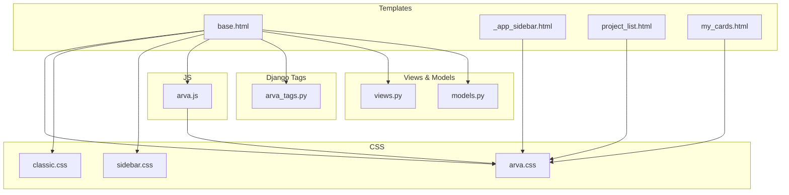
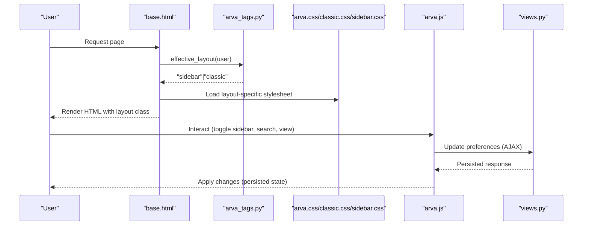
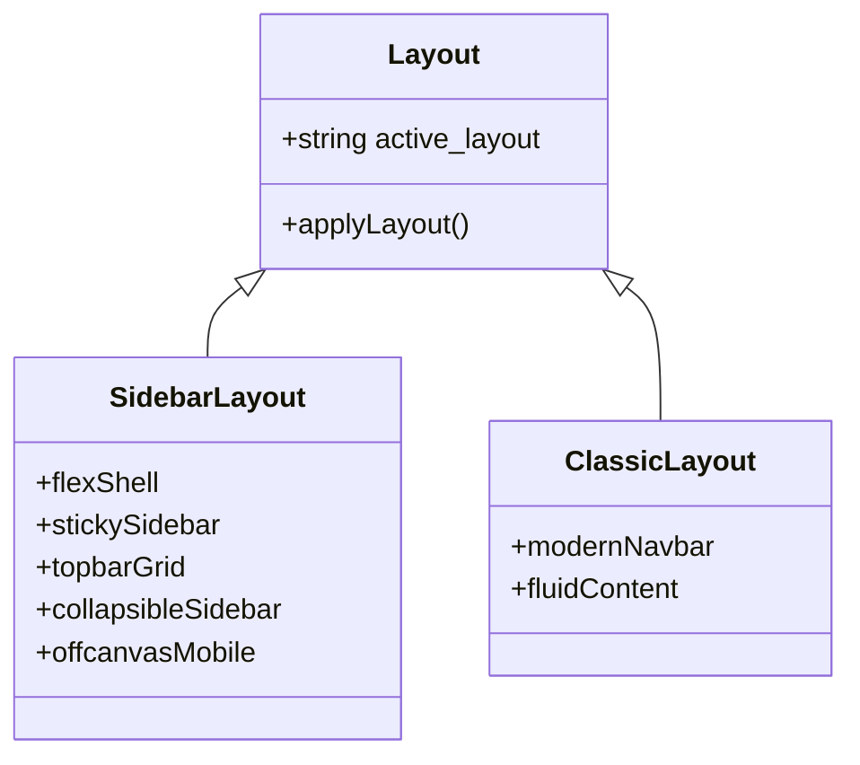
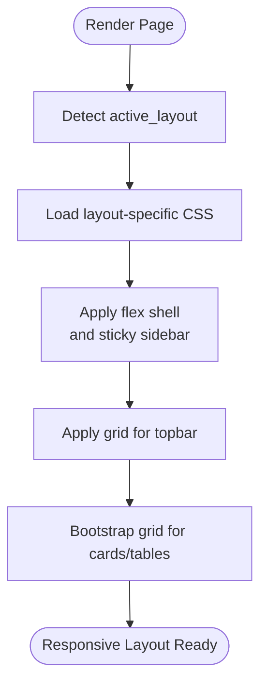
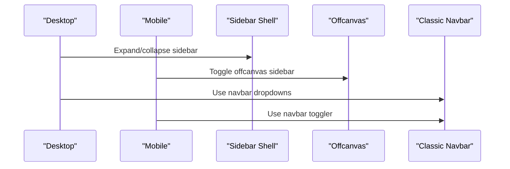
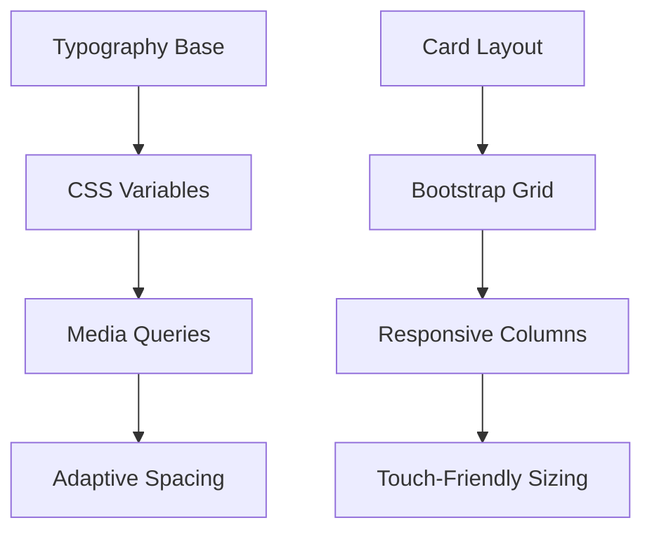
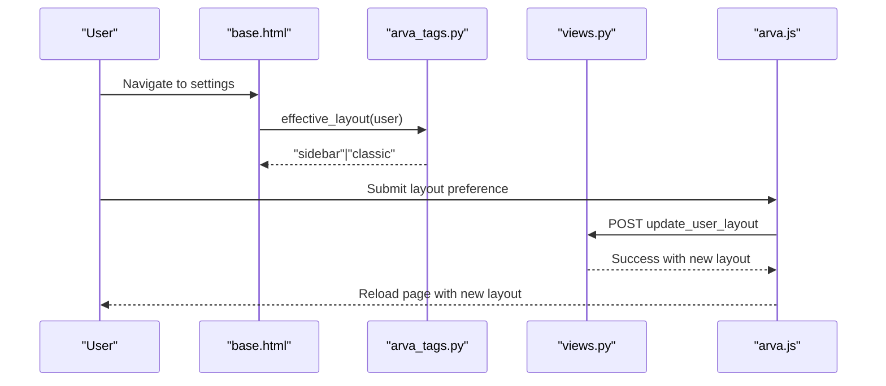
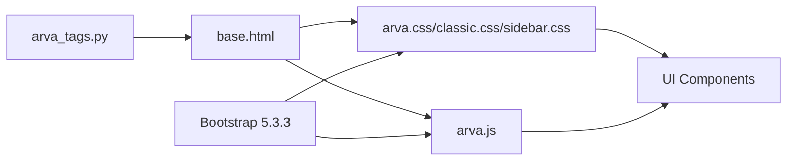

# Responsive Design and Layout System

<cite>
**Referenced Files in This Document**
- [base.html](file://arva/templates/arva/base.html)
- [_app_sidebar.html](file://arva/templates/arva/_app_sidebar.html)
- [arva.css](file://static/arva/css/arva.css)
- [classic.css](file://static/arva/css/layout/classic.css)
- [sidebar.css](file://static/arva/css/layout/sidebar.css)
- [arva.js](file://static/arva/js/arva.js)
- [arva_tags.py](file://arva/templatetags/arva_tags.py)
- [views.py](file://arva/views.py)
- [models.py](file://arva/models.py)
- [project_list.html](file://arva/templates/arva/project_list.html)
- [my_cards.html](file://arva/templates/arva/my_cards.html)
</cite>

## Table of Contents
1. [Introduction](#introduction)
2. [Project Structure](#project-structure)
3. [Core Components](#core-components)
4. [Architecture Overview](#architecture-overview)
5. [Detailed Component Analysis](#detailed-component-analysis)
6. [Dependency Analysis](#dependency-analysis)
7. [Performance Considerations](#performance-considerations)
8. [Troubleshooting Guide](#troubleshooting-guide)
9. [Conclusion](#conclusion)

## Introduction
This document explains the responsive design and layout system in Arva Kanban. It covers the dual layout architecture (classic and sidebar), Bootstrap grid integration, flexbox and CSS Grid usage, mobile-first design with breakpoints, navigation adaptation across devices, responsive typography and card layouts, touch-friendly elements, layout switching based on user preferences and viewport detection, accessibility considerations, cross-browser compatibility, and performance optimizations.

## Project Structure
The responsive system spans Django templates, CSS, and JavaScript:
- Base template selects layout and theme dynamically and injects layout-specific styles.
- Sidebar layout uses Bootstrap utilities and custom CSS Grid/flexbox for the shell and topbar.
- Classic layout uses a modern navbar with Bootstrap utilities.
- JavaScript handles layout toggling, persistence, and dual-view collections.

**Diagram sources**
- [base.html](file://arva/templates/arva/base.html#L1-L362)
- [arva.css](file://static/arva/css/arva.css#L1-L1150)
- [classic.css](file://static/arva/css/layout/classic.css#L1-L24)
- [sidebar.css](file://static/arva/css/layout/sidebar.css#L1-L15)
- [arva.js](file://static/arva/js/arva.js#L1-L800)
- [arva_tags.py](file://arva/templatetags/arva_tags.py#L1-L34)
- [views.py](file://arva/views.py#L1-L800)
- [models.py](file://arva/models.py#L1-L200)
- [_app_sidebar.html](file://arva/templates/arva/_app_sidebar.html#L1-L61)
- [project_list.html](file://arva/templates/arva/project_list.html#L1-L381)
- [my_cards.html](file://arva/templates/arva/my_cards.html#L1-L299)

**Section sources**
- [base.html](file://arva/templates/arva/base.html#L1-L362)
- [arva.css](file://static/arva/css/arva.css#L1-L1150)
- [arva.js](file://static/arva/js/arva.js#L1-L800)
- [arva_tags.py](file://arva/templatetags/arva_tags.py#L1-L34)
- [views.py](file://arva/views.py#L1-L800)
- [models.py](file://arva/models.py#L1-L200)

## Core Components
- Dual layout selection: classic vs. sidebar, controlled by user profile and defaulting to sidebar.
- Mobile-first responsive shell: sidebar layout uses Bootstrap grid and flexbox; classic layout uses navbar utilities.
- Offcanvas mobile sidebar for sidebar layout on small screens.
- Persistent view toggles and dual-view collections for cards and tables.
- Theme-aware CSS variables and media queries for light/dark/auto modes.
- Touch-friendly controls with adequate sizing and spacing.

**Section sources**
- [base.html](file://arva/templates/arva/base.html#L1-L362)
- [arva.css](file://static/arva/css/arva.css#L1-L1150)
- [arva.js](file://static/arva/js/arva.js#L1-L800)
- [arva_tags.py](file://arva/templatetags/arva_tags.py#L21-L27)
- [models.py](file://arva/models.py#L56-L100)

## Architecture Overview
The responsive architecture combines server-side layout/theme resolution with client-side JavaScript for dynamic behavior.

**Diagram sources**
- [base.html](file://arva/templates/arva/base.html#L1-L362)
- [arva_tags.py](file://arva/templatetags/arva_tags.py#L21-L27)
- [arva.css](file://static/arva/css/arva.css#L1-L1150)
- [classic.css](file://static/arva/css/layout/classic.css#L1-L24)
- [sidebar.css](file://static/arva/css/layout/sidebar.css#L1-L15)
- [arva.js](file://static/arva/js/arva.js#L694-L748)
- [views.py](file://arva/views.py#L190-L217)

## Detailed Component Analysis

### Dual Layout Architecture
- Sidebar layout:
  - Uses a flex-based shell with a fixed-width sidebar and a main content area.
  - Topbar uses CSS Grid for responsive alignment and spacing.
  - Collapsible sidebar with persistent state stored locally.
  - Offcanvas sidebar for mobile devices.
- Classic layout:
  - Uses a modern navbar with Bootstrap utilities and custom styles.
  - Full-width content area beneath the navbar.

**Diagram sources**
- [base.html](file://arva/templates/arva/base.html#L185-L345)
- [arva.css](file://static/arva/css/arva.css#L10-L163)
- [arva.js](file://static/arva/js/arva.js#L232-L277)

**Section sources**
- [base.html](file://arva/templates/arva/base.html#L185-L345)
- [arva.css](file://static/arva/css/arva.css#L10-L163)
- [arva.js](file://static/arva/js/arva.js#L232-L277)

### Bootstrap Grid, Flexbox, and CSS Grid Patterns
- Sidebar layout:
  - Shell uses flexbox for vertical stacking and horizontal sidebar/content split.
  - Topbar uses CSS Grid to distribute brand, search, and actions.
  - Cards and tables use Bootstrap grid classes for responsive columns.
- Classic layout:
  - Navbar uses flex utilities for alignment and spacing.
  - Content areas use container utilities for responsive widths.

**Diagram sources**
- [base.html](file://arva/templates/arva/base.html#L185-L345)
- [arva.css](file://static/arva/css/arva.css#L10-L163)
- [project_list.html](file://arva/templates/arva/project_list.html#L96-L114)
- [my_cards.html](file://arva/templates/arva/my_cards.html#L88-L172)

**Section sources**
- [arva.css](file://static/arva/css/arva.css#L10-L163)
- [project_list.html](file://arva/templates/arva/project_list.html#L96-L114)
- [my_cards.html](file://arva/templates/arva/my_cards.html#L88-L172)

### Navigation System Adaptation
- Desktop:
  - Sidebar layout: persistent sidebar with collapsible behavior and hover effects.
  - Classic layout: modern navbar with dropdowns and search.
- Mobile:
  - Sidebar layout: offcanvas sidebar triggered by a mobile button.
  - Classic layout: navbar toggler collapses into a hamburger menu.

**Diagram sources**
- [base.html](file://arva/templates/arva/base.html#L232-L345)
- [arva.css](file://static/arva/css/arva.css#L266-L334)
- [arva.js](file://static/arva/js/arva.js#L232-L277)

**Section sources**
- [base.html](file://arva/templates/arva/base.html#L232-L345)
- [arva.css](file://static/arva/css/arva.css#L266-L334)
- [arva.js](file://static/arva/js/arva.js#L232-L277)

### Responsive Typography Scaling and Adaptive Card Layouts
- Typography:
  - Root font family set via CSS variables and theme-aware styles.
  - Media queries adjust paddings and spacings for smaller screens.
- Cards:
  - Cards use consistent borders, shadows, and hover transforms.
  - Grid-based card layouts adapt to available space with Bootstrap grid classes.
  - Priority badges and due badges scale with card content.

**Diagram sources**
- [base.html](file://arva/templates/arva/base.html#L26-L180)
- [arva.css](file://static/arva/css/arva.css#L353-L598)
- [project_list.html](file://arva/templates/arva/project_list.html#L96-L114)
- [my_cards.html](file://arva/templates/arva/my_cards.html#L88-L172)

**Section sources**
- [base.html](file://arva/templates/arva/base.html#L26-L180)
- [arva.css](file://static/arva/css/arva.css#L353-L598)
- [project_list.html](file://arva/templates/arva/project_list.html#L96-L114)
- [my_cards.html](file://arva/templates/arva/my_cards.html#L88-L172)

### Touch-Friendly Interface Elements
- Buttons and controls use sufficient size and spacing.
- Hover and active states provide clear feedback.
- Scrollbars and scrollable containers are styled for touch devices.
- Offcanvas and modals use Bootstrap utilities for smooth interactions.

**Section sources**
- [arva.css](file://static/arva/css/arva.css#L428-L458)
- [arva.css](file://static/arva/css/arva.css#L266-L273)
- [arva.css](file://static/arva/css/arva.css#L388-L396)

### Layout Switching Mechanism
- Server-side:
  - Template tag resolves effective layout preference from user profile or defaults to sidebar.
- Client-side:
  - JavaScript persists layout preference and reloads to apply changes.
  - AJAX endpoints update user profile layout preference.

**Diagram sources**
- [arva_tags.py](file://arva/templatetags/arva_tags.py#L21-L27)
- [views.py](file://arva/views.py#L204-L217)
- [arva.js](file://static/arva/js/arva.js#L694-L748)
- [base.html](file://arva/templates/arva/base.html#L5-L25)

**Section sources**
- [arva_tags.py](file://arva/templatetags/arva_tags.py#L21-L27)
- [views.py](file://arva/views.py#L204-L217)
- [arva.js](file://static/arva/js/arva.js#L694-L748)
- [base.html](file://arva/templates/arva/base.html#L5-L25)

### Breakpoint Implementations and Mobile-First Design
- Sidebar collapse at 992px with media queries adjusting sidebar width, icons, and labels.
- Mobile adjustments reduce padding and grid gaps.
- Offcanvas sidebar activates below 992px with a constrained width.

**Section sources**
- [arva.css](file://static/arva/css/arva.css#L274-L351)
- [arva.css](file://static/arva/css/arva.css#L266-L273)
- [base.html](file://arva/templates/arva/base.html#L336-L345)

### Accessibility Considerations
- Semantic HTML and proper labeling for interactive elements.
- Focus management and keyboard navigation support via Bootstrap components.
- Sufficient color contrast and theme-aware variables for light/dark modes.
- ARIA attributes for toggles and dropdowns (e.g., aria-controls, aria-expanded).

**Section sources**
- [base.html](file://arva/templates/arva/base.html#L185-L345)
- [arva.css](file://static/arva/css/arva.css#L1-L1150)

### Cross-Browser Compatibility
- Bootstrap 5.3.3 ensures baseline compatibility for grid, flexbox, and components.
- CSS Grid and Flexbox are widely supported; fallbacks are minimal due to modern browser targets.
- JavaScript uses standard APIs with polyfills loaded via CDN assets.

**Section sources**
- [base.html](file://arva/templates/arva/base.html#L13-L18)
- [arva.js](file://static/arva/js/arva.js#L1-L800)

### Performance Optimizations
- Minimal CSS with layout-specific overrides to reduce bundle size.
- Local persistence for sidebar state to avoid reflows on repeated visits.
- Efficient DOM manipulation in JavaScript for filtering and pagination.
- Lazy initialization of components to avoid unnecessary work on pages without them.

**Section sources**
- [arva.css](file://static/arva/css/arva.css#L1-L1150)
- [arva.js](file://static/arva/js/arva.js#L232-L277)
- [arva.js](file://static/arva/js/arva.js#L105-L137)

## Dependency Analysis
The responsive system depends on:
- Django template tags for layout/theme resolution.
- CSS variables and media queries for theme and responsive adjustments.
- JavaScript for layout toggling and dual-view collections.
- Bootstrap framework for grid and component utilities.

**Diagram sources**
- [arva_tags.py](file://arva/templatetags/arva_tags.py#L1-L34)
- [base.html](file://arva/templates/arva/base.html#L1-L362)
- [arva.css](file://static/arva/css/arva.css#L1-L1150)
- [classic.css](file://static/arva/css/layout/classic.css#L1-L24)
- [sidebar.css](file://static/arva/css/layout/sidebar.css#L1-L15)
- [arva.js](file://static/arva/js/arva.js#L1-L800)

**Section sources**
- [arva_tags.py](file://arva/templatetags/arva_tags.py#L1-L34)
- [base.html](file://arva/templates/arva/base.html#L1-L362)
- [arva.css](file://static/arva/css/arva.css#L1-L1150)
- [arva.js](file://static/arva/js/arva.js#L1-L800)

## Performance Considerations
- Prefer CSS Grid and Flexbox for layout to minimize JavaScript-driven reflows.
- Use local storage for persisting user preferences to avoid server round-trips.
- Defer heavy computations until user interaction (e.g., search throttling).
- Keep layout-specific CSS minimal and scoped to avoid cascade bloat.

[No sources needed since this section provides general guidance]

## Troubleshooting Guide
- Layout not switching:
  - Verify user profile layout preference is saved and returned by the tag.
  - Confirm AJAX endpoint for updating layout preference succeeds.
- Sidebar not collapsing:
  - Check media query breakpoint and local storage state.
  - Ensure the toggle button is initialized only once.
- Mobile sidebar not opening:
  - Verify offcanvas element exists and Bootstrap offcanvas is loaded.
  - Confirm the toggle button targets the correct offcanvas ID.

**Section sources**
- [arva_tags.py](file://arva/templatetags/arva_tags.py#L21-L27)
- [views.py](file://arva/views.py#L204-L217)
- [arva.js](file://static/arva/js/arva.js#L232-L277)
- [base.html](file://arva/templates/arva/base.html#L336-L345)

## Conclusion
Arva Kanban’s responsive design leverages a dual layout architecture with mobile-first principles, Bootstrap utilities, and custom CSS Grid/flexbox. The system integrates user preferences, theme-aware variables, and JavaScript-driven persistence to deliver a cohesive experience across devices. By combining server-side layout/theme resolution with client-side enhancements, the platform achieves flexibility, performance, and accessibility.