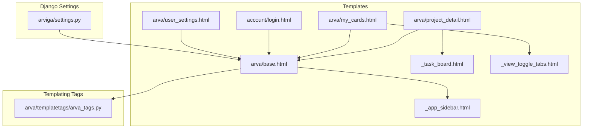
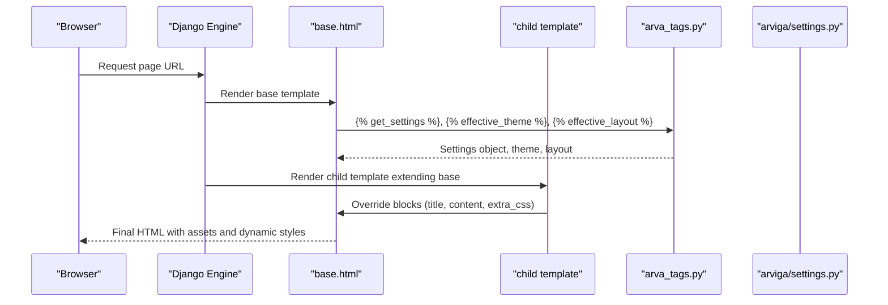
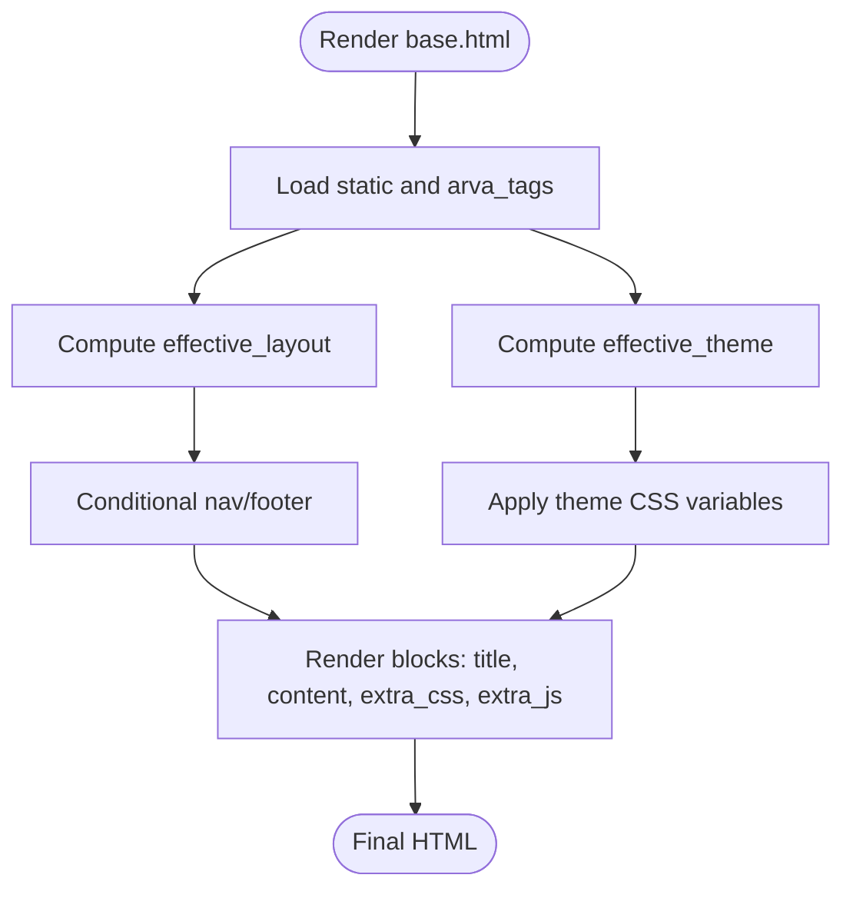
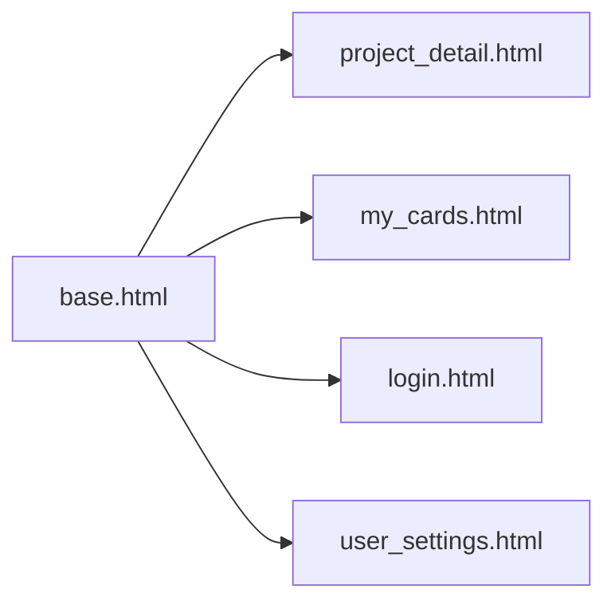
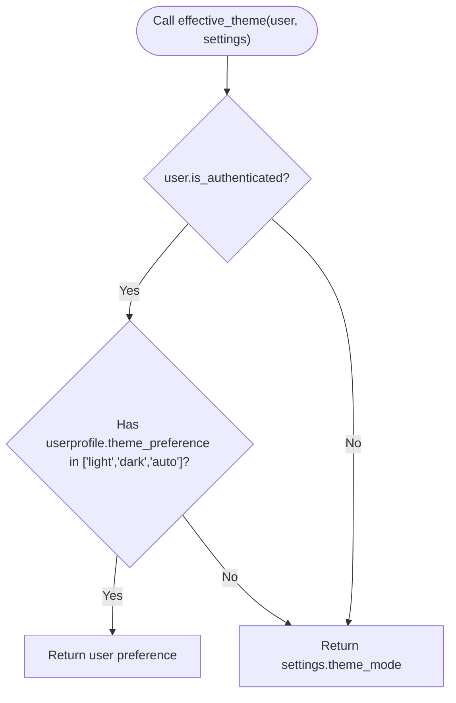
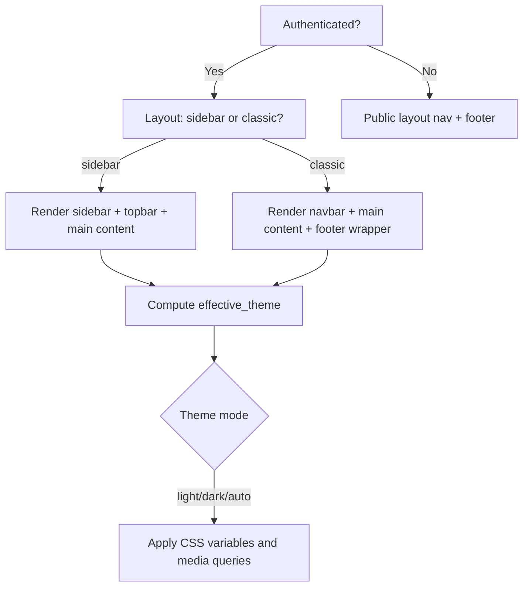
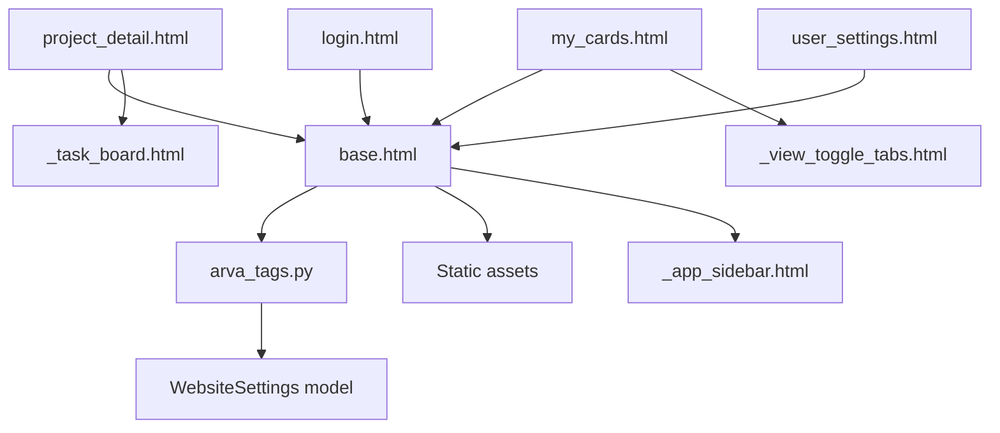

# Template System and Inheritance

<cite>
**Referenced Files in This Document**
- [base.html](file://arva/templates/arva/base.html)
- [arva_tags.py](file://arva/templatetags/arva_tags.py)
- [project_detail.html](file://arva/templates/arva/project_detail.html)
- [_task_board.html](file://arva/templates/arva/_task_board.html)
- [_app_sidebar.html](file://arva/templates/arva/_app_sidebar.html)
- [_view_toggle_tabs.html](file://arva/templates/arva/_view_toggle_tabs.html)
- [my_cards.html](file://arva/templates/arva/my_cards.html)
- [login.html](file://arva/templates/account/login.html)
- [user_settings.html](file://arva/templates/arva/user_settings.html)
- [views.py](file://arva/views.py)
- [settings.py](file://arviga/settings.py)
</cite>

## Table of Contents
1. [Introduction](#introduction)
2. [Project Structure](#project-structure)
3. [Core Components](#core-components)
4. [Architecture Overview](#architecture-overview)
5. [Detailed Component Analysis](#detailed-component-analysis)
6. [Dependency Analysis](#dependency-analysis)
7. [Performance Considerations](#performance-considerations)
8. [Troubleshooting Guide](#troubleshooting-guide)
9. [Conclusion](#conclusion)
10. [Appendices](#appendices)

## Introduction
This document explains the Django template system and inheritance architecture used in Arva Kanban. It focuses on the base layout, template inheritance patterns, custom template tags for dynamic rendering, template loading configuration, static asset inclusion, and integration with Django’s context processors. It also covers conditional rendering based on authentication, layout preferences, and theme settings, and provides best practices for reusable components and UI consistency.

## Project Structure
The template system centers around a single base layout that child templates extend. Child templates override blocks to inject page-specific content and assets. Partial templates encapsulate reusable UI components. Custom template tags compute effective theme and layout preferences and expose site-wide settings.

**Diagram sources**
- [base.html](file://arva/templates/arva/base.html#L1-L362)
- [project_detail.html](file://arva/templates/arva/project_detail.html#L1-L581)
- [my_cards.html](file://arva/templates/arva/my_cards.html#L1-L299)
- [login.html](file://arva/templates/account/login.html#L1-L23)
- [user_settings.html](file://arva/templates/arva/user_settings.html#L1-L171)
- [_task_board.html](file://arva/templates/arva/_task_board.html#L1-L176)
- [_app_sidebar.html](file://arva/templates/arva/_app_sidebar.html#L1-L61)
- [_view_toggle_tabs.html](file://arva/templates/arva/_view_toggle_tabs.html#L1-L32)
- [arva_tags.py](file://arva/templatetags/arva_tags.py#L1-L34)
- [settings.py](file://arviga/settings.py#L39-L53)

**Section sources**
- [base.html](file://arva/templates/arva/base.html#L1-L362)
- [settings.py](file://arviga/settings.py#L39-L53)

## Core Components
- Base layout: Provides the HTML skeleton, meta tags, stylesheets, and conditional navigation and footer based on authentication and layout/theme preferences.
- Child templates: Extend the base and override blocks for title and content, optionally adding page-specific CSS/JS.
- Partial templates: Encapsulate reusable UI pieces (e.g., sidebar, task board, view toggles).
- Custom template tags: Provide computed values for settings, effective theme, and effective layout.
- Template loading: Configured via Django settings to enable app-wide template discovery and context processors.

Key behaviors:
- Dynamic CSS inclusion based on user layout preference.
- Computed theme via user profile or site-wide settings.
- Conditional navigation and footer rendering for authenticated vs anonymous users.
- Page-specific assets injected via extra_css and extra_js blocks.

**Section sources**
- [base.html](file://arva/templates/arva/base.html#L1-L362)
- [arva_tags.py](file://arva/templatetags/arva_tags.py#L1-L34)
- [settings.py](file://arviga/settings.py#L39-L53)

## Architecture Overview
The template architecture follows a layered inheritance model:
- Base template defines global structure and dynamic theme/layout.
- Child templates focus on page content and assets.
- Partial templates promote reuse and modularity.
- Custom tags centralize logic for theme/layout computation and settings retrieval.

**Diagram sources**
- [base.html](file://arva/templates/arva/base.html#L1-L362)
- [arva_tags.py](file://arva/templatetags/arva_tags.py#L1-L34)
- [settings.py](file://arviga/settings.py#L39-L53)

## Detailed Component Analysis

### Base Template: Structure and Inheritance
- Loads static and custom tags.
- Computes effective theme and layout for the current request.
- Includes global CSS and conditionally loads layout-specific styles.
- Renders navigation and footer differently for authenticated users and guests.
- Exposes blocks for title, content, extra_css, and extra_js.

**Diagram sources**
- [base.html](file://arva/templates/arva/base.html#L1-L362)
- [arva_tags.py](file://arva/templatetags/arva_tags.py#L1-L34)

**Section sources**
- [base.html](file://arva/templates/arva/base.html#L1-L362)

### Template Inheritance Patterns
- Child templates extend the base and override blocks.
- Example inheritance chains:
  - project_detail.html extends base.html and overrides title and content.
  - my_cards.html extends base.html and adds page-specific CSS.
  - login.html extends base.html and renders a login form.
  - user_settings.html extends base.html and adds settings UI.

**Diagram sources**
- [base.html](file://arva/templates/arva/base.html#L1-L362)
- [project_detail.html](file://arva/templates/arva/project_detail.html#L1-L5)
- [my_cards.html](file://arva/templates/arva/my_cards.html#L1-L7)
- [login.html](file://arva/templates/account/login.html#L1-L1)
- [user_settings.html](file://arva/templates/arva/user_settings.html#L1-L7)

**Section sources**
- [project_detail.html](file://arva/templates/arva/project_detail.html#L1-L581)
- [my_cards.html](file://arva/templates/arva/my_cards.html#L1-L299)
- [login.html](file://arva/templates/account/login.html#L1-L23)
- [user_settings.html](file://arva/templates/arva/user_settings.html#L1-L171)

### Custom Template Tags: get_settings, effective_theme, effective_layout
- get_settings: Returns the WebsiteSettings singleton for global theming and branding.
- effective_theme: Chooses user theme preference if authenticated and valid; otherwise falls back to site-wide theme_mode.
- effective_layout: Chooses user layout preference if authenticated and valid; otherwise defaults to sidebar.

**Diagram sources**
- [arva_tags.py](file://arva/templatetags/arva_tags.py#L10-L19)

**Section sources**
- [arva_tags.py](file://arva/templatetags/arva_tags.py#L1-L34)

### Conditional Rendering Based on Authentication, Layout, and Theme
- Authentication: Different navigation and footer are rendered for authenticated users versus anonymous users.
- Layout preference: Sidebar vs classic layouts change the main shell and included partials.
- Theme preference: CSS variables and media queries adapt the UI to light, dark, or auto modes.

**Diagram sources**
- [base.html](file://arva/templates/arva/base.html#L185-L352)
- [arva_tags.py](file://arva/templatetags/arva_tags.py#L10-L27)

**Section sources**
- [base.html](file://arva/templates/arva/base.html#L18-L180)
- [arva_tags.py](file://arva/templatetags/arva_tags.py#L10-L27)

### Static Asset Inclusion and Extra Blocks
- Global CSS and JS are included in the base template.
- Child templates can add page-specific CSS via extra_css and JS via extra_js.
- Assets are referenced using Django’s static tag.

Examples:
- Project detail page adds a page-specific stylesheet via extra_css.
- Base template includes jQuery, Bootstrap, SweetAlert, and app JS.

**Section sources**
- [project_detail.html](file://arva/templates/arva/project_detail.html#L5-L7)
- [base.html](file://arva/templates/arva/base.html#L13-L18)
- [base.html](file://arva/templates/arva/base.html#L354-L359)

### Template Loading Mechanism and Context Processors
- Template loader configured to search app templates and a project-level templates directory.
- Context processors include debug, request, auth, and messages.
- This ensures child templates have access to user, messages, and request context automatically.

**Section sources**
- [settings.py](file://arviga/settings.py#L39-L53)

### Reusable Template Components
- Sidebar partial: Provides navigation links and active state based on current URL.
- Task board partial: Renders either card or list views and paginated lists.
- View toggle tabs partial: Encapsulates a tabbed UI with persistent state.

Best practices:
- Keep partials self-contained and accept only required context variables.
- Use consistent naming and folder organization for partials.
- Prefer data attributes and minimal inline logic in templates.

**Section sources**
- [_app_sidebar.html](file://arva/templates/arva/_app_sidebar.html#L1-L61)
- [_task_board.html](file://arva/templates/arva/_task_board.html#L1-L176)
- [_view_toggle_tabs.html](file://arva/templates/arva/_view_toggle_tabs.html#L1-L32)

### Variable Passing Between Templates
- Base template computes and exposes effective_theme and effective_layout for use in blocks and conditionals.
- Child templates receive variables from views (e.g., project_detail passes project, tasks, filters).
- Partials receive context via the include directive with context variables.

Example references:
- Base template uses settings and computed theme/layout in blocks and conditionals.
- Project detail template passes project, task_lists, task_form, and user_role to partials.

**Section sources**
- [base.html](file://arva/templates/arva/base.html#L3-L5)
- [project_detail.html](file://arva/templates/arva/project_detail.html#L240-L241)

## Dependency Analysis
- Base template depends on arva_tags for dynamic values and on static files for assets.
- Child templates depend on base and may depend on partials and context variables provided by views.
- Custom tags depend on WebsiteSettings and user profile models.

**Diagram sources**
- [base.html](file://arva/templates/arva/base.html#L1-L362)
- [arva_tags.py](file://arva/templatetags/arva_tags.py#L1-L34)
- [project_detail.html](file://arva/templates/arva/project_detail.html#L1-L581)
- [my_cards.html](file://arva/templates/arva/my_cards.html#L1-L299)
- [login.html](file://arva/templates/account/login.html#L1-L23)
- [user_settings.html](file://arva/templates/arva/user_settings.html#L1-L171)
- [_task_board.html](file://arva/templates/arva/_task_board.html#L1-L176)
- [_app_sidebar.html](file://arva/templates/arva/_app_sidebar.html#L1-L61)
- [_view_toggle_tabs.html](file://arva/templates/arva/_view_toggle_tabs.html#L1-L32)

**Section sources**
- [arva_tags.py](file://arva/templatetags/arva_tags.py#L1-L34)
- [views.py](file://arva/views.py#L136-L160)

## Performance Considerations
- Minimize repeated database queries in templates; fetch expensive data in views and pass via context.
- Use partials to avoid duplicating markup and logic.
- Keep extra_css and extra_js scoped to pages that need them to reduce payload.
- Avoid heavy computations in templates; compute in tags or views.

## Troubleshooting Guide
Common issues and resolutions:
- Theme not applying: Verify effective_theme resolves to a supported value and that CSS variables are present in the base template.
- Layout mismatch: Confirm effective_layout returns a valid layout and that the base template conditionals match expectations.
- Missing assets: Ensure static paths are correct and staticfiles are collected appropriately.
- Partial context errors: Check that included partials receive required context variables.

**Section sources**
- [base.html](file://arva/templates/arva/base.html#L18-L180)
- [arva_tags.py](file://arva/templatetags/arva_tags.py#L10-L27)

## Conclusion
Arva Kanban’s template system leverages a robust base layout with strong inheritance and modular partials. Custom template tags centralize dynamic logic for theme and layout, while Django’s template loading and context processors ensure consistent availability of request and user data. Following the documented patterns and best practices will help maintain a consistent, scalable UI across the application.

## Appendices
- Example inheritance chain: child templates extend base and override content and extra assets.
- Example partial usage: include directives pass context variables to reusable components.
- Example dynamic rendering: theme and layout computed at render-time and reflected in CSS and DOM.