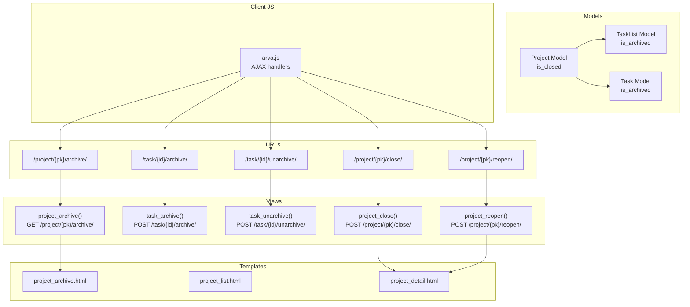
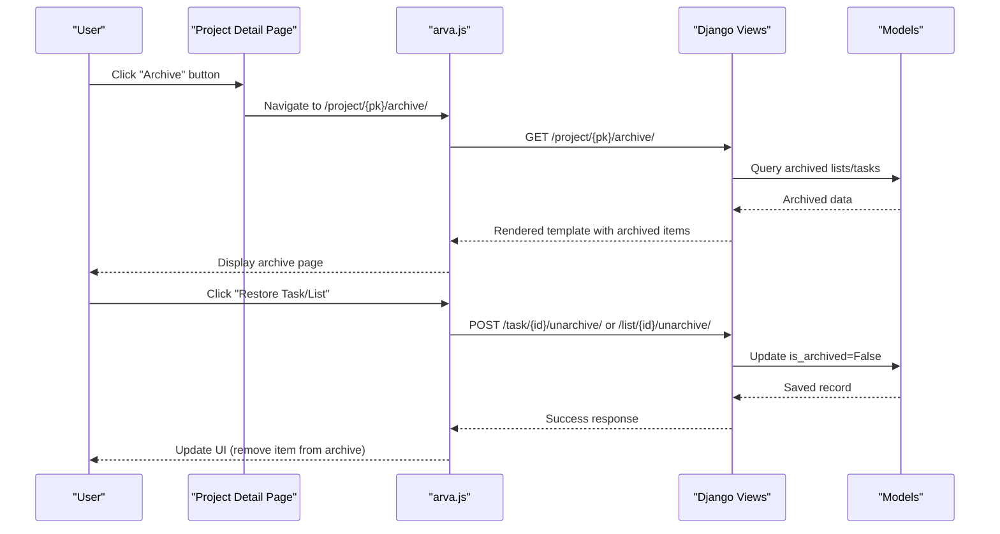
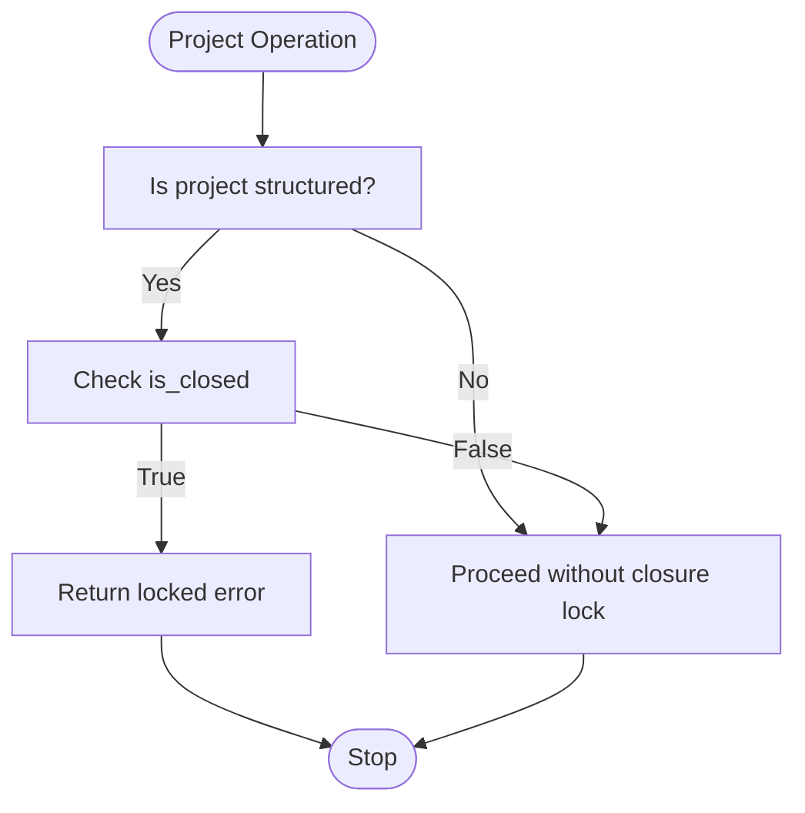
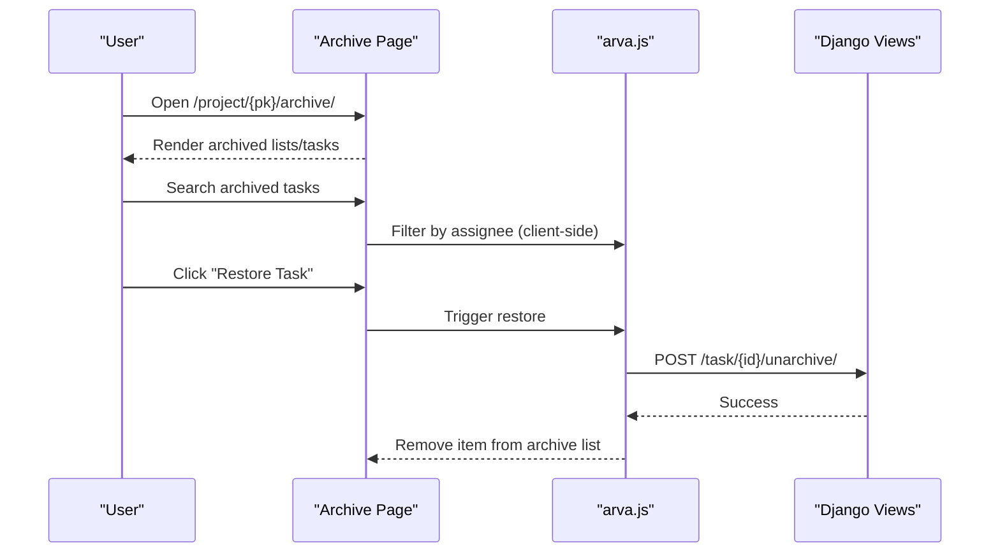
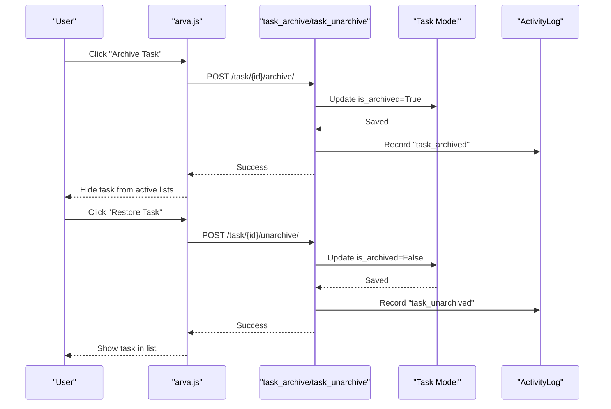
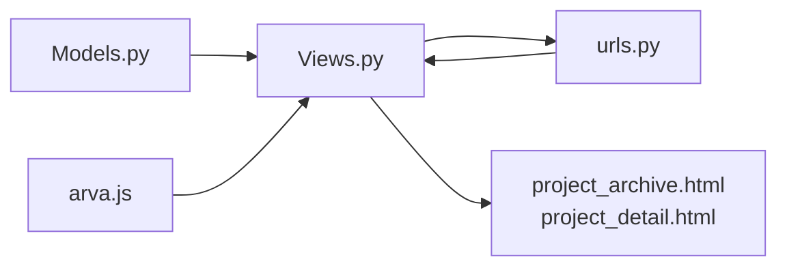

# Archive and Restore Functionality

<cite>
**Referenced Files in This Document**
- [models.py](file://arva/models.py)
- [views.py](file://arva/views.py)
- [urls.py](file://arva/urls.py)
- [project_archive.html](file://arva/templates/arva/project_archive.html)
- [project_list.html](file://arva/templates/arva/project_list.html)
- [project_detail.html](file://arva/templates/arva/project_detail.html)
- [arva.js](file://static/arva/js/arva.js)
- [project_archive.css](file://static/arva/css/pages/project_archive.css)
</cite>

## Table of Contents
1. [Introduction](#introduction)
2. [Project Structure](#project-structure)
3. [Core Components](#core-components)
4. [Architecture Overview](#architecture-overview)
5. [Detailed Component Analysis](#detailed-component-analysis)
6. [Dependency Analysis](#dependency-analysis)
7. [Performance Considerations](#performance-considerations)
8. [Troubleshooting Guide](#troubleshooting-guide)
9. [Conclusion](#conclusion)

## Introduction
This document explains the archive and restore functionality in Arva Kanban, focusing on how projects, lists, and tasks are archived and restored. It covers the is_closed flag for project closure, archived project visibility, filtering of archived items, and the impact on access permissions. It also documents the archive interface, bulk operations, preservation of history and metadata, security implications, and integration with activity logging.

## Project Structure
The archive feature spans models, views, URLs, templates, and client-side JavaScript:
- Models define the is_closed flag on projects and is_archived flags on lists and tasks.
- Views implement archive/unarchive endpoints and the archive page renderer.
- URLs route archive-related requests to the appropriate handlers.
- Templates present archived lists and tasks and provide restore actions.
- JavaScript handles user interactions and AJAX calls for archive/unarchive operations.

**Diagram sources**
- [models.py](file://arva/models.py#L101-L127)
- [views.py](file://arva/views.py#L886-L902)
- [views.py](file://arva/views.py#L1755-L1787)
- [views.py](file://arva/views.py#L1013-L1052)
- [urls.py](file://arva/urls.py#L23-L24)
- [urls.py](file://arva/urls.py#L38-L39)
- [urls.py](file://arva/urls.py#L21-L22)
- [project_archive.html](file://arva/templates/arva/project_archive.html#L1-L95)
- [project_list.html](file://arva/templates/arva/project_list.html#L42-L57)
- [project_detail.html](file://arva/templates/arva/project_detail.html#L23-L28)
- [arva.js](file://static/arva/js/arva.js#L1160-L1191)

**Section sources**
- [models.py](file://arva/models.py#L101-L127)
- [views.py](file://arva/views.py#L886-L902)
- [views.py](file://arva/views.py#L1755-L1787)
- [views.py](file://arva/views.py#L1013-L1052)
- [urls.py](file://arva/urls.py#L21-L24)
- [urls.py](file://arva/urls.py#L38-L39)
- [project_archive.html](file://arva/templates/arva/project_archive.html#L1-L95)
- [project_list.html](file://arva/templates/arva/project_list.html#L42-L57)
- [project_detail.html](file://arva/templates/arva/project_detail.html#L23-L28)
- [arva.js](file://static/arva/js/arva.js#L1160-L1191)

## Core Components
- Project closure via is_closed flag:
  - Controlled by project_close and project_reopen endpoints.
  - Enforced by is_project_locked checks that prevent modifications on closed structured projects.
- Archived items:
  - TaskList and Task models include is_archived flags.
  - Archived lists and tasks are excluded from normal views and surfaced in the archive page.
- Archive interface:
  - Dedicated archive page renders archived lists and tasks with restore buttons.
- Activity logging:
  - Archive/unarchive actions log events for auditability.

**Section sources**
- [models.py](file://arva/models.py#L101-L127)
- [models.py](file://arva/models.py#L238-L251)
- [models.py](file://arva/models.py#L252-L314)
- [views.py](file://arva/views.py#L886-L902)
- [views.py](file://arva/views.py#L1755-L1787)
- [views.py](file://arva/views.py#L1013-L1052)

## Architecture Overview
The archive workflow integrates server-side logic with client-side interactions:

**Diagram sources**
- [project_detail.html](file://arva/templates/arva/project_detail.html#L23-L28)
- [arva.js](file://static/arva/js/arva.js#L1160-L1191)
- [urls.py](file://arva/urls.py#L23-L24)
- [urls.py](file://arva/urls.py#L38-L39)
- [views.py](file://arva/views.py#L886-L902)
- [views.py](file://arva/views.py#L1755-L1787)
- [models.py](file://arva/models.py#L252-L314)

## Detailed Component Analysis

### Project Closure and is_closed Flag
- Purpose: Prevents modifications to structured projects (is_project=True) while preserving access.
- Enforcement:
  - is_project_locked checks the is_closed flag to block edits.
  - project_close sets is_closed=True for structured projects.
  - project_reopen clears is_closed.
- Access impact:
  - Normal editing endpoints return a locked-project error response.
  - Users retain read access; write operations are blocked.

**Diagram sources**
- [views.py](file://arva/views.py#L107-L115)
- [views.py](file://arva/views.py#L1013-L1052)
- [models.py](file://arva/models.py#L101-L127)

**Section sources**
- [views.py](file://arva/views.py#L107-L115)
- [views.py](file://arva/views.py#L1013-L1052)
- [models.py](file://arva/models.py#L101-L127)

### Archived Project Visibility and Filtering
- Archived lists and tasks are excluded from normal project views using is_archived=False filters.
- The archive page aggregates:
  - Archived TaskLists (ordered by position).
  - Archived Tasks (ordered by list position and task order) with assignee metadata.
- Filtering:
  - Active lists exclude archived lists.
  - Active tasks exclude archived tasks.

**Section sources**
- [views.py](file://arva/views.py#L806-L810)
- [views.py](file://arva/views.py#L747-L783)
- [views.py](file://arva/views.py#L886-L902)
- [models.py](file://arva/models.py#L238-L251)
- [models.py](file://arva/models.py#L252-L314)

### Archive Interface and Bulk Operations
- Archive page:
  - Dedicated template displays archived lists and tasks.
  - Provides restore buttons for individual items.
- Bulk operations:
  - The archive page template includes a search input for archived tasks by assignee.
  - Restore actions are triggered per item via AJAX.

**Diagram sources**
- [project_archive.html](file://arva/templates/arva/project_archive.html#L56-L81)
- [arva.js](file://static/arva/js/arva.js#L1160-L1191)
- [urls.py](file://arva/urls.py#L38-L39)
- [views.py](file://arva/views.py#L1773-L1787)

**Section sources**
- [project_archive.html](file://arva/templates/arva/project_archive.html#L1-L95)
- [project_archive.css](file://static/arva/css/pages/project_archive.css#L89-L92)
- [arva.js](file://static/arva/js/arva.js#L1160-L1191)

### Task Archiving and Restoration Workflows
- Task archive endpoint:
  - Validates project closure lock and role.
  - Sets Task.is_archived=True and logs activity.
- Task unarchive endpoint:
  - Validates project closure lock and role.
  - Sets Task.is_archived=False and logs activity.
- Cascading effects:
  - Archived tasks are hidden from normal project views.
  - Restore makes tasks visible again in their original list and position.

**Diagram sources**
- [views.py](file://arva/views.py#L1755-L1787)
- [models.py](file://arva/models.py#L252-L314)
- [models.py](file://arva/models.py#L387-L421)

**Section sources**
- [views.py](file://arva/views.py#L1755-L1787)
- [models.py](file://arva/models.py#L252-L314)
- [models.py](file://arva/models.py#L387-L421)

### Relationship Between Archived Projects and Active Management
- Closed projects (is_closed=True) cannot be modified; this affects:
  - Creating/updating subprojects.
  - Moving tasks across projects.
  - Editing project metadata.
- Archived items (lists/tasks) are separate from closure:
  - Closed projects block changes.
  - Archived items are hidden from active views but can be restored independently.

**Section sources**
- [views.py](file://arva/views.py#L1013-L1052)
- [views.py](file://arva/views.py#L534-L535)
- [views.py](file://arva/views.py#L1711-L1712)

### Security Implications and Access Control
- Archive/unarchive endpoints enforce:
  - Owner/admin requirement for project-level operations.
  - Project closure lock to prevent modifications on closed projects.
- Activity logging ensures traceability of archive events.

**Section sources**
- [views.py](file://arva/views.py#L890-L891)
- [views.py](file://arva/views.py#L1762-L1763)
- [views.py](file://arva/views.py#L1017-L1018)
- [models.py](file://arva/models.py#L387-L421)

## Dependency Analysis
The archive feature depends on:
- Models: Project, TaskList, Task, ActivityLog.
- Views: project_archive, task_archive, task_unarchive, project_close, project_reopen.
- URLs: archive endpoints for projects and tasks.
- Templates: archive page and project detail page.
- JavaScript: AJAX handlers for archive/unarchive actions.

**Diagram sources**
- [models.py](file://arva/models.py#L101-L127)
- [models.py](file://arva/models.py#L238-L251)
- [models.py](file://arva/models.py#L252-L314)
- [models.py](file://arva/models.py#L387-L421)
- [views.py](file://arva/views.py#L886-L902)
- [views.py](file://arva/views.py#L1755-L1787)
- [views.py](file://arva/views.py#L1013-L1052)
- [urls.py](file://arva/urls.py#L21-L24)
- [urls.py](file://arva/urls.py#L38-L39)
- [project_archive.html](file://arva/templates/arva/project_archive.html#L1-L95)
- [project_detail.html](file://arva/templates/arva/project_detail.html#L23-L28)
- [arva.js](file://static/arva/js/arva.js#L1160-L1191)

**Section sources**
- [models.py](file://arva/models.py#L101-L127)
- [models.py](file://arva/models.py#L238-L251)
- [models.py](file://arva/models.py#L252-L314)
- [models.py](file://arva/models.py#L387-L421)
- [views.py](file://arva/views.py#L886-L902)
- [views.py](file://arva/views.py#L1755-L1787)
- [views.py](file://arva/views.py#L1013-L1052)
- [urls.py](file://arva/urls.py#L21-L24)
- [urls.py](file://arva/urls.py#L38-L39)
- [project_archive.html](file://arva/templates/arva/project_archive.html#L1-L95)
- [project_detail.html](file://arva/templates/arva/project_detail.html#L23-L28)
- [arva.js](file://static/arva/js/arva.js#L1160-L1191)

## Performance Considerations
- Filtering archived items:
  - Queries exclude archived records using is_archived=False, minimizing UI clutter and improving rendering performance.
- Pagination and prefetching:
  - Project detail page uses pagination and select_related/prefetch_related to optimize task list rendering.
- Client-side filtering:
  - Archive page supports client-side filtering for archived tasks by assignee, reducing server load for simple searches.

[No sources needed since this section provides general guidance]

## Troubleshooting Guide
- Locked project operations:
  - Symptom: Attempted edits return a locked-project error.
  - Cause: is_closed=True on structured project.
  - Resolution: Reopen the project via the reopen endpoint.
- Forbidden errors on archive/unarchive:
  - Symptom: 403 Forbidden when restoring items.
  - Cause: Insufficient permissions or project closure lock.
  - Resolution: Verify ownership/admin role and ensure project is not closed.
- Missing restore buttons:
  - Symptom: Items appear archived but no restore option.
  - Cause: Archive page requires owner/admin access.
  - Resolution: Access the archive page with proper credentials.

**Section sources**
- [views.py](file://arva/views.py#L107-L115)
- [views.py](file://arva/views.py#L1035-L1052)
- [views.py](file://arva/views.py#L890-L891)
- [views.py](file://arva/views.py#L1762-L1763)

## Conclusion
Arva Kanban’s archive and restore functionality provides a robust mechanism to hide completed work while preserving history and metadata. The is_closed flag secures structured projects against modifications, while is_archived flags enable granular control over lists and tasks. The archive interface, combined with activity logging and access controls, ensures transparency and safety for collaborative environments.