# Member and Role Management

<cite>
**Referenced Files in This Document**
- [models.py](file://arva/models.py)
- [views.py](file://arva/views.py)
- [forms.py](file://arva/forms.py)
- [urls.py](file://arva/urls.py)
- [middleware.py](file://arva/middleware.py)
- [utils.py](file://arva/utils.py)
- [project_members.html](file://arva/templates/arva/project_members.html)
- [user_list.html](file://arva/templates/arva/user_list.html)
- [user_edit.html](file://arva/templates/arva/user_edit.html)
- [project_detail.html](file://arva/templates/arva/project_detail.html)
- [signals.py](file://arva/signals.py)
</cite>

## Table of Contents
1. [Introduction](#introduction)
2. [Project Structure](#project-structure)
3. [Core Components](#core-components)
4. [Architecture Overview](#architecture-overview)
5. [Detailed Component Analysis](#detailed-component-analysis)
6. [Dependency Analysis](#dependency-analysis)
7. [Performance Considerations](#performance-considerations)
8. [Troubleshooting Guide](#troubleshooting-guide)
9. [Conclusion](#conclusion)

## Introduction
This document explains the member and role management system in Arva Kanban. It covers the evolution from a role-based access control model to a simplified project sharing approach, details the ProjectMember model and its deprecation of traditional role hierarchies, and documents member invitation workflows, onboarding, membership management interfaces, and permission synchronization. It also describes member removal, user status management (active/inactive), superuser privileges, AJAX endpoints for member operations, form validation, and user presence indicators derived from activity logs.

## Project Structure
The member and role management system spans models, views, forms, templates, middleware, and URL routing:
- Models define the ProjectMember relationship and user activity tracking.
- Views implement permission checks, member CRUD operations, and project sharing synchronization.
- Forms validate member addition and project sharing configurations.
- Templates render team management UIs and present user presence.
- Middleware tracks user last activity for presence indicators.
- URL routing exposes AJAX endpoints for member management.

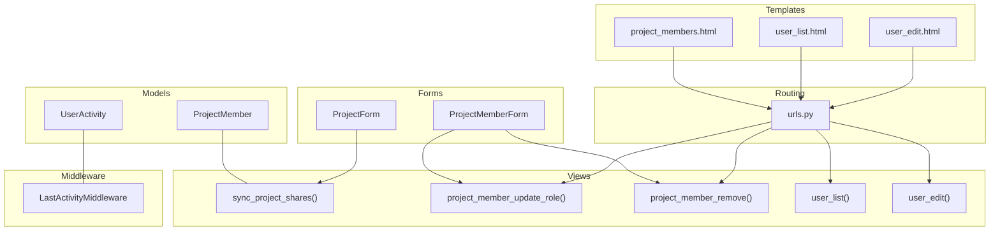

**Diagram sources**
- [models.py](file://arva/models.py#L211-L230)
- [models.py](file://arva/models.py#L423-L429)
- [views.py](file://arva/views.py#L117-L134)
- [views.py](file://arva/views.py#L370-L391)
- [views.py](file://arva/views.py#L219-L245)
- [views.py](file://arva/views.py#L271-L316)
- [forms.py](file://arva/forms.py#L135-L196)
- [forms.py](file://arva/forms.py#L313-L326)
- [urls.py](file://arva/urls.py#L27-L78)
- [middleware.py](file://arva/middleware.py#L7-L22)
- [project_members.html](file://arva/templates/arva/project_members.html#L1-L184)
- [user_list.html](file://arva/templates/arva/user_list.html#L1-L265)
- [user_edit.html](file://arva/templates/arva/user_edit.html#L1-L155)

**Section sources**
- [models.py](file://arva/models.py#L211-L230)
- [views.py](file://arva/views.py#L117-L134)
- [forms.py](file://arva/forms.py#L135-L196)
- [urls.py](file://arva/urls.py#L27-L78)
- [middleware.py](file://arva/middleware.py#L7-L22)
- [project_members.html](file://arva/templates/arva/project_members.html#L1-L184)
- [user_list.html](file://arva/templates/arva/user_list.html#L1-L265)
- [user_edit.html](file://arva/templates/arva/user_edit.html#L1-L155)

## Core Components
- ProjectMember model: Defines project membership with a role field and uniqueness constraint on (project, user).
- Project.get_user_role(): Returns a legacy admin role token for UI compatibility; actual access is determined by project visibility and membership.
- sync_project_shares(): Synchronizes project sharing by pruning removed users and ensuring shared users have membership records at unified role.
- UserActivity model and LastActivityMiddleware: Track last activity timestamps to compute user presence (online/offline).
- Permission helpers: require_role() and get_role() normalize legacy role branching while enforcing access gates.

Key responsibilities:
- Access control: Private vs shared projects, owner-only actions, and project-access-only actions.
- Membership lifecycle: Add/remove members, enforce unified sharing role, and maintain membership counts.
- User management: Toggle active status, reset passwords, hard delete users, and display presence.

**Section sources**
- [models.py](file://arva/models.py#L211-L230)
- [models.py](file://arva/models.py#L146-L159)
- [views.py](file://arva/views.py#L117-L134)
- [views.py](file://arva/views.py#L91-L104)
- [middleware.py](file://arva/middleware.py#L7-L22)
- [models.py](file://arva/models.py#L423-L429)

## Architecture Overview
The system transitions from role-based access control to unified project sharing:
- Legacy role tokens are preserved for UI and endpoint compatibility.
- Access checks rely on project.is_private, ownership, and membership existence.
- Project sharing is synchronized via sync_project_shares(), which enforces unified role for shared users.

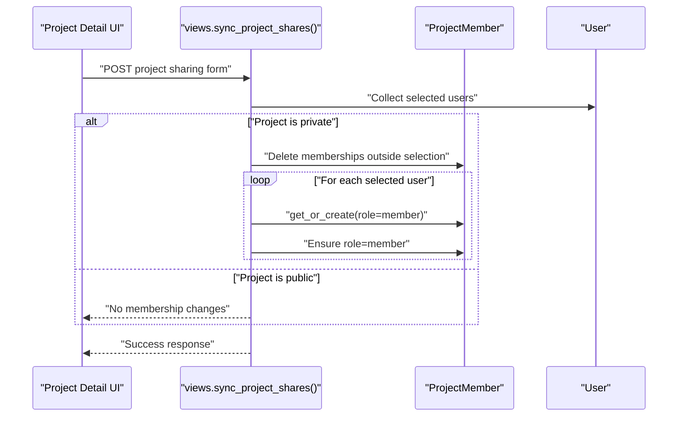

**Diagram sources**
- [views.py](file://arva/views.py#L117-L134)
- [project_detail.html](file://arva/templates/arva/project_detail.html#L391-L408)

**Section sources**
- [views.py](file://arva/views.py#L117-L134)
- [project_detail.html](file://arva/templates/arva/project_detail.html#L391-L408)

## Detailed Component Analysis

### ProjectMember Model and Deprecation of Traditional Roles
- Role field supports admin/member/viewer but is being deprecated in favor of unified project sharing.
- Unique constraint ensures a user appears only once per project.
- Legacy role tokens are returned for UI compatibility, but access enforcement is centralized in Project.get_user_role() and require_role().

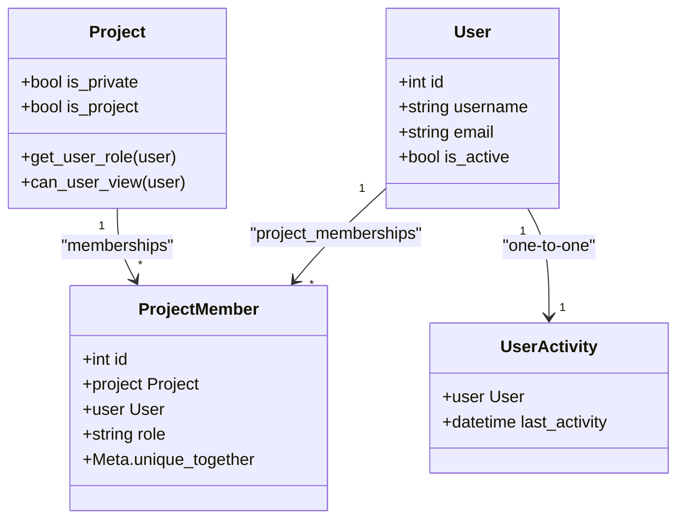

**Diagram sources**
- [models.py](file://arva/models.py#L101-L129)
- [models.py](file://arva/models.py#L211-L230)
- [models.py](file://arva/models.py#L423-L429)

**Section sources**
- [models.py](file://arva/models.py#L211-L230)
- [models.py](file://arva/models.py#L146-L159)

### Permission Helpers and Access Control
- get_role(): Returns a legacy admin token for UI compatibility; all project-access users are treated uniformly.
- require_role(): Enforces owner-only control for endpoints that previously required admin, and allows project-access users otherwise.

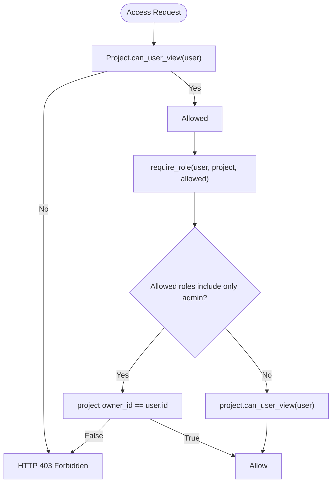

**Diagram sources**
- [views.py](file://arva/views.py#L91-L104)

**Section sources**
- [views.py](file://arva/views.py#L91-L104)

### Project Sharing Synchronization
- sync_project_shares() prunes memberships not in the submitted selection for private projects and ensures shared users have membership records at unified role.
- Public projects remain transparent; existing memberships still define elevated roles.

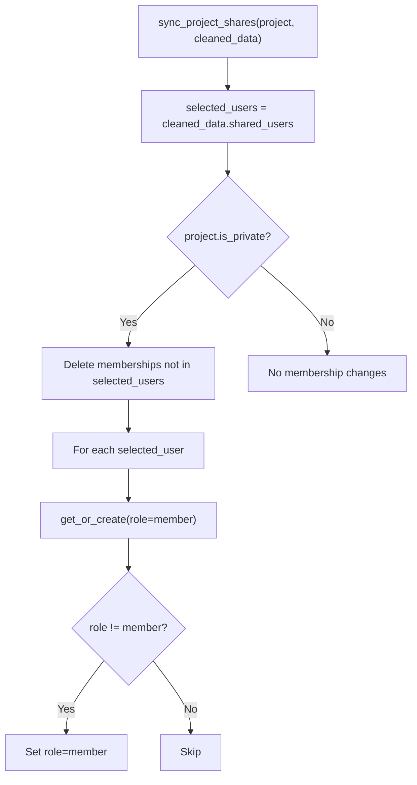

**Diagram sources**
- [views.py](file://arva/views.py#L117-L134)

**Section sources**
- [views.py](file://arva/views.py#L117-L134)

### Member Invitation and Onboarding Workflows
- Project creation/edit: ProjectForm includes shared_users and shared_role fields; ProjectMemberForm supports adding members.
- Onboarding: Signals create user profiles automatically upon registration; social signup fetches avatars.

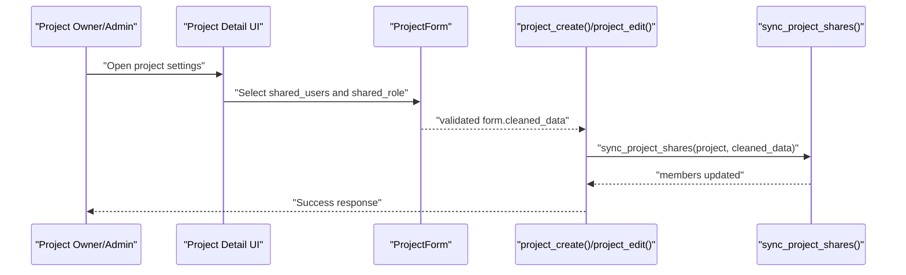

**Diagram sources**
- [forms.py](file://arva/forms.py#L135-L196)
- [views.py](file://arva/views.py#L477-L526)
- [views.py](file://arva/views.py#L117-L134)

**Section sources**
- [forms.py](file://arva/forms.py#L135-L196)
- [views.py](file://arva/views.py#L477-L526)
- [signals.py](file://arva/signals.py#L14-L17)
- [signals.py](file://arva/signals.py#L19-L38)

### Membership Management Interfaces
- Project Members page: Lists owner and members, allows editing roles and removing members; role editing is deprecated and normalized to unified sharing.
- User List page: Superuser interface to toggle active status, reset passwords, and delete users; displays presence indicators.
- User Edit page: Shows user’s project memberships and last activity.

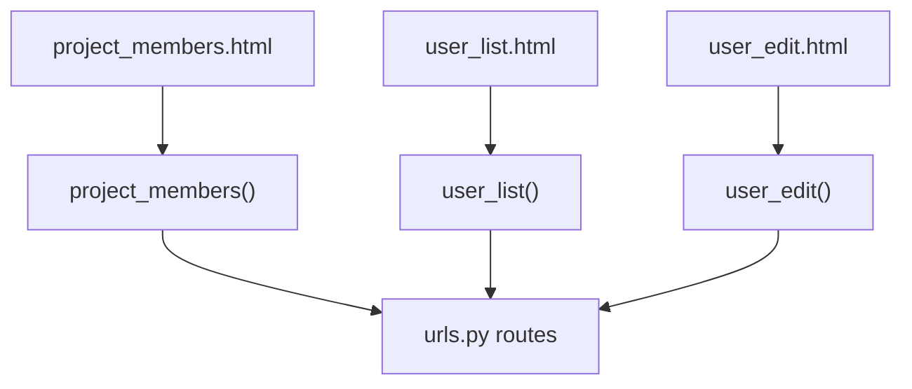

**Diagram sources**
- [project_members.html](file://arva/templates/arva/project_members.html#L1-L184)
- [user_list.html](file://arva/templates/arva/user_list.html#L1-L265)
- [user_edit.html](file://arva/templates/arva/user_edit.html#L1-L155)
- [urls.py](file://arva/urls.py#L27-L78)

**Section sources**
- [project_members.html](file://arva/templates/arva/project_members.html#L1-L184)
- [user_list.html](file://arva/templates/arva/user_list.html#L1-L265)
- [user_edit.html](file://arva/templates/arva/user_edit.html#L1-L155)
- [urls.py](file://arva/urls.py#L27-L78)

### AJAX Endpoints for Member Operations
- project-member/<int:pm_id>/update-role/: Normalize role to unified sharing (deprecated roles are coerced).
- project-member/<int:pm_id>/remove/: Remove membership.
- users/<int:user_id>/toggle-active/: Toggle user active status.
- users/<int:user_id>/reset-password/: Reset user password.
- users/<int:user_id>/delete/: Hard delete user (superuser only).

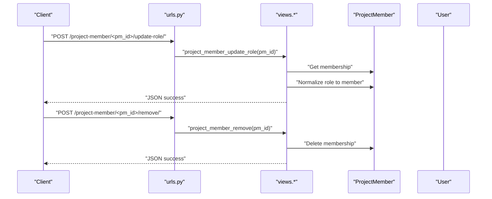

**Diagram sources**
- [urls.py](file://arva/urls.py#L77-L78)
- [urls.py](file://arva/urls.py#L74-L76)
- [views.py](file://arva/views.py#L370-L379)
- [views.py](file://arva/views.py#L383-L391)

**Section sources**
- [urls.py](file://arva/urls.py#L77-L78)
- [urls.py](file://arva/urls.py#L74-L76)
- [views.py](file://arva/views.py#L370-L379)
- [views.py](file://arva/views.py#L383-L391)

### Form Validation for Member Operations
- ProjectForm: Validates project fields and shared_users; shared_role is unified to member for private projects.
- ProjectMemberForm: Provides user selection and role dropdown for adding members.
- UserEditForm: Validates username/email uniqueness and toggles is_active/is_staff.
- AdminPasswordResetForm: Ensures password confirmation matches.

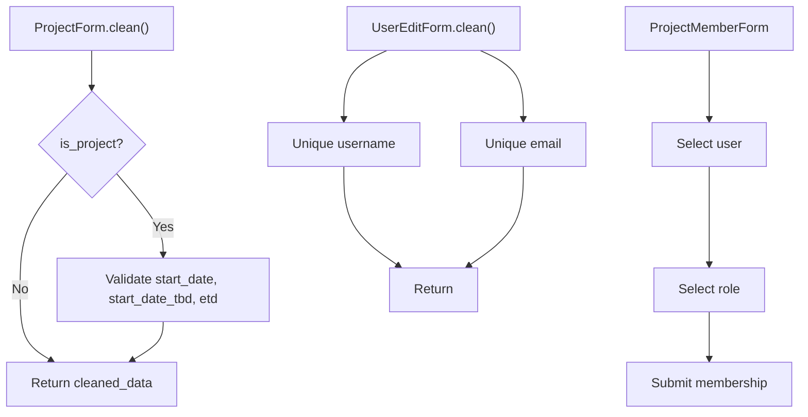

**Diagram sources**
- [forms.py](file://arva/forms.py#L177-L195)
- [forms.py](file://arva/forms.py#L313-L326)
- [forms.py](file://arva/forms.py#L86-L108)
- [forms.py](file://arva/forms.py#L110-L126)

**Section sources**
- [forms.py](file://arva/forms.py#L177-L195)
- [forms.py](file://arva/forms.py#L313-L326)
- [forms.py](file://arva/forms.py#L86-L108)
- [forms.py](file://arva/forms.py#L110-L126)

### User Presence Indicators and Activity Tracking
- LastActivityMiddleware updates UserActivity timestamps periodically and stores last_activity per user.
- User List and User Edit pages compute presence: online if last_activity within the last minute, offline otherwise.
- user_list() aggregates last comment and activity timestamps to derive last_activity_at.

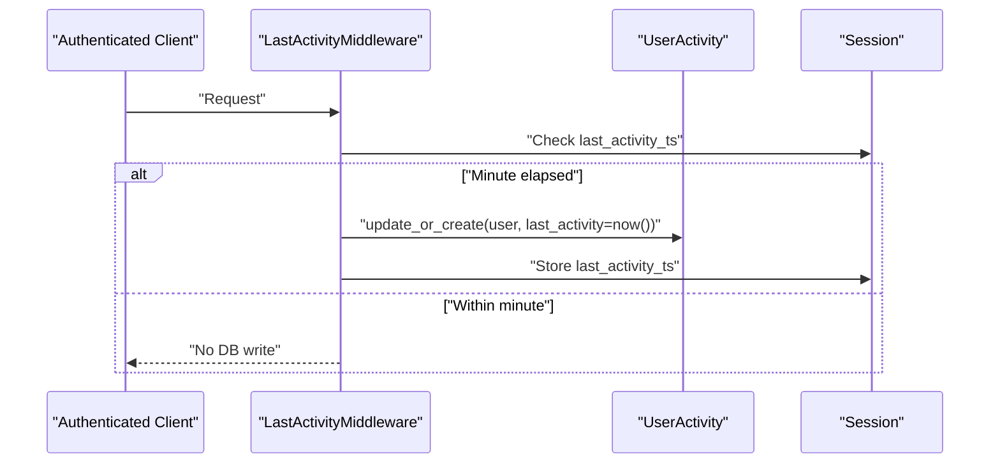

**Diagram sources**
- [middleware.py](file://arva/middleware.py#L7-L22)
- [utils.py](file://arva/utils.py#L6-L9)
- [user_list.html](file://arva/templates/arva/user_list.html#L147-L157)
- [user_edit.html](file://arva/templates/arva/user_edit.html#L129-L137)
- [views.py](file://arva/views.py#L219-L245)

**Section sources**
- [middleware.py](file://arva/middleware.py#L7-L22)
- [utils.py](file://arva/utils.py#L6-L9)
- [user_list.html](file://arva/templates/arva/user_list.html#L147-L157)
- [user_edit.html](file://arva/templates/arva/user_edit.html#L129-L137)
- [views.py](file://arva/views.py#L219-L245)

## Dependency Analysis
- Coupling: Views depend on models for access checks and membership operations; templates depend on views for rendering membership and presence data.
- Cohesion: Member management logic is centralized in views and forms; UI is decoupled via templates.
- External dependencies: Django auth User model, Django ORM, and middleware stack.

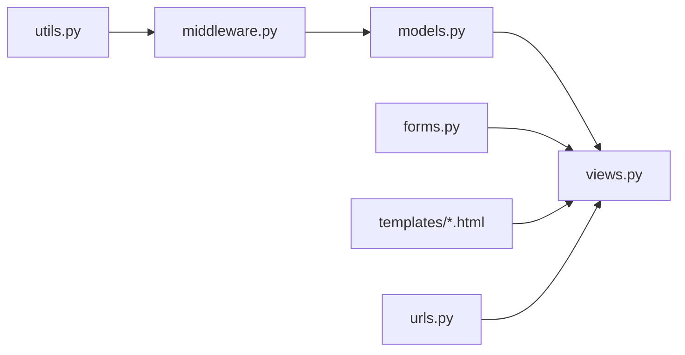

**Diagram sources**
- [models.py](file://arva/models.py#L211-L230)
- [views.py](file://arva/views.py#L117-L134)
- [forms.py](file://arva/forms.py#L135-L196)
- [urls.py](file://arva/urls.py#L27-L78)
- [middleware.py](file://arva/middleware.py#L7-L22)
- [utils.py](file://arva/utils.py#L6-L9)

**Section sources**
- [models.py](file://arva/models.py#L211-L230)
- [views.py](file://arva/views.py#L117-L134)
- [forms.py](file://arva/forms.py#L135-L196)
- [urls.py](file://arva/urls.py#L27-L78)
- [middleware.py](file://arva/middleware.py#L7-L22)
- [utils.py](file://arva/utils.py#L6-L9)

## Performance Considerations
- Minimize database writes: LastActivityMiddleware writes only once per minute per user.
- Efficient queries: Views use select_related and prefetch_related to reduce N+1 queries for tasks, lists, and memberships.
- Presence computation: Online/offline checks use a 1-minute threshold to avoid frequent recalculations.

## Troubleshooting Guide
- Role normalization: If a membership role does not match the unified sharing expectation, use the update-role endpoint to normalize it.
- Membership removal: Use the remove endpoint to delete a membership; ensure the requester is a superuser.
- User status toggling: Only superusers can toggle active status; verify is_superuser before attempting.
- Password reset: Ensure confirmation matches; validation errors return structured JSON.
- Hard deletion: Superusers cannot delete themselves or other superusers; validation prevents these actions.

**Section sources**
- [views.py](file://arva/views.py#L370-L379)
- [views.py](file://arva/views.py#L383-L391)
- [views.py](file://arva/views.py#L319-L331)
- [views.py](file://arva/views.py#L334-L348)
- [views.py](file://arva/views.py#L350-L366)

## Conclusion
Arva Kanban has evolved toward a simplified project sharing model where project access is governed by membership rather than granular roles. The ProjectMember model retains role fields for backward compatibility, but access enforcement is centralized and normalized. The system provides robust member management interfaces, AJAX endpoints for dynamic operations, and user presence indicators powered by activity tracking. Superusers retain administrative controls for user management, while project-level access is streamlined for ease of use.