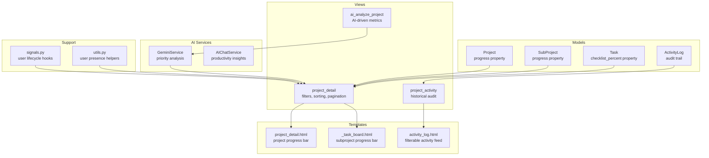
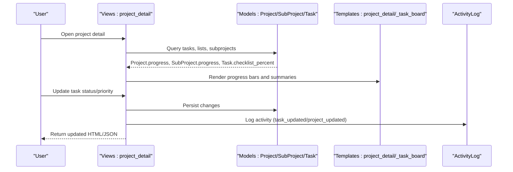
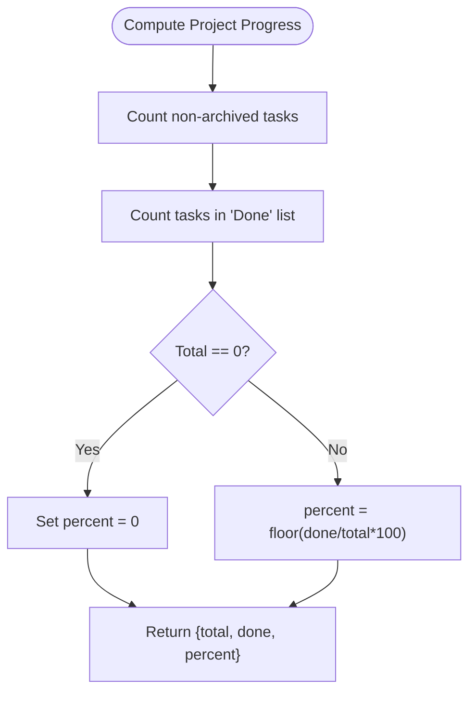
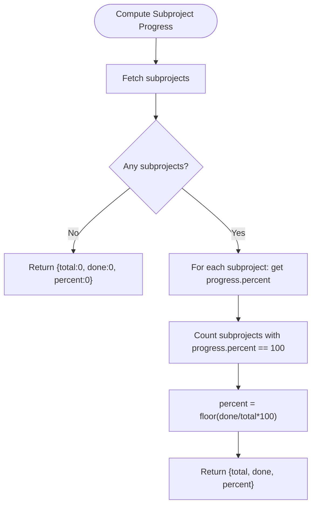
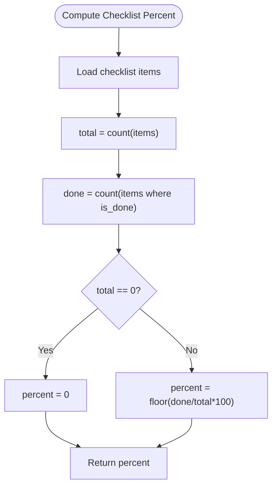
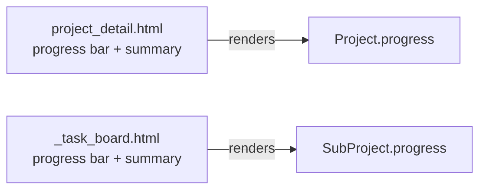
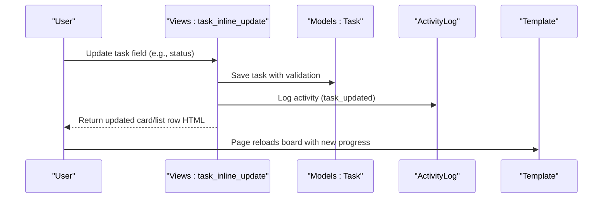
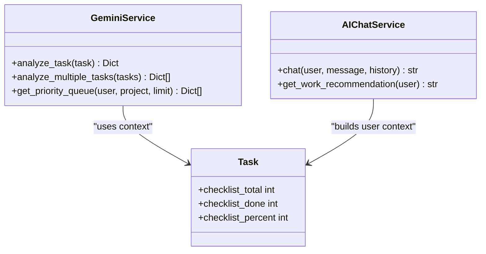
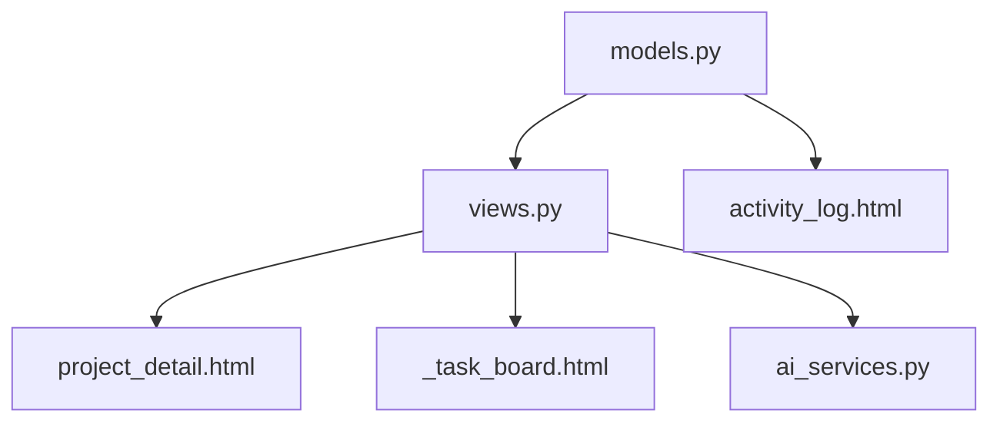

# Progress Tracking and Analytics

<cite>
**Referenced Files in This Document**
- [models.py](file://arva/models.py)
- [views.py](file://arva/views.py)
- [project_detail.html](file://arva/templates/arva/project_detail.html)
- [_task_board.html](file://arva/templates/arva/_task_board.html)
- [activity_log.html](file://arva/templates/arva/activity_log.html)
- [ai_services.py](file://arva/ai_services.py)
- [signals.py](file://arva/signals.py)
- [utils.py](file://arva/utils.py)
</cite>

## Table of Contents
1. [Introduction](#introduction)
2. [Project Structure](#project-structure)
3. [Core Components](#core-components)
4. [Architecture Overview](#architecture-overview)
5. [Detailed Component Analysis](#detailed-component-analysis)
6. [Dependency Analysis](#dependency-analysis)
7. [Performance Considerations](#performance-considerations)
8. [Troubleshooting Guide](#troubleshooting-guide)
9. [Conclusion](#conclusion)
10. [Appendices](#appendices)

## Introduction
This document explains the progress tracking and analytics features in Arva Kanban. It covers how task completion metrics are calculated, how visual progress indicators are rendered, and how project-level progress reporting integrates with task status tracking. It also documents analytics dashboards, task distribution visualization, filtering and sorting capabilities for progress reports, historical progress tracking, and the integration with activity logs for progress attribution. Finally, it outlines productivity metrics collection and real-time progress updates.

## Project Structure
The progress tracking and analytics functionality spans models, views, templates, and AI services:
- Models define task and project entities, progress computation, and activity logging.
- Views orchestrate filtering, sorting, and rendering of progress data.
- Templates render progress bars and summary cards.
- AI services provide priority analysis and productivity insights.
- Signals and utilities support user activity and asynchronous notifications.

**Diagram sources**
- [models.py](file://arva/models.py#L101-L210)
- [views.py](file://arva/views.py#L713-L884)
- [project_detail.html](file://arva/templates/arva/project_detail.html#L59-L67)
- [_task_board.html](file://arva/templates/arva/_task_board.html#L24-L55)
- [activity_log.html](file://arva/templates/arva/activity_log.html#L31-L59)
- [ai_services.py](file://arva/ai_services.py#L11-L189)

**Section sources**
- [models.py](file://arva/models.py#L101-L210)
- [views.py](file://arva/views.py#L713-L884)
- [project_detail.html](file://arva/templates/arva/project_detail.html#L59-L67)
- [_task_board.html](file://arva/templates/arva/_task_board.html#L24-L55)
- [activity_log.html](file://arva/templates/arva/activity_log.html#L31-L59)
- [ai_services.py](file://arva/ai_services.py#L11-L189)
- [signals.py](file://arva/signals.py#L14-L61)
- [utils.py](file://arva/utils.py#L6-L9)

## Core Components
- Project progress: Aggregates task counts per “Done” list to compute percentage.
- Subproject progress: Computes completion based on child subprojects’ progress.
- Task checklist progress: Tracks checklist completion percentage for granular visibility.
- Activity log: Records all changes for historical auditing and attribution.
- Filtering and sorting: Enables drill-down by status, priority, assignee, label, due date, and pagination.
- AI-driven insights: Provides priority scores and productivity recommendations.

**Section sources**
- [models.py](file://arva/models.py#L169-L187)
- [models.py](file://arva/models.py#L346-L351)
- [models.py](file://arva/models.py#L387-L421)
- [views.py](file://arva/views.py#L713-L884)
- [ai_services.py](file://arva/ai_services.py#L115-L189)

## Architecture Overview
The system computes progress at two levels:
- Project-level progress aggregates tasks across lists and optionally subprojects.
- Subproject-level progress aggregates child tasks and reports completion.
- Templates render progress bars and summary cards for quick visual assessment.
- Activity logs capture changes for historical analysis and trend identification.

**Diagram sources**
- [views.py](file://arva/views.py#L713-L884)
- [models.py](file://arva/models.py#L169-L187)
- [models.py](file://arva/models.py#L201-L209)
- [models.py](file://arva/models.py#L346-L351)
- [project_detail.html](file://arva/templates/arva/project_detail.html#L59-L67)
- [_task_board.html](file://arva/templates/arva/_task_board.html#L24-L55)
- [models.py](file://arva/models.py#L387-L421)

## Detailed Component Analysis

### Project Progress Calculation
Project progress is computed from non-archived tasks filtered by list name equality to “Done”. The result is a dictionary containing total tasks, completed tasks, and percentage.

**Diagram sources**
- [models.py](file://arva/models.py#L169-L177)

**Section sources**
- [models.py](file://arva/models.py#L169-L177)

### Subproject Progress Calculation
Subproject progress aggregates child subprojects’ progress percentages. A subproject is considered “done” when its progress equals 100%.

**Diagram sources**
- [models.py](file://arva/models.py#L179-L187)

**Section sources**
- [models.py](file://arva/models.py#L179-L187)

### Task Checklist Progress
Task checklist progress is derived from checklist items and returned as a percentage for UI rendering and analytics.

**Diagram sources**
- [models.py](file://arva/models.py#L346-L351)

**Section sources**
- [models.py](file://arva/models.py#L346-L351)
- [views.py](file://arva/views.py#L1349-L1374)

### Visual Progress Indicators
- Project-level progress bar and summary are rendered in the project detail page.
- Subproject-level progress bar and summary are rendered in the task board partial.

**Diagram sources**
- [project_detail.html](file://arva/templates/arva/project_detail.html#L59-L67)
- [_task_board.html](file://arva/templates/arva/_task_board.html#L24-L55)

**Section sources**
- [project_detail.html](file://arva/templates/arva/project_detail.html#L59-L67)
- [_task_board.html](file://arva/templates/arva/_task_board.html#L24-L55)

### Filtering and Sorting for Progress Reports
The project detail endpoint supports:
- Search by title
- Filter by assignee (exact match or username/email)
- Filter by status (lists for non-project tasks, structured statuses for project tasks)
- Filter by priority (project tasks only)
- Filter by label (non-project tasks only)
- Filter by due date
- Pagination and per-page selection

These filters are applied to non-archived tasks and influence both board rendering and analytics.

**Section sources**
- [views.py](file://arva/views.py#L713-L884)
- [views.py](file://arva/views.py#L418-L464)

### Historical Progress Tracking and Activity Logs
Activity logs record all significant events (creation, updates, moves, archivals) with timestamps and optional task context. The activity log page supports:
- Text search across action, task title, description, and user
- Action type filter
- User filter
- Date range filter
- Pagination

This enables trend analysis and attribution of progress changes over time.

**Section sources**
- [models.py](file://arva/models.py#L387-L421)
- [views.py](file://arva/views.py#L905-L971)
- [activity_log.html](file://arva/templates/arva/activity_log.html#L31-L59)

### Real-Time Progress Updates
Real-time updates occur when:
- Task status is updated via inline editing; the view persists the change and logs the event.
- Task creation, movement, archival, and deletion trigger activity log entries.
- The UI refreshes via AJAX to reflect updated progress bars and task lists.

**Diagram sources**
- [views.py](file://arva/views.py#L1394-L1538)
- [models.py](file://arva/models.py#L387-L421)
- [project_detail.html](file://arva/templates/arva/project_detail.html#L59-L67)

**Section sources**
- [views.py](file://arva/views.py#L1394-L1538)
- [models.py](file://arva/models.py#L387-L421)

### AI-Driven Productivity Metrics and Insights
AI services provide:
- Priority queue generation with scores and reasoning for tasks assigned to a user or owned by the user.
- Project-wide analysis of non-completed tasks to compute priority scores and recommended actions.
- AI chat assistant with contextual recommendations based on user’s workload.

**Diagram sources**
- [ai_services.py](file://arva/ai_services.py#L11-L189)
- [ai_services.py](file://arva/ai_services.py#L196-L326)
- [models.py](file://arva/models.py#L316-L351)

**Section sources**
- [ai_services.py](file://arva/ai_services.py#L115-L189)
- [ai_services.py](file://arva/ai_services.py#L196-L326)
- [views.py](file://arva/views.py#L2042-L2071)

### Integration with Activity Logs for Progress Attribution
Activity logs capture:
- Project creation, updates, closure/reopening
- Task creation, updates, archiving, moving
- List creation, renaming, deletion, archiving/unarchiving
- Comment addition, attachment upload, checklist toggles

These records enable:
- Auditing who changed what and when
- Identifying contributors to progress
- Generating trend reports over time

**Section sources**
- [models.py](file://arva/models.py#L387-L421)
- [views.py](file://arva/views.py#L905-L971)

## Dependency Analysis
The following diagram shows key dependencies among components involved in progress tracking and analytics.

**Diagram sources**
- [models.py](file://arva/models.py#L101-L210)
- [views.py](file://arva/views.py#L713-L884)
- [project_detail.html](file://arva/templates/arva/project_detail.html#L59-L67)
- [_task_board.html](file://arva/templates/arva/_task_board.html#L24-L55)
- [ai_services.py](file://arva/ai_services.py#L11-L189)
- [activity_log.html](file://arva/templates/arva/activity_log.html#L31-L59)

**Section sources**
- [models.py](file://arva/models.py#L101-L210)
- [views.py](file://arva/views.py#L713-L884)
- [ai_services.py](file://arva/ai_services.py#L11-L189)
- [activity_log.html](file://arva/templates/arva/activity_log.html#L31-L59)

## Performance Considerations
- Prefer select_related and prefetch_related to minimize database queries when computing progress and rendering boards.
- Use pagination for activity logs and task lists to avoid heavy payloads.
- Avoid redundant computations by caching frequently accessed counts (e.g., checklist totals/dones) when appropriate.
- Apply filters early in query chains to reduce result sets.

[No sources needed since this section provides general guidance]

## Troubleshooting Guide
Common issues and resolutions:
- Missing GEMINI_API_KEY prevents AI analysis:
  - Ensure the environment variable is configured; otherwise, AI endpoints return a 503-style error.
- Project locked (closed) prevents edits:
  - Certain endpoints return a closed-project error; reopen the project to enable changes.
- Invalid status/priority values:
  - Validation enforces allowed values for project tasks; ensure values belong to predefined sets.
- Email notifications not sent:
  - Email sending runs asynchronously; check server logs for exceptions.

**Section sources**
- [views.py](file://arva/views.py#L2032-L2040)
- [views.py](file://arva/views.py#L1014-L1053)
- [views.py](file://arva/views.py#L1418-L1472)
- [signals.py](file://arva/signals.py#L52-L61)

## Conclusion
Arva Kanban provides robust progress tracking through model-level computations, visual progress indicators, and comprehensive filtering/sorting. Historical progress is captured via activity logs, enabling trend analysis and attribution. AI services enhance productivity by offering priority insights and recommendations. Together, these features deliver a complete solution for monitoring task completion, project health, and team performance.

[No sources needed since this section summarizes without analyzing specific files]

## Appendices

### Data Structures Used to Represent Project Statistics
- Project progress: Dictionary with keys total, done, percent.
- Subproject progress: Dictionary mirroring project progress.
- Task checklist progress: Integer percentage derived from checklist items.

**Section sources**
- [models.py](file://arva/models.py#L169-L187)
- [models.py](file://arva/models.py#L201-L209)
- [models.py](file://arva/models.py#L346-L351)

### Examples of Progress Calculation Logic
- Project progress: Count non-archived tasks and compare against “Done” list.
- Subproject progress: Aggregate child subprojects’ progress percentages.
- Checklist progress: Compute percentage of completed checklist items.

**Section sources**
- [models.py](file://arva/models.py#L169-L187)
- [models.py](file://arva/models.py#L201-L209)
- [models.py](file://arva/models.py#L346-L351)

### Real-Time Progress Updates
- Inline task updates trigger persistence and activity logging, followed by UI refresh.

**Section sources**
- [views.py](file://arva/views.py#L1394-L1538)
- [models.py](file://arva/models.py#L387-L421)

### Filtering and Sorting Capabilities
- Filters: title, assignee (exact or search), status, priority, label, due date.
- Sorting: default sorts by updated_at and id; pagination supported.

**Section sources**
- [views.py](file://arva/views.py#L713-L884)
- [views.py](file://arva/views.py#L418-L464)

### Historical Progress Tracking and Trend Analysis
- Activity log page supports search, action filter, user filter, date range, and pagination.

**Section sources**
- [views.py](file://arva/views.py#L905-L971)
- [activity_log.html](file://arva/templates/arva/activity_log.html#L31-L59)

### Integration with Activity Logs for Progress Attribution
- ActivityLog captures all major changes; templates render filtered, paginated lists.

**Section sources**
- [models.py](file://arva/models.py#L387-L421)
- [activity_log.html](file://arva/templates/arva/activity_log.html#L31-L59)

### Team Productivity Metrics Collection
- AI services compute priority scores and provide recommendations.
- Checklist progress and overdue indicators support personal productivity insights.

**Section sources**
- [ai_services.py](file://arva/ai_services.py#L115-L189)
- [models.py](file://arva/models.py#L332-L351)