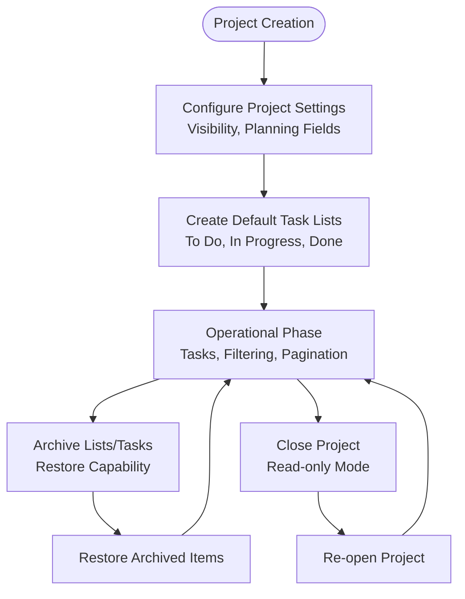
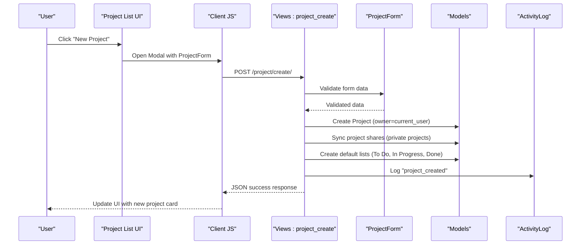
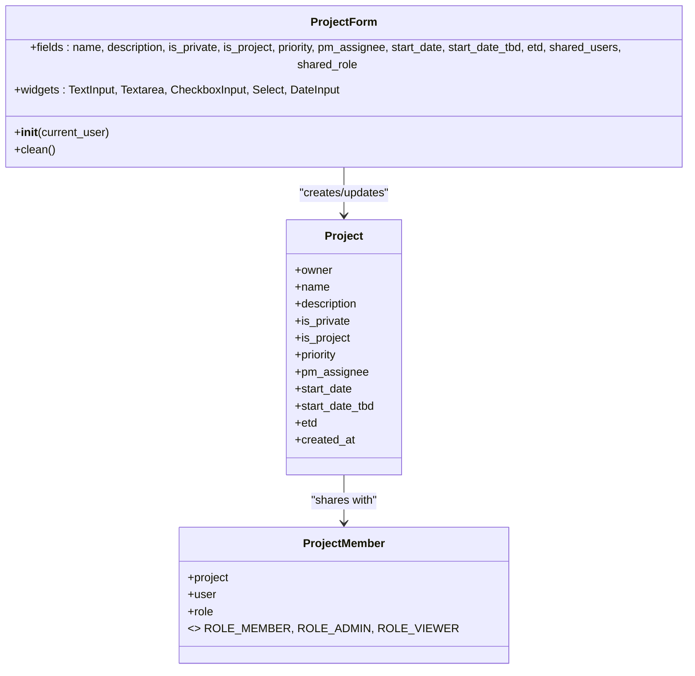
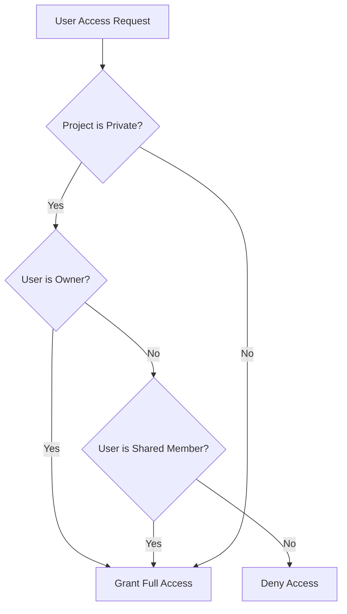
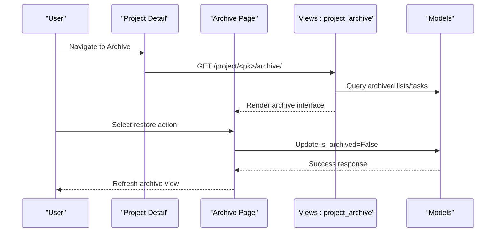
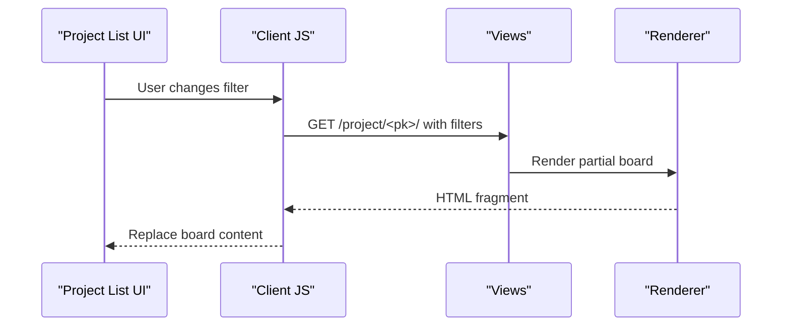

# Project Administration

<cite>
**Referenced Files in This Document**
- [models.py](file://arva/models.py)
- [forms.py](file://arva/forms.py)
- [views.py](file://arva/views.py)
- [urls.py](file://arva/urls.py)
- [project_list.html](file://arva/templates/arva/project_list.html)
- [_project_item.html](file://arva/templates/arva/_project_item.html)
- [project_detail.html](file://arva/templates/arva/project_detail.html)
- [project_archive.html](file://arva/templates/arva/project_archive.html)
</cite>

## Table of Contents
1. [Introduction](#introduction)
2. [Project Lifecycle Overview](#project-lifecycle-overview)
3. [Project Creation Workflow](#project-creation-workflow)
4. [Project Editing and Configuration](#project-editing-and-configuration)
5. [ProjectForm Implementation](#projectform-implementation)
6. [Validation Rules and Business Logic](#validation-rules-and-business-logic)
7. [Access Control and Ownership](#access-control-and-ownership)
8. [Project Metadata Management](#project-metadata-management)
9. [Default Task Lists and Structure](#default-task-lists-and-structure)
10. [Project Archiving Functionality](#project-archiving-functionality)
11. [Project Listing Interface](#project-listing-interface)
12. [AJAX Endpoint Handling](#ajax-endpoint-handling)
13. [Security and Authorization](#security-and-authorization)
14. [Troubleshooting Guide](#troubleshooting-guide)
15. [Conclusion](#conclusion)

## Introduction
This document provides comprehensive coverage of project administration features in Arva Kanban. It details the complete project lifecycle from creation to configuration, explains the ProjectForm implementation with validation rules, access control mechanisms, metadata management, default task list creation, archiving functionality, and the project listing interface with filtering capabilities.

## Project Lifecycle Overview
The project lifecycle in Arva Kanban encompasses several stages:
- Creation: Users initiate a new project via a modal form that submits to a dedicated endpoint.
- Configuration: Projects can be configured as "Is Project" with planning fields (priority, PM assignee, start date, ETD) and visibility settings (public/private).
- Operation: Projects host default task lists (To Do, In Progress, Done) and tasks with filtering and pagination.
- Archiving: Projects and their components (lists/tasks) can be archived and later restored.
- Closure: Structured projects can be closed to enforce read-only operation while preserving data.

**Diagram sources**
- [views.py](file://arva/views.py#L477-L500)
- [project_list.html](file://arva/templates/arva/project_list.html#L264-L350)

**Section sources**
- [views.py](file://arva/views.py#L477-L500)
- [project_list.html](file://arva/templates/arva/project_list.html#L264-L350)

## Project Creation Workflow
The creation workflow begins with the user opening the "New Project" modal from the project list page. The modal presents fields for project name, description, enabling "Is Project" for planning fields, priority, PM assignee, start date, ETD, and visibility settings (private/public). Upon submission, the client-side JavaScript sends an AJAX POST request to the server endpoint.

Key steps:
- Modal rendering with ProjectForm fields
- Client-side validation and AJAX submission
- Server-side validation via ProjectForm.clean()
- Persistence of project with owner set to current user
- Synchronization of project shares for private projects
- Automatic creation of default task lists
- Activity log entry creation

**Diagram sources**
- [project_list.html](file://arva/templates/arva/project_list.html#L264-L350)
- [views.py](file://arva/views.py#L477-L500)
- [forms.py](file://arva/forms.py#L135-L196)

**Section sources**
- [project_list.html](file://arva/templates/arva/project_list.html#L264-L350)
- [views.py](file://arva/views.py#L477-L500)
- [forms.py](file://arva/forms.py#L135-L196)

## Project Editing and Configuration
Project editing allows updating metadata and visibility settings. The edit modal supports toggling "Is Project" to enable planning fields, adjusting priority, PM assignee, start date (including TBD), ETD, and visibility (private/public). The endpoint enforces owner-only access and updates project attributes accordingly.

Key aspects:
- Owner-only editing restriction
- Form validation mirroring creation rules
- Share synchronization for private projects
- Activity logging for updates

**Section sources**
- [views.py](file://arva/views.py#L504-L526)
- [project_detail.html](file://arva/templates/arva/project_detail.html#L311-L419)

## ProjectForm Implementation
The ProjectForm encapsulates all project-related fields and validation logic. It defines:
- Core fields: name, description, is_private, is_project, priority, pm_assignee, start_date, start_date_tbd, etd
- Additional field for sharing users in private projects
- Widget customization for consistent UI presentation
- Dynamic querysets for dropdowns (users, PM assignees)
- Clean method implementing business rules

**Diagram sources**
- [forms.py](file://arva/forms.py#L135-L196)
- [models.py](file://arva/models.py#L101-L129)
- [models.py](file://arva/models.py#L211-L229)

**Section sources**
- [forms.py](file://arva/forms.py#L135-L196)
- [models.py](file://arva/models.py#L101-L129)

## Validation Rules and Business Logic
The ProjectForm.clean() method enforces critical business rules:
- When "Is Project" is enabled:
  - Start Date or "Start Date TBD" is required
  - ETD (Estimated Target Delivery) is mandatory
  - Start Date and ETD cannot conflict (ETD >= Start Date)
- Start Date and Start Date TBD cannot be both selected
- For private projects, shared users are synchronized to ProjectMember records

These validations mirror the model-level validation in Project.clean(), ensuring consistency across creation and editing.

**Section sources**
- [forms.py](file://arva/forms.py#L177-L195)
- [models.py](file://arva/models.py#L131-L144)

## Access Control and Ownership
Access control follows a straightforward policy:
- Public projects: visible to all authenticated users with read access
- Private projects: accessible only to the owner and explicitly shared users
- Ownership: enforced via owner_id checks on endpoints requiring exclusive access
- Sharing: ProjectMember records define who has access to private projects

**Diagram sources**
- [models.py](file://arva/models.py#L146-L159)
- [views.py](file://arva/views.py#L504-L526)

**Section sources**
- [models.py](file://arva/models.py#L146-L159)
- [views.py](file://arva/views.py#L504-L526)

## Project Metadata Management
Projects maintain several metadata fields:
- Priority levels: P0 (Urgent) through P4 (Very Low)
- PM/Assignee: Optional project manager assigned to the project
- Timeline settings:
  - Start Date: Required for "Is Project" when not marked as TBD
  - Start Date TBD: Alternative when start date is unknown
  - ETD: Required for "Is Project" and must be >= Start Date
- Description and visibility (is_private)

These fields are rendered in both project cards and detail views, providing contextual information for project planning and progress tracking.

**Section sources**
- [models.py](file://arva/models.py#L101-L129)
- [_project_item.html](file://arva/templates/arva/_project_item.html#L48-L55)
- [project_detail.html](file://arva/templates/arva/project_detail.html#L37-L51)

## Default Task Lists and Structure
On project creation, three default task lists are automatically established:
- To Do
- In Progress
- Done

These lists serve as the foundational structure for task organization. For sub-projects, similar default lists are created when the first sub-project is added, ensuring consistent workflow patterns across project hierarchies.

**Section sources**
- [views.py](file://arva/views.py#L485-L487)
- [views.py](file://arva/views.py#L550-L553)

## Project Archiving Functionality
Arva Kanban provides comprehensive archiving capabilities:
- Project-level closure: Structured projects can be closed to enforce read-only operation
- List archiving: Individual task lists can be archived, automatically archiving all contained tasks
- Task archiving: Tasks can be individually archived
- Archive restoration: Both lists and tasks can be restored to their previous states
- Archive interface: Dedicated page for browsing and restoring archived items

**Diagram sources**
- [urls.py](file://arva/urls.py#L23-L23)
- [views.py](file://arva/views.py#L887-L902)
- [project_archive.html](file://arva/templates/arva/project_archive.html#L1-L95)

**Section sources**
- [urls.py](file://arva/urls.py#L23-L23)
- [views.py](file://arva/views.py#L887-L902)
- [project_archive.html](file://arva/templates/arva/project_archive.html#L1-L95)

## Project Listing Interface
The project listing interface offers:
- Dual view modes: Card view and table view with toggle controls
- Search and filtering: By project name, owner, description, creation date, and progress
- Pagination: Configurable rows per page (10, 25, 50, 100)
- Real-time counters and sorting
- Inline actions: Quick open, sub-project navigation, and conversion controls
- Online user indicators

The interface dynamically renders project cards and table rows, reflecting project progress, visibility, and metadata.

**Section sources**
- [project_list.html](file://arva/templates/arva/project_list.html#L66-L261)
- [_project_item.html](file://arva/templates/arva/_project_item.html#L1-L141)

## AJAX Endpoint Handling
Arva Kanban extensively uses AJAX for seamless interactions:
- Project creation: Single endpoint handles form submission and returns HTML fragments for immediate UI updates
- Project editing: Updates project metadata and returns sanitized field values
- Filtered board loading: XMLHttpRequests fetch updated board content based on filters
- Pagination: Per-page selection triggers AJAX reloads
- Archive operations: REST-style endpoints for archiving/unarchiving lists and tasks

**Diagram sources**
- [views.py](file://arva/views.py#L880-L884)
- [project_list.html](file://arva/templates/arva/project_list.html#L77-L94)

**Section sources**
- [views.py](file://arva/views.py#L880-L884)
- [project_list.html](file://arva/templates/arva/project_list.html#L77-L94)

## Security and Authorization
Security measures include:
- Owner-only restrictions on sensitive operations (editing, closing, deleting, member management)
- Role-based gating that preserves owner-only control for critical endpoints
- Project lock mechanism preventing modifications on closed projects
- CSRF protection through Django forms and AJAX requests
- Input sanitization via Django forms and model validation

**Section sources**
- [views.py](file://arva/views.py#L504-L526)
- [views.py](file://arva/views.py#L1014-L1053)

## Troubleshooting Guide
Common issues and resolutions:
- Validation errors during project creation/editing: Review required fields and date constraints
- Access denied errors: Verify project visibility settings and membership status
- Closed project modifications: Re-open the project before making changes
- Empty search results: Adjust search terms or clear filters
- Archive restoration failures: Ensure no dependent items exist in archives

**Section sources**
- [forms.py](file://arva/forms.py#L177-L195)
- [views.py](file://arva/views.py#L1014-L1053)

## Conclusion
Arva Kanban's project administration system provides a robust foundation for project lifecycle management. The combination of comprehensive validation, clear access control, automated default structures, and AJAX-driven interfaces delivers a responsive and reliable user experience. The documented workflows and APIs enable developers to extend functionality while maintaining consistency with existing patterns.