# Project Management Features

<cite>
**Referenced Files in This Document**
- [models.py](file://arva/models.py)
- [views.py](file://arva/views.py)
- [forms.py](file://arva/forms.py)
- [urls.py](file://arva/urls.py)
- [admin.py](file://arva/admin.py)
- [utils.py](file://arva/utils.py)
- [project_list.html](file://arva/templates/arva/project_list.html)
- [project_detail.html](file://arva/templates/arva/project_detail.html)
- [subproject_list.html](file://arva/templates/arva/subproject_list.html)
- [project_members.html](file://arva/templates/arva/project_members.html)
- [project_archive.html](file://arva/templates/arva/project_archive.html)
</cite>

## Table of Contents
1. [Introduction](#introduction)
2. [Project Structure](#project-structure)
3. [Core Components](#core-components)
4. [Architecture Overview](#architecture-overview)
5. [Detailed Component Analysis](#detailed-component-analysis)
6. [Dependency Analysis](#dependency-analysis)
7. [Performance Considerations](#performance-considerations)
8. [Troubleshooting Guide](#troubleshooting-guide)
9. [Conclusion](#conclusion)

## Introduction
This document explains the project management system in Arva Kanban, focusing on project creation, configuration, administration, subproject organization, access control, and role-based permissions. It also covers project progress tracking, archive and restore functionality, and the relationship between projects and their task lists. The content is grounded in the actual codebase and demonstrates how project data flows through views and forms, how permissions are enforced, and how the UI renders project information.

## Project Structure
The project management system centers around Django models representing Projects, SubProjects, TaskLists, and Tasks, along with supporting models for members, activities, and settings. Views orchestrate CRUD operations and enforce access control. URL routing connects endpoints to views. Templates render project lists, details, subprojects, members, and archives.

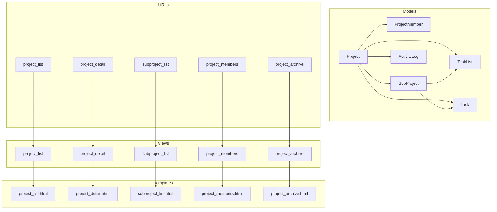

**Diagram sources**
- [models.py](file://arva/models.py#L101-L230)
- [views.py](file://arva/views.py#L394-L414)
- [urls.py](file://arva/urls.py#L11-L25)

**Section sources**
- [models.py](file://arva/models.py#L101-L230)
- [views.py](file://arva/views.py#L394-L414)
- [urls.py](file://arva/urls.py#L11-L25)

## Core Components
- Project model encapsulates project metadata, visibility, scheduling, and progress computation. It provides access checks and role resolution for UI compatibility.
- SubProject model organizes tasks under a parent project and computes its own progress.
- TaskList and Task models represent the Kanban board structure and task attributes, respectively.
- ProjectMember model defines legacy role tokens for UI backward compatibility.
- Views implement project lifecycle operations (create, update, close/reopen, convert), subproject management, member administration, and archive operations.
- Forms validate project configuration and enforce business rules.
- Templates render project lists, details, subprojects, members, and archives with filtering and pagination.

**Section sources**
- [models.py](file://arva/models.py#L101-L230)
- [views.py](file://arva/views.py#L475-L1209)
- [forms.py](file://arva/forms.py#L135-L196)
- [project_list.html](file://arva/templates/arva/project_list.html#L96-L261)
- [project_detail.html](file://arva/templates/arva/project_detail.html#L9-L581)

## Architecture Overview
The system follows a layered architecture:
- Presentation layer: Templates render project UI and collect user actions.
- Control layer: Views handle requests, enforce permissions, and coordinate model operations.
- Persistence layer: Models define relationships and compute derived metrics like progress.
- Routing layer: URLs map endpoints to views.

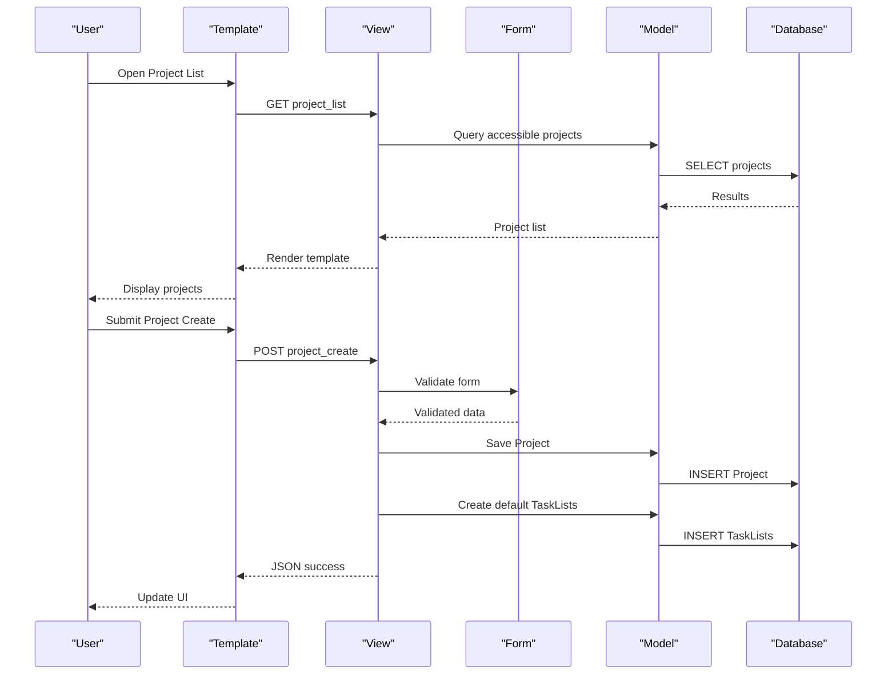

**Diagram sources**
- [views.py](file://arva/views.py#L475-L500)
- [forms.py](file://arva/forms.py#L135-L196)
- [models.py](file://arva/models.py#L101-L129)

**Section sources**
- [views.py](file://arva/views.py#L475-L500)
- [forms.py](file://arva/forms.py#L135-L196)
- [models.py](file://arva/models.py#L101-L129)

## Detailed Component Analysis

### Project Creation and Configuration
- Creation endpoint accepts project metadata and shared users. It sets the owner, creates default task lists, logs activity, and returns rendered project item HTML for immediate UI update.
- Configuration form enforces project planning fields when Is Project is enabled, including priority, PM/assignee, start date/TBD, and ETD. It validates mutual exclusivity and ordering constraints.

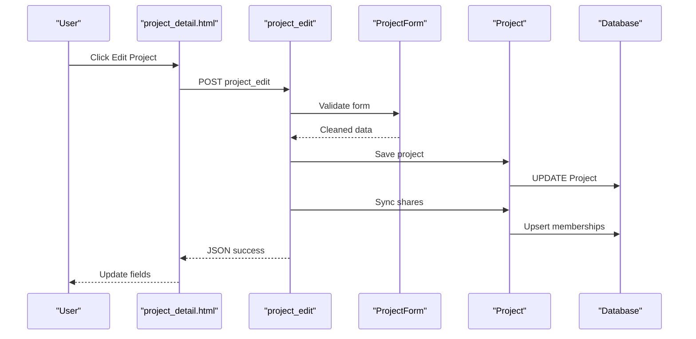

**Diagram sources**
- [views.py](file://arva/views.py#L504-L526)
- [forms.py](file://arva/forms.py#L135-L196)
- [project_detail.html](file://arva/templates/arva/project_detail.html#L311-L419)

**Section sources**
- [views.py](file://arva/views.py#L475-L500)
- [views.py](file://arva/views.py#L504-L526)
- [forms.py](file://arva/forms.py#L135-L196)
- [project_detail.html](file://arva/templates/arva/project_detail.html#L311-L419)

### Access Control and Role-Based Permissions
- Access control is enforced via helper functions that resolve user roles. The legacy role token is always ADMIN for UI compatibility, while owner and shared users gain access based on project visibility.
- Owner-only endpoints include project deletion, closing/reopening, and converting to subproject. Member-only endpoints include subproject operations and task updates.
- The member administration view restricts member management to the project owner.

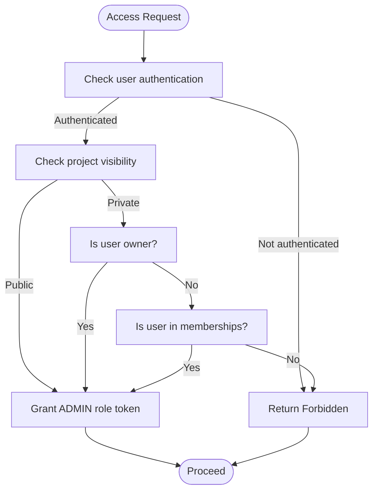

**Diagram sources**
- [models.py](file://arva/models.py#L146-L159)
- [views.py](file://arva/views.py#L91-L104)
- [views.py](file://arva/views.py#L1128-L1142)

**Section sources**
- [models.py](file://arva/models.py#L146-L159)
- [views.py](file://arva/views.py#L91-L104)
- [views.py](file://arva/views.py#L1128-L1142)

### Subproject Organization
- Subprojects are created under a project and inherit lists/tasks when none exist. They compute progress independently and can be moved between projects or converted to standalone projects.
- The subproject list view supports card and table views, filtering, and pagination.

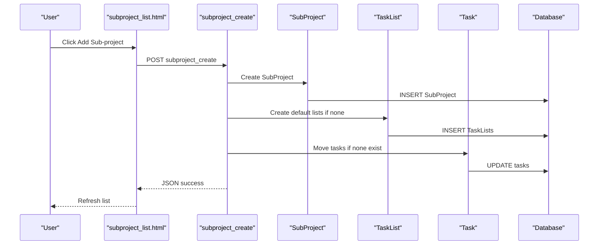

**Diagram sources**
- [views.py](file://arva/views.py#L530-L562)
- [subproject_list.html](file://arva/templates/arva/subproject_list.html#L71-L158)

**Section sources**
- [views.py](file://arva/views.py#L530-L562)
- [views.py](file://arva/views.py#L614-L704)
- [subproject_list.html](file://arva/templates/arva/subproject_list.html#L71-L158)

### Project Progress Tracking
- Progress is computed as the percentage of “Done” tasks among non-archived tasks. Subproject progress aggregates completion across all subprojects.
- Templates display progress bars and summary statistics in both project list and detail views.

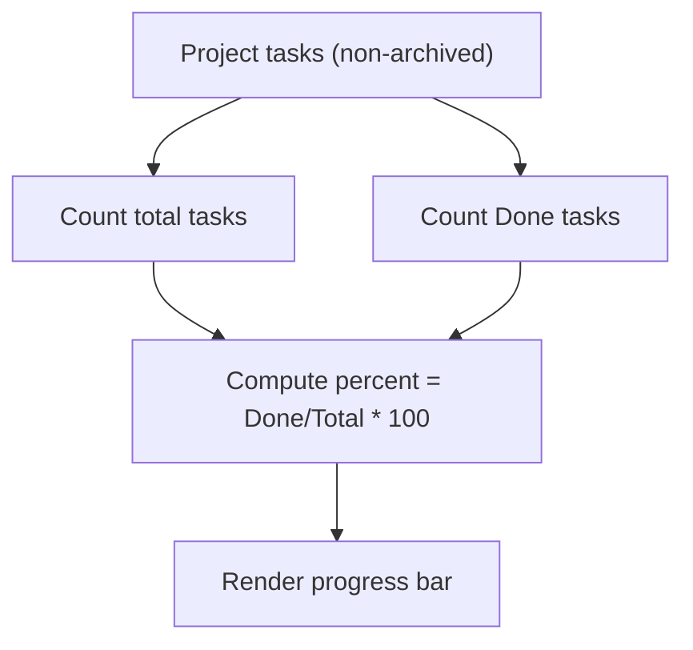

**Diagram sources**
- [models.py](file://arva/models.py#L169-L187)
- [project_detail.html](file://arva/templates/arva/project_detail.html#L59-L67)
- [project_list.html](file://arva/templates/arva/project_list.html#L216-L226)

**Section sources**
- [models.py](file://arva/models.py#L169-L187)
- [project_detail.html](file://arva/templates/arva/project_detail.html#L59-L67)
- [project_list.html](file://arva/templates/arva/project_list.html#L216-L226)

### Archive and Restore Functionality
- Archive view lists archived lists and tasks with restore actions. Restoration toggles archived flags back to false.
- Project detail view integrates archive navigation for administrative access.

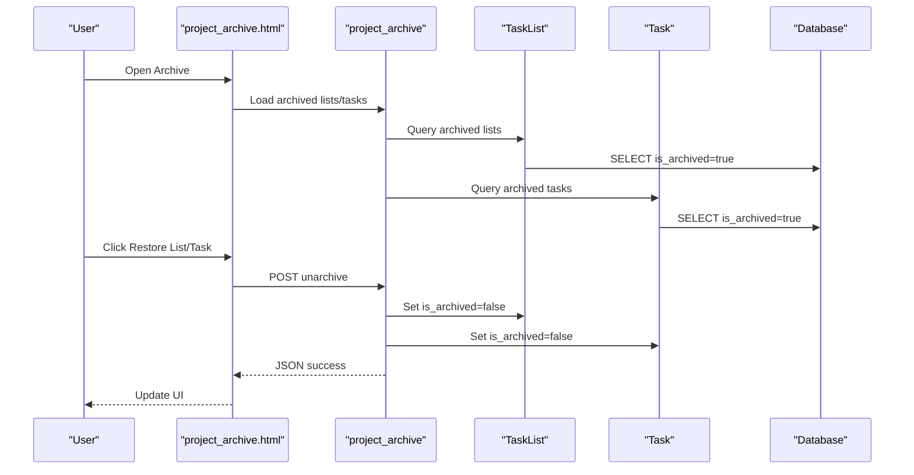

**Diagram sources**
- [project_archive.html](file://arva/templates/arva/project_archive.html#L29-L87)
- [views.py](file://arva/views.py#L973-L987)

**Section sources**
- [project_archive.html](file://arva/templates/arva/project_archive.html#L29-L87)
- [views.py](file://arva/views.py#L973-L987)

### Relationship Between Projects and Task Lists
- Projects own TaskLists and Tasks. SubProjects also own TaskLists and Tasks, enabling scoped organization within a project.
- When a SubProject is created without existing lists/tasks, default lists are provisioned and tasks/lists are migrated into the SubProject scope.

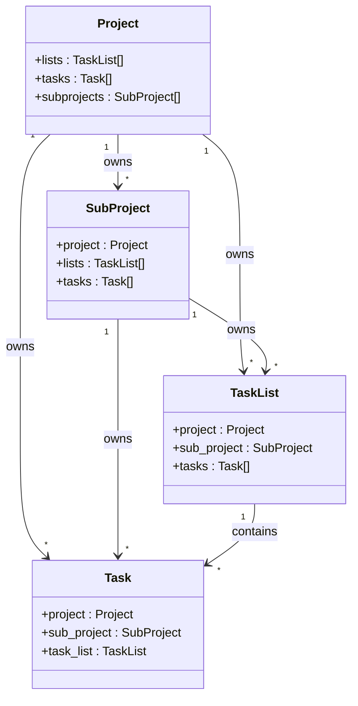

**Diagram sources**
- [models.py](file://arva/models.py#L238-L301)
- [models.py](file://arva/models.py#L189-L209)

**Section sources**
- [models.py](file://arva/models.py#L238-L301)
- [models.py](file://arva/models.py#L189-L209)

### Member Management Workflows
- Owner can add members with a fixed default role, remove members, and update roles. Role updates are deprecated and normalized to a single membership level for UI compatibility.
- The member view displays owner, members, and provides add/edit/remove actions.

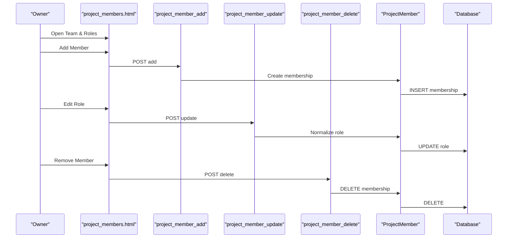

**Diagram sources**
- [project_members.html](file://arva/templates/arva/project_members.html#L122-L141)
- [views.py](file://arva/views.py#L1144-L1209)
- [models.py](file://arva/models.py#L211-L229)

**Section sources**
- [project_members.html](file://arva/templates/arva/project_members.html#L122-L141)
- [views.py](file://arva/views.py#L1144-L1209)
- [models.py](file://arva/models.py#L211-L229)

### Administrative Controls and Lifecycle Stages
- Project lifecycle includes creation, editing, closing (for structured projects), reopening, conversion to subproject, and deletion (only when empty).
- Closing locks tasks for updates and prevents modifications except by owners/admins.

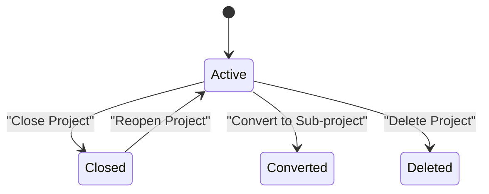

**Diagram sources**
- [views.py](file://arva/views.py#L1012-L1125)
- [project_detail.html](file://arva/templates/arva/project_detail.html#L23-L32)

**Section sources**
- [views.py](file://arva/views.py#L1012-L1125)
- [project_detail.html](file://arva/templates/arva/project_detail.html#L23-L32)

## Dependency Analysis
- Models define relationships and computed properties (progress, access scope).
- Views depend on models and forms to enforce business rules and permissions.
- Templates depend on views for data rendering and on JavaScript for dynamic interactions.
- URL routing binds endpoints to views.

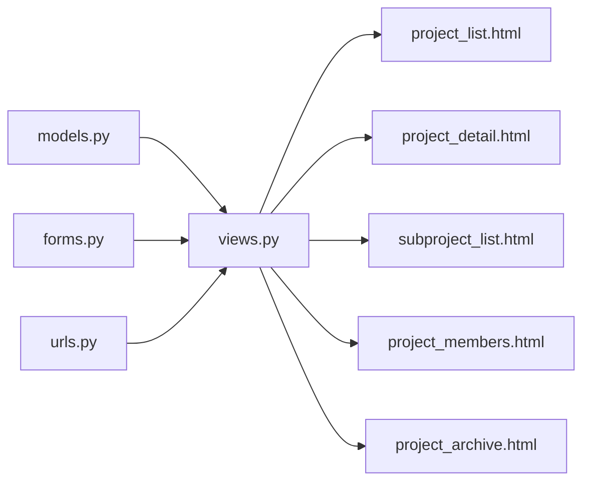

**Diagram sources**
- [models.py](file://arva/models.py#L101-L230)
- [views.py](file://arva/views.py#L394-L414)
- [urls.py](file://arva/urls.py#L11-L25)

**Section sources**
- [models.py](file://arva/models.py#L101-L230)
- [views.py](file://arva/views.py#L394-L414)
- [urls.py](file://arva/urls.py#L11-L25)

## Performance Considerations
- Use select_related and prefetch_related to minimize database queries when rendering project lists and details.
- Apply pagination for large datasets (as seen in templates) to reduce payload sizes.
- Keep computed properties (progress) efficient by leveraging database aggregations rather than Python loops.
- Avoid redundant queries by caching frequently accessed data (e.g., shared user counts).

## Troubleshooting Guide
- Permission denied errors indicate insufficient access or missing owner/admin privileges. Verify the user’s role and project visibility settings.
- Validation errors during project creation/editing arise from missing required fields or invalid combinations (e.g., conflicting dates). Review form validation messages and constraints.
- Subproject conversion or deletion failures occur when subprojects contain tasks or when the target project is invalid. Ensure prerequisites are met before attempting operations.
- Archive restoration requires proper CSRF tokens and correct IDs. Confirm frontend requests and backend responses.

**Section sources**
- [views.py](file://arva/views.py#L91-L104)
- [forms.py](file://arva/forms.py#L177-L195)
- [views.py](file://arva/views.py#L566-L590)
- [project_archive.html](file://arva/templates/arva/project_archive.html#L55-L81)

## Conclusion
Arva Kanban’s project management system provides a robust foundation for organizing work through Projects and SubProjects, enforcing access control with legacy role tokens for UI compatibility, and offering comprehensive administrative controls. The system balances simplicity with powerful features like progress tracking, archive/restore, and flexible member management, all backed by clear data models and well-defined views.