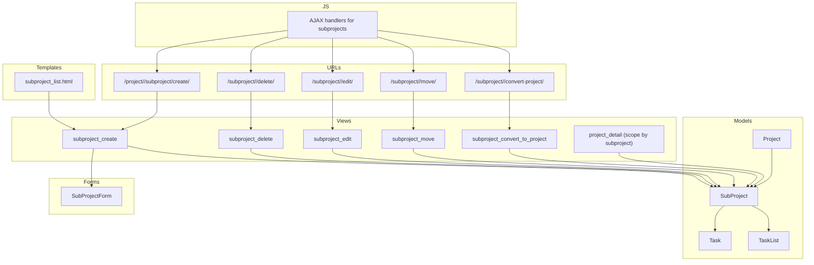
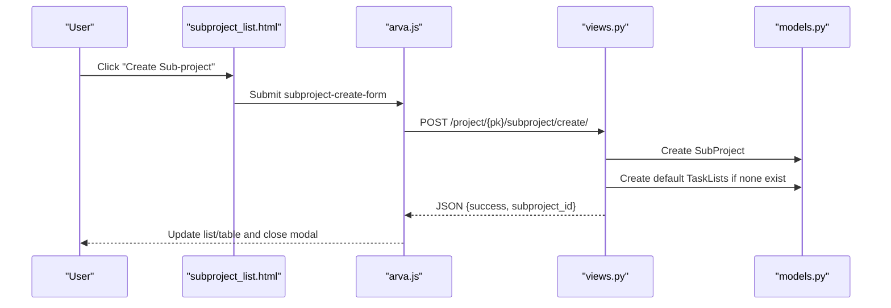
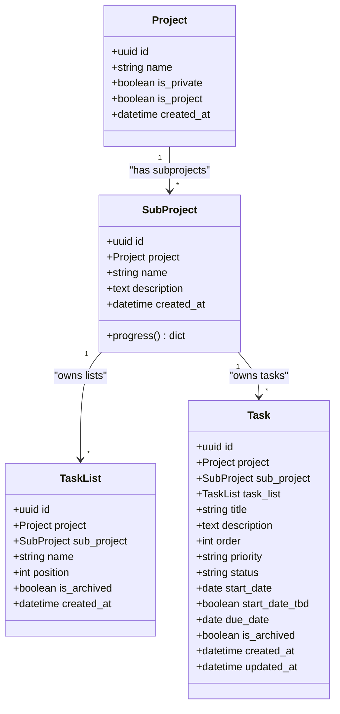
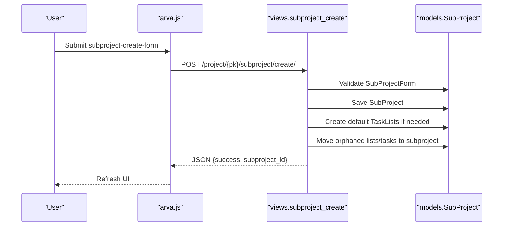
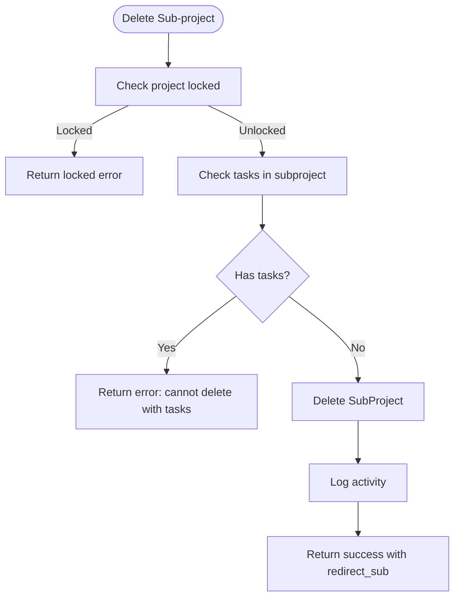
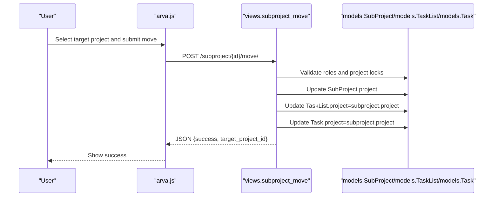
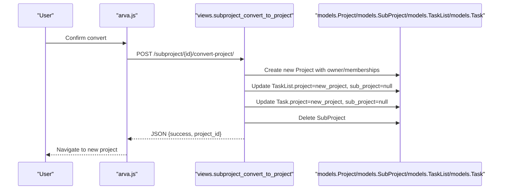
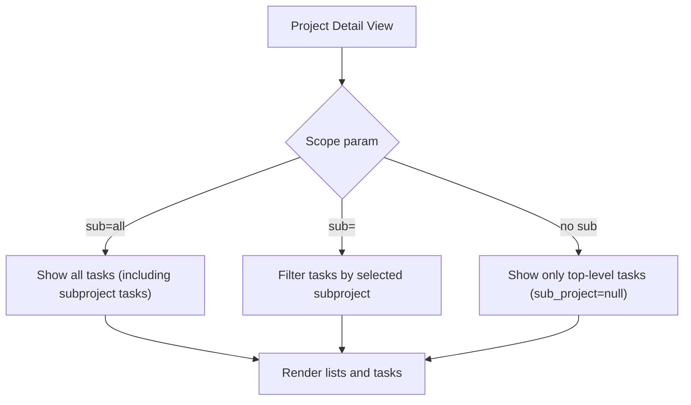
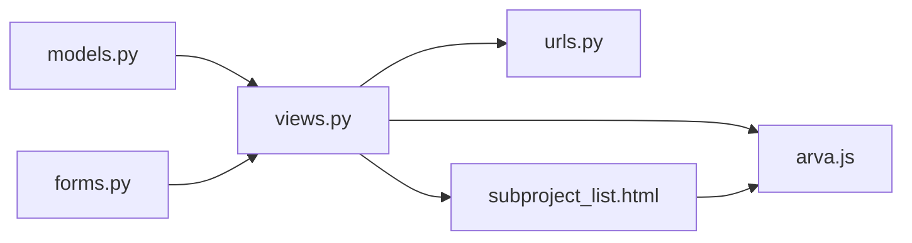

# Subproject Organization

<cite>
**Referenced Files in This Document**
- [models.py](file://arva/models.py)
- [views.py](file://arva/views.py)
- [forms.py](file://arva/forms.py)
- [urls.py](file://arva/urls.py)
- [subproject_list.html](file://arva/templates/arva/subproject_list.html)
- [arva.js](file://static/arva/js/arva.js)
</cite>

## Table of Contents
1. [Introduction](#introduction)
2. [Project Structure](#project-structure)
3. [Core Components](#core-components)
4. [Architecture Overview](#architecture-overview)
5. [Detailed Component Analysis](#detailed-component-analysis)
6. [Dependency Analysis](#dependency-analysis)
7. [Performance Considerations](#performance-considerations)
8. [Troubleshooting Guide](#troubleshooting-guide)
9. [Conclusion](#conclusion)

## Introduction
This document explains the subproject organization features in Arva Kanban. It covers the SubProject model, workflows for creating and deleting subprojects, hierarchical project organization, and how subprojects relate to tasks and task lists. It also documents moving subprojects between projects, converting subprojects to standalone projects, bulk operations, scoping in project views, filtering by subproject, default task list creation, AJAX endpoints, form validation, and access control integration with project-level permissions.

## Project Structure
The subproject feature spans models, views, forms, URLs, templates, and client-side JavaScript:
- Model layer defines SubProject and its relationship to Project, Task, and TaskList
- Views implement subproject CRUD, movement, conversion, and project-scoped filtering
- Forms validate subproject creation/editing
- URLs route subproject endpoints
- Templates render subproject list and modals
- JavaScript handles AJAX interactions and UI updates

**Diagram sources**
- [models.py](file://arva/models.py#L189-L210)
- [views.py](file://arva/views.py#L529-L704)
- [forms.py](file://arva/forms.py#L197-L204)
- [urls.py](file://arva/urls.py#L40-L44)
- [subproject_list.html](file://arva/templates/arva/subproject_list.html#L250-L330)
- [arva.js](file://static/arva/js/arva.js#L1247-L1333)

**Section sources**
- [models.py](file://arva/models.py#L189-L210)
- [views.py](file://arva/views.py#L529-L704)
- [forms.py](file://arva/forms.py#L197-L204)
- [urls.py](file://arva/urls.py#L40-L44)
- [subproject_list.html](file://arva/templates/arva/subproject_list.html#L250-L330)
- [arva.js](file://static/arva/js/arva.js#L1247-L1333)

## Core Components
- SubProject model: Links subprojects to a parent Project and supports progress computation via tasks
- Task and TaskList: Can be scoped to a SubProject, enabling separate task streams per subproject
- Views: Provide endpoints for creating, editing, deleting, moving, and converting subprojects
- Forms: Validate subproject metadata during creation and editing
- Templates: Render subproject list and modals for actions
- JavaScript: Implements AJAX flows for subproject operations and UI updates

Key behaviors:
- Automatic default task lists creation when the first subproject is created
- Cascading updates when moving or converting subprojects (TaskList.project and Task.project updated)
- Filtering in project views by subproject scope

**Section sources**
- [models.py](file://arva/models.py#L189-L210)
- [models.py](file://arva/models.py#L238-L251)
- [models.py](file://arva/models.py#L252-L315)
- [views.py](file://arva/views.py#L529-L704)
- [forms.py](file://arva/forms.py#L197-L204)
- [subproject_list.html](file://arva/templates/arva/subproject_list.html#L250-L330)
- [arva.js](file://static/arva/js/arva.js#L1247-L1333)

## Architecture Overview
The subproject feature integrates tightly with the project/task hierarchy. SubProjects are children of Projects and can own TaskLists and Tasks independently. Views enforce access control and project locking, while forms validate inputs. JavaScript handles user interactions and asynchronous updates.

**Diagram sources**
- [subproject_list.html](file://arva/templates/arva/subproject_list.html#L280-L310)
- [arva.js](file://static/arva/js/arva.js#L1247-L1274)
- [views.py](file://arva/views.py#L529-L562)
- [models.py](file://arva/models.py#L189-L210)

**Section sources**
- [views.py](file://arva/views.py#L529-L562)
- [arva.js](file://static/arva/js/arva.js#L1247-L1274)
- [subproject_list.html](file://arva/templates/arva/subproject_list.html#L280-L310)

## Detailed Component Analysis

### SubProject Model
- Relationship: ForeignKey to Project with reverse_name 'subprojects'
- Behavior: Computes progress based on tasks under the subproject
- Ordering: Ordered by creation time

**Diagram sources**
- [models.py](file://arva/models.py#L101-L129)
- [models.py](file://arva/models.py#L189-L210)
- [models.py](file://arva/models.py#L238-L251)
- [models.py](file://arva/models.py#L252-L315)

**Section sources**
- [models.py](file://arva/models.py#L189-L210)
- [models.py](file://arva/models.py#L238-L251)
- [models.py](file://arva/models.py#L252-L315)

### Subproject Creation Workflow
- Endpoint: POST /project/{pk}/subproject/create/
- Access control: Requires project access; admin-like role enforced for edits
- Validation: Uses SubProjectForm
- Defaults: Creates default lists "To Do", "In Progress", "Done" if none exist
- Cascading: Moves orphaned lists/tasks into the new subproject

**Diagram sources**
- [views.py](file://arva/views.py#L529-L562)
- [forms.py](file://arva/forms.py#L197-L204)
- [arva.js](file://static/arva/js/arva.js#L1247-L1274)

**Section sources**
- [views.py](file://arva/views.py#L529-L562)
- [forms.py](file://arva/forms.py#L197-L204)
- [arva.js](file://static/arva/js/arva.js#L1247-L1274)

### Subproject Deletion Workflow
- Endpoint: POST /subproject/{subproject_id}/delete/
- Constraints: Cannot delete if subproject still has tasks
- Behavior: Logs activity and returns redirect suggestion to remaining subproject or project root

**Diagram sources**
- [views.py](file://arva/views.py#L565-L590)

**Section sources**
- [views.py](file://arva/views.py#L565-L590)

### Moving Subprojects Between Projects
- Endpoint: POST /subproject/{subproject_id}/move/
- Validation: Requires admin-like role on both source and target projects; checks project locking
- Behavior: Updates SubProject.project; cascades TaskList.project and Task.project to target project

**Diagram sources**
- [views.py](file://arva/views.py#L615-L656)
- [arva.js](file://static/arva/js/arva.js#L1247-L1274)

**Section sources**
- [views.py](file://arva/views.py#L615-L656)
- [arva.js](file://static/arva/js/arva.js#L1247-L1274)

### Converting Subprojects to Standalone Projects
- Endpoint: POST /subproject/{subproject_id}/convert-project/
- Behavior: Creates a new Project with copied memberships; moves TaskList and Task records out of subproject scope; deletes original SubProject

**Diagram sources**
- [views.py](file://arva/views.py#L659-L704)

**Section sources**
- [views.py](file://arva/views.py#L659-L704)

### Subproject Management Operations
- Bulk operations: The codebase exposes endpoints for create, edit, delete, move, and convert; bulk actions are not implemented as explicit batch operations in the provided code
- Cascading effects: Moving or converting subprojects updates TaskList.project and Task.project to maintain referential integrity

**Section sources**
- [views.py](file://arva/views.py#L529-L704)

### Task Organization Under Subprojects
- TaskList and Task can be scoped to a SubProject via ForeignKey
- project_detail view filters tasks by subproject scope using query parameters
- Default lists are created when the first subproject is created

**Diagram sources**
- [views.py](file://arva/views.py#L712-L800)

**Section sources**
- [views.py](file://arva/views.py#L712-L800)
- [models.py](file://arva/models.py#L238-L251)
- [models.py](file://arva/models.py#L252-L315)

### Subproject Scoping and Filtering
- Scope parameter: project_detail accepts a scope parameter; when sub=all, it aggregates tasks across subprojects and top-level lists
- Filtering: Supports filtering by assignee, status, priority/labels depending on project type, due date, and pagination

**Section sources**
- [views.py](file://arva/views.py#L712-L800)

### Automatic Default Task Lists
- Creation: When the first subproject is created, default lists "To Do", "In Progress", "Done" are created for that subproject
- Behavior: Ensures immediate usability after subproject creation

**Section sources**
- [views.py](file://arva/views.py#L546-L554)

### Form Validation for Subproject Operations
- SubProjectForm validates name and description fields
- Validation occurs server-side during create/edit operations

**Section sources**
- [forms.py](file://arva/forms.py#L197-L204)
- [views.py](file://arva/views.py#L529-L612)

### Access Control and Visibility
- Access control: require_role enforces admin-like role for write operations; project_detail allows read access based on project.can_user_view
- Visibility: project_detail renders subprojects only if present; subproject_list template shows admin controls when user role permits

**Section sources**
- [views.py](file://arva/views.py#L91-L105)
- [views.py](file://arva/views.py#L712-L730)
- [subproject_list.html](file://arva/templates/arva/subproject_list.html#L26-L31)

### AJAX Endpoints and Client Interactions
- Endpoints:
  - POST /project/{pk}/subproject/create/
  - POST /subproject/{subproject_id}/delete/
  - POST /subproject/{subproject_id}/edit/
  - POST /subproject/{subproject_id}/move/
  - POST /subproject/{subproject_id}/convert-project/
  - GET /project/{pk}/subprojects/ (returns subproject list)
- JavaScript handlers:
  - Create/Edit/Delete subprojects
  - Move subprojects between projects
  - Convert subprojects to projects
  - Update UI and navigate on success

**Section sources**
- [urls.py](file://arva/urls.py#L40-L44)
- [arva.js](file://static/arva/js/arva.js#L1247-L1333)

## Dependency Analysis
- Models: SubProject depends on Project; Task and TaskList can depend on SubProject
- Views: Subproject endpoints depend on SubProjectForm and enforce access control
- Templates: subproject_list.html depends on project context and user role
- JavaScript: Handles AJAX calls and UI updates for subproject operations

**Diagram sources**
- [models.py](file://arva/models.py#L189-L210)
- [views.py](file://arva/views.py#L529-L704)
- [forms.py](file://arva/forms.py#L197-L204)
- [urls.py](file://arva/urls.py#L40-L44)
- [subproject_list.html](file://arva/templates/arva/subproject_list.html#L250-L330)
- [arva.js](file://static/arva/js/arva.js#L1247-L1333)

**Section sources**
- [models.py](file://arva/models.py#L189-L210)
- [views.py](file://arva/views.py#L529-L704)
- [forms.py](file://arva/forms.py#L197-L204)
- [urls.py](file://arva/urls.py#L40-L44)
- [subproject_list.html](file://arva/templates/arva/subproject_list.html#L250-L330)
- [arva.js](file://static/arva/js/arva.js#L1247-L1333)

## Performance Considerations
- Query optimization: project_detail uses select_related and prefetch_related to minimize N+1 queries when rendering tasks and lists
- Pagination: project_detail supports configurable page sizes for efficient rendering
- Progress calculations: SubProject.progress and Project.subproject_progress compute counts and percentages; consider caching for large datasets

[No sources needed since this section provides general guidance]

## Troubleshooting Guide
Common issues and resolutions:
- Subproject deletion fails: Ensure no tasks exist under the subproject; the endpoint returns an error if tasks are present
- Project locked: Some operations return a locked error; re-open the project if needed
- Permission denied: Write operations require admin-like role; verify user access to the project
- Missing target project: Moving or converting requires a valid target project ID; ensure selection is made

**Section sources**
- [views.py](file://arva/views.py#L565-L590)
- [views.py](file://arva/views.py#L534-L536)
- [views.py](file://arva/views.py#L619-L633)
- [views.py](file://arva/views.py#L663-L665)

## Conclusion
Arva Kanban’s subproject feature enables hierarchical organization within projects, allowing teams to segment workstreams and manage tasks independently. The implementation provides robust CRUD operations, access control, cascading updates, and seamless integration with project views and task lists. The combination of server-side validation, AJAX-driven UI, and clear scoping makes subprojects a powerful organizational tool.