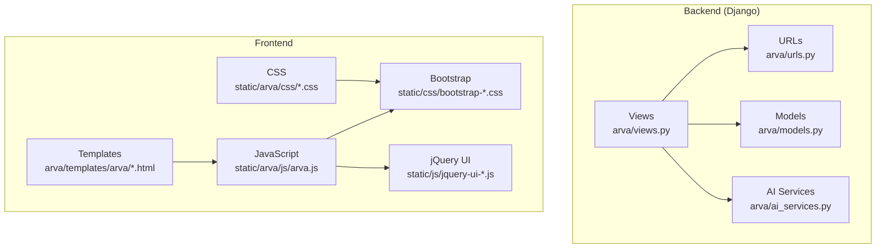
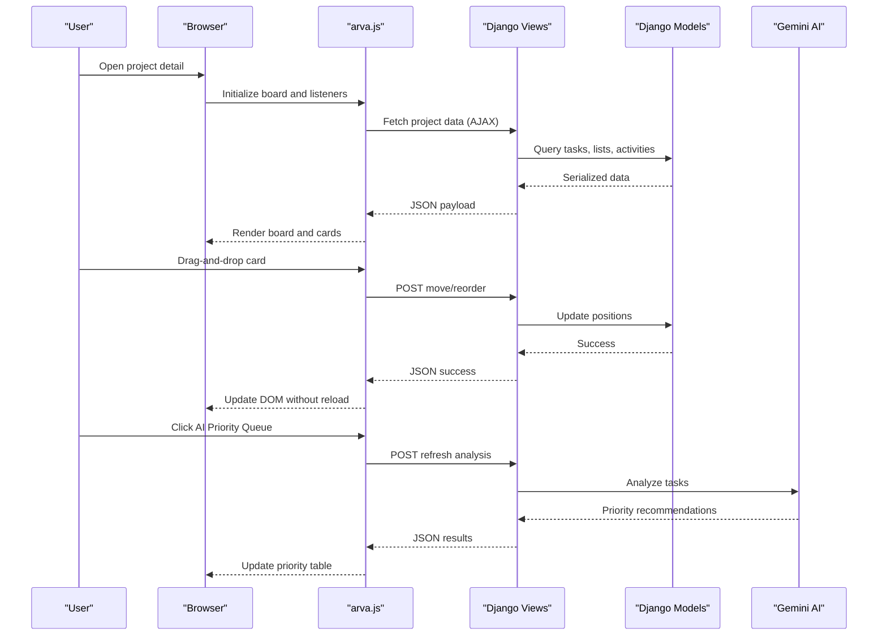
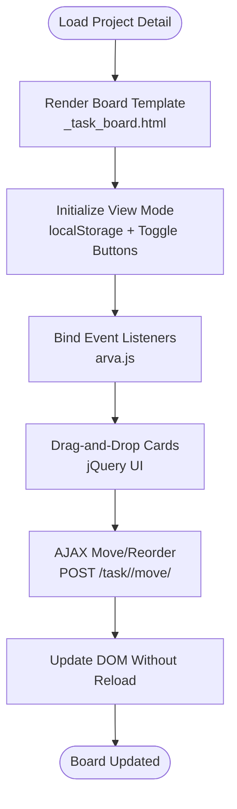
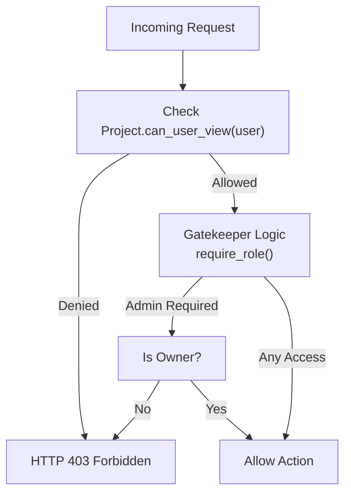
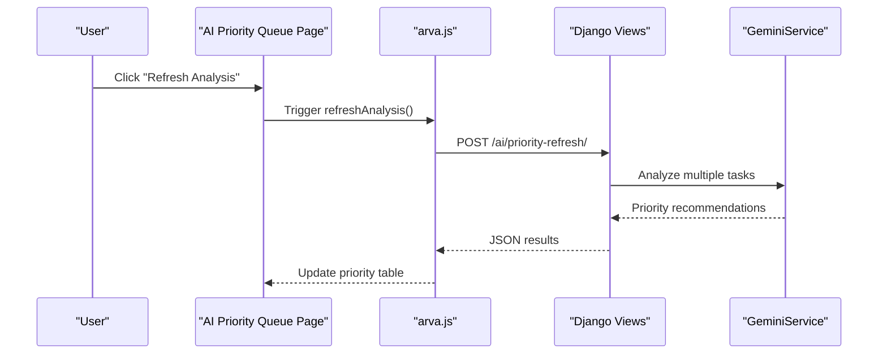
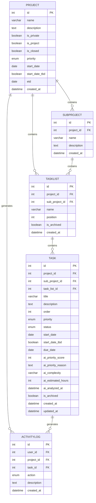
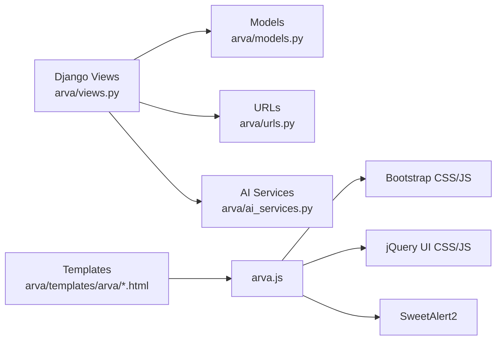

# Project Overview

<cite>
**Referenced Files in This Document**
- [README.txt](file://README.txt)
- [SETUP_GUIDE.md](file://SETUP_GUIDE.md)
- [models.py](file://arva/models.py)
- [views.py](file://arva/views.py)
- [urls.py](file://arva/urls.py)
- [ai_services.py](file://arva/ai_services.py)
- [project_detail.html](file://arva/templates/arva/project_detail.html)
- [_task_board.html](file://arva/templates/arva/_task_board.html)
- [ai_priority_queue.html](file://arva/templates/arva/ai_priority_queue.html)
- [ai_chat.html](file://arva/templates/arva/ai_chat.html)
- [arva.js](file://static/arva/js/arva.js)
</cite>

## Table of Contents
1. [Introduction](#introduction)
2. [Project Structure](#project-structure)
3. [Core Components](#core-components)
4. [Architecture Overview](#architecture-overview)
5. [Detailed Component Analysis](#detailed-component-analysis)
6. [Dependency Analysis](#dependency-analysis)
7. [Performance Considerations](#performance-considerations)
8. [Troubleshooting Guide](#troubleshooting-guide)
9. [Conclusion](#conclusion)

## Introduction
Arva Kanban is a Trello-like kanban board system designed for project and task management. It enables teams to organize work into boards, lists, and cards, supporting drag-and-drop operations, role-based access control, and AI-powered insights. The platform emphasizes real-time collaboration, structured workflows, and intelligent prioritization to improve team productivity.

Key capabilities include:
- Kanban board with lists and cards, drag-and-drop reordering, and dual view modes (card and list)
- Role-based access control with flexible sharing policies
- AI integration for priority analysis and conversational task assistance
- Rich task features: comments, attachments, checklists, labels, and due dates
- AJAX-driven interactions for seamless user experience

## Project Structure
The project follows a Django-based backend with a modern frontend leveraging Bootstrap and jQuery UI for drag-and-drop. Templates are organized under arva/templates/arva, and static assets are served via static/arva.

**Diagram sources**
- [views.py](file://arva/views.py#L1-L120)
- [urls.py](file://arva/urls.py#L1-L98)
- [models.py](file://arva/models.py#L101-L315)
- [ai_services.py](file://arva/ai_services.py#L11-L326)
- [arva.js](file://static/arva/js/arva.js#L105-L1599)

**Section sources**
- [README.txt](file://README.txt#L1-L35)
- [SETUP_GUIDE.md](file://SETUP_GUIDE.md#L1-L95)

## Core Components
- Project: Top-level container for tasks, with optional private sharing and project metadata (start date, ETD, priority).
- SubProject: Hierarchical subdivision within a project for scoped task management.
- TaskList: Columns on the kanban board representing workflow stages (e.g., To Do, In Progress, Done).
- Task: Individual work items with priority, status, due dates, assignees, labels, and AI-enhanced fields.
- ActivityLog: Audit trail for all major actions performed on projects and tasks.
- AI Services: Gemini-powered priority analysis and chat assistant for contextual task guidance.

These components collectively enable structured workflows, visibility, and intelligent insights.

**Section sources**
- [models.py](file://arva/models.py#L101-L315)
- [models.py](file://arva/models.py#L387-L445)
- [ai_services.py](file://arva/ai_services.py#L11-L326)

## Architecture Overview
Arva Kanban uses a layered architecture:
- Presentation Layer: Django templates render the board UI, filters, and modals.
- Business Logic Layer: Views orchestrate requests, enforce access control, and coordinate model operations.
- Data Access Layer: Models define entities and relationships; AI services integrate external APIs.
- Frontend Interaction Layer: jQuery UI powers drag-and-drop; Bootstrap provides responsive UI; custom JavaScript handles AJAX and dynamic updates.

**Diagram sources**
- [project_detail.html](file://arva/templates/arva/project_detail.html#L239-L241)
- [_task_board.html](file://arva/templates/arva/_task_board.html#L1-L114)
- [arva.js](file://static/arva/js/arva.js#L105-L1599)
- [views.py](file://arva/views.py#L713-L805)
- [ai_services.py](file://arva/ai_services.py#L115-L165)

## Detailed Component Analysis

### Kanban Board and Views
The board renders lists and cards, supports dual view modes (card/list), and integrates filtering and sorting. Drag-and-drop is handled by jQuery UI, while AJAX updates maintain responsiveness.

**Diagram sources**
- [_task_board.html](file://arva/templates/arva/_task_board.html#L1-L114)
- [arva.js](file://static/arva/js/arva.js#L105-L1599)
- [views.py](file://arva/views.py#L713-L805)

**Section sources**
- [project_detail.html](file://arva/templates/arva/project_detail.html#L1-L581)
- [_task_board.html](file://arva/templates/arva/_task_board.html#L1-L176)
- [arva.js](file://static/arva/js/arva.js#L105-L1599)

### Role-Based Access Control
Access control is enforced at the project level. While explicit role tokens exist, the system treats project-access users uniformly for most endpoints, with owner-only restrictions for administrative actions.

**Diagram sources**
- [models.py](file://arva/models.py#L146-L159)
- [views.py](file://arva/views.py#L91-L105)

**Section sources**
- [models.py](file://arva/models.py#L146-L159)
- [views.py](file://arva/views.py#L91-L105)

### AI Integration: Priority Analysis and Chat Assistant
AI services leverage Google Gemini to analyze tasks and provide priority recommendations and conversational guidance.

**Diagram sources**
- [ai_priority_queue.html](file://arva/templates/arva/ai_priority_queue.html#L673-L773)
- [ai_services.py](file://arva/ai_services.py#L115-L165)
- [views.py](file://arva/views.py#L1-L120)

**Section sources**
- [ai_services.py](file://arva/ai_services.py#L11-L326)
- [ai_priority_queue.html](file://arva/templates/arva/ai_priority_queue.html#L1-L804)
- [ai_chat.html](file://arva/templates/arva/ai_chat.html#L1-L912)

### Data Models Overview
The core data model defines projects, subprojects, task lists, tasks, and related entities.

**Diagram sources**
- [models.py](file://arva/models.py#L101-L315)
- [models.py](file://arva/models.py#L387-L445)

**Section sources**
- [models.py](file://arva/models.py#L101-L315)
- [models.py](file://arva/models.py#L387-L445)

## Dependency Analysis
- Backend dependencies: Django ORM, Google AI SDK (Gemini), and standard libraries.
- Frontend dependencies: Bootstrap for UI, jQuery UI for drag-and-drop, SweetAlert2 for UX feedback.
- Template dependencies: Django template tags and static asset inclusion.

**Diagram sources**
- [views.py](file://arva/views.py#L1-L120)
- [urls.py](file://arva/urls.py#L1-L98)
- [models.py](file://arva/models.py#L101-L315)
- [ai_services.py](file://arva/ai_services.py#L11-L326)
- [arva.js](file://static/arva/js/arva.js#L105-L1599)

**Section sources**
- [urls.py](file://arva/urls.py#L1-L98)
- [SETUP_GUIDE.md](file://SETUP_GUIDE.md#L1-L95)

## Performance Considerations
- Efficient queries: Views use select_related and prefetch_related to minimize N+1 queries when rendering boards and lists.
- Pagination: Task lists support configurable pagination to reduce DOM size and improve responsiveness.
- Client-side caching: LocalStorage persists view preferences and filters to avoid repeated computations.
- Minimal DOM updates: AJAX endpoints return partial HTML or JSON, enabling targeted UI updates without full page reloads.

[No sources needed since this section provides general guidance]

## Troubleshooting Guide
Common issues and resolutions:
- Database connectivity: Verify MySQL configuration and credentials; test connection using provided commands.
- Duplicate migration columns: Fake migration rollback if encountering duplicate column errors.
- Switching databases: Use local settings override to switch to SQLite for development.
- AI API configuration: Ensure GEMINI_API_KEY is configured; verify model availability and quotas.

**Section sources**
- [SETUP_GUIDE.md](file://SETUP_GUIDE.md#L42-L83)

## Conclusion
Arva Kanban delivers a robust, extensible kanban solution tailored for team collaboration. Its combination of drag-and-drop boards, structured workflows, role-based access, and AI-driven insights makes it suitable for diverse use cases—from agile project management to daily task tracking and workflow optimization. The modular Django architecture and responsive frontend ensure scalability and maintainability for growing teams.