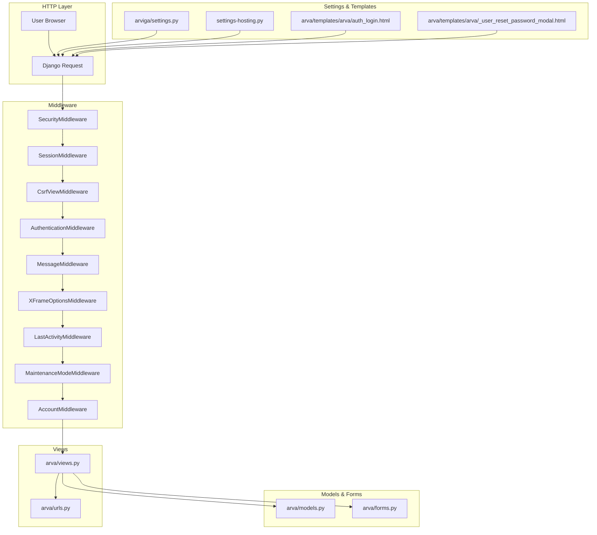
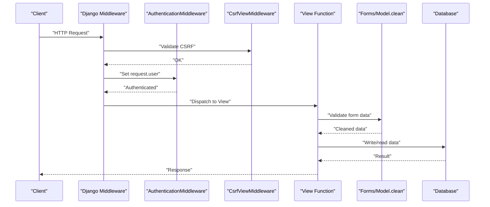
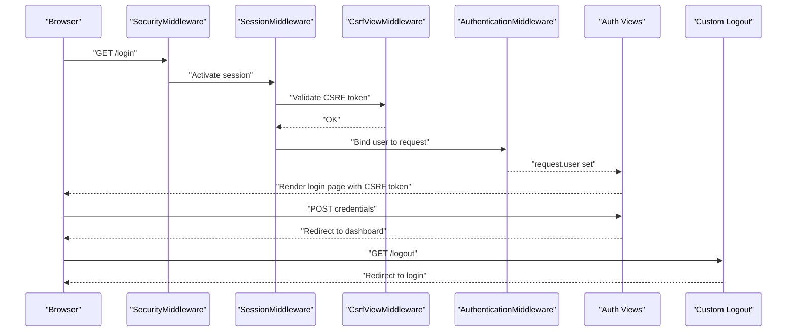
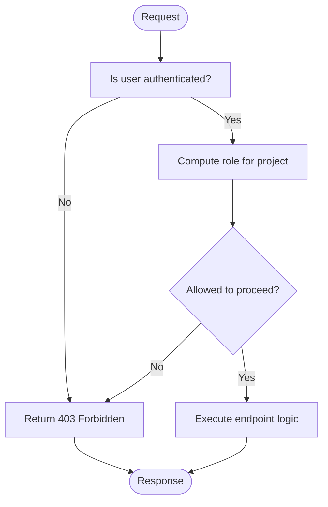
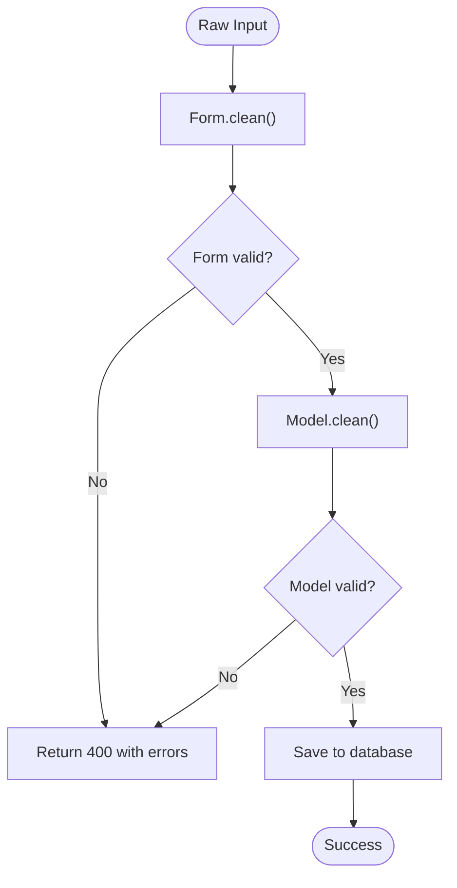
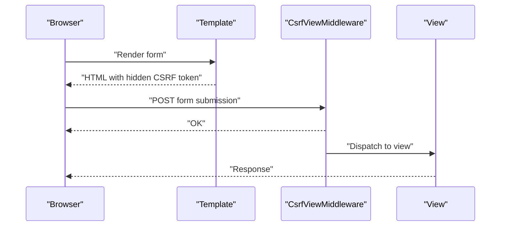
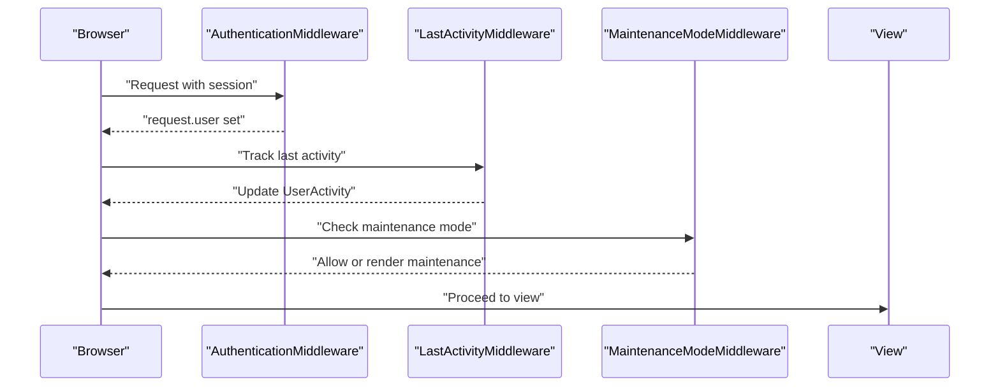
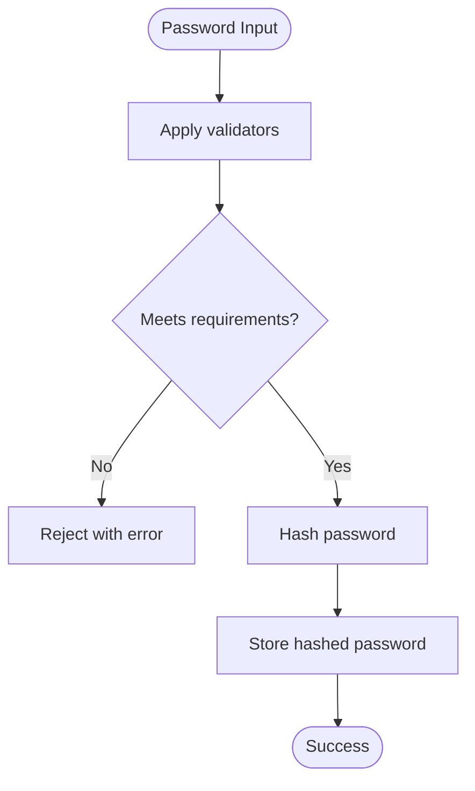
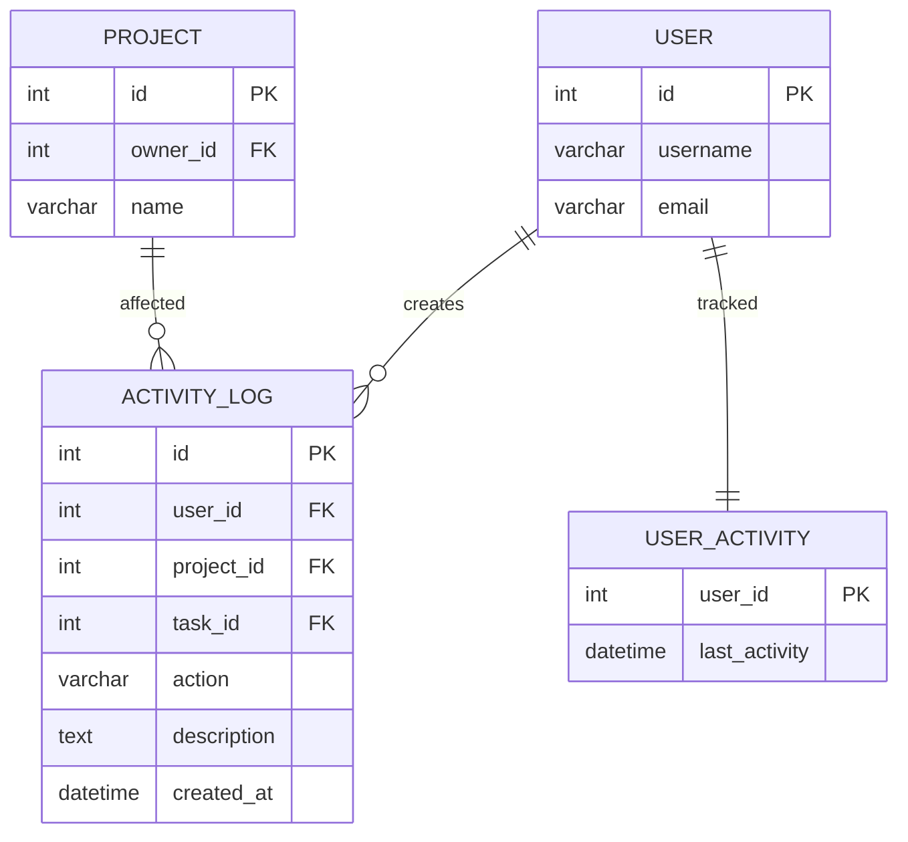
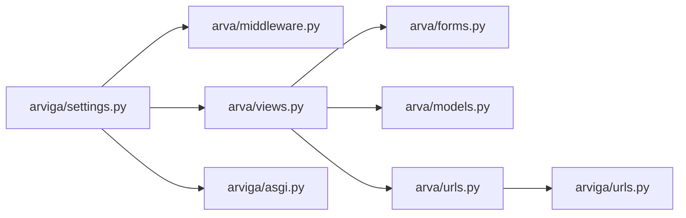

# Security Considerations

<cite>
**Referenced Files in This Document**
- [arva/middleware.py](file://arva/middleware.py)
- [arva/views.py](file://arva/views.py)
- [arva/models.py](file://arva/models.py)
- [arva/forms.py](file://arva/forms.py)
- [arva/utils.py](file://arva/utils.py)
- [arva/admin.py](file://arva/admin.py)
- [arva/urls.py](file://arva/urls.py)
- [arviga/settings.py](file://arviga/settings.py)
- [settings-hosting.py](file://settings-hosting.py)
- [arviga/urls.py](file://arviga/urls.py)
- [arviga/asgi.py](file://arviga/asgi.py)
- [arva/templates/arva/auth_login.html](file://arva/templates/arva/auth_login.html)
- [arva/templates/arva/_user_reset_password_modal.html](file://arva/templates/arva/_user_reset_password_modal.html)
- [static/arva/js/arva.js](file://static/arva/js/arva.js)
</cite>

## Table of Contents
1. [Introduction](#introduction)
2. [Project Structure](#project-structure)
3. [Core Components](#core-components)
4. [Architecture Overview](#architecture-overview)
5. [Detailed Component Analysis](#detailed-component-analysis)
6. [Dependency Analysis](#dependency-analysis)
7. [Performance Considerations](#performance-considerations)
8. [Troubleshooting Guide](#troubleshooting-guide)
9. [Conclusion](#conclusion)
10. [Appendices](#appendices)

## Introduction
This document details the security posture of Arva Kanban, focusing on authentication and session management, authorization controls, input validation and sanitization, CSRF protection, and secure handling of uploads and passwords. It explains how the application prevents common vulnerabilities such as SQL injection, cross-site scripting (XSS), and unauthorized access attempts. It also documents permission checks, secure password handling, audit trails, monitoring approaches, threat mitigations, incident response, and production hardening guidance.

## Project Structure
Security-relevant components are organized across middleware, views, models, forms, settings, and templates. Authentication integrates with Django’s built-in authentication and allauth for social providers. CSRF protection is enforced via Django middleware. Session management leverages Django sessions and allauth. Authorization is enforced at the view level with explicit checks and project-scoped access control. Validation occurs in forms and model clean methods. Audit logs capture significant actions.

**Diagram sources**
- [arviga/settings.py](file://arviga/settings.py#L24-L35)
- [arva/middleware.py](file://arva/middleware.py#L7-L38)
- [arva/views.py](file://arva/views.py#L1-L50)
- [arva/urls.py](file://arva/urls.py#L1-L20)
- [arva/models.py](file://arva/models.py#L1-L50)
- [arva/forms.py](file://arva/forms.py#L1-L50)
- [arva/templates/arva/auth_login.html](file://arva/templates/arva/auth_login.html#L1-L41)
- [arva/templates/arva/_user_reset_password_modal.html](file://arva/templates/arva/_user_reset_password_modal.html#L1-L28)

**Section sources**
- [arviga/settings.py](file://arviga/settings.py#L24-L35)
- [arva/middleware.py](file://arva/middleware.py#L7-L38)
- [arva/views.py](file://arva/views.py#L1-L50)
- [arva/urls.py](file://arva/urls.py#L1-L20)
- [arva/models.py](file://arva/models.py#L1-L50)
- [arva/forms.py](file://arva/forms.py#L1-L50)
- [arva/templates/arva/auth_login.html](file://arva/templates/arva/auth_login.html#L1-L41)
- [arva/templates/arva/_user_reset_password_modal.html](file://arva/templates/arva/_user_reset_password_modal.html#L1-L28)

## Core Components
- Authentication and Session Management
  - Django authentication middleware and allauth integration enforce login state and session lifecycle.
  - CSRF protection is enabled via Django’s CSRF middleware.
  - Session cookies and remember-me behavior are governed by Django and allauth settings.
  - Social providers (Google) are configured for OAuth-based sign-in.

- Authorization Controls
  - Project-scoped access control restricts visibility and modifications to authorized users.
  - Permission enforcement uses decorators and helper functions to gate administrative endpoints.
  - Role-based access control is deprecated; access is now unified per project membership.

- Input Validation and Sanitization
  - Forms encapsulate validation and normalization for user inputs.
  - Model clean methods validate domain-specific constraints.
  - HTML stripping utilities are used for safe rendering contexts.

- CSRF Protection
  - CSRF middleware is enabled and templates include CSRF tokens in forms.
  - JavaScript interactions handle CSRF tokens appropriately.

- Secure Password Handling
  - Password validators enforce minimum length and strength.
  - Password hashing uses Django’s secure hasher during creation and resets.

- Audit Trail and Monitoring
  - Activity log captures significant actions for projects, lists, tasks, comments, and attachments.
  - User activity records last activity timestamps for presence indicators.
  - Maintenance mode middleware enforces controlled access during maintenance.

- Secure File Uploads
  - File upload fields are validated via forms.
  - Media storage is configured under MEDIA_ROOT; ensure appropriate server-side restrictions and virus scanning in production.

**Section sources**
- [arviga/settings.py](file://arviga/settings.py#L70-L76)
- [arva/views.py](file://arva/views.py#L98-L104)
- [arva/forms.py](file://arva/forms.py#L67-L127)
- [arva/models.py](file://arva/models.py#L387-L421)
- [arva/middleware.py](file://arva/middleware.py#L7-L38)
- [arva/templates/arva/auth_login.html](file://arva/templates/arva/auth_login.html#L39-L41)
- [arva/templates/arva/_user_reset_password_modal.html](file://arva/templates/arva/_user_reset_password_modal.html#L9-L25)

## Architecture Overview
The security architecture relies on Django middleware for transport and request-level protections, with application-layer guards in views and models. Authentication integrates with allauth for external identity providers. Authorization is enforced per-project with centralized helpers. Validation is enforced in forms and models. Audit logging is captured centrally.

**Diagram sources**
- [arviga/settings.py](file://arviga/settings.py#L24-L35)
- [arva/views.py](file://arva/views.py#L57-L68)
- [arva/forms.py](file://arva/forms.py#L128-L195)
- [arva/models.py](file://arva/models.py#L131-L144)

## Detailed Component Analysis

### Authentication and Session Management
- Middleware stack includes SecurityMiddleware, SessionMiddleware, CsrfViewMiddleware, AuthenticationMiddleware, MessageMiddleware, and XFrameOptionsMiddleware. Additional Arva middleware tracks user activity and enforces maintenance mode.
- Login and logout integrate with Django’s auth views and a custom logout handler that clears allauth session artifacts.
- Social providers (Google) are configured for OAuth sign-in.

**Diagram sources**
- [arviga/settings.py](file://arviga/settings.py#L24-L35)
- [arva/views.py](file://arva/views.py#L57-L82)
- [arva/templates/arva/auth_login.html](file://arva/templates/arva/auth_login.html#L39-L41)

**Section sources**
- [arviga/settings.py](file://arviga/settings.py#L24-L35)
- [arva/views.py](file://arva/views.py#L57-L82)
- [arviga/urls.py](file://arviga/urls.py#L6-L10)
- [arva/templates/arva/auth_login.html](file://arva/templates/arva/auth_login.html#L39-L41)

### Authorization Controls and Permission Checking
- Project-scoped access control is enforced via helper functions that compute whether a user can view a project.
- Administrative endpoints check for superuser privileges or project ownership.
- Role-based access control is deprecated; endpoints that previously required admin now rely on owner-only checks or unified membership checks.

**Diagram sources**
- [arva/views.py](file://arva/views.py#L98-L104)
- [arva/views.py](file://arva/views.py#L84-L86)
- [arva/models.py](file://arva/models.py#L146-L159)

**Section sources**
- [arva/views.py](file://arva/views.py#L98-L104)
- [arva/views.py](file://arva/views.py#L501-L526)
- [arva/views.py](file://arva/views.py#L528-L590)
- [arva/models.py](file://arva/models.py#L146-L159)

### Input Validation and Sanitization
- Forms validate and normalize inputs, raising validation errors for invalid combinations (e.g., conflicting dates, mismatched passwords).
- Model clean methods enforce domain constraints (e.g., project start date vs. ETD).
- HTML stripping utilities are used for safe rendering contexts.

**Diagram sources**
- [arva/forms.py](file://arva/forms.py#L128-L195)
- [arva/forms.py](file://arva/forms.py#L206-L291)
- [arva/forms.py](file://arva/forms.py#L110-L127)
- [arva/models.py](file://arva/models.py#L131-L144)

**Section sources**
- [arva/forms.py](file://arva/forms.py#L128-L195)
- [arva/forms.py](file://arva/forms.py#L206-L291)
- [arva/forms.py](file://arva/forms.py#L110-L127)
- [arva/models.py](file://arva/models.py#L131-L144)

### CSRF Protection Mechanisms
- CSRF middleware is enabled and templates include CSRF tokens in forms.
- JavaScript code handles CSRF tokens for AJAX requests.

**Diagram sources**
- [arviga/settings.py](file://arviga/settings.py#L28-L28)
- [arva/templates/arva/auth_login.html](file://arva/templates/arva/auth_login.html#L39-L41)
- [arva/templates/arva/_user_reset_password_modal.html](file://arva/templates/arva/_user_reset_password_modal.html#L9-L25)
- [static/arva/js/arva.js](file://static/arva/js/arva.js#L2252-L2266)

**Section sources**
- [arviga/settings.py](file://arviga/settings.py#L28-L28)
- [arva/templates/arva/auth_login.html](file://arva/templates/arva/auth_login.html#L39-L41)
- [arva/templates/arva/_user_reset_password_modal.html](file://arva/templates/arva/_user_reset_password_modal.html#L9-L25)
- [static/arva/js/arva.js](file://static/arva/js/arva.js#L2252-L2266)

### Session Management
- Sessions are managed by Django’s SessionMiddleware and allauth AccountMiddleware.
- Custom logout clears allauth-specific session keys to prevent stale state.
- Maintenance mode middleware checks WebsiteSettings and renders maintenance page for non-superusers.

**Diagram sources**
- [arviga/settings.py](file://arviga/settings.py#L26-L34)
- [arva/middleware.py](file://arva/middleware.py#L7-L38)
- [arva/views.py](file://arva/views.py#L70-L82)

**Section sources**
- [arviga/settings.py](file://arviga/settings.py#L26-L34)
- [arva/middleware.py](file://arva/middleware.py#L7-L38)
- [arva/views.py](file://arva/views.py#L70-L82)

### Secure Password Handling
- Password validators enforce minimum length and prevent common or similar passwords.
- Passwords are hashed using Django’s secure hasher during user creation and admin-initiated resets.

**Diagram sources**
- [arviga/settings.py](file://arviga/settings.py#L70-L76)
- [arva/views.py](file://arva/views.py#L257-L259)
- [arva/views.py](file://arva/views.py#L344-L346)

**Section sources**
- [arviga/settings.py](file://arviga/settings.py#L70-L76)
- [arva/views.py](file://arva/views.py#L257-L259)
- [arva/views.py](file://arva/views.py#L344-L346)

### Secure File Upload Restrictions
- File upload fields are handled via forms and stored under MEDIA_ROOT.
- Ensure server-side restrictions (e.g., MIME type checks, virus scanning, size limits) and proper file permissions in production.

**Section sources**
- [arva/forms.py](file://arva/forms.py#L298-L302)
- [arviga/settings.py](file://arviga/settings.py#L107-L108)

### Audit Trail Implementation
- ActivityLog records significant actions (creation, updates, deletions) for projects, lists, tasks, comments, and attachments.
- UserActivity stores last activity timestamps for presence indicators.

**Diagram sources**
- [arva/models.py](file://arva/models.py#L387-L421)
- [arva/models.py](file://arva/models.py#L423-L428)

**Section sources**
- [arva/models.py](file://arva/models.py#L387-L421)
- [arva/models.py](file://arva/models.py#L423-L428)

### Monitoring Approaches for Suspicious Activities
- Track failed login attempts and repeated 403 responses via server logs and reverse proxy.
- Monitor maintenance mode toggles and admin actions in ActivityLog.
- Use UserActivity timestamps to detect idle accounts and presence anomalies.

[No sources needed since this section provides general guidance]

## Dependency Analysis
Security depends on the middleware chain, authentication backends, and application-layer guards. The URL routing delegates to views that enforce authorization and validation.

**Diagram sources**
- [arviga/settings.py](file://arviga/settings.py#L24-L35)
- [arva/middleware.py](file://arva/middleware.py#L7-L38)
- [arva/views.py](file://arva/views.py#L1-L50)
- [arva/forms.py](file://arva/forms.py#L1-L50)
- [arva/models.py](file://arva/models.py#L1-L50)
- [arva/urls.py](file://arva/urls.py#L1-L20)
- [arviga/urls.py](file://arviga/urls.py#L6-L10)
- [arviga/asgi.py](file://arviga/asgi.py#L1-L6)

**Section sources**
- [arviga/settings.py](file://arviga/settings.py#L24-L35)
- [arva/middleware.py](file://arva/middleware.py#L7-L38)
- [arva/views.py](file://arva/views.py#L1-L50)
- [arva/urls.py](file://arva/urls.py#L1-L20)
- [arviga/urls.py](file://arviga/urls.py#L6-L10)
- [arviga/asgi.py](file://arviga/asgi.py#L1-L6)

## Performance Considerations
- Middleware overhead is minimal; ensure caching for WebsiteSettings to avoid repeated database reads.
- Prefer bulk operations for activity updates and limit excessive queries in views.
- Use pagination and select_related/prefetch_related to reduce N+1 queries.

[No sources needed since this section provides general guidance]

## Troubleshooting Guide
- CSRF failures: Verify CSRF token inclusion in forms and AJAX requests.
- Authentication loops: Confirm LOGIN_URL and session cookie settings.
- Maintenance mode blocking: Check WebsiteSettings and cache keys.
- Permission denied: Review project membership and superuser checks in views.

**Section sources**
- [arva/templates/arva/auth_login.html](file://arva/templates/arva/auth_login.html#L39-L41)
- [arva/middleware.py](file://arva/middleware.py#L24-L38)
- [arva/views.py](file://arva/views.py#L163-L188)

## Conclusion
Arva Kanban implements a layered security model with Django middleware enforcing transport and request protections, application-layer authorization and validation, and robust audit logging. CSRF, session, and password handling follow Django best practices. Production hardening should include strict ALLOWED_HOSTS, HTTPS termination, file upload restrictions, and continuous monitoring.

[No sources needed since this section summarizes without analyzing specific files]

## Appendices

### Best Practices for User Data Protection
- Enforce HTTPS and secure cookies in production.
- Limit and sanitize file uploads; scan for malware.
- Regularly review and rotate secrets and API keys.
- Apply least privilege for database and filesystem access.

[No sources needed since this section provides general guidance]

### Incident Response Procedures
- Isolate affected systems, revoke compromised credentials, and audit ActivityLog for scope.
- Monitor for brute force attempts and unusual admin actions.
- Notify stakeholders and document remediation steps.

[No sources needed since this section provides general guidance]

### Securing Production Deployments
- Set DEBUG=False and configure ALLOWED_HOSTS.
- Use environment variables for secrets and disable development defaults.
- Enable rate limiting and WAF protections at the reverse proxy.
- Automate security updates for Django, allauth, and dependencies.

[No sources needed since this section provides general guidance]