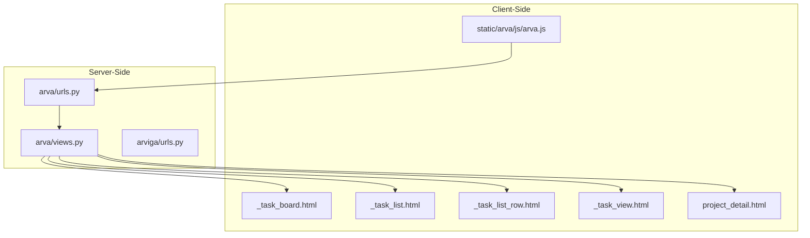
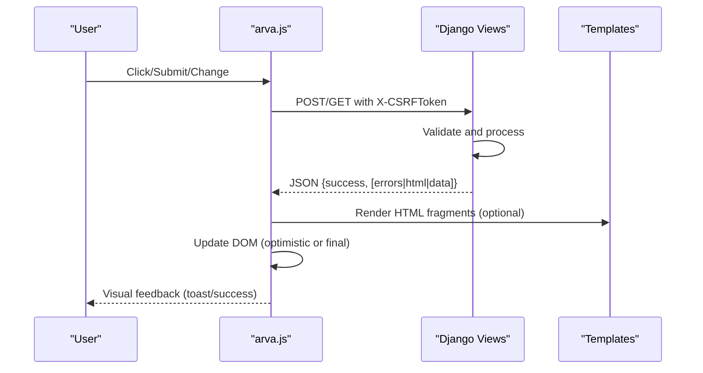
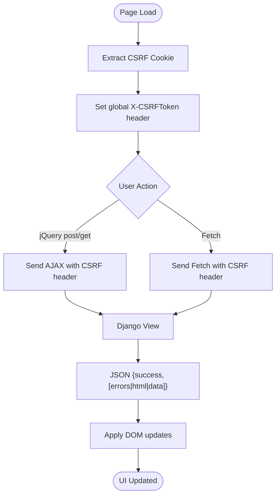
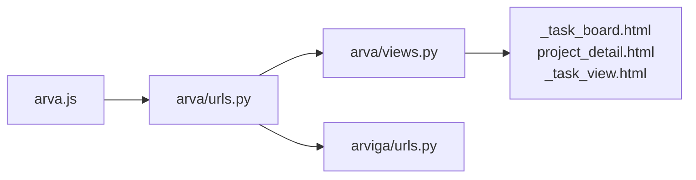

# AJAX Interactions and Real-time Updates

<cite>
**Referenced Files in This Document**
- [arva.js](file://static/arva/js/arva.js)
- [views.py](file://arva/views.py)
- [urls.py](file://arva/urls.py)
- [_task_board.html](file://arva/templates/arva/_task_board.html)
- [_task_list.html](file://arva/templates/arva/_task_list.html)
- [_task_list_row.html](file://arva/templates/arva/_task_list_row.html)
- [_task_view.html](file://arva/templates/arva/_task_view.html)
- [project_detail.html](file://arva/templates/arva/project_detail.html)
- [arviga/urls.py](file://arviga/urls.py)
</cite>

## Table of Contents
1. [Introduction](#introduction)
2. [Project Structure](#project-structure)
3. [Core Components](#core-components)
4. [Architecture Overview](#architecture-overview)
5. [Detailed Component Analysis](#detailed-component-analysis)
6. [Dependency Analysis](#dependency-analysis)
7. [Performance Considerations](#performance-considerations)
8. [Troubleshooting Guide](#troubleshooting-guide)
9. [Conclusion](#conclusion)

## Introduction
This document explains the AJAX-driven interface architecture that powers real-time updates without page reloads in the Kanban application. It covers JavaScript event listeners for user interactions, XMLHttpRequest handling via jQuery and Fetch APIs, DOM manipulation for dynamic UI updates, response processing for various operations (create, update, delete, status changes), error handling strategies, optimistic UI updates, request/response formats, caching strategies, Django CSRF integration, performance considerations, and fallback mechanisms for limited JavaScript environments.

## Project Structure
The AJAX interactions are implemented primarily in a single client-side script that integrates with Django views and templates:
- Client-side: static JavaScript handles events, requests, and DOM updates
- Server-side: Django views process AJAX requests and return JSON responses
- Templates: render initial HTML and provide data attributes for client-side logic

**Diagram sources**
- [arva.js](file://static/arva/js/arva.js#L1-L2725)
- [views.py](file://arva/views.py#L1-L2323)
- [urls.py](file://arva/urls.py#L1-L98)
- [_task_board.html](file://arva/templates/arva/_task_board.html#L1-L176)
- [_task_list.html](file://arva/templates/arva/_task_list.html#L1-L52)
- [_task_list_row.html](file://arva/templates/arva/_task_list_row.html#L1-L126)
- [_task_view.html](file://arva/templates/arva/_task_view.html#L1-L314)
- [project_detail.html](file://arva/templates/arva/project_detail.html#L1-L581)
- [arviga/urls.py](file://arviga/urls.py#L1-L15)

**Section sources**
- [arva.js](file://static/arva/js/arva.js#L1-L2725)
- [views.py](file://arva/views.py#L1-L2323)
- [urls.py](file://arva/urls.py#L1-L98)
- [_task_board.html](file://arva/templates/arva/_task_board.html#L1-L176)
- [_task_list.html](file://arva/templates/arva/_task_list.html#L1-L52)
- [_task_list_row.html](file://arva/templates/arva/_task_list_row.html#L1-L126)
- [_task_view.html](file://arva/templates/arva/_task_view.html#L1-L314)
- [project_detail.html](file://arva/templates/arva/project_detail.html#L1-L581)
- [arviga/urls.py](file://arviga/urls.py#L1-L15)

## Core Components
- Event-driven JavaScript: Listeners for clicks, submits, changes, and keyboard actions trigger AJAX calls
- Request mechanisms: jQuery $.post for form submissions and $.get for partial reloads; Fetch API for modern endpoints
- CSRF integration: Global X-CSRFToken header and per-request token injection
- DOM manipulation: Replace, prepend, append, and attribute updates without full page reloads
- Response processing: Unified JSON responses with success/error fields and optional HTML fragments
- Optimistic updates: Immediate UI changes followed by reconciliation on server response

**Section sources**
- [arva.js](file://static/arva/js/arva.js#L1-L2725)

## Architecture Overview
The system follows a client-initiated AJAX pattern:
- User actions trigger JavaScript handlers
- Handlers send HTTP requests to Django endpoints
- Views validate, process, and return JSON responses
- JavaScript applies DOM updates based on response data

**Diagram sources**
- [arva.js](file://static/arva/js/arva.js#L1028-L1086)
- [views.py](file://arva/views.py#L476-L500)
- [_task_board.html](file://arva/templates/arva/_task_board.html#L1-L176)

## Detailed Component Analysis

### AJAX Event Listeners and Handlers
- Form submissions: Project creation, task creation, inline updates, comment addition, checklist operations, attachments
- Modal triggers: Task view, quick move, subproject operations
- Keyboard and click interactions: Sorting, pagination, filtering, drag-and-drop reordering
- Global CSRF setup: Headers applied to all $.ajax calls

Common patterns:
- Serialize form data or FormData
- Include X-CSRFToken via headers or hidden field
- Handle success/failure with user-visible feedback

**Section sources**
- [arva.js](file://static/arva/js/arva.js#L1028-L1086)
- [arva.js](file://static/arva/js/arva.js#L1121-L1154)
- [arva.js](file://static/arva/js/arva.js#L1457-L1491)
- [arva.js](file://static/arva/js/arva.js#L1493-L1519)
- [arva.js](file://static/arva/js/arva.js#L1812-L1839)
- [arva.js](file://static/arva/js/arva.js#L1917-L1944)
- [arva.js](file://static/arva/js/arva.js#L1969-L1999)
- [arva.js](file://static/arva/js/arva.js#L2001-L2021)
- [arva.js](file://static/arva/js/arva.js#L2023-L2043)
- [arva.js](file://static/arva/js/arva.js#L2050-L2078)
- [arva.js](file://static/arva/js/arva.js#L2080-L2112)
- [arva.js](file://static/arva/js/arva.js#L2114-L2142)
- [arva.js](file://static/arva/js/arva.js#L2144-L2199)
- [arva.js](file://static/arva/js/arva.js#L2209-L2267)
- [arva.js](file://static/arva/js/arva.js#L2269-L2310)
- [arva.js](file://static/arva/js/arva.js#L2324-L2353)
- [arva.js](file://static/arva/js/arva.js#L2355-L2374)
- [arva.js](file://static/arva/js/arva.js#L2376-L2411)
- [arva.js](file://static/arva/js/arva.js#L2414-L2430)
- [arva.js](file://static/arva/js/arva.js#L2432-L2471)
- [arva.js](file://static/arva/js/arva.js#L2473-L2493)
- [arva.js](file://static/arva/js/arva.js#L2495-L2531)
- [arva.js](file://static/arva/js/arva.js#L2549-L2575)
- [arva.js](file://static/arva/js/arva.js#L2577-L2603)

### XMLHttpRequest Handling and CSRF Integration
- Global CSRF token extraction and $.ajaxSetup for jQuery requests
- Per-request X-CSRFToken header for Fetch and $.post calls
- Hidden CSRF tokens embedded in forms for fallback scenarios

**Diagram sources**
- [arva.js](file://static/arva/js/arva.js#L1-L20)
- [arva.js](file://static/arva/js/arva.js#L1057-L1086)
- [arva.js](file://static/arva/js/arva.js#L1121-L1154)
- [arva.js](file://static/arva/js/arva.js#L1735-L1754)

**Section sources**
- [arva.js](file://static/arva/js/arva.js#L1-L20)
- [arva.js](file://static/arva/js/arva.js#L1057-L1086)
- [arva.js](file://static/arva/js/arva.js#L1121-L1154)
- [arva.js](file://static/arva/js/arva.js#L1735-L1754)

### DOM Manipulation Patterns
- Replace entire board content after filter changes
- Insert new task cards into columns
- Append comment/attachment/checklist items
- Toggle visibility and attributes (disabled, hidden)
- Update counters and summaries

Examples:
- Board reload after filter changes
- Prepend new project items
- Replace task card HTML after inline updates
- Fade out and remove deleted items

**Section sources**
- [arva.js](file://static/arva/js/arva.js#L2432-L2471)
- [arva.js](file://static/arva/js/arva.js#L1121-L1154)
- [arva.js](file://static/arva/js/arva.js#L1457-L1491)
- [arva.js](file://static/arva/js/arva.js#L1493-L1519)
- [arva.js](file://static/arva/js/arva.js#L2001-L2021)
- [arva.js](file://static/arva/js/arva.js#L2223-L2248)

### Response Processing and Operation Types
Response format:
- JSON with success flag
- Optional fields: errors, html, list_row_html, task_list_id, redirect_sub, project_id, project_name, user, layout, error

Operation categories:
- Task creation: POST /project/{pk}/task/create/
- Inline updates: POST /task/{id}/inline-update/
- Task deletion/archive/unarchive: POST /task/{id}/delete/, /task/{id}/archive/, /task/{id}/unarchive/
- Task transfer/move: POST /task/{id}/transfer/, /task/{id}/move/
- List operations: POST /project/{pk}/list/create/, /list/{id}/delete/, /list/{id}/archive/, /list/{id}/unarchive/
- Project operations: POST /project/{pk}/close/, /project/{pk}/reopen/, /project/{pk}/edit/, /project/{pk}/delete/
- User operations: POST /users/create/, /users/{id}/toggle-active/, /users/{id}/reset-password/, /users/{id}/delete/
- Settings: POST /profile/theme/update/, /profile/layout/update/

Validation and error handling:
- 400 Bad Request with errors object for form validation failures
- 403 Forbidden for permission denials
- Generic error handling with user notifications

**Section sources**
- [views.py](file://arva/views.py#L476-L500)
- [views.py](file://arva/views.py#L190-L217)
- [views.py](file://arva/views.py#L248-L268)
- [views.py](file://arva/views.py#L318-L331)
- [views.py](file://arva/views.py#L334-L348)
- [views.py](file://arva/views.py#L351-L366)
- [views.py](file://arva/views.py#L502-L526)
- [views.py](file://arva/views.py#L528-L562)
- [views.py](file://arva/views.py#L564-L589)
- [views.py](file://arva/views.py#L591-L612)
- [views.py](file://arva/views.py#L614-L656)
- [views.py](file://arva/views.py#L658-L704)
- [views.py](file://arva/views.py#L706-L710)
- [urls.py](file://arva/urls.py#L14-L69)

### Optimistic UI Updates
Optimistic patterns:
- Immediately insert new task cards into target column
- Replace task card with updated HTML upon successful inline update
- Remove items immediately on delete/archive actions
- Update counters and summaries instantly
- Hide skeleton loaders after successful fetch

Reconciliation:
- On server failure, revert UI changes or show error
- On success, ensure DOM reflects server state

**Section sources**
- [arva.js](file://static/arva/js/arva.js#L1057-L1086)
- [arva.js](file://static/arva/js/arva.js#L1493-L1519)
- [arva.js](file://static/arva/js/arva.js#L2001-L2021)
- [arva.js](file://static/arva/js/arva.js#L2023-L2043)
- [arva.js](file://static/arva/js/arva.js#L1629-L1644)

### Common AJAX Operations and Examples
- Create task (list view): POST /project/{pk}/task/create/ with FormData
- Inline update task: POST /task/{id}/inline-update/ with field/value
- Add comment: POST /task/{id}/comment/add/ with content
- Upload attachment: POST /task/{id}/attachment/add/ with FormData
- Move task: POST /task/{id}/transfer/ with project_id/task_list_id/sub_project_id
- Delete task: POST /task/{id}/delete/
- Filter and paginate: GET /project/{id}/ with query params, replace board HTML

Request/response examples:
- Creation returns {success, html, task_list_id, list_row_html}
- Inline update returns {success, html}
- Deletion returns {success}
- Filtering returns {success, html}

**Section sources**
- [arva.js](file://static/arva/js/arva.js#L1028-L1086)
- [arva.js](file://static/arva/js/arva.js#L1493-L1519)
- [arva.js](file://static/arva/js/arva.js#L1812-L1839)
- [arva.js](file://static/arva/js/arva.js#L1969-L1999)
- [arva.js](file://static/arva/js/arva.js#L1728-L1754)
- [arva.js](file://static/arva/js/arva.js#L2001-L2021)
- [arva.js](file://static/arva/js/arva.js#L2432-L2471)
- [views.py](file://arva/views.py#L476-L500)
- [views.py](file://arva/views.py#L502-L526)

### Caching Strategies
- LocalStorage for persistent UI preferences (view modes, paging, filters)
- Minimal client-side caching of rendered HTML fragments
- Template-rendered data attributes provide context for client-side logic

**Section sources**
- [arva.js](file://static/arva/js/arva.js#L280-L432)
- [arva.js](file://static/arva/js/arva.js#L1089-L1097)
- [arva.js](file://static/arva/js/arva.js#L1099-L1119)
- [arva.js](file://static/arva/js/arva.js#L2606-L2621)

### Integration with Django CSRF Protection
- CSRF token extracted from cookie and set globally for AJAX
- Per-request inclusion via headers or hidden form fields
- Endpoints validated server-side for CSRF

**Section sources**
- [arva.js](file://static/arva/js/arva.js#L1-L20)
- [arva.js](file://static/arva/js/arva.js#L1057-L1086)
- [arva.js](file://static/arva/js/arva.js#L1735-L1754)
- [arva.js](file://static/arva/js/arva.js#L2515-L2531)

### Fallback Mechanisms for Limited JavaScript
- Progressive enhancement: Initial HTML rendered server-side
- Graceful degradation: Non-JS users rely on full-page navigation
- Data attributes on containers enable client-side initialization only when present
- Confirm dialogs and modals enhance UX but do not block core functionality

**Section sources**
- [_task_board.html](file://arva/templates/arva/_task_board.html#L1-L176)
- [_task_list.html](file://arva/templates/arva/_task_list.html#L1-L52)
- [_task_list_row.html](file://arva/templates/arva/_task_list_row.html#L1-L126)
- [_task_view.html](file://arva/templates/arva/_task_view.html#L1-L314)
- [project_detail.html](file://arva/templates/arva/project_detail.html#L1-L581)

## Dependency Analysis
The client-server interaction depends on:
- URL routing mapping UI actions to Django views
- Template rendering providing initial HTML and data attributes
- CSRF middleware validating AJAX requests

**Diagram sources**
- [arva.js](file://static/arva/js/arva.js#L1-L2725)
- [urls.py](file://arva/urls.py#L1-L98)
- [arviga/urls.py](file://arviga/urls.py#L1-L15)
- [views.py](file://arva/views.py#L1-L2323)
- [_task_board.html](file://arva/templates/arva/_task_board.html#L1-L176)
- [project_detail.html](file://arva/templates/arva/project_detail.html#L1-L581)
- [_task_view.html](file://arva/templates/arva/_task_view.html#L1-L314)

**Section sources**
- [urls.py](file://arva/urls.py#L1-L98)
- [arviga/urls.py](file://arviga/urls.py#L1-L15)
- [views.py](file://arva/views.py#L1-L2323)
- [arva.js](file://static/arva/js/arva.js#L1-L2725)

## Performance Considerations
- Debounced input handling for search/filter operations
- Minimal DOM updates by replacing targeted containers
- Efficient pagination with server-side limits and client-side counters
- Drag-and-drop reordering with batched server requests
- Auto-resize textareas to reduce layout thrashing
- Skeleton loaders during task detail loading

Recommendations:
- Batch frequent updates (e.g., multiple inline updates) into fewer requests
- Use IntersectionObserver for infinite scrolling if needed
- Cache frequently accessed dropdown options (lists, subprojects)
- Optimize image/file uploads with progress indicators

**Section sources**
- [arva.js](file://static/arva/js/arva.js#L190-L227)
- [arva.js](file://static/arva/js/arva.js#L2432-L2471)
- [arva.js](file://static/arva/js/arva.js#L1646-L1657)
- [arva.js](file://static/arva/js/arva.js#L2654-L2724)

## Troubleshooting Guide
Common issues and resolutions:
- Network failures: Show generic error toast; retry or refresh
- Validation errors: Display first error from response.errors
- Permission denied (403): Inform user they lack access
- Project locked: Prevent actions and notify user
- CSRF failures: Ensure headers include X-CSRFToken

Error handling patterns:
- $.post/.get success/fail callbacks
- try/catch around fetch.then chains
- Centralized showError utility for consistent messaging

**Section sources**
- [arva.js](file://static/arva/js/arva.js#L59-L88)
- [arva.js](file://static/arva/js/arva.js#L1064-L1086)
- [arva.js](file://static/arva/js/arva.js#L1144-L1153)
- [arva.js](file://static/arva/js/arva.js#L1481-L1490)
- [arva.js](file://static/arva/js/arva.js#L1509-L1518)
- [arva.js](file://static/arva/js/arva.js#L1637-L1644)
- [arva.js](file://static/arva/js/arva.js#L1749-L1753)
- [arva.js](file://static/arva/js/arva.js#L1829-L1838)
- [arva.js](file://static/arva/js/arva.js#L1889-L1890)
- [arva.js](file://static/arva/js/arva.js#L1934-L1943)
- [arva.js](file://static/arva/js/arva.js#L1959-L1966)
- [arva.js](file://static/arva/js/arva.js#L1991-L1999)
- [arva.js](file://static/arva/js/arva.js#L2013-L2021)
- [arva.js](file://static/arva/js/arva.js#L2035-L2042)
- [arva.js](file://static/arva/js/arva.js#L2070-L2077)
- [arva.js](file://static/arva/js/arva.js#L2104-L2112)
- [arva.js](file://static/arva/js/arva.js#L2134-L2142)
- [arva.js](file://static/arva/js/arva.js#L2173-L2178)
- [arva.js](file://static/arva/js/arva.js#L2188-L2199)
- [arva.js](file://static/arva/js/arva.js#L2252-L2267)
- [arva.js](file://static/arva/js/arva.js#L2285-L2288)
- [arva.js](file://static/arva/js/arva.js#L2306-L2310)
- [arva.js](file://static/arva/js/arva.js#L2340-L2353)
- [arva.js](file://static/arva/js/arva.js#L2369-L2373)
- [arva.js](file://static/arva/js/arva.js#L2407-L2410)
- [arva.js](file://static/arva/js/arva.js#L2467-L2470)
- [arva.js](file://static/arva/js/arva.js#L2481-L2493)
- [arva.js](file://static/arva/js/arva.js#L2527-L2531)
- [arva.js](file://static/arva/js/arva.js#L2571-L2574)
- [arva.js](file://static/arva/js/arva.js#L2599-L2602)

## Conclusion
The AJAX-driven interface leverages a cohesive pattern of client-side event handling, robust CSRF integration, and server-side JSON responses to deliver a responsive, real-time experience. Optimistic UI updates improve perceived performance, while comprehensive error handling ensures reliability. The architecture balances simplicity and extensibility, enabling straightforward additions of new operations and refinements to existing flows.