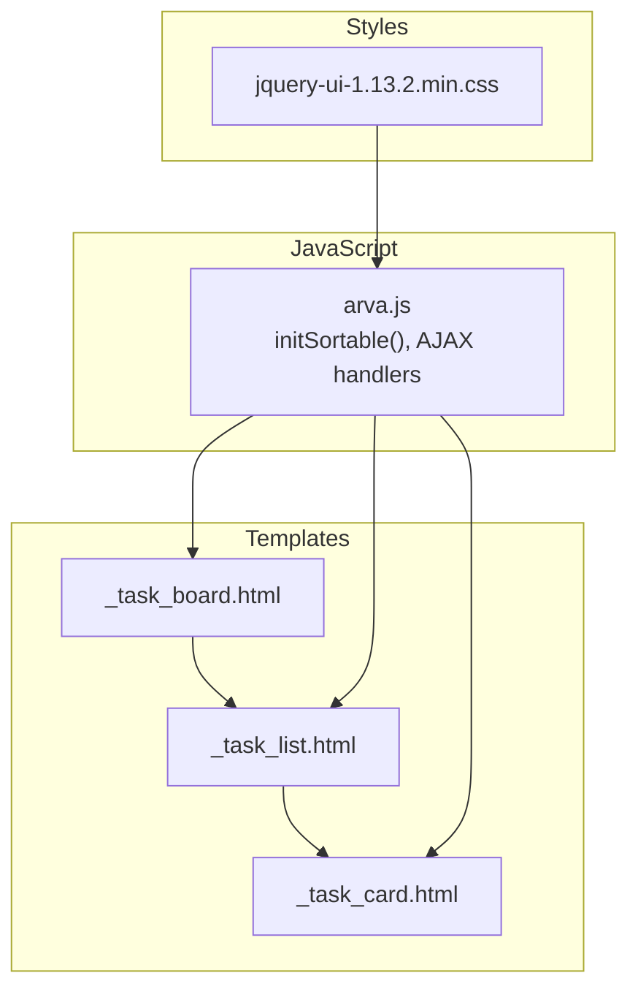
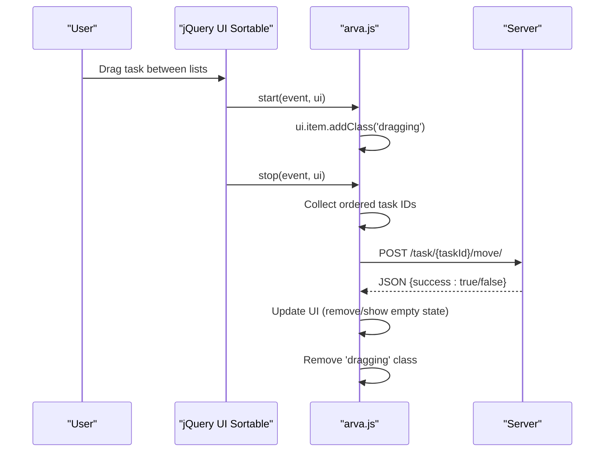
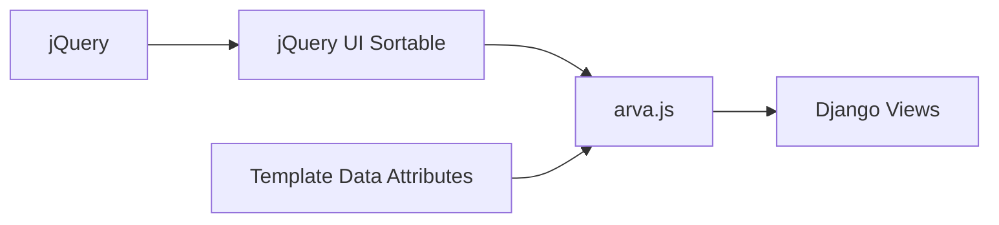

# Drag-and-Drop Functionality

<cite>
**Referenced Files in This Document**
- [arva.js](file://static/arva/js/arva.js)
- [_task_board.html](file://arva/templates/arva/_task_board.html)
- [_task_list.html](file://arva/templates/arva/_task_list.html)
- [_task_card.html](file://arva/templates/arva/_task_card.html)
- [jquery-ui-1.13.2.min.css](file://static/css/jquery-ui-1.13.2.min.css)
</cite>

## Table of Contents
1. [Introduction](#introduction)
2. [Project Structure](#project-structure)
3. [Core Components](#core-components)
4. [Architecture Overview](#architecture-overview)
5. [Detailed Component Analysis](#detailed-component-analysis)
6. [Dependency Analysis](#dependency-analysis)
7. [Performance Considerations](#performance-considerations)
8. [Troubleshooting Guide](#troubleshooting-guide)
9. [Conclusion](#conclusion)

## Introduction
This document explains the drag-and-drop implementation for task cards in the Kanban board, built with jQuery UI Sortable. It covers JavaScript event handlers for drag lifecycle, visual feedback, cross-list movement, AJAX communication to update positions server-side, and strategies for handling concurrent edits and performance at scale.

## Project Structure
The drag-and-drop feature spans three layers:
- Templates define the board, lists, and task cards with data attributes used by JavaScript.
- CSS provides jQuery UI styles and custom drag visuals.
- JavaScript initializes sortable behavior, handles drag events, and communicates with the backend via AJAX.

**Diagram sources**
- [arva.js](file://static/arva/js/arva.js#L2654-L2725)
- [_task_board.html](file://arva/templates/arva/_task_board.html#L1-L176)
- [_task_list.html](file://arva/templates/arva/_task_list.html#L1-L52)
- [_task_card.html](file://arva/templates/arva/_task_card.html#L1-L185)
- [jquery-ui-1.13.2.min.css](file://static/css/jquery-ui-1.13.2.min.css#L1-L7)

**Section sources**
- [arva.js](file://static/arva/js/arva.js#L2654-L2725)
- [_task_board.html](file://arva/templates/arva/_task_board.html#L1-L176)
- [_task_list.html](file://arva/templates/arva/_task_list.html#L1-L52)
- [_task_card.html](file://arva/templates/arva/_task_card.html#L1-L185)
- [jquery-ui-1.13.2.min.css](file://static/css/jquery-ui-1.13.2.min.css#L1-L7)

## Core Components
- jQuery UI Sortable integration for task columns and list ordering.
- Event hooks for drag start, drag over, drop, and drag end.
- AJAX POST requests to persist position changes without page reloads.
- Visual feedback via CSS classes and jQuery UI placeholder styling.
- Cross-list movement with position reordering arrays.

Key implementation references:
- Sortable initialization and options: [arva.js](file://static/arva/js/arva.js#L2654-L2725)
- Drag lifecycle callbacks and AJAX posting: [arva.js](file://static/arva/js/arva.js#L2684-L2718)
- Empty state toggling after drag: [arva.js](file://static/arva/js/arva.js#L2698-L2699)
- List reordering persistence: [arva.js](file://static/arva/js/arva.js#L2623-L2641)

**Section sources**
- [arva.js](file://static/arva/js/arva.js#L2654-L2725)
- [arva.js](file://static/arva/js/arva.js#L2623-L2641)

## Architecture Overview
The drag-and-drop pipeline connects UI interactions to server-side persistence:

**Diagram sources**
- [arva.js](file://static/arva/js/arva.js#L2676-L2718)

## Detailed Component Analysis

### jQuery UI Sortable Initialization
- Initializes sortable on task columns with cross-list connectivity.
- Configures placeholder styling, handle targeting, scrolling behavior, and drag handle.
- Prevents sorting when the project is locked.

Implementation highlights:
- Destroy existing instances before re-init to avoid duplicates.
- Enable cross-list dragging via connectWith.
- Use placeholder class for visual drop zones.
- Scroll sensitivity and speed for smooth dragging in large boards.

**Section sources**
- [arva.js](file://static/arva/js/arva.js#L2654-L2725)

### Drag Lifecycle Handlers
- start: Adds a "dragging" class to the dragged item for visual feedback.
- stop: Computes new order, posts changes to server, updates UI state, and removes "dragging" class.

Behavioral details:
- Extracts task ID and target list ID from DOM data attributes.
- Builds ordered array of task IDs within the target list.
- Calls checkEmptyState to toggle empty state indicators.

**Section sources**
- [arva.js](file://static/arva/js/arva.js#L2684-L2718)
- [arva.js](file://static/arva/js/arva.js#L2698-L2699)

### Visual Feedback System
- CSS hover effect for non-dragged cards: [arva.css](file://static/arva/css/arva.css#L448-L452)
- Dragging state class applied during drag: [arva.js](file://static/arva/js/arva.js#L2684-L2688)
- jQuery UI placeholder styling for drop zones: [jquery-ui-1.13.2.min.css](file://static/css/jquery-ui-1.13.2.min.css#L1-L7)

**Section sources**
- [arva.js](file://static/arva/js/arva.js#L2684-L2688)
- [jquery-ui-1.13.2.min.css](file://static/css/jquery-ui-1.13.2.min.css#L1-L7)

### AJAX Communication and Position Persistence
- Endpoint: POST /task/{taskId}/move/
- Payload includes:
  - task_list_id: destination list identifier
  - ordered_ids[]: array of task IDs in the new order
- Error handling:
  - 403: Access denied
  - 400 with error: Validation failure
  - Other: Generic failure

Server-side list reordering:
- Endpoint: POST /project/{projectId}/list/reorder/
- Payload includes:
  - ordered_ids[]: board list order
  - sub_project_id: optional subproject context

**Section sources**
- [arva.js](file://static/arva/js/arva.js#L2701-L2716)
- [arva.js](file://static/arva/js/arva.js#L2634-L2640)

### Cross-List Dragging and Position Calculation
- connectWith enables dragging between columns.
- On drop, the system:
  - Reads the new list’s task order.
  - Sends ordered_ids[] to the server.
  - Updates local UI immediately upon successful response.

Position calculation algorithm:
- Iterates through child task cards under the target column.
- Collects task IDs in DOM order to form ordered_ids[].

**Section sources**
- [arva.js](file://static/arva/js/arva.js#L2676-L2718)

### Conflict Resolution and Concurrency
- The client sends ordered_ids[] representing the current UI state.
- The server should validate ownership and list membership before applying changes.
- For simultaneous edits, the server should:
  - Verify the requesting user has permission to move tasks.
  - Ensure the destination list belongs to the same project/subproject.
  - Apply atomic updates to maintain consistency.
- Client-side UX:
  - Show error messages for 403/400 responses.
  - Optionally retry or revert UI on persistent failures.

**Section sources**
- [arva.js](file://static/arva/js/arva.js#L2707-L2716)

### Examples of Drag Operations
- Move a single task within the same list to reorder it.
- Drag a task from one list to another to change its status.
- Reorder board lists horizontally by dragging list containers.

These behaviors are implemented through the sortable configuration and event handlers.

**Section sources**
- [arva.js](file://static/arva/js/arva.js#L2668-L2718)

## Dependency Analysis
The drag-and-drop feature depends on:
- jQuery UI Sortable for drag-and-drop mechanics.
- Bootstrap modals and SweetAlert2 for user feedback.
- Django endpoints for persistence.

**Diagram sources**
- [arva.js](file://static/arva/js/arva.js#L2654-L2725)
- [_task_board.html](file://arva/templates/arva/_task_board.html#L1-L176)

**Section sources**
- [arva.js](file://static/arva/js/arva.js#L2654-L2725)
- [_task_board.html](file://arva/templates/arva/_task_board.html#L1-L176)

## Performance Considerations
- Large boards:
  - Limit placeholder rendering to visible area by relying on jQuery UI defaults.
  - Use scroll sensitivity/speed to improve responsiveness during long drags.
  - Debounce frequent updates if adding custom logic around drag events.
- Minimize DOM manipulation:
  - Avoid heavy computations in start/stop callbacks.
  - Batch UI updates after AJAX completion.
- Network efficiency:
  - Send only ordered_ids[] and minimal metadata.
  - Use POST requests to avoid GET parameter limits.

[No sources needed since this section provides general guidance]

## Troubleshooting Guide
Common issues and resolutions:
- Drag does nothing:
  - Verify sortable is initialized and not destroyed prematurely.
  - Confirm the project is not locked (drag disabled when closed).
- Wrong drop zone highlight:
  - Ensure placeholder class is defined and CSS targets it correctly.
- Position not updating:
  - Check AJAX response handling and payload correctness.
  - Validate server-side permissions and list membership checks.
- Visual artifacts:
  - Confirm "dragging" class is removed in stop callback.
  - Ensure empty state toggling runs after successful moves.

**Section sources**
- [arva.js](file://static/arva/js/arva.js#L2666-L2667)
- [arva.js](file://static/arva/js/arva.js#L2684-L2688)
- [arva.js](file://static/arva/js/arva.js#L2698-L2699)
- [arva.js](file://static/arva/js/arva.js#L2707-L2716)

## Conclusion
The drag-and-drop system leverages jQuery UI Sortable to enable intuitive cross-list task movement. It captures drag lifecycle events, computes new positions, persists changes via AJAX, and provides immediate visual feedback. For robustness, ensure server-side validation and consider concurrency safeguards. With careful attention to performance and error handling, the system scales effectively across large boards.